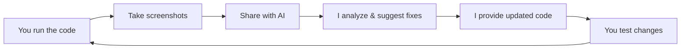

# 🤖 AI-Assisted Visual Development Guide

This guide enables iterative development where you can share screenshots with me (the AI) for visual feedback and improvements.

## Visual Feedback Loop Process

### 1. Initial Setup
```bash
# Open the visualization locally
cd DStudio
# Open index.html in your browser
# Or use a local server:
python -m http.server 8000
# Then visit http://localhost:8000
```

### 2. Screenshot Checklist for AI Review

When sharing screenshots with me, please capture:

#### 📱 Responsive Design Testing
- [ ] Desktop view (1920x1080)
- [ ] Tablet view (768x1024)
- [ ] Mobile view (375x667)
- [ ] Any broken layouts or overlapping elements

#### 🎨 Visual Elements
- [ ] Overall page layout
- [ ] Component hover states
- [ ] Modal/popup appearances
- [ ] Color contrast issues
- [ ] Typography rendering
- [ ] Spacing/alignment problems

#### 🐛 Issues to Capture
- [ ] JavaScript console errors (F12 → Console tab)
- [ ] Network errors (F12 → Network tab)
- [ ] Broken images or assets
- [ ] Performance issues (F12 → Performance tab)

### 3. How to Share Screenshots with Me

1. **Take the screenshot** following the checklist above
2. **Share it in our conversation** with context like:
   - "The mobile layout breaks at 400px width"
   - "The modal doesn't center properly"
   - "Colors need better contrast for accessibility"

### 4. What I Can Do With Your Visual Feedback

Based on your screenshots, I can:

✅ **Fix Layout Issues**
- Adjust CSS for responsive breakpoints
- Fix flexbox/grid problems
- Correct spacing and alignment

✅ **Improve Visual Design**
- Enhance color schemes
- Improve typography
- Add or adjust animations
- Refine component styling

✅ **Debug Problems**
- Identify JavaScript errors
- Fix broken functionality
- Resolve performance issues
- Correct accessibility problems

✅ **Iterate on UX**
- Improve user flows
- Enhance interactive elements
- Optimize loading states
- Refine error handling

### 5. Iteration Workflow



### 6. Quick Testing Commands

```bash
# Browser DevTools shortcuts
# F12 or Ctrl+Shift+I (Windows/Linux)
# Cmd+Option+I (Mac)

# Responsive design mode
# Ctrl+Shift+M (Windows/Linux)  
# Cmd+Option+M (Mac)

# Take screenshot in DevTools
# Ctrl+Shift+P → "Capture screenshot" (Chrome/Edge)
```

### 7. Example Feedback Format

```
"Here's a screenshot of the architecture page on mobile [screenshot]. 
Issues I noticed:
1. The component cards overflow on small screens
2. Text is too small to read
3. The modal close button is cut off
Can you fix these responsive issues?"
```

## Visual Testing Scenarios

### Test Case 1: Component Interactions
1. Click each component in the architecture diagram
2. Screenshot any modals that appear
3. Check if content is readable and properly formatted

### Test Case 2: Responsive Behavior
1. Resize browser from 1920px to 320px width
2. Screenshot at key breakpoints: 1200px, 768px, 480px, 320px
3. Note any layout breaks or overflow

### Test Case 3: Performance & Loading
1. Open DevTools Network tab
2. Refresh page
3. Screenshot load times and any failed resources
4. Check total page size

### Test Case 4: Accessibility
1. Use browser zoom (Ctrl/Cmd + Plus)
2. Test at 150% and 200% zoom
3. Screenshot any broken layouts
4. Test with browser reader mode if available

## Continuous Improvement

This visual feedback process enables:
- **Rapid iteration** on UI/UX issues
- **Real-world testing** across devices
- **Accessibility improvements** based on actual rendering
- **Performance optimization** from real metrics
- **Cross-browser compatibility** fixes

Share your screenshots anytime, and I'll help improve the implementation!
