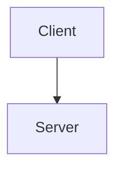

# Comprehensive UI Fix Action Plan

## Executive Summary

This action plan addresses ALL identified issues from:
1. CSS Issues Report (duplicate colors, !important, inconsistent fonts)
2. UI Design Review (navigation, typography, mobile, accessibility)
3. Content Quality Standards (visual-first, dense content, no verbose text)

## Solution Architecture

### 1. CSS Consolidation ✅ COMPLETED
**Created `unified-system.css`** that:
- Consolidates 7 CSS files into 1
- Eliminates duplicate color definitions
- Removes all !important declarations
- Standardizes font sizes with CSS variables
- Unifies component classes (cards, buttons, boxes)
- Implements proper dark mode
- Ensures mobile responsiveness
- Improves accessibility

### 2. Navigation & IA 🚧 IN PROGRESS
**Status**: Navigation emojis already removed from mkdocs.yml

**Next Steps**:
- Enable breadcrumbs in mkdocs.yml
- Add skip-to-content links via ui-enhancements.js
- Implement proper heading hierarchy
- Create section landing pages

### 3. Content Transformation 📋 TODO
**Apply unified system to all content**:
- Homepage and introduction sections
- All 7 law pages  
- 50+ pattern pages
- 20+ case studies
- Reference and tools sections

## Implementation Phases

### Phase 1: Foundation (Day 1-2) ✅
- [x] Create unified-system.css
- [x] Remove old CSS files from mkdocs.yml
- [x] Create migration helper script
- [x] Document implementation guide
- [x] Create content templates

### Phase 2: Critical Pages (Day 3-5)
- [ ] Transform homepage with hero section
- [ ] Update introduction pages
- [ ] Apply design system to law index pages
- [ ] Fix all responsive tables
- [ ] Remove emoji bullets site-wide

### Phase 3: Law Pages (Day 6-8)
- [ ] Apply law template to all 7 laws
- [ ] Add physics derivations
- [ ] Create comparison tables
- [ ] Add Mermaid diagrams
- [ ] Include failure scenarios

### Phase 4: Pattern Pages (Day 9-12)
- [ ] Transform 50+ patterns
- [ ] Add architecture diagrams
- [ ] Create trade-off matrices
- [ ] Build pattern cards
- [ ] Cross-reference laws

### Phase 5: Case Studies (Day 13-15)
- [ ] Apply case study template
- [ ] Add executive summaries
- [ ] Create metrics tables
- [ ] Include architecture diagrams
- [ ] Map to fundamental laws

### Phase 6: Polish & Test (Day 16-17)
- [ ] Test all pages on mobile
- [ ] Verify dark mode
- [ ] Check accessibility
- [ ] Validate HTML
- [ ] Performance optimization

## Quick Wins (Do First)

1. **Run Migration Helper**
   ```bash
   python migration-helper.py
   ```
   This will identify all issues to fix.

2. **Global Find & Replace**
   ```bash
   # Remove emoji bullets
   find docs -name "*.md" -exec sed -i 's/^- :[a-z_]*: /- /g' {} +
   
   # Fix hard-coded font sizes
   find docs -name "*.md" -exec sed -i 's/font-size: 1.1rem/font-size: var(--font-size-lg)/g' {} +
   ```

3. **Update All Tables**
   Add `class="responsive-table"` and `data-label` attributes.

4. **Fix Content Boxes**
   Replace custom boxes with unified classes.

## Specific Transformations

### For Each Page Type

#### Homepage
```html
<!-- Add hero section -->
<div class="hero-section">
  <h1 class="hero-title">Title</h1>
  <p class="hero-subtitle">Subtitle</p>
  <a href="#" class="hero-cta">CTA</a>
</div>

<!-- Use card grid for features -->
<div class="card-grid">
  <div class="card">...</div>
</div>
```

#### Law Pages
```html
<!-- Quick reference box -->
<div class="content-box axiom-box">
  <h3>The Law in Brief</h3>
  <p><strong>Definition</strong>: ...</p>
  <p><strong>Formula</strong>: ...</p>
</div>

<!-- Comparison table -->
<table class="responsive-table">
  <!-- Use data-label on all td elements -->
</table>
```

#### Pattern Pages
```html
<!-- Decision matrix -->
<div class="content-box decision-box">
  <h3>When to Use</h3>
  <table class="responsive-table">...</table>
</div>

<!-- Architecture diagram -->

```

## Quality Checklist

For every page updated:
- [ ] No emojis in headings or bullets
- [ ] Tables have responsive class
- [ ] Content boxes use unified classes
- [ ] Typography uses CSS variables
- [ ] Spacing uses CSS variables
- [ ] Images have alt text
- [ ] Links are descriptive
- [ ] Mobile view tested
- [ ] Dark mode tested

## Success Metrics

### Technical
- Zero !important declarations
- One unified CSS file
- All components use consistent classes
- 100% mobile responsive
- WCAG AA compliant

### Content
- Visual-first (tables/diagrams over text)
- No emoji clutter
- Consistent formatting
- Cross-referenced thoroughly
- Scannable structure

### Performance
- Page load < 3s
- CSS file < 50KB
- No render blocking
- Optimized images

## Tools & Scripts

### Migration Helper
```bash
python migration-helper.py
```

### Batch Updates
```bash
# Find all markdown files
find docs -name "*.md" | wc -l

# Find emoji bullets
grep -r "^- :[a-z_]*:" docs/

# Find tables without responsive class
grep -r "<table" docs/ | grep -v "responsive-table"

# Find hard-coded colors
grep -r "#5448C8\|#00BCD4" docs/
```

### Testing
```bash
# Local preview
mkdocs serve

# Build for production
mkdocs build

# Check for broken links
python -m http.server 8000 --directory site/
```

## Risk Mitigation

1. **Backup Current State**
   ```bash
   git branch backup-before-ui-fix
   git checkout -b ui-fix-implementation
   ```

2. **Incremental Updates**
   - Update one section at a time
   - Test thoroughly before moving on
   - Keep old CSS files as backup

3. **Rollback Plan**
   - Can revert mkdocs.yml to include old CSS
   - Git history preserves all changes
   - Document any custom overrides needed

## Expected Outcome

After implementation:
- Professional, clean appearance
- Consistent visual language
- Excellent mobile experience
- Improved accessibility
- Faster page loads
- Easier maintenance
- Higher content quality

## Next Steps

1. Review and approve this plan
2. Run migration helper to get current state
3. Start with Phase 2 (Critical Pages)
4. Update pages systematically
5. Test thoroughly
6. Deploy to production

This comprehensive approach ensures we fix ALL identified issues while maintaining site stability and improving the overall user experience.