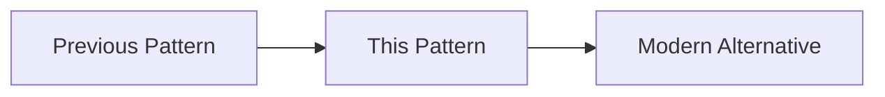
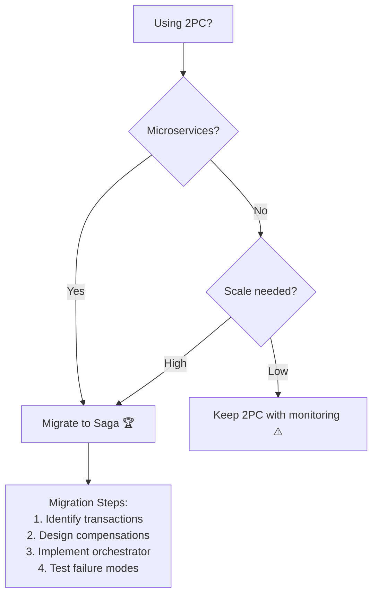
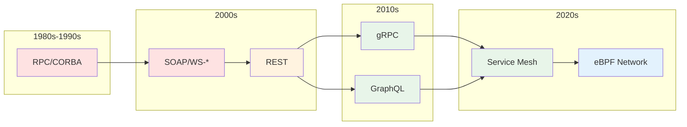

# DStudio Excellence Implementation Plan

## 🎯 Vision: Transform DStudio into a Living Time Machine for Distributed Systems Architecture

This plan details the transformation of DStudio from a comprehensive pattern catalog into a curated, living guide that honors the past while actively steering practitioners toward modern excellence.

---

## 📋 Executive Summary

### Core Philosophy
"Every pattern tells a story – mark its era, show its evolution, guide to modern alternatives."

### Key Outcomes
- **Three-Tier Classification System**: Gold (Elite 2025), Silver (Solid with caveats), Bronze (Historical context)
- **Evolution Tracking**: Timeline and genealogy for every pattern
- **Modern Excellence Layer**: Curated guides and elite case studies
- **Interactive Guidance**: Decision trees and migration paths
- **Living Documentation**: Quarterly updates and community contributions

### Timeline
- **12 weeks total** implementation
- **6 phases** with clear deliverables
- **Quarterly maintenance** thereafter

---

## Stage 1: Assessment & Foundation (Weeks 1-2)

### 🎯 Goals
- Classify all ~95 patterns into Gold/Silver/Bronze tiers
- Create pattern genealogy mappings
- Establish excellence criteria
- Update all pattern pages with tier labels

### 📝 Detailed Tasks

#### Week 1: Pattern Audit & Classification

**Day 1-2: Excellence Criteria Definition**
```yaml
Gold Standard (🏆):
  - Used by 3+ elite engineering teams (FAANG+ level)
  - Battle-tested at 100M+ user scale
  - Active development and community support
  - Has mature operational playbooks
  - Clear performance and reliability benefits
  
Silver Standard (🥈):
  - Widely used but with notable trade-offs
  - Being phased out by Gold patterns
  - Applicable only in specific contexts
  - Not yet adopted by largest-scale systems
  
Bronze Standard (🥉):
  - No longer go-to solution for most cases
  - Kept for education or very niche scenarios
  - Associated with older tech stacks
  - Has significant limitations
```

**Day 3-5: Pattern Classification Sprint**

1. **Communication Patterns**:
   - API Gateway → 🏆 Gold
   - Service Mesh → 🏆 Gold
   - Event-Driven → 🏆 Gold
   - Event Sourcing → 🥈 Silver
   - CQRS → 🥈 Silver
   - Saga → 🏆 Gold
   - GraphQL Federation → 🏆 Gold
   - Two-Phase Commit → 🥉 Bronze

2. **Resilience Patterns**:
   - Circuit Breaker → 🏆 Gold
   - Retry & Backoff → 🏆 Gold
   - Bulkhead → 🏆 Gold
   - Timeouts → 🏆 Gold
   - Health Check → 🏆 Gold
   - Load Shedding → 🏆 Gold

3. **Data Patterns**:
   - Sharding → 🏆 Gold
   - CRDT → 🏆 Gold
   - Event Streaming → 🏆 Gold
   - CDC → 🏆 Gold
   - Outbox → 🏆 Gold
   - Vector Clocks → 🥉 Bronze
   - Distributed Lock → 🥈 Silver

**Day 6-7: Front Matter Updates**

For each pattern page, add:
```yaml
---
title: Pattern Name
excellence_tier: Gold/Silver/Bronze
modern_alternatives: [Pattern1, Pattern2]
introduced: YYYY
peak_usage: YYYY-YYYY
superseded_by: PatternName (if applicable)
used_by_elite_teams: true/false
---
```

#### Week 2: Pattern Evolution & Navigation

**Day 8-9: Pattern Genealogy Mapping**

Create evolution timelines:
- Distributed Transactions: 2PC (1980s) → 3PC → Saga (2010s)
- Service Discovery: Static config → Zookeeper → Consul/etcd → Service Mesh
- Data Processing: Batch → MapReduce → Spark → Stream Processing
- Consistency: Vector Clocks → Logical Clocks → Hybrid Logical Clocks

**Day 10-11: Page Template Updates**

Add to each pattern page:
```markdown
!!! info "Pattern Status: [Tier Emoji] [Tier Name]"
    **Modern Status**: [One-line summary]
    **Introduced**: [Year]
    **Peak Usage**: [Years]
    **Current Alternative**: [Pattern links]

📅 **Pattern Evolution Timeline**

```

**Day 12-14: Navigation & Index Updates**

1. Update `patterns/index.md` with tier badges
2. Create tier-filtered views
3. Add "Modern Patterns Only" quick filter
4. Update pattern selector with tier awareness

### 📊 Deliverables

1. **Pattern Classification Spreadsheet**:
   - All 95 patterns classified
   - Rationale for each classification
   - Modern alternatives mapped

2. **Updated Pattern Pages**:
   - 100% have tier labels
   - 100% Bronze patterns link to alternatives
   - Evolution timelines added

3. **Navigation Improvements**:
   - Tier filtering enabled
   - Quick access to Gold patterns
   - Pattern genealogy visualization

### ✅ Success Criteria

- [ ] All patterns classified and labeled
- [ ] No Bronze pattern without modern alternative
- [ ] Pattern evolution documented
- [ ] Navigation supports tier filtering
- [ ] Team alignment on classifications

---

## Stage 2: Content Classification & Tagging (Weeks 3-4)

### 🎯 Goals
- Implement technical tagging system
- Create pattern comparison matrices
- Add "Used By" information
- Establish content templates

### 📝 Detailed Tasks

#### Week 3: Technical Implementation

**Day 15-17: Tagging System Setup**

1. Configure MkDocs tags plugin:
```yaml
plugins:
  - tags:
      tags_file: tags.md
```

2. Add tags to each pattern:
```yaml
tags:
  - excellence-gold
  - resilience
  - microservices
  - 2025-best-practice
```

3. Create tag index pages:
   - `/tags/excellence-gold.md`
   - `/tags/excellence-silver.md`
   - `/tags/excellence-bronze.md`

**Day 18-19: Pattern Comparison Matrices**

Create comparison tables:

| Need | Legacy (🥉) | Standard (🥈) | Elite (🏆) |
|------|--------------|----------------|-------------|
| Distributed Transactions | 2PC - Blocks entire system | TCC - Try-Confirm-Cancel | Saga + Outbox - Netflix standard |
| Service Discovery | Hardcoded/DNS | Consul/etcd registry | Service Mesh - Auto discovery |
| Real-time Updates | Polling - High latency | WebSockets - Good | WebRTC/CRDT - Discord/Figma |

**Day 20-21: "Used By" Research**

Add to each Gold pattern:
```markdown
### 🏢 Used in Production
- **Netflix**: 100B requests/day with Circuit Breaker
- **Uber**: Saga pattern for 20M rides/day
- **Discord**: WebRTC for 5M concurrent voice
```

#### Week 4: Content Templates & Standards

**Day 22-23: Pattern Page Template v2**

Standardize all pattern pages:
```markdown
---
[front matter with tier info]
---

# Pattern Name

!!! abstract "Excellence Status: [Tier] - [Summary]"

## 🎯 Problem
[What problem does this solve?]

## ✨ Solution  
[How it works]

## 📅 Pattern Evolution
[Timeline and context]

## 🏢 Production Usage
[Who uses this and why]

## 🔄 Modern Alternatives
[If Bronze/Silver, what to use instead]

## 📊 Trade-offs
[When to use vs not use]

## 🛠️ Implementation
[Code examples and architecture]

## 📚 References
[Papers, talks, case studies]
```

**Day 24-26: Bulk Content Updates**

- Apply template to all patterns
- Ensure consistency across tiers
- Add missing sections
- Update cross-references

**Day 27-28: Quality Assurance**

- Review all Gold patterns for completeness
- Verify Bronze→Gold migration paths
- Check comparison matrices accuracy
- Test tag filtering functionality

### 📊 Deliverables

1. **Fully Tagged Content**:
   - All patterns tagged by tier and category
   - Tag index pages created
   - Filter functionality working

2. **Comparison Matrices**:
   - 5+ domain comparisons (transactions, discovery, etc.)
   - Clear progression from Bronze→Silver→Gold

3. **Production Usage Data**:
   - Gold patterns have real-world examples
   - Company names and scale metrics
   - Source citations included

4. **Standardized Templates**:
   - All patterns follow v2 template
   - Consistent sections and formatting
   - Migration paths highlighted

### ✅ Success Criteria

- [ ] Tag filtering reduces content by 60%+ when "Gold only"
- [ ] Every Gold pattern cites 2+ production users
- [ ] Comparison matrices cover all major domains
- [ ] Templates consistently applied
- [ ] Zero broken cross-references

---

## Stage 3: Modern Excellence Layer (Weeks 5-6)

### 🎯 Goals
- Create flagship excellence guides
- Add elite engineering case studies
- Build curated learning paths
- Establish modern best practices narrative

### 📝 Detailed Tasks

#### Week 5: Excellence Guides Creation

**Day 29-31: Modern Distributed Systems 2025 Guide**

Create `/excellence/modern-distributed-systems-2025.md`:

```markdown
# Building Elite Distributed Systems in 2025

## 🎯 The Gold Standard Stack

### Foundation Layer
- **Orchestration**: Kubernetes (not just containers)
- **Service Mesh**: Istio/Linkerd (not manual discovery)
- **Observability**: OpenTelemetry (not just logs)

### Application Layer  
- **API**: GraphQL Federation or gRPC (not REST-only)
- **Events**: Kafka/Pulsar (not RabbitMQ)
- **Workflows**: Temporal/Cadence (not cron jobs)

### Data Layer
- **OLTP**: CockroachDB/Spanner (not single PostgreSQL)
- **OLAP**: ClickHouse/BigQuery (not same DB)
- **Cache**: Redis/KeyDB (not in-memory maps)

## 🏗️ Architecture Decisions

### Start With (Even at Small Scale)
1. API Gateway (Kong/Envoy) - Day 1
2. Structured Logging - Day 1  
3. Health Checks - Day 1
4. Circuit Breakers - Week 1
5. Distributed Tracing - Week 2

### Add at Growth (10K+ users)
1. Service Mesh - For > 5 services
2. Event Streaming - For async workflows
3. CQRS - For read-heavy paths
4. Multi-region - For global users
```

**Day 32-33: Platform Engineering Playbook**

Create `/excellence/platform-engineering-playbook.md`:
- GitOps with ArgoCD
- Progressive Delivery with Flagger
- Chaos Engineering with Litmus
- Policy as Code with OPA
- Cost Optimization with Kubecost

**Day 34-35: Real-Time Collaboration Guide**

Create `/excellence/real-time-collaboration.md`:
- CRDT fundamentals and implementation
- WebRTC for P2P communication
- Operational Transform comparison
- Conflict resolution strategies
- Edge computing for low latency

#### Week 6: Elite Case Studies

**Day 36-37: Stripe's API Evolution**
- Version management at scale
- Backwards compatibility strategies
- API governance and tooling
- Migration patterns used

**Day 38-39: Discord's Voice Architecture**
- 5M concurrent users design
- WebRTC at scale
- Geo-distributed voice servers
- Failover and quality management

**Day 40-41: Figma's CRDT Implementation**
- Multiplayer editor architecture
- CRDT vs OT decision process
- Performance optimizations
- Conflict resolution UX

**Day 42: Integration & Navigation**
- Add excellence section to main nav
- Create excellence landing page
- Cross-link from relevant patterns
- Add to learning paths

### 📊 Deliverables

1. **3 Flagship Guides**:
   - Modern Distributed Systems 2025 (5000+ words)
   - Platform Engineering Playbook (4000+ words)
   - Real-Time Collaboration (4000+ words)

2. **6 Elite Case Studies**:
   - Stripe, Discord, Figma (detailed above)
   - Linear, Vercel, Shopify (similar depth)
   - Each 2000+ words with diagrams

3. **Navigation Integration**:
   - Excellence section in top nav
   - Cross-links from patterns
   - Featured in learning paths

### ✅ Success Criteria

- [ ] Guides reference 20+ Gold patterns
- [ ] Case studies cite recent (2023+) developments
- [ ] Clear progression from theory to practice
- [ ] 10+ architecture diagrams created
- [ ] Beta reader feedback incorporated

---

## Stage 4: Interactive Guidance Tools (Weeks 7-8)

### 🎯 Goals
- Build interactive pattern selector
- Create migration decision trees
- Develop Architecture Decision Records (ADRs)
- Enable personalized learning paths

### 📝 Detailed Tasks

#### Week 7: Interactive Tools Development

**Day 43-44: Enhanced Pattern Selector**

Upgrade pattern selector with:
```javascript
// Tier filtering
const tierFilter = {
  gold: document.querySelector('#filter-gold'),
  silver: document.querySelector('#filter-silver'),
  bronze: document.querySelector('#filter-bronze')
};

// Dynamic recommendations
function recommendPattern(requirements) {
  if (requirements.distributedTransactions) {
    if (requirements.microservices) {
      return { pattern: 'Saga', tier: 'gold', 
               reason: 'Non-blocking, handles failures gracefully' };
    } else {
      return { pattern: '2PC', tier: 'bronze',
               warning: 'Consider Saga for better scalability' };
    }
  }
}
```

**Day 45-46: Migration Decision Trees**

Create interactive flowcharts:


**Day 47-48: Architecture Decision Records**

Create ADR templates and examples:
```markdown
# ADR-001: Migrating from 2PC to Saga Pattern

## Status
Accepted (2024-01-15)

## Context
- System: Payment processing for 1M+ daily transactions
- Problem: 2PC causing 5s p99 latency, coordinator failures block orders
- Scale: Growing 50% YoY

## Decision
Adopt Saga pattern with orchestration for distributed transactions

## Alternatives Considered
1. **Keep 2PC**: Rejected - Can't meet SLA at scale
2. **Event Choreography**: Rejected - Too complex for payment flows
3. **Saga Orchestration**: Selected - Clear flow, easier debugging

## Consequences
- ✅ Improved latency (5s → 500ms p99)
- ✅ Better failure isolation
- ⚠️ Requires idempotent operations
- ⚠️ Must handle partial states
```

#### Week 8: Personalization & Integration

**Day 49-50: Learning Path Personalization**

Add role/goal selection:
```markdown
## 🎯 Choose Your Mission

### I want to...
- [ ] Build a new system → Focus on Gold patterns only
- [ ] Modernize legacy → Include Bronze + migration guides  
- [ ] Learn fundamentals → Full historical context
- [ ] Prepare for interviews → Core patterns + trade-offs

### My role is...
- [ ] Platform Engineer → Infrastructure patterns
- [ ] Application Developer → App-level patterns
- [ ] Architect → All patterns + decisions
- [ ] Engineering Manager → Case studies + ROI
```

**Day 51-52: Migration Guide Library**

Create guides for top migrations:
1. 2PC → Saga
2. Monolith → Microservices
3. Batch → Stream Processing
4. VM → Container → Serverless
5. REST → GraphQL
6. Polling → WebSocket → WebRTC

**Day 53-54: Integration & Testing**

- Wire up all interactive elements
- Test decision trees with real scenarios
- Validate personalization logic
- Ensure mobile responsiveness

### 📊 Deliverables

1. **Interactive Pattern Selector v2**:
   - Tier filtering (hide Bronze option)
   - Contextual recommendations
   - "Used by" company logos
   - Complexity ratings with tier context

2. **10+ Migration Decision Trees**:
   - Major Bronze→Gold transitions
   - Step-by-step migration paths
   - Risk assessments
   - Timeline estimates

3. **ADR Library**:
   - 10+ real-world decision examples
   - Template for new ADRs
   - Categorized by domain
   - Linked from patterns

4. **Personalized Learning**:
   - 4 role-based paths
   - 4 goal-based filters
   - Dynamic content highlighting
   - Progress tracking

### ✅ Success Criteria

- [ ] 80% find relevant pattern in <3 clicks
- [ ] Migration guides cover all Bronze patterns
- [ ] ADRs demonstrate real trade-offs
- [ ] Personalization reduces content by 50%+
- [ ] Mobile experience fully functional

---

## Stage 5: Migration & Evolution Content (Weeks 9-10)

### 🎯 Goals
- Document pattern evolution stories
- Create migration playbooks
- Add timeline visualizations
- Build pattern family trees

### 📝 Detailed Tasks

#### Week 9: Evolution Documentation

**Day 55-57: Pattern Timeline Research**

Research and document for each pattern family:
```yaml
Distributed Transactions:
  - 1970s: Database transactions (ACID)
  - 1980s: Two-Phase Commit (X/Open XA)
  - 1987: Saga pattern paper (Garcia-Molina)
  - 2000s: Web services WS-Transaction
  - 2010s: Microservices → Saga adoption
  - 2015: Netflix Conductor (orchestration)
  - 2020s: Temporal/Cadence workflows

Service Communication:
  - 1990s: RPC (Sun RPC, CORBA)
  - 2000s: SOAP/XML web services
  - 2008: REST becomes dominant
  - 2015: gRPC released by Google
  - 2016: GraphQL public release
  - 2018: Service Mesh emergence
  - 2023: eBPF-based networking
```

**Day 58-60: Visual Timeline Creation**

Create pattern evolution diagrams:


#### Week 10: Migration Playbooks

**Day 61-62: Migration Pattern Library**

Document common migration patterns:
```markdown
## 🔄 Migration Patterns

### Strangler Fig Pattern
**Use when**: Gradually replacing monolith
**Timeline**: 6-18 months
**Risk**: Low (incremental)

### Big Bang Migration  
**Use when**: Small system, clear boundaries
**Timeline**: 1-3 months
**Risk**: High (all at once)

### Parallel Run Pattern
**Use when**: Critical systems needing validation
**Timeline**: 3-6 months
**Risk**: Low (but expensive)
```

**Day 63-64: Company Migration Stories**

Document real migrations:
```markdown
## 📚 Migration Case Studies

### Netflix: Monolith → Microservices (2008-2012)
- **Start**: DVD shipping monolith
- **Catalyst**: AWS migration need
- **Approach**: Service by service
- **Key Learning**: Circuit breakers critical

### Uber: Monolith → Microservices (2014-2016)
- **Start**: Python monolith
- **Catalyst**: Hypergrowth scaling
- **Approach**: Domain boundaries first
- **Key Learning**: Data consistency hardest
```

**Day 65-66: Pattern Deprecation Guide**

Create sunset guidelines:
```markdown
## 🌅 Pattern Deprecation Playbook

### Phase 1: Identify (Month 1)
- Usage metrics collection
- Cost analysis
- Risk assessment

### Phase 2: Plan (Month 2-3)
- Migration strategy selection
- Resource allocation
- Timeline creation

### Phase 3: Execute (Month 4-12)
- Gradual rollout
- Monitoring both systems
- Rollback procedures

### Phase 4: Cleanup (Month 13+)
- Remove old code
- Document lessons
- Update runbooks
```

### 📊 Deliverables

1. **Pattern Evolution Database**:
   - 20+ pattern families documented
   - Introduction dates and contexts
   - Peak usage periods
   - Succession relationships

2. **Visual Timeline Gallery**:
   - 10+ mermaid evolution diagrams
   - Interactive timeline page
   - Pattern family trees
   - Technology wave visualization

3. **Migration Playbook Collection**:
   - 10+ migration strategies
   - 20+ real company stories
   - Risk/benefit analysis
   - Timeline templates

4. **Deprecation Framework**:
   - Sunset process documentation
   - Metrics for deprecation decisions
   - Communication templates
   - Legacy system handling

### ✅ Success Criteria

- [ ] Every Bronze pattern has migration story
- [ ] Visual timelines for major families
- [ ] 5+ detailed company migrations
- [ ] Playbooks cover 80% of scenarios
- [ ] Clear deprecation criteria established

---

## Stage 6: Living Documentation System (Weeks 11-12)

### 🎯 Goals
- Implement pattern health metrics
- Establish quarterly review process
- Enable community contributions
- Create feedback loops

### 📝 Detailed Tasks

#### Week 11: Metrics & Monitoring

**Day 67-68: Pattern Health Dashboard**

Create metrics tracking:
```yaml
Pattern Health Metrics:
  - GitHub stars (for reference implementations)
  - Stack Overflow questions (trend)
  - Conference talks (annual count)
  - Job posting mentions
  - Community PRs/issues
  - Last significant update
```

Implement dashboard:
```markdown
## 📊 Pattern Health: Service Mesh

### Adoption Metrics
- **GitHub Stars**: Istio (33k↑), Linkerd (9k↑)
- **SO Questions**: 2,500/month (↑15% YoY)
- **Conference Talks**: 47 at KubeCon 2024
- **Job Postings**: 5,000+ roles mention it

### Trend: 📈 Growing rapidly
### Status: 🏆 Gold (Confirmed Q1 2025)
```

**Day 69-70: Automated Freshness Checks**

Build tooling to detect:
- Patterns not updated in 6+ months
- Broken links to external resources  
- Outdated version references
- Missing modern alternatives
- Stale usage examples

**Day 71-72: Community Contribution Framework**

Create contribution guides:
```markdown
## 🤝 Contributing Pattern Updates

### How to Propose Tier Changes
1. Open GitHub issue with evidence
2. Include adoption metrics
3. Cite 3+ production uses
4. Community discussion (2 weeks)
5. Maintainer review & decision

### How to Add "Used In Production"
- Fork and add company usage
- Include scale metrics
- Provide public reference
- Submit PR with evidence
```

#### Week 12: Process & Automation

**Day 73-74: Quarterly Review Process**

Document review checklist:
```markdown
## 📅 Quarterly Pattern Review

### Pre-Review (Week -1)
- [ ] Gather metrics updates
- [ ] Review community feedback
- [ ] Check industry trends
- [ ] Analyze search traffic

### Review Meeting (Day 1)
- [ ] Tier reassessments
- [ ] New pattern candidates
- [ ] Deprecation decisions
- [ ] Content gap analysis

### Post-Review (Week 1)
- [ ] Update pattern tiers
- [ ] Publish changelog
- [ ] Notify community
- [ ] Plan next quarter
```

**Day 75-76: Change Communication**

Set up notification system:
- Changelog page with RSS
- GitHub releases for major updates
- Email newsletter (optional)
- Social media updates

**Day 77-78: Future-Proofing**

Create processes for:
- Emerging pattern identification
- Experimental tier (pre-Bronze)
- Fast-track Gold promotion
- Community voting mechanism

### 📊 Deliverables

1. **Pattern Health System**:
   - Metrics dashboard for top 20 patterns
   - Automated freshness reports
   - Trend visualization
   - Alert system for major changes

2. **Community Framework**:
   - Contribution guidelines
   - Issue/PR templates
   - Review criteria
   - Recognition system

3. **Quarterly Process**:
   - Documented review process
   - Meeting templates
   - Decision criteria
   - Communication plan

4. **Automation Tools**:
   - Link checker
   - Metrics collector
   - Changelog generator
   - Update notifications

### ✅ Success Criteria

- [ ] Health metrics for all Gold patterns
- [ ] Quarterly reviews scheduled for next year
- [ ] 10+ community contributions received
- [ ] Zero patterns >6 months without review
- [ ] Automated alerts functioning

---

## 📊 Overall Success Metrics

### Quantitative Goals

1. **Navigation Efficiency**
   - 80% find relevant Gold pattern in <3 clicks
   - Search-to-answer time reduced by 50%

2. **Content Relevance**
   - 100% Bronze patterns have modern alternatives
   - 100% Gold patterns have production examples
   - Zero broken cross-references

3. **Community Engagement**
   - 20+ community contributions in first quarter
   - 100+ GitHub stars increase
   - 5+ external sites reference our guides

4. **Maintenance Velocity**
   - Quarterly reviews completed in <1 week
   - New patterns added within 30 days of emergence
   - Tier changes decided within 14 days

### Qualitative Goals

1. **User Confidence**
   - "I know exactly what to use for my problem"
   - "I understand why patterns evolved"
   - "I can justify my architecture decisions"

2. **Industry Recognition**
   - Referenced in conference talks
   - Cited in technical decisions
   - Recommended by thought leaders

3. **Future-Proof Framework**
   - Easy to add new patterns
   - Clear criteria for changes
   - Sustainable maintenance model

---

## 🚀 Launch Plan

### Soft Launch (Week 13)
- Beta access for contributors
- Feedback collection
- Bug fixes and adjustments
- Performance optimization

### Public Launch (Week 14)
- Announcement blog post
- Social media campaign
- Conference lightning talks
- Partner notifications

### Post-Launch (Week 15+)
- Monitor metrics
- Address feedback
- Plan Q2 improvements
- Celebrate success! 🎉

---

## 🎯 Long-Term Vision

### Year 1: Foundation
- Complete excellence transformation
- Establish quarterly rhythm
- Build community trust
- Achieve 50k+ monthly users

### Year 2: Expansion  
- Add emerging domains (AI/ML, Edge, Quantum)
- Video content and tutorials
- Certification program
- 100k+ monthly users

### Year 3: Standard
- Industry reference standard
- University curriculum adoption  
- Book deal potential
- Conference track dedicated

---

## 📝 Key Risks & Mitigations

| Risk | Impact | Mitigation |
|------|--------|------------|
| Classification disagreements | High | Clear criteria, community input |
| Maintenance burden | Medium | Automation, community help |
| Content staleness | High | Quarterly reviews, metrics |
| Over-complexity | Medium | Progressive disclosure |
| Breaking changes | Low | Careful redirects, preservation |

---

## ✅ Implementation Checklist

### Pre-Implementation
- [ ] Team alignment on vision
- [ ] Resource allocation confirmed
- [ ] Tool selection completed
- [ ] Beta reviewers identified

### During Implementation  
- [ ] Weekly progress reviews
- [ ] Continuous stakeholder updates
- [ ] Risk tracking
- [ ] Quality gates at each stage

### Post-Implementation
- [ ] Success metrics tracking
- [ ] Retrospective conducted
- [ ] Process documentation
- [ ] Celebration planned!

---

## 🙏 Acknowledgments

This transformation plan builds on the collective wisdom of the distributed systems community. Special thanks to all who will contribute patterns, stories, and feedback to make DStudio the definitive resource for distributed systems excellence.

*"The best time to plant a tree was 20 years ago. The second best time is now."*

Let's build the future of distributed systems documentation together! 🚀