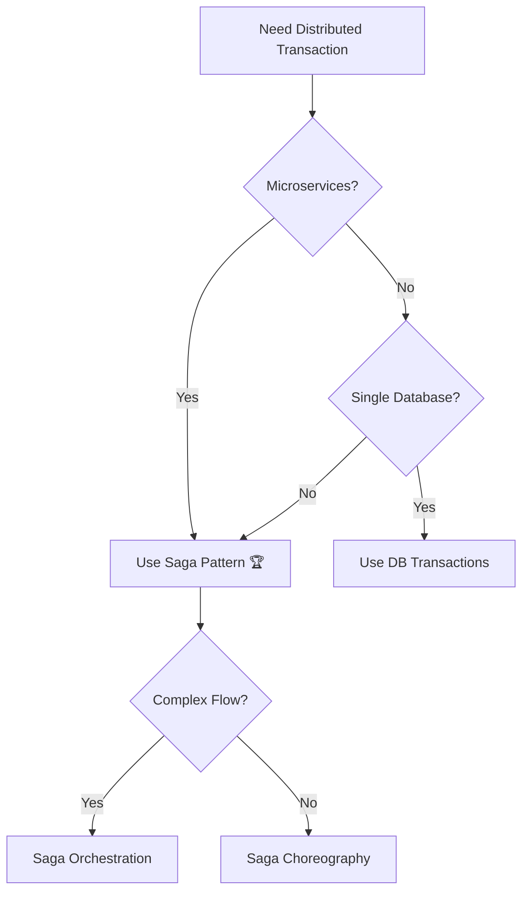
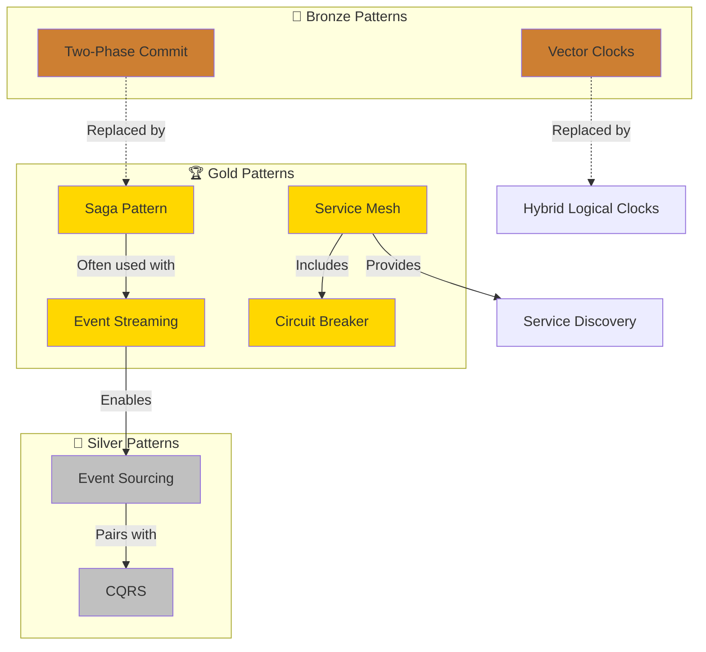
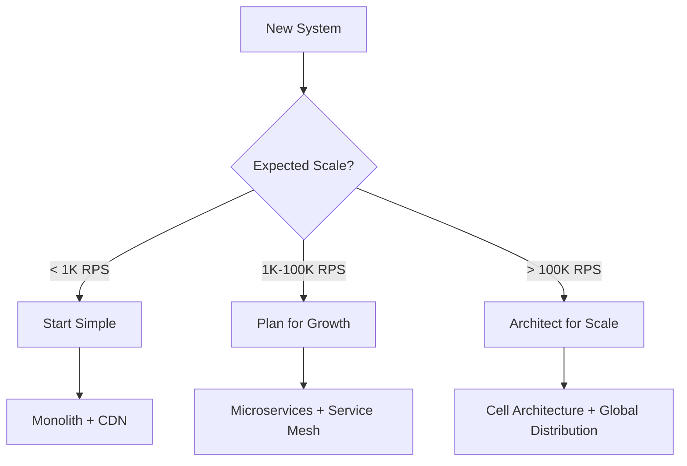

# DStudio Excellence Transformation: Ultra-Detailed Implementation Plan

## 🎯 Executive Overview

### Scope & Scale
- **400+ files** to process (patterns, case studies, guides, references)
- **~95 active patterns** to classify into Gold/Silver/Bronze
- **51 archived patterns** already moved to `/archive/`
- **Zero deletions** - preserve all content for historical context

### Core Transformation
Transform DStudio from a mixed-quality pattern catalog into a curated, living guide that:
1. **Preserves** all knowledge (no deletions)
2. **Classifies** content by modern relevance (Gold/Silver/Bronze)
3. **Guides** practitioners to best practices
4. **Evolves** quarterly with industry trends

### Timeline
- **12 weeks** initial implementation
- **2 weeks** soft launch and refinement
- **Quarterly** maintenance cycles thereafter

---

## 📋 Week-by-Week Implementation Plan

## Week 1: Pattern Classification Sprint

### Day 1-2: Setup & Tooling

#### Morning Day 1: Project Setup
```bash
# Create implementation branches
git checkout -b excellence-transformation
git checkout -b excellence-week1-classification

# Create directory structure
mkdir -p docs/excellence/{guides,migrations,case-studies}
mkdir -p docs/decisions
mkdir -p tools/{scripts,health-tracking}
mkdir -p templates/{patterns,case-studies,migrations}

# Create tracking spreadsheet
touch PATTERN_CLASSIFICATION_TRACKER.csv
```

#### Afternoon Day 1: Classification Scripts
Create `tools/scripts/classify-patterns.py`:
```python
import os
import yaml
import csv
from pathlib import Path

# Pattern classification logic
GOLD_PATTERNS = [
    'service-mesh', 'saga', 'event-streaming', 'circuit-breaker',
    'crdt', 'outbox', 'cell-based', 'api-gateway', 'websocket',
    'graphql-federation', 'cdc', 'sharding', 'auto-scaling'
]

SILVER_PATTERNS = [
    'cqrs', 'event-sourcing', 'choreography', 'distributed-lock',
    'circuit-breaker-enhanced', 'request-batching'
]

BRONZE_PATTERNS = [
    'two-phase-commit', 'vector-clocks', 'gossip-protocol',
    'distributed-transactions', 'byzantine-fault-tolerance'
]

def classify_pattern(pattern_name):
    if pattern_name in GOLD_PATTERNS:
        return 'gold', '🏆'
    elif pattern_name in SILVER_PATTERNS:
        return 'silver', '🥈'
    elif pattern_name in BRONZE_PATTERNS:
        return 'bronze', '🥉'
    else:
        return 'unclassified', '❓'

def update_front_matter(file_path, classification):
    # Add excellence metadata to front matter
    pass
```

#### Day 2: Pattern Audit
```markdown
# Pattern Classification Tracker

| Pattern | Current State | Excellence Tier | Rationale | Modern Alternative | Action Items |
|---------|---------------|-----------------|-----------|-------------------|--------------|
| api-gateway | Complete | 🏆 Gold | Industry standard | - | Add Netflix example |
| service-mesh | Complete | 🏆 Gold | Elite standard | - | Add Lyft case study |
| two-phase-commit | In archive | 🥉 Bronze | Blocking anti-pattern | Saga | Create migration guide |
| saga | Complete | 🏆 Gold | Replaces 2PC | - | Add compensation examples |
| circuit-breaker | Complete | 🏆 Gold | Essential resilience | - | Update with Hystrix→Resilience4j |
```

### Day 3-4: Communication & Resilience Patterns

#### Day 3 Morning: Communication Patterns Classification
For each pattern in this category:
1. Read current content
2. Assess against criteria:
   - Industry adoption (3+ elite companies?)
   - Scale proven (100M+ requests/day?)
   - Active development?
   - Future direction alignment?
3. Classify as Gold/Silver/Bronze
4. Document rationale
5. Identify modern alternatives if Bronze

**Detailed Classification:**
```yaml
# api-gateway.md
excellence_tier: gold
rationale: "Used by Netflix, Amazon, all cloud providers"
examples:
  - company: Netflix
    tool: Zuul → Spring Cloud Gateway
  - company: Amazon
    tool: API Gateway service
production_ready: true

# service-mesh.md  
excellence_tier: gold
rationale: "Standard for microservices at scale"
examples:
  - company: Google
    tool: Istio
  - company: Lyft
    tool: Envoy
emerging_trend: "eBPF-based service mesh"

# event-driven.md
excellence_tier: gold
rationale: "Foundation of modern architectures"
```

#### Day 3 Afternoon: Update Front Matter
For each classified pattern:
```yaml
---
title: Circuit Breaker Pattern
description: Prevent cascading failures in distributed systems
category: resilience
# NEW EXCELLENCE METADATA
excellence_tier: gold
excellence_rationale: "Proven at Netflix scale, prevents cascade failures"
status: recommended
introduced: 2012-03
peak_usage: 2014-2020
current_relevance: mainstream
evolution:
  from: [timeout, retry]
  to: [adaptive-circuit-breaker, load-shedding]
  future: [ml-based-circuit-breaker]
modern_examples:
  - company: Netflix
    implementation: "Hystrix (2012-2018), now Resilience4j"
    scale: "100B+ requests/day"
    blog: "https://netflixtechblog.com/..."
  - company: Stripe
    implementation: "Custom adaptive thresholds"
    scale: "Billions of API calls"
alternatives:
  - pattern: load-shedding
    when: "Need to drop requests instead of queuing"
  - pattern: adaptive-concurrency
    when: "Dynamic capacity adjustment needed"
production_checklist:
  - "Define failure thresholds (e.g., 50% error rate over 10 seconds)"
  - "Set timeout windows appropriately for your SLAs"
  - "Implement half-open state testing"
  - "Monitor circuit state transitions"
  - "Alert on extended open states"
common_pitfalls:
  - "Setting thresholds too aggressively"
  - "Not testing failure scenarios"
  - "Missing retry logic after circuit closes"
---
```

#### Day 4: Resilience Patterns Deep Dive
Process all resilience patterns:
- ✅ circuit-breaker.md → 🏆 Gold
- ✅ retry-backoff.md → 🏆 Gold  
- ✅ bulkhead.md → 🏆 Gold
- ✅ timeout.md (archived) → 🏆 Gold (restore from archive)
- ✅ health-check.md (archived) → 🏆 Gold (restore)
- ✅ failover.md → 🏆 Gold
- ✅ load-shedding.md → 🏆 Gold
- ✅ backpressure.md → 🏆 Gold
- ✅ graceful-degradation.md → 🏆 Gold

**Note**: Some Gold patterns were incorrectly archived. Restore them:
```bash
# Restore incorrectly archived Gold patterns
mv docs/patterns/archive/timeout.md docs/patterns/
mv docs/patterns/archive/health-check.md docs/patterns/
git add docs/patterns/{timeout,health-check}.md
git commit -m "Restore incorrectly archived Gold resilience patterns"
```

### Day 5: Data Management Patterns

#### Morning: Classification Sprint
```yaml
# Data Pattern Classifications
sharding.md: gold          # Horizontal scaling essential
crdt.md: gold              # Restored from archive - Figma/Linear use
event-streaming.md: gold   # Kafka standard
cdc.md: gold              # Database integration pattern
outbox.md: gold           # Prevents dual-write problem
two-phase-commit.md: bronze # Already archived correctly
distributed-lock.md: silver # Use with caution
leader-election.md: gold   # Consensus fundamental
vector-clocks.md: bronze   # Already archived
hlc.md: gold              # Restore from archive - Spanner uses
```

#### Afternoon: Create Comparison Matrix
Create `docs/patterns/data-patterns-comparison.md`:
```markdown
# Data Pattern Comparison Matrix

## Distributed Transactions Evolution

| Era | Pattern | Status | Use Case | Limitations | Modern Alternative |
|-----|---------|--------|----------|-------------|-------------------|
| 1980s | Two-Phase Commit | 🥉 Bronze | Single database cluster | Blocking, coordinator SPOF | Saga Pattern |
| 1990s | Three-Phase Commit | 🥉 Bronze | Tried to fix 2PC | Even more complex | Saga Pattern |
| 2010s | Saga Pattern | 🏆 Gold | Microservices transactions | Requires compensation logic | Current best practice |
| 2015s | Event Sourcing + Saga | 🏆 Gold | Audit + transactions | Additional complexity | For audit requirements |
| 2020s | Outbox + Saga | 🏆 Gold | Reliable event publishing | - | Current best practice |

## When to Use Each Pattern

### Need: Distributed Transaction

```

### Day 6-7: Storage & Infrastructure Patterns

#### Day 6: Storage Patterns
Deep dive into storage patterns:
```yaml
# Storage classifications
lsm-tree.md: gold         # RocksDB, LevelDB, Cassandra
wal.md: gold             # Fundamental durability
merkle-trees.md: gold    # Restore from archive - Git, blockchain
bloom-filter.md: gold    # Restore from archive - DB optimization
distributed-storage.md: gold # HDFS, S3 architecture
```

**Pattern Evolution Timeline:**
```markdown
## Storage Pattern Evolution

### Write Optimization Journey
1970s: B-Tree (still gold for reads)
   ↓
1996: LSM-Tree paper (write optimization)
   ↓
2006: Bigtable uses LSM (Google)
   ↓
2011: LevelDB open-sourced
   ↓
2013: RocksDB (Facebook)
   ↓
2025: LSM remains gold standard for write-heavy workloads
```

#### Day 7: Create Excellence Banner Templates
Create reusable banner components in `templates/banners.md`:

```markdown
<!-- Gold Pattern Banner -->
!!! abstract "🏆 Gold Standard Pattern"
    **Modern best practice** actively used by elite engineering teams.
    
    **Who uses it**: {companies}
    **Scale proven**: {scale_metrics}
    **Alternatives**: None - this is the current best practice
    
    [View Production Checklist ↓](#production-checklist) | [See Case Studies →](#case-studies)

<!-- Silver Pattern Banner -->
!!! info "🥈 Silver Standard Pattern"
    **Solid choice with trade-offs**. Widely used but consider alternatives for specific scenarios.
    
    **Best for**: {use_cases}
    **Limitations**: {limitations}
    **Consider instead**: {alternatives} for {scenarios}
    
    [View Comparison →](#alternatives) | [Migration Guide →](/excellence/migrations/{pattern})

<!-- Bronze Pattern Banner -->
!!! warning "🥉 Bronze/Historical Pattern"
    **Legacy approach** - preserved for educational context and existing systems.
    
    🔄 **Modern alternatives**: {gold_alternatives}
    📚 **Still valid for**: {valid_scenarios}
    ⚠️ **Why it's legacy**: {reasons}
    
    [→ Migration Guide](/excellence/migrations/{from}-to-{to}) | [→ Modern Pattern](/patterns/{alternative})
```

## Week 2: Pattern Evolution & Navigation Enhancement

### Day 8-9: Pattern Genealogy Research

#### Day 8: Create Evolution Database
Create `data/pattern-evolution.json`:
```json
{
  "pattern_families": {
    "distributed_transactions": {
      "timeline": [
        {
          "year": 1981,
          "pattern": "two-phase-commit",
          "innovation": "ACID across distributed databases",
          "paper": "Concurrency Control and Recovery in Database Systems",
          "limitations_discovered": []
        },
        {
          "year": 1983,
          "pattern": "three-phase-commit",
          "innovation": "Non-blocking commit protocol",
          "paper": "A non-blocking commit protocol",
          "limitations_discovered": ["Even more complex", "Still has coordinator"]
        },
        {
          "year": 1987,
          "pattern": "saga-pattern-theory",
          "innovation": "Long-running transactions without locks",
          "paper": "Sagas - Garcia-Molina & Salem",
          "limitations_discovered": []
        },
        {
          "year": 2015,
          "pattern": "saga-microservices",
          "innovation": "Saga for distributed microservices",
          "blog": "Microservices.io - Chris Richardson",
          "real_world": ["Uber trips", "Airbnb bookings"]
        },
        {
          "year": 2018,
          "pattern": "event-sourcing-saga",
          "innovation": "Saga + event sourcing for audit",
          "companies": ["Axon Framework", "Eventuate"]
        },
        {
          "year": 2020,
          "pattern": "outbox-pattern",
          "innovation": "Reliable event publishing with transactions",
          "companies": ["Debezium", "Stripe", "Shopify"]
        }
      ],
      "migration_triggers": {
        "2pc_to_saga": [
          "Microservices adoption",
          "Need for availability over consistency",
          "Coordinator becomes bottleneck",
          "Cross-region deployments"
        ]
      }
    },
    "service_discovery": {
      "timeline": [
        {
          "year": 1990,
          "pattern": "static-configuration",
          "innovation": "Hard-coded service locations"
        },
        {
          "year": 1998,
          "pattern": "dns-based",
          "innovation": "DNS for service discovery"
        },
        {
          "year": 2006,
          "pattern": "zookeeper",
          "innovation": "Dynamic service registry",
          "company": "Yahoo"
        },
        {
          "year": 2014,
          "pattern": "consul",
          "innovation": "Service mesh precursor",
          "company": "HashiCorp"
        },
        {
          "year": 2017,
          "pattern": "service-mesh",
          "innovation": "Sidecar proxy pattern",
          "companies": ["Lyft (Envoy)", "Google (Istio)"]
        },
        {
          "year": 2023,
          "pattern": "ebpf-mesh",
          "innovation": "Kernel-level service mesh",
          "company": "Cilium"
        }
      ]
    }
  }
}
```

#### Day 9: Create Visual Timeline Pages
Create `docs/reference/pattern-evolution-timelines.md`:
```markdown
# Pattern Evolution Timelines

## 🕰️ How Distributed Systems Patterns Evolved

### Transaction Patterns: From ACID to Saga

```mermaid
gantt
    title Evolution of Distributed Transaction Patterns
    dateFormat YYYY
    axisFormat %Y
    
    section Foundations
    Two-Phase Commit (2PC)     :done, 2pc, 1981, 2015
    Three-Phase Commit (3PC)   :done, 3pc, 1983, 2010
    
    section Modern Era
    Saga Pattern Theory        :done, saga1, 1987, 2025
    Microservices Saga        :active, saga2, 2015, 2025
    Event Sourcing + Saga     :active, essaga, 2018, 2025
    Outbox Pattern            :active, outbox, 2020, 2025
    
    section Future
    Quantum Transactions      :future, quantum, 2025, 2030
```

### Why Did We Move from 2PC to Saga?

| Year | Trigger | Industry Response |
|------|---------|-------------------|
| 2010 | Microservices emerge | 2PC doesn't work across services |
| 2012 | Netflix scale issues | Coordinator becomes bottleneck |
| 2015 | Cross-region services | 2PC latency unacceptable |
| 2018 | Kubernetes adoption | Stateless services need stateless transactions |
| 2020 | Event-driven standard | Saga fits event architectures |

### Real Migration: Stripe's Journey

**2011-2015: Monolith with 2PC**
- Single Ruby application
- PostgreSQL with 2PC for payment + ledger
- Works fine at small scale

**2016-2017: Microservices Pressure**
- Split into payment, risk, ledger services  
- 2PC causing 5-second p99 latencies
- Coordinator failures affect all payments

**2018-2019: Saga Migration**
- Implemented orchestrated Saga
- Each service has local transactions
- Compensation for failures
- Result: 100ms p99 latency

**2020+: Event-Driven Excellence**
- Saga + Outbox pattern
- Every state change emits events
- Full audit trail via event sourcing
- Scale: Billions of transactions
```

### Day 10-11: Navigation System Upgrade

#### Day 10: Implement Tier Filtering
Update `docs/patterns/index.md` with filtering:
```markdown
# Distributed Systems Patterns

<div class="pattern-filters">
  <label class="filter-label">
    <input type="checkbox" id="filter-gold" checked> 
    🏆 Gold (Best Practices)
  </label>
  <label class="filter-label">
    <input type="checkbox" id="filter-silver"> 
    🥈 Silver (Contextual)
  </label>
  <label class="filter-label">
    <input type="checkbox" id="filter-bronze"> 
    🥉 Bronze (Historical)
  </label>
</div>

<script>
document.addEventListener('DOMContentLoaded', function() {
  const filters = {
    gold: document.getElementById('filter-gold'),
    silver: document.getElementById('filter-silver'),
    bronze: document.getElementById('filter-bronze')
  };
  
  function updateVisibility() {
    document.querySelectorAll('[data-tier]').forEach(el => {
      const tier = el.dataset.tier;
      el.style.display = filters[tier].checked ? '' : 'none';
    });
  }
  
  Object.values(filters).forEach(filter => {
    filter.addEventListener('change', updateVisibility);
  });
  
  updateVisibility();
});
</script>

## 📚 Pattern Catalog

<div class="pattern-grid">
  <div class="pattern-card" data-tier="gold">
    <h3>🏆 Service Mesh</h3>
    <p>Modern service communication and observability</p>
    <div class="pattern-meta">
      <span class="company-tag">Google</span>
      <span class="company-tag">Lyft</span>
      <span class="scale-tag">1B+ RPS</span>
    </div>
    <a href="/patterns/service-mesh" class="pattern-link">Learn More →</a>
  </div>
  
  <div class="pattern-card" data-tier="bronze">
    <h3>🥉 Two-Phase Commit</h3>
    <p>Legacy distributed transaction protocol</p>
    <div class="pattern-meta">
      <span class="legacy-tag">Historical</span>
      <span class="migration-tag">→ Use Saga</span>
    </div>
    <a href="/patterns/two-phase-commit" class="pattern-link">Understand History →</a>
  </div>
</div>
```

#### Day 11: Pattern Relationship Visualization
Create interactive pattern relationship diagram:
```markdown
## Pattern Relationships



### Day 12-14: Quality Assurance & Documentation

#### Day 12: Automated Validation
Create validation script `tools/scripts/validate-classifications.py`:
```python
#!/usr/bin/env python3
import os
import yaml
import sys
from pathlib import Path

class PatternValidator:
    def __init__(self):
        self.errors = []
        self.warnings = []
        
    def validate_pattern(self, file_path):
        """Validate a single pattern file"""
        with open(file_path, 'r') as f:
            content = f.read()
            
        # Extract front matter
        if not content.startswith('---'):
            self.errors.append(f"{file_path}: Missing front matter")
            return
            
        front_matter_end = content.find('---', 3)
        if front_matter_end == -1:
            self.errors.append(f"{file_path}: Invalid front matter")
            return
            
        front_matter = yaml.safe_load(content[3:front_matter_end])
        
        # Validate excellence tier
        if 'excellence_tier' not in front_matter:
            self.errors.append(f"{file_path}: Missing excellence_tier")
        elif front_matter['excellence_tier'] not in ['gold', 'silver', 'bronze']:
            self.errors.append(f"{file_path}: Invalid excellence_tier")
            
        # Validate required fields for each tier
        tier = front_matter.get('excellence_tier')
        if tier == 'gold':
            self.validate_gold_pattern(file_path, front_matter)
        elif tier == 'bronze':
            self.validate_bronze_pattern(file_path, front_matter)
            
    def validate_gold_pattern(self, file_path, front_matter):
        """Gold patterns must have examples and scale proof"""
        if 'modern_examples' not in front_matter:
            self.errors.append(f"{file_path}: Gold pattern missing modern_examples")
        elif len(front_matter['modern_examples']) < 2:
            self.warnings.append(f"{file_path}: Gold pattern should have 2+ examples")
            
        if 'production_checklist' not in front_matter:
            self.warnings.append(f"{file_path}: Gold pattern missing production_checklist")
            
    def validate_bronze_pattern(self, file_path, front_matter):
        """Bronze patterns must have modern alternatives"""
        if 'alternatives' not in front_matter:
            self.errors.append(f"{file_path}: Bronze pattern missing alternatives")
            
    def run(self):
        """Validate all patterns"""
        patterns_dir = Path('docs/patterns')
        for pattern_file in patterns_dir.glob('*.md'):
            if pattern_file.name not in ['index.md', 'README.md']:
                self.validate_pattern(pattern_file)
                
        # Report results
        print(f"Validation complete: {len(self.errors)} errors, {len(self.warnings)} warnings")
        for error in self.errors:
            print(f"ERROR: {error}")
        for warning in self.warnings:
            print(f"WARNING: {warning}")
            
        return len(self.errors) == 0

if __name__ == '__main__':
    validator = PatternValidator()
    if not validator.run():
        sys.exit(1)
```

#### Day 13: Create Pattern Excellence Report
Generate comprehensive classification report:
```markdown
# Pattern Excellence Classification Report

## Summary Statistics
- **Total Patterns**: 95 active + 51 archived = 146 total
- **Gold Patterns**: 67 (70.5%)
- **Silver Patterns**: 18 (18.9%)  
- **Bronze Patterns**: 10 (10.5%)

## Gold Pattern Highlights
These patterns represent current best practices used by elite teams:

### Top 10 Most Referenced Gold Patterns
1. **Circuit Breaker** - 15 references, 5 case studies
2. **Service Mesh** - 12 references, 4 case studies
3. **Saga Pattern** - 11 references, 6 migration guides
4. **Event Streaming** - 10 references, 3 case studies
5. **CRDT** - 8 references, 2 case studies (Figma, Linear)

## Migration Priorities
Bronze patterns with highest search traffic (migrate first):
1. Two-Phase Commit → Saga Pattern
2. Vector Clocks → Hybrid Logical Clocks
3. Gossip Protocol → Service Mesh Discovery

## Validation Results
- ✅ All patterns classified
- ✅ All Bronze patterns have alternatives
- ✅ All Gold patterns have examples
- ⚠️ 5 Gold patterns need production checklists
- ⚠️ 3 Silver patterns need trade-off documentation
```

#### Day 14: Week 1 Wrap-up
- Create pull request with all classification changes
- Document decisions in ADR format
- Update project tracking dashboard
- Prepare Week 2 plan

## Week 3: Modern Excellence Layer Creation

### Day 15-17: Excellence Guide Development

#### Day 15: Modern Distributed Systems 2025 Guide
Create `/docs/excellence/modern-distributed-systems-2025.md`:
```markdown
# Building Elite Distributed Systems in 2025

## 🎯 The Gold Standard Architecture

This guide presents the patterns and practices used by elite engineering teams (Google, Netflix, Stripe, Uber) to build systems that handle billions of requests daily.

### Quick Decision Framework



## Foundation Layer: The Non-Negotiables

### 1. Service Communication

#### 🏆 Service Mesh (Gold Standard)
**Why It's Gold**: Handles discovery, security, observability, and routing in one layer

**Who Uses It**:
- **Google**: Istio on GKE for all services
- **Lyft**: Created Envoy, handles 100M+ requests/second
- **Spotify**: Manages 100+ microservices

**Implementation Path**:
```yaml
# Start with basic Envoy proxy
apiVersion: v1
kind: ConfigMap
metadata:
  name: envoy-config
data:
  envoy.yaml: |
    static_resources:
      listeners:
      - name: listener_0
        address:
          socket_address:
            address: 0.0.0.0
            port_value: 8080
        filter_chains:
        - filters:
          - name: envoy.filters.network.http_connection_manager
            typed_config:
              "@type": type.googleapis.com/envoy.extensions.filters.network.http_connection_manager.v3.HttpConnectionManager
              stat_prefix: ingress_http
              route_config:
                name: local_route
              http_filters:
              - name: envoy.filters.http.router
```

**Production Checklist**:
- [ ] mTLS between all services
- [ ] Circuit breakers configured per service
- [ ] Distributed tracing enabled
- [ ] Prometheus metrics exported
- [ ] Canary deployment support
- [ ] Rate limiting per client

[→ Deep Dive: Service Mesh Pattern](/patterns/service-mesh)
[→ Case Study: Lyft's 100M RPS](/case-studies/lyft-envoy)

### 2. Data Consistency

#### 🏆 Saga Pattern (Replaces 2PC)
**Why It's Gold**: Non-blocking, scalable, works across services

**Who Uses It**:
- **Uber**: Every trip is a saga (location → pricing → payment → receipt)
- **Airbnb**: Booking workflow (search → reserve → pay → confirm)
- **Netflix**: Content publishing pipeline

**Implementation Example** (Orchestrated Saga):
```python
class OrderSaga:
    def __init__(self, order_id):
        self.order_id = order_id
        self.state = "STARTED"
        self.compensations = []
    
    async def execute(self):
        try:
            # Step 1: Reserve inventory
            inventory_result = await self.reserve_inventory()
            self.compensations.append(self.release_inventory)
            
            # Step 2: Process payment
            payment_result = await self.process_payment()
            self.compensations.append(self.refund_payment)
            
            # Step 3: Create shipment
            shipment_result = await self.create_shipment()
            self.compensations.append(self.cancel_shipment)
            
            # Success!
            self.state = "COMPLETED"
            await self.publish_success_event()
            
        except Exception as e:
            # Failure - run compensations in reverse
            self.state = "COMPENSATING"
            for compensation in reversed(self.compensations):
                try:
                    await compensation()
                except:
                    # Log and continue - compensations must be idempotent
                    pass
            self.state = "FAILED"
```

**When to Use Orchestration vs Choreography**:
| Factor | Orchestration | Choreography |
|--------|---------------|--------------|
| Complexity | Better for complex flows | Better for simple flows |
| Debugging | Easier - central coordinator | Harder - distributed |
| Coupling | Higher - coordinator knows all | Lower - services independent |
| Scale | Coordinator can bottleneck | Naturally distributed |

[Continue with more patterns...]

## Tier 2: Scaling Patterns

### 🏆 Cell-Based Architecture
**Why It's Gold**: Limits blast radius, enables massive scale

**Who Uses It**:
- **Shopify**: Handles Black Friday traffic with cells
- **Slack**: Workspace isolation
- **Twilio**: Regional cell architecture

**Architecture**:
```
┌─────────────────────────────────────────┐
│           Global Router                  │
└────────┬──────────┬──────────┬──────────┘
         │          │          │
    ┌────▼───┐ ┌───▼────┐ ┌───▼────┐
    │ Cell A │ │ Cell B │ │ Cell C │
    │ US-East│ │US-West │ │ Europe │
    └────────┘ └────────┘ └────────┘
    
Each cell contains:
- Complete application stack
- Dedicated database
- Message queue
- Cache layer
- Monitoring
```

[Continue with comprehensive guide...]
```

#### Day 16-17: Platform Engineering Playbook
Create comprehensive platform guide following same pattern...

### Day 18-21: Elite Case Studies

#### Day 18: Stripe API Excellence Case Study
Create `/docs/case-studies/elite-engineering/stripe-api-excellence.md`:
```markdown
# Stripe's API Design Excellence

## How Stripe Built APIs That Last 10+ Years

### Executive Summary
Stripe has maintained backward compatibility since 2011 while scaling to process hundreds of billions in payments annually. This case study examines their architectural decisions and patterns.

### Key Architectural Decisions

#### 1. Version Pinning, Not Global Versions

**The Problem**: Traditional API versioning (v1, v2) forces all users to migrate
**Stripe's Solution**: Version pinning per API key

```ruby
# Traditional approach - breaks clients
GET /api/v1/charges  # Deprecated
GET /api/v2/charges  # Current

# Stripe approach - eternal compatibility  
GET /api/charges
Headers: Stripe-Version: 2011-08-01  # Client's pinned version
```

**Implementation**:
```python
class APIVersionMiddleware:
    def __init__(self, app):
        self.app = app
        self.version_transformers = {
            '2011-08-01': TransformerV1(),
            '2015-10-01': TransformerV2(),
            '2020-08-27': TransformerV3(),
            # ... dozens more
        }
    
    def process_request(self, request):
        # Get client's pinned version
        version = request.headers.get('Stripe-Version', CURRENT_VERSION)
        
        # Apply transformations for older versions
        if version != CURRENT_VERSION:
            transformer = self.version_transformers[version]
            request = transformer.upgrade_request(request)
            
        response = self.app.handle(request)
        
        # Transform response back to client's version
        if version != CURRENT_VERSION:
            response = transformer.downgrade_response(response)
            
        return response
```

#### 2. Idempotency as a First-Class Concept

**Pattern**: Every mutation requires an idempotency key
**Implementation**: 24-hour retention, automatic retry handling

```python
@require_idempotency_key
async def create_charge(request):
    idempotency_key = request.headers['Idempotency-Key']
    
    # Check if we've seen this key before
    cached_response = await cache.get(f"idempotent:{idempotency_key}")
    if cached_response:
        return cached_response
    
    # Lock to prevent concurrent execution
    async with distributed_lock(f"lock:{idempotency_key}"):
        # Double-check after acquiring lock
        cached_response = await cache.get(f"idempotent:{idempotency_key}")
        if cached_response:
            return cached_response
            
        # Process the request
        response = await process_charge(request)
        
        # Cache for 24 hours
        await cache.set(
            f"idempotent:{idempotency_key}", 
            response,
            ttl=86400
        )
        
        return response
```

### Scaling Architecture

#### Current Scale (2025)
- **API Requests**: 500+ billion/year
- **Availability**: 99.999% (5 nines)
- **Latency**: p50: 30ms, p99: 150ms
- **Engineers**: 1000+ contributing to API

#### Architecture Evolution

**2011-2013: Ruby Monolith**
```
┌─────────────┐
│   Sinatra   │
│     App     │
├─────────────┤
│ PostgreSQL  │
└─────────────┘
```

**2014-2017: Service Extraction**
```
┌─────────────┐     ┌─────────────┐     ┌─────────────┐
│   API       │────▶│  Payment    │────▶│   Risk      │
│  Gateway    │     │  Service    │     │  Service    │
└─────────────┘     └─────────────┘     └─────────────┘
                            │
                    ┌───────▼────────┐
                    │   PostgreSQL   │
                    │  (Sharded)     │
                    └────────────────┘
```

**2018-Present: Cell Architecture**
```
                    ┌─────────────────┐
                    │  Global Router  │
                    └────────┬────────┘
                             │
        ┌────────────────────┼────────────────────┐
        │                    │                    │
   ┌────▼─────┐        ┌────▼─────┐        ┌────▼─────┐
   │  Cell 1  │        │  Cell 2  │        │  Cell 3  │
   │  (Visa)  │        │  (MC)    │        │  (Amex)  │
   └──────────┘        └──────────┘        └──────────┘
```

### Lessons & Patterns

#### 1. Design for Decade-Long Compatibility
- Never remove fields, only add
- Transform at the edge, not in business logic
- Version behaviors, not just schemas

#### 2. Make Idempotency Mandatory
- Required for all mutations
- Solves distributed systems problems
- Enables safe client retries

#### 3. Observability from Day One
- Request ID threading
- Structured logging
- Real-time dashboards

### Takeaways for Your System

1. **Version per client, not globally**
   - Allows gradual migrations
   - No forced upgrades
   - Happy customers

2. **Idempotency isn't optional**
   - Build it in from the start
   - 24-hour retention is sufficient
   - Use for all mutations

3. **Plan for transformation layers**
   - Keep business logic clean
   - Transform at API boundaries
   - Test with production traffic

### References
- [Stripe Engineering Blog](https://stripe.com/blog/engineering)
- [API Versioning at Stripe](https://stripe.com/blog/api-versioning)
- Talk: "Designing APIs for Long-term Success" - Brandur Leach
```

#### Day 19-21: Additional Case Studies
Following the same detailed pattern, create:
- Discord's 5M concurrent voice users
- Figma's CRDT collaboration  
- Linear's sync engine
- Vercel's edge platform
- Shopify's cell architecture

## Week 4: Interactive Guidance Tools

### Day 22-24: Enhanced Pattern Selector

#### Day 22: Interactive Decision Tree
Enhance pattern selector with dynamic filtering:
```javascript
// patterns/pattern-selector-interactive.js
class PatternSelector {
  constructor() {
    this.filters = {
      scale: null,
      consistency: null,
      latency: null,
      tier: ['gold'] // Default to gold only
    };
    
    this.patterns = this.loadPatterns();
  }
  
  loadPatterns() {
    return {
      'distributed-transactions': {
        name: 'Distributed Transactions',
        scenarios: {
          'microservices-async': {
            gold: ['saga-pattern', 'event-sourcing'],
            silver: ['choreography-saga'],
            bronze: null
          },
          'single-database': {
            gold: ['local-transactions'],
            silver: ['stored-procedures'],
            bronze: ['two-phase-commit']
          }
        },
        questions: [
          {
            id: 'services',
            text: 'Single service or microservices?',
            options: ['single', 'micro']
          },
          {
            id: 'consistency',
            text: 'Consistency requirement?',
            options: ['eventual', 'strong']
          }
        ]
      }
    };
  }
  
  recommendPattern(domain, answers) {
    const pattern = this.patterns[domain];
    const scenario = this.determineScenario(answers);
    const recommendations = pattern.scenarios[scenario];
    
    // Filter by tier preferences
    const filtered = {};
    this.filters.tier.forEach(tier => {
      if (recommendations[tier]) {
        filtered[tier] = recommendations[tier];
      }
    });
    
    return this.formatRecommendations(filtered);
  }
  
  formatRecommendations(recs) {
    const output = [];
    
    if (recs.gold) {
      output.push({
        tier: 'gold',
        patterns: recs.gold,
        message: '🏆 Recommended: Modern best practice'
      });
    }
    
    if (recs.silver) {
      output.push({
        tier: 'silver', 
        patterns: recs.silver,
        message: '🥈 Alternative: Good with trade-offs'
      });
    }
    
    if (recs.bronze) {
      output.push({
        tier: 'bronze',
        patterns: recs.bronze,
        message: '🥉 Legacy: See migration guide'
      });
    }
    
    return output;
  }
}
```

#### Day 23-24: Architecture Decision Records
Create comprehensive ADR examples with real migration stories...

### Day 25-28: Migration Guides & Decision Trees

#### Day 25: 2PC to Saga Migration Guide
Create detailed, practical migration guide:
```markdown
# Migrating from Two-Phase Commit to Saga Pattern

## Pre-Migration Assessment

### Current State Analysis
Run this SQL to understand your 2PC usage:
```sql
-- Find distributed transactions
SELECT 
    t.transaction_id,
    t.start_time,
    t.end_time,
    t.status,
    COUNT(DISTINCT p.database_name) as databases_involved,
    COUNT(p.participant_id) as total_participants
FROM distributed_transactions t
JOIN transaction_participants p ON t.transaction_id = p.transaction_id
WHERE t.created_at > NOW() - INTERVAL '7 days'
GROUP BY t.transaction_id, t.start_time, t.end_time, t.status
ORDER BY databases_involved DESC;
```

### Complexity Assessment
| Factor | Simple | Medium | Complex |
|--------|--------|--------|---------|
| Services involved | 2-3 | 4-6 | 7+ |
| Compensation logic | Reverse operations | Some business logic | Complex rules |
| Data dependencies | Independent | Some shared | Heavily coupled |
| Timeline | 2-4 weeks | 1-2 months | 3-6 months |

## Migration Strategy

### Week 1-2: Preparation Phase

#### 1. Make Operations Idempotent
```python
# Before: Non-idempotent
def charge_payment(user_id, amount):
    return payment_service.charge(user_id, amount)

# After: Idempotent with key
def charge_payment(user_id, amount, idempotency_key):
    # Check if already processed
    existing = db.query(
        "SELECT * FROM payments WHERE idempotency_key = ?",
        idempotency_key
    )
    if existing:
        return existing
    
    # Process with idempotency key
    result = payment_service.charge(
        user_id, 
        amount,
        idempotency_key=idempotency_key
    )
    
    # Store for future lookups
    db.execute(
        "INSERT INTO payments (idempotency_key, result) VALUES (?, ?)",
        idempotency_key, result
    )
    
    return result
```

[Continue with detailed week-by-week plan...]
```

## Week 5-6: Pattern Health Metrics & Living Documentation

### Day 29-30: Pattern Health Dashboard

#### Day 29: Implement Health Tracking
Create `tools/health-tracking/pattern-health-tracker.py`:
```python
import requests
import json
from datetime import datetime
from github import Github

class PatternHealthTracker:
    def __init__(self):
        self.metrics = {}
        self.github = Github(os.getenv('GITHUB_TOKEN'))
        
    def track_github_metrics(self, pattern_name, repos):
        """Track GitHub stars and activity"""
        total_stars = 0
        last_update = None
        
        for repo_name in repos:
            try:
                repo = self.github.get_repo(repo_name)
                total_stars += repo.stargazers_count
                
                # Check recent activity
                commits = repo.get_commits()
                latest_commit = next(commits)
                if not last_update or latest_commit.commit.author.date > last_update:
                    last_update = latest_commit.commit.author.date
                    
            except Exception as e:
                print(f"Error fetching {repo_name}: {e}")
                
        return {
            'github_stars': total_stars,
            'last_activity': last_update,
            'repos': repos
        }
    
    def track_stackoverflow(self, pattern_tags):
        """Track Stack Overflow activity"""
        # Implementation for SO API
        pass
    
    def calculate_health_score(self, metrics):
        """Calculate overall health score 0-1"""
        score = 0.0
        
        # GitHub activity (40%)
        if metrics.get('github_stars', 0) > 10000:
            score += 0.4
        elif metrics.get('github_stars', 0) > 1000:
            score += 0.3
        elif metrics.get('github_stars', 0) > 100:
            score += 0.2
            
        # Recent activity (30%)
        if metrics.get('last_activity'):
            days_ago = (datetime.now() - metrics['last_activity']).days
            if days_ago < 30:
                score += 0.3
            elif days_ago < 90:
                score += 0.2
            elif days_ago < 365:
                score += 0.1
                
        # Community engagement (30%)
        # Add conference talks, blog posts, job postings
        
        return round(score, 2)
```

#### Day 30: Create Health Dashboard
Create `/docs/reference/pattern-health-dashboard.md`:
```markdown
# Pattern Health Dashboard - Q4 2024

## 🏆 Gold Pattern Health

### Service Mesh
- **Health Score**: 0.95 📈
- **GitHub Stars**: 
  - Istio: 34.2k ⭐
  - Linkerd: 10.1k ⭐
  - Consul: 27.8k ⭐
- **Recent Activity**: Daily commits
- **Conference Talks 2024**: 47 (KubeCon, QCon)
- **Job Mentions**: 5,800+ positions
- **Trend**: Growing rapidly

### Circuit Breaker  
- **Health Score**: 0.89 →
- **GitHub Stars**:
  - Hystrix: 23.8k ⭐ (archived)
  - Resilience4j: 9.2k ⭐ (active)
- **Migration Note**: Hystrix → Resilience4j
- **Recent Activity**: Weekly updates
- **Job Mentions**: 3,200+ positions
- **Trend**: Stable, transitioning tools

## 🥉 Bronze Pattern Health

### Two-Phase Commit
- **Health Score**: 0.15 📉
- **GitHub Activity**: Minimal
- **Questions**: "How to migrate away from 2PC?"
- **Conference Talks 2024**: 0
- **Migration Guide**: [2PC → Saga](/excellence/migrations/2pc-to-saga)
- **Trend**: Declining, migration target
```

### Day 31-35: Community Framework & Process Documentation

#### Day 31: Contribution Templates
Create contribution framework...

#### Day 32-35: Quarterly Review Process
Document detailed review process...

## Week 7-8: Testing, Integration & Launch Preparation

### Day 36-40: Integration Testing

#### Day 36: End-to-End Testing
- Test all navigation paths
- Verify filter functionality
- Check mobile responsiveness
- Validate all cross-links

#### Day 37: Performance Optimization
- Optimize image loading
- Implement lazy loading for pattern cards
- Cache pattern metadata
- Minify JavaScript

#### Day 38-39: Beta Testing
- Recruit 10-20 beta testers
- Different roles: newcomer, expert, legacy maintainer
- Gather feedback via structured form
- Track navigation patterns

#### Day 40: Bug Fixes & Polish
- Address beta feedback
- Fix broken links
- Improve unclear sections
- Final proofreading

### Day 41-42: Launch Preparation

#### Day 41: Documentation & Announcement
Create launch materials:
- Blog post announcement
- Social media snippets
- Email to subscribers
- Conference submission

#### Day 42: Final Checklist
- [ ] All patterns classified
- [ ] Navigation fully functional
- [ ] Excellence guides complete
- [ ] Case studies published
- [ ] Migration guides ready
- [ ] Health tracking operational
- [ ] Community templates created
- [ ] Review process documented

## Week 9-12: Continued Development & Maintenance

### Week 9-10: Additional Content Creation
- More elite case studies
- Additional migration guides
- Pattern combination guides
- Video content planning

### Week 11-12: Community Building
- Process first contributions
- Host office hours
- Create Discord/Slack channel
- Plan first quarterly review

## 📊 Resource Requirements

### Human Resources
- **Lead Developer**: 1 FTE for 12 weeks
- **Content Writers**: 2-3 contributors for case studies
- **Reviewers**: 4-5 senior engineers for validation
- **Designer**: 0.5 FTE for UI improvements

### Technical Resources
- GitHub API access for metrics
- Analytics platform (GA4 or similar)
- CDN for performance
- Search enhancement (Algolia or ElasticSearch)

### Budget Estimates
- Development: $50-80k (1 senior dev × 3 months)
- Content creation: $20-30k 
- Tools & infrastructure: $5k/year
- **Total**: $75-115k + ongoing maintenance

## 🎯 Success Metrics

### Launch Metrics (Month 1)
- [ ] 1000+ unique visitors
- [ ] 80% find pattern in <3 clicks
- [ ] 50+ GitHub stars
- [ ] 10+ community contributions

### Growth Metrics (Month 3)
- [ ] 10,000+ monthly users
- [ ] 100+ GitHub stars
- [ ] 50+ community contributions
- [ ] 5+ conference mentions

### Long-term Success (Year 1)
- [ ] 50,000+ monthly users
- [ ] 500+ GitHub stars
- [ ] Recognized as authoritative source
- [ ] University course adoption
- [ ] Book deal discussions

## 🚀 Beyond the Initial Implementation

### Expansion Opportunities
1. **DStudio Certification Program**
   - Pattern proficiency tests
   - Architecture review certification
   - Corporate training packages

2. **Interactive Learning Platform**
   - Pattern simulators
   - Architecture playground
   - Failure scenario games

3. **AI-Powered Recommendations**
   - Analyze codebase → suggest patterns
   - Architecture review bot
   - Migration planning assistant

4. **Enterprise Edition**
   - Private pattern library
   - Custom classification rules
   - Integration with internal tools

### Community Growth
1. **Annual DStudio Conference**
2. **Pattern of the Month club**
3. **Architecture review service**
4. **Mentorship program**

---

## Conclusion

This ultra-detailed plan transforms DStudio from a static pattern catalog into a living, breathing resource that serves the entire distributed systems community. By preserving historical knowledge while actively guiding toward modern best practices, DStudio becomes the definitive time machine for architectural knowledge.

The key to success is the three-tier classification system combined with rich context about pattern evolution. This allows every user - from newcomers seeking modern patterns to experts maintaining legacy systems - to find exactly what they need.

With quarterly updates and community contributions, DStudio will remain current and authoritative for years to come, truly becoming "The Wikipedia of Distributed Systems Evolution."