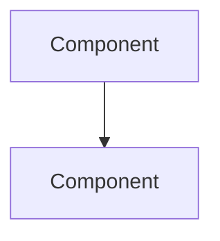

# Quick Start Guide - UI Fix Implementation

## 🚀 Start Here - 10 Minute Setup

### 1. Verify CSS is Active (1 min)
Check that `mkdocs.yml` only includes:
```yaml
extra_css:
  - stylesheets/unified-system.css
```

### 2. Run Migration Analysis (2 min)
```bash
python migration-helper.py
```
This creates `CSS_MIGRATION_REPORT.md` showing all issues to fix.

### 3. Quick Global Fixes (5 min)

#### Remove Emoji Bullets
```bash
# Find all emoji bullets
find docs -name "*.md" -exec grep -l "^- :" {} \;

# Remove them (backup first!)
find docs -name "*.md" -exec sed -i.bak 's/^- :[^:]*: /- /g' {} \;
```

#### Fix Tables
```bash
# Find tables without responsive class
grep -r "<table" docs/ | grep -v "responsive-table"

# Add responsive class manually to each
```

#### Update Font Sizes
```bash
# Replace hard-coded sizes
find docs -name "*.md" -exec sed -i 's/font-size: 1.1rem/font-size: var(--font-size-lg)/g' {} \;
find docs -name "*.md" -exec sed -i 's/font-size: 1.2rem/font-size: var(--font-size-xl)/g' {} \;
```

### 4. Test Changes (2 min)
```bash
mkdocs serve
# Open http://localhost:8000
# Check mobile view (F12 → Toggle device)
# Test dark mode
```

## 📝 Page-by-Page Transformation

### Homepage (docs/index.md)

**Quick Transform**:
```html
<!-- Replace title section with: -->
<div class="hero-section">
  <h1 class="hero-title">The Compendium of Distributed Systems</h1>
  <p class="hero-subtitle">
    Master distributed systems from first principles through physics and mathematics.
  </p>
  <a href="introduction/getting-started/" class="hero-cta">Start Your Journey</a>
</div>

<!-- Replace feature list with: -->
<div class="card-grid">
  <a href="axioms/" class="card">
    <h3 class="card__title">The 7 Laws</h3>
    <p class="card__description">Fundamental laws from physics</p>
  </a>
  <!-- More cards... -->
</div>
```

### Any Law Page

**Quick Transform**:
```html
<!-- Add at top: -->
<div class="content-box axiom-box">
  <h3>The Law in Brief</h3>
  <p><strong>Definition</strong>: [One sentence]</p>
  <p><strong>Implication</strong>: [What it means]</p>
</div>

<!-- Convert comparisons to tables: -->
<table class="responsive-table">
  <thead>
    <tr>
      <th>Aspect</th>
      <th>Traditional</th>
      <th>Law-Aware</th>
    </tr>
  </thead>
  <tbody>
    <tr>
      <td data-label="Aspect">...</td>
      <td data-label="Traditional">...</td>
      <td data-label="Law-Aware">...</td>
    </tr>
  </tbody>
</table>
```

### Any Pattern Page

**Quick Transform**:
```html
<!-- Add decision box: -->
<div class="content-box decision-box">
  <h3>When to Use</h3>
  <table class="responsive-table">
    <!-- When to use vs not use -->
  </table>
</div>

<!-- Add architecture diagram: -->


<!-- Related patterns: -->
<div class="pattern-grid">
  <a href="../pattern-x/" class="card">
    <h3 class="card__title">Related Pattern</h3>
  </a>
</div>
```

## ✅ Quick Wins Checklist

For each page you update:
- [ ] Remove emojis from headings
- [ ] Remove emoji bullets from lists
- [ ] Add `class="responsive-table"` to tables
- [ ] Add `data-label="Column"` to all `<td>` tags
- [ ] Replace colored boxes with `content-box` classes
- [ ] Use CSS variables for any custom styling
- [ ] Check mobile view in browser
- [ ] Verify dark mode appearance

## 🎯 Priority Order

1. **Homepage** - First impression matters
2. **Introduction pages** - New user experience
3. **Popular patterns** - High traffic pages
4. **Case studies** - Showcase best practices
5. **Reference pages** - Complete the transformation

## 🛠️ Useful Snippets

### Content Box Types
```html
<!-- Key principle -->
<div class="content-box axiom-box">

<!-- Decision guide -->
<div class="content-box decision-box">

<!-- Warning/failure -->
<div class="content-box failure-vignette">

<!-- Insight/tip -->
<div class="content-box truth-box">
```

### Responsive Table
```html
<table class="responsive-table">
  <thead>
    <tr>
      <th>Column 1</th>
      <th>Column 2</th>
    </tr>
  </thead>
  <tbody>
    <tr>
      <td data-label="Column 1">Value</td>
      <td data-label="Column 2">Value</td>
    </tr>
  </tbody>
</table>
```

### Card Grid
```html
<div class="card-grid">
  <div class="card">
    <h3 class="card__title">Title</h3>
    <p class="card__description">Description</p>
  </div>
  <!-- More cards -->
</div>
```

## 🚨 Common Mistakes

1. **Don't use inline styles**
   ```html
   <!-- Bad: style="color: blue" -->
   <!-- Good: class="text-primary" -->
   ```

2. **Don't forget data-label on tables**
   ```html
   <!-- Bad: <td>Value</td> -->
   <!-- Good: <td data-label="Column">Value</td> -->
   ```

3. **Don't mix old and new classes**
   ```html
   <!-- Bad: class="c-card feature-card" -->
   <!-- Good: class="card" -->
   ```

## 🎉 You're Ready!

Start with the homepage, then work through high-traffic pages. Each page you update makes the site better. The unified system handles all the complexity - just use the provided classes and components.

Remember: **Visual-first, no emojis, responsive everything!**