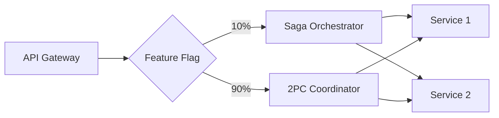

# DStudio Excellence Transformation Blueprint (Final Version)
## Preserve, Enhance, and Guide – A Living History of Distributed Systems

### 🎯 Core Philosophy
**"Every pattern tells a story – mark its era, show its evolution, guide to modern alternatives"**

Transform DStudio into a comprehensive knowledge base that:
- **Preserves** all content for learning and historical context (zero deletions)
- **Marks** the evolution from past to present with clear tier classifications
- **Guides** practitioners to current best practices through overlays and navigation
- **Explains** why patterns emerged and why they were superseded

---

## 📊 Transformation Overview

### Current State
- **400+ files** across patterns, case studies, and guides
- **Mixed quality**: 69.7% complete, only 13 high-quality patterns
- **No clear guidance**: Modern patterns mixed with legacy
- **48 interview prep files** diluting the focus

### Target State
- **Same 400+ files** but with excellence classification
- **Three-tier system**: Gold (🏆), Silver (🥈), Bronze (🥉)
- **Modern overlays**: Excellence guides pointing to best practices
- **Living documentation**: Quarterly updates and community contributions

---

## 🏗️ Three-Tier Excellence Classification

### Classification Criteria

| Tier | Symbol | Definition | Criteria | Example Patterns |
|------|--------|------------|----------|------------------|
| **Gold Standard** | 🏆 | Current best practices actively used by elite teams | • Used by 3+ top companies<br>• Battle-tested at 100M+ scale<br>• Active development<br>• Clear production playbooks | Service Mesh, CRDT, Event Sourcing, Saga, Cell-Based |
| **Silver Standard** | 🥈 | Solid patterns with notable trade-offs or constraints | • Widely used but being phased out<br>• Good for specific contexts<br>• May have better alternatives emerging | Circuit Breaker, CQRS, Sharding, API Gateway |
| **Bronze/Historical** | 🥉 | Legacy patterns kept for educational context | • No longer recommended for new systems<br>• Important for understanding evolution<br>• May still exist in legacy systems | Two-Phase Commit, Vector Clocks, Gossip Protocol |

### Detailed Pattern Classification

<details>
<summary>📁 Communication Patterns</summary>

| Pattern | Tier | Rationale | Modern Alternative |
|---------|------|-----------|-------------------|
| API Gateway | 🏆 Gold | Standard for microservice ingress | - |
| Service Mesh | 🏆 Gold | Modern service communication | - |
| Event-Driven Architecture | 🏆 Gold | Core async pattern | - |
| Event Sourcing | 🥈 Silver | Powerful but complex | Consider for audit trails |
| CQRS | 🥈 Silver | Good for read/write separation | Adds complexity |
| Saga Pattern | 🏆 Gold | Distributed transaction standard | Replaces 2PC |
| WebSocket | 🏆 Gold | Real-time bidirectional | - |
| GraphQL Federation | 🏆 Gold | API composition at scale | - |
| Choreography Saga | 🥈 Silver | Event-based saga | Orchestration often better |

</details>

<details>
<summary>📁 Resilience Patterns</summary>

| Pattern | Tier | Rationale |
|---------|------|-----------|
| Circuit Breaker | 🏆 Gold | Prevents cascade failures |
| Retry & Backoff | 🏆 Gold | Fundamental failure handling |
| Bulkhead | 🏆 Gold | Resource isolation |
| Timeout | 🏆 Gold | Bounds waiting time |
| Health Check | 🏆 Gold | Service monitoring standard |
| Failover | 🏆 Gold | High availability core |
| Load Shedding | 🏆 Gold | Maintains stability under load |
| Backpressure | 🏆 Gold | Stream processing essential |
| Graceful Degradation | 🏆 Gold | Partial functionality design |

</details>

<details>
<summary>📁 Data Management Patterns</summary>

| Pattern | Tier | Rationale | Notes |
|---------|------|-----------|-------|
| Sharding | 🏆 Gold | Horizontal scaling fundamental | - |
| CRDT | 🏆 Gold | Collaborative editing standard | Figma, Linear use |
| Event Streaming | 🏆 Gold | Modern data pipeline | Kafka standard |
| CDC | 🏆 Gold | Database to stream bridge | - |
| Outbox | 🏆 Gold | Reliable message publishing | - |
| Two-Phase Commit | 🥉 Bronze | Legacy distributed transactions | Use Saga instead |
| Distributed Lock | 🥈 Silver | Coordination with caveats | Avoid if possible |
| Leader Election | 🏆 Gold | Consensus fundamental | - |
| Vector Clocks | 🥉 Bronze | Academic causality tracking | Use HLC or timestamps |
| HLC | 🏆 Gold | Modern distributed timestamps | Spanner, CockroachDB |

</details>

<details>
<summary>📁 Storage & Scaling Patterns</summary>

| Pattern | Tier | Rationale |
|---------|------|-----------|
| LSM Tree | 🏆 Gold | Write-optimized storage |
| WAL | 🏆 Gold | Durability standard |
| Merkle Trees | 🏆 Gold | Integrity verification |
| Bloom Filter | 🏆 Gold | Probabilistic optimization |
| Auto-Scaling | 🏆 Gold | Cloud-native essential |
| Load Balancing | 🏆 Gold | Traffic distribution |
| Edge Computing | 🏆 Gold | Low-latency modern trend |
| Cell-Based Architecture | 🏆 Gold | Elite isolation strategy |
| Multi-Region Active-Active | 🏆 Gold | Global availability |

</details>

---

## 📋 Implementation Phases

### Phase 1: Assessment & Tagging (Weeks 1-2)

#### 1.1 Pattern Audit & Classification
**Every pattern page gets updated with:**

```yaml
---
title: Circuit Breaker Pattern
# New Excellence Metadata
excellence_tier: gold  # gold | silver | bronze
status: recommended    # recommended | use-with-caution | legacy | deprecated
introduced: 2012-03
peak_usage: 2014-2020
current_relevance: mainstream
evolution:
  from: [timeout, retry]
  to: [adaptive-circuit-breaker, load-shedding]
modern_examples:
  - company: Netflix
    implementation: "Hystrix (2012-2018), Resilience4j (2018+)"
  - company: Stripe
    implementation: "Custom implementation with adaptive thresholds"
alternatives:
  - pattern: load-shedding
    when: "Need to drop requests vs. queue them"
production_checklist:
  - "Define failure thresholds (e.g., 50% error rate)"
  - "Set timeout windows (e.g., 10 seconds)"
  - "Implement half-open state testing"
---
```

**Top-of-page banner for each tier:**

```markdown
!!! abstract "🏆 Gold Standard Pattern"
    **Modern best practice** actively used by elite engineering teams.
    See production examples below from Netflix, Stripe, and others.

!!! info "🥈 Silver Standard Pattern"
    **Solid choice with trade-offs**. Widely used but consider alternatives
    for specific use cases. See comparison with newer approaches below.

!!! warning "🥉 Bronze/Historical Pattern"
    **Legacy approach** - preserved for educational context.
    🔄 **Modern alternatives**: [Saga Pattern](/patterns/saga), [Event Sourcing](/patterns/event-sourcing)
    📚 **Still valid for**: Single database transactions, legacy system maintenance
```

#### 1.2 Pattern Evolution Mapping

Create comprehensive lineage documentation:

```json
{
  "distributed-transactions": {
    "timeline": [
      {
        "year": 1981,
        "pattern": "two-phase-commit",
        "context": "ACID across distributed databases"
      },
      {
        "year": 1987,
        "pattern": "saga-pattern-theory",
        "context": "Long-running transactions paper"
      },
      {
        "year": 2015,
        "pattern": "saga-microservices",
        "context": "Microservices adoption"
      },
      {
        "year": 2018,
        "pattern": "event-sourcing-saga",
        "context": "Event-driven architectures"
      },
      {
        "year": 2020,
        "pattern": "transactional-outbox",
        "context": "Reliable event publishing"
      }
    ],
    "migration_paths": {
      "2pc-to-saga": "/excellence/migrations/2pc-to-saga.md",
      "saga-to-event-sourcing": "/excellence/migrations/saga-to-es.md"
    },
    "real_world_migrations": [
      {
        "company": "Stripe",
        "year": 2018,
        "from": "2PC",
        "to": "Saga + Outbox",
        "blog_post": "https://stripe.com/blog/..."
      }
    ]
  }
}
```

#### 1.3 Excellence Criteria Documentation

Create `/reference/excellence-criteria.md`:

```markdown
# Excellence Tier Criteria

## 🏆 Gold Standard Requirements
- **Industry Adoption**: Used by 3+ companies known for engineering excellence
- **Scale Proven**: Handles 100M+ requests/day in production
- **Active Development**: Ongoing improvements and tool support
- **Production Maturity**: Clear playbooks and best practices exist
- **Future Direction**: Aligns with industry trends for next 3-5 years

## 🥈 Silver Standard Characteristics
- **Widespread Use**: Common in production but with known limitations
- **Transition Phase**: May be replaced by Gold patterns in specific contexts
- **Context-Dependent**: Excellent for some use cases, problematic for others
- **Maintenance Mode**: Stable but not seeing major innovations

## 🥉 Bronze/Historical Indicators
- **Legacy Status**: Primarily found in older systems
- **Better Alternatives**: Gold/Silver patterns solve same problem better
- **Educational Value**: Important for understanding system evolution
- **Migration Target**: Companies actively moving away from these
```

### Phase 2: Modern Excellence Layer (Weeks 3-4)

#### 2.1 Excellence Guides

Create new `/excellence/` directory with curated modern guides:

**`/excellence/modern-distributed-systems-2025.md`**
```markdown
# Modern Distributed Systems - 2025 Excellence Guide

## Building Like the Best

This guide shows how elite engineering teams build distributed systems today,
using only 🏆 Gold Standard patterns proven at scale.

### Foundation: Communication & Integration
Start with these patterns for service communication:

#### Service Mesh (🏆 Gold)
**Who Uses It**: Google, Lyft, all major cloud providers
**Why**: Handles service discovery, security (mTLS), observability, and traffic management in one layer
**Implementation**: Start with Istio or Linkerd
[→ Deep Dive](/patterns/service-mesh) | [→ Case Study: Lyft's Envoy](/case-studies/lyft-envoy)

#### Event Streaming (🏆 Gold)
**Who Uses It**: LinkedIn (Kafka), Uber, Netflix
**Why**: Decouples services, enables replay, provides audit trail
**Implementation**: Kafka for most cases, Pulsar for multi-tenancy
[→ Pattern Details](/patterns/event-streaming) | [→ Kafka Architecture](/case-studies/kafka)

### Data Consistency: Modern Approaches

#### Saga Pattern (🏆 Gold)
**Replaces**: Two-Phase Commit
**Who Uses It**: Uber (trips), Airbnb (bookings), all payment systems
**Implementation Choices**:
- **Orchestration**: Central coordinator (easier debugging)
- **Choreography**: Event-driven (more scalable)
[→ Pattern Guide](/patterns/saga) | [→ Migration from 2PC](/excellence/migrations/2pc-to-saga)

[Continue with 6-8 more Gold patterns...]
```

**`/excellence/platform-engineering-playbook.md`**
```markdown
# Platform Engineering Playbook

## Building Internal Platforms Like Stripe & Shopify

### The Platform Mindset
Your platform is a product. Your developers are customers.

### Core Platform Patterns

#### Developer Portal (🏆 Gold)
**Examples**: Backstage (Spotify), Clutch (Lyft)
- Service catalog
- Self-service provisioning
- Documentation hub

#### GitOps (🏆 Gold)
**Tools**: Flux, ArgoCD
- Declarative infrastructure
- Automated reconciliation
- Audit trail by default

[Continue with platform patterns...]
```

#### 2.2 Elite Engineering Case Studies

Add new in-depth case studies in `/case-studies/elite-engineering/`:

**`/case-studies/elite-engineering/stripe-api-design.md`**
```markdown
# Stripe's API Design Excellence

## How Stripe Built APIs That Last 10+ Years

### Key Principles

#### 1. Versioning Without Versions
Stripe famously has maintained backward compatibility since 2011:
- **Pattern Used**: [API Gateway](/patterns/api-gateway) with version transforms
- **Innovation**: Version pinning per API key, not global versions
- **Result**: Zero breaking changes for a decade

#### 2. Idempotency by Design
Every mutating API call is idempotent:
- **Pattern Used**: [Idempotency Keys](/patterns/idempotency)
- **Implementation**: 24-hour key retention, automatic retry handling
- **Impact**: Safe retries in distributed systems

### Architecture Deep Dive
[Detailed architecture diagrams and code examples...]

### Lessons for Your APIs
1. Design for backward compatibility from day one
2. Make idempotency mandatory, not optional
3. Version at the request level, not API level
[Continue with practical takeaways...]
```

**Additional Elite Case Studies to Create:**
- Discord's Voice Infrastructure (5M concurrent users)
- Figma's CRDT Implementation (real-time collaboration)
- Linear's Sync Engine (offline-first architecture)
- Vercel's Edge Platform (global deployment in seconds)
- Shopify's Cell-Based Architecture (Black Friday scale)

#### 2.3 Pattern Comparison Matrices

Enhanced comparison tables for decision making:

**Distributed Transactions Comparison**
| Need | Legacy (🥉) | Standard (🥈) | Elite Practice (🏆) | When to Use |
|------|-------------|---------------|---------------------|-------------|
| ACID across services | 2PC - Blocks entire system | Saga - Eventually consistent | Event Sourcing + Saga | Elite: Always for microservices |
| Payment processing | Distributed locks | Saga with compensations | Idempotent events + outbox | Elite: Financial systems |
| Order workflow | State machine in DB | Orchestrated saga | Event-driven choreography | Elite: E-commerce scale |

**Real-Time Communication Evolution**
| Era | Pattern | Limitations | Modern Reality |
|-----|---------|-------------|----------------|
| 2000s | Polling (🥉) | Wasteful, high latency | Only for legacy compatibility |
| 2010s | WebSocket (🏆) | Needs sticky sessions | Still gold for bidirectional |
| 2015s | Server-Sent Events (🥈) | One-way only | Good for simple push |
| 2020s | WebTransport (🏆) | Requires HTTP/3 | Future standard |

### Phase 3: Interactive Guidance Tools (Weeks 5-6)

#### 3.1 Enhanced Pattern Selector

Upgrade `/patterns/pattern-selector.md` with tier filtering:

```javascript
// Interactive Pattern Selector Configuration
const patternSelector = {
  // Tier filter UI
  filters: {
    excellence: {
      label: "Show patterns by excellence tier",
      options: [
        { value: 'gold', label: '🏆 Gold Only', default: true },
        { value: 'silver', label: '🥈 Include Silver' },
        { value: 'bronze', label: '🥉 Show All (includes legacy)' }
      ]
    },
    scale: {
      label: "What's your scale?",
      options: [
        { value: 'startup', label: '<100K requests/day' },
        { value: 'growth', label: '100K-10M requests/day' },
        { value: 'scale', label: '10M-1B requests/day' },
        { value: 'hyperscale', label: '>1B requests/day' }
      ]
    }
  },
  
  // Smart recommendations
  recommendations: {
    'distributed-transactions': {
      'startup': {
        gold: ['PostgreSQL with transactions'],
        silver: ['Simple saga for few services'],
        bronze: ['2PC if single database (not recommended)']
      },
      'scale': {
        gold: ['Saga pattern', 'Event sourcing'],
        silver: ['Choreography for simple flows'],
        bronze: null // Don't show legacy options at scale
      }
    }
  },
  
  // Warning for bronze selections
  warnings: {
    bronze: "⚠️ This is a legacy pattern. See modern alternatives: {alternatives}"
  }
}
```

#### 3.2 Architecture Decision Records (ADRs)

Create `/decisions/` directory with real-world ADRs:

**`/decisions/adr-001-2pc-to-saga.md`**
```markdown
# ADR-001: Migrating from 2PC to Saga Pattern

## Status: Implemented (2023)

## Context
Our payment system used 2PC across three services:
- Payment Service (charge customer)
- Inventory Service (reserve items)  
- Shipping Service (create shipment)

Problems encountered:
- 99th percentile latency: 5 seconds
- Coordinator failures blocked all transactions
- Difficult to scale beyond 1000 TPS

## Decision
Migrate to Saga pattern with orchestration.

## Alternatives Considered

### Keep 2PC with Optimizations
- ❌ Still has coordinator bottleneck
- ❌ Blocking nature incompatible with microservices
- ❌ No major cloud providers recommend this

### Event Sourcing
- ✅ Provides audit trail
- ❌ Team lacks experience
- ❌ 6-month migration timeline

### Saga Pattern (Chosen)
- ✅ Non-blocking, scalable
- ✅ Clear compensation logic
- ✅ 2-month migration possible
- ⚠️ Requires idempotent operations

## Implementation
1. Phase 1: Make all operations idempotent
2. Phase 2: Implement saga orchestrator
3. Phase 3: Gradual migration with feature flags
4. Phase 4: Decommission 2PC coordinator

## Outcomes
- Latency: 5s → 200ms (95th percentile)
- Throughput: 1K → 50K TPS
- Availability: 99.9% → 99.99%

## Lessons Learned
- Idempotency is harder than expected (2 weeks → 4 weeks)
- Saga testing requires new strategies
- Monitoring compensations is critical
```

#### 3.3 Migration Playbooks

Create `/excellence/migrations/` with step-by-step guides:

**`/excellence/migrations/2pc-to-saga.md`**
```markdown
# Migration Guide: Two-Phase Commit to Saga Pattern

## Pre-Migration Checklist
- [ ] All operations are idempotent
- [ ] Compensation logic identified
- [ ] Monitoring for partial failures ready
- [ ] Team trained on eventual consistency

## Migration Strategy

### Week 1-2: Parallel Infrastructure


### Week 3-4: Gradual Rollout
- Day 1: 10% saga traffic (monitor closely)
- Day 3: 25% if metrics stable
- Day 7: 50% with full monitoring
- Day 14: 100% with 2PC as fallback

### Week 5: Cleanup
- Remove 2PC code paths
- Archive 2PC coordinator
- Document lessons learned

## Common Pitfalls & Solutions

### Pitfall 1: Non-Idempotent Operations
**Symptom**: Duplicate charges in compensation
**Solution**: UUID-based idempotency keys with 24hr retention

### Pitfall 2: Compensation Failures
**Symptom**: Inconsistent state after failures
**Solution**: Dead letter queue + manual intervention process

[Continue with more pitfalls...]
```

### Phase 4: Living Documentation (Weeks 7-8 & Ongoing)

#### 4.1 Pattern Health Tracking

Implement automated relevance tracking:

```yaml
# /tools/pattern-health/config.yml
pattern_health:
  circuit_breaker:
    metrics:
      - github_stars:
          - Netflix/Hystrix: deprecated  # Archived
          - resilience4j/resilience4j: active  # Rising
      - conference_talks_2024: 12
      - job_postings_mentioned: 2847
      - stackoverflow_questions_monthly: 156
    health_score: 0.89  # Still very relevant
    trend: stable
    
  two_phase_commit:
    metrics:
      - github_implementations: few_and_old
      - conference_talks_2024: 0
      - job_postings_mentioned: 23
      - stackoverflow_questions_monthly: 12
    health_score: 0.15  # Legacy
    trend: declining
    notes: "Mostly questions about migrating away"
```

#### 4.2 Quarterly Review Process

**Review Checklist:**
```markdown
## Q1 2025 Pattern Review Checklist

### Tier Movements
- [ ] Review patterns with health_score changes >0.2
- [ ] Check for new tools/frameworks affecting patterns
- [ ] Validate elite company usage claims
- [ ] Update modern_examples with recent implementations

### New Patterns to Add
- [ ] WebAssembly for Edge Computing
- [ ] Cellular Architecture variants

### Content Updates Needed
- [ ] Update Kubernetes case study (v1.29 features)
- [ ] Add Cloudflare's edge computing patterns
- [ ] Document ChatGPT's scaling architecture

### Community Feedback Integration
- [ ] Process "Used in Production" submissions
- [ ] Review proposed pattern additions
- [ ] Update migration guides with user stories
```

#### 4.3 Community Contribution Framework

**Contribution Templates:**

```markdown
<!-- Pattern Usage Report Template -->
## Pattern Usage Report

**Pattern**: [Pattern Name]
**Company**: [Your Company]
**Scale**: [Requests/day or relevant metric]
**Duration**: [How long in production]

### Implementation Details
[Architecture overview]

### Outcomes
- Performance impact:
- Reliability improvement:
- Operational changes:

### Lessons Learned
[Key insights]

### Would you recommend? Why/why not?
[Recommendation]
```

---

## 📊 Success Metrics & Monitoring

### Quantitative KPIs

| Metric | Current | Target | Measurement Method |
|--------|---------|--------|-------------------|
| Time to find relevant pattern | Unknown | <3 clicks | Analytics funnel tracking |
| Gold pattern discovery rate | N/A | 80% first | Search result click analysis |
| Pattern → Case study navigation | Low | 60% | Cross-link click tracking |
| Modern guide completion | N/A | 70% | Scroll depth + time on page |
| Community contributions/month | 0 | 10+ | GitHub PR count |

### Qualitative Outcomes

1. **Historical Understanding**: "I understand why we moved from X to Y"
2. **Confident Selection**: "I know which pattern to use for my use case"  
3. **Migration Clarity**: "I have a clear path to modernize our system"
4. **Trust in Guidance**: "DStudio helped us make the right architecture choice"

### Community Health Indicators

- GitHub stars growth rate
- Pattern discussion quality
- Conference/blog citations
- Tool vendor references
- University course adoption

---

## 🚀 Unique Value Proposition

### "The Wikipedia of Distributed Systems Evolution"

DStudio becomes the definitive source for understanding:
- **Where we were**: Historical patterns and why they existed
- **Where we are**: Current best practices with real examples  
- **Where we're going**: Emerging patterns and future directions
- **How to get there**: Migration guides and decision frameworks

### Time Machine for Architecture
- See how patterns evolved over 40 years
- Understand constraints that drove each innovation
- Learn from real migration successes and failures
- Anticipate future architectural shifts

### For Every Audience
- **Newcomers**: Guided paths through modern patterns only
- **Practitioners**: Quick answers with deep-dive options
- **Legacy Maintainers**: Clear modernization roadmaps
- **Researchers**: Complete historical context preserved

---

## 🎯 Final Result

A transformed DStudio that:
1. **Preserves everything** - No knowledge is lost
2. **Guides clearly** - Modern best practices are obvious
3. **Evolves continuously** - Quarterly updates keep it current
4. **Serves all needs** - From learning history to building the future

The excellence framework ensures DStudio remains the authoritative source for distributed systems knowledge - honoring the past while actively guiding toward the future.