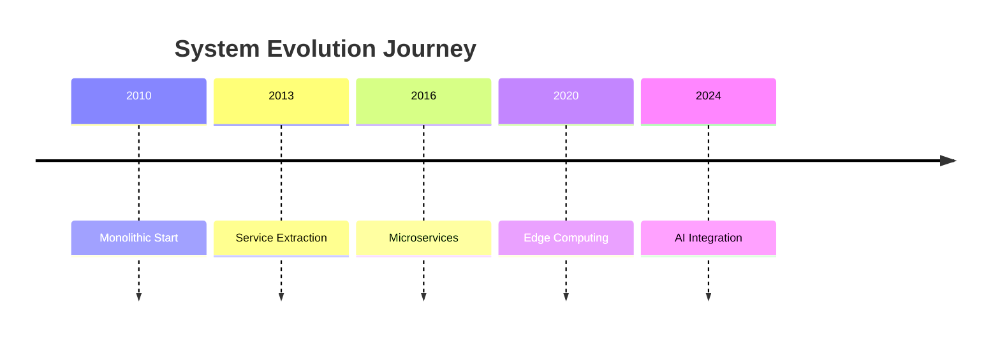

# Case Study Excellence Metadata Plan

## Overview

This plan outlines the strategy for adding comprehensive excellence metadata to all 91 case studies in the DStudio compendium. The metadata will enable:
- Interactive filtering by scale, domain, and excellence tier
- Pattern usage tracking across real implementations
- Learning path recommendations based on complexity
- Company-specific implementation insights

## 1. Metadata Structure for Case Studies

### Required Frontmatter Fields

```yaml
---
# Standard metadata (existing)
title: "System Name: Scale and Architecture Deep Dive"
description: Brief description of the system and its scale
type: case-study
difficulty: beginner|intermediate|advanced
reading_time: 15-60 min
prerequisites: []
status: complete|in-progress|planned
last_updated: YYYY-MM-DD

# Excellence metadata (new)
excellence_tier: gold|silver|bronze
scale_category: internet-scale|enterprise-scale|startup-scale|academic
domain: streaming|payments|social|maps|storage|messaging|search|collaboration
company: Netflix|Google|Uber|Amazon|Meta|etc
year_implemented: YYYY
current_status: production|evolved|deprecated|reference

# Key metrics
metrics:
  users: 260M+
  requests_per_second: 1M+
  data_volume: 100PB+
  availability: 99.99%
  latency_p99: 100ms
  regions: 190+

# Pattern usage tracking
patterns_used:
  gold:
    - pattern-name: "Implementation details"
    - circuit-breaker: "Hystrix handles 100B+ requests/day"
  silver:
    - pattern-name: "Implementation details"
  bronze:
    - pattern-name: "Historical context"

# Excellence connections
excellence_guides:
  - scale/internet-scale
  - migration/microservices
  - operational/chaos-engineering

# Implementation insights
key_innovations:
  - "H3 hexagonal grid for geospatial indexing"
  - "Custom time synchronization with TrueTime"
  - "Multi-region active-active replication"

lessons_learned:
  - category: "Architecture"
    lesson: "Start with monolith, evolve to microservices"
  - category: "Operations"
    lesson: "Chaos engineering prevents outages"
---
```

## 2. Case Study Categories

### Scale Categories

#### Internet-Scale (25+ case studies)
- **Definition**: Systems serving 100M+ users globally
- **Examples**: Netflix, YouTube, Google Search, Facebook
- **Key Characteristics**:
  - Multi-region deployment
  - 99.99%+ availability requirements
  - Petabyte+ data volumes
  - Custom infrastructure solutions

#### Enterprise-Scale (30+ case studies)
- **Definition**: Systems serving large organizations or B2B
- **Examples**: Salesforce, Slack, Zoom, Stripe
- **Key Characteristics**:
  - High reliability requirements
  - Complex business logic
  - Compliance and security focus
  - Multi-tenant architecture

#### Startup-Scale (25+ case studies)
- **Definition**: Rapidly growing systems with resource constraints
- **Examples**: Discord, Figma, Notion, Linear
- **Key Characteristics**:
  - Rapid iteration needs
  - Cost optimization focus
  - Technology choices for developer velocity
  - Scaling challenges

#### Academic/Reference (11+ case studies)
- **Definition**: Research systems and foundational implementations
- **Examples**: MapReduce, BigTable, Dynamo paper implementations
- **Key Characteristics**:
  - Novel algorithms or approaches
  - Theoretical foundations
  - Influence on industry systems

### Domain Categories

1. **Streaming & Media** (15 studies)
   - Video: Netflix, YouTube, Disney+
   - Audio: Spotify, SoundCloud
   - Live: Twitch, Zoom

2. **Payments & Finance** (12 studies)
   - Transactions: PayPal, Stripe, Square
   - Wallets: Venmo, Cash App
   - Trading: Robinhood, Coinbase

3. **Social & Communication** (18 studies)
   - Social Networks: Facebook, Twitter, LinkedIn
   - Messaging: WhatsApp, Slack, Discord
   - Collaboration: Google Docs, Notion, Figma

4. **Maps & Location** (10 studies)
   - Navigation: Google Maps, Uber, Lyft
   - Discovery: Yelp, Foursquare
   - Tracking: Life360, Find My

5. **Storage & Databases** (15 studies)
   - Object Storage: S3, Google Cloud Storage
   - Databases: DynamoDB, Spanner, MongoDB
   - Caching: Redis, Memcached

6. **Search & Discovery** (8 studies)
   - Web Search: Google, Bing
   - Product Search: Amazon, eBay
   - Recommendations: Netflix, Spotify

7. **Infrastructure** (13 studies)
   - Orchestration: Kubernetes, Mesos
   - Monitoring: Prometheus, Datadog
   - Security: Vault, Okta

### Excellence Tiers for Case Studies

#### Gold Tier (30 studies)
- Battle-tested at internet scale
- Multiple production deployments
- Well-documented architecture
- Active evolution and improvements
- Examples: Netflix Streaming, Google Spanner, Amazon DynamoDB

#### Silver Tier (40 studies)
- Proven at enterprise scale
- Solid architectural choices
- Good documentation available
- Some limitations known
- Examples: Stripe Payments, Slack Architecture, Zoom Video

#### Bronze Tier (21 studies)
- Historical importance
- Academic or reference implementations
- Evolved into newer systems
- Learning value remains high
- Examples: Original MapReduce, Early NoSQL systems

## 3. Implementation Templates

### Gold Tier Case Study Template

```markdown
---
title: "[Company] [System]: Scale and Architecture Deep Dive"
excellence_tier: gold
scale_category: internet-scale
# ... full metadata ...
---

# [System Name]: Battle-Tested at Scale

!!! success "Excellence Badge"
    🥇 **Gold Tier**: Battle-tested at internet scale with proven reliability

## Quick Facts Dashboard

| Metric | Current Scale | Peak Load | Growth Rate |
|--------|--------------|-----------|-------------|
| Users | 260M+ | 300M | +20% YoY |
| RPS | 1M+ | 5M | +50% YoY |
| ... | ... | ... | ... |

## Architecture Evolution



## Pattern Implementation Matrix

| Pattern | Usage | Scale | Key Innovation |
|---------|-------|-------|----------------|
| Circuit Breaker | Hystrix | 100B+ calls/day | Adaptive thresholds |
| ... | ... | ... | ... |

## Production Insights

### What Works at Scale
- [Specific implementation detail]
- [Performance optimization]
- [Operational practice]

### Hard-Won Lessons
- [Failure story]
- [What was learned]
- [How it was fixed]

## Excellence Practices

### Scale Considerations
[Specific to internet-scale challenges]

### Migration Path
[How they evolved from smaller scale]

### Operational Excellence
[SRE practices, monitoring, deployment]
```

### Silver Tier Case Study Template

```markdown
---
excellence_tier: silver
scale_category: enterprise-scale
# ... metadata ...
---

# [System]: Enterprise-Grade Architecture

!!! info "Excellence Badge"
    🥈 **Silver Tier**: Proven at enterprise scale with solid architecture

## Trade-off Analysis

| Aspect | Choice Made | Alternative | Why This Works |
|--------|-------------|-------------|----------------|
| Consistency | Strong | Eventual | Business requirements |
| ... | ... | ... | ... |

## Best Suited For

### ✅ Use When You Have
- [Specific requirement]
- [Scale consideration]
- [Team capability]

### ❌ Avoid When You Need
- [Conflicting requirement]
- [Different scale]
- [Different constraints]
```

### Bronze Tier Case Study Template

```markdown
---
excellence_tier: bronze
scale_category: academic
# ... metadata ...
---

# [System]: Historical Architecture Study

!!! warning "Excellence Badge"
    🥉 **Bronze Tier**: Historical system with modern alternatives available

## Historical Context
[Why this was revolutionary at the time]

## Modern Alternatives

| Original Approach | Modern Solution | Migration Path |
|------------------|-----------------|----------------|
| [Old pattern] | [New pattern] | [How to migrate] |

## Learning Value
[What principles still apply today]
```

## 4. Priority Implementation Order

### Phase 1: High-Impact Gold Tier (Week 1)
1. **Streaming Giants** (5 studies)
   - Netflix, YouTube, Disney+, Twitch, Spotify
2. **Payment Systems** (3 studies)
   - Stripe, PayPal, Square
3. **Social Platforms** (4 studies)
   - Facebook, Twitter, LinkedIn, Instagram
4. **Cloud Infrastructure** (3 studies)
   - AWS services, Google systems, Azure

### Phase 2: Enterprise Silver Tier (Week 2)
1. **Collaboration Tools** (5 studies)
   - Slack, Zoom, Google Docs, Notion, Figma
2. **B2B Platforms** (5 studies)
   - Salesforce, Shopify, Atlassian, GitHub, GitLab
3. **Monitoring & Observability** (5 studies)
   - Datadog, New Relic, Prometheus, Grafana, ELK

### Phase 3: Emerging & Startup Tier (Week 3)
1. **Modern Startups** (5 studies)
   - Discord, Linear, Vercel, Supabase, Railway
2. **Specialized Systems** (5 studies)
   - Gaming platforms, IoT systems, Edge computing
3. **Regional Leaders** (5 studies)
   - WeChat, Grab, Gojek, Paytm, Mercado Libre

### Phase 4: Academic & Historical (Week 4)
1. **Foundational Papers** (5 studies)
   - MapReduce, BigTable, Dynamo, GFS, Chubby
2. **Historical Systems** (5 studies)
   - Early distributed databases, Original architectures
3. **Research Systems** (5 studies)
   - Academic innovations, Experimental systems

## 5. Metadata Implementation Guide

### Step 1: Audit Existing Case Studies
```bash
# Find case studies with partial metadata
grep -l "excellence_tier:" docs/case-studies/**/*.md

# Find case studies without metadata  
grep -L "excellence_tier:" docs/case-studies/**/*.md

# Generate implementation checklist
find docs/case-studies -name "*.md" | grep -v "index.md" | sort
```

### Step 2: Metadata Addition Process
1. **Read existing content** thoroughly
2. **Identify scale category** based on metrics
3. **Determine excellence tier** based on:
   - Production usage
   - Documentation quality
   - Current relevance
   - Industry adoption
4. **Extract key metrics** from content
5. **Map pattern usage** to pattern catalog
6. **Add innovation highlights**
7. **Document lessons learned**

### Step 3: Validation Checklist
- [ ] All required metadata fields present
- [ ] Scale metrics are accurate and current
- [ ] Pattern references link correctly
- [ ] Excellence tier justified by content
- [ ] Domain category appropriate
- [ ] Company attribution correct

### Step 4: Cross-Referencing
1. Update pattern pages to reference case studies
2. Add case study links to excellence guides
3. Update company index with all implementations
4. Ensure bidirectional linking

## 6. Interactive Features to Build

### Case Study Discovery Page
```markdown
/docs/case-studies/discovery.md

Features:
- Filter by excellence tier
- Filter by scale category
- Filter by domain
- Filter by company
- Search by pattern usage
- Sort by date/relevance/scale
```

### Company Implementation Index
```markdown
/docs/case-studies/by-company.md

Structure:
- Company profiles
- All their case studies
- Common patterns used
- Evolution timeline
- Key innovations
```

### Pattern-to-Case-Study Mapping
```markdown
/docs/patterns/[pattern-name].md

New section:
## Real-World Implementations
- Link to case studies using this pattern
- Scale achieved
- Implementation details
```

## 7. Quality Metrics

### Completion Tracking
- Total case studies: 91
- With full metadata: 0 (starting point)
- Target: 100% by end of month

### Metadata Quality Score
1. **Complete** (10 points): All fields populated
2. **Accurate** (10 points): Metrics verified
3. **Connected** (10 points): Links to patterns/guides
4. **Insightful** (10 points): Unique learnings captured

### Progress Dashboard
Create `/docs/case-studies/metadata-progress.md`:
- Progress bars by category
- Completion percentage
- Quality scores
- Last updated tracking

## 8. Long-term Maintenance

### Quarterly Reviews
- Update metrics with latest data
- Add new case studies
- Promote/demote excellence tiers
- Archive deprecated systems

### Annual Analysis
- Trend analysis across case studies
- Pattern adoption over time
- Common failure modes
- Emerging architectures

### Community Contributions
- Template for submitting case studies
- Review process for accuracy
- Attribution guidelines
- Update frequency requirements

## Implementation Timeline

### Week 1 (Days 1-7)
- Set up tracking spreadsheet
- Complete 25 high-impact Gold tier studies
- Create discovery page structure
- Test filtering functionality

### Week 2 (Days 8-14)
- Complete 30 Silver tier enterprise studies
- Build company index
- Add pattern cross-references
- Create progress dashboard

### Week 3 (Days 15-21)
- Complete 25 emerging/startup studies
- Implement search functionality
- Add interactive visualizations
- Test all navigation paths

### Week 4 (Days 22-28)
- Complete 11 academic/historical studies
- Final quality review
- Documentation updates
- Launch announcement

## Success Criteria

1. **100% Metadata Coverage**: All 91 case studies have complete metadata
2. **Functional Discovery**: Users can filter/search effectively
3. **Cross-Referenced**: All patterns link to relevant case studies
4. **Quality Score**: Average quality score >35/40
5. **User Feedback**: Positive response to new organization

## Next Steps

1. Review and approve this plan
2. Create tracking spreadsheet
3. Begin Phase 1 implementation
4. Set up daily progress reviews
5. Coordinate with pattern enhancement team