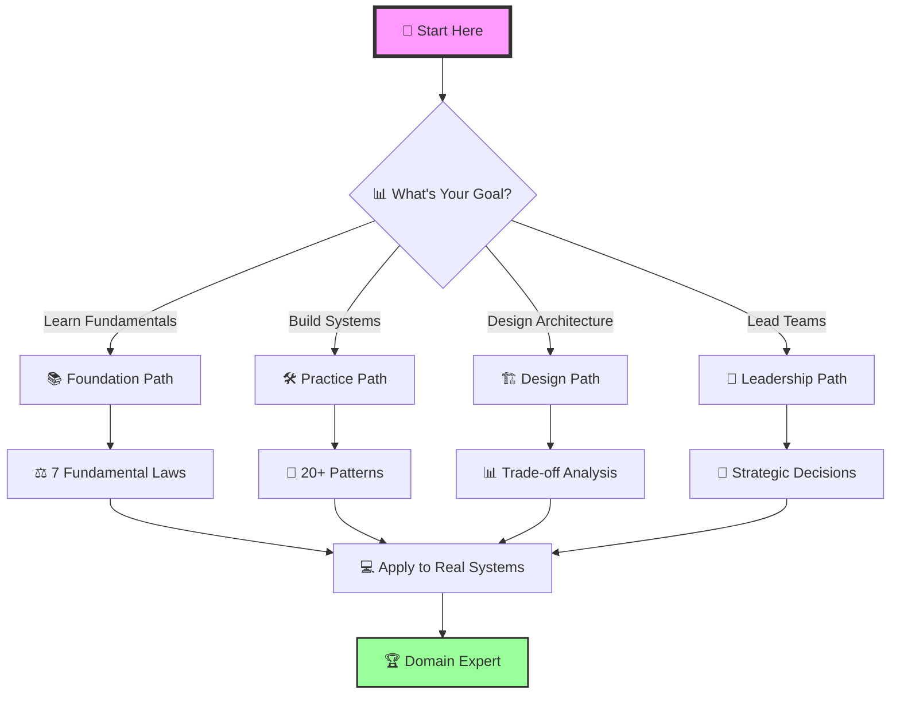
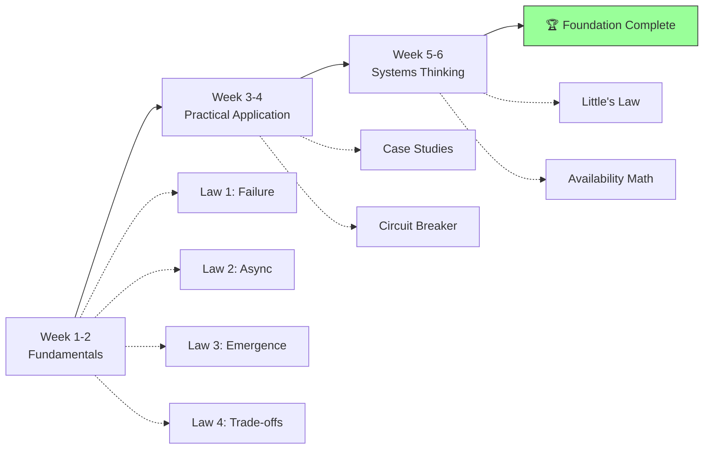
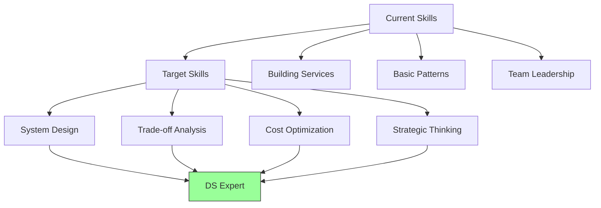
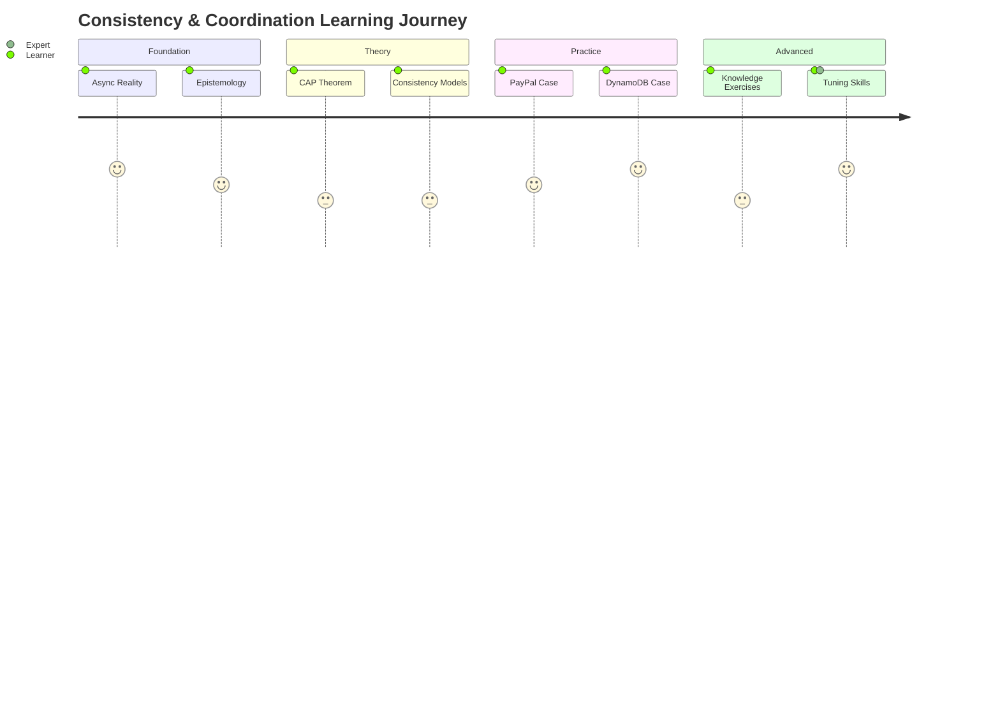
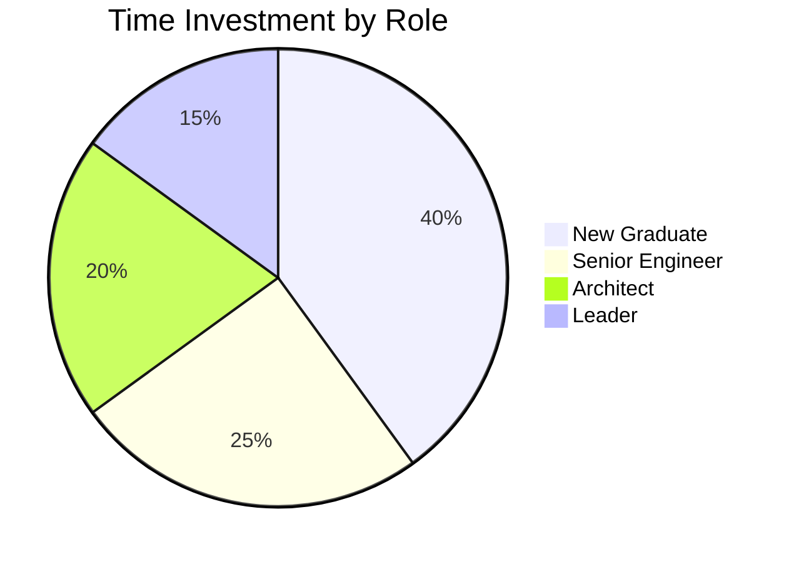

# 🎓 Learning Paths Guide

## 🗺️ Navigate Your Distributed Systems Journey

This guide helps you navigate the enhanced documentation based on your role, experience level, and learning goals.

---

## 🎯 Quick Start by Role

### 👨‍🎓 New Graduate / Junior Engineer
**Goal**: Build strong foundations in distributed systems

#### Week 1-2: Fundamentals

**Time Investment**: 🕒 20-25 hours

1. **Day 1-2**: Start with [Law 1: Failure](part1-axioms/law1-failure/index.md)
   - 📖 Read theory (2 hours)
   - 👀 Study cascading failure examples (2 hours)
   - 💻 Complete hands-on exercises (4 hours)
   
2. **Day 3-8**: Progress through Laws 2-4:
   - [Law 2: Asynchronous Reality](part1-axioms/law2-asynchrony/index.md) - ⏳ Time has no meaning
   - [Law 3: Emergence](part1-axioms/law3-emergence/index.md) - 🌪️ Chaos from scale
   - [Law 4: Trade-offs](part1-axioms/law4-tradeoffs/index.md) - ⚖️ Beyond CAP
   
   **Learning Strategy**:
   - 🎯 Focus on examples sections first
   - 🧪 Try exercises after understanding concepts
   - 📝 Take notes on key insights

#### Week 3-4: Practical Application
1. Study [Rate Limiter Case Study](case-studies/rate-limiter.md)
   - See how laws apply in practice
   - Review architecture alternatives
2. Explore [Circuit Breaker Pattern](patterns/circuit-breaker.md)
   - Understand failure handling
   - Build the example implementation

#### Week 5-6: Systems Thinking
1. Read [Little's Law](quantitative/littles-law.md)
   - Master fundamental queue theory
2. Study [Availability Math](quantitative/availability-math.md)
   - Calculate system reliability

### 👩‍💻 Senior Engineer / Tech Lead
**Goal**: Design better distributed systems

#### Fast Track (1 week)

**Daily Time Commitment**: 🕒 2-3 hours

1. **Day 1-2**: Review all [Law Mapping Tables](case-studies/index.md)
   - 🎯 See how Netflix, Uber, Google apply laws
   - 📊 Study architecture trade-offs
   - 💡 Extract patterns from real systems
   
2. **Day 3-4**: Deep dive into [Distributed Knowledge](part1-axioms/law5-epistemology/index.md)
   - 🧠 Understand truth and certainty in distributed systems
   - 🏛️ Master Byzantine epistemology
   - 🔍 Apply to consensus protocols
   
3. **Day 5-7**: Master [Economic Reality](part1-axioms/law7-economics/index.md)
   - 💰 Make cost-aware architecture decisions
   - 📈 Build TCO models
   - ⚖️ Balance performance vs cost

#### Architecture Focus (2 weeks)
1. Study all case study architecture alternatives:
   - [YouTube](case-studies/youtube.md) - Video at scale
   - [PayPal](case-studies/paypal-payments.md) - Financial consistency
   - [Uber](case-studies/uber-location.md) - Real-time geo-distributed
2. Review [Human Factors](human-factors/index.md)
   - Design for operability
   - Plan for on-call reality

### 👔 Engineering Manager / Director
**Goal**: Make strategic technical decisions

#### Executive Path (3 days)
1. Start with [Economic Reality](part1-axioms/law7-economics/index.md)
   - Understand cost drivers
   - Review cloud optimization strategies
2. Study [Cognitive Load](part1-axioms/law6-human-api/index.md)
   - Plan for operational load
   - Design sustainable on-call
3. Review [Trade-off Matrices](case-studies/amazon-dynamo.md#trade-off-analysis)
   - Make informed architecture choices
   - Balance technical and business needs

### 🎯 Solution Architect
**Goal**: Design systems that meet business requirements

#### Pattern-First Approach (1 week)
1. Start with [Pattern Index](patterns/index.md)
   - Map patterns to business problems
   - Understand implementation complexity
2. For each relevant pattern, review:
   - Law connections
   - Trade-off analysis
   - Real-world examples
3. Study relevant case studies:
   - Similar scale/domain examples
   - Architecture decision rationales

---

## 📚 Learning Paths by Topic

### 🔄 Path 1: Consistency and Coordination
**For**: Database engineers, financial systems developers

**Learning Milestones**:

1. **Foundation** (🕒 1 week)
   - ⏳ [Law 2: Asynchronous Reality](part1-axioms/law2-asynchrony/index.md)
   - 🧠 [Law 5: Epistemology](part1-axioms/law5-epistemology/index.md)
   
2. **Theory** (🕒 1 week)
   - 🔺 [CAP Theorem implications](part2-pillars/truth/index.md)
   - 🎨 [Consistency Models](patterns/tunable-consistency.md)
   
3. **Practice** (🕒 2 weeks)
   - 💳 [PayPal Payments](case-studies/paypal-payments.md) - Financial consistency
   - 📋 [DynamoDB](case-studies/amazon-dynamo.md) - Eventually consistent at scale
   
4. **Advanced** (🕒 1 week)
   - 🧪 [Distributed Knowledge Exercises](part1-axioms/law5-epistemology/exercises.md)
   - 🎯 [Consistency Tuning](human-factors/consistency-tuning.md)

### 🚀 Path 2: Performance and Scale
**For**: Performance engineers, SREs

1. **Foundation**
   - [Law 4: Trade-offs](part1-axioms/law4-tradeoffs/index.md)
   - [Law 3: Emergence](part1-axioms/law3-emergence/index.md)
   
2. **Quantitative**
   - [Latency Ladder](quantitative/latency-ladder.md)
   - [Queueing Theory](quantitative/queueing-models.md)
   - [Little's Law](quantitative/littles-law.md)
   
3. **Patterns**
   - [Caching Strategies](patterns/caching-strategies.md)
   - [Auto-scaling](patterns/auto-scaling.md)
   
4. **Case Studies**
   - [YouTube](case-studies/youtube.md) - Video streaming at scale
   - [Spotify](case-studies/spotify-recommendations.md) - ML at scale

### 💰 Path 3: Cost Optimization
**For**: FinOps practitioners, Engineering leaders

1. **Foundation**
   - [Law 7: Economics](part1-axioms/law7-economics/index.md)
   
2. **Analysis**
   - [Total Cost of Ownership Calculator](part1-axioms/law7-economics/exercises.md#exercise-1-total-cost-of-ownership-tco-calculator)
   - [Build vs Buy Decision Framework](part1-axioms/law7-economics/exercises.md#exercise-2-build-vs-buy-decision-framework)
   
3. **Architecture Impact**
   - Review all "Economics" rows in law mapping tables
   - Study cost trade-offs in architecture alternatives
   
4. **Optimization**
   - [Cloud Cost Optimization Strategies](part1-axioms/law7-economics/exercises.md#exercise-3-cloud-cost-optimization-strategies)
   - [Multi-Region Deployment Cost Analysis](part1-axioms/law7-economics/exercises.md#exercise-4-multi-region-deployment-cost-analysis)

### 🛡️ Path 4: Reliability and Resilience
**For**: Site reliability engineers, Platform teams

1. **Foundation**
   - [Law 1: Failure](part1-axioms/law1-failure/index.md)
   - [Law 5: Epistemology](part1-axioms/law5-epistemology/index.md)
   
2. **Mathematics**
   - [Availability Math](quantitative/availability-math.md)
   - [Theoretical Foundations](part1-axioms/law1-failure/index.md#theoretical-foundations)
   
3. **Patterns**
   - [Circuit Breaker](patterns/circuit-breaker.md)
   - [Bulkhead](patterns/bulkhead.md)
   - [Timeout](patterns/timeout.md)
   
4. **Operations**
   - [Incident Response](human-factors/incident-response.md)
   - [Blameless Postmortems](human-factors/blameless-postmortems.md)
   - [Chaos Engineering](human-factors/chaos-engineering.md)

---

## 🎮 Interactive Learning Strategies

### 📖 For Visual Learners
1. Start with architecture diagrams in case studies
2. Focus on trade-off matrices and comparison tables
3. Use the visual decision frameworks

### 🔨 For Hands-On Learners
1. Begin with exercises in each law
2. Build the code examples in patterns
3. Try the calculators and simulations

### 🎯 For Problem Solvers
1. Start with case studies that match your domain
2. Analyze the architecture alternatives
3. Apply decision frameworks to your systems

### 📊 For Analytical Minds
1. Begin with quantitative analysis sections
2. Work through the mathematical proofs
3. Build your own cost/performance models

---

## 📈 Skill Progression Tracker

```mermaid
graph LR
    subgraph "Level 1: Foundation"
        F1["📚 7 Laws"] --> F2["🧪 50% Exercises"]
        F2 --> F3["📖 5 Case Studies"]
        F3 --> F4["🛠️ 1 Pattern"]
    end
    
    subgraph "Level 2: Practitioner"
        P1["✅ All Exercises"] --> P2["📊 Trade-offs"]
        P2 --> P3["🎨 5 Patterns"]
        P3 --> P4["🚀 Real Project"]
    end
    
    subgraph "Level 3: Expert"
        E1["🏗️ Custom Design"] --> E2["👨‍🏫 Lead Reviews"]
        E2 --> E3["🤝 Mentor Others"]
        E3 --> E4["📝 Contribute"]
    end
    
    F4 --> P1
    P4 --> E1
    
    style F1 fill:#e8f5e9
    style P1 fill:#e3f2fd
    style E1 fill:#fce4ec
```

### Level 1: Foundation (1-2 months)
- [ ] 📚 Understand all 7 laws (Correlated Failure ⛓️, Asynchronous Reality ⏳, Emergent Chaos 🌪️, Multidimensional Optimization ⚖️, Distributed Knowledge 🧠, Cognitive Load 🤯, Economic Reality 💰)
- [ ] 🧪 Complete 50% of law exercises
- [ ] 📖 Read 5 case studies
- [ ] 🛠️ Implement 1 pattern

### Level 2: Practitioner (3-6 months)
- [ ] ✅ Complete all law exercises
- [ ] 📊 Analyze all case study trade-offs
- [ ] 🎨 Implement 5 patterns
- [ ] 🚀 Apply to real project

### Level 3: Expert (6-12 months)
- [ ] 🏗️ Design custom architectures using laws
- [ ] 👨‍🏫 Lead architecture reviews
- [ ] 🤝 Mentor others using this material
- [ ] 📝 Contribute improvements

---

## 🚀 Next Steps

  

    1
    <h4>🎯 Choose Your Path</h4>
    
Select based on role or interest

  

  
  

    2
    <h4>🏆 Set Learning Goals</h4>
    
Use the progression tracker

  

  
  

    3
    <h4>🚀 Apply Immediately</h4>
    
Use learnings in current projects

  

  
  

    4
    <h4>🤝 Share Knowledge</h4>
    
Teach others what you learn

  

  
  

    5
    <h4>🔄 Iterate</h4>
    
Return to deepen understanding

  

!!! tip "Learning Philosophy"
    The goal isn't to read everything, but to understand deeply and apply effectively. The laws are your foundation - everything else builds upon them.

## 🏓️ Learning Velocity Guidelines

- **New Graduate**: 15-20 hours/week for 6-8 weeks
- **Senior Engineer**: 10-15 hours/week for 3-4 weeks  
- **Architect**: 8-10 hours/week for 3-4 weeks
- **Leader**: 5-8 hours/week for 1-2 weeks

---

## 📚 Quick Reference

### Essential Starting Points
- **Theory**: [7 Laws Overview](part1-axioms/index.md)
- **Practice**: [Case Studies Index](case-studies/index.md)
- **Patterns**: [Pattern Catalog](patterns/index.md)
- **Math**: [Quantitative Toolkit](quantitative/index.md)
- **Operations**: [Human Factors](human-factors/index.md)

### Most Popular Content
1. [Correlated Failure Examples](part1-axioms/law1-failure/examples.md) - Cascading failure reality
2. [Amazon DynamoDB](case-studies/amazon-dynamo.md) - Eventually consistent design
3. [Circuit Breaker](patterns/circuit-breaker.md) - Failure isolation
4. [Little's Law](quantitative/littles-law.md) - Queue fundamentals
5. [On-Call Culture](human-factors/oncall-culture.md) - Sustainable operations

Happy learning! 🎓