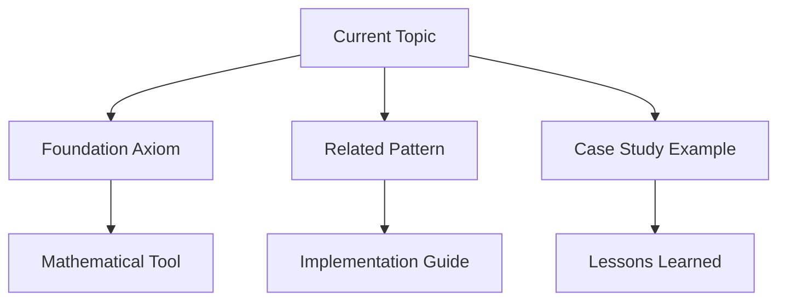

# Navigation Enhancements for The Compendium

This document outlines the comprehensive cross-reference system implemented throughout the Compendium to improve discoverability and learning flow.

## Cross-Reference System

### 1. Axiom Cross-References

Each axiom should link to:
- **Related Axioms**: Other axioms that frequently interact
- **Relevant Patterns**: Specific patterns that address the axiom
- **Case Studies**: Real-world examples that demonstrate the axiom
- **Quantitative Tools**: Mathematical tools for analysis
- **Exercises**: Hands-on practice

### 2. Pattern Cross-References

Each pattern should link to:
- **Primary Axioms**: Which axioms drive the need for this pattern
- **Related Patterns**: Complementary or alternative patterns
- **Case Studies**: Systems that implement this pattern
- **Implementation Guides**: Step-by-step implementations
- **Trade-off Analysis**: When to use vs. alternatives

### 3. Case Study Cross-References

Each case study should link to:
- **Demonstrated Axioms**: Which axioms are illustrated
- **Applied Patterns**: Patterns used in the architecture
- **Related Case Studies**: Similar systems or challenges
- **Deep Dive Sections**: More detailed analysis
- **Lessons Learned**: Key takeaways and principles

### 4. Pillar Cross-References

Each pillar should link to:
- **Foundation Axioms**: Axioms that underpin the pillar
- **Relevant Patterns**: Patterns that implement pillar concepts
- **Case Studies**: Systems that exemplify the pillar
- **Decision Frameworks**: Tools for pillar-specific choices
- **Quantitative Methods**: Mathematical analysis tools

## Navigation Components

### Quick Navigation Boxes

```markdown
```

### Concept Maps

```markdown
<div class="concept-map">
<h3>🗺️ Concept Relationships</h3>


</div>
```

### Learning Path Indicators

```markdown
<div class="learning-path">
<h3>📍 You Are Here</h3>

**Path**: New Graduate → **[Axioms]** → Pillars → Patterns → Case Studies

**Progress**: [██████████████████░░] 80% through Axioms

**Next**: [Pillar 1: Work](/part2-pillars/work/) - How systems process requests
</div>
```

### See Also Sections

```markdown
## See Also

### 🔬 Deep Dive
- [Mathematical Foundations](/quantitative/queueing-models/) - Queueing theory for capacity planning
- [Production Examples](/human-factors/sre-practices/) - Real-world capacity management

### 🛠️ Practical Application  
- [Capacity Planning Exercise](/part1-axioms/axiom2-capacity/exercises/) - Hands-on practice
- [Auto-scaling Patterns](/patterns/auto-scaling/) - Implementation strategies

### 🎯 Related Decisions
- [When to Scale Up vs Out?](/part2-pillars/work/#scaling-decisions) - Architecture choices
- [Cost vs Performance Trade-offs](/part1-axioms/axiom8-economics/#capacity-costs) - Economic analysis
```

## Implementation Strategy

### Phase 1: Add Quick Navigation Boxes
- Add to all axiom pages
- Add to all pattern pages  
- Add to all case study sections

### Phase 2: Create Concept Maps
- One per major section
- Show relationships between concepts
- Include learning progression

### Phase 3: Learning Path Integration
- Progress indicators on each page
- Clear next/previous navigation
- Recommended reading order

### Phase 4: Advanced Cross-References
- Bidirectional linking
- Related content discovery
- Search enhancement

## Navigation Templates

### For Axiom Pages

```markdown
<!-- Content here -->

```

### For Pattern Pages

```markdown
<div class="pattern-navigation">
<div class="pattern-context">
<h3>🧭 Pattern Context</h3>

**Solves**: Which axiom challenges this addresses
**Related**: Complementary patterns
**Alternatives**: Other solutions to consider
</div>

<div class="implementation-links">
<h3>🛠️ Implementation</h3>

**Code Examples**: Working implementations
**Case Studies**: Production usage
**Exercises**: Practice scenarios
</div>
</div>
```

### For Case Study Pages

```markdown
<div class="case-study-nav">
<div class="case-study-context">
<h3>🏢 System Context</h3>

**Scale**: [Startup/Growth/Enterprise]
**Domain**: [E-commerce/Social/Gaming/etc.]
**Key Challenges**: Primary distributed systems problems solved
</div>

<div class="axiom-demonstration">
<h3>📐 Axioms Demonstrated</h3>

Links to specific axioms with explanations of how they apply
</div>

<div class="pattern-usage">
<h3>🔧 Patterns Applied</h3>

Links to patterns with implementation details
</div>
</div>
```

## Cross-Reference Data Structure

```yaml
cross_references:
  axioms:
    axiom1-latency:
      related_axioms: [axiom2-capacity, axiom3-failure]
      primary_patterns: [circuit-breaker, retry-backoff, caching]
      case_studies: [netflix, uber-dispatch, cdn-optimization]
      quantitative_tools: [latency-budget, queueing-theory]
      exercises: [speed-of-light, network-simulation]
    
  patterns:
    circuit-breaker:
      primary_axioms: [axiom1-latency, axiom3-failure]
      related_patterns: [retry-backoff, bulkhead, timeout]
      case_studies: [netflix-hystrix, aws-lambda]
      implementations: [java-hystrix, golang-breaker, python-pybreaker]
      
  case_studies:
    netflix:
      demonstrated_axioms: [latency, failure, economics]
      applied_patterns: [circuit-breaker, bulkhead, chaos-engineering]
      related_cases: [amazon-prime, spotify-recommendations]
```

This navigation enhancement system will:

1. **Improve Discoverability**: Readers can easily find related content
2. **Support Multiple Learning Paths**: Different entry points and progressions
3. **Show Concept Relationships**: How different topics connect
4. **Provide Context**: Where each topic fits in the bigger picture
5. **Enable Deep Dives**: Links to more advanced material
6. **Support Review**: Easy access to prerequisite concepts

The implementation should be done incrementally, starting with the most important cross-references and expanding over time based on user feedback and usage patterns.