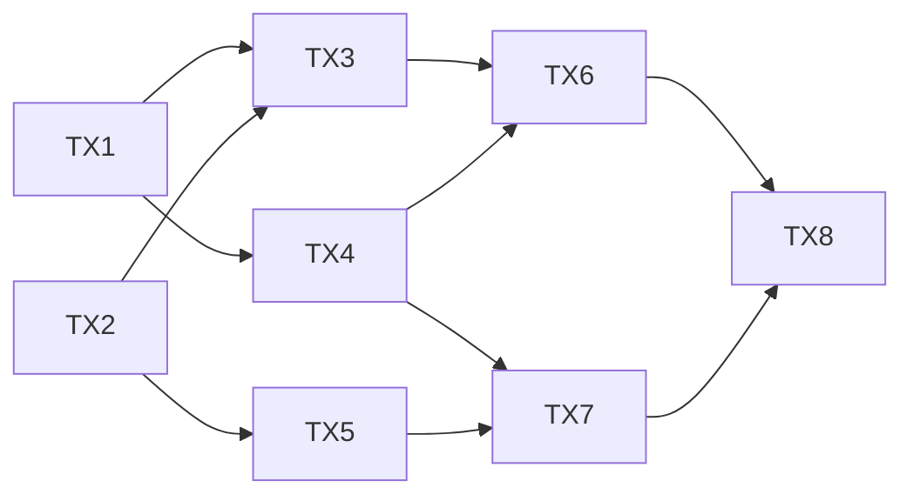

# Blockchain and Distributed Ledgers

> **Revolutionary Insight**: Blockchain solves the Byzantine Generals Problem in an open, permissionless environment by combining cryptography, economics, and distributed consensus.

## What Makes Blockchain Different

### Traditional Distributed Systems vs Blockchain

| Aspect | Traditional Systems | Blockchain Systems |
|--------|-------------------|-------------------|
| **Trust Model** | Known participants | Trustless/Anonymous |
| **Consensus** | Crash-fault tolerant | Byzantine fault tolerant |
| **Membership** | Permissioned | Permissionless* |
| **Incentives** | External/None | Built-in (tokens) |
| **Finality** | Immediate | Probabilistic |
| **State** | Current only | Full history |

*Some blockchains are permissioned (Hyperledger)

## The Fundamental Innovation

### Nakamoto Consensus (Bitcoin)

```python
class NakamotoConsensus:
    """
    Solves Byzantine consensus in open networks
    Combines: PoW + Longest chain rule + Economic incentives
    """
    
    def __init__(self):
        self.difficulty = self.adjust_difficulty()
        self.block_reward = 6.25  # BTC as of 2024
        self.chain = []
    
    def mine_block(self, transactions):
        """
        Proof of Work - Computational puzzle
        """
        block = {
            'prev_hash': self.chain[-1].hash if self.chain else '0',
            'transactions': transactions,
            'nonce': 0
        }
        
        # Find nonce such that hash < target
        while True:
            block_hash = sha256(json.dumps(block))
            if int(block_hash, 16) < self.difficulty_target:
                return block
            block['nonce'] += 1
    
    def validate_chain(self, chain):
        """
        Longest valid chain wins
        """
        for i, block in enumerate(chain[1:], 1):
            # Verify PoW
            if not self.valid_proof(block):
                return False
            # Verify previous hash
            if block['prev_hash'] != hash(chain[i-1]):
                return False
        return True
    
    def fork_choice(self, chains):
        """
        Choose longest valid chain
        """
        valid_chains = [c for c in chains if self.validate_chain(c)]
        return max(valid_chains, key=len)
```

### Key Innovation: Probabilistic Finality

```
Probability of reversal after k blocks:
P(reversal) = (q/p)^k

Where:
- p = honest mining power
- q = attacker mining power
- k = confirmation blocks

Example (q=0.3, 30% attacker):
- After 1 block: P = 0.3 (30%)
- After 6 blocks: P = 0.000729 (0.07%)
- After 100 blocks: P ≈ 0 (effectively impossible)
```

## Consensus Mechanisms

### 1. Proof of Work (PoW)

```python
def proof_of_work(block, difficulty):
    """
    CPU-intensive puzzle solving
    Security: Computational cost of attack
    """
    target = 2 ** (256 - difficulty)
    
    for nonce in range(2**32):
        block['nonce'] = nonce
        block_hash = sha256(serialize(block))
        
        if int(block_hash, 16) < target:
            return nonce, block_hash
    
    return None  # No solution found

# Attack cost calculation
def attack_cost_pow(hash_rate, block_time, blocks_to_revert):
    """
    Cost to 51% attack
    """
    network_hash_rate = hash_rate  # H/s
    attacker_needs = network_hash_rate * 0.51
    
    # Hardware cost (ASICs)
    hardware_cost = attacker_needs * 0.10  # $/H/s
    
    # Electricity cost
    power_consumption = attacker_needs * 0.00005  # kW per H/s
    electricity_cost = power_consumption * 0.10 * (blocks_to_revert * block_time / 3600)
    
    return hardware_cost + electricity_cost
```

**Properties**:
- Energy-intensive (security feature)
- Probabilistic finality
- Vulnerable to 51% attacks
- Examples: Bitcoin, Ethereum (pre-merge)

### 2. Proof of Stake (PoS)

```python
class ProofOfStake:
    """
    Stake-based validator selection
    Security: Economic stake at risk
    """
    
    def __init__(self):
        self.validators = {}  # address -> stake
        self.slash_percentage = 0.05  # 5% penalty
    
    def select_validator(self, seed):
        """
        Weighted random selection by stake
        """
        total_stake = sum(self.validators.values())
        
        # Random value in [0, total_stake)
        random.seed(seed)
        target = random.uniform(0, total_stake)
        
        cumulative = 0
        for validator, stake in self.validators.items():
            cumulative += stake
            if cumulative > target:
                return validator
    
    def validate_block(self, block, validator):
        """
        Verify validator has right to propose
        """
        expected_validator = self.select_validator(block['seed'])
        return validator == expected_validator
    
    def slash_validator(self, validator, violation):
        """
        Punish misbehavior by burning stake
        """
        if violation == "double_sign":
            penalty = self.validators[validator] * self.slash_percentage
            self.validators[validator] -= penalty
            return penalty
```

**Properties**:
- Energy-efficient
- Nothing-at-stake problem
- Long-range attacks possible
- Examples: Ethereum 2.0, Cardano, Polkadot

### 3. Byzantine Fault Tolerance (BFT) Variants

```python
class PBFT:
    """
    Practical Byzantine Fault Tolerance
    Requires N ≥ 3f + 1 nodes
    """
    
    def __init__(self, nodes, f):
        self.nodes = nodes
        self.f = f  # Maximum Byzantine nodes
        assert len(nodes) >= 3 * f + 1
        
    def consensus_round(self, value):
        # Phase 1: Pre-prepare
        leader = self.select_leader()
        pre_prepare = leader.broadcast("PRE-PREPARE", value)
        
        # Phase 2: Prepare
        prepare_votes = {}
        for node in self.nodes:
            if node.verify(pre_prepare):
                vote = node.broadcast("PREPARE", value)
                prepare_votes[node] = vote
        
        # Phase 3: Commit
        if len(prepare_votes) >= 2 * self.f + 1:
            commit_votes = {}
            for node in self.nodes:
                if node.received_prepares >= 2 * self.f + 1:
                    vote = node.broadcast("COMMIT", value)
                    commit_votes[node] = vote
            
            # Decision
            if len(commit_votes) >= 2 * self.f + 1:
                return value  # Consensus achieved
        
        return None  # No consensus

class TendermintBFT:
    """
    BFT with blockchain structure
    Used in Cosmos ecosystem
    """
    
    def __init__(self):
        self.round = 0
        self.validators = []
        self.locked_value = None
        
    def consensus_round(self):
        # Propose
        proposer = self.validators[self.round % len(self.validators)]
        proposal = proposer.propose_block()
        
        # Prevote
        prevotes = self.collect_votes("PREVOTE", proposal)
        
        if len(prevotes) >= 2/3 * len(self.validators):
            # Precommit
            self.locked_value = proposal
            precommits = self.collect_votes("PRECOMMIT", proposal)
            
            if len(precommits) >= 2/3 * len(self.validators):
                return proposal  # Block committed
        
        self.round += 1
        return None
```

### 4. Proof of Authority (PoA)

```python
class ProofOfAuthority:
    """
    Trusted validators (permissioned)
    High throughput, low latency
    """
    
    def __init__(self, authorities):
        self.authorities = authorities  # Known, trusted nodes
        self.round_robin_index = 0
        
    def next_validator(self):
        """
        Deterministic rotation
        """
        validator = self.authorities[self.round_robin_index]
        self.round_robin_index = (self.round_robin_index + 1) % len(self.authorities)
        return validator
    
    def validate_block(self, block):
        """
        Check if block signed by authorized validator
        """
        expected_validator = self.authorities[block['height'] % len(self.authorities)]
        return verify_signature(block, expected_validator.public_key)
```

## Smart Contracts and State Machines

### Ethereum Virtual Machine (EVM)

```python
class SmartContract:
    """
    Deterministic state machine on blockchain
    """
    
    def __init__(self, bytecode, storage):
        self.bytecode = bytecode  # Compiled contract code
        self.storage = storage    # Persistent state
        self.gas_limit = 30000000
        
    def execute(self, transaction):
        """
        Execute transaction against contract
        """
        evm = EVM(
            code=self.bytecode,
            storage=self.storage,
            msg_sender=transaction['from'],
            msg_value=transaction['value'],
            msg_data=transaction['data']
        )
        
        gas_used = 0
        while not evm.stopped and gas_used < self.gas_limit:
            opcode = evm.next_instruction()
            gas_used += opcode.gas_cost
            
            if opcode == "SSTORE":
                # State change
                self.storage[evm.stack.pop()] = evm.stack.pop()
            elif opcode == "CALL":
                # External call
                result = self.call_contract(evm.stack)
                evm.stack.push(result)
            # ... other opcodes
        
        return evm.return_data, self.storage, gas_used
```

### State Channels (Layer 2)

```python
class StateChannel:
    """
    Off-chain transactions with on-chain settlement
    """
    
    def __init__(self, participants, initial_state):
        self.participants = participants
        self.state = initial_state
        self.nonce = 0
        
    def update_state(self, new_state, signatures):
        """
        Off-chain state update
        """
        # Verify all participants signed
        for participant in self.participants:
            if not verify_signature(new_state, signatures[participant]):
                return False
        
        self.state = new_state
        self.nonce += 1
        return True
    
    def close_channel(self, final_state, signatures):
        """
        Submit final state to blockchain
        """
        # Submit to smart contract
        contract.close_channel(
            channel_id=self.id,
            state=final_state,
            signatures=signatures,
            nonce=self.nonce
        )
```

## Distributed Ledger Architectures

### 1. Linear Blockchain (Bitcoin/Ethereum)

```
Block N-2 <- Block N-1 <- Block N <- Block N+1
   |           |           |          |
  Hash       Hash        Hash       Hash
```

### 2. DAG-Based (IOTA Tangle, Hedera Hashgraph)



```python
class DAGLedger:
    """
    Directed Acyclic Graph structure
    Each transaction confirms 2+ previous transactions
    """
    
    def add_transaction(self, tx, parents):
        """
        Add transaction with parent references
        """
        # Verify parents
        for parent in parents:
            if not self.verify_transaction(parent):
                return False
        
        # Compute cumulative weight
        tx.weight = 1 + sum(p.weight for p in parents)
        
        # Add to DAG
        self.dag[tx.id] = tx
        for parent in parents:
            self.edges.add((parent.id, tx.id))
        
        return True
    
    def get_confirmed_transactions(self, threshold=100):
        """
        Transactions with sufficient cumulative weight
        """
        return [tx for tx in self.dag.values() 
                if tx.cumulative_weight >= threshold]
```

### 3. Sharded Blockchain (Ethereum 2.0, Zilliqa)

```python
class ShardedBlockchain:
    """
    Parallel chains for scalability
    """
    
    def __init__(self, num_shards):
        self.shards = [Shard(i) for i in range(num_shards)]
        self.beacon_chain = BeaconChain()  # Coordinator
        
    def process_transaction(self, tx):
        """
        Route transaction to appropriate shard
        """
        shard_id = self.compute_shard(tx.from_address)
        
        if tx.is_cross_shard():
            # Cross-shard transaction
            receipt = self.shards[shard_id].lock_funds(tx)
            target_shard = self.compute_shard(tx.to_address)
            self.shards[target_shard].receive_funds(tx, receipt)
        else:
            # Intra-shard transaction
            self.shards[shard_id].process(tx)
    
    def finalize_epoch(self):
        """
        Beacon chain finalizes all shards
        """
        shard_blocks = [s.get_latest_block() for s in self.shards]
        self.beacon_chain.finalize(shard_blocks)
```

## Integration with 7 Fundamental Laws

### How Blockchain Relates to Each Law

| Law | Blockchain Application | Implementation |
|-----|----------------------|----------------|
| **Law 1 (Correlated Failure)** | Mining pools create correlation | Decentralization incentives |
| **Law 2 (Async Reality)** | Block time handles asynchrony | Probabilistic finality |
| **Law 3 (Emergent Chaos)** | Fork emergence from simple rules | Longest chain rule |
| **Law 4 (Multi-dimensional)** | Scalability trilemma | Layer 2 solutions |
| **Law 5 (Distributed Knowledge)** | No single source of truth | Consensus mechanisms |
| **Law 6 (Cognitive Load)** | Complex for users | Abstraction layers |
| **Law 7 (Economic Reality)** | Mining costs, gas fees | Incentive design |

## Scalability Solutions

### The Blockchain Trilemma

```
       Decentralization
             /\
            /  \
           /    \
          /      \
    Security----Scalability

Pick 2, sacrifice 1:
- Bitcoin: Security + Decentralization
- BSC: Security + Scalability  
- Solana: Scalability + Decentralization(?)
```

### Layer 2 Solutions

```python
class LightningNetwork:
    """
    Payment channels for Bitcoin
    """
    
    def open_channel(self, party_a, party_b, funding_tx):
        """
        On-chain transaction to open channel
        """
        channel = {
            'parties': [party_a, party_b],
            'funding': funding_tx,
            'balance_a': funding_tx.amount_a,
            'balance_b': funding_tx.amount_b,
            'nonce': 0
        }
        return channel
    
    def update_channel(self, channel, payment):
        """
        Off-chain balance update
        """
        channel['balance_a'] -= payment
        channel['balance_b'] += payment
        channel['nonce'] += 1
        
        # Both parties sign new state
        return channel
    
    def route_payment(self, sender, receiver, amount):
        """
        Multi-hop payment routing
        """
        path = self.find_path(sender, receiver)
        
        # Create HTLCs along path
        for i in range(len(path) - 1):
            self.create_htlc(path[i], path[i+1], amount)
```

## Security Analysis

### Attack Vectors and Mitigations

```python
def analyze_blockchain_security(blockchain):
    """
    Comprehensive security analysis
    """
    
    attacks = {
        '51_percent': {
            'cost': calculate_51_attack_cost(blockchain),
            'feasibility': 'low' if blockchain.hash_rate > 1e20 else 'medium',
            'mitigation': 'Increase hash rate, checkpointing'
        },
        
        'double_spend': {
            'requirement': 'Control >50% hash power',
            'impact': 'Reverse confirmed transactions',
            'mitigation': 'Wait more confirmations'
        },
        
        'selfish_mining': {
            'threshold': 0.33,  # 33% hash power
            'impact': 'Unfair mining rewards',
            'mitigation': 'Random beacon in fork choice'
        },
        
        'long_range': {
            'applies_to': 'Proof of Stake',
            'attack': 'Rewrite history from genesis',
            'mitigation': 'Weak subjectivity checkpoints'
        },
        
        'nothing_at_stake': {
            'applies_to': 'Proof of Stake',
            'attack': 'Vote on multiple forks',
            'mitigation': 'Slashing conditions'
        },
        
        'front_running': {
            'applies_to': 'Smart contracts',
            'attack': 'MEV extraction',
            'mitigation': 'Commit-reveal, private mempools'
        }
    }
    
    return attacks
```

## Performance Characteristics

### Blockchain Metrics

| Blockchain | TPS | Block Time | Finality | Consensus |
|-----------|-----|------------|----------|-----------|
| Bitcoin | 7 | 10 min | ~60 min | PoW |
| Ethereum | 30 | 12 sec | ~15 min | PoS |
| Solana | 65,000 | 400 ms | ~13 sec | PoH + PoS |
| Avalanche | 4,500 | 2 sec | ~2 sec | Snowball |
| Algorand | 1,000 | 4.5 sec | Instant | Pure PoS |

## Future Directions

### Zero-Knowledge Proofs

```python
def zk_snark_verification():
    """
    Verify computation without seeing inputs
    """
    # Proof components
    proof = {
        'pi_a': curve_point_a,
        'pi_b': curve_point_b,
        'pi_c': curve_point_c
    }
    
    # Public inputs
    public_inputs = [commitment_hash]
    
    # Pairing check
    return pairing_check(proof, public_inputs, verification_key)
```

### Quantum Resistance

```python
def post_quantum_signature():
    """
    Lattice-based cryptography
    Resistant to quantum attacks
    """
    # Use lattice problems instead of factoring/discrete log
    private_key = generate_lattice_basis()
    public_key = generate_bad_basis(private_key)
    
    signature = sign_with_lattice(message, private_key)
    return verify_lattice_signature(signature, public_key)
```

## Key Takeaways

1. **Blockchain = Distributed Consensus + Cryptography + Economics**
2. **Trade-offs are fundamental** (Scalability Trilemma)
3. **Consensus mechanisms determine properties**
4. **Layer 2 solutions enable scaling**
5. **Security requires economic incentives**
6. **Integration with 7 laws is essential**

## References

1. Nakamoto. "Bitcoin: A Peer-to-Peer Electronic Cash System" (2008)
2. Buterin. "Ethereum: A Next-Generation Smart Contract Platform" (2014)
3. Castro & Liskov. "Practical Byzantine Fault Tolerance" (1999)
4. Narayanan et al. "Bitcoin and Cryptocurrency Technologies" (2016)