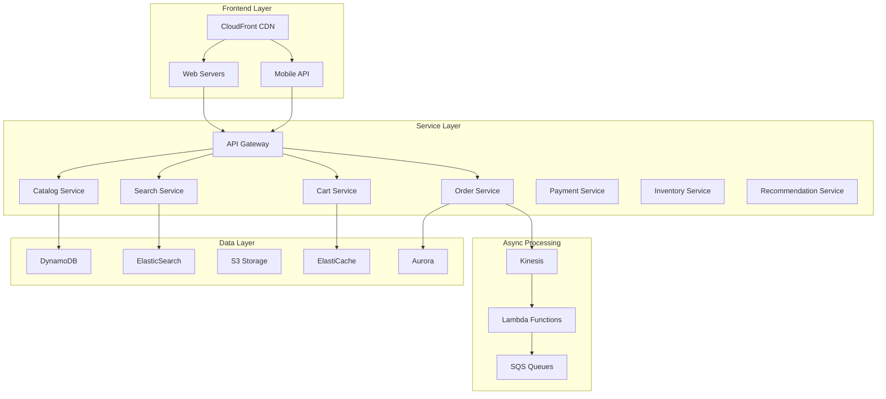
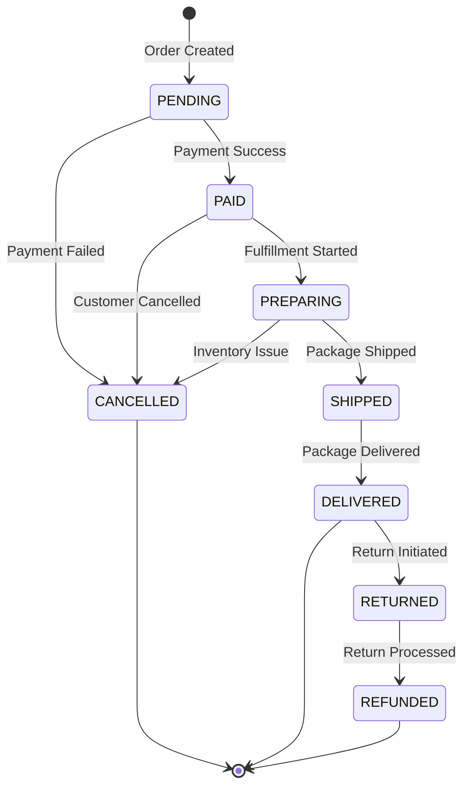

# Design Amazon E-Commerce Platform

## Problem Statement

"Design an e-commerce platform that can handle millions of products, billions of users, with features like product catalog, shopping cart, order management, payments, and fulfillment, while maintaining sub-second latency and 99.99% availability."

## Scale Requirements

```
Amazon Scale (2024):
- Active customers: 300+ million
- Products listed: 350+ million
- Orders per day: 10+ million
- Peak QPS: 100,000+ (Prime Day)
- Warehouses: 1,000+ globally
- Revenue: $500+ billion/year

Performance Targets:
- Page load: <1 second
- Search latency: <100ms
- Checkout success: 99.99%
- Inventory accuracy: 99.9%
```

## System Architecture



## Core Components Design

### 1. Product Catalog Service

```python
class CatalogService:
    def __init__(self):
        self.dynamodb = DynamoDB()
        self.s3 = S3()
        self.cache = ElastiCache()
        
    def get_product(self, product_id):
# Check cache first
        product = self.cache.get(f"product:{product_id}")
        if product:
            return product
            
# Read from DynamoDB
        product = self.dynamodb.get_item(
            TableName='Products',
            Key={'product_id': product_id}
        )
        
# Enrich with S3 data (images, videos)
        product['media'] = self.s3.get_media_urls(product_id)
        
# Cache for future requests
        self.cache.set(f"product:{product_id}", product, ttl=3600)
        
        return product
    
    def update_product(self, product_id, updates):
# Update DynamoDB with conditional checks
        try:
            response = self.dynamodb.update_item(
                TableName='Products',
                Key={'product_id': product_id},
                UpdateExpression='SET #data = :data, version = version + :inc',
                ExpressionAttributeNames={'#data': 'data'},
                ExpressionAttributeValues={
                    ':data': updates,
                    ':inc': 1,
                    ':expected_version': updates.get('expected_version')
                },
                ConditionExpression='version = :expected_version'
            )
            
# Invalidate cache
            self.cache.delete(f"product:{product_id}")
            
# Publish change event
            self.publish_product_change(product_id, updates)
            
        except ConditionalCheckFailedException:
            raise ConcurrentModificationError()
```

### 2. Shopping Cart Service

```python
class CartService:
    """
    Shopping cart with session consistency and high availability
    """
    def __init__(self):
        self.redis = ElastiCache()
        self.dynamodb = DynamoDB()
        
    def add_to_cart(self, user_id, product_id, quantity):
        cart_key = f"cart:{user_id}"
        
# Check inventory first
        available = self.check_inventory(product_id, quantity)
        if not available:
            raise OutOfStockError()
        
# Add to Redis for fast access
        cart = self.redis.hgetall(cart_key)
        if not cart:
            cart = self.load_cart_from_db(user_id)
        
# Update cart
        if product_id in cart:
            cart[product_id]['quantity'] += quantity
        else:
            cart[product_id] = {
                'quantity': quantity,
                'added_at': time.time(),
                'price': self.get_current_price(product_id)
            }
        
# Save to Redis with TTL
        self.redis.hset(cart_key, mapping=cart)
        self.redis.expire(cart_key, 7200)  # 2 hours
        
# Async save to DynamoDB for persistence
        self.async_save_to_db(user_id, cart)
        
        return self.calculate_cart_total(cart)
    
    def checkout(self, user_id):
# Move cart to order processing
        cart = self.get_cart(user_id)
        
# Reserve inventory
        reservations = []
        for product_id, item in cart.items():
            reservation = self.reserve_inventory(
                product_id, 
                item['quantity'],
                duration=900  # 15 minutes
            )
            reservations.append(reservation)
        
# Create order
        order = self.create_order(user_id, cart, reservations)
        
# Clear cart
        self.clear_cart(user_id)
        
        return order
```

### 3. Order Management Service

```python
class OrderService:
    def __init__(self):
        self.aurora = Aurora()
        self.sqs = SQS()
        self.sns = SNS()
        
    def create_order(self, user_id, cart_items, payment_info):
# Begin distributed transaction
        order_id = self.generate_order_id()
        
        try:
# 1. Create order record
            order = {
                'order_id': order_id,
                'user_id': user_id,
                'status': 'PENDING',
                'items': cart_items,
                'total': self.calculate_total(cart_items),
                'created_at': datetime.utcnow()
            }
            
            self.aurora.begin_transaction()
            self.aurora.insert('orders', order)
            
# 2. Process payment
            payment_result = self.process_payment(
                payment_info,
                order['total']
            )
            
            if payment_result.success:
                order['status'] = 'PAID'
                order['payment_id'] = payment_result.transaction_id
                
# 3. Commit inventory
                for item in cart_items:
                    self.commit_inventory_reservation(
                        item['product_id'],
                        item['quantity'],
                        order_id
                    )
                
# 4. Trigger fulfillment
                self.sqs.send_message(
                    QueueUrl=FULFILLMENT_QUEUE,
                    MessageBody=json.dumps({
                        'order_id': order_id,
                        'priority': self.calculate_priority(user_id)
                    })
                )
                
                self.aurora.commit()
                
# 5. Send notifications
                self.send_order_confirmation(user_id, order)
                
            else:
# Rollback on payment failure
                self.aurora.rollback()
                self.release_inventory_reservations(cart_items)
                order['status'] = 'PAYMENT_FAILED'
                
        except Exception as e:
            self.aurora.rollback()
            self.handle_order_failure(order_id, e)
            raise
            
        return order
```

### 4. Search Service

```python
class SearchService:
    def __init__(self):
        self.elasticsearch = ElasticSearch()
        self.ml_ranking = SageMaker()
        self.cache = ElastiCache()
        
    def search(self, query, filters=None, user_id=None):
# Check cache for common queries
        cache_key = self.generate_cache_key(query, filters)
        cached_results = self.cache.get(cache_key)
        if cached_results:
            return self.personalize_results(cached_results, user_id)
        
# Build ES query
        es_query = {
            'multi_match': {
                'query': query,
                'fields': [
                    'title^3',
                    'brand^2',
                    'category^2',
                    'description'
                ],
                'type': 'best_fields'
            }
        }
        
# Apply filters
        if filters:
            es_query = self.apply_filters(es_query, filters)
        
# Execute search
        results = self.elasticsearch.search(
            index='products',
            body={'query': es_query, 'size': 1000}
        )
        
# ML-based ranking
        if user_id:
            results = self.ml_ranking.rank_results(
                results,
                user_features=self.get_user_features(user_id),
                context=self.get_search_context()
            )
        
# Cache popular queries
        if self.is_popular_query(query):
            self.cache.set(cache_key, results, ttl=300)
        
        return results[:50]  # Return top 50
```

### 5. Inventory Management

```python
class InventoryService:
    """
    Distributed inventory with eventual consistency
    """
    def __init__(self):
        self.dynamodb = DynamoDB()
        self.redis = ElastiCache()
        self.kinesis = Kinesis()
        
    def check_availability(self, product_id, quantity, warehouse_id=None):
# Try hot cache first
        cache_key = f"inv:{product_id}:{warehouse_id or 'all'}"
        cached = self.redis.get(cache_key)
        
        if cached:
            return cached >= quantity
        
# Query DynamoDB
        if warehouse_id:
            inventory = self.get_warehouse_inventory(product_id, warehouse_id)
        else:
            inventory = self.get_total_inventory(product_id)
        
# Update cache
        self.redis.setex(cache_key, 60, inventory)
        
        return inventory >= quantity
    
    def reserve_inventory(self, product_id, quantity, order_id, duration=900):
# Optimistic locking with DynamoDB
        for attempt in range(3):
            try:
                current = self.dynamodb.get_item(
                    TableName='Inventory',
                    Key={'product_id': product_id}
                )
                
                if current['available'] < quantity:
                    raise InsufficientInventoryError()
                
# Reserve with conditional update
                self.dynamodb.update_item(
                    TableName='Inventory',
                    Key={'product_id': product_id},
                    UpdateExpression='''
                        SET available = available - :qty,
                            reserved = reserved + :qty,
                            version = version + :inc
                    ''',
                    ExpressionAttributeValues={
                        ':qty': quantity,
                        ':inc': 1,
                        ':expected': current['version']
                    },
                    ConditionExpression='version = :expected'
                )
                
# Track reservation
                self.track_reservation(product_id, quantity, order_id, duration)
                
# Publish event
                self.kinesis.put_record(
                    StreamName='inventory-events',
                    Data=json.dumps({
                        'type': 'RESERVED',
                        'product_id': product_id,
                        'quantity': quantity,
                        'order_id': order_id
                    })
                )
                
                return True
                
            except ConditionalCheckFailedException:
                if attempt < 2:
                    time.sleep(0.1 * (attempt + 1))
                else:
                    raise
```

## Data Models

### Product Data Model

```python
# DynamoDB schema
ProductTable = {
    'TableName': 'Products',
    'PartitionKey': 'product_id',
    'SortKey': 'version',  # For versioning
    'Attributes': {
        'product_id': str,
        'version': int,
        'title': str,
        'description': str,
        'price': Decimal,
        'category_path': list,  # ["Electronics", "Computers", "Laptops"]
        'brand': str,
        'attributes': dict,  # Flexible attributes
        'media_urls': list,
        'inventory_tracked': bool,
        'fulfillment_options': list,
        'created_at': datetime,
        'updated_at': datetime
    },
    'GSI': [
        {
            'Name': 'CategoryIndex',
            'PartitionKey': 'category',
            'SortKey': 'popularity_score'
        },
        {
            'Name': 'BrandIndex',
            'PartitionKey': 'brand',
            'SortKey': 'created_at'
        }
    ]
}
```

### Order State Machine



## Performance Optimizations

### 1. Caching Strategy

```python
class MultiLevelCache:
    """
    L1: CloudFront (Edge)
    L2: ElastiCache (Regional)
    L3: Application Cache (Local)
    """
    def get_product(self, product_id):
# L1: Check CloudFront
# Handled by CDN automatically
        
# L2: Check ElastiCache
        product = self.elasticache.get(f"product:{product_id}")
        if product:
            return product
        
# L3: Check local cache
        product = self.local_cache.get(product_id)
        if product:
# Refresh L2
            self.elasticache.set(f"product:{product_id}", product)
            return product
        
# Load from database
        product = self.load_from_db(product_id)
        
# Update all cache levels
        self.update_all_caches(product_id, product)
        
        return product
```

### 2. Database Sharding

```python
class ShardingStrategy:
    def get_shard(self, key, shard_type):
        if shard_type == "USER":
# User data sharded by user_id
            return hash(key) % NUM_USER_SHARDS
        elif shard_type == "PRODUCT":
# Product data sharded by category + brand
            category = extract_category(key)
            return hash(category) % NUM_PRODUCT_SHARDS
        elif shard_type == "ORDER":
# Orders sharded by date + region
            date = extract_date(key)
            region = extract_region(key)
            return hash(f"{date}:{region}") % NUM_ORDER_SHARDS
```

## Cost Optimizations

### 1. S3 Storage Tiers

```python
def optimize_storage_costs():
    storage_policy = {
        "product_images": {
            "initial": "S3 Standard",
            "after_30_days": "S3 Standard-IA",
            "after_90_days": "S3 Glacier Instant",
            "lifecycle": "Auto-transition"
        },
        "order_documents": {
            "initial": "S3 Standard",
            "after_7_days": "S3 Standard-IA",
            "after_365_days": "S3 Glacier",
            "after_7_years": "Delete"
        }
    }
    return storage_policy
```

### 2. Compute Optimization

```python
class AutoScalingPolicy:
    def __init__(self):
        self.metrics = CloudWatch()
        
    def scale_decision(self):
# Scale based on multiple metrics
        cpu = self.metrics.get_average_cpu()
        response_time = self.metrics.get_response_time_p99()
        queue_depth = self.metrics.get_sqs_queue_depth()
        
        if cpu > 70 or response_time > 500 or queue_depth > 1000:
            return "SCALE_UP"
        elif cpu < 30 and response_time < 100 and queue_depth < 100:
            return "SCALE_DOWN"
        else:
            return "MAINTAIN"
```

## Operational Excellence

### 1. Monitoring and Alerting

```python
class OperationalDashboard:
    def key_metrics(self):
        return {
            "Business Metrics": [
                "Orders per minute",
                "Conversion rate",
                "Average order value",
                "Cart abandonment rate"
            ],
            "Technical Metrics": [
                "API latency (p50, p99)",
                "Error rate by service",
                "Database connection pool",
                "Cache hit rate"
            ],
            "Operational Metrics": [
                "Deployment frequency",
                "Mean time to recovery",
                "Change failure rate",
                "Runbook automation %"
            ]
        }
```

### 2. Chaos Engineering

```python
def chaos_experiments():
    return [
        {
            "name": "Region Failure",
            "test": "Disable us-east-1",
            "expected": "Failover to us-west-2 < 30s",
            "validation": "No customer impact"
        },
        {
            "name": "Database Failure",
            "test": "Kill primary DB",
            "expected": "Promote replica < 60s",
            "validation": "< 0.1% failed transactions"
        }
    ]
```

## Interview Deep Dive Topics

### 1. How do you handle Prime Day scale?

```python
def prime_day_preparation():
    strategies = {
        "Capacity": "Pre-scale 3x normal capacity",
        "Caching": "Pre-warm caches with deal products",
        "Database": "Read replicas in all regions",
        "Testing": "Load test at 5x normal traffic",
        "Fallbacks": "Graceful degradation ready",
        "War Room": "24/7 monitoring with all teams"
    }
    return strategies
```

### 2. How do you ensure inventory accuracy?

```python
def inventory_accuracy():
    mechanisms = {
        "Two-Phase Commit": "Reserve then commit pattern",
        "Eventual Consistency": "Accept temporary oversell",
        "Reconciliation": "Hourly inventory audits",
        "ML Prediction": "Predict demand and pre-position",
        "Real-time Sync": "Warehouse systems integration"
    }
    return mechanisms
```

## Common Interview Questions

1. **"How do you handle the shopping cart across sessions?"**
   - Use Redis for active sessions with TTL
   - Persist to DynamoDB for long-term storage
   - Merge carts on login

2. **"How do you prevent overselling during flash sales?"**
   - Distributed locks with timeout
   - Inventory reservation pattern
   - Eventual consistency with reconciliation

3. **"How do you scale search for 350M products?"**
   - ElasticSearch with sharding
   - ML-based query understanding
   - Aggressive caching for popular queries

4. **"How do you handle payment failures?"**
   - Idempotent payment processing
   - Automatic retry with backoff
   - Clear state machine for order status

5. **"How do you optimize for mobile users?"**
   - Progressive web app
   - Image optimization and lazy loading
   - Offline capability with service workers

[Return to Amazon Interview Guide](./index.md)