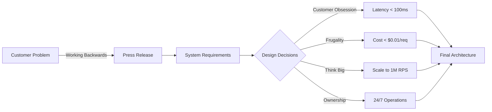
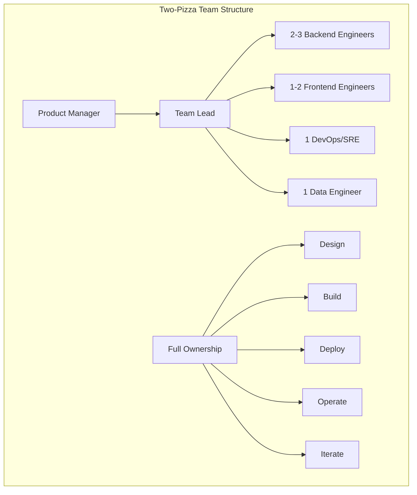
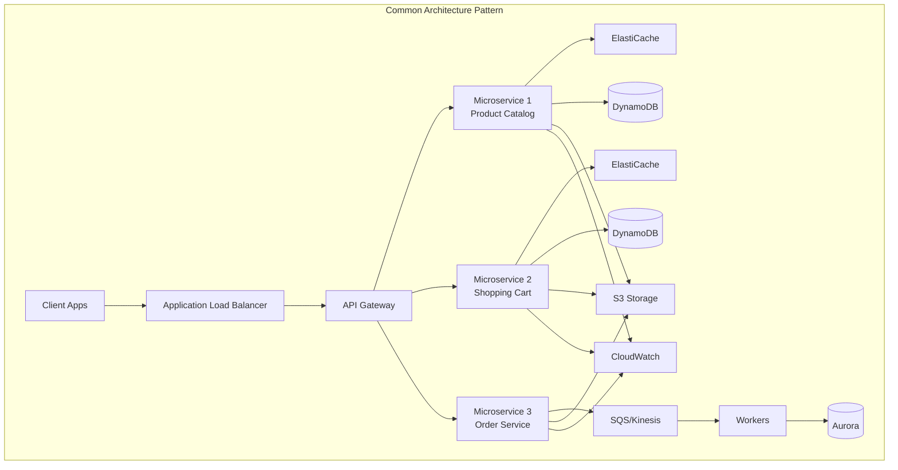
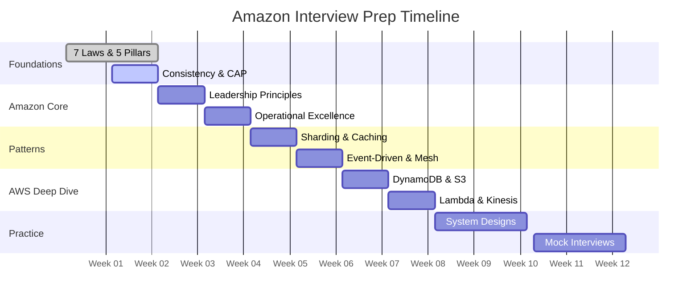
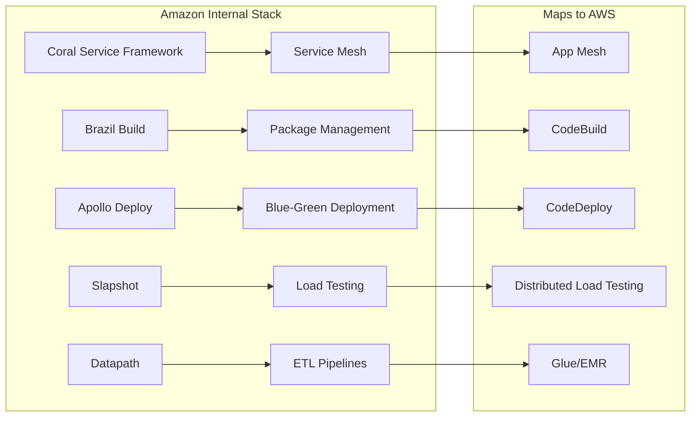
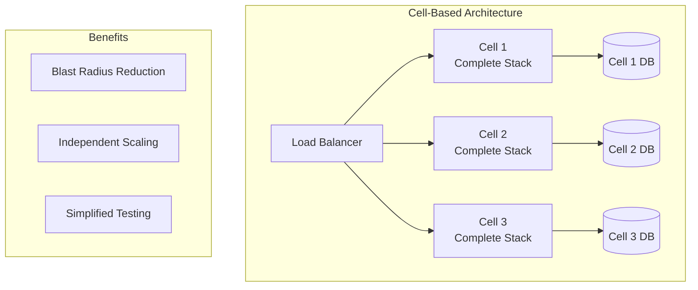
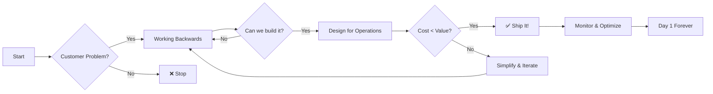

# Amazon System Design Interview Guide

<h3>⚡ Quick Reference</h3>
<ul>
<li><strong>Focus:</strong> Leadership Principles + Technical Excellence</li>
<li><strong>Unique:</strong> Operational rigor, cost consciousness, customer obsession</li>
<li><strong>Scale:</strong> Design for 10x growth, millions of RPS</li>
<li><strong>Mindset:</strong> Day 1 mentality, two-pizza teams, working backwards</li>
</ul>

## Amazon vs Other Tech Companies

| Aspect | Amazon | Google/Meta | Microsoft |
|--------|---------|-------------|------------|
| **Primary Focus** | Customer + Operations | Technical Innovation | Enterprise Integration |
| **Scale Philosophy** | Frugal, constraint-driven | Unlimited resources | Hybrid cloud |
| **Team Structure** | Two-pizza teams | Large eng teams | Cross-functional |
| **Design Approach** | Working backwards | Technology first | Platform thinking |
| **Key Metrics** | Cost, latency, availability | Innovation, scale | Compatibility, security |
| **Failure Handling** | Mechanisms > intentions | Redundancy | Graceful degradation |

## Leadership Principles → System Design Matrix

<h3>🎯 Leadership Principles Quick Reference</h3>
<table class="responsive-table">
  <thead>
    <tr>
<th>Principle</th>
<th>System Design Application</th>
<th>Key Questions</th>
</tr>
  </thead>
  <tbody>
    <tr>
<td data-label="Principle"><strong>Customer Obsession</strong></td>
<td data-label="System Design Application">Start with use cases, optimize for CX metrics</td>
<td data-label="Key Questions">What's the customer impact? Latency SLA?</td>
</tr>
    <tr>
<td data-label="Principle"><strong>Ownership</strong></td>
<td data-label="System Design Application">Design for operations, long-term thinking</td>
<td data-label="Key Questions">Who owns this at 3am? 5-year TCO?</td>
</tr>
    <tr>
<td data-label="Principle"><strong>Invent & Simplify</strong></td>
<td data-label="System Design Application">Remove complexity, innovate through constraints</td>
<td data-label="Key Questions">Can we eliminate this component?</td>
</tr>
    <tr>
<td data-label="Principle"><strong>Are Right, A Lot</strong></td>
<td data-label="System Design Application">Data-driven decisions, learn from prod</td>
<td data-label="Key Questions">What data supports this choice?</td>
</tr>
    <tr>
<td data-label="Principle"><strong>Think Big</strong></td>
<td data-label="System Design Application">Design for 10x scale from day one</td>
<td data-label="Key Questions">What breaks at 10x load?</td>
</tr>
    <tr>
<td data-label="Principle"><strong>Bias for Action</strong></td>
<td data-label="System Design Application">MVP first, iterate fast, reversible decisions</td>
<td data-label="Key Questions">Can we ship v1 in 2 weeks?</td>
</tr>
    <tr>
<td data-label="Principle"><strong>Frugality</strong></td>
<td data-label="System Design Application">Cost-aware architecture, do more with less</td>
<td data-label="Key Questions">What's the cost per transaction?</td>
</tr>
    <tr>
<td data-label="Principle"><strong>Dive Deep</strong></td>
<td data-label="System Design Application">Know bottlenecks, understand failure modes</td>
<td data-label="Key Questions">What's the p99 latency breakdown?</td>
</tr>
  </tbody>
</table>

## Amazon's Unique Design Philosophy

<h3>💡 The Amazon Difference</h3>
<table class="responsive-table">
  <thead>
    <tr>
<th>Concept</th>
<th>Implementation</th>
<th>Anti-Pattern</th>
</tr>
  </thead>
  <tbody>
    <tr>
<td data-label="Concept"><strong>Operational Excellence</strong></td>
<td data-label="Implementation">• Runbooks for every alert • Metrics dashboard from day 1 • On-call rotation planned</td>
<td data-label="Anti-Pattern">"We'll add monitoring later"</td>
</tr>
    <tr>
<td data-label="Concept"><strong>Cost Consciousness</strong></td>
<td data-label="Implementation">• $/request calculated • Auto-scaling policies • Reserved capacity planning</td>
<td data-label="Anti-Pattern">"Hardware is cheap"</td>
</tr>
    <tr>
<td data-label="Concept"><strong>Working Backwards</strong></td>
<td data-label="Implementation">• Start with press release • Define success metrics • MVP in 2 weeks</td>
<td data-label="Anti-Pattern">"Let's build it and see"</td>
</tr>
    <tr>
<td data-label="Concept"><strong>Two-Pizza Teams</strong></td>
<td data-label="Implementation">• 6-10 person ownership • Full stack responsibility • Independent deployment</td>
<td data-label="Anti-Pattern">"The platform team handles that"</td>
</tr>
    <tr>
<td data-label="Concept"><strong>Mechanisms > Intentions</strong></td>
<td data-label="Implementation">• Automated deployments • Self-healing systems • Policy as code</td>
<td data-label="Anti-Pattern">"The team will remember"</td>
</tr>
  </tbody>
</table>

Related: <a href="/part2-pillars/control/">Control Distribution</a>, <a href="/part1-axioms/law1-failure/">Correlated Failure</a>

## System Design Questions by Category

<h3>📋 Question Difficulty & Focus Areas</h3>
<table class="responsive-table">
  <thead>
    <tr>
<th>Category</th>
<th>Example Questions</th>
<th>Key Challenges</th>
<th>Leadership Focus</th>
</tr>
  </thead>
  <tbody>
    <tr>
<td data-label="Category"><strong>E-Commerce</strong></td>
<td data-label="Example Questions">• Product Catalog • Shopping Cart • Order System</td>
<td data-label="Key Challenges">Scale, consistency, latency</td>
<td data-label="Leadership Focus">Customer Obsession, Frugality</td>
</tr>
    <tr>
<td data-label="Category"><strong>AWS Services</strong></td>
<td data-label="Example Questions">• <a href="s3.md">S3</a> • <a href="dynamodb.md">DynamoDB</a> • Lambda</td>
<td data-label="Key Challenges">Multi-tenancy, durability, cost</td>
<td data-label="Leadership Focus">Think Big, Dive Deep</td>
</tr>
    <tr>
<td data-label="Category"><strong>Logistics</strong></td>
<td data-label="Example Questions">• Last-mile delivery • Route optimization • Inventory</td>
<td data-label="Key Challenges">Real-time optimization, constraints</td>
<td data-label="Leadership Focus">Deliver Results, Ownership</td>
</tr>
    <tr>
<td data-label="Category"><strong>Streaming</strong></td>
<td data-label="Example Questions">• <a href="prime-video.md">Prime Video</a> • Twitch • Music</td>
<td data-label="Key Challenges">CDN, buffering, quality adaptation</td>
<td data-label="Leadership Focus">Customer Obsession, Innovation</td>
</tr>
  </tbody>
</table>

See also: <a href="/part2-pillars/work/">Work Distribution</a> for scaling strategies

## Interview Process Timeline

```mermaid
gantt
    title Amazon Interview Process
    dateFormat X
    axisFormat %s
    
    section Phone Screen
    System Design (45-60min) :active, 0, 60
    
    section Onsite Loop
    System Design 1 :active, 0, 60
    System Design 2 :active, 70, 60
    Coding 1 :140, 60
    Coding 2 :210, 60
    Behavioral :280, 60
    Bar Raiser :350, 60
```

<h3>⏱️ System Design Round Breakdown</h3>
<table class="responsive-table">
  <thead>
    <tr>
<th>Phase</th>
<th>Time</th>
<th>Focus</th>
<th>Deliverables</th>
</tr>
  </thead>
  <tbody>
    <tr>
<td data-label="Phase"><strong>1. Requirements</strong></td>
<td data-label="Time">5-10 min</td>
<td data-label="Focus">• Functional/Non-functional • Scale (QPS, storage) • Constraints (cost, latency)</td>
<td data-label="Deliverables">• Use cases list • Numbers (100M users, 10K QPS) • SLAs (99.9%, <100ms)</td>
</tr>
    <tr>
<td data-label="Phase"><strong>2. High-Level</strong></td>
<td data-label="Time">10-15 min</td>
<td data-label="Focus">• Architecture diagram • Component interaction • API design</td>
<td data-label="Deliverables">• Box & arrow diagram • REST/gRPC APIs • Data flow</td>
</tr>
    <tr>
<td data-label="Phase"><strong>3. Deep Dive</strong></td>
<td data-label="Time">15-20 min</td>
<td data-label="Focus">• Data models • Algorithms • Technology choices</td>
<td data-label="Deliverables">• Schema design • Consistency strategy • Tech stack justification</td>
</tr>
    <tr>
<td data-label="Phase"><strong>4. Scale</strong></td>
<td data-label="Time">10-15 min</td>
<td data-label="Focus">• Bottlenecks • Optimization • Cost analysis</td>
<td data-label="Deliverables">• Performance calculations • Caching strategy • $/request analysis</td>
</tr>
    <tr>
<td data-label="Phase"><strong>5. Operations</strong></td>
<td data-label="Time">5-10 min</td>
<td data-label="Focus">• Monitoring • Deployment • Failure modes</td>
<td data-label="Deliverables">• Metrics & alerts • Rollout strategy • Disaster recovery</td>
</tr>
  </tbody>
</table>

Master <a href="/part1-axioms/law2-asynchrony/">Asynchronous Reality</a> before deep dives

## 12-Week Preparation Roadmap

<h3>📚 Priority Study Matrix</h3>
<table class="responsive-table">
  <thead>
    <tr>
<th>Week</th>
<th>Must Do</th>
<th>Should Do</th>
<th>Nice to Have</th>
</tr>
  </thead>
  <tbody>
    <tr>
<td data-label="Week"><strong>1-2</strong></td>
<td data-label="Must Do">• <a href="/part1-axioms/">7 Laws</a> • <a href="/part2-pillars/">5 Pillars</a></td>
<td data-label="Should Do">• CAP Theorem • Consistency Models</td>
<td data-label="Nice to Have">• Failure stories</td>
</tr>
    <tr>
<td data-label="Week"><strong>3-4</strong></td>
<td data-label="Must Do">• <a href="leadership-principles.md">Leadership Principles</a> • Two-pizza teams</td>
<td data-label="Should Do">• Working Backwards • Day 1 mentality</td>
<td data-label="Nice to Have">• Amazon history</td>
</tr>
    <tr>
<td data-label="Week"><strong>5-6</strong></td>
<td data-label="Must Do">• <a href="/patterns/sharding">Sharding</a> • <a href="/patterns/caching-strategies">Caching</a></td>
<td data-label="Should Do">• Event sourcing • CQRS</td>
<td data-label="Nice to Have">• Service mesh</td>
</tr>
    <tr>
<td data-label="Week"><strong>7-8</strong></td>
<td data-label="Must Do">• <a href="dynamodb.md">DynamoDB</a> • <a href="s3.md">S3</a></td>
<td data-label="Should Do">• Lambda • SQS/SNS</td>
<td data-label="Nice to Have">• Kinesis</td>
</tr>
    <tr>
<td data-label="Week"><strong>9-12</strong></td>
<td data-label="Must Do">• 10 practice problems • 5 mock interviews</td>
<td data-label="Should Do">• Behavioral stories • Failure scenarios</td>
<td data-label="Nice to Have">• Edge cases</td>
</tr>
  </tbody>
</table>

Foundation: <a href="/part1-axioms/">7 Laws</a> → <a href="/part2-pillars/">5 Pillars</a> → Patterns → Practice

## Amazon Technology Stack

<h3>🛠️ Core Technologies Comparison</h3>
<table class="responsive-table">
  <thead>
    <tr>
<th>Service</th>
<th>Use Case</th>
<th>Scale</th>
<th>Trade-offs</th>
</tr>
  </thead>
  <tbody>
    <tr>
<td data-label="Service"><strong>DynamoDB</strong></td>
<td data-label="Use Case">NoSQL, high throughput</td>
<td data-label="Scale">Millions TPS</td>
<td data-label="Trade-offs">✅ Predictable performance ❌ Query flexibility</td>
</tr>
    <tr>
<td data-label="Service"><strong>S3</strong></td>
<td data-label="Use Case">Object storage</td>
<td data-label="Scale">Trillions of objects</td>
<td data-label="Trade-offs">✅ 11 9s durability ❌ Not for small files</td>
</tr>
    <tr>
<td data-label="Service"><strong>SQS</strong></td>
<td data-label="Use Case">Message queue</td>
<td data-label="Scale">Unlimited</td>
<td data-label="Trade-offs">✅ Simple, reliable ❌ No ordering (standard)</td>
</tr>
    <tr>
<td data-label="Service"><strong>Lambda</strong></td>
<td data-label="Use Case">Event-driven compute</td>
<td data-label="Scale">1000s concurrent</td>
<td data-label="Trade-offs">✅ No servers ❌ 15min limit, cold starts</td>
</tr>
    <tr>
<td data-label="Service"><strong>Kinesis</strong></td>
<td data-label="Use Case">Real-time streaming</td>
<td data-label="Scale">GB/sec</td>
<td data-label="Trade-offs">✅ Real-time processing ❌ 7-day retention</td>
</tr>
  </tbody>
</table>

Applies <a href="/part2-pillars/state/">State Distribution</a> & <a href="/part2-pillars/truth/">Truth Distribution</a> principles

## Success Checklist

<h3>🚨 Common Failure Modes</h3>
<table class="responsive-table">
  <thead>
    <tr>
<th>Mistake</th>
<th>Why It Fails</th>
<th>Do Instead</th>
</tr>
  </thead>
  <tbody>
    <tr>
<td data-label="Mistake">"We'll use Kubernetes"</td>
<td data-label="Why It Fails">Over-engineering, high operational cost</td>
<td data-label="Do Instead">Start with EC2 + ALB, evolve if needed</td>
</tr>
    <tr>
<td data-label="Mistake">"Infinite scale design"</td>
<td data-label="Why It Fails">Ignores cost, unrealistic</td>
<td data-label="Do Instead">Design for 10x with cost targets</td>
</tr>
    <tr>
<td data-label="Mistake">"Perfect consistency"</td>
<td data-label="Why It Fails">Impossible in distributed systems</td>
<td data-label="Do Instead">Define consistency boundaries</td>
</tr>
    <tr>
<td data-label="Mistake">"We'll monitor later"</td>
<td data-label="Why It Fails">Violates operational excellence</td>
<td data-label="Do Instead">Metrics from day 1</td>
</tr>
    <tr>
<td data-label="Mistake">"The team will handle it"</td>
<td data-label="Why It Fails">No mechanisms</td>
<td data-label="Do Instead">Automate everything possible</td>
</tr>
  </tbody>
</table>

Violates <a href="/part1-axioms/law5-epistemology/">Distributed Knowledge</a> principles

<h3>✅ Success Formula</h3>
<ol>
<li><strong>Customer First:</strong> "This reduces checkout time from 3 clicks to 1"</li>
<li><strong>Numbers Always:</strong> "At 100K QPS, this costs $0.002/request"</li>
<li><strong>Failure Planning:</strong> "When AZ fails, we failover in <30s"</li>
<li><strong>Operations Ready:</strong> "P99 latency dashboard, PagerDuty integration"</li>
<li><strong>Team Ownership:</strong> "6-person team owns build/run/iterate"</li>
</ol>

  

## Quick Reference Architecture Patterns

<h3>🎯 Pattern Selection Guide</h3>
<table class="responsive-table">
  <thead>
    <tr>
<th>Pattern</th>
<th>When to Use</th>
<th>Amazon Example</th>
<th>Key Benefit</th>
</tr>
  </thead>
  <tbody>
    <tr>
<td data-label="Pattern"><strong>Cell-Based</strong></td>
<td data-label="When to Use">Multi-tenant isolation</td>
<td data-label="Amazon Example">Route 53, DynamoDB</td>
<td data-label="Key Benefit">Blast radius control</td>
</tr>
    <tr>
<td data-label="Pattern"><strong>Shuffle Sharding</strong></td>
<td data-label="When to Use">Shared resource pools</td>
<td data-label="Amazon Example">ALB target groups</td>
<td data-label="Key Benefit">Failure isolation</td>
</tr>
    <tr>
<td data-label="Pattern"><strong>Backpressure</strong></td>
<td data-label="When to Use">Async processing</td>
<td data-label="Amazon Example">Kinesis, SQS</td>
<td data-label="Key Benefit">System stability</td>
</tr>
    <tr>
<td data-label="Pattern"><strong>Circuit Breaker</strong></td>
<td data-label="When to Use">External dependencies</td>
<td data-label="Amazon Example">Service calls</td>
<td data-label="Key Benefit">Fast failure</td>
</tr>
  </tbody>
</table>

Implements <a href="/patterns/circuit-breaker">Circuit Breaker</a> & <a href="/patterns/bulkhead">Bulkhead</a> patterns

## Final Success Formula

<h3>🎯 The Amazon System Design Equation</h3>

Customer Value × Operational Excellence × Cost Efficiency = Success

<h3>💪 Remember: It's Always Day 1</h3>
<ul>
<li><strong>Customer Obsession:</strong> Every decision starts and ends with customer impact</li>
<li><strong>Long-term Value:</strong> Build for decades, not quarters</li>
<li><strong>Mechanisms:</strong> Automate good intentions into systems</li>
<li><strong>Frugality:</strong> Constraints breed innovation</li>
<li><strong>Ownership:</strong> You build it, you run it</li>
</ul>

Success = Mastery of <a href="/part1-axioms/law7-economics/">Economic Reality</a> + <a href="/part2-pillars/intelligence/">Intelligence Distribution</a>

