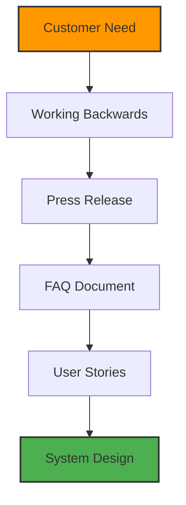
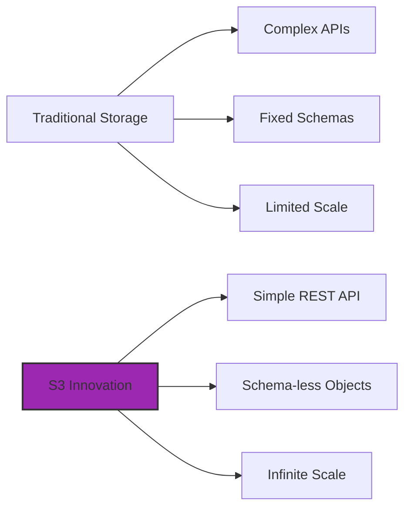
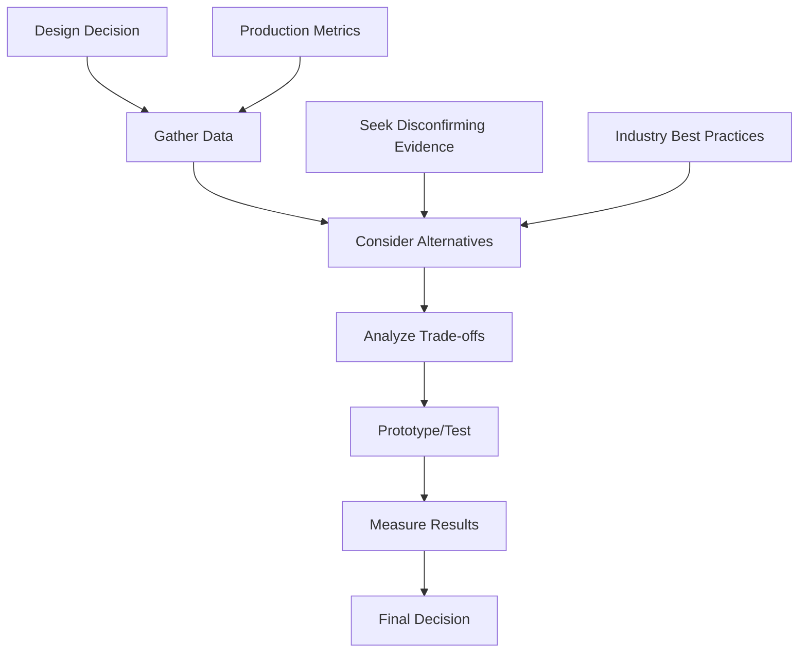
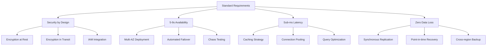
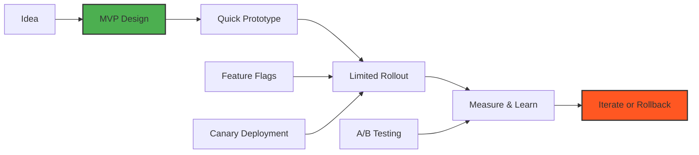
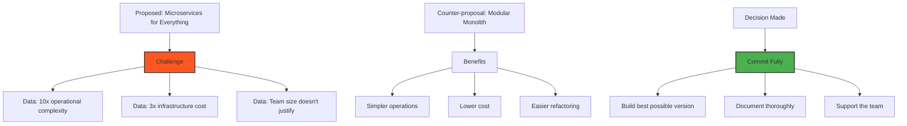
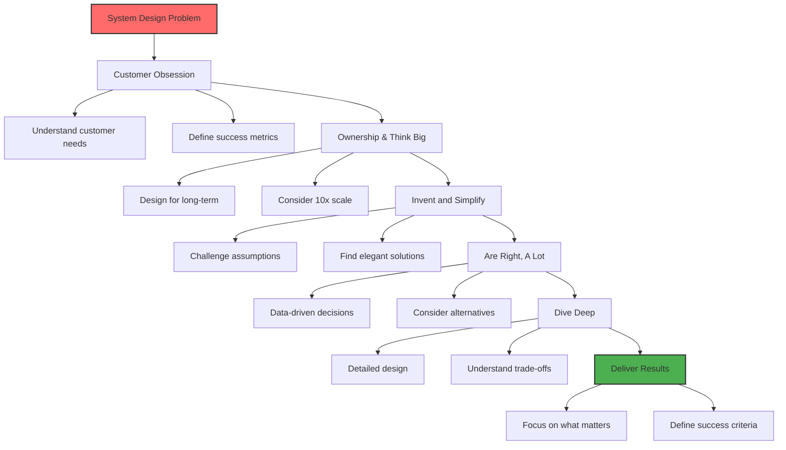

# Amazon's Leadership Principles in System Design

## Overview: Why Leadership Principles Matter in Technical Interviews

Amazon's Leadership Principles (LPs) aren't just corporate values—they're the decision-making framework that drives every architectural choice at Amazon. In system design interviews, demonstrating how these principles guide your technical decisions is as important as the technical solution itself.

!!! tip "Key Insight"
 Amazon evaluates system design through the lens of Leadership Principles. Your technical choices must align with these principles to succeed in interviews and at Amazon.

## The 16 Leadership Principles Applied to System Design

### 1. Customer Obsession

**Principle**: Leaders start with the customer and work backwards. They work vigorously to earn and keep customer trust. Although leaders pay attention to competitors, they obsess over customers.

**In System Design**:
- **Start with Customer Requirements**: Always begin by understanding the customer problem, not the technical solution
- **Design for Customer Experience**: Prioritize latency, availability, and usability metrics that directly impact customers
- **Cost to Customer**: Consider both direct costs (pricing) and indirect costs (complexity, learning curve)

**Example Application**:


**Real-World Example**: DynamoDB Design
- **Customer Problem**: Developers needed a database that "just works" without managing servers, sharding, or replication
- **Solution**: Fully managed NoSQL with automatic scaling, built-in replication, and predictable performance
- **Trade-off**: Higher cost per operation vs traditional databases, but total cost of ownership is lower due to zero operational overhead

### 2. Ownership

**Principle**: Leaders are owners. They think long term and don't sacrifice long-term value for short-term results. They act on behalf of the entire company, beyond just their own team. They never say "that's not my job."

**In System Design**:
- **Design for Long-term**: Build systems that can evolve for 5-10 years, not just current requirements
- **Total Cost of Ownership**: Consider operational costs, not just development costs
- **Cross-team Impact**: Design APIs and services that other teams can build upon

**Example Application**:
```python
# Good: Designing with ownership mentality
class OrderService:
 def __init__(self):
 self.metrics = MetricsCollector()
 self.monitoring = MonitoringService()
 self.runbook = RunbookGenerator()
 
 def place_order(self, order):
# Not just the happy path
 try:
 result = self._process_order(order)
 self.metrics.record_success()
 return result
 except Exception as e:
 self.metrics.record_failure(e)
 self.monitoring.alert_on_threshold()
 self.runbook.generate_remediation_steps(e)
 raise

# Bad: Just solving the immediate problem
def place_order(order):
# What about monitoring? Scaling? Error handling?
 return database.insert(order)
```

### 3. Invent and Simplify

**Principle**: Leaders expect and require innovation and invention from their teams, and always find ways to simplify. They are externally aware, look for new ideas from everywhere, and are not limited by "not invented here." As we do new things, we accept that we may be misunderstood for long periods of time.

**In System Design**:
- **Challenge Assumptions**: Question why things are done a certain way
- **Simplify Ruthlessly**: The best systems are simple, not simplistic
- **Innovative Solutions**: Don't just copy existing patterns—improve them

**Example Application**: S3's Design Innovation


**Real Example**: S3's PUT/GET/DELETE API
- **Innovation**: Treating storage as simple key-value pairs with HTTP verbs
- **Simplification**: No file system semantics, no directories (just key prefixes)
- **Result**: Scales to trillions of objects with consistent API

### 4. Are Right, A Lot

**Principle**: Leaders are right a lot. They have strong judgment and good instincts. They seek diverse perspectives and work to disconfirm their beliefs.

**In System Design**:
- **Data-Driven Decisions**: Use metrics, benchmarks, and calculations to justify choices
- **Consider Alternatives**: Always present multiple approaches with trade-offs
- **Learn from Production**: Study what works and fails in real systems

**Decision Framework**:


### 5. Learn and Be Curious

**Principle**: Leaders are never done learning and always seek to improve themselves. They are curious about new possibilities and act to explore them.

**In System Design**:
- **Stay Current**: Know modern patterns, technologies, and industry trends
- **Question Everything**: "Why does it work this way?" leads to better designs
- **Continuous Learning**: Each system teaches lessons for the next

**Learning Application**:
```yaml
# Example: Evolution of Amazon's Architecture
2000: Monolithic Application
 - Problem: Scaling bottlenecks
 - Learning: Monoliths don't scale with teams

2002: Service-Oriented Architecture
 - Problem: Service dependencies
 - Learning: Need better service isolation

2006: AWS Launch
 - Problem: Internal tools could help others
 - Learning: Infrastructure as a Service

2014: Lambda Launch
 - Problem: Server management overhead
 - Learning: Serverless is the future

2020: Cell-Based Architecture
 - Problem: Blast radius of failures
 - Learning: Isolation improves availability
```

### 6. Hire and Develop the Best

**Principle**: Leaders raise the performance bar with every hire and promotion. They recognize exceptional talent, and willingly move them throughout the organization. Leaders develop leaders and take seriously their role in coaching others.

**In System Design**:
- **Design for Team Scale**: Build systems that new engineers can understand and contribute to
- **Clear Interfaces**: APIs and services should be self-documenting
- **Growth-Enabling Architecture**: Allow teams to innovate without breaking things

**Team-Scalable Design Example**:
```python
# Good: Clear, self-documenting service interface
class PaymentService:
 """Handles payment processing with clear boundaries"""
 
 @validate_input
 @rate_limit(1000) # Clear operational limits
 @monitor_latency
 def process_payment(
 self,
 amount: Decimal,
 currency: Currency,
 payment_method: PaymentMethod,
 idempotency_key: str # Prevents double charging
 ) -> PaymentResult:
 """
 Process a payment transaction.
 
 Args:
 amount: Payment amount (min: 0.01)
 currency: ISO 4217 currency code
 payment_method: Customer's payment method
 idempotency_key: Unique key to prevent duplicates
 
 Returns:
 PaymentResult with transaction_id and status
 
 Raises:
 InsufficientFundsError: If payment method lacks funds
 InvalidPaymentMethodError: If payment method is invalid
 
 SLA: 99.99% availability, p99 latency < 200ms
 """
 pass
```

### 7. Insist on the Highest Standards

**Principle**: Leaders have relentlessly high standards—many people may think these standards are unreasonably high. Leaders are continually raising the bar and drive their teams to deliver high quality products, services, and processes.

**In System Design**:
- **Non-Negotiable Requirements**: Security, data integrity, and availability aren't optional
- **Quality Metrics**: Define and enforce SLAs, error budgets, and performance targets
- **Continuous Improvement**: Good enough today isn't good enough tomorrow

**High Standards Example**:


### 8. Think Big

**Principle**: Thinking small is a self-fulfilling prophecy. Leaders create and communicate a bold direction that inspires results. They think differently and look around corners for ways to serve customers.

**In System Design**:
- **Design for 10x-100x Growth**: Current scale is just the starting point
- **Global Scale from Day One**: Consider multi-region, multi-language, multi-currency
- **Platform Thinking**: Build platforms, not just features

**Scale Evolution Example**:
```python
# Evolution of thinking big in design

# Phase 1: Small thinking (handles thousands)
def get_user_orders(user_id):
 return db.query(f"SELECT * FROM orders WHERE user_id = {user_id}")

# Phase 2: Medium thinking (handles millions)
def get_user_orders(user_id):
 cache_key = f"orders:{user_id}"
 cached = cache.get(cache_key)
 if cached:
 return cached
 
 orders = db.query("SELECT * FROM orders WHERE user_id = ?", user_id)
 cache.set(cache_key, orders, ttl=300)
 return orders

# Phase 3: Big thinking (handles billions)
class OrderService:
 def __init__(self):
 self.cache_cluster = CacheCluster()
 self.db_shards = ShardedDatabase()
 self.event_stream = Kinesis()
 
 async def get_user_orders(self, user_id, pagination_token=None):
# Shard by user_id for horizontal scaling
 shard = self.get_shard(user_id)
 
# Multi-tier caching strategy
 l1_cache = self.cache_cluster.get_l1(user_id)
 if l1_cache:
 return l1_cache
 
# Async replication lag handling
 consistency_level = self.determine_consistency_needs(user_id)
 
# Paginated results for large customers
 orders = await self.db_shards.query_paginated(
 shard=shard,
 query="SELECT * FROM orders WHERE user_id = ?",
 params=[user_id],
 page_token=pagination_token,
 consistency=consistency_level
 )
 
# Stream changes for real-time updates
 self.event_stream.publish("order_accessed", {
 "user_id": user_id,
 "timestamp": time.now()
 })
 
 return orders
```

### 9. Bias for Action

**Principle**: Speed matters in business. Many decisions and actions are reversible and do not need extensive study. We value calculated risk taking.

**In System Design**:
- **MVP First**: Build the minimum viable system, then iterate
- **Reversible Decisions**: Use feature flags, gradual rollouts, and rollback capabilities
- **Rapid Experimentation**: Design for A/B testing and quick changes

**Bias for Action Architecture**:


### 10. Frugality

**Principle**: Accomplish more with less. Constraints breed resourcefulness, self-sufficiency, and invention. There are no extra points for growing headcount, budget size, or fixed expense.

**In System Design**:
- **Cost-Aware Architecture**: Every design decision has cost implications
- **Resource Optimization**: Use resources efficiently (CPU, memory, network, storage)
- **Innovative Constraints**: Limitations often lead to better solutions

**Frugality in Practice**:
```python
# Example: Cost-optimized caching strategy

class FrugalCacheStrategy:
 def __init__(self):
# Use local memory for hot data (free)
 self.l1_cache = LRUCache(max_size=1000)
 
# Use Redis for warm data (low cost)
 self.l2_cache = RedisCache(
 max_memory="1gb",
 eviction_policy="allkeys-lru"
 )
 
# Use S3 for cold data (lowest cost)
 self.l3_cache = S3Cache(
 storage_class="INFREQUENT_ACCESS"
 )
 
 def get(self, key):
# Check caches in order of cost
 value = self.l1_cache.get(key)
 if value:
 return value
 
 value = self.l2_cache.get(key)
 if value:
 self.l1_cache.put(key, value) # Promote to L1
 return value
 
 value = self.l3_cache.get(key)
 if value:
 self.l2_cache.put(key, value) # Promote to L2
 self.l1_cache.put(key, value) # Promote to L1
 return value
 
 return None

# Cost calculation example
def calculate_storage_cost(data_size_gb, access_pattern):
 costs = {
 'memory': 0.10, # $/GB/hour
 'ssd': 0.08, # $/GB/month 
 'hdd': 0.02, # $/GB/month
 's3_standard': 0.023,# $/GB/month
 's3_ia': 0.0125, # $/GB/month
 'glacier': 0.004 # $/GB/month
 }
 
 if access_pattern == 'realtime':
 return costs['memory'] * data_size_gb * 730 # hours/month
 elif access_pattern == 'frequent':
 return costs['ssd'] * data_size_gb
 elif access_pattern == 'infrequent':
 return costs['s3_ia'] * data_size_gb
 else: # archive
 return costs['glacier'] * data_size_gb
```

### 11. Earn Trust

**Principle**: Leaders listen attentively, speak candidly, and treat others respectfully. They are vocally self-critical, even when doing so is awkward or embarrassing. Leaders do not believe their or their team's body odor smells of perfume.

**In System Design**:
- **Transparent Systems**: Clear monitoring, logging, and alerting
- **Honest Trade-offs**: Acknowledge limitations and failure modes
- **Data Privacy**: Respect customer data as if it were your own

**Trust Through Transparency Example**:
```yaml
# Service SLA Documentation (Earning Trust through Transparency)

PaymentService SLA:
 availability: 
 target: 99.99%
 current_ytd: 99.97% # We're below target
 
 latency:
 p50: 45ms
 p99: 180ms
 p99.9: 850ms # Spikes during batch processing
 
 error_rates:
 client_errors: 0.1% # Input validation
 server_errors: 0.01% # Our failures
 
 known_issues:
 - "P99.9 latency spikes during hourly batch jobs"
 - "Cross-region replication lag can reach 500ms"
 - "Rate limiting may impact burst traffic"
 
 incident_history:
 - date: "2024-01-15"
 duration: "12 minutes"
 impact: "0.01% of transactions delayed"
 root_cause: "Database connection pool exhaustion"
 fix: "Increased pool size and added circuit breaker"
```

### 12. Dive Deep

**Principle**: Leaders operate at all levels, stay connected to the details, audit frequently, and are skeptical when metrics and anecdote differ. No task is beneath them.

**In System Design**:
- **Understand Every Layer**: From hardware to application logic
- **Know Your Bottlenecks**: Profile, measure, and optimize based on data
- **Question Assumptions**: "It should work" isn't good enough

**Deep Dive Example**:
```python
# Example: Diving deep into latency issues

class LatencyInvestigator:
 def analyze_request_latency(self, request_id):
 """Deep dive into where time is spent"""
 
 timeline = []
 
# Network layer
 timeline.append({
 'phase': 'tcp_handshake',
 'duration_ms': self.measure_tcp_handshake(),
 'details': 'Including TLS negotiation'
 })
 
# Load balancer
 timeline.append({
 'phase': 'load_balancer',
 'duration_ms': self.measure_lb_overhead(),
 'details': f'Chosen backend: {self.get_backend_id()}'
 })
 
# Application server
 timeline.append({
 'phase': 'request_parsing',
 'duration_ms': self.measure_parsing_time(),
 'details': f'Payload size: {self.get_payload_size()}'
 })
 
# Business logic
 timeline.append({
 'phase': 'business_logic',
 'duration_ms': self.measure_processing_time(),
 'breakdown': {
 'validation': 2,
 'calculation': 15,
 'external_calls': 45
 }
 })
 
# Database
 timeline.append({
 'phase': 'database',
 'duration_ms': self.measure_db_time(),
 'breakdown': {
 'connection_pool_wait': 5,
 'query_execution': 25,
 'result_serialization': 3
 }
 })
 
# Response
 timeline.append({
 'phase': 'response_serialization',
 'duration_ms': self.measure_response_time(),
 'details': f'Response size: {self.get_response_size()}'
 })
 
 return {
 'total_latency_ms': sum(t['duration_ms'] for t in timeline),
 'timeline': timeline,
 'bottleneck': max(timeline, key=lambda x: x['duration_ms']),
 'optimization_suggestions': self.generate_suggestions(timeline)
 }
```

### 13. Have Backbone; Disagree and Commit

**Principle**: Leaders are obligated to respectfully challenge decisions when they disagree, even when doing so is uncomfortable or exhausting. Leaders have conviction and are tenacious. They do not compromise for the sake of social cohesion. Once a decision is determined, they commit wholly.

**In System Design**:
- **Defend Design Choices**: Stand behind your decisions with data
- **Challenge Poor Patterns**: Don't accept "we've always done it this way"
- **Commit to Decisions**: Once decided, execute fully even if you disagreed

**Example Scenario**:


### 14. Deliver Results

**Principle**: Leaders focus on the key inputs for their business and deliver them with the right quality and in a timely fashion. Despite setbacks, they rise to the occasion and never settle.

**In System Design**:
- **Focus on What Matters**: Build features that move business metrics
- **Meet Deadlines**: Design with delivery timelines in mind
- **Measure Success**: Define and track success metrics

**Results-Oriented Design**:
```python
# Example: Designing for business results

class ResultsFocusedDesign:
 def __init__(self):
# Define success metrics upfront
 self.success_metrics = {
 'conversion_rate': {
 'current': 0.02,
 'target': 0.03,
 'measurement': 'orders / visitors'
 },
 'page_load_time': {
 'current': 2.5,
 'target': 1.0,
 'measurement': 'seconds'
 },
 'cart_abandonment': {
 'current': 0.70,
 'target': 0.60,
 'measurement': 'abandoned / created'
 }
 }
 
 def prioritize_features(self, features):
 """Prioritize based on business impact"""
 scored_features = []
 
 for feature in features:
 score = (
 feature.revenue_impact * 0.4 +
 feature.customer_satisfaction * 0.3 +
 feature.operational_efficiency * 0.2 +
 feature.strategic_value * 0.1
 )
 
 scored_features.append({
 'feature': feature,
 'score': score,
 'effort_days': feature.estimated_effort,
 'roi': score / feature.estimated_effort
 })
 
# Sort by ROI for maximum business impact
 return sorted(scored_features, key=lambda x: x['roi'], reverse=True)
```

### 15. Strive to be Earth's Best Employer

**Principle**: Leaders work every day to create a safer, more productive, higher performing, more diverse, and more just work environment. They lead with empathy, have fun at work, and make it easy for others to have fun.

**In System Design**:
- **Design for Operators**: Build systems that are joy to operate
- **Reduce Toil**: Automate repetitive tasks
- **Enable Work-Life Balance**: No 3am pages for preventable issues

**Operator-Friendly Design**:
```yaml
# Example: Designing for operational excellence

OperatorExperience:
 automation:
 - auto_scaling: "Handle traffic spikes without intervention"
 - self_healing: "Automatic recovery from common failures"
 - automated_rollback: "Revert bad deployments automatically"
 
 observability:
 - unified_dashboards: "Single pane of glass for system health"
 - intelligent_alerts: "Alert fatigue prevention through ML"
 - root_cause_analysis: "Automated correlation of issues"
 
 documentation:
 - runbooks: "Step-by-step guides for every alert"
 - architecture_diagrams: "Auto-generated and always current"
 - decision_records: "Why we built it this way"
 
 on_call_quality:
 - no_false_alerts: "Every page must be actionable"
 - business_hours_only: "Non-critical alerts wait"
 - follow_the_sun: "Global teams for 24/7 coverage"
```

### 16. Success and Scale Bring Broad Responsibility

**Principle**: We started in a garage, but we're not there anymore. We are big, we impact the world, and we are far from perfect. We must be humble and thoughtful about even the secondary effects of our actions. Our local communities, planet, and future generations need us to be better every day.

**In System Design**:
- **Environmental Impact**: Consider energy efficiency and carbon footprint
- **Societal Impact**: Build inclusive, accessible systems
- **Long-term Thinking**: Consider impact on future generations

**Responsible System Design**:
```python
# Example: Designing with broad responsibility

class ResponsibleSystemDesign:
 def evaluate_design_impact(self, design):
 impact_score = {
 'environmental': self.calculate_environmental_impact(design),
 'accessibility': self.evaluate_accessibility(design),
 'privacy': self.assess_privacy_protection(design),
 'societal': self.measure_societal_benefit(design)
 }
 
 return impact_score
 
 def calculate_environmental_impact(self, design):
# Calculate carbon footprint
 compute_carbon = design.compute_hours * 0.4 # kg CO2 per hour
 storage_carbon = design.storage_gb * 0.01 # kg CO2 per GB/year
 network_carbon = design.bandwidth_gb * 0.05 # kg CO2 per GB
 
# Consider renewable energy usage
 if design.uses_renewable_energy:
 carbon_multiplier = 0.1
 else:
 carbon_multiplier = 1.0
 
 total_carbon = (compute_carbon + storage_carbon + network_carbon) * carbon_multiplier
 
 return {
 'carbon_kg_per_year': total_carbon,
 'trees_needed_offset': total_carbon / 20, # kg CO2 per tree/year
 'optimization_suggestions': self.suggest_green_optimizations(design)
 }
```

## Applying Leadership Principles in System Design Interviews

### Interview Structure with LPs



### Example: Applying LPs to Design Amazon Prime Video

!!! tip "Design Challenge: Amazon Prime Video Streaming Service"
 Let's see how each Leadership Principle guides our design decisions.

**1. Customer Obsession**
```yaml
Customer Needs:
 - Start watching in < 2 seconds
 - No buffering during playback 
 - Works on any device
 - Offline viewing capability
 - Parental controls

Success Metrics:
 - Time to first byte < 100ms
 - Rebuffering rate < 0.5%
 - Customer satisfaction > 4.5/5
```

**2. Ownership**
```yaml
Long-term Considerations:
 - Content library will grow 10x in 5 years
 - 4K/8K adoption will increase bandwidth 4x
 - Global expansion to 200+ countries
 - Integration with other Amazon services
```

**3. Invent and Simplify**
```python
# Innovation: Predictive caching based on viewing patterns
class PredictiveCacheManager:
 def __init__(self):
 self.ml_model = ViewingPatternPredictor()
 
 def pre_cache_content(self, user_id):
# Predict what user will watch next
 predictions = self.ml_model.predict_next_episodes(user_id)
 
# Pre-cache the first 30 seconds of likely content
 for content_id, probability in predictions:
 if probability > 0.7:
 self.edge_cache.pre_warm(
 content_id, 
 segments=[0, 1, 2], # First 30 seconds
 quality='adaptive'
 )
```

**4. Are Right, A Lot**
```python
# Data-driven CDN decisions
def select_cdn_strategy(content_metadata, user_location, network_conditions):
 strategies = {
 'multi_cdn': {
 'cost': calculate_multi_cdn_cost(),
 'performance': measure_multi_cdn_performance(),
 'reliability': assess_multi_cdn_reliability()
 },
 'private_cdn': {
 'cost': calculate_private_cdn_cost(),
 'performance': measure_private_cdn_performance(),
 'reliability': assess_private_cdn_reliability()
 },
 'hybrid': {
 'cost': calculate_hybrid_cost(),
 'performance': measure_hybrid_performance(),
 'reliability': assess_hybrid_reliability()
 }
 }
 
# Decision based on data
 return max(strategies.items(), 
 key=lambda x: calculate_weighted_score(x[1]))
```

**5. Frugality**
```python
# Cost-optimized encoding strategy
class FrugalEncodingStrategy:
 def encode_content(self, video_file):
# Analyze content complexity
 complexity = self.analyze_complexity(video_file)
 
 if complexity < 0.3: # Simple content (e.g., animations)
# Use lower bitrate without quality loss
 return self.encode_simple(video_file, bitrate='low')
 elif complexity < 0.7: # Medium complexity
# Standard encoding
 return self.encode_standard(video_file)
 else: # High complexity (e.g., action scenes)
# Higher bitrate for quality
 return self.encode_complex(video_file, bitrate='high')
 
 def optimize_storage(self):
# Store popular content in multiple qualities
# Store long-tail content in single quality
# Use cheaper storage for rarely accessed content
 pass
```

**6. Dive Deep**
```python
# Understanding video streaming at every layer
class VideoStreamingPipeline:
 def trace_request(self, request_id):
 trace = {
 'client': {
 'device_type': get_device_info(),
 'network_type': get_network_info(),
 'buffer_health': get_buffer_status()
 },
 'edge': {
 'cache_hit': check_edge_cache(),
 'latency_ms': measure_edge_latency()
 },
 'origin': {
 'transcode_time': measure_transcode_time(),
 'storage_latency': measure_storage_latency()
 },
 'network': {
 'bandwidth_mbps': measure_bandwidth(),
 'packet_loss': measure_packet_loss(),
 'jitter_ms': measure_jitter()
 }
 }
 return trace
```

## Common Pitfalls and How to Avoid Them

### 1. Focusing Only on Technical Excellence
**Wrong**: "This uses the latest distributed consensus algorithm"
**Right**: "This ensures customers never lose their viewing position, even during failures"

### 2. Ignoring Cost Implications
**Wrong**: "We'll use the highest quality encoding for everything"
**Right**: "We'll adapt encoding based on content type and popularity to optimize cost while maintaining quality"

### 3. Over-Engineering
**Wrong**: "Let's build a custom database from scratch"
**Right**: "DynamoDB meets our needs and lets us focus on customer features"

### 4. Not Thinking Long-Term
**Wrong**: "This works for our current 1M users"
**Right**: "This architecture can scale to 100M users with minimal changes"

## Leadership Principles Cheat Sheet for System Design

!!! quote "Quick Reference"
 1. **Start every design with customer needs** (Customer Obsession)
 2. **Design for 5-10 year evolution** (Ownership) 
 3. **Challenge complexity, embrace simplicity** (Invent and Simplify)
 4. **Support decisions with data** (Are Right, A Lot)
 5. **Understand emerging technologies** (Learn and Be Curious)
 6. **Build systems others can operate** (Hire and Develop the Best)
 7. **Never compromise on security/reliability** (Highest Standards)
 8. **Design for 10x-100x scale** (Think Big)
 9. **Ship MVP, then iterate** (Bias for Action)
 10. **Optimize costs at every layer** (Frugality)
 11. **Build transparent, monitorable systems** (Earn Trust)
 12. **Know your bottlenecks deeply** (Dive Deep)
 13. **Defend your design with conviction** (Have Backbone)
 14. **Focus on business metrics** (Deliver Results)
 15. **Reduce operational burden** (Earth's Best Employer)
 16. **Consider environmental impact** (Broad Responsibility)

## Practice Scenarios

### Scenario 1: Design a Notification System
Apply Leadership Principles:
- **Customer Obsession**: What notification preferences do customers want?
- **Frugality**: How to minimize infrastructure costs for billions of notifications?
- **Ownership**: How will this system evolve as we add new notification types?

### Scenario 2: Design a Payment System
Apply Leadership Principles:
- **Earn Trust**: How do we ensure transaction integrity?
- **Highest Standards**: What security measures are non-negotiable?
- **Dive Deep**: What are all the failure modes?

### Scenario 3: Design a Recommendation Engine
Apply Leadership Principles:
- **Think Big**: How do we handle 100M products and 1B users?
- **Invent and Simplify**: What novel approaches could improve recommendations?
- **Deliver Results**: What metrics define success?

## Conclusion

Amazon's Leadership Principles aren't just interview criteria—they're a framework for making better system design decisions. By internalizing these principles, you'll not only succeed in Amazon interviews but also become a better system designer overall.

Remember: At Amazon, **how** you design (following LPs) is as important as **what** you design (technical architecture).