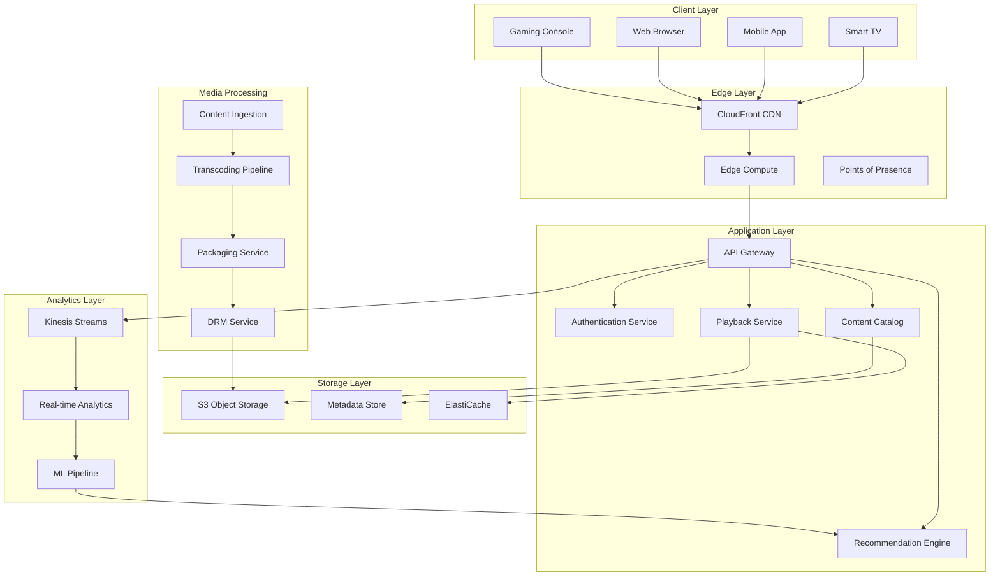

# Designing Prime Video: Video Streaming at Scale

## Problem Statement

Design a global video streaming platform that can:
- Stream video content to 200+ million subscribers worldwide
- Support multiple devices (Smart TVs, mobile, web, gaming consoles)
- Deliver 4K/HDR content with adaptive bitrate streaming
- Handle live events with millions of concurrent viewers
- Provide personalized recommendations
- Implement robust DRM and content protection
- Support offline downloads
- Scale to handle peak events (Thursday Night Football, Premier releases)

## Core Architecture

### High-Level System Design



## Video Processing Pipeline

### Content Ingestion and Transcoding

```python
import asyncio
from typing import List, Dict, Optional
from enum import Enum
import boto3
from dataclasses import dataclass

class VideoQuality(Enum):
# Resolution, Bitrate (Mbps), Codec
    HD_1080P = ("1920x1080", 5.0, "h264")
    HD_720P = ("1280x720", 3.0, "h264")
    SD_480P = ("854x480", 1.5, "h264")
    SD_360P = ("640x360", 0.8, "h264")
    
# 4K/HDR Profiles
    UHD_4K_HDR = ("3840x2160", 15.0, "h265")
    UHD_4K_SDR = ("3840x2160", 12.0, "h265")
    
# Mobile optimized
    MOBILE_HIGH = ("1280x720", 2.0, "h264")
    MOBILE_MED = ("854x480", 1.0, "h264")
    MOBILE_LOW = ("640x360", 0.5, "h264")

@dataclass
class TranscodingJob:
    job_id: str
    source_file: str
    output_profiles: List[VideoQuality]
    priority: int = 5
    drm_enabled: bool = True
    
class VideoTranscodingPipeline:
    def __init__(self):
        self.s3_client = boto3.client('s3')
        self.mediaconvert_client = boto3.client('mediaconvert')
        self.job_queue = asyncio.Queue()
        self.workers = []
        
    async def ingest_content(self, source_path: str, 
                           content_id: str,
                           content_type: str = "movie") -> Dict:
        """Ingest new content into the platform"""
        
# Determine required profiles based on content type
        profiles = self._determine_encoding_profiles(content_type)
        
# Create transcoding job
        job = TranscodingJob(
            job_id=f"{content_id}-{int(asyncio.get_event_loop().time())}",
            source_file=source_path,
            output_profiles=profiles,
            priority=self._calculate_priority(content_type)
        )
        
# Queue for processing
        await self.job_queue.put(job)
        
# Start transcoding workers if not running
        if not self.workers:
            for i in range(10):  # 10 parallel workers
                worker = asyncio.create_task(self._transcoding_worker())
                self.workers.append(worker)
                
        return {
            'job_id': job.job_id,
            'status': 'queued',
            'profiles': [p.name for p in profiles]
        }
        
    def _determine_encoding_profiles(self, content_type: str) -> List[VideoQuality]:
        """Determine which encoding profiles to create"""
        if content_type == "movie" or content_type == "series":
            return [
                VideoQuality.UHD_4K_HDR,
                VideoQuality.UHD_4K_SDR,
                VideoQuality.HD_1080P,
                VideoQuality.HD_720P,
                VideoQuality.SD_480P,
                VideoQuality.SD_360P,
                VideoQuality.MOBILE_HIGH,
                VideoQuality.MOBILE_MED,
                VideoQuality.MOBILE_LOW
            ]
        elif content_type == "live":
# Reduced set for live streaming
            return [
                VideoQuality.HD_1080P,
                VideoQuality.HD_720P,
                VideoQuality.SD_480P,
                VideoQuality.MOBILE_HIGH,
                VideoQuality.MOBILE_LOW
            ]
        else:  # trailer, clip
            return [
                VideoQuality.HD_1080P,
                VideoQuality.HD_720P,
                VideoQuality.SD_480P
            ]
            
    def _calculate_priority(self, content_type: str) -> int:
        """Calculate job priority (1-10, 10 being highest)"""
        priorities = {
            'live': 10,
            'premiere': 9,
            'movie': 7,
            'series': 6,
            'trailer': 5,
            'clip': 3
        }
        return priorities.get(content_type, 5)
        
    async def _transcoding_worker(self):
        """Worker to process transcoding jobs"""
        while True:
            try:
                job = await self.job_queue.get()
                await self._process_transcoding_job(job)
            except Exception as e:
                print(f"Error processing job: {e}")
# Re-queue failed job with lower priority
                job.priority -= 1
                if job.priority > 0:
                    await self.job_queue.put(job)
                    
    async def _process_transcoding_job(self, job: TranscodingJob):
        """Process a single transcoding job"""
        outputs = []
        
        for profile in job.output_profiles:
            resolution, bitrate, codec = profile.value
            
            output_config = {
                'OutputGroupSettings': {
                    'Type': 'HLS_GROUP_SETTINGS',
                    'HlsGroupSettings': {
                        'ManifestDurationFormat': 'INTEGER',
                        'SegmentLength': 10,
                        'TimedMetadataId3Period': 10,
                        'CaptionLanguageSetting': 'OMIT',
                        'Destination': f's3://prime-video-output/{job.job_id}/{profile.name}/',
                        'TimedMetadataId3Frame': 'PRIV',
                        'CodecSpecification': 'RFC_4281',
                        'OutputSelection': 'MANIFESTS_AND_SEGMENTS',
                        'ProgramDateTimePeriod': 600,
                        'MinSegmentLength': 0,
                        'DirectoryStructure': 'SINGLE_DIRECTORY',
                        'ProgramDateTime': 'INCLUDE',
                        'SegmentControl': 'SEGMENTED_FILES',
                        'ManifestCompression': 'NONE',
                        'ClientCache': 'ENABLED',
                        'StreamInfResolution': 'INCLUDE'
                    }
                },
                'Outputs': [{
                    'VideoDescription': {
                        'ScalingBehavior': 'DEFAULT',
                        'TimecodeInsertion': 'DISABLED',
                        'AntiAlias': 'ENABLED',
                        'Sharpness': 50,
                        'CodecSettings': {
                            'Codec': codec.upper(),
                            f'{codec.upper()}Settings': {
                                'InterlaceMode': 'PROGRESSIVE',
                                'ParNumerator': 1,
                                'NumberReferenceFrames': 3,
                                'Syntax': 'DEFAULT',
                                'GopClosedCadence': 1,
                                'GopSize': 90,
                                'Slices': 1,
                                'GopBReference': 'DISABLED',
                                'MaxBitrate': int(bitrate * 1000000),
                                'ParDenominator': 1,
                                'RateControlMode': 'QVBR',
                                'QvbrSettings': {
                                    'QvbrQualityLevel': 7
                                }
                            }
                        },
                        'Width': int(resolution.split('x')[0]),
                        'Height': int(resolution.split('x')[1])
                    },
                    'AudioDescriptions': [{
                        'AudioTypeControl': 'FOLLOW_INPUT',
                        'CodecSettings': {
                            'Codec': 'AAC',
                            'AacSettings': {
                                'AudioDescriptionBroadcasterMix': 'NORMAL',
                                'Bitrate': 128000,
                                'RateControlMode': 'CBR',
                                'CodecProfile': 'LC',
                                'CodingMode': 'CODING_MODE_2_0',
                                'RawFormat': 'NONE',
                                'SampleRate': 48000,
                                'Specification': 'MPEG4'
                            }
                        }
                    }]
                }]
            }
            
            outputs.append(output_config)
            
# Add DRM if enabled
        if job.drm_enabled:
            outputs = self._add_drm_protection(outputs)
            
# Submit to MediaConvert
        response = await self._submit_mediaconvert_job(job, outputs)
        
        return response
```

## CDN Architecture with CloudFront

### Multi-Tier CDN Strategy

```python
class PrimeVideoCDN:
    def __init__(self):
        self.cloudfront_client = boto3.client('cloudfront')
        self.route53_client = boto3.client('route53')
        
# CDN tiers
        self.origin_shields = [
            'us-east-1',  # Primary
            'eu-west-1',  # Europe
            'ap-northeast-1'  # Asia
        ]
        
        self.edge_locations = self._initialize_edge_locations()
        
    def _initialize_edge_locations(self) -> Dict[str, List[str]]:
        """Initialize global edge locations"""
        return {
            'north_america': [
                'IAD', 'DFW', 'ORD', 'LAX', 'SEA', 'JFK', 'MIA',
                'ATL', 'BOS', 'DEN', 'LAS', 'PHX', 'SFO'
            ],
            'europe': [
                'LHR', 'FRA', 'CDG', 'AMS', 'MAD', 'MXP', 'VIE',
                'ARN', 'CPH', 'DUB', 'HEL', 'PRG', 'WAW'
            ],
            'asia_pacific': [
                'NRT', 'HND', 'ICN', 'SIN', 'SYD', 'MEL', 'BOM',
                'DEL', 'HKG', 'TPE', 'MNL', 'BKK', 'KUL'
            ],
            'south_america': [
                'GRU', 'GIG', 'EZE', 'BOG', 'SCL', 'LIM'
            ]
        }
        
    async def create_distribution(self, content_id: str, 
                                origin_bucket: str) -> Dict:
        """Create CloudFront distribution for content"""
        
        distribution_config = {
            'CallerReference': f'prime-video-{content_id}',
            'Comment': f'Prime Video Distribution for {content_id}',
            'DefaultRootObject': 'index.m3u8',
            'Origins': {
                'Quantity': 1,
                'Items': [{
                    'Id': f's3-{origin_bucket}',
                    'DomainName': f'{origin_bucket}.s3.amazonaws.com',
                    'S3OriginConfig': {
                        'OriginAccessIdentity': 'origin-access-identity/cloudfront/ABCDEFG'
                    },
                    'OriginShield': {
                        'Enabled': True,
                        'OriginShieldRegion': self._select_origin_shield(content_id)
                    }
                }]
            },
            'DefaultCacheBehavior': {
                'TargetOriginId': f's3-{origin_bucket}',
                'ViewerProtocolPolicy': 'redirect-to-https',
                'AllowedMethods': {
                    'Quantity': 2,
                    'Items': ['GET', 'HEAD'],
                    'CachedMethods': {
                        'Quantity': 2,
                        'Items': ['GET', 'HEAD']
                    }
                },
                'Compress': True,
                'CachePolicyId': self._get_cache_policy_id('video-streaming'),
                'OriginRequestPolicyId': self._get_origin_request_policy_id(),
                'ResponseHeadersPolicyId': self._get_response_headers_policy_id()
            },
            'CacheBehaviors': {
                'Quantity': 2,
                'Items': [
                    {
                        'PathPattern': '*.m3u8',
                        'TargetOriginId': f's3-{origin_bucket}',
                        'ViewerProtocolPolicy': 'redirect-to-https',
                        'CachePolicyId': self._get_cache_policy_id('manifest'),
                        'Compress': True
                    },
                    {
                        'PathPattern': '*.ts',
                        'TargetOriginId': f's3-{origin_bucket}',
                        'ViewerProtocolPolicy': 'redirect-to-https',
                        'CachePolicyId': self._get_cache_policy_id('segments'),
                        'Compress': False  # Video segments are already compressed
                    }
                ]
            },
            'Enabled': True,
            'HttpVersion': 'http2and3',  # HTTP/3 support
            'IsIPV6Enabled': True,
            'PriceClass': 'PriceClass_All',  # Use all edge locations
            'ViewerCertificate': {
                'CloudFrontDefaultCertificate': True
            }
        }
        
        response = self.cloudfront_client.create_distribution(
            DistributionConfig=distribution_config
        )
        
        return {
            'distribution_id': response['Distribution']['Id'],
            'domain_name': response['Distribution']['DomainName'],
            'status': response['Distribution']['Status']
        }
        
    def _select_origin_shield(self, content_id: str) -> str:
        """Select optimal origin shield based on content popularity"""
# In production, this would analyze viewing patterns
# For now, simple hash-based selection
        index = hash(content_id) % len(self.origin_shields)
        return self.origin_shields[index]
        
    def _get_cache_policy_id(self, policy_type: str) -> str:
        """Get cache policy ID for different content types"""
        policies = {
            'video-streaming': '658327ea-f89f-4094-a3e4-e7a5c3d7e896',  # 86400s TTL
            'manifest': '4135ea2d-6df8-44a3-9df3-4b5a84be39ad',  # 300s TTL
            'segments': '658327ea-f89f-4094-a3e4-e7a5c3d7e896'  # 86400s TTL
        }
        return policies.get(policy_type, policies['video-streaming'])
```

### Edge Computing for Low Latency

```python
class EdgeComputeOptimizer:
    def __init__(self):
        self.lambda_client = boto3.client('lambda')
        self.edge_functions = {}
        
    async def deploy_edge_function(self, function_name: str, 
                                 function_code: str) -> Dict:
        """Deploy Lambda@Edge function for request/response manipulation"""
        
# Package function code
        import zipfile
        import io
        
        zip_buffer = io.BytesIO()
        with zipfile.ZipFile(zip_buffer, 'w', zipfile.ZIP_DEFLATED) as zip_file:
            zip_file.writestr('index.js', function_code)
            
        zip_buffer.seek(0)
        
# Create Lambda function
        response = self.lambda_client.create_function(
            FunctionName=function_name,
            Runtime='nodejs18.x',
            Role='arn:aws:iam::123456789012:role/lambda-edge-role',
            Handler='index.handler',
            Code={'ZipFile': zip_buffer.read()},
            Timeout=5,
            MemorySize=128,
            Publish=True
        )
        
        self.edge_functions[function_name] = response['FunctionArn']
        return response
        
    def create_viewer_request_function(self) -> str:
        """Create viewer request function for device detection and routing"""
        
        function_code = '''
        'use strict';
        
        exports.handler = async (event) => {
            const request = event.Records[0].cf.request;
            const headers = request.headers;
            
            // Device detection
            const userAgent = headers['user-agent'][0].value.toLowerCase();
            let deviceType = 'desktop';
            
            if (/mobile|android|iphone/i.test(userAgent)) {
                deviceType = 'mobile';
            } else if (/ipad|tablet/i.test(userAgent)) {
                deviceType = 'tablet';
            } else if (/tv|smarttv|appletv|roku|firetv/i.test(userAgent)) {
                deviceType = 'tv';
            }
            
            // Add device type header
            request.headers['x-device-type'] = [{key: 'X-Device-Type', value: deviceType}];
            
            // Bandwidth detection from query params
            const querystring = request.querystring;
            if (querystring && querystring.includes('bandwidth=')) {
                const bandwidth = querystring.match(/bandwidth=(\d+)/)[1];
                request.headers['x-client-bandwidth'] = [
                    {key: 'X-Client-Bandwidth', value: bandwidth}
                ];
            }
            
            // A/B testing
            const viewerId = headers['x-viewer-id'] ? 
                headers['x-viewer-id'][0].value : 
                Math.random().toString(36).substring(7);
                
            const testGroup = hashCode(viewerId) % 100 < 10 ? 'test' : 'control';
            request.headers['x-ab-test-group'] = [
                {key: 'X-AB-Test-Group', value: testGroup}
            ];
            
            // Geo-routing optimization
            const countryCode = headers['cloudfront-viewer-country'] ?
                headers['cloudfront-viewer-country'][0].value : 'US';
                
            // Route to nearest origin for live content
            if (request.uri.includes('/live/')) {
                const originMap = {
                    'US': 'us-east-1.origin.primevideo.com',
                    'GB': 'eu-west-1.origin.primevideo.com',
                    'JP': 'ap-northeast-1.origin.primevideo.com'
                };
                
                const origin = originMap[countryCode] || originMap['US'];
                request.origin = {
                    custom: {
                        domainName: origin,
                        port: 443,
                        protocol: 'https'
                    }
                };
            }
            
            return request;
        };
        
        function hashCode(str) {
            let hash = 0;
            for (let i = 0; i < str.length; i++) {
                const char = str.charCodeAt(i);
                hash = ((hash << 5) - hash) + char;
                hash = hash & hash;
            }
            return Math.abs(hash);
        }
        '''
        
        return function_code
```

## Adaptive Bitrate Streaming

### ABR Algorithm Implementation

```python
import numpy as np
from typing import List, Tuple, Optional
from collections import deque

class AdaptiveBitrateController:
    def __init__(self):
        self.buffer_threshold = 10.0  # seconds
        self.startup_threshold = 2.0  # seconds
        self.panic_threshold = 1.0    # seconds
        
# Quality levels (bitrate in Mbps)
        self.quality_levels = [
            {'level': 0, 'bitrate': 0.5, 'resolution': '360p'},
            {'level': 1, 'bitrate': 0.8, 'resolution': '360p'},
            {'level': 2, 'bitrate': 1.0, 'resolution': '480p'},
            {'level': 3, 'bitrate': 1.5, 'resolution': '480p'},
            {'level': 4, 'bitrate': 2.0, 'resolution': '720p'},
            {'level': 5, 'bitrate': 3.0, 'resolution': '720p'},
            {'level': 6, 'bitrate': 5.0, 'resolution': '1080p'},
            {'level': 7, 'bitrate': 8.0, 'resolution': '1080p'},
            {'level': 8, 'bitrate': 12.0, 'resolution': '4K'},
            {'level': 9, 'bitrate': 15.0, 'resolution': '4K HDR'}
        ]
        
# State tracking
        self.current_level = 2  # Start with conservative quality
        self.buffer_level = 0.0
        self.bandwidth_samples = deque(maxlen=10)
        self.download_times = deque(maxlen=5)
        self.rebuffer_events = deque(maxlen=20)
        
    def select_quality(self, 
                      segment_duration: float,
                      buffer_level: float,
                      last_download_time: float,
                      last_segment_size: int) -> int:
        """Select optimal quality level based on current conditions"""
        
# Update state
        self.buffer_level = buffer_level
        
# Calculate bandwidth estimate
        if last_download_time > 0:
            bandwidth_mbps = (last_segment_size * 8) / (last_download_time * 1000000)
            self.bandwidth_samples.append(bandwidth_mbps)
            self.download_times.append(last_download_time)
            
# Get bandwidth estimate
        estimated_bandwidth = self._estimate_bandwidth()
        
# Determine mode
        if buffer_level < self.panic_threshold:
            return self._panic_mode(estimated_bandwidth)
        elif buffer_level < self.startup_threshold:
            return self._startup_mode(estimated_bandwidth)
        else:
            return self._steady_state_mode(estimated_bandwidth, buffer_level)
            
    def _estimate_bandwidth(self) -> float:
        """Estimate available bandwidth using EWMA and safety margin"""
        if not self.bandwidth_samples:
            return 1.0  # Default conservative estimate
            
# Use Exponentially Weighted Moving Average
        weights = np.exp(np.linspace(-1, 0, len(self.bandwidth_samples)))
        weights /= weights.sum()
        
        weighted_avg = np.average(self.bandwidth_samples, weights=weights)
        
# Apply safety margin based on variance
        if len(self.bandwidth_samples) > 3:
            std_dev = np.std(self.bandwidth_samples)
            safety_factor = max(0.7, 1 - (std_dev / weighted_avg))
        else:
            safety_factor = 0.8
            
        return weighted_avg * safety_factor
        
    def _panic_mode(self, bandwidth: float) -> int:
        """Panic mode: minimize rebuffering risk"""
# Drop to lowest quality immediately
        self.current_level = 0
        return 0
        
    def _startup_mode(self, bandwidth: float) -> int:
        """Startup mode: quick start with conservative quality"""
# Find highest quality that's 50% of bandwidth
        for i, level in enumerate(self.quality_levels):
            if level['bitrate'] > bandwidth * 0.5:
                self.current_level = max(0, i - 1)
                return self.current_level
                
        self.current_level = len(self.quality_levels) - 1
        return self.current_level
        
    def _steady_state_mode(self, bandwidth: float, buffer_level: float) -> int:
        """Steady state: optimize for quality while maintaining buffer"""
        
# Buffer-based approach with bandwidth constraint
        buffer_ratio = buffer_level / self.buffer_threshold
        
# Calculate quality score for each level
        best_level = self.current_level
        best_score = float('-inf')
        
        for i, level in enumerate(self.quality_levels):
# Skip if bandwidth insufficient
            if level['bitrate'] > bandwidth * 0.9:
                continue
                
# Quality score
            quality_score = self._calculate_quality_score(level['bitrate'])
            
# Switching penalty
            switch_penalty = abs(i - self.current_level) * 0.1
            
# Buffer impact
            download_time = 4.0 * level['bitrate'] / bandwidth  # 4s segment
            buffer_delta = 4.0 - download_time
            future_buffer = buffer_level + buffer_delta
            
            if future_buffer < self.startup_threshold:
                buffer_penalty = 10.0  # Heavy penalty for risking rebuffer
            else:
                buffer_penalty = max(0, self.buffer_threshold - future_buffer) * 0.5
                
# Total score
            total_score = quality_score - switch_penalty - buffer_penalty
            
            if total_score > best_score:
                best_score = total_score
                best_level = i
                
# Limit quality changes
        if abs(best_level - self.current_level) > 2:
# Don't jump more than 2 levels at once
            if best_level > self.current_level:
                best_level = self.current_level + 2
            else:
                best_level = self.current_level - 2
                
        self.current_level = best_level
        return best_level
        
    def _calculate_quality_score(self, bitrate: float) -> float:
        """Calculate perceptual quality score"""
# Logarithmic utility function
        return np.log(bitrate + 1)
        
    def report_rebuffer(self, duration: float):
        """Report rebuffering event for algorithm adaptation"""
        self.rebuffer_events.append({
            'timestamp': asyncio.get_event_loop().time(),
            'duration': duration,
            'quality_level': self.current_level
        })
        
# Adjust algorithm aggressiveness based on rebuffer frequency
        recent_rebuffers = sum(
            1 for event in self.rebuffer_events 
            if asyncio.get_event_loop().time() - event['timestamp'] < 60
        )
        
        if recent_rebuffers > 3:
# Too many rebuffers, become more conservative
            self.current_level = max(0, self.current_level - 2)
```

### Client-Side Player Implementation

```python
class PrimeVideoPlayer:
    def __init__(self, video_url: str):
        self.video_url = video_url
        self.abr_controller = AdaptiveBitrateController()
        self.buffer = deque()
        self.buffer_size = 0
        self.playback_position = 0
        self.is_playing = False
        self.metrics_collector = MetricsCollector()
        
    async def start_playback(self):
        """Start video playback with ABR"""
# Parse manifest
        manifest = await self._fetch_manifest(self.video_url)
        
# Start buffer filling
        buffer_task = asyncio.create_task(self._buffer_segments(manifest))
        
# Start playback
        playback_task = asyncio.create_task(self._playback_loop())
        
# Start metrics reporting
        metrics_task = asyncio.create_task(self._report_metrics())
        
        await asyncio.gather(buffer_task, playback_task, metrics_task)
        
    async def _buffer_segments(self, manifest: dict):
        """Download segments based on ABR decisions"""
        segment_duration = manifest['segment_duration']
        
        while True:
# Check buffer health
            buffer_seconds = self.buffer_size / segment_duration
            
            if buffer_seconds >= 30:  # Max 30s buffer
                await asyncio.sleep(1)
                continue
                
# Get next segment to download
            next_segment_index = self.playback_position + self.buffer_size
            
# ABR decision
            start_time = asyncio.get_event_loop().time()
            
            quality_level = self.abr_controller.select_quality(
                segment_duration=segment_duration,
                buffer_level=buffer_seconds,
                last_download_time=getattr(self, 'last_download_time', 0),
                last_segment_size=getattr(self, 'last_segment_size', 0)
            )
            
# Download segment
            segment_url = self._get_segment_url(
                manifest, next_segment_index, quality_level
            )
            
            segment_data = await self._download_segment(segment_url)
            
# Update metrics
            self.last_download_time = asyncio.get_event_loop().time() - start_time
            self.last_segment_size = len(segment_data)
            
# Add to buffer
            self.buffer.append({
                'index': next_segment_index,
                'data': segment_data,
                'quality_level': quality_level,
                'duration': segment_duration
            })
            self.buffer_size += 1
            
# Report download completion
            self.metrics_collector.record_segment_download(
                quality_level=quality_level,
                download_time=self.last_download_time,
                segment_size=self.last_segment_size
            )
```

## DRM and Content Protection

### Multi-DRM Implementation

```python
from cryptography.hazmat.primitives.ciphers import Cipher, algorithms, modes
from cryptography.hazmat.backends import default_backend
import struct

class DRMManager:
    def __init__(self):
        self.drm_systems = {
            'widevine': WidevineeDRM(),
            'fairplay': FairPlayDRM(),
            'playready': PlayReadyDRM()
        }
        
    async def encrypt_content(self, content_id: str, 
                            content_path: str) -> Dict:
        """Encrypt content with multiple DRM systems"""
        
# Generate content encryption key
        cek = self._generate_content_key()
        
# Encrypt content using CENC (Common Encryption)
        encrypted_path = await self._cenc_encrypt(content_path, cek)
        
# Generate DRM licenses
        licenses = {}
        for drm_name, drm_system in self.drm_systems.items():
            license_data = await drm_system.create_license(
                content_id=content_id,
                content_key=cek
            )
            licenses[drm_name] = license_data
            
# Store keys in secure key management service
        await self._store_keys(content_id, cek, licenses)
        
        return {
            'encrypted_path': encrypted_path,
            'drm_systems': list(licenses.keys()),
            'key_id': self._generate_key_id(content_id)
        }
        
    def _generate_content_key(self) -> bytes:
        """Generate secure content encryption key"""
        import secrets
        return secrets.token_bytes(16)  # 128-bit key
        
    async def _cenc_encrypt(self, input_path: str, 
                          content_key: bytes) -> str:
        """Encrypt content using Common Encryption (CENC)"""
        
        output_path = input_path.replace('.mp4', '_encrypted.mp4')
        
# Initialize AES-CTR cipher
        iv = b'\x00' * 8 + struct.pack('>Q', 0)  # 64-bit IV + 64-bit counter
        cipher = Cipher(
            algorithms.AES(content_key),
            modes.CTR(iv),
            backend=default_backend()
        )
        
# Encrypt video segments
        with open(input_path, 'rb') as infile, open(output_path, 'wb') as outfile:
            encryptor = cipher.encryptor()
            
            while True:
                chunk = infile.read(1024 * 1024)  # 1MB chunks
                if not chunk:
                    break
                    
                encrypted_chunk = encryptor.update(chunk)
                outfile.write(encrypted_chunk)
                
            outfile.write(encryptor.finalize())
            
        return output_path

class WidevineeDRM:
    def __init__(self):
        self.license_server = 'https://license.primevideo.com/widevine'
        
    async def create_license(self, content_id: str, 
                           content_key: bytes) -> Dict:
        """Create Widevine license"""
        
# Create PSSH (Protection System Specific Header)
        pssh = self._create_pssh(content_id, content_key)
        
# License policy
        policy = {
            'can_play': True,
            'can_persist': False,
            'can_renew': True,
            'rental_duration_seconds': 0,
            'playback_duration_seconds': 86400,  # 24 hours
            'license_duration_seconds': 86400,
            'renewal_recovery_duration_seconds': 3600,
            'renewal_server_url': self.license_server,
            'renewal_delay_seconds': 0,
            'renewal_retry_interval_seconds': 60,
            'renew_with_usage': True
        }
        
        return {
            'pssh': pssh,
            'policy': policy,
            'key_id': self._derive_key_id(content_id),
            'license_server': self.license_server
        }
        
    def _create_pssh(self, content_id: str, content_key: bytes) -> str:
        """Create Widevine PSSH box"""
        import base64
        
# Simplified PSSH creation
        pssh_data = {
            'algorithm': 'AESCTR',
            'key_id': base64.b64encode(
                self._derive_key_id(content_id).encode()
            ).decode(),
            'provider': 'widevine',
            'content_id': content_id,
            'policy': 'default'
        }
        
# In production, this would create proper Widevine PSSH
        return base64.b64encode(
            json.dumps(pssh_data).encode()
        ).decode()
        
    def _derive_key_id(self, content_id: str) -> str:
        """Derive key ID from content ID"""
        import hashlib
        return hashlib.sha256(content_id.encode()).hexdigest()[:32]
```

## Recommendation Engine

### Hybrid Recommendation System

```python
import numpy as np
from sklearn.decomposition import TruncatedSVD
from typing import List, Dict, Set
import torch
import torch.nn as nn

class PrimeVideoRecommendationEngine:
    def __init__(self):
        self.collaborative_filter = CollaborativeFiltering()
        self.content_filter = ContentBasedFiltering()
        self.deep_model = DeepRecommendationModel()
        self.real_time_ranker = RealTimeRanker()
        
    async def get_recommendations(self, user_id: str, 
                                context: Dict,
                                num_recommendations: int = 20) -> List[Dict]:
        """Get personalized recommendations for user"""
        
# Get candidate items from different algorithms
        collab_candidates = await self.collaborative_filter.get_candidates(
            user_id, num_candidates=100
        )
        
        content_candidates = await self.content_filter.get_candidates(
            user_id, num_candidates=100
        )
        
# Deep learning model predictions
        deep_candidates = await self.deep_model.predict(
            user_id, num_candidates=100
        )
        
# Merge candidates
        all_candidates = self._merge_candidates([
            (collab_candidates, 0.4),
            (content_candidates, 0.3),
            (deep_candidates, 0.3)
        ])
        
# Real-time ranking based on context
        ranked_items = await self.real_time_ranker.rank(
            user_id=user_id,
            candidates=all_candidates,
            context=context
        )
        
# Post-processing
        final_recommendations = self._post_process(
            ranked_items[:num_recommendations],
            user_id,
            context
        )
        
        return final_recommendations
        
    def _merge_candidates(self, 
                         candidate_lists: List[Tuple[List, float]]) -> List:
        """Merge candidates from different sources with weights"""
        scores = {}
        
        for candidates, weight in candidate_lists:
            for item in candidates:
                if item['content_id'] not in scores:
                    scores[item['content_id']] = 0
                scores[item['content_id']] += item['score'] * weight
                
# Sort by combined score
        merged = [
            {'content_id': content_id, 'score': score}
            for content_id, score in scores.items()
        ]
        
        return sorted(merged, key=lambda x: x['score'], reverse=True)

class CollaborativeFiltering:
    def __init__(self, n_factors: int = 100):
        self.n_factors = n_factors
        self.user_factors = None
        self.item_factors = None
        self.model = TruncatedSVD(n_components=n_factors)
        
    async def train(self, interaction_matrix: np.ndarray):
        """Train collaborative filtering model"""
# Apply SVD
        self.user_factors = self.model.fit_transform(interaction_matrix)
        self.item_factors = self.model.components_.T
        
    async def get_candidates(self, user_id: str, 
                           num_candidates: int) -> List[Dict]:
        """Get candidate items for user"""
        
# Get user embedding
        user_idx = self._get_user_index(user_id)
        if user_idx is None:
            return []  # Cold start user
            
        user_vector = self.user_factors[user_idx]
        
# Calculate scores for all items
        scores = np.dot(self.item_factors, user_vector)
        
# Get top candidates
        top_indices = np.argsort(scores)[::-1][:num_candidates]
        
        candidates = []
        for idx in top_indices:
            content_id = self._get_content_id(idx)
            candidates.append({
                'content_id': content_id,
                'score': float(scores[idx]),
                'method': 'collaborative'
            })
            
        return candidates

class DeepRecommendationModel(nn.Module):
    def __init__(self, num_users: int = 1000000, 
                 num_items: int = 100000,
                 embedding_dim: int = 128):
        super().__init__()
        
# Embeddings
        self.user_embedding = nn.Embedding(num_users, embedding_dim)
        self.item_embedding = nn.Embedding(num_items, embedding_dim)
        
# Context features
        self.time_embedding = nn.Embedding(24, 16)  # Hour of day
        self.day_embedding = nn.Embedding(7, 8)     # Day of week
        self.device_embedding = nn.Embedding(5, 8)  # Device type
        
# Deep network
        self.fc_layers = nn.Sequential(
            nn.Linear(embedding_dim * 2 + 32, 512),
            nn.ReLU(),
            nn.Dropout(0.2),
            nn.Linear(512, 256),
            nn.ReLU(),
            nn.Dropout(0.2),
            nn.Linear(256, 128),
            nn.ReLU(),
            nn.Linear(128, 1)
        )
        
# Multi-head attention for sequence modeling
        self.attention = nn.MultiheadAttention(
            embed_dim=embedding_dim,
            num_heads=8,
            dropout=0.1
        )
        
    def forward(self, user_ids: torch.Tensor, 
                item_ids: torch.Tensor,
                context: Dict) -> torch.Tensor:
        """Forward pass for recommendation scoring"""
        
# Get embeddings
        user_emb = self.user_embedding(user_ids)
        item_emb = self.item_embedding(item_ids)
        
# Context embeddings
        time_emb = self.time_embedding(context['hour'])
        day_emb = self.day_embedding(context['day_of_week'])
        device_emb = self.device_embedding(context['device_type'])
        
# Concatenate all features
        context_features = torch.cat([time_emb, day_emb, device_emb], dim=1)
        combined = torch.cat([user_emb, item_emb, context_features], dim=1)
        
# Pass through network
        output = self.fc_layers(combined)
        
        return torch.sigmoid(output)

class RealTimeRanker:
    def __init__(self):
        self.feature_weights = {
            'relevance_score': 0.3,
            'freshness': 0.1,
            'trending': 0.15,
            'diversity': 0.15,
            'watch_probability': 0.3
        }
        
    async def rank(self, user_id: str, candidates: List[Dict], 
                  context: Dict) -> List[Dict]:
        """Real-time ranking with business rules and context"""
        
# Calculate features for each candidate
        for candidate in candidates:
            content_id = candidate['content_id']
            
# Freshness score (newer content scores higher)
            candidate['freshness'] = await self._calculate_freshness(content_id)
            
# Trending score
            candidate['trending'] = await self._calculate_trending_score(
                content_id
            )
            
# Watch probability based on context
            candidate['watch_probability'] = await self._predict_watch_probability(
                user_id, content_id, context
            )
            
# Diversity score (genre, actor, director diversity)
            candidate['diversity'] = 0.5  # Placeholder
            
# Combined score
            candidate['final_score'] = sum(
                candidate.get(feature, 0) * weight
                for feature, weight in self.feature_weights.items()
            )
            
# Apply business rules
        ranked = self._apply_business_rules(candidates, context)
        
        return sorted(ranked, key=lambda x: x['final_score'], reverse=True)
        
    def _apply_business_rules(self, candidates: List[Dict], 
                             context: Dict) -> List[Dict]:
        """Apply business rules for ranking"""
        
# Boost Amazon Originals
        for candidate in candidates:
            if candidate.get('is_amazon_original'):
                candidate['final_score'] *= 1.2
                
# Time-based boosting (e.g., kids content in morning)
        hour = context.get('hour', 12)
        if 6 <= hour <= 10:  # Morning hours
            for candidate in candidates:
                if candidate.get('genre') == 'kids':
                    candidate['final_score'] *= 1.3
                    
# Device-based filtering
        if context.get('device_type') == 'mobile':
# Boost shorter content for mobile
            for candidate in candidates:
                if candidate.get('duration_minutes', 120) < 30:
                    candidate['final_score'] *= 1.1
                    
        return candidates
```

## Live Streaming Capabilities

### Live Streaming Infrastructure

```python
class LiveStreamingPlatform:
    def __init__(self):
        self.origin_servers = {}
        self.edge_servers = {}
        self.stream_health_monitor = StreamHealthMonitor()
        
    async def create_live_channel(self, channel_id: str, 
                                config: Dict) -> Dict:
        """Create a new live streaming channel"""
        
# Allocate origin servers across regions
        origins = await self._allocate_origin_servers(channel_id, config)
        
# Configure ingest endpoints
        ingest_urls = []
        for region, server in origins.items():
            ingest_url = await server.configure_ingest(
                channel_id=channel_id,
                settings={
                    'codec': config.get('codec', 'h264'),
                    'bitrate': config.get('bitrate', '5000k'),
                    'resolution': config.get('resolution', '1920x1080'),
                    'framerate': config.get('framerate', 30),
                    'keyframe_interval': 2,  # 2 second GOPs
                    'protocols': ['rtmp', 'srt']  # Ingest protocols
                }
            )
            ingest_urls.append({
                'region': region,
                'primary': ingest_url['rtmp'],
                'backup': ingest_url['srt']
            })
            
# Set up transcoding ladder for ABR
        transcode_profiles = await self._configure_live_transcoding(
            channel_id, config
        )
        
# Configure DVR/time-shifting
        dvr_config = await self._setup_dvr(
            channel_id,
            window_minutes=config.get('dvr_window', 120)  # 2 hour DVR
        )
        
        return {
            'channel_id': channel_id,
            'status': 'ready',
            'ingest_endpoints': ingest_urls,
            'playback_url': f'https://live.primevideo.com/{channel_id}/index.m3u8',
            'transcode_profiles': transcode_profiles,
            'dvr': dvr_config
        }
        
    async def handle_live_ingest(self, channel_id: str, 
                               stream_data: bytes) -> None:
        """Process incoming live stream data"""
        
# Parse stream metadata
        metadata = self._parse_stream_metadata(stream_data)
        
# Health check
        health_status = await self.stream_health_monitor.check_stream(
            channel_id, metadata
        )
        
        if health_status['issues']:
            await self._handle_stream_issues(channel_id, health_status['issues'])
            
# Segment the stream
        segments = self._segment_stream(
            stream_data,
            segment_duration=4.0  # 4 second segments for low latency
        )
        
# Process each segment
        tasks = []
        for segment in segments:
            task = asyncio.create_task(
                self._process_live_segment(channel_id, segment)
            )
            tasks.append(task)
            
        await asyncio.gather(*tasks)
        
    async def _process_live_segment(self, channel_id: str, 
                                  segment: Dict) -> None:
        """Process individual live segment"""
        
# Transcode to multiple bitrates
        transcoded = await self._transcode_live_segment(
            segment['data'],
            self.get_channel_profiles(channel_id)
        )
        
# Package for HLS/DASH
        packaged = await self._package_segment(transcoded)
        
# Upload to CDN origin
        await self._upload_to_cdn(channel_id, packaged)
        
# Update manifest
        await self._update_live_manifest(channel_id, segment['index'])
        
# Archive for DVR
        await self._archive_segment(channel_id, packaged)

class StreamHealthMonitor:
    def __init__(self):
        self.metrics = {
            'bitrate_variance': deque(maxlen=60),
            'frame_drops': deque(maxlen=60),
            'audio_sync': deque(maxlen=60),
            'keyframe_interval': deque(maxlen=30)
        }
        
    async def check_stream(self, channel_id: str, 
                         metadata: Dict) -> Dict:
        """Monitor stream health and detect issues"""
        
        issues = []
        
# Check bitrate stability
        current_bitrate = metadata['bitrate']
        self.metrics['bitrate_variance'].append(current_bitrate)
        
        if len(self.metrics['bitrate_variance']) > 10:
            variance = np.std(self.metrics['bitrate_variance'])
            mean_bitrate = np.mean(self.metrics['bitrate_variance'])
            
            if variance / mean_bitrate > 0.2:  # 20% variance
                issues.append({
                    'type': 'bitrate_instability',
                    'severity': 'warning',
                    'message': f'Bitrate variance: {variance:.0f} kbps'
                })
                
# Check for frame drops
        if metadata.get('dropped_frames', 0) > 0:
            self.metrics['frame_drops'].append(metadata['dropped_frames'])
            
            recent_drops = sum(self.metrics['frame_drops'])
            if recent_drops > 100:
                issues.append({
                    'type': 'frame_drops',
                    'severity': 'error',
                    'message': f'Dropped {recent_drops} frames in last minute'
                })
                
# Audio sync check
        audio_drift = metadata.get('audio_video_drift_ms', 0)
        if abs(audio_drift) > 40:  # 40ms drift threshold
            issues.append({
                'type': 'audio_sync',
                'severity': 'warning',
                'message': f'A/V sync drift: {audio_drift}ms'
            })
            
        return {
            'healthy': len(issues) == 0,
            'issues': issues,
            'metrics': {
                'bitrate': current_bitrate,
                'dropped_frames': metadata.get('dropped_frames', 0),
                'audio_drift': audio_drift
            }
        }
```

### Low Latency Live Streaming

```python
class LowLatencyLiveStreaming:
    def __init__(self):
        self.segment_duration = 2.0  # 2 second segments
        self.part_duration = 0.33   # 333ms parts for LL-HLS
        self.playlist_update_interval = 0.5
        
    async def create_low_latency_stream(self, stream_id: str) -> Dict:
        """Configure stream for low latency delivery"""
        
        config = {
            'stream_id': stream_id,
            'delivery_method': 'LL-HLS',  # Low Latency HLS
            'segment_duration': self.segment_duration,
            'part_duration': self.part_duration,
            'part_hold_back': 3 * self.part_duration,  # 3 parts
            'can_skip_until': 6.0,  # 6 seconds
            'can_block_reload': True,
            'features': [
                'delta_playlists',     # Only send changes
                'blocking_reload',     # Block until new content
                'part_inf',           # Partial segment info
                'preload_hint'        # Hint next part
            ]
        }
        
# Configure edge servers for LL
        await self._configure_edge_for_low_latency(stream_id)
        
# Set up WebRTC fallback for ultra-low latency
        webrtc_config = await self._setup_webrtc_distribution(stream_id)
        
        return {
            'hls_config': config,
            'webrtc_config': webrtc_config,
            'expected_latency': {
                'll_hls': '3-5 seconds',
                'webrtc': '<1 second'
            }
        }
        
    async def generate_ll_hls_playlist(self, stream_id: str, 
                                     segments: List[Dict]) -> str:
        """Generate Low Latency HLS playlist"""
        
        playlist = [
            '#EXTM3U',
            '#EXT-X-VERSION:6',
            f'#EXT-X-TARGETDURATION:{int(self.segment_duration)}',
            f'#EXT-X-PART-INF:PART-TARGET={self.part_duration}',
            f'#EXT-X-SERVER-CONTROL:CAN-BLOCK-RELOAD=YES,'
            f'PART-HOLD-BACK={3 * self.part_duration},'
            f'CAN-SKIP-UNTIL={6.0}',
            '#EXT-X-MEDIA-SEQUENCE:' + str(segments[0]['sequence'] if segments else 0)
        ]
        
        for segment in segments:
# Add parts for partial segments
            if 'parts' in segment:
                for part in segment['parts']:
                    playlist.append(
                        f'#EXT-X-PART:DURATION={part["duration"]:.3f},'
                        f'URI="{part["uri"]}"'
                    )
                    
# Add segment
            playlist.append(f'#EXTINF:{segment["duration"]:.3f},")')
            playlist.append(segment['uri'])
            
# Add preload hint for next part
        if segments:
            last_segment = segments[-1]
            next_part_uri = f'{stream_id}/part-{last_segment["sequence"]}-{len(last_segment.get("parts", [])) + 1}.ts'
            playlist.append(f'#EXT-X-PRELOAD-HINT:TYPE=PART,URI="{next_part_uri}"')
            
        return '\n'.join(playlist)
```

## Performance Optimization

### Caching Strategy

```python
class PrimeVideoCacheManager:
    def __init__(self):
        self.cache_layers = {
            'edge': EdgeCache(),
            'regional': RegionalCache(),
            'origin': OriginCache()
        }
        self.cache_stats = CacheStatistics()
        
    async def get_content(self, content_id: str, 
                         segment_id: str,
                         user_location: str) -> bytes:
        """Get content with multi-layer caching"""
        
# Try edge cache first
        edge_node = self._find_nearest_edge(user_location)
        content = await self.cache_layers['edge'].get(
            edge_node, content_id, segment_id
        )
        
        if content:
            self.cache_stats.record_hit('edge')
            return content
            
# Try regional cache
        regional_node = self._find_regional_cache(user_location)
        content = await self.cache_layers['regional'].get(
            regional_node, content_id, segment_id
        )
        
        if content:
            self.cache_stats.record_hit('regional')
# Populate edge cache
            await self.cache_layers['edge'].set(
                edge_node, content_id, segment_id, content
            )
            return content
            
# Get from origin
        content = await self.cache_layers['origin'].get(
            content_id, segment_id
        )
        
        if content:
            self.cache_stats.record_hit('origin')
# Populate caches
            await self._populate_caches(
                content_id, segment_id, content,
                [edge_node, regional_node]
            )
            return content
            
        self.cache_stats.record_miss()
        return None
        
    async def implement_cache_warming(self, content_id: str,
                                    predicted_viewers: List[str]):
        """Pre-warm caches for anticipated demand"""
        
# Analyze viewer locations
        location_clusters = self._cluster_viewer_locations(predicted_viewers)
        
# Determine which segments to pre-cache
        segments_to_cache = self._predict_segments(
            content_id,
            initial_segments=10  # Cache first 10 segments
        )
        
# Warm caches in parallel
        tasks = []
        for location, viewers in location_clusters.items():
            if len(viewers) > 100:  # Threshold for pre-warming
                edge_node = self._find_nearest_edge(location)
                
                for segment_id in segments_to_cache:
                    task = asyncio.create_task(
                        self._warm_cache(edge_node, content_id, segment_id)
                    )
                    tasks.append(task)
                    
        await asyncio.gather(*tasks)

class CacheStatistics:
    def __init__(self):
        self.hits = {'edge': 0, 'regional': 0, 'origin': 0}
        self.misses = 0
        self.bytes_served = {'edge': 0, 'regional': 0, 'origin': 0}
        
    def get_hit_ratio(self) -> Dict[str, float]:
        """Calculate cache hit ratios"""
        total_requests = sum(self.hits.values()) + self.misses
        
        if total_requests == 0:
            return {'edge': 0, 'regional': 0, 'origin': 0, 'overall': 0}
            
        ratios = {
            layer: hits / total_requests 
            for layer, hits in self.hits.items()
        }
        
        ratios['overall'] = sum(self.hits.values()) / total_requests
        return ratios
```

## Monitoring and Analytics

### Real-time Quality Monitoring

```python
class QualityOfExperienceMonitor:
    def __init__(self):
        self.metrics_pipeline = MetricsPipeline()
        self.alert_manager = AlertManager()
        self.ml_analyzer = QoEMLAnalyzer()
        
    async def process_client_metrics(self, metrics: Dict) -> None:
        """Process real-time metrics from client players"""
        
# Extract key QoE metrics
        qoe_data = {
            'user_id': metrics['user_id'],
            'session_id': metrics['session_id'],
            'timestamp': metrics['timestamp'],
            'rebuffer_count': metrics.get('rebuffer_count', 0),
            'rebuffer_duration': metrics.get('rebuffer_duration_ms', 0),
            'startup_time': metrics.get('startup_time_ms', 0),
            'bitrate_switches': metrics.get('bitrate_switches', 0),
            'average_bitrate': metrics.get('average_bitrate_kbps', 0),
            'error_count': metrics.get('error_count', 0),
            'playback_failures': metrics.get('playback_failures', 0)
        }
        
# Calculate QoE score
        qoe_score = self._calculate_qoe_score(qoe_data)
        qoe_data['qoe_score'] = qoe_score
        
# Stream to analytics pipeline
        await self.metrics_pipeline.ingest(qoe_data)
        
# Check for alerts
        if qoe_score < 3.0:  # Poor experience threshold
            await self.alert_manager.trigger_alert(
                'poor_qoe',
                severity='high' if qoe_score < 2.0 else 'medium',
                details=qoe_data
            )
            
# ML analysis for pattern detection
        anomaly = await self.ml_analyzer.detect_anomaly(qoe_data)
        if anomaly:
            await self._investigate_anomaly(anomaly, qoe_data)
            
    def _calculate_qoe_score(self, metrics: Dict) -> float:
        """Calculate QoE score (1-5 scale)"""
        
# Base score
        score = 5.0
        
# Penalize rebuffering (most impactful)
        rebuffer_penalty = min(2.0, metrics['rebuffer_count'] * 0.5 + 
                              metrics['rebuffer_duration'] / 1000 * 0.1)
        score -= rebuffer_penalty
        
# Penalize startup time
        if metrics['startup_time'] > 2000:  # >2 seconds
            startup_penalty = min(1.0, (metrics['startup_time'] - 2000) / 5000)
            score -= startup_penalty
            
# Penalize quality switches
        switch_penalty = min(0.5, metrics['bitrate_switches'] * 0.05)
        score -= switch_penalty
        
# Penalize low bitrate
        if metrics['average_bitrate'] < 1000:  # <1 Mbps
            quality_penalty = min(0.5, (1000 - metrics['average_bitrate']) / 1000)
            score -= quality_penalty
            
# Penalize errors
        error_penalty = min(1.5, metrics['error_count'] * 0.3 + 
                           metrics['playback_failures'] * 1.0)
        score -= error_penalty
        
        return max(1.0, score)

class QoEMLAnalyzer:
    def __init__(self):
        self.model = self._load_anomaly_detection_model()
        self.pattern_buffer = deque(maxlen=1000)
        
    async def detect_anomaly(self, metrics: Dict) -> Optional[Dict]:
        """Detect QoE anomalies using ML"""
        
# Feature extraction
        features = np.array([
            metrics['rebuffer_count'],
            metrics['rebuffer_duration'],
            metrics['startup_time'],
            metrics['bitrate_switches'],
            metrics['average_bitrate'],
            metrics['error_count'],
            metrics['qoe_score']
        ]).reshape(1, -1)
        
# Predict anomaly score
        anomaly_score = self.model.predict(features)[0]
        
        if anomaly_score > 0.8:  # High anomaly threshold
# Analyze pattern
            pattern = await self._analyze_pattern(metrics)
            
            return {
                'type': pattern['type'],
                'confidence': anomaly_score,
                'affected_metrics': pattern['affected_metrics'],
                'potential_cause': pattern['potential_cause'],
                'recommended_action': pattern['recommended_action']
            }
            
        return None
```

## Interview Deep Dive Topics

### 1. Scale Challenges
- **Peak Events**: Handling 10M+ concurrent viewers for live sports
- **Global Distribution**: 200+ countries with varying infrastructure
- **Device Fragmentation**: 1000+ device types with different capabilities

### 2. Video Quality
- **Perceptual Quality**: VMAF scoring and optimization
- **HDR/Dolby Vision**: Color space management
- **Audio**: Dolby Atmos and multi-language tracks

### 3. Cost Optimization
- **Bandwidth Costs**: $0.02-0.08 per GB globally
- **Compute Optimization**: Hardware encoding vs software
- **Storage Tiering**: Hot/warm/cold content strategy

### 4. Machine Learning
- **Recommendation**: Real-time personalization for 200M+ users
- **Encoding**: ML-based per-title encoding optimization
- **Anomaly Detection**: Predictive maintenance

### 5. Future Technologies
- **AV1 Codec**: 30% better compression
- **5G Integration**: Edge computing opportunities
- **VR/AR Content**: Volumetric video delivery

## Key Architecture Decisions

1. **Multi-CDN Strategy**: Use multiple CDN providers for resilience
2. **Microservices**: Service-oriented architecture for scalability
3. **Event-Driven**: Asynchronous processing for better resource utilization
4. **ML-First**: Machine learning integrated throughout the platform
5. **Global-Local**: Think globally but optimize locally

## Performance Metrics

- **Startup Time**: <2 seconds globally
- **Rebuffer Rate**: <0.5% for 95th percentile
- **Video Quality**: >80 VMAF score average
- **Availability**: 99.99% uptime
- **Scale**: 100M+ concurrent viewers capability

Remember: The key to Prime Video's success is the relentless focus on customer experience, from video quality to recommendation relevance, while optimizing costs at massive scale.