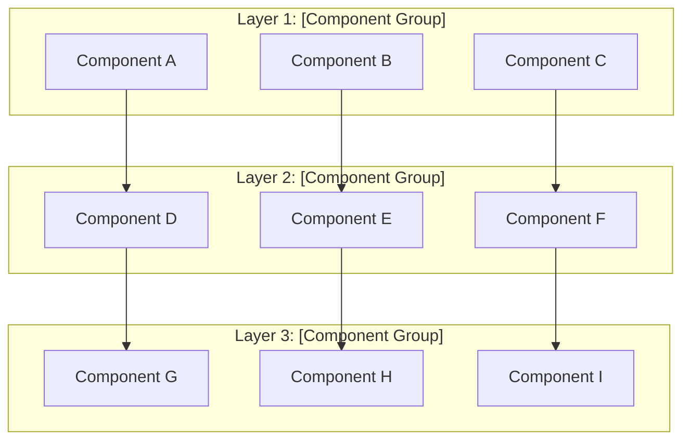
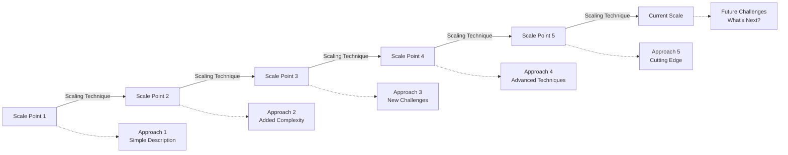
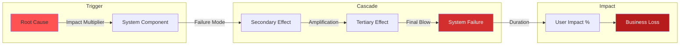

# [Company] [System Name]: [Core Achievement/Innovation]

## Table of Contents

- [Executive Summary](#executive-summary)
- [System Overview](#system-overview)
  - [Business Challenge Matrix](#business-challenge-matrix)
  - [High-Level Architecture](#high-level-architecture)
- [Mapping to Fundamental Laws](#mapping-to-fundamental-laws)
  - [Law Analysis](#law-analysis)
- [Design Deep Dive](#design-deep-dive)
  - [Data Architecture](#data-architecture)
  - [Scaling Strategy](#scaling-strategy)
- [Failure Scenarios & Lessons](#failure-scenarios-lessons)
- [The $[Cost] Lesson: [Incident Name]](#the-cost-lesson-incident-name)
  - [Failure Timeline](#failure-timeline)
  - [Prevention Matrix](#prevention-matrix)
- [Performance Characteristics](#performance-characteristics)
  - [Performance Profile](#performance-profile)
  - [Resource Utilization](#resource-utilization)
- [Operational Excellence](#operational-excellence)
  - [Monitoring & Observability](#monitoring-observability)
  - [Deployment Strategy](#deployment-strategy)
- [Key Innovations](#key-innovations)
  - [Innovation Impact Matrix](#innovation-impact-matrix)
- [Applicable Patterns](#applicable-patterns)
- [Related Topics](#related-topics)
  - [Related Laws & Axioms](#related-laws-axioms)
  - [Related Patterns](#related-patterns)
  - [Related Pillars](#related-pillars)
  - [Case Studies](#case-studies)
- [Decision Guide](#decision-guide)
  - [When to Use These Patterns](#when-to-use-these-patterns)
  - [Cost-Benefit Analysis](#cost-benefit-analysis)
- [Further Reading](#further-reading)
- [Discussion Questions](#discussion-questions)

!!! abstract "Quick Facts"
| Metric | Value |
|--------|-------|
| **Scale** | [Users/Requests/Data volume] |
| **Throughput** | [Requests/operations per time unit] |
| **Data Volume** | [Storage/processing volume] |
| **Availability** | [99.X% SLA] |
| **Team Size** | [X engineers] |

## Executive Summary

!!! abstract "The [System] Story"
    **🎯 Single Achievement**: [What this system proved was possible - one sentence]
    **📊 Scale**: [Most impressive scale number]
    **⏱️ Performance**: [Most impressive performance number]
    **💡 Key Innovation**: [What they did that was genuinely novel]

[2-3 paragraph executive summary explaining:
1. The core problem this system solved
2. Why traditional approaches weren't sufficient
3. The key architectural breakthrough or innovation]

## System Overview

### Business Challenge Matrix

| Dimension | Traditional Approach | [System] Solution | Business Impact |
|-----------|---------------------|-------------------|-----------------|
| **[Challenge 1]** | 🔴 [Problem description] | ✅ [Solution description] | [Quantified impact] |
| **[Challenge 2]** | 🔴 [Problem description] | ✅ [Solution description] | [Quantified impact] |
| **[Challenge 3]** | 🔴 [Problem description] | ✅ [Solution description] | [Quantified impact] |
| **[Challenge 4]** | 🔴 [Problem description] | ✅ [Solution description] | [Quantified impact] |

### High-Level Architecture



## Mapping to Fundamental Laws

### Law Analysis

<table class="responsive-table">
<thead>
 <tr>
 <th>Law</th>
 <th>Challenge</th>
 <th>Solution</th>
 <th>Trade-off</th>
 </tr>
</thead>
<tbody>
 <tr>
 <td data-label="Law">Correlated Failure</td>
 <td data-label="Challenge">[How correlated failure manifests in this system]</td>
 <td data-label="Solution">[How the system handles correlated failures]</td>
 <td data-label="Trade-off">[What they gave up to achieve this]</td>
 </tr>
 <tr>
 <td data-label="Law">Asynchronous Reality</td>
 <td data-label="Challenge">[How network/processing delays impact the system]</td>
 <td data-label="Solution">[How they handle asynchronous operations]</td>
 <td data-label="Trade-off">[Performance/consistency trade-offs made]</td>
 </tr>
 <tr>
 <td data-label="Law">Emergent Chaos</td>
 <td data-label="Challenge">[How complex interactions emerge at scale]</td>
 <td data-label="Solution">[How they manage emergent behavior]</td>
 <td data-label="Trade-off">[Complexity vs control trade-offs]</td>
 </tr>
 <tr>
 <td data-label="Law">Multidimensional Optimization</td>
 <td data-label="Challenge">[Multiple conflicting optimization goals]</td>
 <td data-label="Solution">[How they balance competing requirements]</td>
 <td data-label="Trade-off">[What they prioritized and what they sacrificed]</td>
 </tr>
 <tr>
 <td data-label="Law">Distributed Knowledge</td>
 <td data-label="Challenge">[Observability and debugging challenges]</td>
 <td data-label="Solution">[Monitoring and observability approaches]</td>
 <td data-label="Trade-off">[Overhead vs visibility trade-offs]</td>
 </tr>
 <tr>
 <td data-label="Law">Cognitive Load</td>
 <td data-label="Challenge">[System complexity and operational burden]</td>
 <td data-label="Solution">[How they manage operational complexity]</td>
 <td data-label="Trade-off">[Automation vs control]</td>
 </tr>
 <tr>
 <td data-label="Law">Economic Reality</td>
 <td data-label="Challenge">[Cost optimization and resource constraints]</td>
 <td data-label="Solution">[Cost management and optimization strategies]</td>
 <td data-label="Trade-off">[Cost vs performance/features]</td>
 </tr>
</tbody>
</table>

## Design Deep Dive

### Data Architecture

!!! tip "Key Design Decisions"
 1. **[Decision 1]**: [Why this choice was made and its impact]
 2. **[Decision 2]**: [Why this choice was made and its impact]
 3. **[Decision 3]**: [Why this choice was made and its impact]
 4. **[Decision 4]**: [Why this choice was made and its impact]

[Detailed explanation of data model, storage choices, consistency models, etc.]

### Scaling Strategy



## Failure Scenarios & Lessons

## The $[Amount] Lesson: [Year] [Incident Name]



### Failure Timeline

| Time | Event | Impact | Fix Applied |
|------|-------|--------|-------------|
| T+0 | [Initial trigger] | [Initial impact] | - |
| T+[X]min | [Escalation point 1] | [Impact escalation] | [Attempted fix] |
| T+[Y]min | [Escalation point 2] | [Wider impact] | [More attempts] |
| T+[Z]hr | [Full restoration] | [Return to normal] | [Permanent fixes] |

### Prevention Matrix

| Weakness Found | Immediate Fix | Long-term Solution |
|----------------|---------------|--------------------|
| [Gap 1] | [Quick fix] | [Systematic solution] |
| [Gap 2] | [Quick fix] | [Systematic solution] |
| [Gap 3] | [Quick fix] | [Systematic solution] |
| [Gap 4] | [Quick fix] | [Systematic solution] |

## Performance Characteristics

### Performance Profile

```mermaid
graph LR
    subgraph "Latency Distribution"
        P50[P50: [X]ms] --> P90[P90: [Y]ms]
        P90 --> P99[P99: [Z]ms]
        P99 --> P999[P99.9: [A]ms]
        P999 --> MAX[Max: [B]ms]
    end
    
    style P50 fill:#4caf50,color:#fff
    style P90 fill:#8bc34a
    style P99 fill:#ffeb3b
    style P999 fill:#ff9800
    style MAX fill:#f44336,color:#fff
```

| Percentile | Latency | What It Means | SLA Guarantee |
|------------|---------|---------------|---------------|
| **P50** | [X]ms | Half of requests | ✅ Always |
| **P90** | [Y]ms | 90% of requests | ✅ Always |
| **P99** | [Z]ms | 99% of requests | ✅ Normal load |
| **P99.9** | [A]ms | 99.9% of requests | ⚠️ Best effort |
| **Max** | [B]ms | Worst case | ❌ No guarantee |

### Resource Utilization

| Resource | Usage | Efficiency |
|----------|-------|------------|
| CPU | [X]% | [Assessment] |
| Memory | [Y]% | [Assessment] |
| Network | [Z]% | [Assessment] |
| Storage | [Growth rate] | [Assessment] |

## Operational Excellence

### Monitoring & Observability

- **Metrics**: [Number]+ [monitoring system] metrics covering [key areas]
- **Logging**: [Logging approach and volume]
- **Tracing**: [Tracing system and coverage]
- **Alerting**: [Alerting philosophy and response times]

### Deployment Strategy

!!! note
 **Deployment Frequency**: [Frequency] across [scope]
 **Rollout Strategy**: [Deployment pattern] with [safety measures]
 **Rollback Time**: [Time] automated rollback capability
 **Feature Flags**: [Usage pattern] for [purpose]

## Key Innovations

### Innovation Impact Matrix

| Innovation | Problem Solved | Traditional Approach | [System] Innovation | Business Value |
|------------|----------------|---------------------|---------------------|----------------|
| **[Innovation 1]** | [Problem description] | [Old way of doing it] | [New approach] | [Quantified benefit] |
| **[Innovation 2]** | [Problem description] | [Old way of doing it] | [New approach] | [Quantified benefit] |
| **[Innovation 3]** | [Problem description] | [Old way of doing it] | [New approach] | [Quantified benefit] |
| **[Innovation 4]** | [Problem description] | [Old way of doing it] | [New approach] | [Quantified benefit] |

## Applicable Patterns

<div class="grid cards" markdown>

- :material-icon:{ .lg .middle } **[Pattern Name 1](../pattern-library/category/pattern-1.md)**
    
    ---
    
    [Brief description of how this pattern is implemented]
    
    [Learn more →](../pattern-library/category/pattern-1.md)

- :material-icon:{ .lg .middle } **[Pattern Name 2](../pattern-library/category/pattern-2.md)**
    
    ---
    
    [Brief description of how this pattern is implemented]
    
    [Learn more →](../pattern-library/category/pattern-2.md)

- :material-icon:{ .lg .middle } **[Pattern Name 3](../pattern-library/category/pattern-3.md)**
    
    ---
    
    [Brief description of how this pattern is implemented]
    
    [Learn more →](../pattern-library/category/pattern-3.md)

- :material-icon:{ .lg .middle } **[Pattern Name 4](../pattern-library/category/pattern-4.md)**
    
    ---
    
    [Brief description of how this pattern is implemented]
    
    [Learn more →](../pattern-library/category/pattern-4.md)

</div>

## Related Topics

### Related Laws & Axioms
- [Law X: Name](../../core-principles/laws/law-name.md) - [How it constrains this system]
- [Law Y: Name](../../core-principles/laws/law-name.md) - [How it influences design decisions]
- [Law Z: Name](../../core-principles/laws/law-name.md) - [How the system copes with this constraint]

### Related Patterns
- [Pattern A](../pattern-library/category/pattern-a.md) - [Core implementation in this system]
- [Pattern B](../pattern-library/category/pattern-b.md) - [Supporting pattern usage]
- [Pattern C](../pattern-library/category/pattern-c.md) - [Alternative approach considered]

### Related Pillars
- [Pillar 1: Name](../core-principles/pillars/pillar-name.md) - [How this system distributes this concern]
- [Pillar 2: Name](../core-principles/pillars/pillar-name.md) - [How this system handles this challenge]
- [Pillar 3: Name](../core-principles/pillars/pillar-name.md) - [Trade-offs made in this area]

### Case Studies
- [Similar System A](../category/system-a/) - [How they compare on key dimensions]
- [Similar System B](../category/system-b/) - [Alternative approach to same problem]
- [Contrasting System C](../category/system-c/) - [Different trade-offs for contrast]

## Decision Guide

### When to Use These Patterns

| Your Scenario | Use This Approach? | Alternative | Why |
|---------------|-------------------|-------------|-----|
| [Scenario 1] | ✅ **Yes** | - | [Reasoning] |
| [Scenario 2] | ✅ **Yes** | - | [Reasoning] |
| [Scenario 3] | ❌ **No** | [Alternative] | [Reasoning] |
| [Scenario 4] | ❌ **No** | [Alternative] | [Reasoning] |
| [Scenario 5] | ⚠️ **Hybrid** | [Mixed approach] | [Reasoning] |

### Cost-Benefit Analysis

| Factor | Cost | Benefit | ROI |
|--------|------|---------|-----|
| **[Factor 1]** | [Cost description] | [Benefit description] | 📈 [Assessment] |
| **[Factor 2]** | [Cost description] | [Benefit description] | 📈 [Assessment] |
| **[Factor 3]** | [Cost description] | [Benefit description] | 📈 [Assessment] |
| **[Factor 4]** | [Cost description] | [Benefit description] | 📈 [Assessment] |

## Further Reading

- [Primary source 1 - Engineering blog, academic paper, or conference talk]
- [Primary source 2 - Technical documentation or architecture overview]
- [Primary source 3 - Lessons learned or post-mortem analysis]
- [Primary source 4 - Open source implementation or tools]

## Discussion Questions

1. [Thought-provoking question about architecture trade-offs]
2. [Question about scaling challenges and alternative approaches]
3. [Question about applying these patterns to different scenarios]
4. [Question about evolution and future challenges]

---

!!! info "About This Case Study"
    **Last Updated**: [YYYY-MM-DD]
    **Source Confidence**: [High|Medium|Low] - [Brief explanation of source reliability]
    **Verification**: [How the information was verified - engineering interviews, public documentation, etc.]
    **Contributors**: [Any specific acknowledgments]