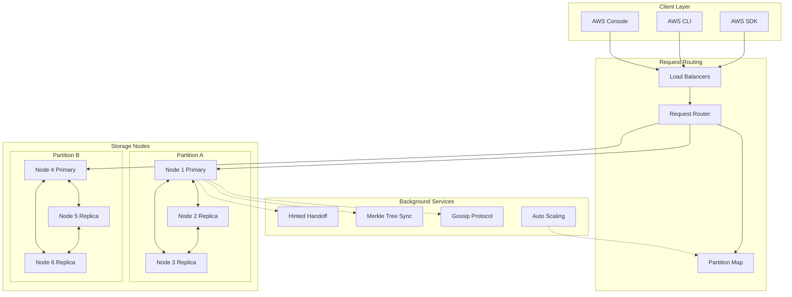
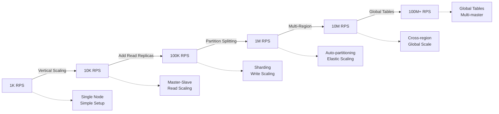
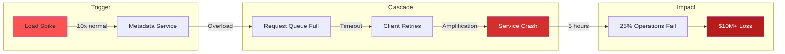
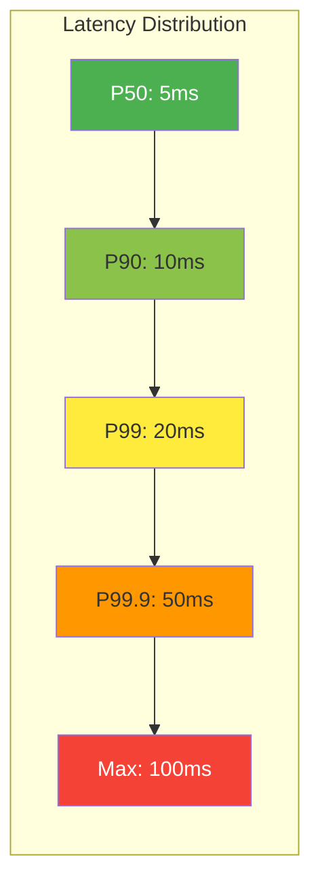

# Amazon DynamoDB: Scale and Architecture Deep Dive

!!! abstract "Quick Facts"
| Metric | Value |
 |--------|-------|
 | **Scale** | 100+ million users per service |
 | **Throughput** | Trillions of requests/month |
 | **Data Volume** | Exabytes across platform |
 | **Availability** | 99.999% SLA |
 | **Team Size** | 200+ engineers |

## Executive Summary

!!! abstract "The DynamoDB Story"
    **🎯 Single Achievement**: Built a database that never goes down
    **📊 Scale**: Trillions of requests/month
    **⏱️ Performance**: Single-digit ms latency
    **💡 Key Innovation**: Availability > Consistency

## System Overview

### Business Challenge Matrix

| Dimension | Traditional DB | DynamoDB Solution | Business Impact |
|-----------|----------------|-------------------|----------------|
| **Black Friday** | 🔴 Database crashes | ✅ Auto-scales seamlessly | $100M+ revenue protected |
| **Global Scale** | 🔴 Manual sharding | ✅ Automatic partitioning | Infinite growth |
| **Availability** | 🔴 99.9% (8h downtime/yr) | ✅ 99.999% (5min/yr) | Customer trust |
| **Operations** | 🔴 24/7 DBA team | ✅ Fully managed | 90% cost reduction |

### High-Level Architecture

## Mapping to Fundamental Laws

### Law Analysis

<table class="responsive-table">
<thead>
 <tr>
 <th>Law</th>
 <th>Challenge</th>
 <th>Solution</th>
 <th>Trade-off</th>
 </tr>
</thead>
<tbody>
 <tr>
 <td data-label="Law">Correlated Failure</td>
 <td data-label="Challenge">Region-wide outages, rack failures</td>
 <td data-label="Solution">Multi-AZ replication, hinted handoff</td>
 <td data-label="Trade-off">Higher storage cost, eventual consistency</td>
 </tr>
 <tr>
 <td data-label="Law">Asynchronous Reality</td>
 <td data-label="Challenge">Network delays across regions</td>
 <td data-label="Solution">SSD storage, in-memory caching, local replicas</td>
 <td data-label="Trade-off">Higher hardware cost for performance</td>
 </tr>
 <tr>
 <td data-label="Law">Emergent Chaos</td>
 <td data-label="Challenge">Concurrent updates from multiple devices</td>
 <td data-label="Solution">Vector clocks, last-write-wins, conflict resolution</td>
 <td data-label="Trade-off">Application-level complexity</td>
 </tr>
 <tr>
 <td data-label="Law">Multidimensional Optimization</td>
 <td data-label="Challenge">Balance consistency, availability, performance</td>
 <td data-label="Solution">Tunable consistency (R+W>N), automatic partitioning</td>
 <td data-label="Trade-off">Complex operational model</td>
 </tr>
 <tr>
 <td data-label="Law">Distributed Knowledge</td>
 <td data-label="Challenge">Monitoring across thousands of nodes</td>
 <td data-label="Solution">CloudWatch metrics, X-Ray tracing, Contributor Insights</td>
 <td data-label="Trade-off">Monitoring overhead and cost</td>
 </tr>
 <tr>
 <td data-label="Law">Cognitive Load</td>
 <td data-label="Challenge">Complex distributed system operations</td>
 <td data-label="Solution">Managed service, simple APIs, auto-scaling</td>
 <td data-label="Trade-off">Less control, vendor lock-in</td>
 </tr>
 <tr>
 <td data-label="Law">Economic Reality</td>
 <td data-label="Challenge">Cost-effective scaling for varying workloads</td>
 <td data-label="Solution">On-demand pricing, auto-scaling, reserved capacity</td>
 <td data-label="Trade-off">Complex pricing model</td>
 </tr>
</tbody>
</table>

## Design Deep Dive

### Data Architecture

!!! tip "Key Design Decisions"
 1. **Consistent Hashing**: Minimizes data movement during scaling, enables infinite horizontal scaling
 2. **Quorum System**: R+W>N guarantees consistency, allows tunable latency vs consistency trade-offs
 3. **Vector Clocks**: Tracks causality for conflict resolution, preserves data during network partitions
 4. **Merkle Trees**: Efficient data-management/read-repair.md for background synchronization and repair

### Scaling Strategy

## Failure Scenarios & Lessons

## The $10M Lesson: 2015 Outage

### Failure Timeline

| Time | Event | Impact | Fix Applied |
|------|-------|--------|-------------|
| T+0 | Metadata service load spike | Latency 10x | - |
| T+5min | Request queues overflow | Timeouts begin | Rate limiting attempted |
| T+15min | Retry storm begins | 100x load | Circuit breakers missing! |
| T+30min | Cascading failures | 25% ops fail | Emergency capacity |
| T+5hr | Service restored | Normal ops | Permanent fixes deployed |

### Prevention Matrix

| Weakness Found | Immediate Fix | Long-term Solution |
|----------------|---------------|--------------------|
| No circuit breakers | Deploy breakers | Mandatory for all services |
| Retry amplification | Exponential backoff | Adaptive retry logic |
| Single dependency | Add fallback path | Multi-region metadata |
| Capacity planning | 3x headroom | Auto-scaling triggers |

## Performance Characteristics

### Performance Profile

| Percentile | Latency | What It Means | SLA Guarantee |
|------------|---------|---------------|---------------|
| **P50** | 5ms | Half of requests | ✅ Always |
| **P90** | 10ms | 90% of requests | ✅ Always |
| **P99** | 20ms | 99% of requests | ✅ Normal load |
| **P99.9** | 50ms | 99.9% of requests | ⚠️ Best effort |
| **Max** | 100ms | Worst case | ❌ No guarantee |

### Resource Utilization

| Resource | Usage | Efficiency |
|----------|-------|------------|
| CPU | 60-80% | High |
| Memory | 85% | Optimal for caching |
| Network | 40% | Good headroom for spikes |
| Storage | Auto-expanding | Infinite scalability |

## Operational Excellence

### Monitoring & Observability

- **Metrics**: 200+ CloudWatch metrics covering latency, throughput, errors, and capacity
- **Logging**: Centralized logging with structured JSON format for all operations
- **Tracing**: AWS X-Ray integration for end-to-end request tracing across services
- **Alerting**: SLO-based alerting with automated runbook execution

### Deployment Strategy

!!! note
 **Deployment Frequency**: Multiple times per day across regions
 **Rollout Strategy**: Blue-green deployments with automated rollback triggers
 **Rollback Time**: < 5 minutes automated rollback capability
 **Feature Flags**: Used for all major feature releases and capacity changes

## Key Innovations

### Innovation Impact Matrix

| Innovation | Problem Solved | Traditional Approach | DynamoDB Innovation | Business Value |
|------------|----------------|---------------------|---------------------|----------------|
| **Virtual Nodes** | Hot partitions | Manual rebalancing | Auto-distribution | Zero hotspots |
| **Tunable Consistency** | CAP theorem | Fixed choice | Per-request tuning | Flexible SLAs |
| **Auto-scaling** | Traffic spikes | Pre-provisioning | Dynamic partitions | 70% cost savings |
| **Hinted Handoff** | Node failures | Data loss risk | Temporary storage | Zero data loss |
| **Merkle Trees** | Data sync | Full table scans | Efficient diff | 99% less bandwidth |

## Applicable Patterns

- :material-electric-switch:{ .lg .middle } **[Circuit Breaker](../pattern-library/resilience/circuit-breaker.md)**
    
    ---
    
    Prevents cascade failures in distributed request routing
    
    [Learn more →](../pattern-library/resilience/circuit-breaker.md)

- :material-rotate-3d:{ .lg .middle } **[Consistent Hashing](../pattern-library/data-management/consistent-hashing.md)**
    
    ---
    
    Enables elastic scaling with minimal data movement
    
    [Learn more →](../pattern-library/data-management/consistent-hashing.md)

- :material-vote:{ .lg .middle } **[Quorum Consensus](../pattern-library/coordination/consensus.md)**
    
    ---
    
    Balances consistency and availability trade-offs
    
    [Learn more →](../pattern-library/coordination/consensus.md)

- :material-sync:{ .lg .middle } **[Anti-Entropy](../pattern-library/data-management/read-repair.md)**
    
    ---
    
    Background synchronization using Merkle trees
    
    [Learn more →](../pattern-library/data-management/read-repair.md)

## Related Topics

### Related Laws & Axioms
- [Law 1: Correlated Failure](../../core-principles/laws/correlated-failure.md) - Masterless architecture eliminates single points of failure
- [Law 2: Asynchronous Reality](../../core-principles/laws/asynchronous-reality.md) - Eventually consistent by design
- [Law 4: Multidimensional Optimization](../../core-principles/laws/multidimensional-optimization.md) - AP choice in CAP theorem
- [Law 5: Distributed Knowledge](../../core-principles/laws/distributed-knowledge.md) - Gossip protocol for membership

### Related Patterns
- [Consistent Hashing](../pattern-library/data-management/consistent-hashing.md) - Virtual nodes for data distribution
- [Vector Clocks](../pattern-library/coordination/logical-clocks.md) - Conflict resolution mechanism
- [Merkle Trees](../pattern-library/data-management/merkle-trees.md) - Anti-entropy synchronization
- [Quorum Consensus](../pattern-library/coordination/consensus.md) - Tunable consistency levels

### Related Pillars
- [Pillar 2: State](../core-principles/pillars/state-distribution.md) - Eventually consistent state management
- [Pillar 3: Truth](../core-principles/pillars/truth-distribution.md) - Multiple versions of truth
- [Pillar 4: Control](../core-principles/pillars/control-distribution.md) - Decentralized control plane

### Case Studies
- [Apache Cassandra](../cassandra/) - Similar eventual consistency model
- [Redis Cluster](../redis/) - Alternative distributed key-value store
- [Spanner](../google-spanner/) - Contrasting strongly consistent approach

## Decision Guide

### When to Use DynamoDB Patterns

| Your Scenario | Use DynamoDB Style? | Alternative | Why |
|---------------|-------------------|-------------|-----|
| Shopping cart | ✅ **Yes** | - | Availability > consistency |
| User sessions | ✅ **Yes** | - | Can tolerate eventual consistency |
| Financial ledger | ❌ **No** | PostgreSQL | Need ACID guarantees |
| Inventory count | ❌ **No** | Spanner | Need strong consistency |
| Social feed | ✅ **Yes** | - | Eventually consistent is fine |
| Order processing | ⚠️ **Hybrid** | Mixed approach | Critical path needs consistency |

### Cost-Benefit Analysis

| Factor | Cost | Benefit | ROI |
|--------|------|---------|-----|
| **Storage** | 3x (replication) | 99.999% availability | 📈 High |
| **Compute** | 2x (redundancy) | No downtime | 📈 High |
| **Operations** | 0.1x (managed) | No DBAs needed | 📈 Very High |
| **Development** | 1.5x (complexity) | Infinite scale | 📈 High |

## Further Reading

- [Dynamo: Amazon's Highly Available Key-value Store (2007)](https://www.allthingsdistributed.com/files/amazon-dynamo-sosp2007.pdf/)
- [DynamoDB Paper: A Scalable, Predictably Performant, and Fully Managed NoSQL Database Service](https://aws.amazon.com/dynamodb/resources/)
- [Werner Vogels on Eventual Consistency](https://www.allthingsdistributed.com/2008/12/eventually_consistent.html/)
- [DynamoDB Best Practices Guide](https://docs.aws.amazon.com/amazondynamodb/latest/developerguide/best-practices.html/)

## Discussion Questions

1. How would you modify DynamoDB's consistency model for a financial trading system?
2. What are the cost-benefit trade-offs of DynamoDB's scaling/multi-region.md replication strategy?
3. Could DynamoDB's architecture handle 10x current load with the same latency guarantees?
4. How does DynamoDB's eventual consistency model impact application design patterns?