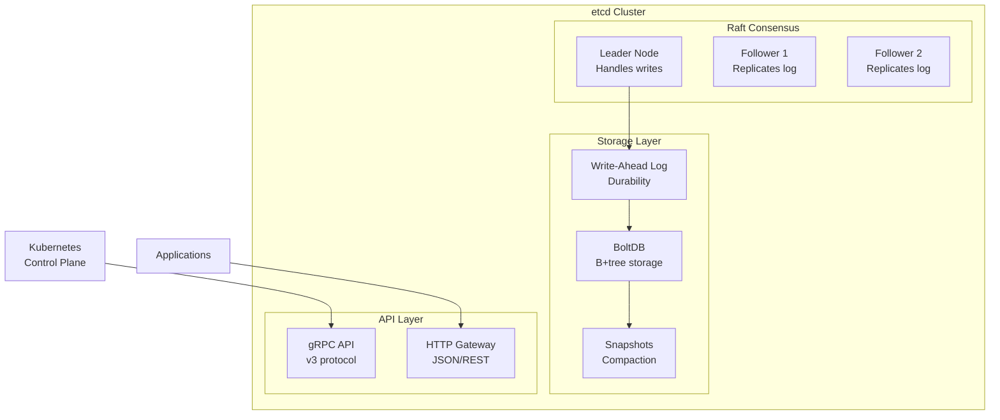
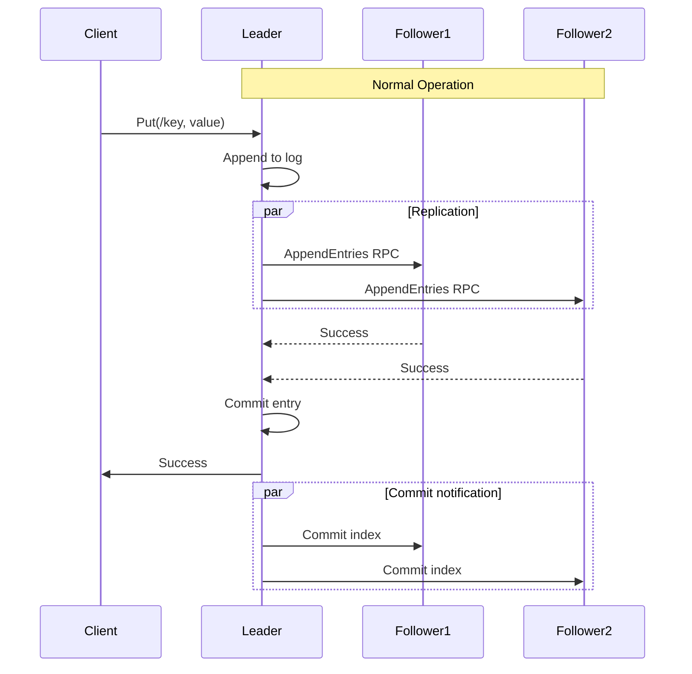
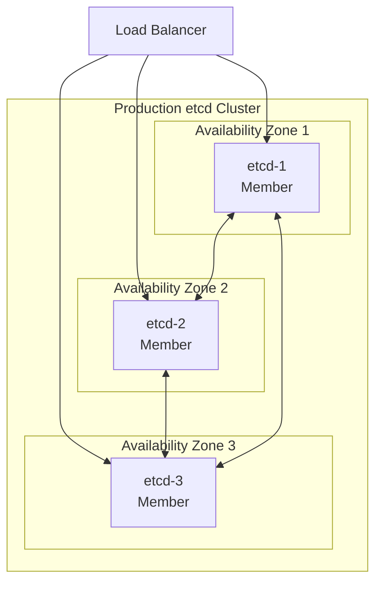
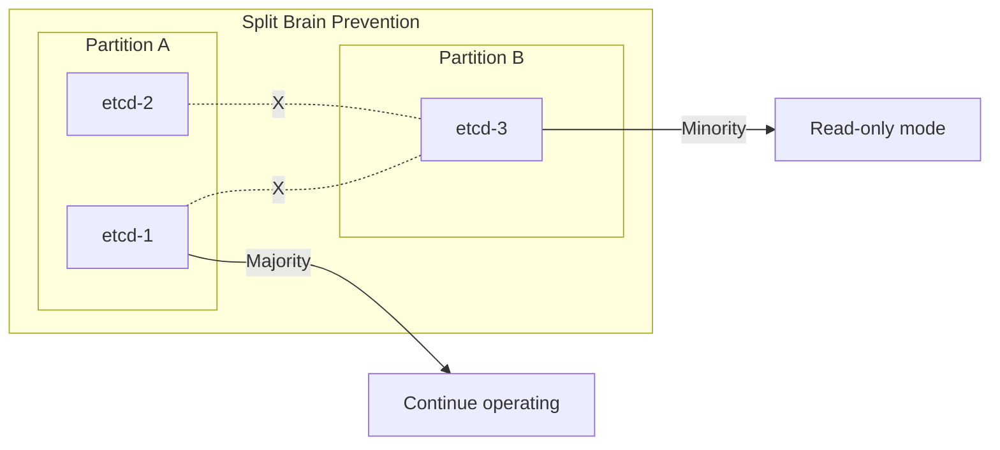

# etcd: Distributed Key-Value Store for Kubernetes

!!! abstract "The etcd Story"
    **🎯 Single Achievement**: Became the brain of Kubernetes
    **📊 Scale**: 1M+ Kubernetes clusters worldwide
    **⏱️ Performance**: 150K+ ops/sec with 2ms latency
    **💡 Key Innovation**: Simple, reliable distributed KV store with watches

## Why etcd Matters

| Traditional Stores | etcd Innovation | Business Impact |
|-------------------|-----------------|------------------|
| **ZooKeeper complexity** → steep learning | **Simple KV API** → easy adoption | 10x faster integration |
| **Custom protocols** → limited tools | **gRPC/HTTP** → universal access | Any language support |
| **One-time watches** → race conditions | **Streaming watches** → reliable | Zero missed updates |
| **Java-centric** → heavyweight | **Go simplicity** → lightweight | 75% less memory |

## Architecture Overview



## Core Design Principles

### 1. Simple Key-Value Model

```go
// Basic operations
ctx := context.Background()

// Put
_, err := client.Put(ctx, "/config/database/host", "db.example.com")

// Get
resp, err := client.Get(ctx, "/config/database/host")
value := string(resp.Kvs[0].Value)

// Delete
_, err = client.Delete(ctx, "/config/database/host")

// Atomic operations
txn := client.Txn(ctx)
resp, err := txn.
    If(clientv3.Compare(clientv3.Value("/lock"), "=", "unlocked")).
    Then(clientv3.OpPut("/lock", "locked")).
    Else(clientv3.OpGet("/lock")).
    Commit()
```

### 2. Powerful Watch Mechanism

```go
// Watch for changes
rch := client.Watch(ctx, "/config/", clientv3.WithPrefix())

for wresp := range rch {
    for _, ev := range wresp.Events {
        switch ev.Type {
        case mvccpb.PUT:
            fmt.Printf("Config updated: %s = %s\n", 
                ev.Kv.Key, ev.Kv.Value)
        case mvccpb.DELETE:
            fmt.Printf("Config deleted: %s\n", ev.Kv.Key)
        }
    }
}

// Watch with revision for reliability
resp, _ := client.Get(ctx, "/config/", clientv3.WithPrefix())
watchRev := resp.Header.Revision + 1

// Never miss an update
rch = client.Watch(ctx, "/config/", 
    clientv3.WithPrefix(),
    clientv3.WithRev(watchRev))
```

### 3. Raft Consensus Protocol



## Kubernetes Integration

### etcd as Kubernetes' Brain

```mermaid
graph TB
    subgraph "Kubernetes Control Plane"
        API[API Server]
        SCHED[Scheduler]
        CM[Controller Manager]
        CCM[Cloud Controller]
    end
    
    subgraph "etcd Storage"
        subgraph "Object Types"
            PODS[/registry/pods/*]
            SVCS[/registry/services/*]
            NODES[/registry/nodes/*]
            DEPS[/registry/deployments/*]
        end
    end
    
    API <--> ETCD[etcd Cluster]
    ETCD --> PODS
    ETCD --> SVCS
    ETCD --> NODES
    ETCD --> DEPS
    
    SCHED --> API
    CM --> API
    CCM --> API
```

### Kubernetes Storage Patterns

```yaml
# How Kubernetes uses etcd
/registry/
  ├── pods/
  │   ├── default/
  │   │   ├── nginx-abc123
  │   │   └── redis-def456
  │   └── kube-system/
  │       ├── coredns-xxx
  │       └── kube-proxy-yyy
  ├── services/
  │   └── specs/
  │       ├── default/nginx
  │       └── default/redis
  ├── deployments/
  └── events/
```

## Production Patterns

### High Availability Setup



### Performance Tuning

```yaml
# etcd configuration for production
name: 'etcd-1'
data-dir: '/var/lib/etcd'

# Network
listen-client-urls: 'https://0.0.0.0:2379'
listen-peer-urls: 'https://0.0.0.0:2380'

# Cluster
initial-cluster: 'etcd-1=https://10.0.1.10:2380,etcd-2=https://10.0.2.10:2380,etcd-3=https://10.0.3.10:2380'
initial-cluster-state: 'new'

# Performance
quota-backend-bytes: 8589934592  # 8GB
max-request-bytes: 1572864        # 1.5MB
grpc-keepalive-min-time: '5s'
grpc-keepalive-interval: '2h'
grpc-keepalive-timeout: '20s'

# Compaction
auto-compaction-mode: 'periodic'
auto-compaction-retention: '1h'

# Snapshots
snapshot-count: 10000
max-snapshots: 5
```

## Operational Excellence

### Monitoring Critical Metrics

```prometheus
# Key metrics to watch

# Cluster health
etcd_server_has_leader
etcd_server_health_failures

# Performance
etcd_disk_wal_fsync_duration_seconds_bucket
etcd_disk_backend_commit_duration_seconds_bucket
etcd_network_peer_round_trip_time_seconds

# Resource usage
etcd_mvcc_db_total_size_in_bytes
etcd_server_quota_backend_bytes
process_resident_memory_bytes

# Request metrics
etcd_grpc_requests_total
etcd_grpc_request_duration_seconds
```

### Backup and Disaster Recovery

```bash
#!/bin/bash
# Production backup script

ETCDCTL_API=3
ENDPOINTS="https://10.0.1.10:2379,https://10.0.2.10:2379,https://10.0.3.10:2379"
BACKUP_DIR="/backup/etcd"
DATE=$(date +%Y%m%d_%H%M%S)

# Take snapshot
etcdctl \
  --endpoints=$ENDPOINTS \
  --cacert=/etc/etcd/ca.crt \
  --cert=/etc/etcd/server.crt \
  --key=/etc/etcd/server.key \
  snapshot save "${BACKUP_DIR}/snapshot_${DATE}.db"

# Verify snapshot
etcdctl snapshot status "${BACKUP_DIR}/snapshot_${DATE}.db"

# Upload to S3
aws s3 cp "${BACKUP_DIR}/snapshot_${DATE}.db" \
  "s3://backup-bucket/etcd/snapshot_${DATE}.db"

# Cleanup old local snapshots (keep 7 days)
find $BACKUP_DIR -name "snapshot_*.db" -mtime +7 -delete
```

## Common Challenges

### Challenge 1: Database Size Limits

!!! warning "8GB Default Limit"
    **Problem**: Kubernetes cluster with many objects hits limit
    **Symptoms**: "etcdserver: mvcc: database space exceeded"
    **Solution**: Increase quota-backend-bytes or implement pruning

```bash
# Check current usage
etcdctl endpoint status --write-out=table

# Defragment to reclaim space
etcdctl defrag

# Increase quota
etcd --quota-backend-bytes=16884901888  # 16GB
```

### Challenge 2: Network Partitions



### Challenge 3: Watch Event Storms

```go
// Problem: Watching all keys
rch := client.Watch(ctx, "", clientv3.WithPrefix())

// Solution: Specific prefixes with rate limiting
rch := client.Watch(ctx, "/config/app/", 
    clientv3.WithPrefix(),
    clientv3.WithProgressNotify())

// Implement backpressure
limiter := rate.NewLimiter(rate.Every(time.Millisecond*100), 10)

for wresp := range rch {
    limiter.Wait(ctx)
    processEvents(wresp.Events)
}
```

## Best Practices

### 1. Deployment Guidelines

- **Odd number of nodes**: 3, 5, or 7 for quorum
- **Dedicated disks**: SSD for WAL and data
- **Network isolation**: Private network for peer communication
- **Resource allocation**: 8GB RAM, 4 CPUs minimum for production

### 2. Security Configuration

```yaml
# TLS for all communication
client-transport-security:
  cert-file: /etc/etcd/server.crt
  key-file: /etc/etcd/server.key
  trusted-ca-file: /etc/etcd/ca.crt
  client-cert-auth: true

peer-transport-security:
  cert-file: /etc/etcd/peer.crt
  key-file: /etc/etcd/peer.key
  trusted-ca-file: /etc/etcd/ca.crt
  client-cert-auth: true

# Enable RBAC
auth-token: jwt,pub-key=/etc/etcd/jwt-key.pub,sign-method=RS256
```

### 3. Performance Optimization

```go
// Connection pooling
cfg := clientv3.Config{
    Endpoints:   []string{"localhost:2379"},
    DialTimeout: 5 * time.Second,
    DialOptions: []grpc.DialOption{
        grpc.WithBlock(),
        grpc.WithKeepaliveParams(keepalive.ClientParameters{
            Time:                10 * time.Second,
            Timeout:             3 * time.Second,
            PermitWithoutStream: true,
        }),
    },
}

// Batch operations
ops := []clientv3.Op{}
for k, v := range updates {
    ops = append(ops, clientv3.OpPut(k, v))
}
_, err := client.Txn(ctx).Then(ops...).Commit()
```

## Decision Framework

### When to Use etcd

✅ **Perfect Fit**:
- Kubernetes backend
- Service discovery
- Configuration management
- Distributed locks
- Leader election

⚠️ **Consider Carefully**:
- Large values (>1MB)
- High-frequency updates
- Time-series data
- Cache use cases

❌ **Avoid**:
- General purpose database
- Message queue
- File storage
- Analytics workloads

## Modern Enhancements

### Learner Nodes (3.4+)

```bash
# Add learner node (non-voting)
etcdctl member add node4 --learner \
  --peer-urls=https://10.0.4.10:2380

# Promote to voting member after sync
etcdctl member promote <member-id>
```

### Downgrade Protection

```go
// Prevent incompatible downgrades
client.Cluster.MemberUpdate(ctx, memberID, 
    []string{peerURL},
    clientv3.WithDowngradeCheck())
```

## Key Takeaways

!!! success "Why etcd Succeeded"
    1. **Simplicity**: Just a KV store with watches
    2. **Reliability**: Proven Raft consensus
    3. **Integration**: Native Kubernetes support
    4. **API Design**: Modern gRPC with streaming
    5. **Operations**: Easy to deploy and manage

## Related Topics

- [Raft Consensus](../../pattern-library/coordination.md/consensus.md) - Core algorithm
- [Leader Election](../../pattern-library/coordination.md/leader-election.md) - Common pattern
- [Distributed Locks](../../pattern-library/coordination.md/distributed-lock.md) - Using etcd
- [Service Discovery](../../pattern-library/communication.md/service-discovery/index.md) - Watch-based discovery
- [ZooKeeper](zookeeper.md) - Predecessor comparison

## References

1. [etcd Documentation](https://etcd.io/docs/index.md)
2. [Raft Consensus Algorithm](https://raft.github.io/index.md)
3. [Operating etcd clusters for Kubernetes](https://kubernetes.io/docs/tasks/administer-cluster/configure-upgrade-etcd/index.md)
4. [etcd Performance Tuning](https://etcd.io/docs/latest/tuning/index.md)
