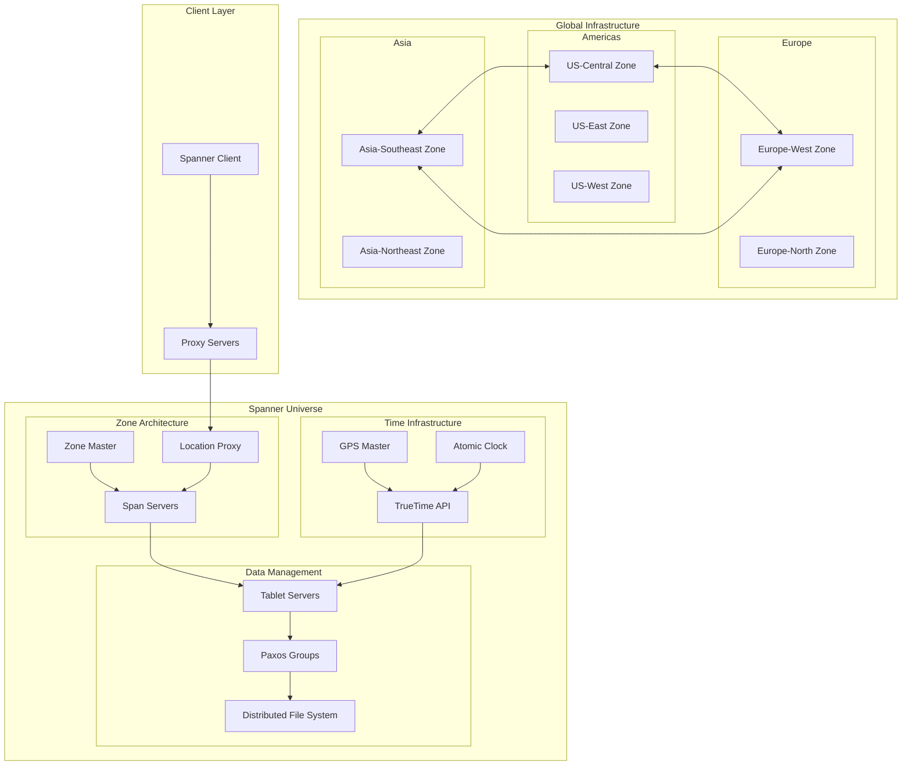

# Google Spanner: Scale and Architecture Deep Dive

!!! abstract "Quick Facts"
| Metric | Value |
 |--------|-------|
 | **Scale** | Billions of users globally |
 | **Throughput** | Millions of transactions/second |
 | **Data Volume** | Exabytes across datacenters |
 | **Availability** | 99.999% uptime SLA |
 | **Team Size** | 500+ engineers |


## Executive Summary

Google Spanner revolutionized distributed database design by achieving something previously thought impossible: globally distributed ACID transactions with external consistency. Through innovative use of synchronized atomic clocks (TrueTime), Spanner provides strong consistency guarantees while scaling across continents. The system demonstrates how fundamental physics constraints can be overcome through careful engineering and novel time synchronization techniques.

## System Overview

### Business Context

<div class="grid" markdown>
 <div class="card">
 <h3 class="card__title">Problem Space</h3>
 <p class="card__description">Provide globally consistent database for AdWords billing system requiring ACID guarantees at planetary scale</p>
 </div>
 <div class="card">
 <h3 class="card__title">Constraints</h3>
 <p class="card__description">Must maintain consistency across continents, handle datacenter failures, and support SQL queries</p>
 </div>
 <div class="card">
 <h3 class="card__title">Success Metrics</h3>
 <p class="card__description">External consistency, 99.999% availability, sub-100ms read latency globally</p>
 </div>
</div>

### High-Level Architecture



## Mapping to Fundamental Laws

### Law Analysis

<table class="responsive-table">
<thead>
 <tr>
 <th>Law</th>
 <th>Challenge</th>
 <th>Solution</th>
 <th>Trade-off</th>
 </tr>
</thead>
<tbody>
 <tr>
 <td data-label="Law">Correlated Failure</td>
 <td data-label="Challenge">Datacenter-wide outages across continents</td>
 <td data-label="Solution">Multi-region Paxos groups, automated failover</td>
 <td data-label="Trade-off">5x storage overhead, complex coordination</td>
 </tr>
 <tr>
 <td data-label="Law">Asynchronous Reality</td>
 <td data-label="Challenge">Network delays between continents (150ms+)</td>
 <td data-label="Solution">TrueTime API with GPS/atomic clocks, read-only transactions</td>
 <td data-label="Trade-off">Expensive time infrastructure, commit wait delays</td>
 </tr>
 <tr>
 <td data-label="Law">Emergent Chaos</td>
 <td data-label="Challenge">Concurrent transactions across global replicas</td>
 <td data-label="Solution">Two-phase commit with Paxos, timestamp ordering</td>
 <td data-label="Trade-off">Higher latency for write transactions</td>
 </tr>
 <tr>
 <td data-label="Law">Multidimensional Optimization</td>
 <td data-label="Challenge">Balance consistency, latency, and availability</td>
 <td data-label="Solution">Hierarchical timestamps, lock-free reads</td>
 <td data-label="Trade-off">Complex implementation and operational overhead</td>
 </tr>
 <tr>
 <td data-label="Law">Distributed Knowledge</td>
 <td data-label="Challenge">Monitoring thousands of Paxos groups globally</td>
 <td data-label="Solution">Comprehensive telemetry, automated diagnosis</td>
 <td data-label="Trade-off">Significant monitoring infrastructure costs</td>
 </tr>
 <tr>
 <td data-label="Law">Cognitive Load</td>
 <td data-label="Challenge">Managing globally distributed consensus</td>
 <td data-label="Solution">Automated shard management, SQL interface</td>
 <td data-label="Trade-off">Hidden complexity makes debugging difficult</td>
 </tr>
 <tr>
 <td data-label="Law">Economic Reality</td>
 <td data-label="Challenge">Massive infrastructure cost for global consistency</td>
 <td data-label="Solution">Shared infrastructure across Google services</td>
 <td data-label="Trade-off">Only viable at Google's scale and requirements</td>
 </tr>
</tbody>
</table>

## Design Deep Dive

### Data Architecture

!!! tip "Key Design Decisions"
 1. **TrueTime API**: GPS and atomic clock synchronization providing global time ordering
 2. **Multi-Version Concurrency Control**: Timestamp-based MVCC for lock-free reads
 3. **Hierarchical Partitioning**: Directory-based sharding with automatic rebalancing
 4. **Paxos for Consensus**: Multi-region Paxos groups for strong consistency guarantees

### Scaling Strategy

=== "Regional Deployment"

 **Scale: Single Region**

 ```mermaid
 graph TB
 subgraph "Single Region"
 CLIENT[Clients] --> ZONE1[Zone 1]
 CLIENT --> ZONE2[Zone 2]
 CLIENT --> ZONE3[Zone 3]
 ZONE1 <--> PAXOS[Paxos Group]
 ZONE2 <--> PAXOS
 ZONE3 <--> PAXOS
 end
 ```

 **Characteristics:**
 - 3-5 zones within region
 - Synchronous replication
 - Sub-10ms latencies
 - 99.99% availability
 - Traditional database semantics

 **Configuration:**
 ```sql
 CREATE DATABASE mydb
 OPTIONS (
 version_retention_period = '7d',
 default_leader = 'us-central1'
 );
 ```

=== "Multi-Region Configuration"

 **Scale: Continental**

 ```mermaid
 graph TB
 subgraph "North America"
 NA1[US-East]
 NA2[US-Central]
 NA3[US-West]
 end
 
 subgraph "Paxos Consensus"
 LEADER[Paxos Leader]
 F1[Follower 1]
 F2[Follower 2]
 end
 
 NA1 <--> LEADER
 NA2 <--> F1
 NA3 <--> F2
 ```

 **Characteristics:**
 - Read replicas in multiple regions
 - Write leader in primary region
 - 50-100ms write latencies
 - Regional read latencies
 - Automatic failover

 **Configuration:**
 ```sql
 CREATE DATABASE multi_region
 OPTIONS (
 multi_region_configuration = 'nam3',
 default_leader = 'us-central1'
 );
 ```

=== "Global Distribution"

 **Scale: Planetary**

 ```mermaid
 graph TB
 subgraph "Global Paxos"
 subgraph "Americas"
 US[US Leaders]
 end
 subgraph "Europe"
 EU[EU Leaders]
 end
 subgraph "Asia"
 AS[Asia Leaders]
 end
 end
 
 US <-->|TrueTime Sync| EU
 EU <-->|TrueTime Sync| AS
 AS <-->|TrueTime Sync| US
 
 TT[TrueTime Infrastructure]
 TT --> US
 TT --> EU
 TT --> AS
 ```

 **Characteristics:**
 - Leaders distributed globally
 - External consistency via TrueTime
 - 100-300ms global transactions
 - Partition tolerance
 - Complex operations

 **Configuration:**
 ```sql
 ALTER DATABASE mydb
 SET OPTIONS (
 placement_policy = 'GLOBAL',
 num_replicas = 5,
 replica_locations = [
 'us-central1',
 'europe-west1',
 'asia-northeast1'
 ]
 );
 ```

=== "Hierarchical Sharding"

 **Scale: Exabyte+**

 ```mermaid
 graph TB
 ROOT[Root Directory]
 ROOT --> D1[Directory 1]
 ROOT --> D2[Directory 2]
 
 D1 --> T1[Table Group 1]
 D1 --> T2[Table Group 2]
 D2 --> T3[Table Group 3]
 D2 --> T4[Table Group 4]
 
 T1 --> S1[Shard 1]
 T1 --> S2[Shard 2]
 T2 --> S3[Shard 3]
 T2 --> S4[Shard 4]
 ```

 **Characteristics:**
 - Automatic data distribution
 - Co-location of related data
 - Directory-based sharding
 - Load-based splitting
 - Transparent to applications

 **Split Policies:**
 ```sql
 -- Define interleaving for co-location
 CREATE TABLE Orders (
 CustomerID INT64,
 OrderID INT64,
 ...
 ) PRIMARY KEY (CustomerID, OrderID),
 INTERLEAVE IN PARENT Customers ON DELETE CASCADE;
 ```

=== "SQL Interface Evolution"

 **From NoSQL to NewSQL:**

 ```mermaid
 timeline
 title Spanner SQL Evolution
 
 2012 : NoSQL Key-Value API
 : Basic read/write operations
 
 2014 : Limited SQL Support
 : Simple SELECT queries
 
 2017 : Full SQL System
 : ANSI SQL compliance
 : Complex joins and aggregations
 
 2020 : Advanced Features
 : Stored procedures
 : Change streams
 
 2023 : AI Integration
 : Vector search
 : ML model serving
 ```

 **Current SQL Capabilities:**
 ```sql
 -- Complex analytical query
 WITH regional_sales AS (
 SELECT region, SUM(amount) as total
 FROM orders
 WHERE order_date >= CURRENT_DATE - 30
 GROUP BY region
 )
 SELECT r.*, 
 RANK() OVER (ORDER BY total DESC) as rank
 FROM regional_sales r
 WHERE total > 1000000;
 ```

## Failure Scenarios & Lessons

!!! danger "Major Incident: 2011 Datacenter Network Partition"
 **What Happened**: Network partition isolated a major Google datacenter, testing Spanner's consensus mechanisms under extreme conditions during early deployment.

 **Root Cause**: 
 - Fiber optic cable cuts isolating entire datacenter
 - Majority of Paxos groups lost quorum simultaneously
 - Clock skew issues during partition recovery

 **Impact**: 
 - 4 hours of reduced availability for affected services
 - Some transactions blocked waiting for consensus
 - AdWords billing temporarily unavailable in affected regions
 - Demonstrated resilience but revealed edge cases in recovery

 **Lessons Learned**:
 1. **Quorum placement**: Better geographic distribution of Paxos group replicas
 2. **Clock synchronization**: Enhanced TrueTime uncertainty handling during partitions
 3. **Graceful degradation**: Improved read-only operation during consensus failures

## Performance Characteristics

### Latency Breakdown

<div class="grid" markdown>
 <div class="card">
 <h3 class="card__title">Read Latency</h3>
 <div class="stat-number">5-10ms</div>
 </div>
 <div class="card">
 <h3 class="card__title">Write Latency</h3>
 <div class="stat-number">50-100ms</div>
 </div>
 <div class="card">
 <h3 class="card__title">Global Transaction</h3>
 <div class="stat-number">100-300ms</div>
 </div>
</div>

### Resource Utilization

| Resource | Usage | Efficiency |
|----------|-------|------------|
| Storage | 5x overhead | Strong consistency guarantees |
| Network | High inter-region | Global synchronization required |
| CPU | Moderate | Optimized Paxos implementation |
| Time Infrastructure | GPS + Atomic | Sub-microsecond accuracy |


## Operational Excellence

### Monitoring & Observability

- **Metrics**: Comprehensive telemetry for Paxos groups, TrueTime uncertainty, and transaction latencies
- **Logging**: Distributed transaction logs with causal ordering preservation
- **Tracing**: End-to-end transaction tracing across global infrastructure
- **Alerting**: SLO-based monitoring with automated remediation for common failures

### Deployment Strategy

=== "Zone-by-Zone Rollout"

 ```mermaid
 sequenceDiagram
 participant CD as Control Plane
 participant Z1 as Zone 1
 participant Z2 as Zone 2
 participant Z3 as Zone 3
 participant MON as Monitoring
 
 CD->>Z1: Deploy update
 Z1->>MON: Health metrics
 MON->>CD: Verify success
 CD->>Z2: Deploy update
 Z2->>MON: Health metrics
 MON->>CD: Verify success
 CD->>Z3: Deploy update
 ```

 **Process:**
 1. Deploy to single zone
 2. Monitor for 24 hours
 3. Gradual rollout to remaining zones
 4. Automatic rollback on errors
 5. Full deployment in 1 week

 **Safety Mechanisms:**
 - Automated health checks
 - Performance regression detection
 - Paxos group stability monitoring
 - TrueTime uncertainty tracking

=== "Online Schema Changes"

 ```mermaid
 stateDiagram-v2
 [*] --> Prepare: Create new schema
 Prepare --> Backfill: Start background migration
 Backfill --> DualWrite: Write to both schemas
 DualWrite --> Validate: Verify data consistency
 Validate --> Cutover: Switch to new schema
 Cutover --> Cleanup: Remove old schema
 Cleanup --> [*]
 ```

 **Schema Evolution Process:**
 ```sql
 -- 1. Add column (instant)
 ALTER TABLE Users ADD COLUMN age INT64;
 
 -- 2. Create index (background)
 CREATE INDEX idx_age ON Users(age);
 
 -- 3. Add constraint (validated)
 ALTER TABLE Users ADD CONSTRAINT age_check 
 CHECK (age >= 0 AND age <= 150);
 
 -- 4. Monitor progress
 SELECT * FROM information_schema.schema_changes
 WHERE table_name = 'Users';
 ```

 **Zero-Downtime Guarantees:**
 - Non-blocking schema changes
 - Background index creation
 - Automatic query plan updates

=== "Canary Testing"

 ```mermaid
 graph TB
 TRAFFIC[Client Traffic] --> SPLIT{Traffic Splitter}
 SPLIT -->|99%| STABLE[Stable Spanner]
 SPLIT -->|1%| CANARY[Canary Spanner]
 
 CANARY --> COMPARE[Result Comparator]
 STABLE --> COMPARE
 
 COMPARE --> METRICS[Metrics Dashboard]
 METRICS --> DECISION{Pass/Fail?}
 DECISION -->|Pass| PROMOTE[Promote Canary]
 DECISION -->|Fail| ROLLBACK[Rollback]
 ```

 **Canary Configuration:**
 ```yaml
 canary:
 traffic_percentage: 1
 duration: 24h
 metrics:
 - latency_p99 < 100ms
 - error_rate < 0.01%
 - consistency_violations = 0
 rollback:
 automatic: true
 threshold: any_metric_failure
 ```

=== "Global Coordination"

 ```mermaid
 graph TB
 subgraph "Deployment Controller"
 CTRL[Global Controller]
 SCHED[Scheduler]
 end
 
 subgraph "Regional Coordinators"
 US_COORD[US Coordinator]
 EU_COORD[EU Coordinator]
 AS_COORD[Asia Coordinator]
 end
 
 subgraph "Zone Managers"
 US_Z[US Zones]
 EU_Z[EU Zones]
 AS_Z[Asia Zones]
 end
 
 CTRL --> SCHED
 SCHED --> US_COORD
 SCHED --> EU_COORD
 SCHED --> AS_COORD
 
 US_COORD --> US_Z
 EU_COORD --> EU_Z
 AS_COORD --> AS_Z
 ```

 **Global Deployment Phases:**
 1. **Phase 1**: Deploy to test regions
 2. **Phase 2**: Deploy to low-traffic regions
 3. **Phase 3**: Deploy to high-traffic regions
 4. **Phase 4**: Deploy to critical regions
 5. **Phase 5**: Global verification

 **Rollback Capability:**
 - Regional rollback: < 5 minutes
 - Global rollback: < 30 minutes
 - State consistency preserved

## Key Innovations

1. **TrueTime API**: First production system to use synchronized atomic clocks for distributed consensus
2. **External Consistency**: Achieved global linearizability through careful timestamp ordering
3. **SQL at Scale**: Demonstrated that SQL interfaces can work at planetary scale with strong consistency

## Applicable Patterns

<div class="grid" markdown>
 <a href="../pattern-library/consensus/" class="pattern-card">
 <h3 class="pattern-card__title">Multi-Paxos</h3>
 <p class="pattern-card__description">Consensus across global replicas with leader election</p>
 </a>
 <a href="../pattern-library/mvcc/" class="pattern-card">
 <h3 class="pattern-card__title">MVCC</h3>
 <p class="pattern-card__description">Multi-version concurrency control for lock-free reads</p>
 </a>
 <a href="../pattern-library/coordination/two-phase-commit/" class="pattern-card">
 <h3 class="pattern-card__title">Two-Phase Commit</h3>
 <p class="pattern-card__description">Global transaction coordination with Paxos groups</p>
 </a>
 <a href="../pattern-library/leader-follower/" class="pattern-card">
 <h3 class="pattern-card__title">Leader-Follower</h3>
 <p class="pattern-card__description">Paxos leaders handle writes, followers serve reads</p>
 </a>
</div>

## Takeaways for Your System

!!! quote "Key Lessons"
 1. **When to apply**: Use for systems requiring global ACID transactions with strong consistency (financial, billing systems)
 2. **When to avoid**: Don't use for systems that can tolerate eventual consistency or don't need global distribution
 3. **Cost considerations**: Expect 5-10x infrastructure cost compared to eventually consistent systems
 4. **Team requirements**: Need deep expertise in distributed systems, consensus algorithms, and time synchronization

## Further Reading

- [Spanner: Google's Globally-Distributed Database (OSDI 2012)](https://research.google/pubs/pub39966/)
- [Spanner: Becoming a SQL System (SIGMOD 2017)](https://research.google/pubs/pub46103/)
- [TrueTime and the CAP Theorem](https://cloud.google.com/spanner/docs/true-time-external-consistency)
- [Cloud Spanner Documentation](https://cloud.google.com/spanner/docs)

## Discussion Questions

1. How does TrueTime's uncertainty bound affect transaction latency and what are the trade-offs?
2. Could Spanner's architecture work without the GPS/atomic clock infrastructure? What alternatives exist?
3. How would you design a similar system for a company without Google's global infrastructure?
4. What are the implications of Spanner's external consistency guarantees for application design?