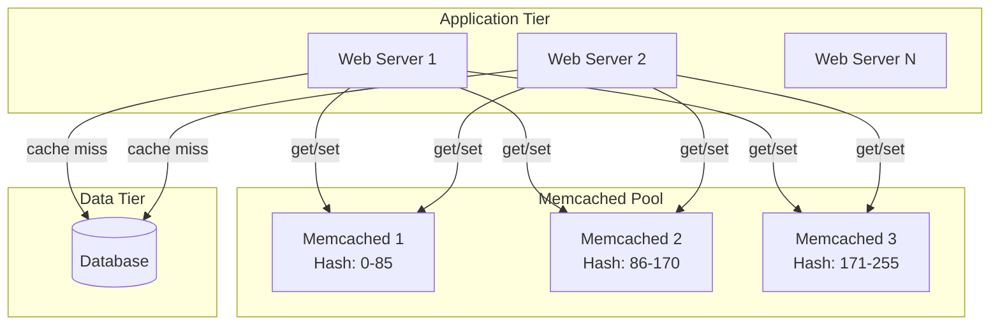
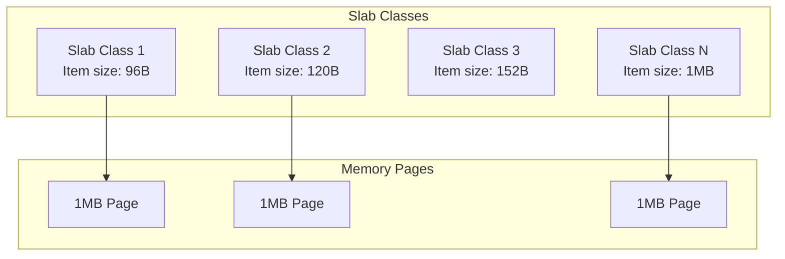
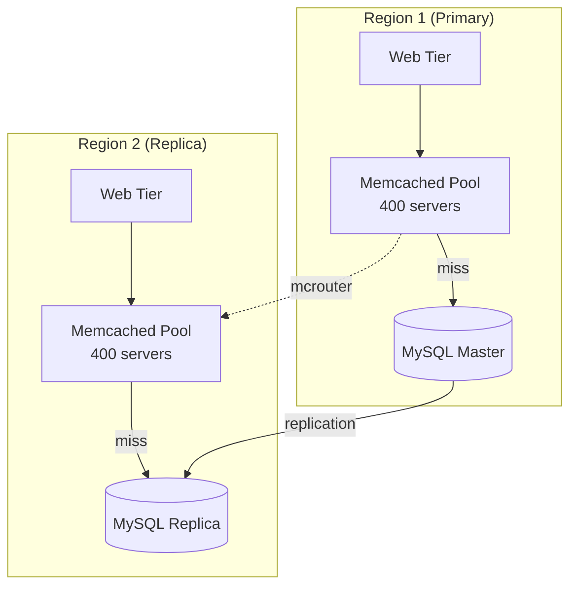
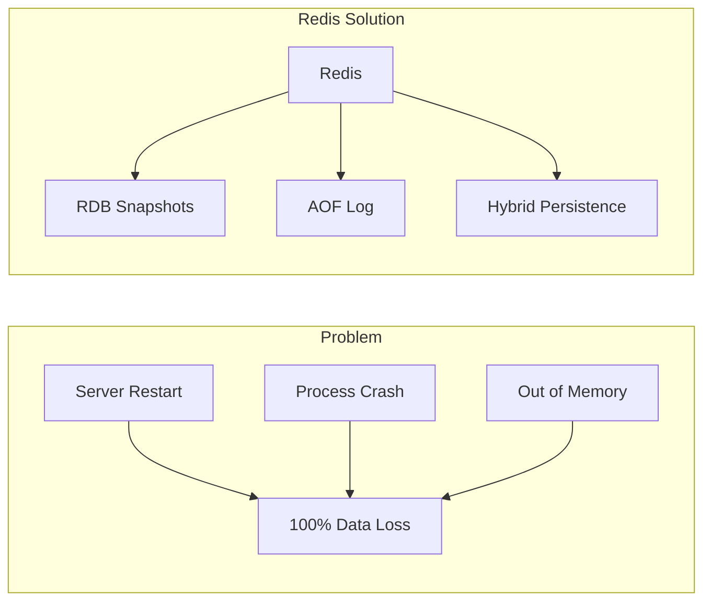

# Memcached: Simple Distributed Memory Caching

!!! abstract "The Memcached Story"
    **🎯 Single Achievement**: Pioneered distributed memory caching
    **📊 Scale**: Facebook: 800+ servers, 28TB RAM cache
    **⏱️ Performance**: 500K+ ops/sec per node
    **💡 Key Innovation**: Dead simple protocol, consistent hashing

!!! warning "Bronze Tier Status"
    While Memcached pioneered distributed caching, it lacks modern features like persistence, replication, and data structures. Consider Redis or KeyDB for new projects.

## Why Memcached Mattered

| Traditional Approach | Memcached Innovation | Business Impact |
|---------------------|---------------------|------------------|
| **Database for everything** → slow | **RAM cache layer** → fast | 100x faster reads |
| **Complex caching** → bugs | **Simple key-value** → reliable | 90% fewer cache bugs |
| **Manual sharding** → rebalancing pain | **Consistent hashing** → automatic | Seamless scaling |
| **Heavyweight solutions** → overhead | **Minimal design** → efficient | <100KB memory overhead |

## Architecture Overview



## Core Design Philosophy

### 1. Protocol Simplicity

```bash
# Text protocol - human readable
telnet localhost 11211

# Store
set mykey 0 3600 5
hello
STORED

# Retrieve  
get mykey
VALUE mykey 0 5
hello
END

# Delete
delete mykey
DELETED

# Increment
incr counter 1
1
```

### 2. Consistent Hashing

```mermaid
graph LR
    subgraph "Hash Ring"
        NODE1[Node 1<br/>Position: 50]
        NODE2[Node 2<br/>Position: 150]
        NODE3[Node 3<br/>Position: 250]
    end
    
    KEY1[Key: "user:123"<br/>Hash: 75] -->|Next node| NODE2
    KEY2[Key: "session:abc"<br/>Hash: 30] -->|Next node| NODE1
    KEY3[Key: "product:456"<br/>Hash: 200] -->|Next node| NODE3
```

### 3. Memory Management (Slab Allocation)



## Production Patterns

### Cache-Aside Pattern

```python
def get_user(user_id):
    # Try cache first
    key = f"user:{user_id}"
    user = memcached.get(key)
    
    if user is None:
        # Cache miss - fetch from database
        user = db.query("SELECT * FROM users WHERE id = ?", user_id)
        
        # Store in cache for next time
        memcached.set(key, user, expire=3600)  # 1 hour TTL
    
    return user

def update_user(user_id, data):
    # Update database
    db.execute("UPDATE users SET ... WHERE id = ?", data, user_id)
    
    # Invalidate cache
    memcached.delete(f"user:{user_id}")
```

### Connection Pooling

```python
import memcache
import threading

class MemcachedPool:
    def __init__(self, servers, pool_size=10):
        self.pool = []
        for _ in range(pool_size):
            mc = memcache.Client(servers, debug=0)
            self.pool.append(mc)
        self.lock = threading.Lock()
    
    def get_client(self):
        with self.lock:
            return self.pool.pop()
    
    def return_client(self, client):
        with self.lock:
            self.pool.append(client)

# Usage
pool = MemcachedPool(['127.0.0.1:11211', '127.0.0.1:11212'])
client = pool.get_client()
try:
    value = client.get('mykey')
finally:
    pool.return_client(client)
```

## Facebook's Memcached Scale

### Multi-Region Architecture



### Facebook's Optimizations

1. **mcrouter**: Memcached protocol router
   ```
   - Connection pooling
   - Automatic failover  
   - Request batching
   - Consistent hashing
   ```

2. **Regional Pools**: Dedicated pools by workload
   ```
   - General cache: 200 servers
   - Session store: 100 servers
   - Rate limiting: 50 servers
   - Hot keys: 50 servers
   ```

3. **Lease Mechanism**: Prevent thundering herd
   ```python
   # Pseudo-code for lease-based get
   def get_with_lease(key):
       value, lease = memcached.get_with_lease(key)
       
       if value is None and lease:
           # Only one client gets lease
           value = expensive_computation()
           memcached.set_with_lease(key, value, lease)
       elif value is None:
           # Wait for lease holder
           time.sleep(0.1)
           value = memcached.get(key)
       
       return value
   ```

## Limitations Leading to Bronze Status

### 1. No Persistence



### 2. No Replication

| Issue | Impact | Redis Alternative |
|-------|--------|------------------|
| **Node failure** | Data loss for hash range | Master-slave replication |
| **Hot keys** | Single node overload | Read replicas |
| **Maintenance** | Downtime required | Online failover |
| **Backup** | Not possible | Point-in-time snapshots |

### 3. Limited Data Types

```python
# Memcached: Only strings
memcached.set("counter", "1")
value = int(memcached.get("counter"))
value += 1
memcached.set("counter", str(value))  # Race condition!

# Redis: Native types
redis.incr("counter")  # Atomic!
redis.lpush("queue", "item")
redis.sadd("set", "member")
redis.hset("hash", "field", "value")
```

## Migration Path to Modern Solutions

### Moving to Redis

```python
# Compatibility layer
class MemcachedToRedis:
    def __init__(self, redis_client):
        self.redis = redis_client
    
    def get(self, key):
        return self.redis.get(key)
    
    def set(self, key, value, time=0):
        if time > 0:
            return self.redis.setex(key, time, value)
        return self.redis.set(key, value)
    
    def delete(self, key):
        return self.redis.delete(key)
    
    def incr(self, key, delta=1):
        return self.redis.incrby(key, delta)
```

### Feature Comparison

| Feature | Memcached | Redis | KeyDB |
|---------|-----------|-------|--------|
| **Persistence** | ❌ | ✅ RDB/AOF | ✅ RDB/AOF |
| **Replication** | ❌ | ✅ Master-slave | ✅ Active-replica |
| **Clustering** | ❌ Client-side | ✅ Redis Cluster | ✅ Redis Cluster |
| **Data structures** | ❌ Strings only | ✅ Lists, Sets, etc | ✅ Lists, Sets, etc |
| **Lua scripting** | ❌ | ✅ | ✅ |
| **Transactions** | ❌ | ✅ MULTI/EXEC | ✅ MULTI/EXEC |
| **Multi-threading** | ✅ | ❌ Single-threaded | ✅ Multi-threaded |

## Best Practices (If Still Using)

### 1. Implement Circuit Breakers

```python
class MemcachedCircuitBreaker:
    def __init__(self, threshold=5, timeout=60):
        self.threshold = threshold
        self.timeout = timeout
        self.failures = 0
        self.last_failure = 0
        self.is_open = False
    
    def call(self, func, *args, **kwargs):
        if self.is_open:
            if time.time() - self.last_failure > self.timeout:
                self.is_open = False
                self.failures = 0
            else:
                raise Exception("Circuit breaker open")
        
        try:
            result = func(*args, **kwargs)
            self.failures = 0
            return result
        except Exception as e:
            self.failures += 1
            self.last_failure = time.time()
            if self.failures >= self.threshold:
                self.is_open = True
            raise e
```

### 2. Monitor Key Metrics

```bash
# Stats command output
stats
STAT uptime 86400
STAT curr_connections 10
STAT total_connections 1000
STAT cmd_get 5000000
STAT cmd_set 1000000
STAT get_hits 4500000
STAT get_misses 500000
STAT evictions 10000
STAT bytes_used 1073741824
STAT limit_maxbytes 2147483648
```

### 3. Handle Failures Gracefully

```python
def get_with_fallback(key, fallback_func):
    try:
        # Try cache with timeout
        value = memcached.get(key)
        if value is not None:
            return value
    except Exception as e:
        logger.warning(f"Cache error: {e}")
    
    # Fallback to computation
    value = fallback_func()
    
    # Try to cache, but don't fail
    try:
        memcached.set(key, value, expire=300)
    except:
        pass
    
    return value
```

## Lessons Learned

!!! quote "Key Takeaways"
    1. **Simplicity has value**: Basic protocol enabled wide adoption
    2. **Caching isn't simple**: Invalidation, consistency are hard
    3. **Features matter**: Persistence and replication became essential
    4. **Evolution necessary**: Redis built on Memcached's lessons
    5. **Right tool matters**: Memcached still valid for specific uses

## When Memcached Still Makes Sense

✅ **Consider Memcached**:
- Pure cache use case
- Multi-threaded performance critical
- Existing investment/expertise
- Simple key-value only needs

❌ **Use Redis/KeyDB Instead**:
- Need persistence
- Need replication
- Complex data structures
- Pub/sub requirements
- Lua scripting needs

## Related Topics

- [Redis Architecture](../redis-architecture.md) - Modern alternative
- [Consistent Hashing](../pattern-library/data-management/consistent-hashing.md) - Core distribution
- [Caching Strategies](../pattern-library/scaling/caching-strategies/) - Cache patterns
- [Facebook Infrastructure](facebook-memcached.md) - Largest deployment
- [Circuit Breaker](../pattern-library/resilience/circuit-breaker.md) - Failure handling

## References

1. [Scaling Memcache at Facebook](https:/www.usenix.org/system/files/conference/nsdi13/nsdi13-final170_update.pdf/)
2. [Memcached Protocol Specification](https:/github.com/memcached/memcached/blob/master/doc/protocol.txt/)
3. [mcrouter: Memcached protocol router](https:/github.com/facebook/mcrouter/)
4. [Memcached Internals](https:/memcached.org/blog/modern-lru/)
