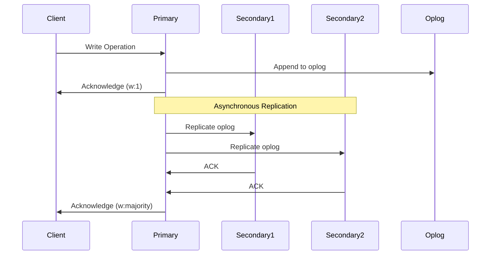
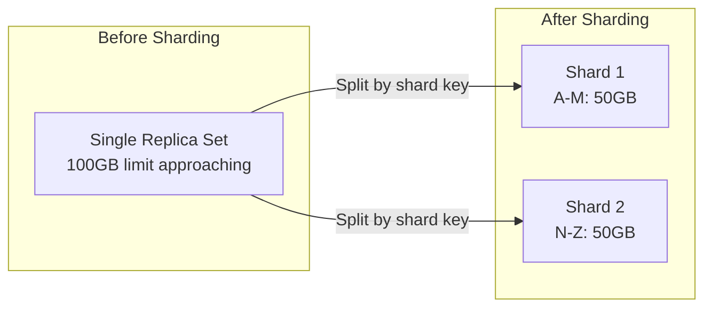
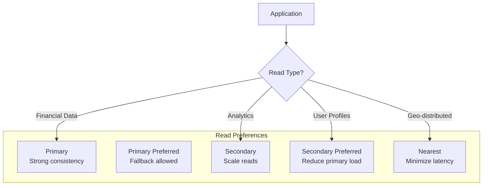

# MongoDB: Document Database at Scale

!!! abstract "The MongoDB Story"
    **🎯 Single Achievement**: Popularized document databases for developers
    **📊 Scale**: Baidu: 1,000+ node cluster, 10PB+ data
    **⏱️ Performance**: 1M+ ops/sec with proper sharding
    **💡 Key Innovation**: Flexible schema with horizontal scaling

## Why MongoDB Matters

| Traditional RDBMS | MongoDB Innovation | Business Impact |
|-------------------|-------------------|------------------|
| **Fixed schema** → migration pain | **Flexible documents** → agile development | 10x faster iterations |
| **Vertical scaling** → expensive | **Horizontal sharding** → commodity hardware | 70% cost reduction |
| **SQL only** → complex for documents | **Rich query language** → intuitive | 5x developer productivity |
| **ACID only** → performance limits | **Tunable consistency** → flexibility | 3x throughput gains |

## Architecture Overview

```mermaid
graph TB
    subgraph "MongoDB Cluster"
        subgraph "Config Servers"
            CS1[Config Server 1]
            CS2[Config Server 2]
            CS3[Config Server 3]
        end
        
        subgraph "Shards"
            subgraph "Shard 1"
                P1[Primary]
                S1A[Secondary]
                S1B[Secondary]
            end
            
            subgraph "Shard 2"
                P2[Primary]
                S2A[Secondary]
                S2B[Secondary]
            end
            
            subgraph "Shard N"
                PN[Primary]
                SNA[Secondary]
                SNB[Secondary]
            end
        end
        
        MONGOS[Query Routers<br/>(mongos)]
    end
    
    CLIENT[Application] --> MONGOS
    MONGOS --> CS1
    MONGOS --> P1
    MONGOS --> P2
    MONGOS --> PN
```

## Core Design Decisions

### 1. Document Model

```javascript
// Natural data representation
{
  _id: ObjectId("507f1f77bcf86cd799439011"),
  user: "john.doe",
  profile: {
    name: "John Doe",
    email: "john@example.com",
    addresses: [
      {
        type: "home",
        street: "123 Main St",
        city: "Boston",
        country: "USA"
      }
    ]
  },
  orders: [
    { orderId: "A123", total: 250.99, items: 3 },
    { orderId: "B456", total: 89.50, items: 1 }
  ],
  lastLogin: ISODate("2024-01-15T10:30:00Z")
}
```

### 2. Replica Set Architecture



### 3. Sharding Strategy

| Sharding Type | Use Case | Pros | Cons |
|---------------|----------|------|------|
| **Range-based** | Time-series data | Efficient range queries | Potential hotspots |
| **Hash-based** | User data | Even distribution | No efficient ranges |
| **Zone-based** | Geo-distributed | Data locality | Complex setup |
| **Compound** | Multi-tenant | Flexible | Query routing overhead |

## Scaling Patterns

### Horizontal Scaling with Sharding



**Shard Key Selection Framework**:

```javascript
// Good shard key: high cardinality, even distribution
db.users.createIndex({ "userId": "hashed" })
sh.shardCollection("mydb.users", { "userId": "hashed" })

// Poor shard key: low cardinality, hotspots
// DON'T: sh.shardCollection("mydb.logs", { "level": 1 })

// Compound shard key for multi-tenant
sh.shardCollection("mydb.events", { 
  "tenantId": 1, 
  "timestamp": 1 
})
```

### Read Scaling Patterns



## Production Challenges

### Challenge 1: The Shard Key Mistake

!!! danger "Real Incident: Hotspot Hell"
    **Company**: Social media platform
    **Problem**: Used timestamp as shard key
    **Result**: All writes hitting one shard, 100% CPU
    **Fix**: Migrated to compound key (userId, timestamp)
    **Downtime**: 6 hours for resharding

### Challenge 2: Unbounded Array Growth

```javascript
// Anti-pattern: Unbounded arrays
{
  userId: "123",
  activities: [
    // Grows infinitely!
    { timestamp: "...", action: "..." },
    { timestamp: "...", action: "..." },
    // Document size limit: 16MB
  ]
}

// Solution: Bucket pattern
{
  userId: "123",
  bucket: "2024-01-15",
  activities: [
    // Limited to one day
  ],
  count: 150
}
```

### Challenge 3: Multi-Document Transactions

```javascript
// MongoDB 4.0+ supports transactions
const session = client.startSession();

try {
  await session.withTransaction(async () => {
    await orders.insertOne({ ... }, { session });
    await inventory.updateOne({ ... }, { session });
    await accounts.updateOne({ ... }, { session });
  });
} catch (error) {
  // Automatic rollback
}
```

**Transaction Limitations**:
- 60 second default timeout
- Performance impact ~30%
- Not recommended for high-frequency operations

## Operational Excellence

### Monitoring Critical Metrics

```yaml
key_metrics:
  replication:
    - replication_lag
    - oplog_window
    - member_state
  
  sharding:
    - chunk_distribution
    - migration_status
    - balancer_enabled
  
  performance:
    - opcounters
    - queue_depth
    - connection_pool
    - cache_hit_ratio
  
  resources:
    - cpu_usage
    - memory_usage
    - disk_io
    - network_traffic
```

### Backup Strategies

| Method | RPO | RTO | Cost | Use Case |
|--------|-----|-----|------|----------|
| **mongodump** | Hours | Hours | Low | Small datasets |
| **File snapshots** | Minutes | Minutes | Medium | Medium datasets |
| **Continuous backup** | Seconds | Minutes | High | Critical data |
| **Delayed secondary** | Hours | Minutes | Low | Human error recovery |

## Best Practices

### Schema Design Patterns

1. **Embedding vs References**:
   ```javascript
   // Embed for 1:1 or 1:few
   { user: "john", address: { street: "..." } }
   
   // Reference for 1:many or many:many
   { user: "john", orderIds: ["order1", "order2"] }
   ```

2. **Denormalization for Performance**:
   ```javascript
   // Denormalize frequently accessed data
   {
     orderId: "123",
     userId: "456",
     userName: "John Doe",  // Denormalized
     userEmail: "john@example.com"  // Denormalized
   }
   ```

3. **Index Strategy**:
   ```javascript
   // Compound indexes for query patterns
   db.products.createIndex({ category: 1, price: -1 })
   
   // Text indexes for search
   db.products.createIndex({ name: "text", description: "text" })
   
   // Partial indexes for efficiency
   db.orders.createIndex(
     { status: 1 },
     { partialFilterExpression: { status: "active" } }
   )
   ```

## Modern Features

### Change Streams

```javascript
// Real-time change notifications
const changeStream = db.collection('orders').watch([
  { $match: { operationType: 'insert' } }
]);

changeStream.on('change', (change) => {
  // React to new orders
  console.log('New order:', change.fullDocument);
});
```

### Aggregation Pipeline

```javascript
// Complex analytics in-database
db.orders.aggregate([
  { $match: { status: "completed" } },
  { $group: {
    _id: "$customerId",
    totalSpent: { $sum: "$amount" },
    orderCount: { $sum: 1 }
  }},
  { $sort: { totalSpent: -1 } },
  { $limit: 10 }
]);
```

## Decision Framework

### When to Use MongoDB

✅ **Perfect Fit**:
- Document-oriented data
- Flexible schemas
- Rapid prototyping
- Content management
- Real-time analytics

⚠️ **Consider Carefully**:
- Complex transactions
- Heavy JOIN operations
- Fixed schemas
- Regulatory compliance (depends on version)

❌ **Avoid**:
- Graph relationships
- High-frequency trading
- Complex ACID requirements

## Lessons Learned

!!! quote "Key Takeaways"
    1. **Shard key is forever**: Choose carefully, test thoroughly
    2. **Model for queries**: Design schema around access patterns
    3. **Monitor everything**: Especially replication lag and chunk distribution
    4. **Plan for growth**: Document size limits and array growth
    5. **Test failure scenarios**: Practice failovers and recovery

## Related Topics

- [Sharding](../pattern-library/scaling/sharding.md) - Core MongoDB scaling pattern
- [Eventual Consistency](../pattern-library/data-management/eventual-consistency.md) - Read preference implications
- [CAP Theorem](../pattern-library/architecture/cap-theorem.md) - MongoDB's CP with tunable consistency
- [Aggregation Pipeline](../pattern-library/scaling/scatter-gather.md) - Distributed processing
- [Change Data Capture](../pattern-library/data-management/cdc.md) - Change streams implementation

## References

1. [MongoDB Applied Design Patterns](https://www.oreilly.com/library/view/mongodb-applied-design/9781449340056/)
2. [Scaling MongoDB](https://www.oreilly.com/library/view/scaling-mongodb/9781449303211/)
3. [MongoDB Architecture Guide](https://www.mongodb.com/collateral/mongodb-architecture-guide)
4. [Production Notes](https://docs.mongodb.com/manual/administration/production-notes/)
