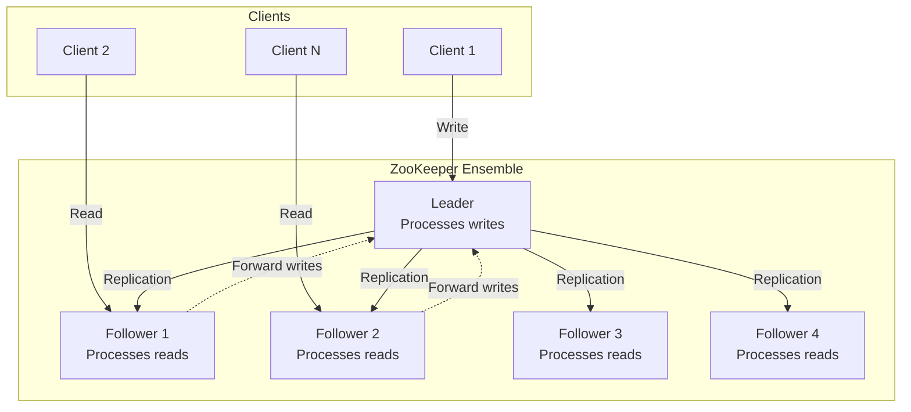
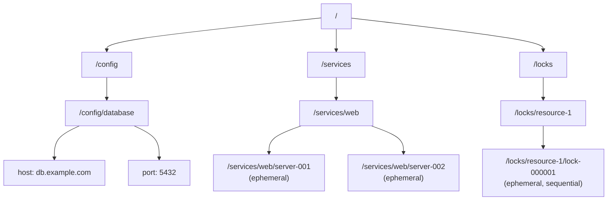
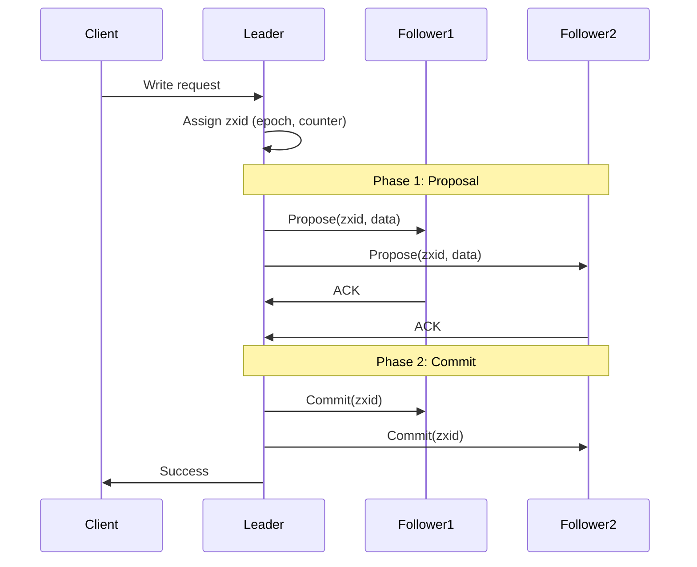
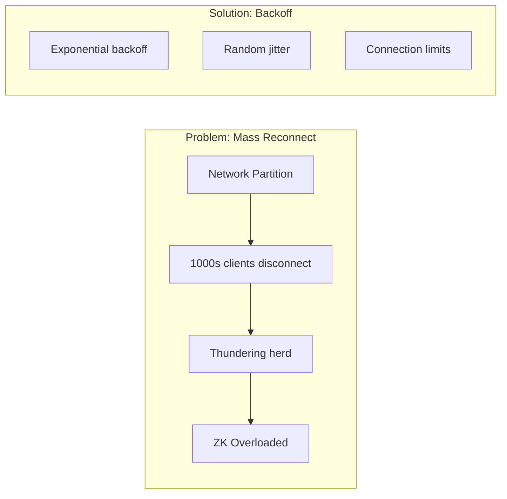

# Apache ZooKeeper: Distributed Coordination Service

!!! abstract "The ZooKeeper Story"
    **🎯 Single Achievement**: First widely-adopted coordination service
    **📊 Scale**: Yahoo: 50+ ZK clusters, 1000s of clients each
    **⏱️ Performance**: 100K+ ops/sec for reads
    **💡 Key Innovation**: Simple primitives for complex coordination

!!! warning "Legacy Status"
    While ZooKeeper pioneered distributed coordination, modern alternatives like etcd and Consul offer better APIs, performance, and integration with cloud-native systems.

## Why ZooKeeper Mattered

| Traditional Approach | ZooKeeper Innovation | Business Impact |
|---------------------|---------------------|------------------|
| **Ad-hoc coordination** → bugs | **Proven primitives** → reliable | 90% fewer distributed bugs |
| **Hardcoded configs** → restarts | **Dynamic configuration** → live updates | Zero-downtime reconfig |
| **Manual failover** → downtime | **Automatic leader election** → HA | 99.99% availability |
| **Polling for changes** → delays | **Watch notifications** → real-time | Millisecond reactions |

## Architecture Overview



## Core Concepts

### 1. ZNode Data Model



### 2. ZNode Types

| Type | Persistence | Use Case | Example |
|------|------------|----------|----------|
| **Persistent** | Survives client disconnect | Configuration | `/config/database` |
| **Ephemeral** | Deleted on disconnect | Service discovery | `/services/web/server-001` |
| **Sequential** | Auto-incrementing suffix | Ordered operations | `/queue/item-000000001` |
| **Ephemeral Sequential** | Both properties | Leader election | `/election/leader-000000001` |

### 3. Common Recipes

#### Leader Election

```python
def elect_leader(zk, election_path):
    # Create ephemeral sequential node
    my_node = zk.create(
        f"{election_path}/leader-",
        ephemeral=True,
        sequence=True
    )
    
    while True:
        children = zk.get_children(election_path)
        children.sort()
        
        if my_node.split('/')[-1] == children[0]:
            # I am the leader!
            return True
        else:
            # Watch the node before me
            prev_node = children[children.index(my_node.split('/')[-1]) - 1]
            exists = zk.exists(f"{election_path}/{prev_node}", watch=True)
            if not exists:
                continue  # Re-check, might be leader now
            else:
                # Wait for watch event
                event.wait()
```

#### Distributed Lock

```python
def acquire_lock(zk, lock_path):
    # Create sequential ephemeral node
    lock_node = zk.create(
        f"{lock_path}/lock-",
        ephemeral=True,
        sequence=True
    )
    
    while True:
        children = zk.get_children(lock_path)
        children.sort()
        
        if lock_node.split('/')[-1] == children[0]:
            # Got the lock!
            return lock_node
        else:
            # Wait for earlier lock to release
            watch_node = children[0]
            exists = zk.exists(f"{lock_path}/{watch_node}", watch=True)
            if exists:
                event.wait()
```

## ZAB Protocol (ZooKeeper Atomic Broadcast)



## Production Patterns

### Configuration Management

```java
/ Dynamic configuration with watches
public class ConfigManager {
    private ZooKeeper zk;
    private String configPath = "/config/app";
    
    public void watchConfig() {
        zk.getData(configPath, new Watcher() {
            public void process(WatchedEvent event) {
                if (event.getType() == EventType.NodeDataChanged) {
                    / Reload configuration
                    String newConfig = zk.getData(configPath, this, null);
                    applyConfig(newConfig);
                }
            }
        }, null);
    }
}
```

### Service Discovery

```python
class ServiceRegistry:
    def __init__(self, zk):
        self.zk = zk
        self.services = {}
        
    def register_service(self, service_name, instance_data):
        # Create service path if needed
        service_path = f"/services/{service_name}"
        self.zk.ensure_path(service_path)
        
        # Register instance (ephemeral)
        instance_path = self.zk.create(
            f"{service_path}/instance-",
            instance_data.encode(),
            ephemeral=True,
            sequence=True
        )
        return instance_path
        
    def discover_services(self, service_name):
        service_path = f"/services/{service_name}"
        
        # Watch for changes
        @self.zk.ChildrenWatch(service_path)
        def watch_services(children):
            self.services[service_name] = []
            for child in children:
                data, _ = self.zk.get(f"{service_path}/{child}")
                self.services[service_name].append(data.decode())
```

## Operational Challenges

### Challenge 1: The ZooKeeper Tax

!!! danger "Hidden Complexity"
    **Problem**: Every distributed system needed ZooKeeper
    **Impact**: 
    - Separate cluster to manage
    - Different operational model
    - Additional failure domain
    **Modern solution**: Embedded consensus (etcd in K8s)

### Challenge 2: Connection Storms



### Challenge 3: Data Size Limitations

```python
# Anti-pattern: Large data in ZooKeeper
try:
    # ZNode limit: 1MB
    zk.create("/data/large_file", huge_data)  # FAILS!
except ZookeeperError:
    pass

# Pattern: Store reference
data_ref = {
    "location": "s3:/bucket/large_file",
    "size": 1073741824,
    "checksum": "abc123"
}
zk.create("/data/large_file_ref", json.dumps(data_ref))
```

## Why Bronze Tier?

### Limitations Leading to Deprecation

1. **Complex API**: Recipes needed for basic operations
2. **Watch Limitations**: One-time triggers, race conditions
3. **No Multi-DC**: Single cluster, no geo-replication
4. **Java-Centric**: Better alternatives for other languages
5. **Operational Overhead**: Separate cluster to maintain

### Modern Alternatives Comparison

| Feature | ZooKeeper | etcd | Consul |
|---------|-----------|------|--------|
| **API** | Low-level | RESTful/gRPC | REST/DNS |
| **Watch** | One-time | Streaming | Long-poll |
| **Multi-DC** | No | Limited | Native |
| **Service Mesh** | No | No | Native |
| **Kubernetes** | External | Native | Compatible |
| **Performance** | 100K ops/s | 150K ops/s | 50K ops/s |

## Migration Path

### Moving to etcd

```go
/ ZooKeeper pattern
zkConn.Create("/config/feature", data, 0, acl)

/ etcd equivalent
ctx := context.Background()
client.Put(ctx, "/config/feature", string(data))

/ ZooKeeper watch
zkConn.GetW("/config/feature")

/ etcd watch (better!)
rch := client.Watch(ctx, "/config/feature")
for wresp := range rch {
    for _, ev := range wresp.Events {
        / Handle changes
    }
}
```

## Lessons Learned

!!! quote "Key Takeaways"
    1. **Simple primitives enable complex patterns**: But recipes add complexity
    2. **Watches are hard**: One-time triggers cause race conditions
    3. **Operational overhead matters**: Separate clusters increase complexity
    4. **API design crucial**: Modern gRPC/REST better than custom protocols
    5. **Embedded consensus wins**: Kubernetes + etcd proves the model

## Best Practices (If Still Using)

1. **Session Management**:
   - Handle session expiry gracefully
   - Use connection state listeners
   - Implement proper retry logic

2. **Performance**:
   - Batch operations when possible
   - Use async APIs
   - Minimize watch overhead

3. **Deployment**:
   - Always odd number of nodes (3, 5, 7)
   - Separate transaction logs
   - Monitor GC pauses

## Related Topics

- [etcd Case Study](../etcd.md) - Modern alternative
- [Consensus Patterns](../pattern-library/coordination/consensus.md) - Raft vs ZAB
- [Leader Election](../pattern-library/coordination/leader-election.md) - Common ZK recipe
- [Service Discovery](../pattern-library/communication/service-discovery.md) - ZK patterns
- [Distributed Locks](../pattern-library/coordination/distributed-lock.md) - Lock recipes

## References

1. [ZooKeeper: Distributed Process Coordination](https:/www.oreilly.com/library/view/zookeeper/9781449361297/)
2. [Apache ZooKeeper Documentation](https:/zookeeper.apache.org/doc/current/)
3. [The Chubby lock service](https:/research.google/pubs/pub27897/) - Inspiration for ZooKeeper
4. [ZooKeeper Recipes and Solutions](https:/zookeeper.apache.org/doc/current/recipes.html/)
