# Amazon DynamoDB: From Academic Paper to Planet-Scale Database

## Executive Summary

Amazon's journey from the 2007 Dynamo paper to DynamoDB represents one of the most successful transitions from research to production in distributed systems history. DynamoDB now handles over 10 trillion requests per day, powers Amazon.com's shopping cart, and serves as the backbone for countless AWS services. This case study examines how Amazon evolved academic concepts into a database that redefined what's possible at scale.

!!! success "Key Achievement"
    DynamoDB provides single-digit millisecond performance at any scale, with 99.999% availability SLA, processing peaks of 89.2 million requests per second during Prime Day 2023.

## The Challenge

### The 2004 Holiday Season Crisis

Amazon.com faced a critical challenge that would reshape database architecture:

| Problem | Impact |
|---------|--------|
| **Oracle RAC Limitations** | Database couldn't scale beyond 4-node clusters |
| **Holiday Traffic Spikes** | 10x normal traffic overwhelmed systems |
| **Cascading Failures** | Single DB failure affected entire site |
| **Recovery Time** | Hours to restore from failures |
| **Cost Explosion** | Exponential licensing costs with growth |

### Requirements That Shaped History

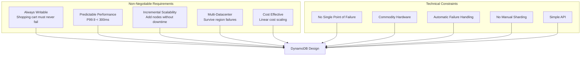

## The Solution Architecture

### Evolution Timeline

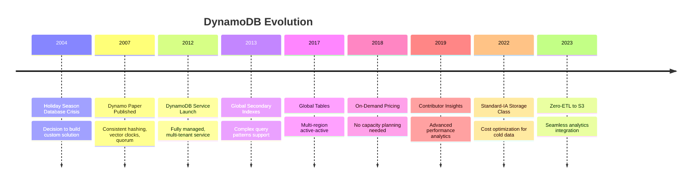

### Core Architecture

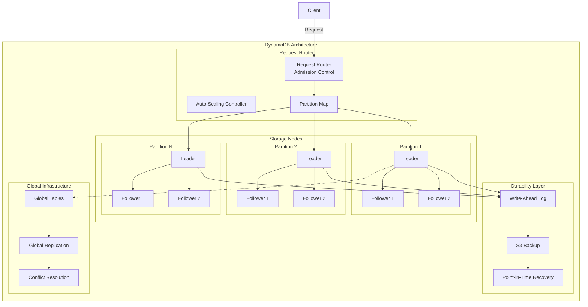

## Key Innovations

### 1. Consistent Hashing with Virtual Nodes

DynamoDB's partition strategy eliminates hotspots:

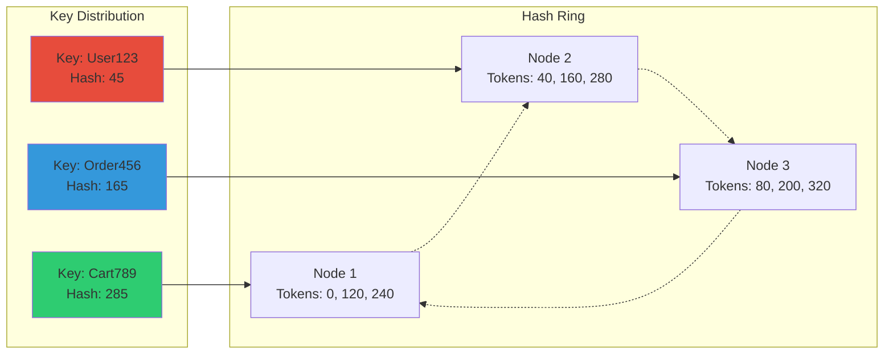

### 2. Multi-Version Concurrency Control (MVCC)

```python
## Simplified version reconciliation
class DynamoDBItem:
    def __init__(self, key, value, version_vector):
        self.key = key
        self.value = value
        self.version = version_vector
    
    def update(self, node_id, new_value):
        # Increment version for updating node
        new_version = self.version.copy()
        new_version[node_id] = new_version.get(node_id, 0) + 1
        return DynamoDBItem(self.key, new_value, new_version)
    
    def conflicts_with(self, other):
        # Check if versions are concurrent (conflicting)
        return not (self.descends_from(other) or other.descends_from(self))
    
    def descends_from(self, other):
        # Check if this version descends from other
        for node, version in other.version.items():
            if self.version.get(node, 0) < version:
                return False
        return True
```

### 3. Adaptive Capacity

DynamoDB automatically handles traffic spikes:

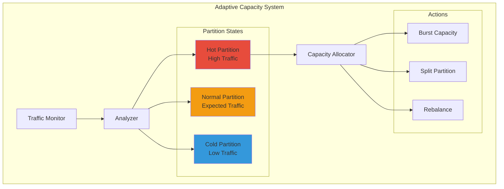

### 4. Global Tables Architecture

Multi-region active-active replication:

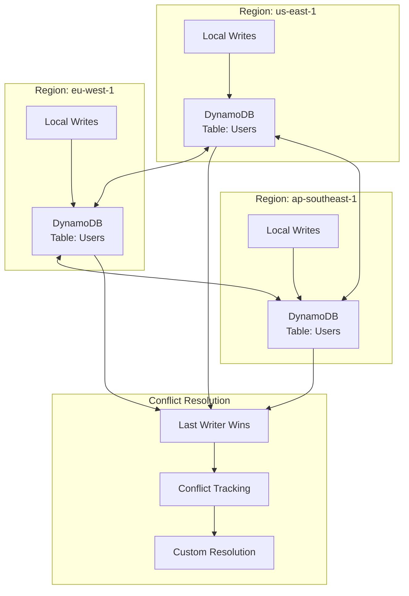

## Technical Deep Dive

### Storage Engine Evolution

| Generation | Technology | Improvement |
|------------|------------|-------------|
| **Gen 1 (2012)** | B-tree on local SSD | Baseline performance |
| **Gen 2 (2014)** | LSM tree with compression | 2x storage efficiency |
| **Gen 3 (2017)** | Partitioned B-tree | 50% latency reduction |
| **Gen 4 (2020)** | Hierarchical storage | 10x cost reduction for cold data |
| **Gen 5 (2023)** | NVMe + Compute offload | 3x throughput increase |

### Write Path Optimization

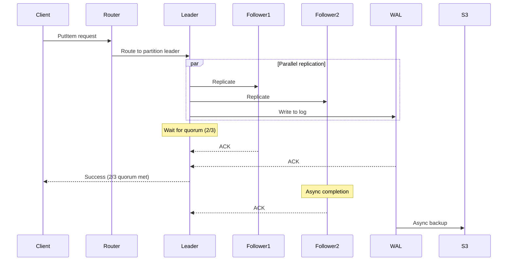

### Performance Characteristics

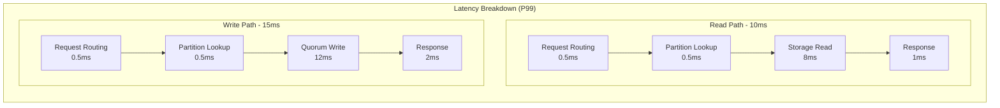

### Auto-Scaling Magic

```python
## Simplified auto-scaling algorithm
class DynamoDBAutoScaler:
    def __init__(self, table):
        self.table = table
        self.metrics_window = 5  # minutes
        self.scale_up_threshold = 0.7
        self.scale_down_threshold = 0.2
        
    def evaluate_scaling(self):
        metrics = self.get_metrics()
        
        for partition in self.table.partitions:
            utilization = metrics[partition].consumed / metrics[partition].provisioned
            
            if utilization > self.scale_up_threshold:
                self.scale_up(partition)
            elif utilization < self.scale_down_threshold:
                self.scale_down(partition)
    
    def scale_up(self, partition):
        # Pre-warm capacity
        new_capacity = partition.capacity * 2
        
        # Instant capacity allocation
        self.allocate_burst_capacity(partition, new_capacity)
        
        # Background partition split if needed
        if new_capacity > partition.max_capacity:
            self.schedule_partition_split(partition)
    
    def scale_down(self, partition):
        # Gradual scale down to avoid thrashing
        new_capacity = max(
            partition.capacity * 0.8,
            partition.min_capacity
        )
        partition.update_capacity(new_capacity)
```

## Lessons Learned

### 1. Simple APIs Enable Complex Systems

DynamoDB's API is deliberately minimal:

| Operation | Purpose | Consistency Options |
|-----------|---------|-------------------|
| **PutItem** | Write single item | Eventually/Strong |
| **GetItem** | Read single item | Eventually/Strong |
| **Query** | Read items by partition key | Eventually/Strong |
| **Scan** | Read all items (avoid!) | Eventually/Strong |
| **BatchWriteItem** | Write up to 25 items | Eventually |
| **TransactWriteItems** | ACID transactions | Strong |

This simplicity enables:
- Predictable performance
- Easy optimization
- Clear capacity planning
- Straightforward debugging

### 2. Multi-Tenancy Requires Isolation

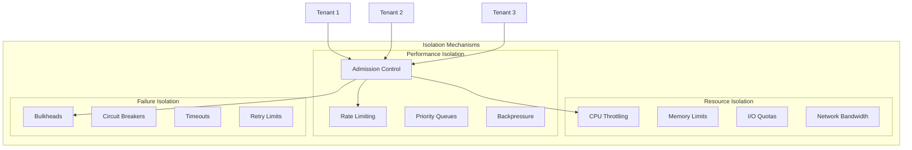

### 3. Operational Excellence at Scale

| Practice | Implementation | Impact |
|----------|----------------|---------|
| **Continuous Verification** | Canary writes/reads every second | Detect issues in < 60s |
| **Automated Remediation** | Self-healing for 95% of issues | Reduce oncall burden |
| **Capacity Forecasting** | ML-based prediction | Prevent 99% of throttles |
| **Deployment Safety** | Cell-based architecture | Limit blast radius |
| **Performance Regression** | Automated benchmarking | Catch slowdowns early |

## What You Can Apply

### Database Design Principles

1. **Partition Everything**
   - Design for infinite scale from day one
   - No global indexes or joins
   - Partition key selection is critical

2. **Embrace Eventual Consistency**
   - Strong consistency only when required
   - Design applications to handle stale reads
   - Use conditional writes for correctness

3. **Plan for Failure**
   - Every component will fail
   - Design for partial availability
   - Automated recovery is mandatory

### Implementation Patterns

```mermaid
graph LR
    subgraph "Access Patterns First"
        AP1[List Access Patterns]
        AP2[Design Partition Keys]
        AP3[Create GSIs]
        AP4[Optimize for Cost]
    end
    
    subgraph "Single Table Design"
        ST1[Combine Entity Types]
        ST2[Overload Attributes]
        ST3[Use Sparse Indexes]
        ST4[Minimize Requests]
    end
    
    subgraph "Performance Optimization"
        PO1[Batch Operations]
        PO2[Parallel Scans]
        PO3[Caching Layer]
        PO4[Write Sharding]
    end
    
    AP1 --> AP2
    AP2 --> AP3
    AP3 --> AP4
    
    AP4 --> ST1
    ST1 --> ST2
    ST2 --> ST3
    ST3 --> ST4
    
    ST4 --> PO1
    PO1 --> PO2
    PO2 --> PO3
    PO3 --> PO4
```

### Migration Strategy

For teams considering DynamoDB:

| Phase | Activities | Duration |
|-------|------------|----------|
| **1. Proof of Concept** | Single table, basic operations | 2 weeks |
| **2. Pilot Application** | Non-critical workload | 1 month |
| **3. Performance Testing** | Load testing, optimization | 2 weeks |
| **4. Production Rollout** | Gradual migration with fallback | 1-3 months |
| **5. Optimization** | Cost and performance tuning | Ongoing |

### Cost Optimization Techniques

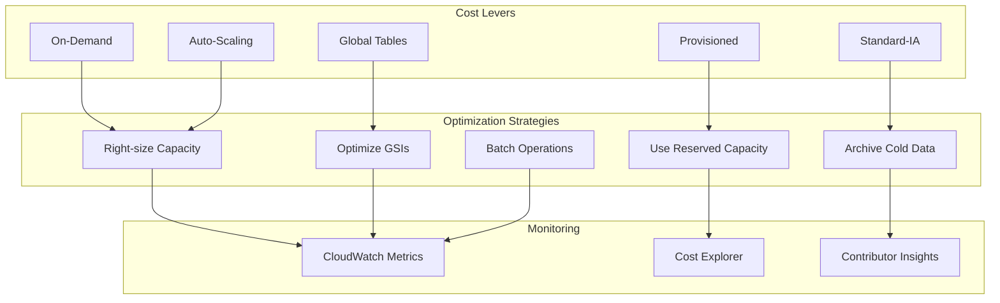

## Conclusion

DynamoDB's evolution from academic paper to planet-scale database demonstrates the power of focusing on fundamental distributed systems principles. By embracing constraints (no joins, no complex queries), Amazon created a database that scales infinitely while maintaining predictable performance. The key insight: in distributed systems, simplicity at the API level enables complexity in implementation, not the other way around.

!!! tip "The DynamoDB Way"
    Start with your access patterns, embrace eventual consistency, design for failure, and let the infrastructure handle the complexity. This is how you build systems that scale to trillions of requests.