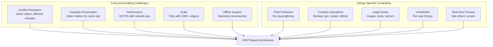
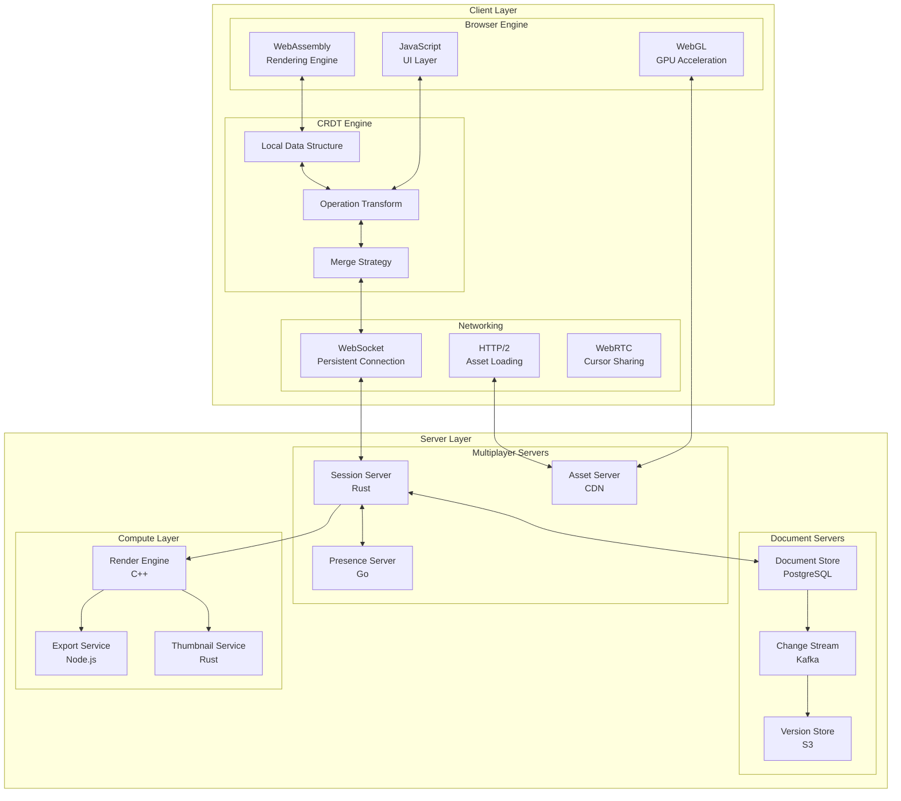
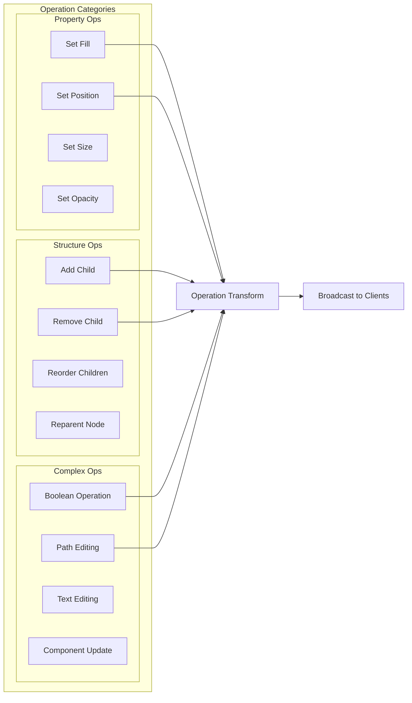
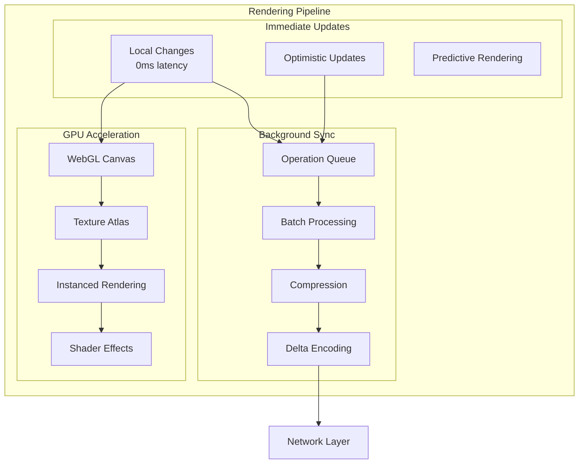
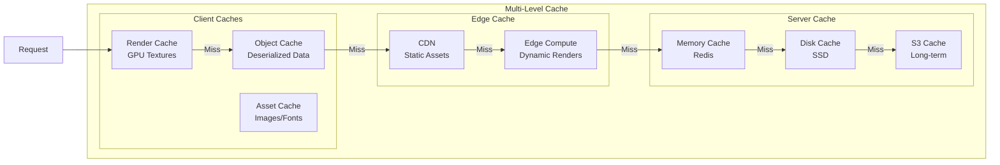
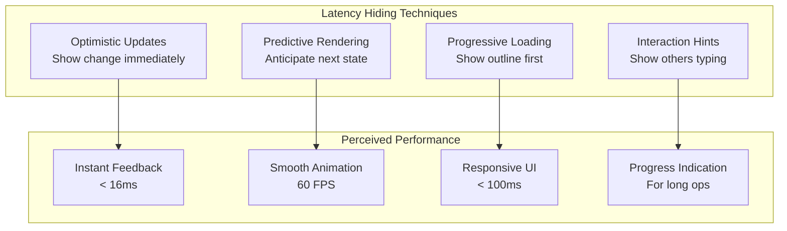

# Figma: CRDTs for Real-Time Design Collaboration

## Executive Summary

Figma revolutionized design collaboration by bringing real-time multiplayer editing to the browser. Using Conflict-free Replicated Data Types (CRDTs) and a sophisticated distributed architecture, Figma enables dozens of designers to work simultaneously on the same file with sub-100ms latency. This case study examines how Figma solved one of the hardest problems in distributed systems: real-time collaborative editing at scale.

!!! success "Key Achievement"
    Figma supports 100+ concurrent editors on a single file with 99.9% consistency, processing millions of operations per second while maintaining 60 FPS performance and sub-100ms global latency.

## The Challenge

### The Design Tool Revolution

Traditional design tools faced critical limitations:

| Problem | Impact |
|---------|---------|
| **File Conflicts** | "Final_final_v2_REALLY_FINAL.sketch" proliferation |
| **Version Control** | No real-time awareness of changes |
| **Collaboration Friction** | Export → Email → Import → Merge workflow |
| **Platform Lock-in** | OS-specific tools limiting team flexibility |
| **Performance** | Large files bringing systems to knees |

### Why Multiplayer Design is Hard



## The Solution Architecture

### High-Level System Design



## Key Innovations

### 1. Custom CRDT Implementation

Figma's CRDT is optimized for design operations:

```typescript
// Simplified Figma CRDT structure
interface FigmaObject {
  id: string;
  type: 'FRAME' | 'TEXT' | 'VECTOR' | 'COMPONENT';
  properties: CRDTMap<string, any>;
  children: CRDTArray<FigmaObject>;
  version: VectorClock;
}

class CRDTMap<K, V> {
  private entries: Map<K, { value: V, clock: VectorClock }>;
  
  set(key: K, value: V, actor: ActorID, clock: VectorClock) {
    const existing = this.entries.get(key);
    
    if (!existing || clock.happenedAfter(existing.clock)) {
      this.entries.set(key, { value, clock });
    } else if (clock.concurrent(existing.clock)) {
      // Deterministic conflict resolution
      const winner = this.resolveConflict(
        { value, clock, actor },
        { value: existing.value, clock: existing.clock }
      );
      this.entries.set(key, winner);
    }
  }
  
  private resolveConflict(a: Entry, b: Entry): Entry {
    // Last-write-wins with actor ID as tiebreaker
    if (a.clock.timestamp > b.clock.timestamp) return a;
    if (b.clock.timestamp > a.clock.timestamp) return b;
    return a.actor > b.actor ? a : b;
  }
}

class CRDTArray<T> {
  private elements: Array<{
    id: string;
    value: T;
    position: FractionalIndex;
    tombstone: boolean;
  }>;
  
  insert(index: number, value: T, actor: ActorID) {
    const position = this.generatePosition(index);
    const id = `${actor}:${Date.now()}:${Math.random()}`;
    
    this.elements.push({
      id,
      value,
      position,
      tombstone: false
    });
    
    this.sort();
  }
  
  private generatePosition(index: number): FractionalIndex {
    // Generate position between neighboring elements
    const before = index > 0 ? this.elements[index - 1].position : MIN_POSITION;
    const after = index < this.elements.length ? this.elements[index].position : MAX_POSITION;
    return FractionalIndex.between(before, after);
  }
}
```

### 2. Operation Types and Transformation



### 3. Multiplayer Presence System

```typescript
// Real-time cursor and selection sharing
class PresenceManager {
  private peers: Map<PeerID, PeerState>;
  private rtcConnections: Map<PeerID, RTCPeerConnection>;
  
  async sharePresence(state: LocalPresence) {
    // Batch updates for efficiency
    const update = {
      cursor: state.cursor,
      selection: state.selection,
      viewport: state.viewport,
      user: state.user,
      timestamp: Date.now()
    };
    
    // Use WebRTC for ultra-low latency
    for (const [peerId, connection] of this.rtcConnections) {
      if (connection.connectionState === 'connected') {
        const channel = connection.dataChannel;
        channel.send(JSON.stringify({
          type: 'presence',
          data: update
        }));
      }
    }
    
    // Fallback to WebSocket for reliability
    this.websocket.send({
      type: 'presence',
      data: update,
      recipients: Array.from(this.peers.keys())
    });
  }
  
  renderPeerCursors() {
    for (const [peerId, state] of this.peers) {
      // Interpolate cursor positions for smoothness
      const interpolated = this.interpolateCursor(
        state.cursor,
        state.timestamp,
        Date.now()
      );
      
      this.renderCursor(interpolated, state.user);
    }
  }
}
```

### 4. Performance Optimization Strategies



## Technical Deep Dive

### Vector Clock Implementation

```rust
// Figma's vector clock for causality tracking
#[derive(Clone, Debug)]
struct VectorClock {
    entries: HashMap<ActorID, u64>,
}

impl VectorClock {
    fn increment(&mut self, actor: ActorID) {
        *self.entries.entry(actor).or_insert(0) += 1;
    }
    
    fn merge(&mut self, other: &VectorClock) {
        for (actor, &timestamp) in &other.entries {
            let entry = self.entries.entry(*actor).or_insert(0);
            *entry = (*entry).max(timestamp);
        }
    }
    
    fn happened_before(&self, other: &VectorClock) -> bool {
        self.entries.iter().all(|(actor, &time)| {
            time <= other.entries.get(actor).copied().unwrap_or(0)
        }) && self != other
    }
    
    fn concurrent(&self, other: &VectorClock) -> bool {
        !self.happened_before(other) && !other.happened_before(self)
    }
}
```

### Fractional Indexing for Lists

```typescript
// Maintain order without reindexing
class FractionalIndex {
  private digits: number[];
  
  static between(a: FractionalIndex, b: FractionalIndex): FractionalIndex {
    const result = [];
    let carry = 0;
    
    for (let i = 0; i < Math.max(a.digits.length, b.digits.length); i++) {
      const digitA = a.digits[i] || 0;
      const digitB = b.digits[i] || BASE;
      
      if (digitA + 1 < digitB) {
        // Found a gap
        result.push(Math.floor((digitA + digitB) / 2));
        break;
      } else {
        // Need to go deeper
        result.push(digitA);
      }
    }
    
    return new FractionalIndex(result);
  }
  
  compareTo(other: FractionalIndex): number {
    for (let i = 0; i < Math.max(this.digits.length, other.digits.length); i++) {
      const a = this.digits[i] || 0;
      const b = other.digits[i] || 0;
      if (a !== b) return a - b;
    }
    return 0;
  }
}
```

### WebAssembly Rendering Engine

```cpp
// High-performance rendering in WASM
class FigmaRenderer {
private:
    std::vector<RenderObject> objects;
    std::unordered_map<ObjectID, uint32_t> texture_cache;
    
public:
    void render_frame(Canvas* canvas) {
        // Sort by z-index and layer hierarchy
        std::sort(objects.begin(), objects.end(), 
            [](const auto& a, const auto& b) {
                return a.z_order < b.z_order;
            }.md);
        
        // Batch by material to minimize state changes
        auto batches = group_by_material(objects);
        
        for (const auto& batch : batches) {
            setup_material(batch.material);
            
            // Use instanced rendering for repeated elements
            if (batch.objects.size() > INSTANCE_THRESHOLD) {
                render_instanced(batch.objects);
            } else {
                for (const auto& obj : batch.objects) {
                    render_object(obj);
                }
            }
        }
        
        // Apply post-processing effects
        apply_blur_effects();
        apply_shadow_effects();
    }
    
    void render_object(const RenderObject& obj) {
        switch (obj.type) {
            case ObjectType::VECTOR:
                render_vector_path(obj);
                break;
            case ObjectType::TEXT:
                render_text_with_cache(obj);
                break;
            case ObjectType::IMAGE:
                render_image_with_atlas(obj);
                break;
        }
    }
};
```

### Intelligent Caching Strategy



## Lessons Learned

### 1. CRDTs Are Not Free

!!! quote "Evan Wallace, Figma CTO"
    "CRDTs gave us eventual consistency, but we had to build our entire architecture around their constraints."

Trade-offs discovered:
- **Memory overhead**: 3-5x compared to simple data structures
- **Computation cost**: O(n log n) for some operations
- **Complexity**: Debugging distributed state is exponentially harder
- **Tombstones**: Deleted items must be retained forever

### 2. Hybrid Approach Works Best

| Operation Type | Consistency Model | Rationale |
|----------------|------------------|-----------|
| **Cursor Movement** | Best-effort (P2P) | Low latency critical |
| **Property Changes** | CRDT | Convergence required |
| **File Operations** | Centralized lock | Avoid corruption |
| **Asset Upload** | Eventually consistent | Size makes sync expensive |
| **Permissions** | Strongly consistent | Security critical |

### 3. Performance Perception Matters



## What You Can Apply

### Building Collaborative Systems

1. **Choose the Right Consistency Model**
   ```typescript
   // Decision framework
   interface ConsistencyDecision {
     isOrderImportant: boolean;      // Use OT or CRDT
     canTolerateConflicts: boolean;   // Use CRDT
     needsImmediateFeedback: boolean; // Use optimistic updates
     hasComplexMerge: boolean;        // Consider centralized
   }
   
   function selectConsistencyModel(requirements: ConsistencyDecision) {
     if (!requirements.canTolerateConflicts) {
       return 'centralized-lock';
     }
     if (requirements.isOrderImportant && requirements.hasComplexMerge) {
       return 'operational-transform';
     }
     if (requirements.needsImmediateFeedback) {
       return 'crdt-with-optimistic';
     }
     return 'pure-crdt';
   }
   ```

2. **Implement Efficient Sync Protocol**
   ```mermaid
   sequenceDiagram
     participant Client
     participant Server
     participant Peers
     
     Client->>Client: Local change
     Client->>Client: Update CRDT
     Client->>Client: Render optimistically
     
     Client->>Server: Send operation
     Server->>Server: Validate operation
     Server->>Server: Update server state
     Server->>Peers: Broadcast to relevant peers
     
     Peers->>Peers: Apply operation
     Peers->>Peers: Resolve conflicts
     Peers->>Client: Send their operations
     
     Client->>Client: Merge peer operations
     Client->>Client: Re-render if needed
   ```

3. **Design for Offline-First**
   ```typescript
   class OfflineManager {
     private operationQueue: Operation[] = [];
     private syncInProgress = false;
     
     async applyOperation(op: Operation) {
       // Always apply locally first
       this.applyLocal(op);
       
       // Queue for sync
       this.operationQueue.push(op);
       
       // Try to sync if online
       if (navigator.onLine && !this.syncInProgress) {
         await this.syncOperations();
       }
     }
     
     private async syncOperations() {
       this.syncInProgress = true;
       
       while (this.operationQueue.length > 0) {
         const batch = this.operationQueue.splice(0, 100);
         
         try {
           await this.sendBatch(batch);
         } catch (error) {
           // Re-queue failed operations
           this.operationQueue.unshift(...batch);
           break;
         }
       }
       
       this.syncInProgress = false;
     }
   }
   ```

### Implementation Checklist

- [ ] **Data Model Design**
  - [ ] Identify convergent operations
  - [ ] Design CRDT-friendly schemas
  - [ ] Plan for tombstone management
  - [ ] Consider operation granularity

- [ ] **Network Architecture**
  - [ ] WebSocket for real-time sync
  - [ ] HTTP/2 for asset delivery
  - [ ] WebRTC for presence data
  - [ ] Fallback mechanisms

- [ ] **Performance Optimization**
  - [ ] Optimistic updates everywhere
  - [ ] Efficient serialization (Protocol Buffers)
  - [ ] Delta compression
  - [ ] Intelligent batching

- [ ] **Conflict Resolution**
  - [ ] Deterministic merge functions
  - [ ] User-friendly conflict UI
  - [ ] Undo/redo per user
  - [ ] Audit trail for changes

- [ ] **Scale Considerations**
  - [ ] Shard by document
  - [ ] Regional server deployment
  - [ ] CDN for static assets
  - [ ] Rate limiting per user

### Common Pitfalls to Avoid

| Pitfall | Impact | Solution |
|---------|---------|----------|
| **Unbounded Growth** | Memory exhaustion | Implement garbage collection for tombstones |
| **Chatty Protocol** | Network saturation | Batch and compress operations |
| **Complex Merges** | CPU bottleneck | Simplify data model or use server-side merge |
| **Lock-in to CRDT** | Limited features | Design hybrid architecture from start |
| **Poor Conflict UX** | User frustration | Show conflicts visually, auto-resolve when possible |

## Conclusion

Figma's success demonstrates that real-time collaboration is achievable even for complex, performance-critical applications. Their innovative use of CRDTs, combined with a carefully crafted architecture that prioritizes user experience, has set a new standard for collaborative software. The key insight: CRDTs are powerful but not magic—success comes from understanding their trade-offs and building an entire system architecture that amplifies their strengths while mitigating their weaknesses.

!!! tip "The Figma Way"
    Start with user experience, design data structures for convergence, optimize relentlessly for performance, and remember that the best distributed system is one users don't notice. This is how you build collaborative tools that feel like magic.