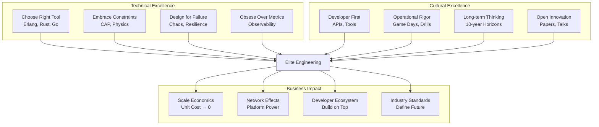
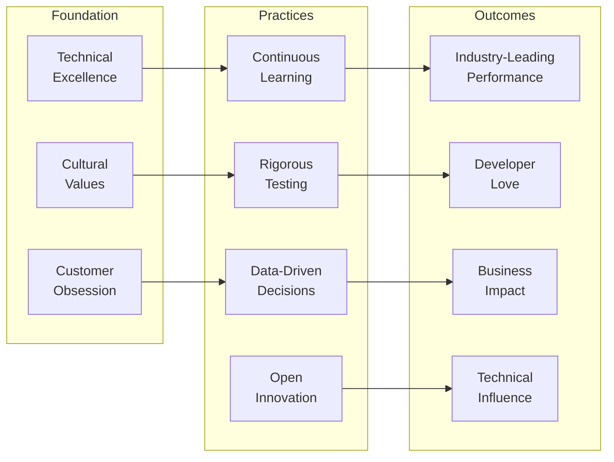

# Elite Engineering Case Studies

## Overview

These case studies examine how the world's top technology companies solved complex distributed systems challenges at massive scale. Each study provides deep technical insights, architectural decisions, and practical lessons you can apply to your own systems.

!!! info "Learning from the Best"
    These companies didn't just solve technical problems—they fundamentally changed how we think about building distributed systems. Their innovations have become industry standards that we all benefit from today.

## Featured Case Studies

### 🎯 [Netflix: Pioneering Chaos Engineering](../../architects-handbook/case-studies/elite-engineering/netflix-chaos.md)
**Scale**: 260M+ subscribers, 15% of global internet bandwidth

How Netflix built systems that embrace failure as a feature, pioneering chaos engineering practices that revolutionized the industry's approach to resilience.

**Key Innovations**:
- Chaos Monkey and the Simian Army
- Failure Injection Testing (FIT) platform
- Zuul edge gateway with circuit breakers
- Hystrix for fault tolerance

---

### 🗄️ [Amazon DynamoDB: From Paper to Planet Scale](amazon-dynamodb-evolution.md)
**Scale**: 10+ trillion requests/day, 89.2M requests/second peak

The evolution from academic Dynamo paper to a database service that redefined what's possible at scale, powering everything from Amazon.com to AWS services.

**Key Innovations**:
- Consistent hashing with virtual nodes
- Multi-version concurrency control
- Adaptive capacity management
- Global tables for multi-region active-active

---

### 🎙️ [Discord: Voice Infrastructure at Scale](discord-voice-infrastructure.md)
**Scale**: 5M+ concurrent voice users, 28ms median latency

How Discord built real-time voice chat that scales to millions while maintaining crystal-clear quality and ultra-low latency globally.

**Key Innovations**:
- Erlang/Elixir for soft real-time systems
- Selective Forwarding Units (SFU) architecture
- Intelligent codec selection
- WebRTC adaptations for scale

---

### 🎨 [Figma: CRDTs for Real-Time Collaboration](../../architects-handbook/case-studies/elite-engineering/figma-crdt-collaboration.md)
**Scale**: 100+ concurrent editors, 60 FPS performance

How Figma uses Conflict-free Replicated Data Types to enable real-time collaborative design with pixel-perfect accuracy and instant updates.

**Key Innovations**:
- Custom CRDT implementation for design ops
- Fractional indexing for ordered lists
- WebAssembly rendering engine
- Hybrid consistency model

---

### 💳 [Stripe: API Excellence at Scale](stripe-api-excellence.md)
**Scale**: 1B+ API requests/day, 99.999% availability

How Stripe created APIs so elegant that developers actually enjoy using them, setting the gold standard for developer experience.

**Key Innovations**:
- Idempotency as first-class concept
- Versioning without breaking changes
- Distributed rate limiting
- Developer experience innovation

## Common Themes Across Elite Engineering

## Key Lessons

### 1. **Architecture Decisions Have Decade-Long Impact**
Every company made fundamental choices early that shaped their entire trajectory:
- Netflix → Microservices before it was cool
- Amazon → Key-value over relational
- Discord → Erlang for concurrency
- Figma → CRDTs for collaboration
- Stripe → API as the product

### 2. **Developer Experience is Competitive Advantage**
The most successful platforms obsess over making developers' lives easier:
- Clear, consistent APIs
- Excellent documentation
- Powerful debugging tools
- Predictable behavior
- Fast feedback loops

### 3. **Operational Excellence is Non-Negotiable**
All these companies invest heavily in:
- Chaos engineering and failure injection
- Comprehensive observability
- Automated recovery
- Regular disaster drills
- Blameless postmortems

### 4. **Scale Changes Everything**
Problems and solutions at scale are fundamentally different:
- O(n²) algorithms become impossible
- Eventual consistency becomes necessary
- Partial failures become normal
- Human intervention doesn't scale

## How to Apply These Lessons

### For Startups
1. **Make bold architectural bets** - Don't just copy, innovate
2. **Invest in developer experience early** - It compounds
3. **Build observability from day one** - You can't fix what you can't see
4. **Practice failure scenarios** - Before they happen in production

### For Scale-ups
1. **Refactor for the next 10x** - Current architecture won't scale
2. **Automate everything** - Humans become the bottleneck
3. **Open source non-differentiating tech** - Focus on core value
4. **Build platforms, not just products** - Enable ecosystem growth

### For Enterprises
1. **Embrace modern architectures** - Legacy will limit you
2. **Invest in engineering culture** - Tools alone aren't enough
3. **Learn from incidents** - Every failure is a teacher
4. **Share knowledge openly** - Rising tide lifts all boats

## The Path to Elite Engineering

## Continue Your Journey

These case studies represent just a glimpse into elite engineering practices. Each company's journey offers countless lessons in building systems that not only scale but define the future of technology.

!!! tip "Your Next Steps"
    1. **Deep dive** into the case study most relevant to your current challenges
    2. **Identify patterns** that could apply to your architecture
    3. **Start small** with one practice or principle
    4. **Measure impact** and iterate based on results
    5. **Share your learnings** with the community

Remember: Elite engineering isn't about copying what others did—it's about understanding the principles behind their decisions and applying them creatively to your unique challenges.