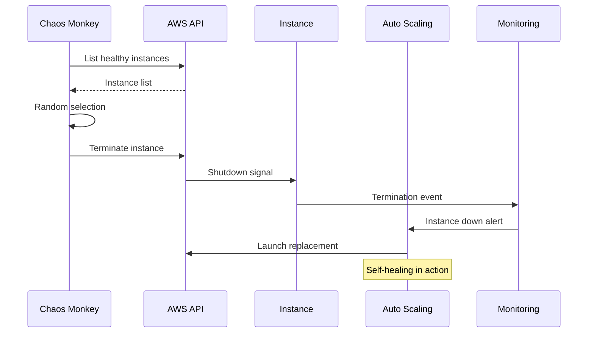
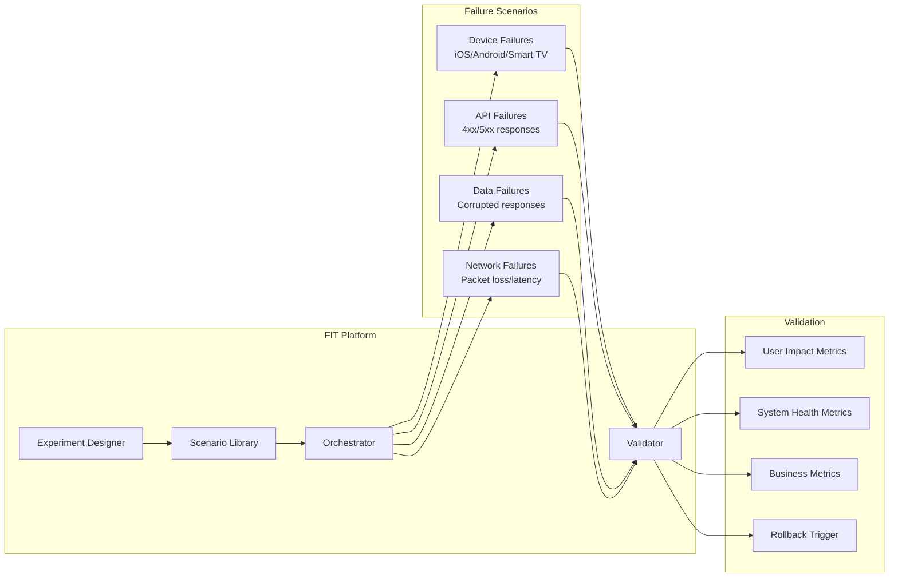
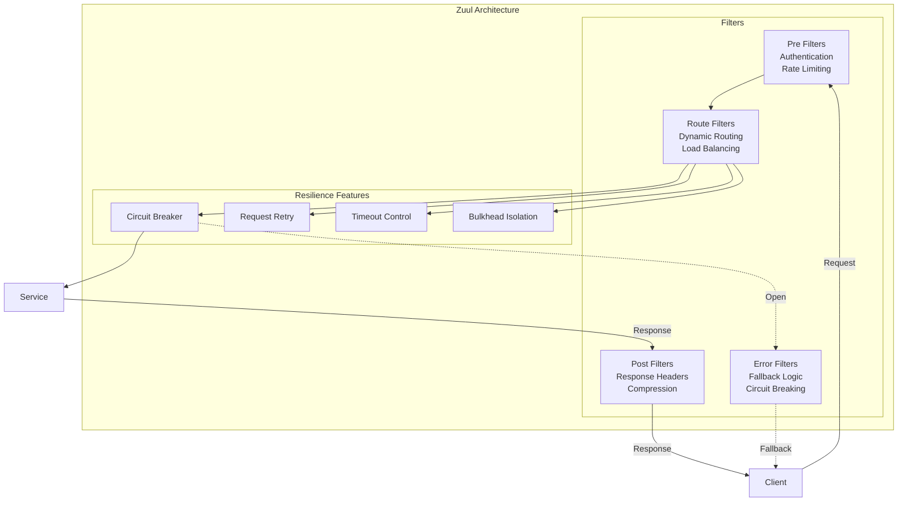
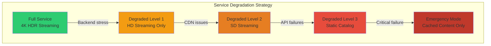
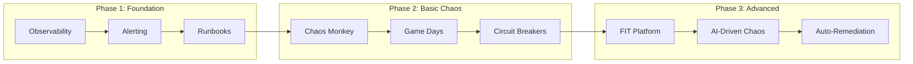

# Netflix: Pioneering Chaos Engineering at Scale

## Executive Summary

Netflix transformed from a DVD rental service to the world's largest streaming platform, serving 260+ million subscribers across 190+ countries. Their journey required pioneering chaos engineering practices that fundamentally changed how the industry thinks about resilience. This case study examines how Netflix built systems that embrace failure as a feature, not a bug.

!!! success "Key Achievement"
    Netflix maintains 99.97% availability while deploying code thousands of times per day across a microservices architecture with 1000+ services.

## Patterns Demonstrated

This case study demonstrates the following distributed systems patterns in production:

### Core Resilience Patterns
- **[Circuit Breaker](../../../pattern-library/resilience/circuit-breaker.md)** - Hystrix prevents cascade failures across 1000+ microservices
- **[Bulkhead](../../../pattern-library/resilience/bulkhead.md)** - Thread pool isolation prevents resource exhaustion
- **[Timeout](../../../pattern-library/resilience/timeout.md)** - Aggressive timeouts prevent resource blocking
- **[Retry with Backoff](../../../pattern-library/resilience/retry-backoff.md)** - Intelligent retry logic for transient failures

### Architecture Patterns
- **[Service Mesh](../../../pattern-library/communication/service-mesh.md)** - Modern implementation of Hystrix patterns
- **[API Gateway](../../../pattern-library/communication/api-gateway.md)** - Zuul provides edge resilience
- **[Load Balancing](../../../pattern-library/scaling/load-balancing.md)** - Ribbon client-side load balancing
- **[Health Checks](../../../pattern-library/resilience/health-check.md)** - Continuous service health monitoring

### Operational Patterns
- **[Chaos Engineering](../../human-factors/chaos-engineering.md)** - Continuous failure injection
- **[Observability](#observability-pattern.md)** - Deep monitoring and tracing
- **[Graceful Degradation](../../../pattern-library/resilience/graceful-degradation.md)** - Multiple service levels
- **[Auto-Scaling](../../../pattern-library/scaling/auto-scaling.md)** - Automatic capacity management

## The Challenge

### Scale Numbers That Matter

| Metric | Scale |
|--------|-------|
| **Peak Traffic** | 15% of global internet bandwidth |
| **Concurrent Streams** | 100+ million |
| **Microservices** | 1,000+ |
| **Daily Deployments** | 4,000+ |
| **AWS Regions** | 20+ |
| **Edge Locations** | 200+ |
| **Data Processed Daily** | 1+ Exabyte |

### The Core Problem

Traditional testing couldn't simulate the complexity of Netflix's distributed system:
- **Cascading failures** across microservices
- **Regional outages** affecting millions
- **Thundering herd** problems during popular releases
- **Complex dependency chains** creating unexpected failure modes

## The Solution Architecture

```mermaid
graph TB
    subgraph "Chaos Engineering Platform"
        CM[Chaos Monkey<br/>Random Instance Termination]
        CK[Chaos Kong<br/>Region Failure Simulation]
        CE[Chaos Engineering<br/>Control Plane]
        
        subgraph "Failure Injection Types"
            FI1[Instance Failures]
            FI2[Network Partitions]
            FI3[Latency Injection]
            FI4[Resource Exhaustion]
            FI5[Data Corruption]
        end
        
        CE --> CM
        CE --> CK
        CE --> FI1
        CE --> FI2
        CE --> FI3
        CE --> FI4
        CE --> FI5
    end
    
    subgraph "Production Environment"
        subgraph "Region A"
            MS1[Microservices]
            MS2[Microservices]
            MS3[Microservices]
        end
        
        subgraph "Region B"
            MS4[Microservices]
            MS5[Microservices]
            MS6[Microservices]
        end
        
        ELB[Edge Load Balancers]
        CDN[CDN Network]
    end
    
    subgraph "Observability"
        M[Metrics Collection]
        A[Alerting System]
        D[Dashboard]
        AI[AI Anomaly Detection]
    end
    
    CM -.-> MS1
    CM -.-> MS2
    CK -.-> Region A
    
    MS1 --> M
    MS2 --> M
    MS3 --> M
    
    M --> A
    M --> D
    M --> AI
    
    A --> CE
    AI --> CE
```

## Key Innovations

### 1. Chaos Monkey (2011)
The original chaos tool that randomly terminates instances in production.



### 2. Simian Army Evolution

| Tool | Purpose | Failure Type |
|------|---------|--------------|
| **Chaos Monkey** | Instance failures | Random EC2 termination |
| **Chaos Kong** | Region failures | Entire AWS region outage |
| **Latency Monkey** | Performance degradation | Artificial delays |
| **Conformity Monkey** | Best practice enforcement | Non-compliant resource shutdown |
| **Doctor Monkey** | Health checking | Unhealthy instance removal |
| **Janitor Monkey** | Resource cleanup | Unused resource deletion |
| **Security Monkey** | Security monitoring | Vulnerability detection |

### 3. Failure Injection Testing (FIT)

Advanced platform for controlled chaos experiments:



## Technical Deep Dive

### Zuul: Resilient Edge Gateway

Netflix's edge gateway handles all incoming traffic with sophisticated failure handling:



### Hystrix: Circuit Breaker Implementation {#circuit-breakers}

!!! info "Pattern Deep Dive"
    This implementation demonstrates the **[Circuit Breaker Pattern](../../../pattern-library/resilience/circuit-breaker.md)** at massive scale, handling 100B+ requests daily across Netflix's microservices.

```java
// Simplified Hystrix command pattern
public class VideoMetadataCommand extends HystrixCommand<VideoMetadata> {
    private final String videoId;
    
    public VideoMetadataCommand(String videoId) {
        super(HystrixCommandGroupKey.Factory.asKey("VideoMetadata"));
        this.videoId = videoId;
    }
    
    @Override
    protected VideoMetadata run() {
        // Primary execution logic
        return videoMetadataService.getMetadata(videoId);
    }
    
    @Override
    protected VideoMetadata getFallback() {
        // Fallback when circuit is open
        return VideoMetadata.getBasicMetadata(videoId);
    }
}

// Configuration
HystrixCommandProperties.Setter()
    .withCircuitBreakerRequestVolumeThreshold(20)
    .withCircuitBreakerSleepWindowInMilliseconds(5000)
    .withCircuitBreakerErrorThresholdPercentage(50)
    .withExecutionTimeoutInMilliseconds(1000)
    .withFallbackIsolationSemaphoreMaxConcurrentRequests(100);
```

**Key Circuit Breaker Metrics at Netflix:**
- **Request Volume**: 100B+ requests/day protected by circuit breakers
- **Failure Threshold**: 50% error rate triggers circuit open
- **Recovery Time**: 5 second sleep window before testing
- **Success Rate**: 99.97% availability maintained

### Chaos Engineering Maturity Model

| Level | Practices | Tools | Culture |
|-------|-----------|-------|---------|
| **1: Ad-hoc** | Manual failure testing | Basic scripts | "Hope nothing breaks" |
| **2: Planned** | Scheduled chaos tests | Chaos Monkey | "Test in staging" |
| **3: Automated** | Continuous chaos | FIT platform | "Test in production" |
| **4: Intelligent** | AI-driven chaos | Adaptive experiments | "Failure as feature" |
| **5: Antifragile** | Self-improving systems | Autonomous healing | "Stronger from stress" |

Netflix operates at Level 4-5, where systems automatically learn from failures.

## Lessons Learned

### 1. Production is the Ultimate Test Environment

!!! quote "Netflix Engineering Principle"
    "The best way to avoid failure is to fail constantly."

- **Staging !== Production**: No staging environment can replicate production complexity
- **Real traffic patterns**: Only production has authentic user behavior
- **Cascading effects**: Failures propagate differently at scale

### 2. Graceful Degradation Over Perfect Availability



### 3. Organizational Resilience

| Principle | Implementation |
|-----------|----------------|
| **Ownership** | Teams own their service's resilience |
| **Game Days** | Regular failure simulation exercises |
| **Blameless Culture** | Learning from failures, not punishing |
| **Resilience Reviews** | Architecture reviews focus on failure modes |
| **Chaos Champions** | Dedicated engineers promoting chaos practices |

## What You Can Apply

### For Startups
1. **Start simple**: Even random container restarts reveal issues
2. **Build observability first**: You can't fix what you can't see
3. **Automate recovery**: Self-healing reduces operational burden
4. **Practice failures**: Regular drills prepare teams

### For Enterprises
1. **Gradual adoption**: Start with read-only services
2. **Executive buy-in**: Frame as risk reduction investment
3. **Metrics-driven**: Measure improvement in MTTR
4. **Cross-team exercises**: Build organizational muscle memory

### Implementation Roadmap



### Key Metrics to Track

| Metric | Definition | Target |
|--------|------------|--------|
| **MTTD** | Mean Time to Detect | < 1 minute |
| **MTTR** | Mean Time to Repair | < 5 minutes |
| **Blast Radius** | % users affected by failure | < 1% |
| **Recovery Success** | % auto-remediation success | > 95% |
| **Chaos Coverage** | % services with chaos tests | > 80% |

## Conclusion

Netflix's chaos engineering journey demonstrates that resilience isn't achieved through preventing failures but by embracing them. Their approach has influenced an entire industry, spawning tools like Gremlin, Litmus, and ChaosBlade. The key insight: in distributed systems, failure is not just possible—it's inevitable. The question is not if your system will fail, but whether it will fail gracefully.

!!! tip "The Netflix Way"
    Build systems that expect failure, detect it quickly, respond automatically, and learn continuously. This is the path to true resilience at scale.