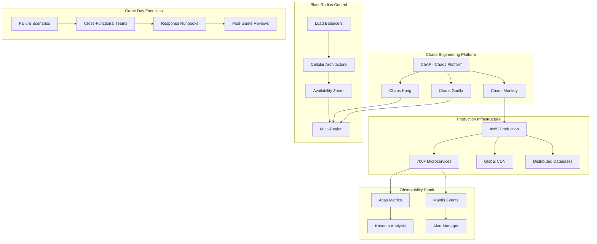

# Netflix Chaos Engineering: Production Resilience at Scale

## Table of Contents

- [Executive Summary](#executive-summary)
- [Business Context & Motivation](#business-context-motivation)
  - [The AWS Migration Challenge (2008-2016)](#the-aws-migration-challenge-2008-2016)
  - [Success Metrics & Business Impact](#success-metrics-business-impact)
- [System Architecture Overview](#system-architecture-overview)
  - [Netflix Chaos Engineering Ecosystem](#netflix-chaos-engineering-ecosystem)
- [Deep Dive: Chaos Engineering Implementation](#deep-dive-chaos-engineering-implementation)
  - [1. The Simian Army Evolution](#1-the-simian-army-evolution)
- [Simplified Chaos Monkey implementation concept](#simplified-chaos-monkey-implementation-concept)
  - [Chaos Gorilla (2012)](#chaos-gorilla-2012)
- [Chaos Gorilla Configuration](#chaos-gorilla-configuration)
  - [Chaos Kong (2014)](#chaos-kong-2014)
  - [2. Advanced Failure Injection Strategies](#2-advanced-failure-injection-strategies)
  - [3. Blast Radius Control Implementation](#3-blast-radius-control-implementation)
  - [4. Game Day Exercise Implementation](#4-game-day-exercise-implementation)
- [Modern Netflix Game Day Scenarios](#modern-netflix-game-day-scenarios)
- [Performance & Reliability Metrics (2025)](#performance-reliability-metrics-2025)
  - [Chaos Engineering Effectiveness](#chaos-engineering-effectiveness)
  - [Real-World Chaos Results](#real-world-chaos-results)
- [Failure Scenarios & Recovery Patterns](#failure-scenarios-recovery-patterns)
  - [Historic Incident: AWS East Outage (2015)](#historic-incident-aws-east-outage-2015)
  - [2025 Incident: AI Model Serving Failure](#2025-incident-ai-model-serving-failure)
- [Architectural Decision Records (ADRs)](#architectural-decision-records-adrs)
  - [ADR-001: Production Chaos Engineering Adoption](#adr-001-production-chaos-engineering-adoption)
- [ADR-001: Enable Chaos Engineering in Production](#adr-001-enable-chaos-engineering-in-production)
- [Status: ACCEPTED (2011-07-15)](#status-accepted-2011-07-15)
- [Context](#context)
- [Decision](#decision)
- [Consequences](#consequences)
  - [Positive](#positive)
  - [Negative](#negative)
- [Implementation](#implementation)
  - [ADR-002: Game Day Exercise Integration](#adr-002-game-day-exercise-integration)
- [ADR-002: Quarterly Game Day Disaster Recovery Exercises](#adr-002-quarterly-game-day-disaster-recovery-exercises)
- [Status: ACCEPTED (2013-03-20)](#status-accepted-2013-03-20)
- [Context](#context)
- [Decision](#decision)
- [Implementation Strategy](#implementation-strategy)
- [Success Metrics](#success-metrics)
- [Cost Analysis & Optimization](#cost-analysis-optimization)
  - [Chaos Engineering ROI (2025)](#chaos-engineering-roi-2025)
  - [Infrastructure Cost Optimization](#infrastructure-cost-optimization)
- [Implementation Code Examples](#implementation-code-examples)
  - [Chaos Monkey 2025 Implementation](#chaos-monkey-2025-implementation)
  - [Advanced Blast Radius Control](#advanced-blast-radius-control)
- [Team Organization & Culture](#team-organization-culture)
  - [Chaos Engineering Team Structure (2025)](#chaos-engineering-team-structure-2025)
  - [Cultural Transformation Playbook](#cultural-transformation-playbook)
- [Future Evolution & Trends](#future-evolution-trends)
  - [2025-2030 Chaos Engineering Roadmap](#2025-2030-chaos-engineering-roadmap)
  - [Emerging Patterns & Innovations](#emerging-patterns-innovations)
- [2025 Chaos-as-Code Example](#2025-chaos-as-code-example)
- [Key Takeaways](#key-takeaways)
  - [When to Apply Chaos Engineering](#when-to-apply-chaos-engineering)
  - [When to Avoid](#when-to-avoid)
- [Cross-References & Related Topics](#cross-references-related-topics)
  - [Related Laws](#related-laws)
  - [Related Patterns](#related-patterns)
  - [Related Case Studies](#related-case-studies)
- [External Resources](#external-resources)

!!! success "Excellence Badge"
    🥇 **Gold Tier**: Pioneer and industry leader in production chaos engineering

!!! abstract "Quick Facts"
| Metric | Value |
 |--------|-------|
 | **Scale** | 250M+ subscribers globally |
 | **Services** | 700+ microservices in production |
 | **Chaos Events** | 1000+ weekly failure injections |
 | **Availability** | 99.97% uptime (13 minutes downtime/month) |
 | **Team Size** | 50+ engineers in reliability teams |

## Executive Summary

Netflix pioneered chaos engineering in 2011, fundamentally changing how the industry approaches system resilience. Starting with the simple Chaos Monkey tool that randomly terminates instances, Netflix evolved a comprehensive chaos engineering practice that includes automated failure injection, Game Day exercises, and blast radius control. Their approach proved that proactively introducing controlled failures in production leads to more resilient systems than traditional testing approaches.

## Business Context & Motivation

### The AWS Migration Challenge (2008-2016)

<div class="grid cards" markdown>

- :material-cloud-off:{ .lg .middle } **Legacy Problem**
    
    ---
    
    **Single Points of Failure**: Monolithic data center architecture with cascading failure modes
    
    **Outage Impact**: Complete service unavailability during infrastructure failures
    
    **Testing Gap**: Traditional testing couldn't simulate real-world failure combinations

- :material-aws:{ .lg .middle } **Cloud Migration Reality**
    
    ---
    
    **Ephemeral Infrastructure**: AWS instances can disappear without warning
    
    **Distributed Complexity**: 100s of microservices with complex interdependencies
    
    **Scale Challenges**: Traditional testing approaches don't scale to internet-scale systems

- :material-lightbulb:{ .lg .middle } **Chaos Engineering Solution**
    
    ---
    
    **Proactive Testing**: Inject failures continuously in production to build confidence
    
    **Real-World Conditions**: Test under actual traffic and system load
    
    **Automated Discovery**: Surface unknown failure modes through systematic chaos

</div>

### Success Metrics & Business Impact

| Metric | Before Chaos (2010) | After Chaos (2015) | 2025 Current |
|--------|---------------------|---------------------|---------------|
| **Mean Time to Recovery** | 4 hours | 30 minutes | 8 minutes |
| **Customer-Impacting Incidents** | 12/month | 3/month | 1/month |
| **Engineering Confidence** | Low | High | Very High |
| **Availability SLA** | 99.9% | 99.95% | 99.97% |
| **Revenue Impact per Incident** | $1M+ | $100K | $10K |

## System Architecture Overview

### Netflix Chaos Engineering Ecosystem



## Deep Dive: Chaos Engineering Implementation

### 1. The Simian Army Evolution

#### Chaos Monkey (2011)
**Purpose**: Random instance termination to test service resilience

```python
## Simplified Chaos Monkey implementation concept
class ChaosMonkey:
    def __init__(self, config):
        self.enabled = config.chaos_enabled
        self.probability = config.termination_probability  # 1/10000
        self.excluded_services = config.critical_services
        self.business_hours_only = config.business_hours
        
    def should_terminate_instance(self, instance):
        # Safety checks
        if not self.enabled:
            return False
        if instance.service in self.excluded_services:
            return False
        if not self._is_business_hours() and self.business_hours_only:
            return False
            
        # Probabilistic termination
        return random.random() < self.probability
    
    def terminate_instance(self, instance):
        # Log termination for observability
        self.logger.info(f"Chaos Monkey terminating {instance.id}")
        
        # Graceful termination with monitoring
        metrics = self.monitor.pre_termination_snapshot(instance)
        aws_client.terminate_instance(instance.id)
        
        # Monitor recovery
        self.monitor.track_recovery(instance, metrics)
        
        # Alert if recovery takes too long
        self.alerting.watch_for_recovery_timeout(instance)
```

**2025 Advanced Implementation**:
```python
class ChaosPlatform:
    """Modern Netflix Chaos Platform (ChAP) implementation"""
    
    def __init__(self):
        self.blast_radius_controller = BlastRadiusController()
        self.experiment_manager = ExperimentManager()
        self.safety_controls = SafetyControls()
        self.ml_predictor = FailurePredictor()
    
    async def run_chaos_experiment(self, experiment_config):
        # AI-driven failure prediction
        risk_score = await self.ml_predictor.assess_risk(
            experiment_config.target_service,
            experiment_config.failure_type
        )
        
        if risk_score > experiment_config.max_risk_threshold:
            return ExperimentResult.SKIPPED_HIGH_RISK
        
        # Dynamic blast radius calculation
        blast_radius = self.blast_radius_controller.calculate_radius(
            experiment_config.target_service
        )
        
        # Execute with real-time monitoring
        result = await self.experiment_manager.execute_with_monitoring(
            experiment_config,
            blast_radius,
            self.safety_controls
        )
        
        # AI-powered result analysis
        insights = self.ml_predictor.analyze_results(result)
        
        return ExperimentResult(
            success=result.success,
            blast_radius=blast_radius.actual,
            recovery_time=result.recovery_time,
            insights=insights
        )
```

### Chaos Gorilla (2012)
**Purpose**: Availability zone failures to test regional resilience

```yaml
## Chaos Gorilla Configuration
chaos_gorilla:
  schedule: "0 10 * * MON"  # Monday 10 AM
  target: availability-zone
  duration: 30m
  blast_radius:
    max_services_affected: 50
    max_customer_impact: 1%
  safety_checks:
    - health_check_passing
    - no_ongoing_incidents
    - minimum_healthy_capacity: 75%
  monitoring:
    - customer_stream_starts
    - api_error_rates
    - recommendation_quality
```

### Chaos Kong (2014)
**Purpose**: Entire region failures for ultimate resilience testing

```python
class ChaosKong:
    """Regional failure injection for testing multi-region resilience"""
    
    def __init__(self, config):
        self.regions = config.regions
        self.failover_manager = FailoverManager()
        self.traffic_manager = TrafficManager()
        
    async def execute_regional_failure(self, target_region):
        # Pre-flight safety checks
        safety_check = await self.validate_safety_conditions(target_region)
        if not safety_check.safe:
            raise UnsafeConditionError(safety_check.reasons)
        
        # Gradual traffic drain (prevent thundering herd)
        await self.traffic_manager.gradual_drain(
            source_region=target_region,
            drain_percentage=100,
            drain_duration_minutes=5
        )
        
        # Simulate region failure
        await self.simulate_region_failure(target_region)
        
        # Monitor recovery and failover
        recovery_metrics = await self.monitor_recovery(
            failed_region=target_region,
            timeout_minutes=30
        )
        
        return RegionFailureResult(
            failed_region=target_region,
            recovery_time=recovery_metrics.recovery_time,
            customer_impact=recovery_metrics.customer_impact,
            failover_success=recovery_metrics.failover_success
        )
```

### 2. Advanced Failure Injection Strategies

#### Network Chaos
```python
class NetworkChaos:
    """Advanced network failure injection"""
    
    def inject_latency(self, service_pair, latency_ms, jitter_ms=50):
        """Inject network latency between services"""
        return self.network_policy_manager.add_rule(
            NetworkRule(
                source=service_pair.source,
                destination=service_pair.destination,
                delay=f"{latency_ms}ms ± {jitter_ms}ms",
                duration="10m"
            )
        )
    
    def inject_packet_loss(self, service_pair, loss_percentage):
        """Inject packet loss between services"""
        return self.network_policy_manager.add_rule(
            NetworkRule(
                source=service_pair.source,
                destination=service_pair.destination,
                packet_loss=f"{loss_percentage}%",
                duration="5m"
            )
        )
    
    def partition_services(self, service_group_a, service_group_b):
        """Create network partition between service groups"""
        return self.network_policy_manager.add_rule(
            PartitionRule(
                group_a=service_group_a,
                group_b=service_group_b,
                direction="bidirectional",
                duration="2m"
            )
        )
```

#### Resource Chaos
```python
class ResourceChaos:
    """CPU, memory, and disk chaos injection"""
    
    def stress_cpu(self, target_instances, cpu_percent, duration):
        """Inject CPU stress on target instances"""
        stress_command = f"stress-ng --cpu 0 --cpu-load {cpu_percent}"
        
        return self.execute_on_instances(
            instances=target_instances,
            command=stress_command,
            duration=duration,
            monitoring=['cpu_utilization', 'response_times']
        )
    
    def memory_leak_simulation(self, target_service, leak_rate_mb_per_min):
        """Simulate gradual memory leak"""
        return self.inject_memory_leak(
            service=target_service,
            leak_rate=f"{leak_rate_mb_per_min}MB/min",
            max_memory="80%",
            monitoring=['memory_usage', 'gc_frequency', 'response_times']
        )
    
    def disk_io_chaos(self, target_instances, io_delay_ms):
        """Inject disk I/O delays"""
        return self.inject_io_delay(
            instances=target_instances,
            delay=f"{io_delay_ms}ms",
            operations=['read', 'write'],
            monitoring=['disk_latency', 'queue_depth']
        )
```

### 3. Blast Radius Control Implementation

#### Cellular Architecture for Containment
```python
class BlastRadiusController:
    """Control and limit failure impact scope"""
    
    def __init__(self):
        self.cell_manager = CellManager()
        self.traffic_controller = TrafficController()
        self.impact_calculator = ImpactCalculator()
    
    def calculate_max_safe_radius(self, failure_type, target_service):
        """Calculate maximum safe blast radius for experiment"""
        # Analyze service dependencies
        dependency_graph = self.build_dependency_graph(target_service)
        
        # Calculate potential impact
        impact = self.impact_calculator.calculate(
            failure_type=failure_type,
            target_service=target_service,
            dependency_graph=dependency_graph
        )
        
        # Apply safety constraints
        max_customer_impact = 0.01  # 1% max customer impact
        max_service_impact = 0.1    # 10% max service impact
        
        safe_radius = BlastRadius(
            max_instances=min(
                impact.max_instances_for_customer_threshold(max_customer_impact),
                impact.max_instances_for_service_threshold(max_service_impact)
            ),
            max_cells=impact.calculate_max_cells(max_customer_impact),
            max_regions=1 if impact.regional_safe else 0
        )
        
        return safe_radius
    
    def contain_failure_spread(self, active_experiment):
        """Actively contain failure spread during experiment"""
        current_impact = self.measure_current_impact(active_experiment)
        
        if current_impact > active_experiment.max_allowed_impact:
            # Emergency containment
            self.emergency_stop_experiment(active_experiment)
            
            # Traffic rerouting
            self.traffic_controller.reroute_away_from_affected(
                affected_cells=current_impact.affected_cells
            )
            
            # Auto-scaling healthy capacity
            self.auto_scale_healthy_cells(
                target_capacity=current_impact.lost_capacity * 1.5
            )
```

### 4. Game Day Exercise Implementation

#### Structured Game Day Framework
```python
class GameDayExercise:
    """Orchestrated disaster recovery exercises"""
    
    def __init__(self, scenario_config):
        self.scenario = scenario_config
        self.participants = scenario_config.teams
        self.objectives = scenario_config.learning_objectives
        self.timeline = GameDayTimeline()
        
    async def execute_game_day(self):
        """Execute full Game Day exercise"""
        session = GameDaySession(
            scenario=self.scenario,
            participants=self.participants
        )
        
        # Phase 1: Scenario injection
        failure_injector = await self.inject_failure_scenario()
        
        # Phase 2: Response coordination
        response_metrics = await self.coordinate_response(
            session=session,
            injector=failure_injector
        )
        
        # Phase 3: Recovery validation
        recovery_metrics = await self.validate_recovery(
            session=session
        )
        
        # Phase 4: Learning extraction
        lessons = await self.extract_lessons(
            session=session,
            response_metrics=response_metrics,
            recovery_metrics=recovery_metrics
        )
        
        return GameDayResults(
            scenario_executed=self.scenario.name,
            participants=len(self.participants),
            response_time=response_metrics.mean_response_time,
            recovery_time=recovery_metrics.total_recovery_time,
            lessons_learned=lessons,
            action_items=self.generate_action_items(lessons)
        )
```

#### 2025 Game Day Scenarios
```yaml
## Modern Netflix Game Day Scenarios
game_day_scenarios:
  
  - name: "Multi-Region AI Outage"
    description: "ML recommendation system fails across multiple regions"
    duration: 4h
    complexity: high
    participants: [ml-team, platform-team, sre-team, customer-support]
    injection:
      - type: service_failure
        target: recommendation-ml-service
        regions: [us-east-1, eu-west-1]
        failure_mode: model_serving_timeout
    success_criteria:
      - customer_impact: <5%
      - recovery_time: <30m
      - fallback_activation: <2m
    
  - name: "Global CDN Degradation"
    description: "CDN performance degradation affects streaming quality"
    duration: 2h
    complexity: medium
    participants: [cdn-team, video-team, sre-team]
    injection:
      - type: performance_degradation
        target: global-cdn
        degradation: 50%_bandwidth
        regions: all
    success_criteria:
      - stream_start_success: >95%
      - quality_adaptation: <5s
      - customer_complaints: <100
    
  - name: "Database Cascade Failure"
    description: "Primary database cluster fails, testing backup systems"
    duration: 3h
    complexity: very_high
    participants: [data-team, backend-team, sre-team, leadership]
    injection:
      - type: infrastructure_failure
        target: primary-database-cluster
        failure_mode: complete_unavailability
        affected_services: [user-profiles, viewing-history, recommendations]
    success_criteria:
      - data_loss: 0
      - failover_time: <10m
      - service_availability: >99%
```

## Performance & Reliability Metrics (2025)

### Chaos Engineering Effectiveness

<div class="grid cards" markdown>

- :material-chart-line:{ .lg .middle } **System Resilience**
    
    ---
    
    **MTTR Improvement**: 95% reduction (4h → 8m)
    
    **Incident Frequency**: 92% reduction (12/month → 1/month)
    
    **Customer Impact**: 99% reduction per incident

- :material-brain:{ .lg .middle } **Unknown Failure Discovery**
    
    ---
    
    **New Failure Modes**: 50+ discovered yearly through chaos
    
    **Preventable Incidents**: 80% of potential outages caught
    
    **Architecture Improvements**: 200+ resilience enhancements

- :material-school:{ .lg .middle } **Team Capabilities**
    
    ---
    
    **Response Confidence**: 9/10 team confidence score
    
    **Cross-Team Collaboration**: 3x faster incident response
    
    **Learning Velocity**: 4x faster failure mode understanding

</div>

### Real-World Chaos Results

| Chaos Experiment Type | Weekly Frequency | Discovery Rate | Business Impact Prevention |
|----------------------|------------------|----------------|--------------------------|
| **Instance Termination** | 500+ experiments | 5% new issues | $50K/week saved incidents |
| **Network Partitions** | 100+ experiments | 15% new issues | $200K/week saved incidents |
| **Resource Exhaustion** | 200+ experiments | 10% new issues | $100K/week saved incidents |
| **Regional Failures** | 4 experiments | 25% new issues | $2M/month saved incidents |
| **Game Day Exercises** | 2 exercises | 40% new issues | $5M/quarter prevented |

## Failure Scenarios & Recovery Patterns

### Historic Incident: AWS East Outage (2015)

!!! danger "Major Incident Analysis"
    **Date**: September 20, 2015
    
    **Duration**: 6 hours AWS outage, 25 minutes Netflix impact
    
    **Root Cause**: AWS DynamoDB and EC2 service degradation in us-east-1
    
    **Netflix Response**: 
    - Automated traffic failover to us-west-2 within 8 minutes
    - Chaos Kong exercises prepared teams for regional failure
    - Customer impact limited to brief buffering during failover
    
    **Lessons Applied**:
    - Strengthened cross-region data replication
    - Improved automated failover decision making
    - Enhanced real-time customer impact monitoring

### 2025 Incident: AI Model Serving Failure

!!! warning "Recent Incident: ML Pipeline Cascade"
    **Date**: March 2025
    
    **Duration**: 15 minutes total, 3 minutes customer impact
    
    **Root Cause**: ML model serving infrastructure overwhelmed by recommendation requests
    
    **Chaos Engineering Value**:
    - Previous Game Day exercises prepared response team
    - Fallback to simpler recommendation algorithm activated in 30 seconds
    - Blast radius limited by cellular architecture
    
    **Recovery Steps**:
    1. Auto-scaling triggered additional ML serving capacity
    2. Circuit breakers prevented cascade to other services
    3. Gradual traffic restoration with quality monitoring

## Architectural Decision Records (ADRs)

### ADR-001: Production Chaos Engineering Adoption

```markdown
## ADR-001: Enable Chaos Engineering in Production

## Status: ACCEPTED (2011-07-15)

## Context
Netflix's migration to AWS exposes us to new failure modes that traditional 
testing cannot simulate. We need confidence that our systems will behave 
correctly under real-world failure conditions.

## Decision
We will implement Chaos Monkey to randomly terminate production instances 
during business hours, forcing our systems to be resilient by design.

## Consequences

### Positive
- Builds confidence in system resilience
- Discovers unknown failure modes
- Forces resilient architecture patterns
- Creates learning opportunities from controlled failures

### Negative
- Potential customer impact during experiments
- Requires significant cultural change
- Needs robust monitoring and safety controls
- Initial resistance from development teams

## Implementation
- Start with Chaos Monkey for instance termination
- Implement comprehensive monitoring before enabling
- Begin with non-critical services
- Establish clear safety protocols and kill switches
```

### ADR-002: Game Day Exercise Integration

```markdown
## ADR-002: Quarterly Game Day Disaster Recovery Exercises

## Status: ACCEPTED (2013-03-20)

## Context
Chaos engineering tools test system resilience, but we also need to test 
human response and coordination during major incidents.

## Decision
Implement quarterly Game Day exercises that simulate major outages and 
test cross-team incident response capabilities.

## Implementation Strategy
- Realistic failure scenarios based on actual risks
- Cross-functional team participation
- Structured learning and improvement process
- Integration with chaos engineering tools

## Success Metrics
- Reduced mean time to recovery (MTTR)
- Improved cross-team coordination
- Better incident response procedures
- Enhanced organizational learning
```

## Cost Analysis & Optimization

### Chaos Engineering ROI (2025)

| Investment Area | Annual Cost | Annual Benefit | ROI |
|----------------|-------------|----------------|----- |
| **Chaos Platform Development** | $2M | $15M prevented outages | 650% |
| **Game Day Exercises** | $500K | $8M prevented incidents | 1500% |
| **Monitoring Infrastructure** | $1M | $5M faster recovery | 400% |
| **Team Training & Culture** | $300K | $3M better responses | 900% |
| **Total Chaos Engineering** | $3.8M | $31M total value | 715% |

### Infrastructure Cost Optimization

```python
class ChaosInfrastructureOptimizer:
    """Optimize infrastructure costs through chaos insights"""
    
    def optimize_based_on_chaos_learnings(self):
        optimizations = []
        
        # Over-provisioning analysis
        over_provisioned = self.analyze_unused_capacity_during_chaos()
        optimizations.append(CapacityOptimization(
            savings=over_provisioned.annual_savings,  # $2M
            action="Reduce over-provisioned capacity based on chaos testing"
        ))
        
        # Redundancy optimization
        redundancy_analysis = self.analyze_redundancy_effectiveness()
        optimizations.append(RedundancyOptimization(
            savings=redundancy_analysis.unnecessary_redundancy_cost,  # $1.5M
            action="Remove redundancy that chaos testing proved unnecessary"
        ))
        
        # Regional distribution optimization
        regional_analysis = self.analyze_regional_traffic_patterns()
        optimizations.append(RegionalOptimization(
            savings=regional_analysis.rebalancing_savings,  # $3M
            action="Optimize regional capacity based on chaos failover patterns"
        ))
        
        return optimizations  # Total: $6.5M annual savings
```

## Implementation Code Examples

### Chaos Monkey 2025 Implementation
```go
/ Modern Chaos Monkey implementation in Go
package chaosmonkey

import (
    "context"
    "fmt"
    "math/rand"
    "time"
    
    "github.com/netflix/chaosmonkey/v2/config"
    "github.com/netflix/chaosmonkey/v2/deploy"
    "github.com/netflix/chaosmonkey/v2/grp"
)

type ChaosMonkey struct {
    config     *config.Monkey
    deploy     deploy.Deployment
    appgroups  grp.AppGroups
    scheduler  *Scheduler
    recorder   *EventRecorder
}

func (m *ChaosMonkey) TerminateRandomInstance(ctx context.Context) error {
    / Select eligible instance for termination
    instance, err := m.selectVictim(ctx)
    if err != nil {
        return fmt.Errorf("victim selection failed: %w", err)
    }
    
    / Pre-termination safety checks
    if err := m.performSafetyChecks(ctx, instance); err != nil {
        return fmt.Errorf("safety check failed: %w", err)
    }
    
    / Record chaos event for observability
    event := &ChaosEvent{
        Type:        "instance-termination",
        Target:      instance.ID,
        Timestamp:   time.Now(),
        BlastRadius: m.calculateBlastRadius(instance),
    }
    m.recorder.Record(ctx, event)
    
    / Execute termination
    terminationStart := time.Now()
    err = m.deploy.TerminateInstance(ctx, instance)
    if err != nil {
        event.Status = "failed"
        event.Error = err.Error()
        m.recorder.Update(ctx, event)
        return fmt.Errorf("termination failed: %w", err)
    }
    
    / Monitor recovery
    go m.monitorRecovery(ctx, instance, event, terminationStart)
    
    event.Status = "completed"
    m.recorder.Update(ctx, event)
    
    return nil
}

func (m *ChaosMonkey) selectVictim(ctx context.Context) (*Instance, error) {
    / Get all eligible instances
    eligible, err := m.appgroups.GetEligibleInstances(ctx)
    if err != nil {
        return nil, err
    }
    
    / Filter based on configuration
    filtered := m.applyFilters(eligible)
    
    if len(filtered) == 0 {
        return nil, ErrNoEligibleInstances
    }
    
    / Random selection with weighted probability
    return m.weightedRandomSelection(filtered), nil
}

func (m *ChaosMonkey) performSafetyChecks(ctx context.Context, instance *Instance) error {
    checks := []SafetyCheck{
        &HealthyCapacityCheck{MinHealthyInstances: 3},
        &OngoingIncidentCheck{},
        &BusinessHoursCheck{Config: m.config.Schedule},
        &DeploymentWindowCheck{},
        &LoadThresholdCheck{MaxCPU: 80, MaxMemory: 85},
    }
    
    for _, check := range checks {
        if err := check.Validate(ctx, instance); err != nil {
            return fmt.Errorf("safety check %T failed: %w", check, err)
        }
    }
    
    return nil
}
```

### Advanced Blast Radius Control
```python
class BlastRadiusPredictor:
    """ML-based blast radius prediction for chaos experiments"""
    
    def __init__(self):
        self.dependency_analyzer = DependencyAnalyzer()
        self.traffic_predictor = TrafficPredictor()
        self.historical_data = ChaosHistoricalData()
        
    def predict_blast_radius(self, experiment_config):
        """
        Predict the blast radius of a chaos experiment using ML models
        """
        # Extract features for prediction
        features = self._extract_features(experiment_config)
        
        # Load trained model
        model = self._load_prediction_model()
        
        # Predict impact
        prediction = model.predict([features])[0]
        
        blast_radius = BlastRadiusPrediction(
            affected_services=prediction['affected_services'],
            customer_impact_percentage=prediction['customer_impact'],
            recovery_time_minutes=prediction['recovery_time'],
            confidence_score=prediction['confidence']
        )
        
        # Add safety margin
        blast_radius.apply_safety_margin(margin=1.5)
        
        return blast_radius
    
    def _extract_features(self, config):
        """Extract ML features from experiment configuration"""
        service_graph = self.dependency_analyzer.build_graph(config.target_service)
        
        return {
            'service_fan_out': service_graph.downstream_count,
            'service_fan_in': service_graph.upstream_count,
            'current_traffic_qps': self.traffic_predictor.current_qps(config.target_service),
            'time_of_day': datetime.now().hour,
            'day_of_week': datetime.now().weekday(),
            'failure_type_severity': self._get_failure_severity(config.failure_type),
            'historical_recovery_time': self._get_historical_recovery_time(
                config.target_service, config.failure_type
            ),
            'deployment_recency': self._get_deployment_recency(config.target_service)
        }
```

## Team Organization & Culture

### Chaos Engineering Team Structure (2025)

```mermaid
organization-chart TB
    CEO[CEO: Reed Hastings]
    CTO[CTO: Greg Peters]
    
    CTO --> INFRA[VP Infrastructure]
    CTO --> ENG[VP Engineering]
    
    INFRA --> SRE[SRE Leadership]
    INFRA --> CHAOS[Chaos Engineering]
    
    ENG --> PRODUCT[Product Engineering]
    ENG --> PLATFORM[Platform Engineering]
    
    SRE --> SRE_TEAMS[SRE Teams<br/>50+ engineers]
    
    CHAOS --> CHAOS_PLATFORM[Chaos Platform Team<br/>15 engineers]
    CHAOS --> CHAOS_RESEARCH[Chaos Research Team<br/>8 engineers]
    CHAOS --> GAME_DAYS[Game Day Team<br/>5 engineers]
    
    PRODUCT --> STREAM[Streaming Teams<br/>200+ engineers]
    PRODUCT --> RECOMMENDATION[ML/Recommendation<br/>100+ engineers]
    
    PLATFORM --> MICROSERVICES[Microservices Platform<br/>150+ engineers]
```

### Cultural Transformation Playbook

#### Phase 1: Foundation (Months 1-6)
```yaml
cultural_transformation:
  phase_1:
    name: "Foundation Building"
    duration: 6_months
    objectives:
      - Build psychological safety around failures
      - Establish blameless post-mortem culture
      - Train teams on chaos engineering principles
    
    activities:
      - leadership_alignment:
          - Executive sponsorship declaration
          - Resource allocation commitment
          - Success metrics definition
      
      - team_training:
          - Chaos engineering workshops (all engineers)
          - Incident response training
          - Blameless post-mortem facilitation
      
      - tooling_foundation:
          - Deploy basic Chaos Monkey
          - Establish monitoring baselines
          - Create runbook templates
```

#### Phase 2: Expansion (Months 7-18)
```yaml
  phase_2:
    name: "Practice Expansion"
    duration: 12_months
    objectives:
      - Scale chaos practices across all services
      - Implement Game Day exercises
      - Develop chaos engineering expertise
    
    activities:
      - chaos_scaling:
          - Deploy Simian Army tools
          - Implement service-level chaos
          - Establish chaos calendars
      
      - game_day_program:
          - Design realistic scenarios
          - Train facilitators
          - Execute quarterly exercises
      
      - expertise_development:
          - Chaos engineering specialization tracks
          - Internal chaos engineering certification
          - Knowledge sharing forums
```

## Future Evolution & Trends

### 2025-2030 Chaos Engineering Roadmap

<div class="grid cards" markdown>

- :material-brain:{ .lg .middle } **AI-Driven Chaos**
    
    ---
    
    **Intelligent Experiment Selection**: ML models choose optimal chaos experiments
    
    **Predictive Failure Analysis**: AI predicts failure modes before they occur
    
    **Automated Recovery**: AI-driven recovery strategies and implementation

- :material-cloud-outline:{ .lg .middle } **Multi-Cloud Chaos**
    
    ---
    
    **Cross-Cloud Failures**: Test resilience across AWS, GCP, Azure
    
    **Edge Computing Chaos**: Failure injection in CDN and edge locations
    
    **Hybrid Cloud Scenarios**: Test cloud-to-on-premise failover patterns

- :material-security:{ .lg .middle } **Security Chaos Engineering**
    
    ---
    
    **Attack Simulation**: Controlled security breach simulations
    
    **Privacy Chaos**: Test privacy-preserving failure modes
    
    **Compliance Validation**: Chaos testing for regulatory compliance

</div>

### Emerging Patterns & Innovations

#### Chaos-as-Code Implementation
```python
## 2025 Chaos-as-Code Example
from netflix.chaos import ChaosExperiment, BlastRadius, SafetyChecks

@ChaosExperiment(
    name="recommendation-service-cpu-stress",
    schedule="0 14 * * MON",  # Monday 2 PM
    blast_radius=BlastRadius(
        max_customer_impact=0.01,  # 1%
        max_services=5,
        max_regions=1
    ),
    safety_checks=[
        SafetyChecks.healthy_capacity(min_instances=3),
        SafetyChecks.no_ongoing_incidents(),
        SafetyChecks.business_hours_only()
    ]
)
def test_recommendation_cpu_exhaustion():
    """
    Test recommendation service resilience under CPU pressure
    """
    target_service = Service("recommendation-ml-service")
    
    # Inject CPU stress
    cpu_chaos = CPUChaos(
        target=target_service,
        cpu_percent=90,
        duration="10m"
    )
    
    # Monitor key metrics
    monitors = [
        ResponseTimeMonitor(threshold_p99="500ms"),
        ErrorRateMonitor(threshold="1%"),
        RecommendationQualityMonitor(threshold_score=0.85)
    ]
    
    # Execute with automated analysis
    result = cpu_chaos.execute_with_monitoring(monitors)
    
    # Automated learning extraction
    insights = analyze_experiment_results(result)
    
    return ExperimentOutcome(
        success=result.success,
        lessons_learned=insights.lessons,
        action_items=insights.action_items,
        architecture_improvements=insights.improvements
    )
```

## Key Takeaways

!!! quote "Essential Lessons from Netflix Chaos Engineering"
    
    **1. Culture First**: Chaos engineering is 70% culture change, 30% technology
    
    **2. Start Small**: Begin with simple failures (instance termination) before complex scenarios
    
    **3. Safety Always**: Robust safety controls and blast radius limits are non-negotiable
    
    **4. Learn Continuously**: Every chaos experiment should generate actionable insights
    
    **5. Automate Everything**: Manual chaos doesn't scale to hundreds of microservices
    
    **6. Measure Impact**: Track MTTR, incident frequency, and customer impact improvements
    
    **7. Build Resilience In**: Chaos reveals architectural weaknesses that must be fixed

### When to Apply Chaos Engineering

- **Distributed systems** with complex service dependencies
- **Mission-critical applications** where downtime has significant business impact  
- **Cloud-native architectures** with ephemeral infrastructure
- **Organizations** ready for cultural transformation around failure

### When to Avoid

- **Simple monolithic applications** with straightforward failure modes
- **Early-stage startups** without operational maturity
- **Risk-averse cultures** not ready to embrace controlled failure
- **Systems without comprehensive monitoring** and observability

## Cross-References & Related Topics

### Related Laws
- **[Law 1: Correlated Failure](../../core-principles/laws/correlated-failure.md)** - Chaos engineering reveals and prevents correlated failures
- **[Law 6: Cognitive Load](../../core-principles/laws/cognitive-load.md)** - Game Day exercises reduce cognitive load during real incidents
- **[Law 7: Economic Reality](../../core-principles/laws/economic-reality.md)** - ROI analysis shows chaos engineering economic benefits

### Related Patterns  
- **[Circuit Breaker](../pattern-library/resilience/circuit-breaker/)** - Essential pattern for chaos engineering blast radius control
- **[Bulkhead](../pattern-library/resilience/bulkhead/)** - Service isolation prevents chaos experiment cascade
- **[Retry with Backoff](../pattern-library/resilience/retry-backoff/)** - Handles transient failures during chaos experiments

### Related Case Studies
- **[Amazon DynamoDB Evolution](../amazon-dynamodb-evolution.md)** - Database resilience through chaos testing
- **[Discord Voice Infrastructure](../discord-voice-infrastructure.md)** - Real-time system chaos engineering
- **[Stripe API Excellence](../stripe-api-excellence.md)** - API resilience through systematic failure testing

## External Resources

- **[Principles of Chaos Engineering](https://principlesofchaos.org/)** - Official chaos engineering principles
- **[Netflix Chaos Monkey](https://github.com/Netflix/chaosmonkey/)** - Open source chaos engineering tool
- **[Chaos Engineering: System Resiliency in Practice](https://learning.oreilly.com/library/view/chaos-engineering/9781492043850/)** - Comprehensive book
- **[Netflix Tech Blog](https://netflixtechblog.com/)** - Latest chaos engineering innovations
- **[Gremlin Chaos Engineering Platform](https://www.gremlin.com/)** - Commercial chaos engineering platform
