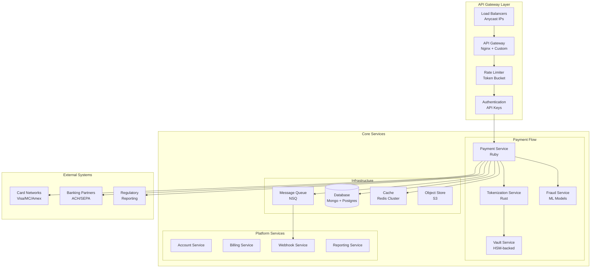
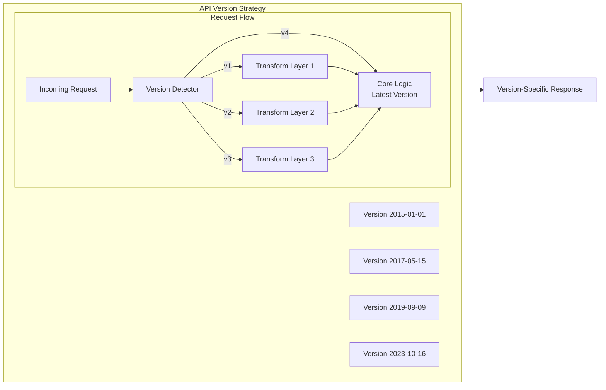
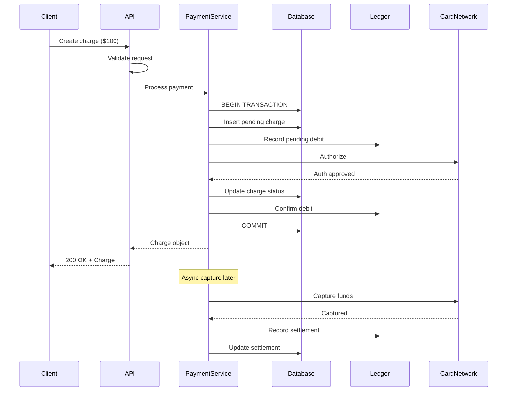
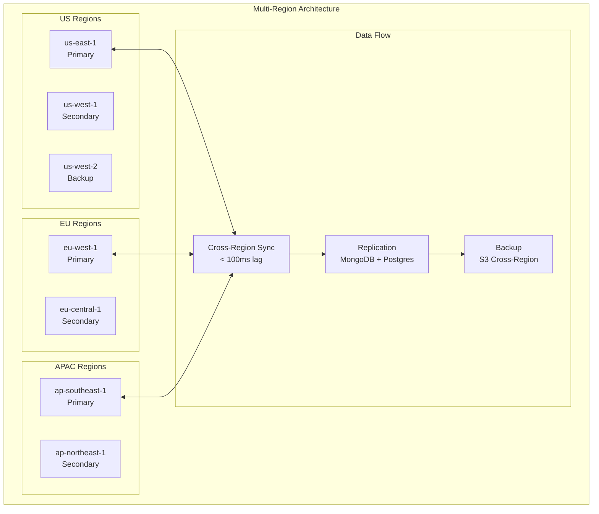
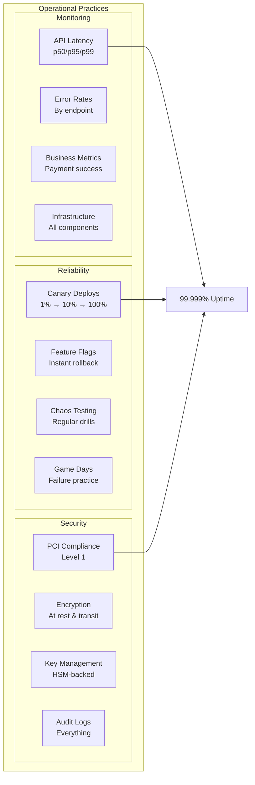
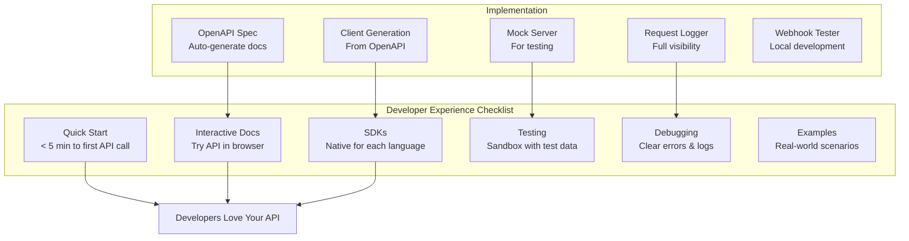

# Stripe: Building the Gold Standard for APIs

## Executive Summary

Stripe transformed the payments industry by creating APIs so elegant that developers actually enjoy working with them. Processing hundreds of billions of dollars annually across millions of businesses, Stripe's distributed systems handle extreme scale while maintaining the developer experience that made them famous. This case study examines how Stripe built APIs that became the gold standard for the industry.

!!! success "Key Achievement"
    Stripe processes 1+ billion API requests per day with 99.999% availability, sub-100ms median latency, and maintains backward compatibility across 8+ years of API versions.

## The Challenge

### The Payments Industry Nightmare

Before Stripe, accepting payments online was a developer's worst nightmare:

| Problem | Developer Pain |
|---------|----------------|
| **Complex Integration** | Weeks to implement basic payments |
| **Poor Documentation** | Outdated PDFs, unclear examples |
| **Testing Nightmare** | No sandbox, real credit cards required |
| **Opaque Pricing** | Hidden fees, complex contracts |
| **Terrible APIs** | SOAP/XML, inconsistent responses |
| **Global Complexity** | Every country different requirements |

### Technical Challenges at Scale


## The Solution Architecture

### System Overview



## Key Innovations

### 1. Idempotency as a First-Class Concept

```ruby
# Every API request can include an idempotency key
class PaymentProcessor
  def create_charge(params, idempotency_key: nil)
    # Check if we've seen this key before
    if idempotency_key
      cached = IdempotencyCache.get(idempotency_key)
      return cached if cached && !cached.expired?
    end
    
    # Process the payment
    result = DB.transaction do
      # Record idempotency key first
      IdempotencyRecord.create!(
        key: idempotency_key,
        request_params: params,
        status: 'processing'
      )
      
      # Execute payment
      charge = process_payment(params)
      
      # Update idempotency record
      IdempotencyRecord.update!(
        key: idempotency_key,
        response: charge.to_json,
        status: 'completed'
      )
      
      charge
    end
    
    # Cache for fast retrieval
    IdempotencyCache.set(idempotency_key, result, expires_in: 24.hours)
    result
  end
end
```

### 2. Versioning Without Breaking Changes



### 3. Real-Time Event System

```typescript
// Stripe's webhook system for real-time updates
interface WebhookEvent {
  id: string;
  type: EventType;
  created: number;
  livemode: boolean;
  data: {
    object: any;
    previous_attributes?: any;
  };
}

class WebhookDeliverySystem {
  async deliverEvent(event: WebhookEvent, endpoint: WebhookEndpoint) {
    const payload = JSON.stringify(event);
    const signature = this.computeSignature(payload, endpoint.secret);
    
    const delivery = await this.attemptDelivery({
      url: endpoint.url,
      headers: {
        'Stripe-Signature': signature,
        'Stripe-Version': endpoint.api_version,
        'Content-Type': 'application/json'
      },
      body: payload,
      timeout: 20_000, // 20 seconds
      retries: 3,
      backoff: 'exponential'
    });
    
    // Record delivery attempt
    await this.recordDelivery({
      event_id: event.id,
      endpoint_id: endpoint.id,
      response_status: delivery.status,
      response_body: delivery.body,
      duration_ms: delivery.duration,
      attempt_number: delivery.attempts
    });
    
    // Automatic retry with exponential backoff
    if (!delivery.success) {
      await this.scheduleRetry(event, endpoint, delivery.attempts);
    }
  }
  
  private async scheduleRetry(event: WebhookEvent, endpoint: WebhookEndpoint, attempts: number) {
    const delays = [5, 30, 300, 1800, 7200, 18000, 36000]; // seconds
    const delay = delays[Math.min(attempts, delays.length - 1)];
    
    await MessageQueue.enqueue({
      job: 'webhook_retry',
      data: { event_id: event.id, endpoint_id: endpoint.id },
      run_at: Date.now() + (delay * 1000)
    });
  }
}
```

### 4. Developer Experience Innovation

```mermaid
graph TD
    subgraph "Developer Tools"
        subgraph "Testing"
            TEST[Test Mode]
            CARDS[Test Card Numbers]
            WEBHK[Webhook Testing]
            CLI[Stripe CLI]
        end
        
        subgraph "Documentation"
            API[API Reference]
            GUIDE[Integration Guides]
            EXAMPLE[Code Examples]
            RECIPE[Recipes]
        end
        
        subgraph "Libraries"
            RUBY[Ruby Gem]
            NODE[Node.js]
            PYTHON[Python]
            GO[Go]
            LANG[20+ Languages]
        end
        
        subgraph "Debugging"
            LOGS[Request Logs]
            EVENTS[Event Stream]
            DEBUG[Debug Mode]
            TRACE[Request Tracing]
        end
    end
    
    TEST --> Experience[World-Class DX]
    API --> Experience
    RUBY --> Experience
    LOGS --> Experience
```



## Technical Deep Dive

### Distributed Rate Limiting

```go
// Stripe's distributed rate limiting implementation
type RateLimiter struct {
    redis    *redis.Client
    window   time.Duration
    maxReqs  int
}

func (rl *RateLimiter) AllowRequest(apiKey string, cost int) (bool, RateLimitInfo) {
    now := time.Now()
    windowStart := now.Truncate(rl.window)
    key := fmt.Sprintf("rate_limit:%s:%d", apiKey, windowStart.Unix())
    
    // Use Redis pipeline for atomic operations
    pipe := rl.redis.Pipeline()
    
    // Increment counter
    incrCmd := pipe.IncrBy(context.Background(), key, int64(cost))
    
    // Set expiry on first write
    pipe.Expire(context.Background(), key, rl.window*2)
    
    // Execute pipeline
    _, err := pipe.Exec(context.Background())
    if err != nil {
        // Fail open - allow request on Redis failure
        return true, RateLimitInfo{Allowed: true}
    }
    
    count := incrCmd.Val()
    remaining := max(0, rl.maxReqs - int(count))
    
    info := RateLimitInfo{
        Limit:     rl.maxReqs,
        Remaining: remaining,
        Reset:     windowStart.Add(rl.window).Unix(),
        Allowed:   count <= int64(rl.maxReqs),
    }
    
    // Implement token bucket for burst handling
    if !info.Allowed {
        info = rl.checkTokenBucket(apiKey, cost)
    }
    
    return info.Allowed, info
}

func (rl *RateLimiter) checkTokenBucket(apiKey string, cost int) RateLimitInfo {
    // Secondary algorithm for handling bursts
    bucketKey := fmt.Sprintf("token_bucket:%s", apiKey)
    
    // Lua script for atomic token bucket
    script := `
        local key = KEYS[1]
        local capacity = tonumber(ARGV[1])
        local tokens = tonumber(ARGV[2])
        local refill_rate = tonumber(ARGV[3])
        local cost = tonumber(ARGV[4])
        local now = tonumber(ARGV[5])
        
        local bucket = redis.call('HGETALL', key)
        local current_tokens = capacity
        local last_refill = now
        
        if #bucket > 0 then
            current_tokens = tonumber(bucket[2])
            last_refill = tonumber(bucket[4])
        end
        
        -- Refill tokens
        local elapsed = now - last_refill
        local new_tokens = math.min(capacity, current_tokens + (elapsed * refill_rate))
        
        if new_tokens >= cost then
            new_tokens = new_tokens - cost
            redis.call('HMSET', key, 'tokens', new_tokens, 'last_refill', now)
            redis.call('EXPIRE', key, 3600)
            return {1, new_tokens}
        else
            return {0, new_tokens}
        end
    `
    
    result, _ := rl.redis.Eval(context.Background(), script, []string{bucketKey},
        100, 100, 10, cost, now.Unix()).Result()
    
    // Parse result and return info
    // ...
}
```

### Financial Consistency Model



### Error Handling Philosophy

```ruby
# Stripe's error handling provides maximum information
module Stripe
  class Error < StandardError
    attr_reader :message, :type, :code, :param, :detail
    attr_reader :request_id, :idempotency_key
    
    def initialize(message, type: nil, code: nil, param: nil, 
                   detail: nil, request_id: nil, idempotency_key: nil)
      @message = message
      @type = type
      @code = code
      @param = param
      @detail = detail
      @request_id = request_id
      @idempotency_key = idempotency_key
      
      super(build_message)
    end
    
    private
    
    def build_message
      parts = [@message]
      parts << "type: #{@type}" if @type
      parts << "code: #{@code}" if @code
      parts << "param: #{@param}" if @param
      parts << "request_id: #{@request_id}" if @request_id
      parts.join("; ")
    end
  end
  
  # Specific error types with clear remediation
  class CardError < Error; end          # Card was declined
  class InvalidRequestError < Error; end # Invalid parameters
  class AuthenticationError < Error; end # Invalid API key
  class APIConnectionError < Error; end  # Network issues
  class RateLimitError < Error; end     # Too many requests
  class IdempotencyError < Error; end   # Idempotency conflict
  
  # Error response format
  def self.error_response(error)
    {
      error: {
        type: error.type,
        message: error.message,
        code: error.code,
        param: error.param,
        doc_url: "https://stripe.com/docs/error-codes/#{error.code}",
        request_log_url: "https://dashboard.stripe.com/logs/#{error.request_id}"
      }
    }
  end
end
```

### Global Infrastructure



## Lessons Learned

### 1. API Design is Product Design

!!! quote "Patrick Collison, Stripe CEO"
    "We think of our API as our product. The API is not just a way to access our product—it IS our product."

Key principles:
- **Consistency everywhere**: Same patterns across all endpoints
- **Predictable behavior**: No surprises for developers
- **Progressive disclosure**: Simple things simple, complex things possible
- **Fail gracefully**: Clear errors with remediation steps

### 2. Backward Compatibility is Sacred

| Strategy | Implementation |
|----------|----------------|
| **Never remove fields** | Add deprecation notices, maintain forever |
| **Version by date** | `Stripe-Version: 2023-10-16` header |
| **Automatic upgrades** | Transform old formats to new internally |
| **Deprecation process** | 18+ month notice, migration tools |
| **Test old versions** | Regression suite for 8+ years of APIs |

### 3. Operations Excellence



## What You Can Apply

### API Design Principles

1. **Resource-Oriented Design**
   ```http
   # Good: Nouns for resources, verbs via HTTP methods
   POST   /v1/charges
   GET    /v1/charges/:id
   POST   /v1/charges/:id/capture
   GET    /v1/customers/:id/charges
   
   # Bad: Verb-oriented endpoints
   POST   /v1/create_charge
   POST   /v1/get_charge
   POST   /v1/capture_charge
   ```

2. **Consistent Patterns**
   ```json
   // Every object has consistent structure
   {
     "id": "ch_1234567890",
     "object": "charge",
     "created": 1234567890,
     "livemode": false,
     "amount": 2000,
     "currency": "usd",
     "metadata": {
       "order_id": "6735"
     }
   }
   
   // Lists follow same pattern
   {
     "object": "list",
     "data": [...],
     "has_more": true,
     "url": "/v1/charges"
   }
   ```

3. **Idempotency Built-in**
   ```bash
   # Client can safely retry
   curl https://api.stripe.com/v1/charges \
     -u sk_test_abc123: \
     -H "Idempotency-Key: $(uuidgen)" \
     -d amount=2000 \
     -d currency=usd \
     -d source=tok_visa
   ```

### Building Developer-First APIs



### Implementation Checklist

- [ ] **API Design**
  - [ ] RESTful resource design
  - [ ] Consistent naming conventions
  - [ ] Versioning strategy
  - [ ] Pagination approach
  - [ ] Error format standardization

- [ ] **Developer Experience**
  - [ ] Interactive documentation
  - [ ] Code examples in multiple languages
  - [ ] Sandbox environment
  - [ ] Test data/cards/scenarios
  - [ ] Debugging tools

- [ ] **Reliability**
  - [ ] Idempotency support
  - [ ] Rate limiting with clear headers
  - [ ] Circuit breakers
  - [ ] Graceful degradation
  - [ ] Health check endpoints

- [ ] **Operations**
  - [ ] Request tracing
  - [ ] Comprehensive logging
  - [ ] Performance monitoring
  - [ ] Error tracking
  - [ ] Usage analytics

### Common Pitfalls to Avoid

| Pitfall | Impact | Stripe's Solution |
|---------|---------|------------------|
| **Breaking changes** | Angry developers | Never break, version forever |
| **Poor errors** | Debugging nightmare | Detailed errors with request IDs |
| **No idempotency** | Double charges | Built into platform |
| **Bad documentation** | Low adoption | Docs as first-class product |
| **Complex auth** | Integration friction | Simple API keys |

## Conclusion

Stripe's success demonstrates that in the API economy, developer experience is the ultimate competitive advantage. By treating their API as their primary product, maintaining obsessive backward compatibility, and building infrastructure that handles extreme scale while staying simple to use, Stripe created not just a payment processor but a platform that others aspire to emulate. The key insight: when you make developers' lives easier, they build amazing things on your platform.

!!! tip "The Stripe Way"
    Start with developer empathy, design for clarity over cleverness, invest heavily in infrastructure, and never, ever break backward compatibility. This is how you build APIs that developers actually want to use.