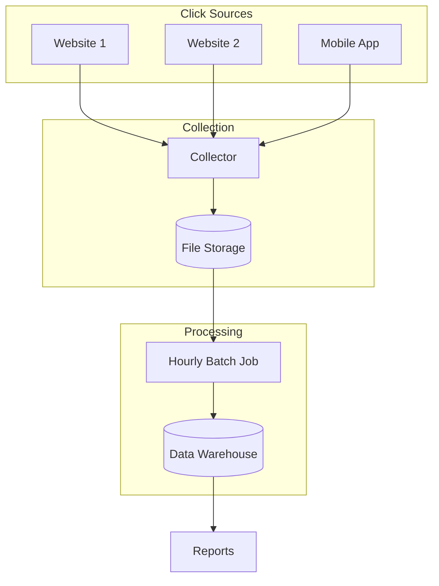
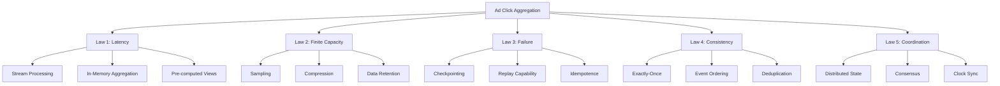

# Design an Ad Click Event Aggregation System

!!! info "Case Study Overview"
    **System**: Real-time Ad Analytics Platform  
    **Scale**: 1M+ clicks/second, 100B+ events/day  
    **Challenges**: Exactly-once processing, real-time + batch analytics, fraud detection  
    **Key Patterns**: Lambda architecture, stream processing, probabilistic data structures

*Estimated reading time: 22 minutes*

## Introduction

Digital advertising platforms process billions of click events daily, requiring real-time aggregation for billing, fraud detection, and campaign optimization. This case study explores building a system that can handle Google AdWords scale (2+ million clicks/second) while providing both real-time and historical analytics.

## Challenge Statement

Design an ad click event aggregation system that can:
- Process 1M+ click events per second
- Provide real-time metrics (< 1 second latency)
- Aggregate by multiple dimensions (advertiser, publisher, geo, device)
- Detect and filter fraudulent clicks in real-time
- Support exactly-once counting for billing
- Store raw events for 90 days for auditing
- Generate hourly, daily, and monthly reports
- Handle late-arriving events (up to 24 hours)

## Architecture Evolution

### Phase 1: Batch Processing (Traditional)


**Limitations**:
- High latency (hourly batches)
- No real-time fraud detection
- Difficult to handle late data

### Phase 2: Lambda Architecture (Current)
```mermaid
graph TD
    subgraph Click Sources
        S1[Ad Server 1]
        S2[Ad Server 2]
        S3[Mobile SDK]
    end
    
    subgraph Speed Layer
        K[Kafka]
        SP[Stream Processor<br/>Flink/Spark]
        RT[(Real-time Store<br/>Redis)]
    end
    
    subgraph Batch Layer
        DL[(Data Lake<br/>S3)]
        BP[Batch Processor<br/>Spark)]
        DW[(Data Warehouse<br/>BigQuery)]
    end
    
    subgraph Serving Layer
        API[Query API]
        DASH[Dashboard]
    end
    
    S1 --> K
    S2 --> K
    S3 --> K
    
    K --> SP
    K --> DL
    
    SP --> RT
    DL --> BP
    BP --> DW
    
    RT --> API
    DW --> API
    API --> DASH
```

## Concept Map



## Key Design Decisions

### 1. Event Schema Design

**Click Event Structure**:
```json
{
  "event_id": "550e8400-e29b-41d4-a716-446655440000",
  "timestamp": "2024-01-15T10:30:45.123Z",
  "user_id": "encrypted_user_123",
  "session_id": "session_abc123",
  "ad_id": "campaign_789_ad_456",
  "publisher_id": "pub_12345",
  "advertiser_id": "adv_67890",
  "impression_id": "imp_550e8400",
  "click_coordinates": {"x": 234, "y": 567},
  "device": {
    "type": "mobile",
    "os": "iOS",
    "browser": "Safari",
    "ip": "192.0.2.1"
  },
  "geo": {
    "country": "US",
    "region": "CA",
    "city": "San Francisco",
    "lat": 37.7749,
    "lon": -122.4194
  },
  "attributes": {
    "referrer": "https://example.com",
    "page_url": "https://publisher.com/article",
    "keyword": "running shoes"
  }
}
```

### 2. Stream Processing Pipeline

**Multi-Stage Processing**:
```python
# Stage 1: Validation and Enrichment
def validate_and_enrich(event):
# Validate required fields
    if not all(k in event for k in ['event_id', 'ad_id', 'timestamp']):
        return None
    
# Enrich with additional data
    event['advertiser'] = lookup_advertiser(event['ad_id'])
    event['campaign'] = lookup_campaign(event['ad_id'])
    event['fraud_score'] = calculate_fraud_score(event)
    
    return event

# Stage 2: Deduplication
class ClickDeduplicator:
    def __init__(self, window_minutes=10):
        self.seen = BloomFilter(capacity=10_000_000, error_rate=0.001)
        self.window = window_minutes * 60
    
    def is_duplicate(self, event):
        key = f"{event['user_id']}:{event['ad_id']}:{event['timestamp']}"
        if self.seen.contains(key):
            return True
        self.seen.add(key)
        return False

# Stage 3: Fraud Detection
def detect_fraud(events_window):
    fraud_signals = {
        'rapid_clicks': len(events_window) > 10,  # >10 clicks in window
        'suspicious_pattern': detect_click_pattern(events_window),
        'known_bot_ip': is_bot_ip(events_window[0]['device']['ip']),
        'invalid_coordinates': check_click_coordinates(events_window)
    }
    
    fraud_score = sum(1 for signal in fraud_signals.values() if signal)
    return fraud_score > 2  # Threshold for fraud
```

### 3. Aggregation Strategy

**Hierarchical Aggregation**:
```sql
-- Real-time aggregation (1-minute windows)
CREATE MATERIALIZED VIEW clicks_1min AS
SELECT 
    DATE_TRUNC('minute', timestamp) as minute,
    advertiser_id,
    publisher_id,
    geo_country,
    device_type,
    COUNT(*) as clicks,
    COUNT(DISTINCT user_id) as unique_users,
    SUM(CASE WHEN fraud_score > 0.8 THEN 1 ELSE 0 END) as fraud_clicks
FROM click_stream
GROUP BY 1, 2, 3, 4, 5;

-- Roll up to hourly
CREATE MATERIALIZED VIEW clicks_hourly AS
SELECT 
    DATE_TRUNC('hour', minute) as hour,
    advertiser_id,
    publisher_id,
    geo_country,
    device_type,
    SUM(clicks) as clicks,
    SUM(unique_users) as unique_users,
    SUM(fraud_clicks) as fraud_clicks
FROM clicks_1min
GROUP BY 1, 2, 3, 4, 5;
```

### 4. Exactly-Once Processing

**Three-Phase Commit**:
```java
public class ExactlyOnceProcessor {
    private final StateStore stateStore;
    private final OutputStore outputStore;
    
    public void processBatch(List<ClickEvent> events) {
        String batchId = generateBatchId();
        
        // Phase 1: Check if batch already processed
        if (stateStore.isBatchProcessed(batchId)) {
            return;  // Idempotent - skip reprocessing
        }
        
        // Phase 2: Process and prepare output
        ProcessingResult result = new ProcessingResult();
        try {
            stateStore.beginTransaction(batchId);
            
            for (ClickEvent event : events) {
                if (!isDuplicate(event)) {
                    AggregatedData agg = aggregate(event);
                    result.add(agg);
                }
            }
            
            // Phase 3: Commit atomically
            outputStore.write(result);
            stateStore.markBatchProcessed(batchId);
            stateStore.commitTransaction();
            
        } catch (Exception e) {
            stateStore.rollbackTransaction();
            throw e;
        }
    }
}
```

## Technical Deep Dives

### Real-time Aggregation with Flink

```java
public class ClickAggregationJob {
    public static void main(String[] args) {
        StreamExecutionEnvironment env = StreamExecutionEnvironment
            .getExecutionEnvironment();
        
        // Enable exactly-once semantics
        env.getCheckpointConfig().setCheckpointingMode(
            CheckpointingMode.EXACTLY_ONCE);
        env.enableCheckpointing(60000); // 1-minute checkpoints
        
        // Read from Kafka
        DataStream<ClickEvent> clicks = env
            .addSource(new FlinkKafkaConsumer<>(
                "ad-clicks",
                new ClickEventSchema(),
                kafkaProps))
            .assignTimestampsAndWatermarks(
                new BoundedOutOfOrdernessTimestampExtractor<ClickEvent>(
                    Time.minutes(5)) {  // 5-minute late events
                    @Override
                    public long extractTimestamp(ClickEvent click) {
                        return click.getTimestamp();
                    }
                });
        
        // Deduplicate
        DataStream<ClickEvent> deduped = clicks
            .keyBy(click -> click.getUserId() + ":" + click.getAdId())
            .window(TumblingEventTimeWindows.of(Time.minutes(10)))
            .process(new DeduplicationFunction());
        
        // Fraud detection
        DataStream<ClickEvent> validated = deduped
            .keyBy(click -> click.getUserId())
            .window(SlidingEventTimeWindows.of(
                Time.minutes(5),     // Window size
                Time.minutes(1)))    // Slide interval
            .process(new FraudDetectionFunction());
        
        // Multi-dimensional aggregation
        DataStream<ClickAggregation> aggregated = validated
            .keyBy(click -> 
                click.getAdvertiserId() + ":" + 
                click.getPublisherId() + ":" +
                click.getGeoCountry())
            .window(TumblingEventTimeWindows.of(Time.minutes(1)))
            .aggregate(new ClickAggregateFunction());
        
        // Write to multiple sinks
        aggregated.addSink(new CassandraSink());  // Real-time store
        aggregated.addSink(new S3Sink());         // Data lake
        aggregated.addSink(new KafkaSink());       // Downstream
        
        env.execute("Click Aggregation Pipeline");
    }
}
```

### Handling Late Data

**Watermark Strategy**:
```java
public class AdaptiveWatermarkGenerator implements WatermarkGenerator<ClickEvent> {
    private long maxTimestamp = Long.MIN_VALUE;
    private final long maxOutOfOrderness = 300000; // 5 minutes
    
    @Override
    public void onEvent(ClickEvent event, long eventTimestamp, 
                       WatermarkOutput output) {
        maxTimestamp = Math.max(maxTimestamp, eventTimestamp);
    }
    
    @Override
    public void onPeriodicEmit(WatermarkOutput output) {
        // Emit watermark with bounded out-of-orderness
        output.emitWatermark(new Watermark(maxTimestamp - maxOutOfOrderness));
    }
}
```

**Side Output for Late Events**:
```java
OutputTag<ClickEvent> lateTag = new OutputTag<>("late-events");

SingleOutputStreamOperator<ClickAggregation> result = clicks
    .window(TumblingEventTimeWindows.of(Time.hours(1)))
    .allowedLateness(Time.hours(24))
    .sideOutputLateData(lateTag)
    .aggregate(new ClickAggregateFunction());

// Process late events separately
DataStream<ClickEvent> lateEvents = result.getSideOutput(lateTag);
lateEvents.addSink(new LateEventReprocessor());
```

### Probabilistic Counting

**HyperLogLog for Unique Users**:
```python
class HyperLogLogAggregator:
    def __init__(self, precision=14):
        self.precision = precision
        self.m = 1 << precision  # Number of buckets
        self.buckets = [0] * self.m
        
    def add(self, user_id):
        hash_value = hash(user_id)
        bucket = hash_value & (self.m - 1)
        zeros = self._count_leading_zeros(hash_value >> self.precision)
        self.buckets[bucket] = max(self.buckets[bucket], zeros + 1)
    
    def estimate_cardinality(self):
        raw_estimate = self.m * self.m / sum(2**(-x) for x in self.buckets)
        
# Apply bias correction
        if raw_estimate <= 2.5 * self.m:
            zeros = self.buckets.count(0)
            if zeros != 0:
                return self.m * math.log(self.m / zeros)
        
        return raw_estimate
    
    def merge(self, other):
        for i in range(self.m):
            self.buckets[i] = max(self.buckets[i], other.buckets[i])
```

## Performance Optimization

### Batching and Compression

```python
class OptimizedClickWriter:
    def __init__(self):
        self.batch_size = 10000
        self.compression = 'snappy'
        
    def write_batch(self, events):
# Convert to columnar format
        df = pd.DataFrame(events)
        
# Optimize data types
        df['timestamp'] = pd.to_datetime(df['timestamp'])
        df['advertiser_id'] = df['advertiser_id'].astype('category')
        df['publisher_id'] = df['publisher_id'].astype('category')
        
# Write as Parquet with compression
        table = pa.Table.from_pandas(df)
        pq.write_table(
            table,
            f's3://clicks/{datetime.now():%Y/%m/%d/%H}/batch.parquet',
            compression=self.compression,
            use_dictionary=True,
            dictionary_pagesize_limit=1048576
        )
```

### Query Performance

**Pre-aggregation Cube**:
```sql
-- Create OLAP cube for fast queries
CREATE TABLE click_cube AS
WITH dimensions AS (
    SELECT 
        DATE_TRUNC('hour', timestamp) as hour,
        advertiser_id,
        publisher_id,
        campaign_id,
        geo_country,
        device_type
    FROM clicks
),
measures AS (
    SELECT 
        hour,
        advertiser_id,
        publisher_id,
        campaign_id,
        geo_country,
        device_type,
        COUNT(*) as clicks,
        COUNT(DISTINCT user_id) as unique_users,
        SUM(revenue) as total_revenue
    FROM clicks
    GROUP BY CUBE(
        hour,
        advertiser_id,
        publisher_id,
        campaign_id,
        geo_country,
        device_type
    )
)
SELECT * FROM measures;

-- Query becomes instant
SELECT * FROM click_cube
WHERE advertiser_id = 'ADV123'
  AND hour >= '2024-01-15'
  AND geo_country = 'US';
```

## Fraud Detection

### Click Pattern Analysis

```python
class ClickPatternDetector:
    def detect_suspicious_patterns(self, user_clicks):
        patterns = {
            'rapid_fire': self._detect_rapid_clicks(user_clicks),
            'regular_interval': self._detect_bot_timing(user_clicks),
            'coordinate_clustering': self._detect_click_clustering(user_clicks),
            'session_anomaly': self._detect_session_patterns(user_clicks)
        }
        
        return self._calculate_fraud_probability(patterns)
    
    def _detect_rapid_clicks(self, clicks):
        if len(clicks) < 2:
            return 0.0
            
        intervals = []
        for i in range(1, len(clicks)):
            interval = clicks[i].timestamp - clicks[i-1].timestamp
            intervals.append(interval.total_seconds())
        
# Suspicious if many clicks < 1 second apart
        rapid_clicks = sum(1 for i in intervals if i < 1.0)
        return rapid_clicks / len(intervals)
    
    def _detect_bot_timing(self, clicks):
        if len(clicks) < 5:
            return 0.0
            
        intervals = [clicks[i].timestamp - clicks[i-1].timestamp 
                     for i in range(1, len(clicks))]
        
# Check for regular intervals (bot behavior)
        interval_variance = statistics.variance([i.total_seconds() 
                                               for i in intervals])
        
# Low variance suggests bot
        return 1.0 if interval_variance < 0.1 else 0.0
```

## Monitoring and Operations

### Key Metrics Dashboard

```yaml
dashboards:
  - name: "Ad Click Pipeline Health"
    panels:
      - title: "Ingestion Rate"
        query: "sum(rate(clicks_ingested_total[5m]))"
        
      - title: "Processing Lag"
        query: "max(time() - clicks_watermark_timestamp)"
        
      - title: "Fraud Detection Rate"
        query: "sum(rate(clicks_fraudulent_total[5m])) / sum(rate(clicks_total[5m]))"
        
      - title: "Deduplication Rate"
        query: "sum(rate(clicks_duplicate_total[5m])) / sum(rate(clicks_total[5m]))"
        
      - title: "Late Events"
        query: "sum(rate(clicks_late_total[5m]))"
        
      - title: "Processing Errors"
        query: "sum(rate(pipeline_errors_total[5m])) by (stage)"
```

### Operational Procedures

**Reprocessing Historical Data**:
```bash
# Replay specific time range
./replay-clicks.sh \
  --start="2024-01-15T00:00:00Z" \
  --end="2024-01-15T23:59:59Z" \
  --speed=10x \
  --target=reprocessing-pipeline

# Monitor progress
watch -n 5 './check-replay-progress.sh'
```

## Failure Scenarios

### 1. Kafka Partition Failure
**Impact**: Loss of subset of events
**Detection**: Partition lag alerts
**Recovery**: 
- Automatic leader election
- Replay from last checkpoint
- No data loss with RF=3

### 2. Processing Node Crash
**Impact**: Temporary lag increase
**Detection**: Heartbeat timeout
**Recovery**:
- Flink automatically reassigns tasks
- State restored from checkpoint
- Processing resumes < 1 minute

### 3. Data Center Outage
**Impact**: Regional processing stopped
**Detection**: Cross-region monitoring
**Recovery**:
- Traffic rerouted to other DCs
- Batch reprocessing when DC recovers
- Eventual consistency maintained

## Lessons Learned

### 1. Design for Reprocessing
- Keep raw events immutable
- Make pipelines idempotent
- Version your aggregation logic

### 2. Fraud Detection is an Arms Race
- Continuously update detection algorithms
- Use ML models for advanced patterns
- Balance false positives vs revenue loss

### 3. Late Data is Inevitable
- Design with late arrival in mind
- Use watermarks wisely
- Provide correction mechanisms

### 4. Pre-aggregation is Critical
- Can't query billions of events directly
- Trade storage for query speed
- Multiple granularities needed

### 5. Monitor Everything
- Pipeline lag is key metric
- Track business metrics too
- Alert on anomalies, not just failures

## References

- [Google AdWords Architecture](https://research.google/pubs/pub36632/)
- [Stream Processing with Apache Flink](https://www.oreilly.com/library/view/stream-processing-with/9781491974285/)
- [Lambda Architecture](http://lambda-architecture.net/)
- [Probabilistic Data Structures](https://doi.org/10.1145/2213556.2213574)