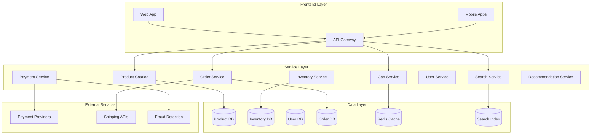
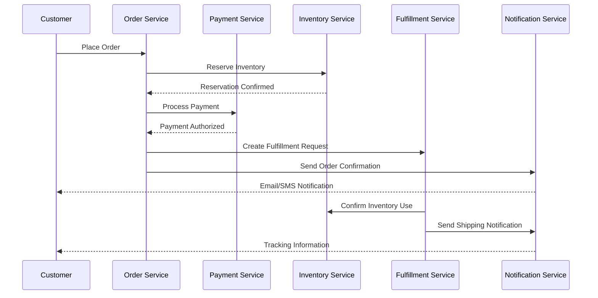

# E-commerce Platform Architecture

## Table of Contents

1. [System Overview](#system-overview)
2. [Architecture Components](#architecture-components)
3. [Product Catalog Management](#product-catalog-management)
4. [Inventory Management](#inventory-management)
5. [Shopping Cart & Session Management](#shopping-cart--session-management)
6. [Order Processing Pipeline](#order-processing-pipeline)
7. [Payment Processing](#payment-processing)
8. [Search and Recommendation](#search-and-recommendation)
9. [Scalability Patterns](#scalability-patterns)
10. [Performance Optimizations](#performance-optimizations)

## System Overview

E-commerce platforms like Amazon, Alibaba, and Shopify handle millions of transactions daily, requiring sophisticated distributed architectures that balance performance, consistency, and availability.

### Key Architecture Principles
- **Microservices Architecture**: Separate concerns into focused services
- **Event-Driven Design**: Asynchronous processing for scalability
- **CQRS Pattern**: Separate read and write models for optimization
- **Circuit Breakers**: Fault tolerance and graceful degradation
- **Horizontal Scaling**: Handle traffic spikes and growth

## Architecture Components



## Product Catalog Management

### Data Model Structure
```json
{
  "product_id": "P123456",
  "sku": "SKU-ABC-001",
  "title": "Product Name",
  "description": "Detailed description",
  "category": {
    "primary": "Electronics",
    "subcategories": ["Smartphones", "Android"]
  },
  "attributes": {
    "color": "Black",
    "storage": "128GB",
    "brand": "BrandName"
  },
  "pricing": {
    "base_price": 599.99,
    "currency": "USD",
    "discounts": [
      {
        "type": "percentage",
        "value": 10,
        "valid_until": "2025-12-31"
      }
    ]
  },
  "availability": {
    "status": "in_stock",
    "regions": ["US", "EU", "APAC"]
  },
  "metadata": {
    "created_at": "2025-01-01T00:00:00Z",
    "updated_at": "2025-01-28T10:30:00Z",
    "version": 3
  }
}
```

### Catalog Service Architecture
- **Read Replicas**: Multiple read-only databases for high availability
- **Caching Strategy**: Multi-level caching (Redis, CDN, application cache)
- **Search Integration**: Elasticsearch for full-text and faceted search
- **Version Control**: Track product changes and rollback capabilities

## Inventory Management

### Distributed Inventory Pattern
```python
class InventoryManager:
    def __init__(self):
        self.local_cache = Redis()
        self.inventory_db = Database()
        self.event_bus = EventBus()
    
    async def reserve_inventory(self, product_id: str, quantity: int, region: str):
        # Optimistic locking approach
        current_stock = await self.get_current_stock(product_id, region)
        
        if current_stock >= quantity:
            # Reserve inventory with expiration
            reservation_id = await self.create_reservation(
                product_id, quantity, region, ttl=900  # 15 minutes
            )
            
            # Publish inventory reserved event
            await self.event_bus.publish("inventory.reserved", {
                "reservation_id": reservation_id,
                "product_id": product_id,
                "quantity": quantity,
                "region": region,
                "expires_at": datetime.utcnow() + timedelta(minutes=15)
            })
            
            return reservation_id
        else:
            raise InsufficientInventoryError(f"Only {current_stock} available")
    
    async def confirm_reservation(self, reservation_id: str):
        reservation = await self.get_reservation(reservation_id)
        if reservation and not reservation.expired:
            # Actually decrement inventory
            await self.decrement_stock(
                reservation.product_id, 
                reservation.quantity, 
                reservation.region
            )
            
            # Publish inventory confirmed event
            await self.event_bus.publish("inventory.confirmed", {
                "reservation_id": reservation_id,
                "final_stock": await self.get_current_stock(
                    reservation.product_id, reservation.region
                )
            })
```

### Flash Sale Handling
- **Pre-allocation**: Reserve inventory for flash sales
- **Queue System**: Rate limiting and fair queuing
- **Circuit Breaker**: Prevent cascading failures
- **Gradual Release**: Staged inventory release to manage demand

## Shopping Cart & Session Management

### Cart Persistence Strategy
```python
class CartService:
    def __init__(self):
        self.redis = Redis(cluster=True)
        self.session_db = Database()
    
    async def add_to_cart(self, user_id: str, product_id: str, quantity: int):
        cart_key = f"cart:{user_id}"
        
        # Store in Redis for fast access
        cart_item = {
            "product_id": product_id,
            "quantity": quantity,
            "added_at": datetime.utcnow().isoformat(),
            "price_snapshot": await self.get_current_price(product_id)
        }
        
        await self.redis.hset(cart_key, product_id, json.dumps(cart_item))
        await self.redis.expire(cart_key, 604800)  # 7 days
        
        # Asynchronously persist to database
        await self.persist_cart_change(user_id, "add", cart_item)
        
        # Check inventory availability
        await self.validate_cart_inventory(user_id)
    
    async def validate_cart_inventory(self, user_id: str):
        """Periodically validate cart items are still available"""
        cart = await self.get_cart(user_id)
        for item in cart.items:
            available = await self.inventory_service.check_availability(
                item.product_id, item.quantity
            )
            if not available:
                await self.notify_unavailable(user_id, item)
```

## Order Processing Pipeline

### Event-Driven Order Flow


### Order State Machine
```python
from enum import Enum
from dataclasses import dataclass
from typing import Optional

class OrderState(Enum):
    PENDING = "pending"
    PAYMENT_PROCESSING = "payment_processing" 
    CONFIRMED = "confirmed"
    FULFILLMENT = "fulfillment"
    SHIPPED = "shipped"
    DELIVERED = "delivered"
    CANCELLED = "cancelled"
    REFUNDED = "refunded"

@dataclass
class OrderTransition:
    from_state: OrderState
    to_state: OrderState
    trigger: str
    conditions: list[str]
    
class OrderStateMachine:
    TRANSITIONS = [
        OrderTransition(OrderState.PENDING, OrderState.PAYMENT_PROCESSING, 
                       "process_payment", ["inventory_reserved"]),
        OrderTransition(OrderState.PAYMENT_PROCESSING, OrderState.CONFIRMED,
                       "payment_success", ["payment_authorized"]),
        OrderTransition(OrderState.CONFIRMED, OrderState.FULFILLMENT,
                       "start_fulfillment", ["payment_captured"]),
        # ... more transitions
    ]
```

## Scalability Patterns

### Database Sharding Strategy
- **Product Catalog**: Shard by category or product ID range
- **User Data**: Shard by user ID hash
- **Orders**: Shard by date range or geographic region
- **Inventory**: Shard by warehouse location and product category

### Caching Layers
```python
# Multi-level caching strategy
class CachingStrategy:
    def __init__(self):
        self.l1_cache = LocalCache()  # Application-level
        self.l2_cache = Redis()       # Distributed cache
        self.l3_cache = CDN()         # Edge cache
    
    async def get_product(self, product_id: str):
        # L1: Check local cache first
        product = self.l1_cache.get(f"product:{product_id}")
        if product:
            return product
        
        # L2: Check Redis
        product = await self.l2_cache.get(f"product:{product_id}")
        if product:
            self.l1_cache.set(f"product:{product_id}", product, ttl=300)
            return product
        
        # L3: Database fetch with cache warming
        product = await self.database.get_product(product_id)
        await self.warm_caches(product)
        return product
```

## Performance Optimizations

### Search Optimization
- **Elasticsearch Clusters**: Distributed search with replicas
- **Autocomplete**: Prefix matching with Redis sorted sets
- **Faceted Search**: Pre-computed aggregations
- **Personalization**: User behavior-based ranking

### Image and Asset Optimization
- **CDN Distribution**: Global content delivery
- **Image Compression**: WebP, AVIF formats
- **Lazy Loading**: Progressive image loading
- **Responsive Images**: Multiple sizes for different devices

## Key Challenges Addressed

### Flash Sale Architecture
```python
class FlashSaleManager:
    def __init__(self):
        self.queue = RateLimitedQueue(max_qps=1000)
        self.inventory_allocator = InventoryAllocator()
        
    async def handle_flash_sale_request(self, user_id: str, product_id: str):
        # Queue-based processing to prevent thundering herd
        position = await self.queue.enqueue(user_id, product_id)
        
        if position <= self.inventory_allocator.available_slots(product_id):
            reservation = await self.inventory_allocator.reserve(
                product_id, user_id, ttl=600  # 10 minutes
            )
            return {"status": "reserved", "reservation_id": reservation.id}
        else:
            return {"status": "waitlist", "position": position}
```

### Multi-Region Deployment
- **Active-Active Setup**: Multiple regions serving traffic
- **Data Replication**: Eventual consistency with conflict resolution
- **Geo-Routing**: Route users to nearest region
- **Disaster Recovery**: Automated failover capabilities

## Related Case Studies
- [Amazon DynamoDB](../databases/amazon-dynamo.md) - Distributed database architecture
- [Payment System](payment-system.md) - Payment processing patterns
- [CDN Architecture](../networking/cdn-architecture.md) - Content delivery optimization

## External Resources
- [Amazon's Architecture Evolution](https://aws.amazon.com/builders-library/)
- [Shopify's Flash Sale Architecture](https://shopify.engineering/)
- [eBay's Platform Architecture](https://tech.ebayinc.com/)

## See Also
- [Microservices Patterns](../../pattern-library/architecture/microservices.md)
- [Event-Driven Architecture](../../pattern-library/messaging/event-driven.md)
- [Distributed Caching](../../pattern-library/performance/distributed-caching.md)
