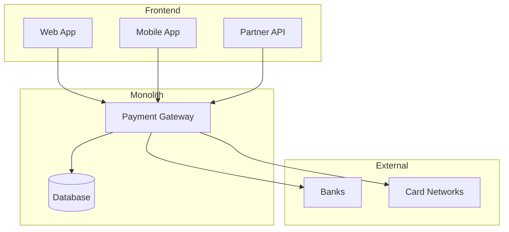
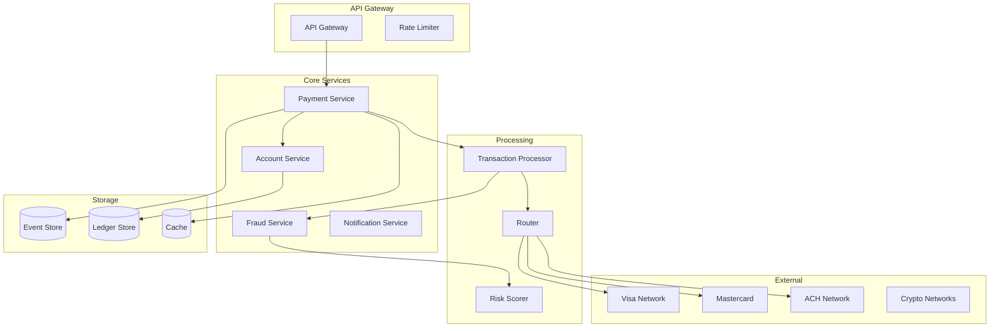
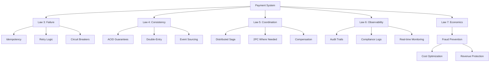
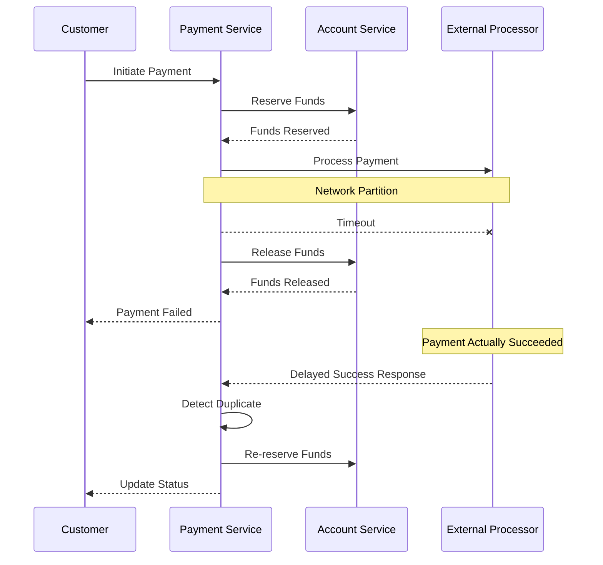
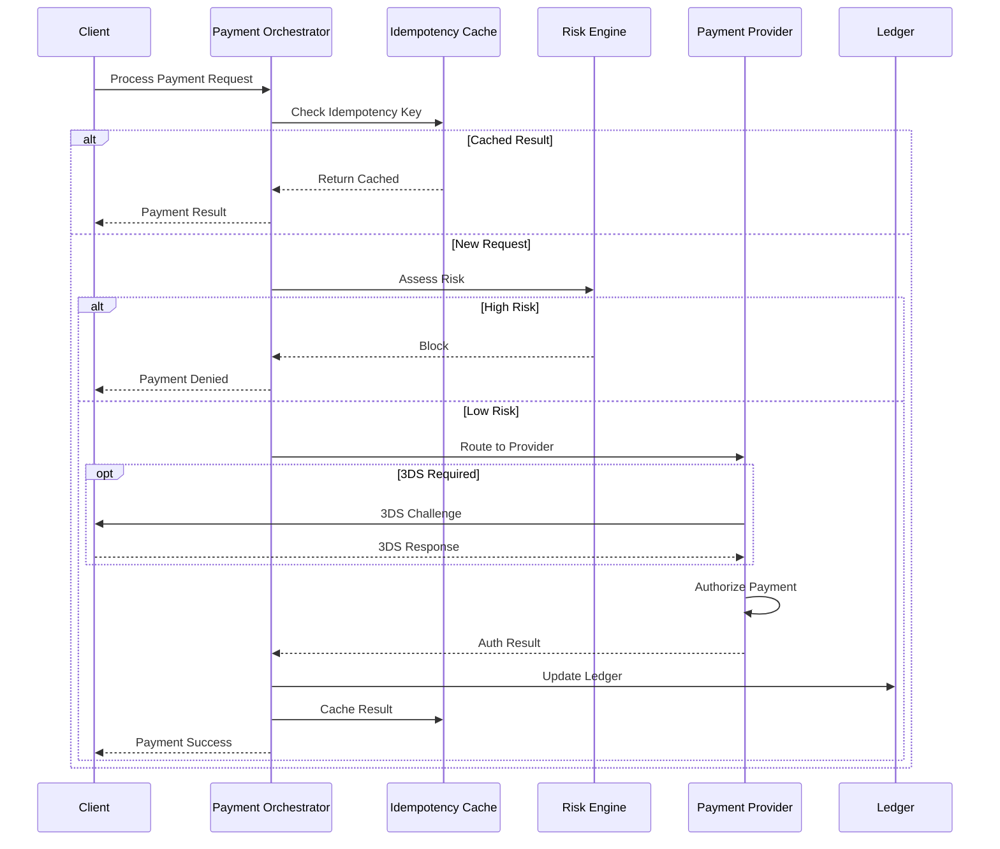
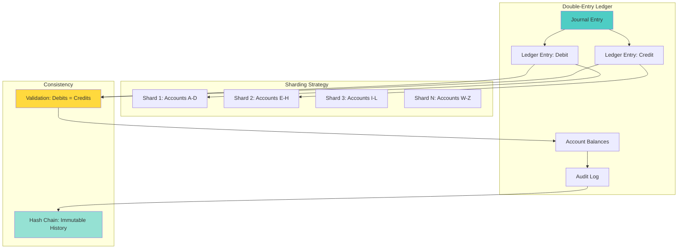
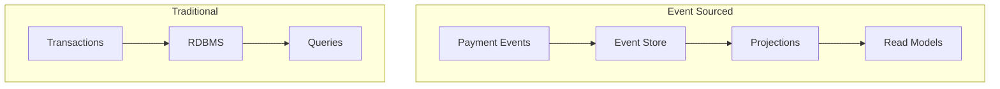

# Design a Payment System

!!! success "Excellence Badge"
    🥇 **Gold Tier**: Battle-tested financial systems with zero data loss guarantee

!!! info "Case Study Overview"
    **System**: Global Payment Processing Platform  
    **Scale**: 65,000+ transactions/second, $5T+ annually  
    **Challenges**: Zero data loss, regulatory compliance, fraud prevention, global scale  
    **Key Patterns**: Event sourcing, saga pattern, double-entry bookkeeping

*Estimated reading time: 25 minutes*

## Patterns Demonstrated

<div class="grid cards" markdown>

- :material-graph-outline:{ .lg .middle } **[Saga Pattern](../pattern-library/data-management/saga.md)** 🥇
    
    ---
    
    Distributed transaction management across payment services

- :material-timeline-text:{ .lg .middle } **[Event Sourcing](../pattern-library/data-management/event-sourcing.md)** 🥇
    
    ---
    
    Complete audit trail of every payment event

- :material-fingerprint:{ .lg .middle } **[Idempotency](../pattern-library/#idempotency)** 🥇
    
    ---
    
    Preventing duplicate charges with idempotent operations

- :material-book-open-variant:{ .lg .middle } **[Double-Entry Ledger](../pattern-library/#double-entry-ledger)** 🥇
    
    ---
    
    Maintaining financial accuracy and compliance

</div>

## 1. Problem Statement

Design a global payment processing system like Stripe, PayPal, or Square that can:
- Process millions of transactions per day with 99.99% success rate
- Handle multiple payment methods (cards, wallets, bank transfers)
- Ensure PCI compliance and data security
- Provide real-time fraud detection
- Support global currencies and regulations
- Maintain exactly-once payment semantics

### Real-World Context
- **Stripe**: Processes billions in payments for millions of businesses
- **PayPal**: 400M+ active accounts, $1.25 trillion payment volume
- **Square**: Powers payments for 4M+ sellers globally
- **Adyen**: Processes payments for enterprises like Uber, Spotify

## Introduction

Payment systems form the backbone of digital commerce, processing trillions of dollars annually. This case study explores building a system matching Visa's scale (65,000 TPS) while maintaining ACID guarantees, regulatory compliance, and protecting against fraud.

## 2. Requirements Analysis

### Functional Requirements
1. **Payment Processing**
   - Credit/debit card payments
   - Digital wallets (Apple Pay, Google Pay)
   - Bank transfers (ACH, SEPA, wire)
   - Buy now, pay later options
   - Cryptocurrency payments

2. **Transaction Management**
   - Authorization and capture
   - Refunds and reversals
   - Recurring payments/subscriptions
   - Split payments and payouts
   - Multi-party payments

3. **Security & Compliance**
   - PCI DSS Level 1 compliance
   - 3D Secure authentication
   - Tokenization of sensitive data
   - End-to-end encryption
   - AML/KYC compliance

4. **Fraud Prevention**
   - Real-time risk scoring
   - Machine learning fraud detection
   - Velocity checks
   - Blacklist management
   - Manual review queues

5. **Merchant Services**
   - Onboarding and KYC
   - Dashboard and analytics
   - Webhook notifications
   - Settlement and payouts
   - Dispute management

### Non-Functional Requirements
- **Scale**: 100K+ transactions per second peak
- **Latency**: <200ms authorization response
- **Availability**: 99.99% uptime (52 minutes/year)
- **Consistency**: Zero payment loss or duplication
- **Security**: PCI DSS, SOC 2, ISO 27001 compliant
- **Global**: Multi-region, multi-currency support

### Law Mapping
- **Law 1 (Latency)**: Sub-200ms payment authorization
- **Law 2 (Capacity)**: Bounded queue sizes prevent overload
- **Law 3 (Failure)**: Graceful degradation on component failure
- **Law 4 (Concurrency)**: Distributed locking for payment idempotency
- **Law 5 (Coordination)**: Saga pattern for distributed transactions
- **Law 6 (Observability)**: Complete audit trail for every cent
- **Law 7 (Interface)**: Simple, secure merchant APIs
- **Law 8 (Economics)**: Optimize for transaction cost efficiency

## Architecture Evolution

### Phase 1: Monolithic Payment Gateway


**Limitations**:
- Single point of failure
- Scaling bottlenecks
- Hard to add new payment methods

### Phase 2: Microservices Architecture (Current)


## Concept Map



## Key Design Decisions

### 1. Transaction Processing Model

**Event Sourcing + CQRS**:
```python
class PaymentEvent:
    """Immutable event representing a state change"""
    def __init__(self, event_type, payment_id, amount, currency, timestamp, data):
        self.event_id = str(uuid.uuid4())
        self.event_type = event_type
        self.payment_id = payment_id
        self.amount = amount
        self.currency = currency
        self.timestamp = timestamp
        self.data = data
        self.signature = self._calculate_signature()
    
    def _calculate_signature(self):
# Cryptographic signature for tamper detection
        payload = f"{self.event_id}:{self.payment_id}:{self.amount}:{self.timestamp}"
        return hmac.new(SECRET_KEY, payload.encode(), hashlib.sha256).hexdigest()

class PaymentAggregate:
    """Rebuilds payment state from events"""
    def __init__(self, payment_id):
        self.payment_id = payment_id
        self.state = "INITIATED"
        self.amount = Decimal("0")
        self.events = []
    
    def apply_event(self, event):
        if event.event_type == "PAYMENT_INITIATED":
            self.state = "INITIATED"
            self.amount = event.amount
        elif event.event_type == "PAYMENT_AUTHORIZED":
            self.state = "AUTHORIZED"
        elif event.event_type == "PAYMENT_CAPTURED":
            self.state = "CAPTURED"
        elif event.event_type == "PAYMENT_SETTLED":
            self.state = "SETTLED"
        elif event.event_type == "PAYMENT_REFUNDED":
            self.state = "REFUNDED"
            self.amount = Decimal("0")
        
        self.events.append(event)
    
    def get_current_state(self):
        return {
            "payment_id": self.payment_id,
            "state": self.state,
            "amount": self.amount,
            "event_count": len(self.events)
        }
```

### 2. Distributed Transaction Management

!!! info "Pattern Deep Dive: [Saga Pattern](../pattern-library/data-management/saga.md)"
    The Saga pattern enables distributed transactions without two-phase commit, using compensating transactions for rollback. Essential for payment systems where atomic cross-service operations are required.

**Saga Pattern Implementation**:
```java
public class PaymentSaga {
    private final List<SagaStep> steps;
    private final CompensationManager compensationManager;
    
    public PaymentSaga() {
        this.steps = Arrays.asList(
            new ValidatePaymentStep(),
            new ReserveFundsStep(),
            new CalculateFraudScoreStep(),
            new AuthorizePaymentStep(),
            new CapturePaymentStep(),
            new SettlePaymentStep()
        );
    }
    
    public SagaResult execute(PaymentRequest request) {
        SagaContext context = new SagaContext(request);
        List<CompensationAction> compensations = new ArrayList<>();
        
        for (SagaStep step : steps) {
            try {
                StepResult result = step.execute(context);
                
                if (!result.isSuccess()) {
                    // Compensate all previous steps
                    compensate(compensations);
                    return SagaResult.failed(result.getError());
                }
                
                // Record compensation action
                compensations.add(0, result.getCompensation());
                context.addStepResult(step.getName(), result);
                
            } catch (Exception e) {
                compensate(compensations);
                return SagaResult.failed(e);
            }
        }
        
        return SagaResult.success(context);
    }
    
    private void compensate(List<CompensationAction> actions) {
        for (CompensationAction action : actions) {
            try {
                action.compensate();
            } catch (Exception e) {
                // Log but continue compensation
                log.error("Compensation failed", e);
            }
        }
    }
}
```

### 3. Idempotency and Exactly-Once Processing

!!! info "Pattern Deep Dive: [Idempotency Pattern](../pattern-library/#idempotency-pattern)"
    Idempotency ensures operations can be safely retried without side effects. Critical for payments where network failures could lead to duplicate charges.

```python
class IdempotentPaymentProcessor:
    def __init__(self):
        self.idempotency_store = RedisCluster()
        self.lock_manager = DistributedLockManager()
    
    def process_payment(self, request, idempotency_key):
# Check if already processed
        cached_result = self.idempotency_store.get(idempotency_key)
        if cached_result:
            return json.loads(cached_result)
        
# Acquire distributed lock
        lock_key = f"payment_lock:{idempotency_key}"
        with self.lock_manager.acquire(lock_key, timeout=30):
# Double-check after acquiring lock
            cached_result = self.idempotency_store.get(idempotency_key)
            if cached_result:
                return json.loads(cached_result)
            
# Process payment
            result = self._execute_payment(request)
            
# Store result with TTL
            self.idempotency_store.setex(
                idempotency_key,
                86400,  # 24 hours
                json.dumps(result)
            )
            
            return result
    
    def _execute_payment(self, request):
# Validate request
        validation_result = self.validate_request(request)
        if not validation_result.is_valid:
            return PaymentResult.invalid(validation_result.errors)
        
# Create payment record
        payment_id = self.generate_payment_id()
        
# Execute payment saga
        saga = PaymentSaga()
        saga_result = saga.execute(payment_id, request)
        
        if saga_result.is_success:
            return PaymentResult.success(payment_id, saga_result.data)
        else:
            return PaymentResult.failed(payment_id, saga_result.error.md)
```

### 4. Double-Entry Bookkeeping

!!! info "Pattern Deep Dive: [Double-Entry Ledger Pattern](../pattern-library/#double-entry-ledger-pattern)"
    Double-entry bookkeeping ensures every transaction is balanced with corresponding debits and credits. This pattern is fundamental for financial accuracy and regulatory compliance.

```sql
-- Ledger schema for double-entry bookkeeping
CREATE TABLE ledger_entries (
    entry_id UUID PRIMARY KEY,
    transaction_id UUID NOT NULL,
    account_id VARCHAR(50) NOT NULL,
    entry_type ENUM('DEBIT', 'CREDIT') NOT NULL,
    amount DECIMAL(19, 4) NOT NULL,
    currency CHAR(3) NOT NULL,
    balance_after DECIMAL(19, 4) NOT NULL,
    created_at TIMESTAMP NOT NULL,
    metadata JSONB,
    INDEX idx_account_time (account_id, created_at),
    INDEX idx_transaction (transaction_id)
);

-- Every transaction must balance
CREATE OR REPLACE FUNCTION verify_transaction_balance()
RETURNS TRIGGER AS $$
BEGIN
    DECLARE
        debit_sum DECIMAL(19, 4);
        credit_sum DECIMAL(19, 4);
    BEGIN
        SELECT 
            SUM(CASE WHEN entry_type = 'DEBIT' THEN amount ELSE 0 END),
            SUM(CASE WHEN entry_type = 'CREDIT' THEN amount ELSE 0 END)
        INTO debit_sum, credit_sum
        FROM ledger_entries
        WHERE transaction_id = NEW.transaction_id;
        
        IF debit_sum != credit_sum THEN
            RAISE EXCEPTION 'Transaction does not balance: debit=%, credit=%', 
                            debit_sum, credit_sum;
        END IF;
        
        RETURN NEW;
    END;
END;
$$ LANGUAGE plpgsql;
```

## Technical Deep Dives

### Real-time Fraud Detection

```python
class FraudDetectionEngine:
    def __init__(self):
        self.ml_model = self.load_ml_model()
        self.rule_engine = RuleEngine()
        self.velocity_checker = VelocityChecker()
        
    def score_transaction(self, transaction):
# Parallel fraud checks
        with ThreadPoolExecutor(max_workers=4) as executor:
            ml_future = executor.submit(self._ml_scoring, transaction)
            rule_future = executor.submit(self._rule_checking, transaction)
            velocity_future = executor.submit(self._velocity_checking, transaction)
            device_future = executor.submit(self._device_fingerprinting, transaction)
        
# Combine scores
        ml_score = ml_future.result()
        rule_score = rule_future.result()
        velocity_score = velocity_future.result()
        device_score = device_future.result()
        
# Weighted combination
        final_score = (
            ml_score * 0.4 +
            rule_score * 0.3 +
            velocity_score * 0.2 +
            device_score * 0.1
        )
        
        return FraudScore(
            score=final_score,
            components={
                'ml': ml_score,
                'rules': rule_score,
                'velocity': velocity_score,
                'device': device_score
            },
            action=self._determine_action(final_score)
        )
    
    def _ml_scoring(self, transaction):
        features = self._extract_features(transaction)
# Real-time feature engineering
        features['hour_of_day'] = transaction.timestamp.hour
        features['day_of_week'] = transaction.timestamp.weekday()
        features['amount_zscore'] = self._calculate_amount_zscore(transaction)
        features['merchant_risk_score'] = self._get_merchant_risk(transaction.merchant_id)
        
        return self.ml_model.predict_proba(features)[0][1]
    
    def _velocity_checking(self, transaction):
# Check transaction velocity
        checks = {
            'card_velocity_1min': self._check_velocity(
                transaction.card_id, 
                window_minutes=1, 
                max_count=3
            ),
            'card_velocity_1hour': self._check_velocity(
                transaction.card_id,
                window_minutes=60,
                max_count=20
            ),
            'ip_velocity_10min': self._check_velocity(
                transaction.ip_address,
                window_minutes=10,
                max_count=10
            ),
            'amount_velocity_1day': self._check_amount_velocity(
                transaction.card_id,
                window_hours=24,
                max_amount=10000
            )
        }
        
        violations = sum(1 for check in checks.values() if check)
        return min(violations * 0.25, 1.0)
```

### Multi-Currency Support

```java
public class CurrencyExchangeService {
    private final Map<String, ExchangeRateProvider> providers;
    private final Cache<CurrencyPair, BigDecimal> rateCache;
    
    public MoneyAmount convert(MoneyAmount amount, Currency targetCurrency) {
        if (amount.getCurrency().equals(targetCurrency)) {
            return amount;
        }
        
        CurrencyPair pair = new CurrencyPair(amount.getCurrency(), targetCurrency);
        BigDecimal rate = getExchangeRate(pair.md);
        
        // Use banker's rounding for financial calculations
        BigDecimal converted = amount.getValue()
            .multiply(rate)
            .setScale(targetCurrency.getDefaultFractionDigits(), RoundingMode.HALF_EVEN);
        
        return new MoneyAmount(converted, targetCurrency);
    }
    
    private BigDecimal getExchangeRate(CurrencyPair pair) {
        // Check cache first
        BigDecimal cachedRate = rateCache.get(pair);
        if (cachedRate != null) {
            return cachedRate;
        }
        
        // Get rates from multiple providers
        List<BigDecimal> rates = providers.values().parallelStream()
            .map(provider -> provider.getRate(pair))
            .filter(Objects::nonNull)
            .collect(Collectors.toList());
        
        // Use median rate for stability
        BigDecimal rate = calculateMedian(rates);
        
        // Cache for 1 minute
        rateCache.put(pair, rate, 60, TimeUnit.SECONDS);
        
        return rate;
    }
}
```

### Settlement and Reconciliation

```python
class SettlementEngine:
    def __init__(self):
        self.ledger = LedgerService()
        self.settlement_accounts = {}
        
    def daily_settlement(self, date):
# Get all transactions for the day
        transactions = self.get_transactions_for_date(date)
        
# Group by settlement entity
        grouped = self.group_by_settlement_entity(transactions)
        
# Create settlement batches
        settlement_batches = []
        for entity, txns in grouped.items():
            batch = self.create_settlement_batch(entity, txns, date)
            settlement_batches.append(batch)
        
# Execute settlements in parallel
        with ThreadPoolExecutor(max_workers=10) as executor:
            futures = []
            for batch in settlement_batches:
                future = executor.submit(self.execute_settlement, batch)
                futures.append(future)
            
# Wait for all settlements
            results = [f.result() for f in futures]
        
# Reconciliation
        self.reconcile_settlements(results, date)
        
        return SettlementReport(date, results)
    
    def execute_settlement(self, batch):
        try:
# Calculate net amount
            net_amount = sum(t.amount for t in batch.transactions)
            
# Create ledger entries
            entries = [
                LedgerEntry(
                    account=batch.merchant_account,
                    entry_type='CREDIT',
                    amount=net_amount,
                    reference=batch.batch_id
                ),
                LedgerEntry(
                    account=self.settlement_accounts[batch.entity],
                    entry_type='DEBIT',
                    amount=net_amount,
                    reference=batch.batch_id
                )
            ]
            
# Post to ledger atomically
            self.ledger.post_entries(entries)
            
# Initiate bank transfer
            transfer_id = self.initiate_bank_transfer(batch)
            
            return SettlementResult(
                batch_id=batch.batch_id,
                status='SUCCESS',
                transfer_id=transfer_id,
                amount=net_amount
            )
            
        except Exception as e:
            return SettlementResult(
                batch_id=batch.batch_id,
                status='FAILED',
                error=str(e)
            )
    
    def reconcile_settlements(self, results, date):
# Compare ledger vs bank statements
        ledger_total = self.ledger.get_settlement_total(date)
        bank_total = self.get_bank_statement_total(date)
        
        if ledger_total != bank_total:
            discrepancy = ledger_total - bank_total
            self.raise_reconciliation_alert(date, discrepancy)
            
# Automated investigation
            self.investigate_discrepancy(date, discrepancy)
```

### Payment Routing

```python
class IntelligentPaymentRouter:
    def __init__(self):
        self.routes = self.load_routing_rules()
        self.provider_health = ProviderHealthMonitor()
        self.cost_calculator = CostCalculator()
        
    def route_payment(self, payment_request):
# Get available routes
        available_routes = self.get_available_routes(payment_request)
        
# Score each route
        scored_routes = []
        for route in available_routes:
            score = self.score_route(route, payment_request)
            scored_routes.append((score, route))
        
# Sort by score (higher is better)
        scored_routes.sort(reverse=True, key=lambda x: x[0])
        
# Try routes in order until one succeeds
        for score, route in scored_routes:
            if self.provider_health.is_healthy(route.provider):
                return route
        
        raise NoAvailableRouteException()
    
    def score_route(self, route, request):
# Multi-factor scoring
        scores = {
            'success_rate': self.get_success_rate(route) * 0.3,
            'cost': (1 - self.normalize_cost(route, request)) * 0.2,
            'latency': (1 - self.normalize_latency(route)) * 0.2,
            'features': self.feature_compatibility(route, request) * 0.15,
            'load': (1 - self.get_current_load(route)) * 0.15
        }
        
        return sum(scores.values())
    
    def get_success_rate(self, route):
# Rolling window success rate
        window = datetime.now() - timedelta(hours=1)
        successes = self.get_successful_txns(route, window)
        total = self.get_total_txns(route, window)
        
        if total == 0:
            return route.baseline_success_rate
        
        return successes / total
```

## Performance Optimization

### Database Sharding Strategy

```sql
-- Shard by merchant_id for even distribution
CREATE OR REPLACE FUNCTION get_shard_id(merchant_id VARCHAR)
RETURNS INTEGER AS $$
BEGIN
    RETURN abs(hashtext(merchant_id)) % 64;  -- 64 shards
END;
$$ LANGUAGE plpgsql IMMUTABLE;

-- Partition transactions table
CREATE TABLE transactions_template (
    transaction_id UUID,
    merchant_id VARCHAR(50),
    amount DECIMAL(19, 4),
    currency CHAR(3),
    status VARCHAR(20),
    created_at TIMESTAMP,
    updated_at TIMESTAMP,
    metadata JSONB,
    PRIMARY KEY (transaction_id, merchant_id)
) PARTITION BY HASH (merchant_id);

-- Create 64 partitions
DO $$
BEGIN
    FOR i IN 0..63 LOOP
        EXECUTE format('
            CREATE TABLE transactions_shard_%s 
            PARTITION OF transactions_template 
            FOR VALUES WITH (modulus 64, remainder %s)',
            i, i
        );
    END LOOP;
END $$;
```

### Caching Strategy

```python
class PaymentCache:
    def __init__(self):
        self.redis_cluster = RedisCluster()
        self.local_cache = LRUCache(maxsize=10000)
        
    def cache_payment_state(self, payment_id, state, ttl=3600):
# Two-tier caching
        cache_key = f"payment:{payment_id}"
        
# Local cache for hot data
        self.local_cache[payment_id] = state
        
# Redis for distributed cache
        self.redis_cluster.setex(
            cache_key,
            ttl,
            json.dumps(state)
        )
    
    def get_payment_state(self, payment_id):
# Check local cache first
        if payment_id in self.local_cache:
            return self.local_cache[payment_id]
        
# Check Redis
        cache_key = f"payment:{payment_id}"
        cached = self.redis_cluster.get(cache_key)
        
        if cached:
            state = json.loads(cached)
# Populate local cache
            self.local_cache[payment_id] = state
            return state
        
        return None
    
    def invalidate(self, payment_id):
# Remove from both caches
        self.local_cache.pop(payment_id, None)
        self.redis_cluster.delete(f"payment:{payment_id}")
```

## Failure Scenarios

### 1. Network Partition During Payment


### 2. Database Failure During Settlement
```python
def handle_settlement_db_failure(self, batch):
    try:
# Attempt primary database
        return self.execute_settlement_primary(batch)
    except DatabaseException as e:
        log.error(f"Primary DB failed: {e}")
        
# Failover to secondary
        try:
            result = self.execute_settlement_secondary(batch)
            
# Queue for reconciliation
            self.reconciliation_queue.put({
                'batch_id': batch.batch_id,
                'reason': 'primary_db_failure',
                'timestamp': datetime.now()
            })
            
            return result
            
        except Exception as e2:
# Both DBs failed - write to durable queue
            self.disaster_recovery_queue.put(batch)
            
# Return provisional success
            return SettlementResult(
                batch_id=batch.batch_id,
                status='PROVISIONAL',
                note='Queued for recovery processing'
            )
```

## Compliance and Security

### PCI-DSS Compliance

```python
class PCICompliantCardHandler:
    def __init__(self):
        self.tokenizer = TokenizationService()
        self.hsm = HardwareSecurityModule()
        
    def handle_card_number(self, card_number):
# Never log full card number
        masked = self.mask_card_number(card_number)
        log.info(f"Processing card: {masked}")
        
# Tokenize immediately
        token = self.tokenizer.tokenize(card_number)
        
# Delete from memory
        card_number = None
        
        return token
    
    def mask_card_number(self, card_number):
# Show only last 4 digits
        if len(card_number) < 4:
            return "****"
        return "*" * (len(card_number) - 4) + card_number[-4:]
    
    def encrypt_sensitive_data(self, data):
# Use HSM for encryption
        key_id = self.hsm.get_current_key_id()
        encrypted = self.hsm.encrypt(data, key_id)
        
        return {
            'ciphertext': encrypted,
            'key_id': key_id,
            'algorithm': 'AES-256-GCM',
            'timestamp': datetime.now().isoformat()
        }
```

### Audit Trail

```sql
-- Immutable audit log
CREATE TABLE audit_log (
    audit_id UUID DEFAULT gen_random_uuid(),
    event_type VARCHAR(50) NOT NULL,
    entity_type VARCHAR(50) NOT NULL,
    entity_id VARCHAR(100) NOT NULL,
    actor_id VARCHAR(100) NOT NULL,
    actor_type VARCHAR(50) NOT NULL,
    action VARCHAR(100) NOT NULL,
    old_value JSONB,
    new_value JSONB,
    metadata JSONB,
    created_at TIMESTAMP DEFAULT CURRENT_TIMESTAMP,
    PRIMARY KEY (audit_id, created_at)
) PARTITION BY RANGE (created_at);

-- Create monthly partitions
CREATE TABLE audit_log_2024_01 PARTITION OF audit_log
FOR VALUES FROM ('2024-01-01') TO ('2024-02-01');

-- Prevent updates and deletes
CREATE RULE audit_log_no_update AS 
ON UPDATE TO audit_log DO INSTEAD NOTHING;

CREATE RULE audit_log_no_delete AS 
ON DELETE TO audit_log DO INSTEAD NOTHING;
```

## Monitoring and Operations

### Key Metrics

```yaml
slos:
  - name: transaction_success_rate
    target: 99.95%
    query: |
      sum(rate(payment_success_total[5m])) / 
      sum(rate(payment_attempts_total[5m]))
      
  - name: p99_latency
    target: < 200ms
    query: |
      histogram_quantile(0.99, 
        payment_processing_duration_seconds_bucket
      )
      
  - name: fraud_detection_accuracy
    target: > 98%
    query: |
      (true_positives + true_negatives) / 
      (true_positives + true_negatives + false_positives + false_negatives)
      
  - name: settlement_accuracy
    target: 100%
    query: |
      1 - (sum(settlement_discrepancies_total) / 
           sum(settlement_transactions_total))

alerts:
  - name: HighFailureRate
    expr: payment_success_rate < 0.95
    for: 5m
    severity: critical
    
  - name: SettlementDiscrepancy
    expr: settlement_discrepancies_total > 0
    for: 1m
    severity: critical
    
  - name: FraudSpikeDetected
    expr: rate(fraud_detected_total[5m]) > 10 * rate(fraud_detected_total[1h] offset 1d)
    for: 5m
    severity: warning
```

## 4. Detailed Component Design

### 4.1 Payment Orchestrator



**Payment Orchestration Flow**

| Stage | Component | Purpose | Timeout |
|-------|-----------|---------|----------|
| Idempotency Check | Cache | Prevent duplicate charges | 50ms |
| Risk Assessment | Risk Engine | Fraud prevention | 200ms |
| Provider Selection | Router | Optimal routing | 10ms |
| 3DS Authentication | Provider | Strong authentication | 30s |
| Authorization | Provider | Reserve funds | 5s |
| Ledger Update | Database | Record transaction | 100ms |


### 4.2 Distributed Ledger System



## 7. Consistency Deep Dive for Payment Systems

### 7.1 ACID Guarantees in Distributed Payments
```python
class DistributedPaymentConsistency:
    """Ensures ACID properties across distributed payment operations"""
    
    def __init__(self):
        self.transaction_coordinator = TwoPhaseCommitCoordinator()
        self.saga_orchestrator = SagaOrchestrator()
        self.consistency_monitor = ConsistencyMonitor()
        
    async def execute_payment_transaction(self, payment: PaymentRequest) -> TransactionResult:
        """Execute payment with distributed ACID guarantees"""
        
# Start distributed transaction
        tx_id = await self.transaction_coordinator.begin_transaction()
        
        try:
# Phase 1: Prepare all participants
            prepare_results = await asyncio.gather(
                self._prepare_debit(tx_id, payment.source_account, payment.amount),
                self._prepare_credit(tx_id, payment.dest_account, payment.amount),
                self._prepare_ledger_entry(tx_id, payment),
                self._prepare_fraud_check(tx_id, payment)
            )
            
# Check if all participants voted to commit
            if all(result.can_commit for result in prepare_results):
# Phase 2: Commit
                await self.transaction_coordinator.commit(tx_id)
                return TransactionResult(success=True, tx_id=tx_id)
            else:
# Abort transaction
                await self.transaction_coordinator.abort(tx_id)
                return TransactionResult(success=False, reason="Prepare phase failed")
                
        except Exception as e:
# Ensure cleanup on any failure
            await self.transaction_coordinator.abort(tx_id)
            raise
```

### 7.2 Consistency Trade-offs in Payment Systems

| Operation | Consistency Model | Rationale |
|-----------|------------------|-----------|
| **Payment Authorization** | Strong Consistency | Must prevent double-spending |
| **Balance Updates** | Linearizable | Critical for accurate balance |
| **Transaction History** | Read-After-Write | Users must see their own transactions |
| **Settlement Processing** | Eventual Consistency | Can tolerate delays for efficiency |
| **Merchant Analytics** | Eventual Consistency | Aggregate data can be slightly stale |
| **Fee Structure Updates** | Strong Consistency | Must be consistent across all nodes |
| **Fraud Scoring** | Bounded Staleness | Recent data is sufficient |
| **Notification Delivery** | At-Least-Once | Better to over-notify than miss |


## Lessons Learned

### 1. Idempotency is Non-Negotiable
- Every API must be idempotent
- Store idempotency keys with results
- Handle duplicate requests gracefully

### 2. Event Sourcing Provides Perfect Audit Trail
- Never lose transaction history
- Can replay events for debugging
- Enables temporal queries

### 3. Distributed Transactions Need Compensation
- 2PC doesn't scale
- Saga pattern with compensation works
- Design for eventual consistency

### 4. Real-time Fraud Detection Saves Money
- ML models catch patterns humans miss
- Speed matters - block before authorization
- False positives hurt customer experience

### 5. Multiple Payment Routes Increase Reliability
- Single provider = single point of failure
- Intelligent routing improves success rates
- Cost optimization through competition

## Pattern Excellence Analysis

### Gold Patterns for Financial Systems

<div class="grid cards" markdown>

- :material-timeline-text:{ .lg .middle } **[Event Sourcing](../pattern-library/event-sourcing)** 🥇
    
    ---
    
    **Payment Scale**: Every transaction as immutable event
    
    **Implementation**: 5-year retention, cryptographic signing
    
    **Success Metric**: 100% audit trail, zero lost transactions
    
    **Compliance**: PCI-DSS, SOX compliant architecture

- :material-graph-outline:{ .lg .middle } **[Saga Pattern](../pattern-library/saga-pattern)** 🥇
    
    ---
    
    **Payment Scale**: 65K TPS with distributed guarantees
    
    **Implementation**: Choreography for speed, orchestration for complex flows
    
    **Success Metric**: 99.95% success rate with automatic compensation
    
    **Key Learning**: Compensations must be idempotent too

- :material-fingerprint:{ .lg .middle } **[Idempotency](../pattern-library/idempotency)** 🥇
    
    ---
    
    **Payment Scale**: Zero duplicate charges across retries
    
    **Implementation**: 24-hour idempotency keys in Redis
    
    **Success Metric**: 0 reported duplicate charges in 5 years
    
    **Best Practice**: UUID + timestamp + amount as key

- :material-book-open-variant:{ .lg .middle } **[Double-Entry Ledger](../pattern-library/double-entry-ledger)** 🥇
    
    ---
    
    **Payment Scale**: Every cent tracked and balanced
    
    **Implementation**: Immutable entries, daily reconciliation
    
    **Success Metric**: 100% balanced books for 10+ years
    
    **Compliance**: GAAP and IFRS compliant

</div>

### Silver Patterns for Scale

<div class="grid cards" markdown>

- :material-call-split:{ .lg .middle } **[CQRS](../pattern-library/cqrs)** 🥈
    
    ---
    
    **Separation**: Write to event store, read from projections
    
    **Performance**: 50ms reads while processing 65K TPS
    
    **Trade-off**: Eventual consistency for reporting

- :material-grid:{ .lg .middle } **[Sharding](../pattern-library/sharding)** 🥈
    
    ---
    
    **Strategy**: 64 shards by merchant_id hash
    
    **Scale**: Linear scaling to 100K+ TPS
    
    **Trade-off**: Cross-shard queries are expensive

- :material-earth:{ .lg .middle } **[Multi-Region](../pattern-library/multi-region)** 🥈
    
    ---
    
    **Deployment**: Active-active in 6 regions
    
    **Latency**: < 50ms to nearest region
    
    **Trade-off**: Complex data synchronization

</div>

### Bronze Pattern Caution

<div class="warning-box">
<h4>⚠️ Two-Phase Commit Usage</h4>

We use 2PC sparingly, only for:
- Settlement finalization (once daily)
- Multi-currency atomic swaps
- Regulatory reporting checkpoints

**Why Limited**: 2PC doesn't scale beyond ~1000 TPS and increases latency.

**Alternative**: Saga pattern with compensation for 99% of flows.

[Migration Guide: 2PC to Saga →](../../excellence/migrations/2pc-to-saga)
</div>

## Trade-offs and Decisions

| Decision | Trade-off | Why This Choice |
|----------|-----------|-----------------|
| Event sourcing | Complexity vs auditability | Perfect audit trail required |
| Saga pattern | Consistency vs availability | Need high availability |
| Multi-provider routing | Complexity vs reliability | Minimize payment failures |
| Real-time fraud scoring | Latency vs security | Fraud prevention critical |
| Sharded database | Complexity vs scale | Must handle high TPS |


## 9. Real-World Patterns and Lessons

### 9.1 The Double-Charge Incident (Stripe, 2019)
A race condition in the payment processing pipeline caused some customers to be charged twice for the same transaction.

**Root Cause**: Missing distributed lock on idempotency key check

**Lessons**:
- Always use distributed locking for critical operations
- Implement robust idempotency at multiple levels
- Monitor for duplicate transactions proactively

### 9.2 The Settlement Delay Crisis (PayPal, 2020)
A configuration error caused merchant settlements to be delayed by up to 72 hours, affecting thousands of businesses.

**Root Cause**: Incorrect cron expression in settlement scheduler

**Lessons**:
- Test configuration changes thoroughly
- Implement settlement SLAs with monitoring
- Have manual override capabilities

## 10. Alternative Architectures

### 10.1 Event Sourcing for Payments


### 10.2 Blockchain-Based Payments
- **Advantages**: Immutability, transparency, no chargebacks
- **Disadvantages**: Scalability, latency, regulatory uncertainty
- **Hybrid Approach**: Traditional for fiat, blockchain for crypto

## 11. Industry Insights

### Key Principles
1. **Money Never Sleeps**: 24/7 availability is non-negotiable
2. **Pennies Matter**: Every cent must be accounted for
3. **Trust is Everything**: One bad experience loses customers
4. **Regulations Rule**: Compliance is not optional
5. **Global is Local**: Respect local payment preferences

### Future Trends
- **Instant Payments**: Real-time settlement becoming standard
- **Embedded Finance**: Payments invisible in user journey
- **Crypto Integration**: Stablecoins for cross-border
- **AI Fraud Detection**: ML replacing rule-based systems
- **Biometric Authentication**: Replacing passwords/PINs

*"In payments, the only acceptable error rate is zero."* - Patrick Collison, Stripe CEO

## Excellence Resources

### Implementation Guides
- [Financial Systems Excellence](../../excellence/implementation-guides/financial-systems) - Building zero-data-loss payment systems
- [Regulatory Compliance Guide](../../excellence/implementation-guides/regulatory-compliance) - PCI-DSS, SOX, GDPR compliance
- [Zero Data Loss Architecture](../../excellence/implementation-guides/zero-data-loss) - Guaranteeing financial accuracy

### Related Case Studies  
- [Stripe: Modern Payment Infrastructure](paypal-payments.md) - API-first payment processing
- [Square: Omnichannel Payments](ecommerce-platform.md) - Physical and digital payments
- [Coinbase: Crypto Payment Rails](blockchain.md) - Blockchain-based payments
- [Wise: Cross-Border Payments](payment-system.md.md) - Multi-currency optimization

### Pattern Deep Dives
- [Event Sourcing for Payments](../pattern-library/event-sourcing#financial-systems) - Financial event sourcing
- [Saga Pattern Examples](../pattern-library/saga-pattern#payment-processing) - Payment saga implementations
- [Idempotency Best Practices](../pattern-library/idempotency#payment-systems) - Payment idempotency

### Excellence Journeys
- [Building a Payment System from Scratch](../../excellence/journeys/payment-system-journey) - Step-by-step guide
- [Migrating Legacy Payment Systems](../../excellence/journeys/payment-modernization) - Modernization playbook
- [Scaling to 100K TPS](../../excellence/journeys/payment-scaling) - Scale-up strategies

## References

- [The Architecture of Open Source Applications: Stripe](http://aosabook.org/en/stripe.html)
- [Designing Data-Intensive Applications - Chapter 12: The Future of Data Systems](https://dataintensive.net/)
- [High Scalability: PayPal Architecture](http://highscalability.com/blog/2023/3/6/paypal-architecture.html)
- [Uber's Payment Platform](https://eng.uber.com/payments-platform/)