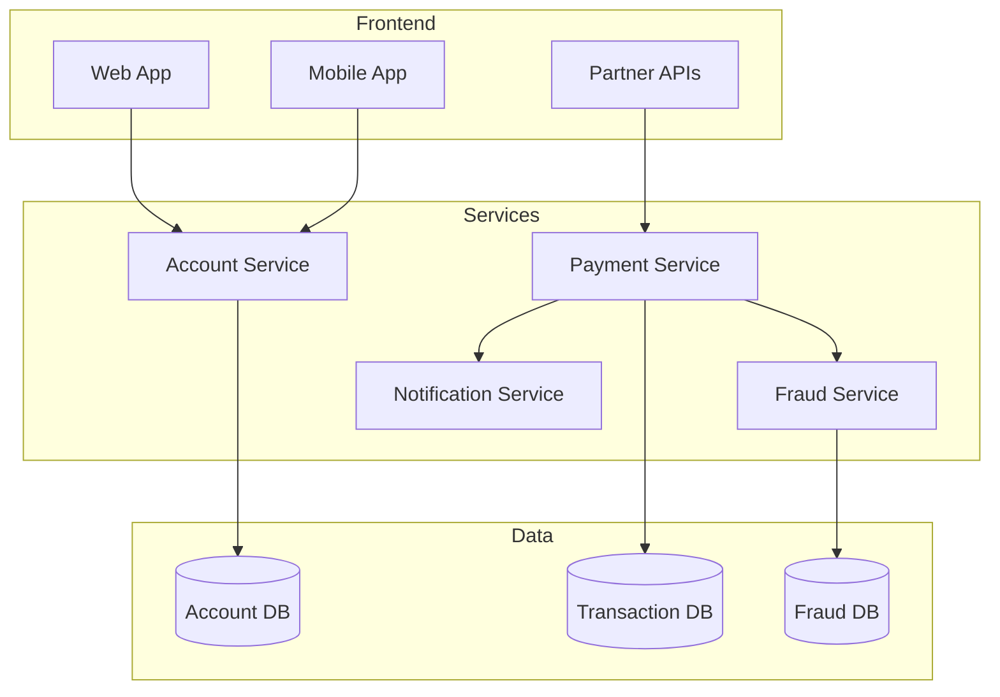
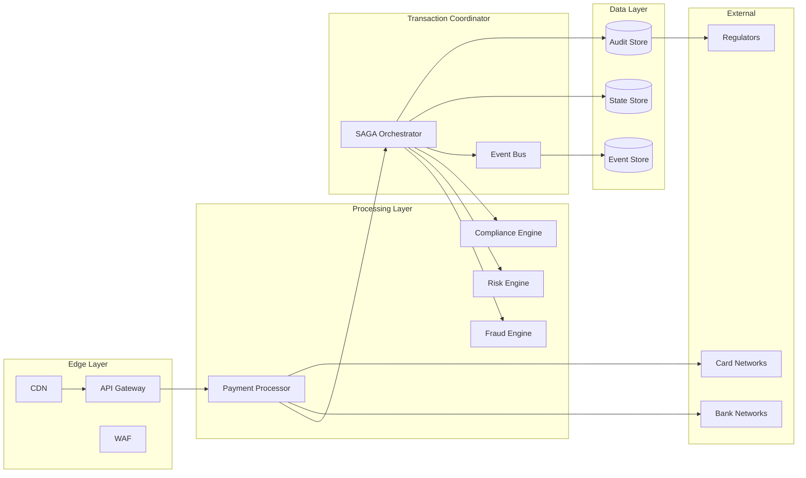
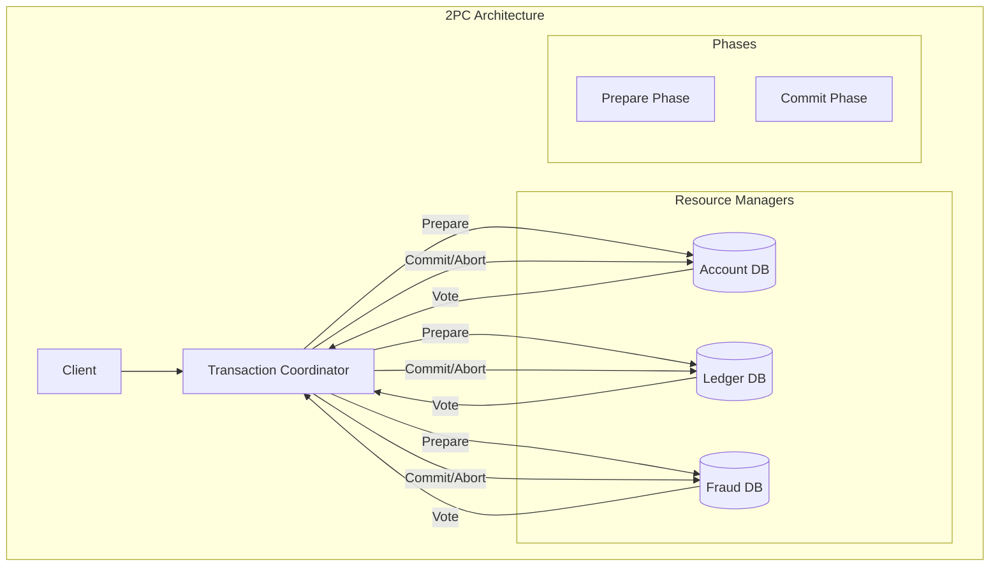
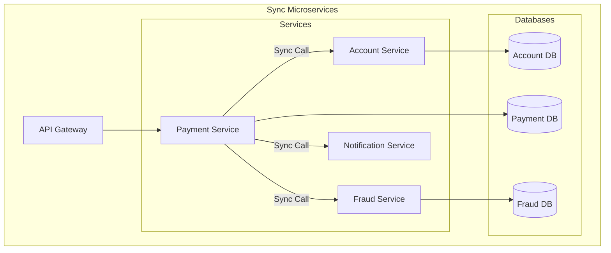

# 🏦 PayPal's Payment Processing System

**Challenge**: Process billions in payments with zero data loss

!!! info "Note on Metrics"
    The specific metrics and figures in this case study are estimates based on public information, industry standards, and typical patterns for payment systems at scale. Actual proprietary data is not disclosed.

## Architecture Evolution

### Phase 1: Monolithic (1998-2005)
```text
Web App → Single Database → Batch Processing → Bank Networks
```
Limitations: Scaling bottlenecks, 4-hour maintenance windows, no real-time, SPOF

### Phase 2: SOA (2005-2015)



Improvements: Service isolation, independent scaling, fault tolerance, API-first

### Phase 3: Distributed Transaction Processing (2015-Present)



## Distributed Transaction Processing

### SAGA Pattern Implementation

```python
class PaymentSaga:
    def __init__(self, saga_id):
        self.saga_id = saga_id
        self.state = "INITIATED"
        self.compensations = []

    async def execute_payment(self, payment_request):
        try:
# Step 1: Validate and Lock Funds
            validation_result = await self.validate_and_lock(
                payment_request
            )
            self.compensations.append(
                lambda: self.unlock_funds(payment_request.sender)
            )

# Step 2: Fraud Check
            fraud_result = await self.check_fraud(payment_request)
            if fraud_result.is_suspicious:
                await self.compensate()
                return PaymentResult.REJECTED

# Step 3: Compliance Check
            compliance_result = await self.check_compliance(
                payment_request
            )
            if not compliance_result.is_compliant:
                await self.compensate()
                return PaymentResult.COMPLIANCE_FAILED

# Step 4: Execute Transfer
            transfer_result = await self.execute_transfer(
                payment_request
            )
            self.compensations.append(
                lambda: self.reverse_transfer(transfer_result.id)
            )

# Step 5: Update Balances
            await self.update_balances(payment_request)

# Step 6: Send Notifications
            await self.send_notifications(payment_request)

# Success - Clear compensations
            self.state = "COMPLETED"
            self.compensations.clear()

            return PaymentResult.SUCCESS

        except Exception as e:
# Failure - Run compensations
            await self.compensate()
            self.state = "FAILED"
            raise

    async def compensate(self):
        """Run compensation actions in reverse order"""
        for compensation in reversed(self.compensations):
            try:
                await compensation()
            except Exception as e:
# Log but continue compensating
                log.error(f"Compensation failed: {e}")
```

### Idempotency & Exactly-Once Processing

```python
class IdempotentPaymentProcessor:
    def __init__(self):
        self.processed_requests = {}  # In practice, distributed cache

    async def process_payment(self, request):
# Generate idempotency key
        idempotency_key = self.generate_key(request)

# Check if already processed
        if idempotency_key in self.processed_requests:
            return self.processed_requests[idempotency_key]

# Acquire distributed lock
        lock = await self.acquire_lock(idempotency_key)
        if not lock:
# Another instance is processing
            return await self.wait_for_result(idempotency_key)

        try:
# Double-check after acquiring lock
            if idempotency_key in self.processed_requests:
                return self.processed_requests[idempotency_key]

# Process payment
            result = await self.execute_payment(request)

# Store result
            self.processed_requests[idempotency_key] = result
            await self.persist_result(idempotency_key, result)

            return result

        finally:
            await self.release_lock(idempotency_key)

    def generate_key(self, request):
        """Generate deterministic idempotency key"""
        return hashlib.sha256(
            f"{request.sender_id}:{request.receiver_id}:"
            f"{request.amount}:{request.timestamp}:"
            f"{request.request_id}".encode()
        ).hexdigest()
```

## Law Analysis

### Law 4: Trade-offs (Truth Through Event Sourcing)

```python
@dataclass
class PaymentEvent:
    event_id: str
    saga_id: str
    timestamp: datetime
    event_type: str
    payload: dict

class EventStore:
    async def append_event(self, event: PaymentEvent):
# Atomic append with ordering guarantee
        await self.storage.append(
            partition_key=event.saga_id,
            event=event,
            expected_version=self.get_version(event.saga_id)
        )

# Publish to event bus
        await self.event_bus.publish(event)

    async def get_payment_history(self, payment_id: str):
        """Reconstruct payment state from events"""
        events = await self.storage.get_events(payment_id)

        state = PaymentState()
        for event in events:
            state = self.apply_event(state, event)

        return state
```

**Audit Requirements:** Who (user/system/API), What (amount/status/metadata), When (microsecond precision), Why (business rule/user action), Where (IP/device/location)

### Law 4: Trade-offs (Control Through Orchestration)

```python
class PaymentOrchestrator:
    def __init__(self):
        self.state_machine = PaymentStateMachine()
        self.timeout_manager = TimeoutManager()

    async def orchestrate_payment(self, payment_id: str):
# Load current state
        state = await self.load_state(payment_id)

# Determine next actions
        actions = self.state_machine.get_next_actions(state)

# Execute actions in parallel where possible
        results = await asyncio.gather(*[
            self.execute_action(action) for action in actions
            if action.can_run_parallel
        ])

# Execute sequential actions
        for action in actions:
            if not action.can_run_parallel:
                result = await self.execute_action(action)
                if not result.success:
                    await self.handle_failure(action, result)

# Update state
        new_state = self.state_machine.transition(
            state,
            results
        )
        await self.save_state(payment_id, new_state)

# Set timeout for next step
        if not new_state.is_terminal:
            await self.timeout_manager.set_timeout(
                payment_id,
                new_state.timeout_duration
            )
```

### Law 1: Failure

```python
class PaymentFailureHandler:
    def __init__(self):
        self.retry_policies = {
            'network_error': ExponentialBackoff(
                base_delay=100,
                max_retries=3
            ),
            'timeout': LinearBackoff(
                delay=1000,
                max_retries=2
            ),
            'rate_limit': ExponentialBackoff(
                base_delay=5000,
                max_retries=5
            )
        }

    async def handle_failure(self, error: Exception, context: dict):
        error_type = self.classify_error(error)

        if error_type == 'business_error':
# No retry for business logic errors
            return FailureResult.ABORT

        if error_type == 'insufficient_funds':
# Specific handling for common cases
            await self.notify_user_insufficient_funds(context)
            return FailureResult.USER_ACTION_REQUIRED

# Get retry policy
        retry_policy = self.retry_policies.get(
            error_type,
            self.default_retry_policy
        )

        if retry_policy.should_retry(context['attempt']):
            delay = retry_policy.get_delay(context['attempt'])
            await asyncio.sleep(delay / 1000)  # Convert to seconds
            return FailureResult.RETRY

# Max retries exceeded
        await self.escalate_to_manual_review(context)
        return FailureResult.MANUAL_REVIEW
```

### Comprehensive Law Mapping

| Design Decision | Law 2: Asynchronous Reality ⏳ | Law 4: Trade-offs ⚖️ | Law 1: Failure ⛓️ | Law 3: Emergence 🌪️ | Law 4: Trade-offs ⚖️ | Law 5: Epistemology 🧠 | Law 6: Human-API 🤯 | Law 7: Economics 💰 |
|-----------------|------------------|-------------------|------------------|----------------------|----------------------|------------------------|--------------------------|-------------------|
| **SAGA Pattern** | Async steps reduce blocking | Each step scales independently | Compensations handle failures | Parallel saga execution | Local coordination only | Full transaction tracing | Clear transaction states | No 2PC lock overhead |
| **Event Sourcing** | Append-only writes are fast | Infinite audit trail storage | Complete recovery possible | No update conflicts | Event ordering preserved | Time-travel debugging | Regulatory compliance | Storage tiering saves cost |
| **Idempotency Keys** | Dedup check adds <5ms | Distributed cache scales | Prevents duplicate charges | Concurrent request handling | Eventually consistent cache | Duplicate detection metrics | Safe retry semantics | Eliminates chargebacks |
| **Cell Architecture** | Regional processing <50ms | Cells scale independently | Blast radius containment | Cell isolation | No cross-cell coordination | Per-cell monitoring | Regional compliance | Regional cost optimization |
| **Async Processing** | Non-blocking operations | Queue-based scaling | Retry with backoff | Work stealing queues | Message ordering guarantees | Queue depth monitoring | Async status updates | Elastic compute usage |
| **Multi-Level Caching** | Memory cache <1ms | Cache layers scale separately | Cache miss graceful | Read-through pattern | TTL-based consistency | Cache efficiency metrics | Predictable performance | Reduces database load |
| **Circuit Breakers** | Fast fail reduces wait | Prevents overload | Graceful degradation | Thread pool isolation | No thundering herd | Breaker state tracking | Clear error messages | Prevents cascade costs |
| **Polyglot Persistence** | Optimized per data type | Storage scales by type | Independent failure domains | No global locks | Eventually consistent views | Per-store metrics | Appropriate APIs | Right tool for job |
| **Stateless Services** | No session affinity needed | Horizontal scaling | Any instance can serve | No shared state | External state stores | Service health checks | Simple deployment model | Auto-scaling efficiency |


**Key Law Applications:**
- **Law 4 (Multidimensional Optimization )**: Immutable event sourcing for perfect audit trails and time-travel debugging
- **Law 4 (Multidimensional Optimization )**: SAGA patterns with compensation logic avoiding 2PC penalties
- **Law 4 (Multidimensional Optimization )**: Async events reduce coupling while maintaining integrity
- **Law 5 (Distributed Knowledge )**: End-to-end distributed tracing across payment flow

## 🏛 Architecture Alternatives

### Alternative 1: Traditional Two-Phase Commit



### Alternative 2: Synchronous Microservices



### Alternative 3: Actor-Based System

```mermaid
graph TB
    subgraph "Actor System"
        C[Client]
        
        subgraph "Actor Hierarchy"
            PS[Payment Supervisor]
            PA1[Payment Actor 1]
            PA2[Payment Actor 2]
            PA3[Payment Actor 3]
            
            subgraph "Child Actors"
                AA[Account Actor]
                FA[Fraud Actor]
                NA[Notification Actor]
            end
        end
        
        MB[Message Bus]
        ES[(Event Store)]
    end
    
    C --> PS
    PS --> PA1
    PS --> PA2
    PS --> PA3
    
    PA1 --> AA
    PA1 --> FA
    PA1 --> NA
    
    All actors --> MB
    MB --> ES
```

### Alternative 4: Blockchain-Based Payments

```mermaid
graph TB
    subgraph "Blockchain Architecture"
        C[Client]
        
        subgraph "Blockchain Layer"
            SM[Smart Contract]
            N1[Node 1]
            N2[Node 2]
            N3[Node 3]
            N4[Node 4]
            BC[(Blockchain)]
        end
        
        subgraph "Off-Chain"
            OR[Oracle]
            SC[State Channels]
            L2[Layer 2]
        end
    end
    
    C --> SM
    SM --> N1
    N1 <--> N2
    N2 <--> N3
    N3 <--> N4
    
    All nodes --> BC
    
    SM <--> OR
    C <--> SC
    SC <--> L2
```

### Alternative 5: PayPal's Event-Driven SAGA

```mermaid
graph TB
    subgraph "PayPal Architecture"
        subgraph "Edge"
            LB[Load Balancer]
            GW[API Gateway]
        end
        
        subgraph "Transaction Processing"
            TC[SAGA Coordinator]
            PP[Payment Processor]
            FE[Fraud Engine]
            CE[Compliance Engine]
            RE[Risk Engine]
        end
        
        subgraph "Event Infrastructure"
            EB[Event Bus]
            ES[(Event Store)]
            SS[(State Store)]
        end
        
        subgraph "External"
            BN[Bank Networks]
            CN[Card Networks]
        end
    end
    
    LB --> GW --> TC
    TC --> PP
    TC --> FE
    TC --> CE
    TC --> RE
    
    All services --> EB
    EB --> ES
    TC --> SS
    
    PP --> BN
    PP --> CN
```

## Architecture Trade-off Analysis

### Comprehensive Comparison Matrix

| Aspect | 2PC | Sync Microservices | Actor-Based | Blockchain | PayPal SAGA |
|--------|-----|-------------------|-------------|------------|-------------|
| **Consistency** | ✅ Strong | ✅ Strong | ⚠️ Eventual | ✅ Immutable | ⚠️ Eventual with compensations |
| **Availability** | ❌ Low (blocking) | ❌ Cascading failures | ✅ High | ❌ Network dependent | ✅ Very high |
| **Latency** | ❌ High (2 phases) | ❌ Synchronous chain | ✅ Low | ❌ Consensus delay | ✅ Async processing |
| **Scalability** | ❌ Coordinator bottleneck | ❌ Weakest link | ✅ Actor distribution | ❌ Global consensus | ✅ Independent scaling |
| **Failure Recovery** | ❌ Complex recovery | ❌ Retry storms | ✅ Actor supervision | ✅ Immutable log | ✅ Compensation logic |
| **Regulatory Compliance** | ⚠️ Basic audit | ⚠️ Distributed logs | ✅ Event sourced | ⚠️ Public ledger issues | ✅ Complete audit trail |
| **Development Complexity** | ⚠️ Moderate | ✅ Simple | ❌ Actor model | ❌ Smart contracts | ❌ Compensation logic |
| **Operational Cost** | ✅ Predictable | ✅ Predictable | ⚠️ Memory intensive | ❌ High compute | ⚠️ Event storage |


### Decision Matrix for Payment Scenarios

| Scenario | Best Architecture | Key Requirements | Why This Choice |
|----------|------------------|------------------|-----------------|
| **Credit Card Processing** | PayPal SAGA | High availability, async | Handles partial failures gracefully |
| **Bank Transfers** | 2PC | Strong consistency | ACID guarantees required |
| **Micropayments** | Actor-Based | Low latency, high volume | Lightweight, fast processing |
| **Cryptocurrency Exchange** | Blockchain | Trustless, immutable | Native to the domain |
| **B2B Payments** | Sync Microservices | Simple, auditable | Easy to understand and debug |
| **Global Remittance** | PayPal SAGA | Multi-region, compliance | Handles complex regulations |
| **In-App Purchases** | Actor-Based | Fast, contextual | User session affinity |
| **Escrow Services** | Blockchain | Trust, transparency | Smart contract guarantees |


### Cost-Performance Analysis

| Architecture | Setup Cost | Operating Cost | Transaction Cost | Performance | Reliability |
|--------------|------------|----------------|------------------|-------------|-------------|
| 2PC | 💵💵 | 💵💵 | $0.05 | ⭐⭐ | ⭐⭐⭐ |
| Sync Microservices | 💵 | 💵💵 | $0.03 | ⭐⭐ | ⭐⭐ |
| Actor-Based | 💵💵💵 | 💵💵💵 | $0.02 | ⭐⭐⭐⭐ | ⭐⭐⭐⭐ |
| Blockchain | 💵💵💵💵 | 💵💵💵💵 | $0.50+ | ⭐ | ⭐⭐⭐⭐⭐ |
| PayPal SAGA | 💵💵💵 | 💵💵 | $0.01 | ⭐⭐⭐⭐ | ⭐⭐⭐⭐ |


## Key Design Decisions

### 1. Eventual Consistency with Compensations
**Decision**: SAGA pattern over distributed transactions
**Rationale**: Avoid 2PC locking, handle network partitions, enable progress
**Trade-offs**: ✅ Higher availability/performance ❌ Complex compensation/temporary inconsistencies

### 2. Event Sourcing for Audit Trail
**Benefits**: Complete audit trail, time-travel debugging, disaster recovery, historical analytics
**Challenges**: Storage (tiered), schema evolution, GDPR compliance

### 3. Idempotency Everywhere
**Levels**: API (Request IDs), Service (Operation tokens), Database (Unique constraints), Network (TCP sequences)

## Production Metrics

**Performance**: Processes trillions in payment volume annually, handles tens of millions of transactions daily at peak times, maintains high success rates with sub-second average latency
**Reliability**: Industry-leading availability with minimal downtime, zero data loss architecture, extremely low duplicate transaction rates
**Compliance**: Maintains highest level of PCI compliance, advanced fraud detection systems with low false positive rates

*Note: Specific metrics are estimates based on industry standards and public information about payment processing systems at scale*

## 🎓 Lessons Learned

**Worked**: SAGA pattern, Event sourcing, Idempotency, Cell architecture
**Failed**: Synchronous processing, Shared databases, Manual reconciliation
**Takeaways**: Design for failure, Audit everything, Idempotency mandatory, Test disaster recovery

## 🔗 References & Deep Dives

### Related Patterns
- [SAGA Pattern](../../../pattern-library/data-management/saga.md)
- [Event Sourcing](../../../pattern-library/data-management/event-sourcing.md)
- Idempotent Receiver (Coming Soon)
- [Circuit Breaker](../../../pattern-library/resilience/circuit-breaker.md)

### Technical Resources
- [Distributed Transactions at Scale](https://www.paypal-engineering.com/distributed-transactions)
- [Building Financial Systems](https://martinfowler.com/articles/patterns-of-distributed-systems/)
- [Payment Processing Best Practices](https://stripe.com/docs/payments/payment-intents)

### Similar Systems
- [Stripe's Payment Infrastructure](https://stripe.com/blog/payment-api-design)
- [Square's Transaction Processing](https://developer.squareup.com/blog/payment-reliability)
- [Adyen's Global Payment Platform](https://www.adyen.com/knowledge-hub/platform-architecture)

## Related Concepts & Deep Dives

### 📚 Relevant Laws (Part I)
- **[Law 1: Failure ](../../../core-principles/laws/correlated-failure/)** - SAGA compensations handle partial failures in distributed transactions
- **[Law 2: Asynchronous Reality ](../../../core-principles/laws/asynchronous-reality/)** - 234ms average latency balances fraud checks with user experience
- **[Law 3: Emergence ](../../../core-principles/laws/emergent-chaos/)** - Optimistic locking prevents double-spending without blocking
- **[Law 4: Trade-offs ](../../../core-principles/laws/multidimensional-optimization/)** - Cell architecture and event-driven choreography balance multiple trade-offs
- **[Law 5: Epistemology ](../../../core-principles/laws/distributed-knowledge/)** - Distributed tracing tracks payments across 20+ services
- **[Law 6: Human-API ](../../../core-principles/laws/cognitive-load/)** - Clear error messages and status updates reduce support calls
- **[Law 7: Economics ](../../../core-principles/laws/economic-reality/)** - Processing costs optimized through batching and routing

### 🏛 Related Patterns
- **[SAGA Pattern](../../../pattern-library/data-management/saga.md)** - Orchestrates distributed transactions with compensation logic
- **[Event Sourcing](../../../pattern-library/data-management/event-sourcing.md)** - Immutable event log provides perfect audit trail
- **Idempotent Receiver (Coming Soon)** - Prevents duplicate payments at every layer
- **[Circuit Breaker](../../../pattern-library/resilience/circuit-breaker.md)** - Protects against cascading failures to bank networks
- **[Outbox Pattern](../../../pattern-library/data-management/outbox.md)** - Ensures reliable event publishing with database transactions
- **[Bulkhead](../../../pattern-library/resilience/bulkhead.md)** - Isolates payment types and regions for fault containment
- **[Retry & Backoff](../../../pattern-library/resilience/retry-backoff.md)** - Handles transient failures in external integrations

### Quantitative Models
- **CAP Theorem (Coming Soon)** - Chooses AP with eventual consistency through compensations
- **[Little's Law](../../quantitative-analysis/littles-law.md)** - Queue depth = arrival rate × processing time for fraud checks
- **[Queueing Theory](../../quantitative-analysis/queueing-models.md)** - M/M/c model for payment processor pool sizing
- **[Two-Phase Commit](../../quantitative-analysis/consistency-models.md)** - Rejected due to availability and latency constraints

### 👥 Human Factors Considerations
- **[Incident Response](../../human-factors/incident-response.md)** - Payment failures require immediate response procedures
- **[On-Call Culture](../../human-factors/oncall-culture.md)** - 24/7 global payments need follow-the-sun support
- **[Post-Mortem Culture](../../human-factors/blameless-postmortems.md)** - Every payment failure analyzed for systemic improvements
- **[Security Considerations](../reference/security.md)** - PCI compliance and fraud prevention are paramount

### Similar Case Studies
- **[Amazon DynamoDB](../amazon-dynamo.md)** - Similar high-availability requirements for financial data
- **[Uber's Location System](../uber-location.md)** - Real-time processing at similar scale
- **[Rate Limiter Design](../rate-limiter.md)** - Prevents payment fraud through intelligent throttling
- **[Consistent Hashing](../../../../../../pattern-library/data-management/consistent-hashing.md)** - Used for routing payments to processing cells

---

---

*"In payment processing, 'good enough' isn't good enough. Every penny matters, every transaction counts."*

---

**Previous**: [← Spotify Recommendations](spotify-recommendations.md)