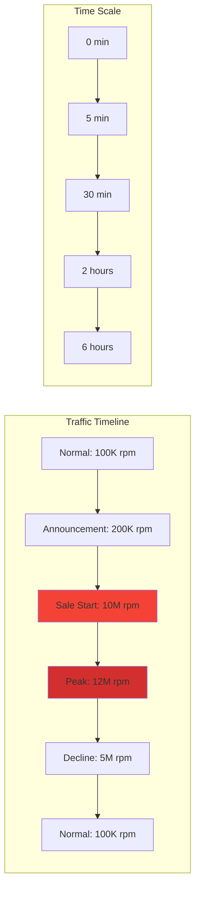
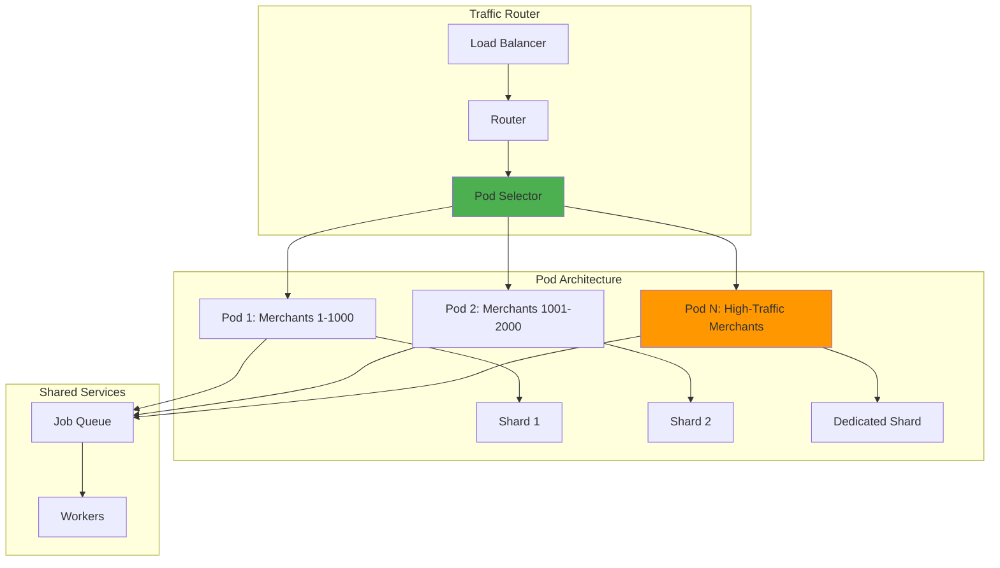
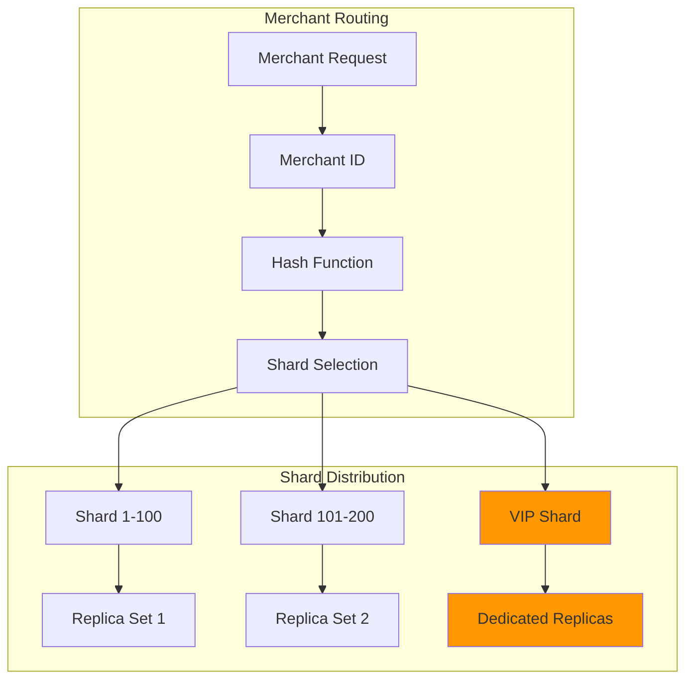
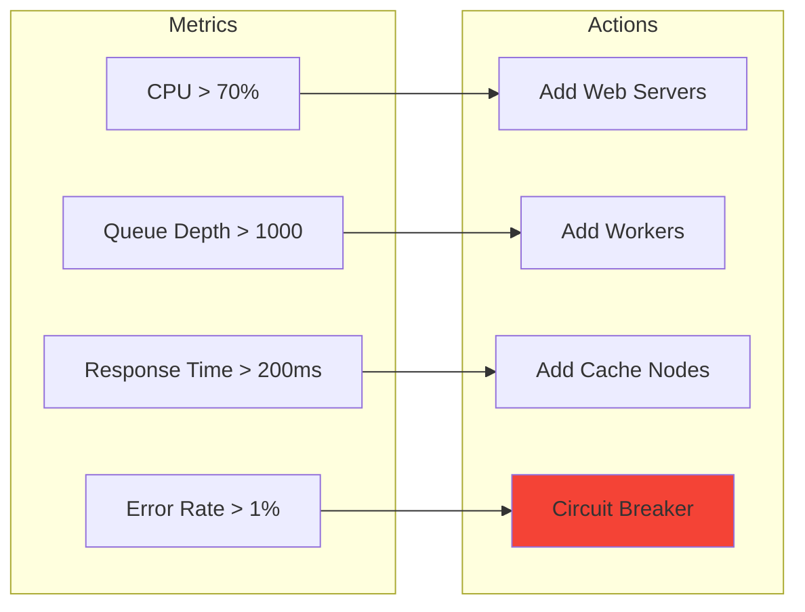

# Shopify Flash Sales: Handling Black Friday Traffic Spikes

!!! success "Excellence Badge"
    🥈 **Silver Tier**: Proven patterns with careful trade-off management

!!! abstract "Quick Facts"
    | Metric | Value |
    |--------|-------|
    | **Peak Traffic** | 10M+ requests/minute |
    | **Merchants** | 1.7M+ stores |
    | **Peak Checkouts** | 40K+/minute |
    | **Traffic Multiplier** | 100x normal |
    | **Reliability** | 99.98% uptime |

## Executive Summary

Shopify powers over 1.7 million merchants, many of whom run flash sales that can generate 100x normal traffic within minutes. During Black Friday 2021, Shopify processed over $6.3 billion in sales, handling peaks of 40,000+ checkouts per minute. This case study examines how Shopify's pod-based architecture and queue-driven processing enable them to handle these massive spikes while maintaining sub-100ms response times.

## The Challenge

### Black Friday Traffic Pattern



### Multi-Tenant Complexity

| Challenge | Impact | Solution Required |
|-----------|---------|-------------------|
| **Noisy Neighbors** | One merchant affects others | Pod isolation |
| **Traffic Spikes** | 100x in seconds | Auto-scaling + queues |
| **Database Load** | Connection exhaustion | Sharding + pooling |
| **Cache Stampedes** | Thundering herd | Intelligent warming |
| **Cost Control** | 100x infrastructure | Elastic scaling |

## Architecture Overview

### Pod-Based Isolation



### Key Components

| Component | Purpose | Scale Strategy |
|-----------|---------|----------------|
| **Pods** | Merchant isolation | Pre-allocated for big merchants |
| **Job Queue** | Async processing | Scales with backlog |
| **Cache Layer** | Reduce DB load | Warm before sales |
| **CDN** | Static assets | Global distribution |
| **Database** | Merchant data | Sharded by merchant |

## Technical Deep Dive

### Traffic Prediction and Scaling

=== "Predictive Scaling"
    ```python
    class TrafficPredictor:
        def predict_capacity(self, merchant_id, sale_config):
            # Historical performance
            past_sales = self.get_merchant_history(merchant_id)
            baseline = self.calculate_baseline(past_sales)
            
            # Sale characteristics
            discount = sale_config.discount_percentage
            products = len(sale_config.products)
            marketing_reach = self.estimate_reach(merchant_id)
            
            # Calculate multiplier
            multiplier = (
                (1 + discount/100) * 
                log(products + 1) * 
                (marketing_reach / 1000)
            )
            
            # Predicted traffic
            predicted_peak = baseline * multiplier
            
            # Pre-scale resources
            return {
                'web_servers': ceil(predicted_peak / 10000),
                'workers': ceil(predicted_peak / 1000),
                'cache_size': predicted_peak * 0.1  # MB
            }
    ```

=== "Queue-Based Processing"
    ```ruby
    class CheckoutProcessor
      def process_checkout(order)
        # Quick validation
        return unless validate_inventory(order)
        
        # Queue for async processing
        CheckoutJob.perform_later(
          order_id: order.id,
          priority: calculate_priority(order),
          queue: select_queue(order.merchant_id)
        )
        
        # Return immediately
        { status: 'processing', order_id: order.id }
      end
      
      private
      
      def select_queue(merchant_id)
        # Isolate high-traffic merchants
        if high_traffic_merchant?(merchant_id)
          "critical_#{merchant_id % 10}"
        else
          "standard_#{merchant_id % 100}"
        end
      end
    end
    ```

=== "Cache Warming Strategy"
    ```python
    class CacheWarmer:
        def warm_for_sale(merchant_id, sale_start_time):
            # Start warming 30 minutes before
            schedule_time = sale_start_time - timedelta(minutes=30)
            
            # Identify hot data
            hot_products = self.get_sale_products(merchant_id)
            hot_customers = self.get_likely_customers(merchant_id)
            
            # Progressive warming
            with ThreadPool(max_workers=10) as pool:
                # Warm product data
                pool.map(self.warm_product, hot_products)
                
                # Warm inventory counts
                pool.map(self.warm_inventory, hot_products)
                
                # Warm customer sessions
                pool.map(self.warm_session, hot_customers)
            
            # Pre-render pages
            self.pre_render_pages(merchant_id, hot_products)
    ```

### Database Sharding Strategy



## Handling Traffic Spikes

### Real-Time Traffic Shaping

```python
class TrafficShaper:
    def __init__(self):
        self.limits = {}
        self.buckets = {}
    
    def should_accept(self, merchant_id, request_type):
        # Get merchant tier
        tier = self.get_merchant_tier(merchant_id)
        
        # Apply different limits by tier
        if tier == 'premium':
            limit = 10000  # requests per minute
        elif tier == 'standard':
            limit = 1000
        else:
            limit = 100
        
        # Token bucket algorithm
        bucket = self.get_bucket(merchant_id)
        if bucket.try_consume(1):
            return True
        
        # Graceful degradation
        if request_type == 'critical':
            # Borrow from future
            return bucket.try_consume_future(1)
        
        return False
```

### Queue Management

| Queue Type | Purpose | Processing Time | Priority |
|------------|---------|-----------------|----------|
| **Critical** | Checkouts | <1s | Highest |
| **Standard** | Inventory updates | <5s | High |
| **Bulk** | Analytics | <1min | Medium |
| **Deferred** | Emails | <5min | Low |

### Auto-Scaling Triggers



## Operational Preparation

### Black Friday Runbook

```yaml
black_friday_preparation:
  t_minus_30_days:
    - capacity_planning_review
    - load_test_at_2x_expected
    - identify_high_risk_merchants
  
  t_minus_7_days:
    - freeze_deployments
    - pre_scale_infrastructure
    - warm_caches_for_vip_merchants
  
  t_minus_1_day:
    - final_load_test
    - verify_auto_scaling
    - brief_on_call_team
  
  day_of:
    - war_room_activation
    - real_time_monitoring
    - manual_scaling_ready
```

### Load Testing Strategy

```python
class LoadTestSimulator:
    def simulate_flash_sale(self, config):
        # Gradual ramp-up
        for minute in range(config.duration_minutes):
            if minute < 5:
                # Pre-sale browsing
                load = config.baseline * 2
            elif minute == 5:
                # Sale starts - massive spike
                load = config.baseline * 100
            elif minute < 30:
                # Sustained high load
                load = config.baseline * 80
            else:
                # Gradual decline
                load = config.baseline * (80 - minute)
            
            self.generate_traffic(load)
            self.verify_performance()
```

## Performance Optimizations

### Caching Strategy

| Cache Level | Content | TTL | Hit Rate |
|-------------|---------|-----|----------|
| **CDN** | Static assets | 1 year | 99% |
| **Page Cache** | Product pages | 5 min | 85% |
| **API Cache** | Inventory counts | 1 sec | 60% |
| **Session Cache** | Cart data | 30 min | 95% |

### Database Optimizations

```sql
-- Prepared statements for hot paths
PREPARE get_inventory AS
  SELECT quantity, reserved 
  FROM inventory 
  WHERE product_id = $1 
  FOR UPDATE SKIP LOCKED;

-- Partial indexes for flash sales
CREATE INDEX idx_flash_sale_products 
ON products(id) 
WHERE flash_sale = true 
AND sale_start <= NOW() 
AND sale_end >= NOW();
```

## Lessons Learned

### What Worked Well

✅ **Successes**
- Pod isolation prevented merchant interference
- Queue-based processing absorbed spikes
- Pre-warming caches reduced cold starts
- Auto-scaling handled 100x traffic

### Areas for Improvement

❌ **Challenges**
- Some queue backlogs during initial spike
- Cache invalidation caused temporary inconsistencies
- Monitoring systems struggled with data volume
- Cost overruns from over-provisioning

### Best Practices Developed

!!! tip "Flash Sale Best Practices"
    1. **Isolate by merchant** - Prevent noisy neighbor problems
    2. **Queue everything possible** - Absorb spikes gracefully
    3. **Warm caches aggressively** - Cold caches kill performance
    4. **Practice runs essential** - Test with real merchant data
    5. **Over-provision initially** - Scale down is easier than up

## Implementation Guide

### For Your Platform

1. **Implement Pod Architecture**
   ```python
   def assign_merchant_to_pod(merchant_id, traffic_profile):
       if traffic_profile == 'high':
           return f"dedicated_pod_{merchant_id}"
       else:
           return f"shared_pod_{merchant_id % 100}"
   ```

2. **Build Queue Infrastructure**
   - Separate queues by priority
   - Implement backpressure
   - Monitor queue depths

3. **Design Caching Strategy**
   - Multi-level caches
   - Intelligent invalidation
   - Pre-warming capabilities

### Monitoring Checklist

- [ ] Real-time traffic dashboard
- [ ] Queue depth monitoring
- [ ] Cache hit rate tracking
- [ ] Database connection pooling
- [ ] Auto-scaling triggers
- [ ] Cost tracking alerts
- [ ] Error rate monitoring
- [ ] Customer experience metrics

## Trade-off Decisions

### Architecture Choices

| Decision | Choice | Trade-off |
|----------|---------|------------|
| **Processing Model** | Async queues | Latency for reliability |
| **Isolation** | Pod-based | Complexity for stability |
| **Scaling** | Auto-scaling | Cost for availability |
| **Caching** | Aggressive | Consistency for performance |

## Related Resources

- [Queue-based Load Leveling Pattern](../pattern-library/scaling/queues-streaming.md)
- [Auto-scaling Pattern](../pattern-library/scaling/auto-scaling.md)
- [Bulkhead Pattern](../pattern-library/resilience/bulkhead.md)
- [Shopify Engineering Blog](https://shopify.engineering/)

---

*"Black Friday isn't a day, it's a distributed systems final exam." - Shopify Engineering*