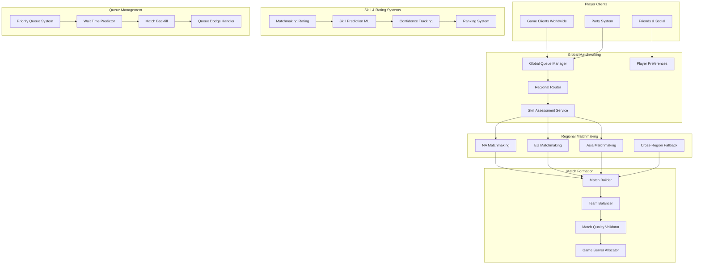
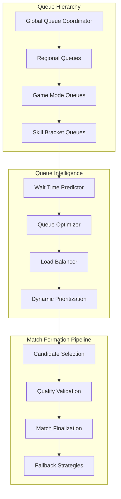

# Global Matchmaking Systems

## System Overview

Modern multiplayer games require sophisticated matchmaking systems that pair millions of players into fair, engaging matches across the globe. These systems must consider skill levels, connection quality, game mode preferences, and social factors while minimizing wait times and maximizing match quality for games like League of Legends, Dota 2, and Overwatch.

### Scale & Complexity
- **Active Players**: 100M+ monthly active users
- **Daily Matches**: 50M+ matches created globally
- **Queue Processing**: 1M+ concurrent players in matchmaking queues
- **Regional Coverage**: 15+ global regions with sub-region optimization
- **Average Wait Time**: <2 minutes for 90% of players

## Architecture Overview



## Key Architectural Challenges

### 1. Skill-Based Matchmaking (SBMM)

**Challenge**: Creating fair matches by accurately assessing player skill and predicting match outcomes.

**Solution Architecture**:
- Multi-dimensional skill assessment beyond simple win/loss
- Uncertainty-aware rating systems that adapt over time
- Machine learning for skill prediction and match outcome modeling
- Role-specific skill tracking for team-based games

**Implementation**:
```python
class AdvancedSkillSystem:
    def __init__(self):
        self.base_mmr = TrueSkillRating()
        self.role_skills = {}  # Tank, DPS, Support skills
        self.performance_analyzer = PerformanceMLModel()
        self.meta_analyzer = MetaGameAnalyzer()
    
    def calculate_player_skill(self, player_id, game_mode, role=None):
        """
        Multi-faceted skill calculation
        """
        # Base MMR from wins/losses
        base_skill = self.base_mmr.get_rating(player_id)
        
        # Role-specific adjustments
        if role and role in self.role_skills:
            role_modifier = self.role_skills[role].get_rating(player_id)
            base_skill.mu += (role_modifier.mu - base_skill.mu) * 0.3
        
        # Performance-based adjustments
        recent_performance = self.get_recent_performance(player_id, games=20)
        performance_score = self.performance_analyzer.evaluate_performance(
            recent_performance, game_mode, role
        )
        
        # Adjust for current meta
        meta_adjustment = self.meta_analyzer.get_player_meta_score(
            player_id, self.get_current_meta()
        )
        
        # Combine all factors
        final_skill = SkillRating(
            mu=base_skill.mu + (performance_score * 50) + (meta_adjustment * 25),
            sigma=base_skill.sigma,
            timestamp=time.time()
        )
        
        return final_skill
    
    def predict_match_quality(self, team_a_players, team_b_players, game_mode):
        """
        Predict the quality and fairness of a potential match
        """
        team_a_skills = [self.calculate_player_skill(p, game_mode) for p in team_a_players]
        team_b_skills = [self.calculate_player_skill(p, game_mode) for p in team_b_players]
        
        # Calculate team strength
        team_a_strength = self.calculate_team_strength(team_a_skills, team_a_players)
        team_b_strength = self.calculate_team_strength(team_b_skills, team_b_players)
        
        # Predict win probability
        win_probability = self.trueskill_win_probability(team_a_strength, team_b_strength)
        
        # Calculate match quality metrics
        quality_metrics = {
            'skill_balance': 1.0 - abs(0.5 - win_probability) * 2,  # 0-1 scale
            'uncertainty': self.calculate_uncertainty(team_a_skills + team_b_skills),
            'role_balance': self.calculate_role_balance(team_a_players, team_b_players),
            'synergy_score': self.calculate_team_synergy(team_a_players, team_b_players)
        }
        
        # Combined quality score
        overall_quality = (
            quality_metrics['skill_balance'] * 0.4 +
            quality_metrics['role_balance'] * 0.3 +
            quality_metrics['synergy_score'] * 0.2 +
            (1.0 - quality_metrics['uncertainty']) * 0.1
        )
        
        return {
            'quality_score': overall_quality,
            'win_probability': win_probability,
            'metrics': quality_metrics
        }
```

### 2. Global Queue Management

**Challenge**: Managing millions of concurrent players across different regions, game modes, and skill levels.

**Solution**: Hierarchical queue system with intelligent routing and dynamic prioritization.



**Queue Management Implementation**:
```go
type MatchmakingQueue struct {
    players          map[string]*PlayerEntry
    skillBrackets    map[SkillRange]*SkillQueue
    waitTimeTracker  *WaitTimePredictor
    matchBuilder     *MatchBuilder
    mutex            sync.RWMutex
}

type PlayerEntry struct {
    PlayerID      string
    Skill         SkillRating
    Preferences   MatchPreferences
    PartyMembers  []string
    QueueTime     time.Time
    Priority      int
}

func (q *MatchmakingQueue) AddPlayer(player *PlayerEntry) error {
    q.mutex.Lock()
    defer q.mutex.Unlock()
    
    // Determine skill bracket
    bracket := q.getSkillBracket(player.Skill)
    
    // Add to appropriate skill queue
    q.skillBrackets[bracket].AddPlayer(player)
    q.players[player.PlayerID] = player
    
    // Update wait time predictions
    q.waitTimeTracker.UpdatePredictions(bracket, len(q.skillBrackets[bracket].Players))
    
    // Trigger match formation check
    go q.checkForMatches(bracket)
    
    return nil
}

func (q *MatchmakingQueue) FindBestMatch(bracket SkillRange) *PotentialMatch {
    // Get candidates from skill bracket
    candidates := q.skillBrackets[bracket].GetCandidates(10) // Top 10 players
    
    if len(candidates) < 10 { // Not enough for 5v5
        // Expand search to adjacent brackets
        candidates = append(candidates, q.getAdjacentBracketCandidates(bracket)...)
    }
    
    // Try different team compositions
    bestMatch := &PotentialMatch{Quality: 0}
    
    for _, composition := range q.generateCompositions(candidates) {
        quality := q.evaluateMatchQuality(composition)
        
        if quality.OverallScore > bestMatch.Quality {
            bestMatch = &PotentialMatch{
                TeamA:     composition.TeamA,
                TeamB:     composition.TeamB,
                Quality:   quality.OverallScore,
                Metrics:   quality.Metrics,
            }
        }
    }
    
    return bestMatch
}

func (q *MatchmakingQueue) ProcessQueueCycle() {
    for bracket, skillQueue := range q.skillBrackets {
        // Age-based priority boost
        q.boostOldPlayers(skillQueue)
        
        // Attempt match formation
        if match := q.FindBestMatch(bracket); match != nil && match.Quality > 0.7 {
            q.finalizeMatch(match)
        }
        
        // Fallback for long-waiting players
        q.handleLongWaitPlayers(skillQueue)
    }
}
```

### 3. Regional Optimization & Latency

**Challenge**: Minimizing connection latency while maintaining match quality across global player base.

**Implementation**:
```yaml
Regional Strategy:
  Primary Regions:
    - North America West (California)
    - North America East (Virginia)
    - Europe West (Ireland)
    - Europe Nordic & East (Stockholm)
    - Asia Pacific (Singapore, Seoul, Tokyo)
    - Brazil (São Paulo)
    - Oceania (Sydney)
  
  Latency Optimization:
    - Player geo-location detection
    - ISP routing quality analysis
    - Real-time latency measurement
    - Dynamic server selection
    
  Cross-Region Fallback:
    - Triggered after 3+ minute wait
    - Maximum latency penalty: +30ms
    - Skill range relaxation: ±100 MMR
    - Quality threshold reduction: 20%
```

## Advanced Features

### 1. Machine Learning Match Quality

```python
class MatchQualityML:
    def __init__(self):
        self.quality_predictor = GradientBoostingRegressor()
        self.outcome_predictor = LogisticRegression()
        self.player_compatibility = NeuralNetwork()
        
    def train_models(self, historical_matches):
        """
        Train ML models on historical match data
        """
        features = []
        quality_labels = []
        outcome_labels = []
        
        for match in historical_matches:
            # Extract features
            match_features = self.extract_match_features(match)
            features.append(match_features)
            
            # Quality label (player satisfaction + game balance)
            quality_score = self.calculate_historical_quality(match)
            quality_labels.append(quality_score)
            
            # Outcome label (was match competitive?)
            outcome_labels.append(match.was_competitive)
        
        # Train models
        self.quality_predictor.fit(features, quality_labels)
        self.outcome_predictor.fit(features, outcome_labels)
        
    def extract_match_features(self, match_or_players):
        """
        Extract features for ML model
        """
        if isinstance(match_or_players, list):
            # Potential match
            players = match_or_players
            team_a = players[:len(players)//2]
            team_b = players[len(players)//2:]
        else:
            # Historical match
            team_a = match_or_players.team_a_players
            team_b = match_or_players.team_b_players
        
        features = {
            # Skill-based features
            'skill_difference': abs(self.average_skill(team_a) - self.average_skill(team_b)),
            'skill_variance_a': self.skill_variance(team_a),
            'skill_variance_b': self.skill_variance(team_b),
            'skill_uncertainty': self.average_uncertainty(team_a + team_b),
            
            # Role balance features
            'role_balance_score': self.calculate_role_balance_score(team_a, team_b),
            'tank_differential': abs(self.count_role(team_a, 'tank') - self.count_role(team_b, 'tank')),
            'dps_differential': abs(self.count_role(team_a, 'dps') - self.count_role(team_b, 'dps')),
            'support_differential': abs(self.count_role(team_a, 'support') - self.count_role(team_b, 'support')),
            
            # Social features
            'premade_advantage_a': self.calculate_premade_advantage(team_a),
            'premade_advantage_b': self.calculate_premade_advantage(team_b),
            'language_compatibility': self.calculate_language_compatibility(team_a + team_b),
            
            # Meta features
            'hero_synergy_a': self.calculate_hero_synergy(team_a),
            'hero_synergy_b': self.calculate_hero_synergy(team_b),
            'counter_pick_advantage': self.calculate_counter_advantages(team_a, team_b),
            
            # Network features
            'average_latency': self.average_latency(team_a + team_b),
            'latency_variance': self.latency_variance(team_a + team_b),
        }
        
        return list(features.values())
    
    def predict_match_success(self, potential_teams):
        """
        Predict if a match will be high quality and competitive
        """
        features = self.extract_match_features(potential_teams)
        
        quality_score = self.quality_predictor.predict([features])[0]
        competitive_probability = self.outcome_predictor.predict_proba([features])[0][1]
        
        return {
            'predicted_quality': quality_score,
            'competitive_probability': competitive_probability,
            'overall_score': (quality_score * 0.6) + (competitive_probability * 0.4)
        }
```

### 2. Dynamic Queue Adaptation

```python
class DynamicQueueManager:
    def __init__(self):
        self.queue_state = QueueState()
        self.adaptation_engine = AdaptationEngine()
        self.performance_monitor = PerformanceMonitor()
    
    def adapt_queue_parameters(self):
        """
        Dynamically adjust queue parameters based on current conditions
        """
        current_metrics = self.performance_monitor.get_current_metrics()
        
        # Adapt based on queue length
        if current_metrics.average_wait_time > 180:  # 3 minutes
            # Relax match quality requirements
            self.queue_state.quality_threshold *= 0.95
            self.queue_state.skill_range_expansion += 50
            
        elif current_metrics.average_wait_time < 60:  # 1 minute
            # Tighten match quality requirements
            self.queue_state.quality_threshold = min(0.9, self.queue_state.quality_threshold * 1.02)
            self.queue_state.skill_range_expansion = max(100, self.queue_state.skill_range_expansion - 25)
        
        # Adapt based on player population
        if current_metrics.total_players_queued > 500000:  # High population
            # Enable more restrictive matching
            self.queue_state.enable_strict_role_matching = True
            self.queue_state.enable_language_matching = True
            
        elif current_metrics.total_players_queued < 50000:  # Low population
            # Relax restrictions to form matches faster
            self.queue_state.enable_strict_role_matching = False
            self.queue_state.cross_region_enabled = True
        
        # Adapt based on time of day
        current_hour = datetime.now().hour
        if 2 <= current_hour <= 6:  # Low activity hours
            self.enable_night_mode_adaptations()
        
        # Adapt based on match quality feedback
        recent_quality = current_metrics.recent_match_quality_score
        if recent_quality < 0.7:
            # Matches have been poor quality, tighten requirements
            self.queue_state.minimum_team_balance += 0.05
            
    def enable_night_mode_adaptations(self):
        """
        Special adaptations for low-activity hours
        """
        self.queue_state.cross_region_enabled = True
        self.queue_state.quality_threshold *= 0.9
        self.queue_state.maximum_wait_time = 300  # 5 minutes max
        self.queue_state.skill_range_expansion += 100
```

## Real-World Examples

### League of Legends (Riot Games)

**Scale**: 150M+ monthly active players, 50+ million matches daily

**Matchmaking Innovations**:
- Position-based matchmaking with role selection
- Smurf detection and separate queues
- Autofill protection system
- Dynamic duo restrictions at high ranks

**Technical Architecture**:
```yaml
System Scale:
  - Peak concurrent: 8M+ players in queue
  - Match formation rate: 35,000 matches/minute
  - Regional deployment: 13 global regions
  - Average queue time: 1.5 minutes (90% of players)

Advanced Features:
  - Smurf detection: 95% accuracy
  - Role preference matching: 95% first choice rate
  - Dodge penalty system: Progressive timeouts
  - Team builder algorithm: 1000+ iterations per match
```

### Overwatch (Blizzard Entertainment)

**Innovation Focus**: Role-based matchmaking with 2-2-2 composition enforcement

**Architecture Highlights**:
- Separate skill ratings per role (Tank/Damage/Support)
- Priority pass system for faster queue times
- Endorsement system integration with matchmaking
- Competitive season resets and placement matches

**Performance Metrics**:
```yaml
Role Queue System:
  - Role distribution: 2 Tank, 2 Damage, 2 Support per team
  - Queue time optimization: Priority pass for underplayed roles
  - Skill rating per role: Independent progression tracking
  - Match quality improvement: 15% increase in balanced matches

Global Infrastructure:
  - Server regions: 10+ worldwide
  - Latency optimization: <50ms for 80% of players
  - Cross-play support: PC, Console unified matchmaking
  - Seasonal balance: Regular meta adjustments
```

### Dota 2 (Valve)

**Unique Features**: Behavior score integration and coaching system

**Technical Innovations**:
- Behavior score affects matchmaking pools
- OpenAI-powered coaching recommendations
- Advanced anti-griefing detection
- Spectator integration with match analysis

**System Characteristics**:
```yaml
Behavior Integration:
  - Behavior score range: 1-10,000
  - Communication quality tracking
  - Griefing detection and penalties
  - Reformed player rehabilitation system

Match Quality:
  - MMR range: Calibrated 0-8,000+ MMR
  - International ranked: Seasonal competitive mode
  - Party matchmaking: Balanced solo/party mixing
  - Coach integration: In-game guidance system
```

## Lessons Learned

### 1. Queue Time vs. Match Quality Trade-offs

**Challenge**: Players want both fast queues and fair matches.

**Solutions Applied**:
- Dynamic quality thresholds based on wait time
- Clear communication about estimated wait times
- Priority systems for roles in demand
- Cross-region fallbacks with latency warnings

### 2. Skill Assessment Accuracy

**Challenge**: Traditional rating systems lag behind actual skill changes.

**Solutions Applied**:
- Performance-based MMR adjustments
- Uncertainty modeling for new/returning players
- Role-specific skill tracking
- Machine learning for skill prediction

### 3. Social Factors in Matching

**Challenge**: Premade groups have coordination advantages.

**Solutions Applied**:
- Separate solo/group queues for competitive integrity
- Dynamic MMR adjustments for group size
- Communication advantage compensation
- Social skill factors in team building

## Future Considerations

### 1. AI-Powered Matchmaking

```yaml
Next-Generation Features:
  Personality Matching:
    - Player toxicity prediction
    - Communication style compatibility
    - Learning preference matching
    - Tilt resistance assessment
  
  Predictive Balancing:
    - Real-time meta adaptation
    - Individual player form tracking
    - Streak probability modeling
    - Optimal challenge level calculation
  
  Personalized Experience:
    - Individual queue optimization
    - Custom match quality preferences
    - Adaptive learning curve management
    - Motivational state consideration
```

### 2. Cross-Game Integration

- **Universal Skill System**: Transferable skills across game genres
- **Social Graph Matching**: Friends-of-friends matching
- **Cross-Platform Unified**: PC, Console, Mobile unified queues
- **Metaverse Integration**: Virtual reality and augmented reality support

### 3. Advanced Analytics

- **Real-time Sentiment Analysis**: Player mood detection from voice/text
- **Biometric Integration**: Stress level monitoring for match intensity
- **Predictive Churn Prevention**: Identifying at-risk players
- **Dynamic Content Adaptation**: Personalized game modes and rules

## Technology Stack

**Queue Management**:
- Apache Kafka for event streaming
- Redis Cluster for real-time queue state
- Apache Flink for stream processing
- Kubernetes for auto-scaling

**Machine Learning**:
- TensorFlow/PyTorch for skill prediction models
- Apache Spark for batch analytics
- MLflow for model lifecycle management
- Feature stores for real-time ML features

**Global Infrastructure**:
- Multi-region deployment with AWS/GCP
- Edge computing for latency optimization
- CDN for global content distribution
- Database sharding by region

**Monitoring & Analytics**:
- Prometheus and Grafana for system metrics
- ELK Stack for log analysis
- Custom dashboards for queue health
- A/B testing frameworks for algorithm optimization

This comprehensive matchmaking architecture demonstrates how modern games create fair, engaging matches for millions of players while balancing queue times, match quality, and player satisfaction across global gaming communities.