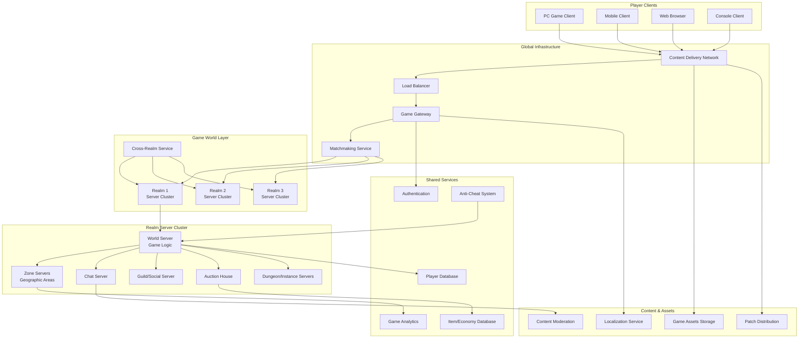
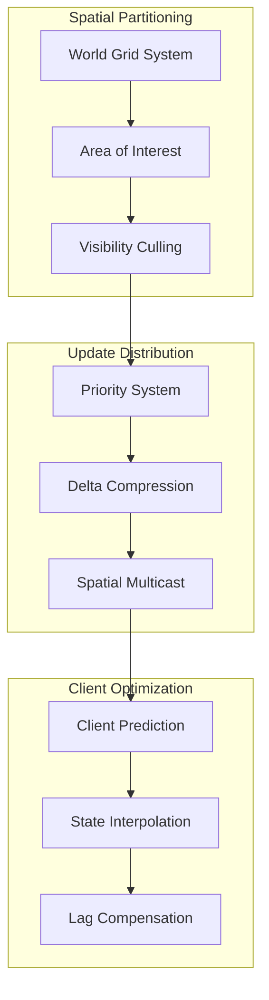
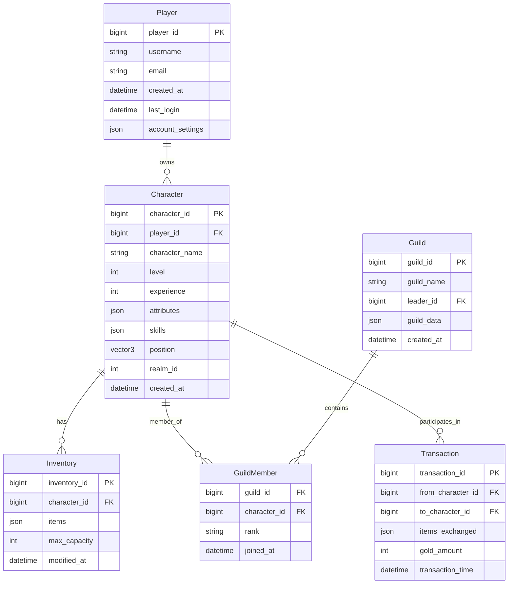
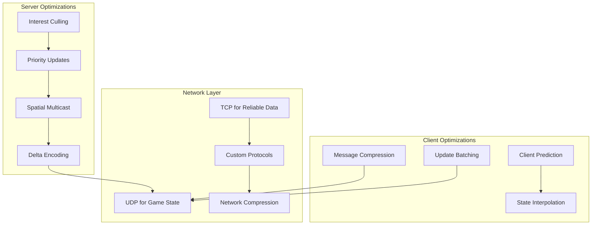
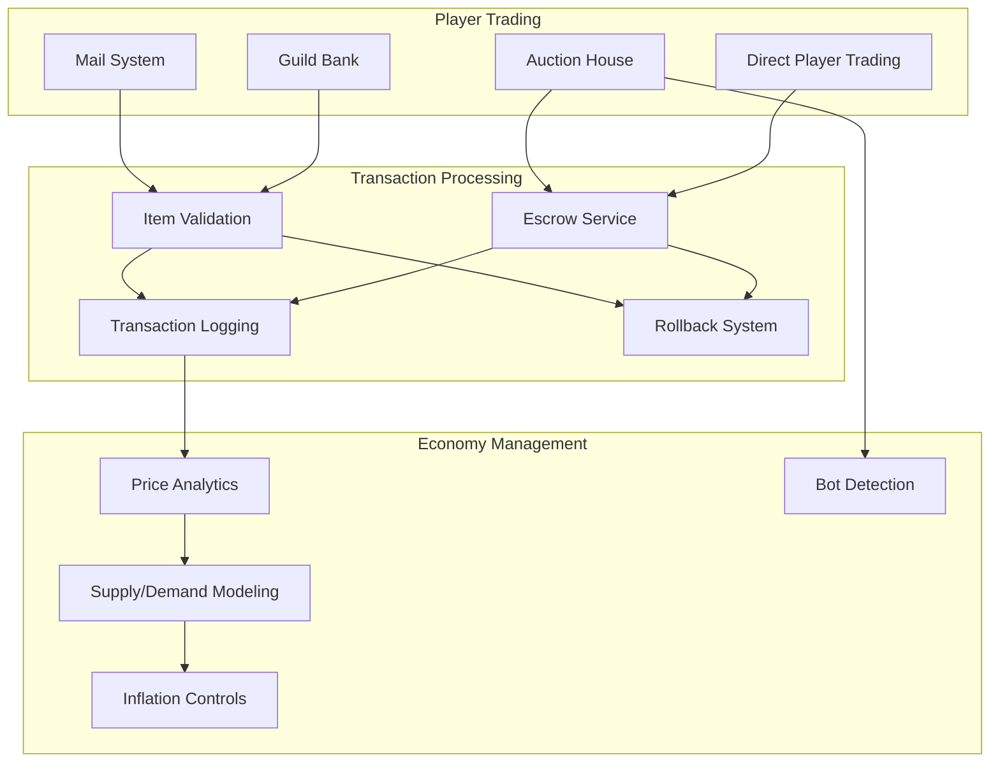

# Massively Multiplayer Online Game Architecture

## System Overview

MMO games create persistent virtual worlds where millions of players interact in real-time. These systems must handle massive concurrency, maintain consistent game state, prevent cheating, and provide seamless gameplay experiences across globally distributed player bases while supporting complex economies, guilds, and social systems.

### Scale & Complexity
- **Concurrent Players**: 10M+ simultaneous players worldwide
- **Game Servers**: 1000+ realm/server instances across regions
- **Daily Transactions**: 500M+ in-game actions and events
- **Persistent Storage**: 100TB+ player data, world state, and game assets
- **Uptime**: 99.9% availability with minimal maintenance windows

## Architecture Overview



## Key Architectural Challenges

### 1. Persistent World Management

**Challenge**: Maintaining consistent game world state across millions of players and hundreds of servers.

**Solution Architecture**:
- Hierarchical world partitioning with zone-based architecture
- Event sourcing for complete game state reconstruction
- Cross-realm technology for seamless player interaction
- Dynamic load balancing based on player density

**Implementation**:
```yaml
World Architecture:
  Realm Structure:
    - Population Capacity: 10,000-50,000 concurrent players per realm
    - Zone Division: 100-500 geographic zones per realm
    - Dynamic Sharding: Auto-split crowded zones
    - Cross-Realm Integration: Dungeons, battlegrounds, group finder

  State Management:
    - World State: Persistent world objects, NPCs, resource nodes
    - Player State: Character data, inventory, progress
    - Economy State: Item prices, auction house, player transactions
    - Social State: Guilds, friends lists, chat channels

  Consistency Model:
    - World Objects: Eventual consistency with 1-2 second convergence
    - Player Actions: Strong consistency for critical actions
    - Economy: ACID transactions for trades and purchases
    - Social Features: Eventual consistency acceptable
```

### 2. Massive Multiplayer Synchronization

**Challenge**: Synchronizing game state among thousands of players in the same area while maintaining low latency.

**Solution**: Interest management system with spatial partitioning and selective updates.



**Synchronization Implementation**:
```cpp
/ Spatial Interest Management System
class SpatialInterestManager {
private:
    struct GridCell {
        std::vector<PlayerId> players;
        std::vector<GameObjectId> objects;
        std::atomic<uint64_t> version{0};
    };
    
    std::unordered_map<GridCoord, GridCell> world_grid;
    static constexpr float CELL_SIZE = 100.0f;  / 100 units per cell
    static constexpr int INTEREST_RADIUS = 3;   / 3 cells radius

public:
    void UpdatePlayerPosition(PlayerId player_id, const Vector3& position) {
        GridCoord new_coord = WorldToGrid(position);
        GridCoord old_coord = player_positions[player_id];
        
        if (new_coord != old_coord) {
            / Remove from old cell
            RemovePlayerFromCell(player_id, old_coord);
            
            / Add to new cell
            AddPlayerToCell(player_id, new_coord);
            
            / Update interest set
            UpdatePlayerInterestSet(player_id, new_coord);
            
            player_positions[player_id] = new_coord;
        }
    }
    
    std::vector<PlayerId> GetPlayersInRange(PlayerId player_id, float range) {
        std::vector<PlayerId> nearby_players;
        GridCoord player_coord = player_positions[player_id];
        
        int grid_radius = static_cast<int>(std::ceil(range / CELL_SIZE));
        
        for (int x = -grid_radius; x <= grid_radius; ++x) {
            for (int y = -grid_radius; y <= grid_radius; ++y) {
                GridCoord check_coord = {
                    player_coord.x + x, 
                    player_coord.y + y
                };
                
                auto cell_it = world_grid.find(check_coord);
                if (cell_it != world_grid.end()) {
                    const auto& cell_players = cell_it->second.players;
                    nearby_players.insert(
                        nearby_players.end(),
                        cell_players.begin(), 
                        cell_players.end()
                    );
                }
            }
        }
        
        return nearby_players;
    }
};
```

### 3. Anti-Cheat & Security

**Challenge**: Preventing various forms of cheating in a client-server architecture with millions of players.

**Implementation**:
```yaml
Anti-Cheat Strategy:
  Server-Side Validation:
    - Movement validation: Speed, collision, physics checks
    - Action validation: Cooldowns, resource costs, prerequisites
    - Statistical analysis: Impossible achievements, outlier detection
    - Behavioral patterns: Bot detection, automated play identification
    
  Client Monitoring:
    - Memory integrity checks
    - Process monitoring and injection detection
    - Network packet validation
    - Timing analysis for automation detection
    
  Machine Learning Detection:
    - Player behavior modeling
    - Anomaly detection algorithms  
    - Pattern recognition for known cheats
    - Predictive models for cheat probability
```

## Data Architecture

### 1. Player Data Model



### 2. Game World Data Model

```sql
-- World State Schema
CREATE TABLE world_objects (
    object_id BIGINT PRIMARY KEY,
    realm_id INT NOT NULL,
    zone_id INT NOT NULL,
    object_type VARCHAR(50) NOT NULL,
    position_x FLOAT NOT NULL,
    position_y FLOAT NOT NULL,
    position_z FLOAT NOT NULL,
    rotation_x FLOAT DEFAULT 0,
    rotation_y FLOAT DEFAULT 0,
    rotation_z FLOAT DEFAULT 0,
    object_data JSON,
    spawn_time TIMESTAMP DEFAULT CURRENT_TIMESTAMP,
    respawn_timer INT DEFAULT NULL,
    INDEX idx_zone_position (realm_id, zone_id, position_x, position_y)
);

-- Resource Nodes (Mining, Herbs, etc.)
CREATE TABLE resource_nodes (
    node_id BIGINT PRIMARY KEY,
    realm_id INT NOT NULL,
    zone_id INT NOT NULL,
    resource_type VARCHAR(50) NOT NULL,
    position_x FLOAT NOT NULL,
    position_y FLOAT NOT NULL,
    position_z FLOAT NOT NULL,
    current_quantity INT NOT NULL,
    max_quantity INT NOT NULL,
    respawn_rate INT NOT NULL, -- seconds
    last_harvested TIMESTAMP,
    quality_level INT DEFAULT 1,
    INDEX idx_zone_resource (realm_id, zone_id, resource_type)
);

-- Dynamic Events and Quests
CREATE TABLE world_events (
    event_id BIGINT PRIMARY KEY,
    realm_id INT NOT NULL,
    event_type VARCHAR(50) NOT NULL,
    zone_ids JSON, -- Array of affected zones
    event_data JSON,
    start_time TIMESTAMP NOT NULL,
    end_time TIMESTAMP,
    max_participants INT DEFAULT NULL,
    current_participants INT DEFAULT 0,
    event_status ENUM('scheduled', 'active', 'completed', 'cancelled') DEFAULT 'scheduled',
    INDEX idx_realm_time (realm_id, start_time),
    INDEX idx_status_time (event_status, start_time)
);
```

## Performance Optimization

### 1. Network Optimization



**Network Performance Metrics**:
```yaml
Network Optimization:
  Bandwidth Usage:
    - Average per player: 5-15 KB/s
    - Peak per player: 30-50 KB/s during combat
    - Total server bandwidth: 500 GB/s for 10M players
    
  Latency Targets:
    - Movement updates: <100ms
    - Combat actions: <50ms
    - Chat messages: <200ms
    - Economy transactions: <500ms
    
  Optimization Techniques:
    - Delta compression: 70% bandwidth reduction
    - Interest culling: 90% message reduction
    - Client prediction: Eliminates perceived lag
    - Adaptive quality: Adjusts based on connection
```

### 2. Database Performance

```python
## High-Performance Game Database Layer
class GameDatabaseManager:
    def __init__(self):
        self.read_replicas = DatabasePool('read-replicas', size=10)
        self.write_master = DatabasePool('write-master', size=5)
        self.cache_layer = RedisCluster()
        self.analytics_db = ClickHouseCluster()
    
    async def get_player_data(self, player_id):
        # Try cache first
        cache_key = f"player:{player_id}"
        cached_data = await self.cache_layer.get(cache_key)
        
        if cached_data:
            return json.loads(cached_data)
        
        # Query read replica
        async with self.read_replicas.acquire() as conn:
            player_data = await conn.fetch("""
                SELECT p.*, c.character_id, c.character_name, c.level
                FROM players p
                LEFT JOIN characters c ON p.player_id = c.player_id
                WHERE p.player_id = $1
            """, player_id)
        
        # Cache for future requests
        await self.cache_layer.setex(
            cache_key, 300, json.dumps(player_data)
        )
        
        return player_data
    
    async def update_player_position(self, character_id, position, zone_id):
        # Update cache immediately
        cache_key = f"position:{character_id}"
        position_data = {
            'x': position.x,
            'y': position.y, 
            'z': position.z,
            'zone_id': zone_id,
            'timestamp': time.time()
        }
        await self.cache_layer.setex(cache_key, 60, json.dumps(position_data))
        
        # Async database update
        async with self.write_master.acquire() as conn:
            await conn.execute("""
                UPDATE characters 
                SET position_x = $1, position_y = $2, position_z = $3, 
                    zone_id = $4, last_updated = NOW()
                WHERE character_id = $5
            """, position.x, position.y, position.z, zone_id, character_id)
        
        # Analytics tracking
        await self.analytics_db.insert('player_movements', {
            'character_id': character_id,
            'position_x': position.x,
            'position_y': position.y,
            'position_z': position.z,
            'zone_id': zone_id,
            'timestamp': datetime.utcnow()
        })
```

## Real-World Examples

### World of Warcraft (Blizzard Entertainment)

**Scale**: 100M+ lifetime accounts, persistent world since 2004

**Architecture Innovations**:
- Realm-based sharding with cross-realm technology
- Layering system for dynamic population management
- Instance servers for dungeons and raids
- Advanced anti-cheat with Warden client monitoring

**Technical Achievements**:
```yaml
Performance Metrics:
  - Server capacity: 15,000+ concurrent players per realm
  - Database size: 1.3PB+ of player data
  - Daily transactions: 2B+ player actions
  - Global infrastructure: 50+ data centers worldwide

Innovation Timeline:
  - 2004: Original realm-based architecture
  - 2010: Cross-realm dungeons and battlegrounds
  - 2016: Legion's dynamic scaling and sharding
  - 2020: Shadowlands' level squish and stat restructuring
  - 2023: Classic era servers with modern infrastructure
```

### Final Fantasy XIV (Square Enix)

**Scale**: 25M+ registered players, critical acclaim for story and stability

**Architecture Highlights**:
- Data center grouping with world visit system
- Robust instancing for story content
- Cross-platform play (PC, PlayStation, mobile)
- Advanced housing system with persistent decorations

**Technical Features**:
```yaml
Server Architecture:
  - Logical data centers: 10 worldwide regions
  - Worlds per data center: 8-10 worlds
  - Cross-world functionality: Duties, party finder, linkshells
  - Instance servers: Separate infrastructure for instanced content

Stability Focus:
  - Planned maintenance: Weekly 4-hour windows
  - Emergency maintenance: <2 hours average
  - Server stability: 99.9% uptime target
  - Queue system: Handles 50,000+ concurrent login attempts
```

### Guild Wars 2 (ArenaNet)

**Scale**: 15M+ registered accounts, dynamic event system

**Innovation Focus**:
- Megaserver technology for dynamic population balancing
- Event-driven world with no traditional quests
- World vs. World large-scale PvP (500+ players)
- Horizontal progression system

**Technical Implementation**:
```yaml
Megaserver System:
  - Dynamic instance creation based on population
  - Preference matching: Friends, guild members, language
  - Overflow systems: Seamless transitions between instances
  - Event scaling: Content adapts to player count automatically

Performance Characteristics:
  - Map capacity: 100-150 players per instance
  - Event participation: Scales from 1 to 100+ players
  - WvW battles: 500+ players across multiple maps
  - Real-time combat: Sub-100ms response times
```

## Advanced Features

### 1. Dynamic Content Systems

```python
## Dynamic Event System
class DynamicEventManager:
    def __init__(self):
        self.event_templates = EventTemplateRegistry()
        self.world_state = WorldStateManager()
        self.player_analytics = PlayerAnalytics()
    
    async def evaluate_event_conditions(self, zone_id):
        """
        Evaluate if conditions are met for dynamic events
        """
        zone_state = await self.world_state.get_zone_state(zone_id)
        player_activity = await self.player_analytics.get_zone_activity(zone_id)
        
        # Check various triggers
        triggers = {
            'player_population': player_activity.current_players > 50,
            'resource_depletion': zone_state.resource_availability < 0.3,
            'time_since_last_event': zone_state.last_event_time > 3600,
            'player_level_distribution': player_activity.average_level > 30
        }
        
        # Find matching event templates
        eligible_events = []
        for template in self.event_templates.get_zone_events(zone_id):
            if self.check_event_requirements(template, triggers, zone_state):
                eligible_events.append(template)
        
        return eligible_events
    
    async def spawn_dynamic_event(self, event_template, zone_id):
        """
        Spawn a dynamic event in the game world
        """
        event_instance = await self.create_event_instance(event_template, zone_id)
        
        # Notify nearby players
        nearby_players = await self.world_state.get_zone_players(zone_id)
        for player_id in nearby_players:
            await self.notify_player_of_event(player_id, event_instance)
        
        # Start event logic
        await self.start_event_logic(event_instance)
        
        # Schedule cleanup
        await self.schedule_event_cleanup(event_instance)
        
        return event_instance.event_id
```

### 2. Economy & Trading Systems



## Lessons Learned

### 1. Scalability Challenges

**Challenge**: Player population can vary dramatically, from thousands to millions.

**Solutions Applied**:
- Horizontal scaling with auto-provisioning of game servers
- Dynamic sharding and layering based on player density
- Cross-realm technology to balance populations
- Queue systems with estimated wait times

### 2. Player Retention

**Challenge**: Keeping players engaged in a persistent world over months and years.

**Solutions Applied**:
- Dynamic content generation to keep the world fresh
- Regular content updates with seasonal events
- Social systems to build communities (guilds, friends)
- Progression systems that provide long-term goals

### 3. Technical Debt Management

**Challenge**: Games evolve over decades, accumulating technical debt.

**Solutions Applied**:
- Incremental architecture modernization
- API versioning for backward compatibility
- Feature flags for gradual rollouts
- Comprehensive monitoring and observability

## Future Considerations

### 1. Cloud-Native MMO Architecture

```yaml
Next-Generation Architecture:
  Containerization:
    - Microservices for each game system
    - Kubernetes orchestration for scaling
    - Service mesh for inter-service communication
    - Istio for traffic management and security
    
  Serverless Components:
    - Lambda functions for event processing
    - Auto-scaling based on player demand
    - Cost optimization for variable workloads
    - Global edge computing for low latency
    
  AI Integration:
    - Procedural content generation
    - Dynamic difficulty adjustment
    - Intelligent NPC behavior
    - Automated game balancing
```

### 2. Cross-Platform & Cross-Game Integration

- **Universal Player Identity**: Single identity across multiple games
- **Cross-Game Asset Transfer**: NFTs and blockchain integration
- **Shared Virtual Economies**: Items and currency across game boundaries  
- **Metaverse Integration**: Seamless transitions between game worlds

### 3. Advanced Analytics & AI

- **Player Behavior Prediction**: AI to predict player churn and preferences
- **Dynamic Balancing**: Real-time game balance adjustments
- **Personalized Content**: AI-generated quests and storylines
- **Advanced Anti-Cheat**: Machine learning for sophisticated cheat detection

## Technology Stack

**Game Engine & Framework**:
- Unreal Engine 5 or Unity for client development
- Custom C++ servers for performance-critical components
- Erlang/Elixir for fault-tolerant distributed systems
- Go/Rust for high-performance microservices

**Databases & Storage**:
- PostgreSQL with read replicas for player data
- Redis Cluster for caching and session management
- ClickHouse for analytics and time-series data
- S3/MinIO for asset storage and distribution

**Infrastructure & DevOps**:
- Kubernetes for container orchestration
- Istio service mesh for microservices communication
- Prometheus and Grafana for monitoring
- ELK Stack for centralized logging

**Networking & Communication**:
- Custom UDP protocols for real-time game state
- WebSocket for web client support
- Apache Kafka for event streaming
- gRPC for inter-service communication

This comprehensive MMO architecture demonstrates how to build persistent virtual worlds that can support millions of concurrent players while maintaining the performance, reliability, and engaging gameplay experiences that modern players expect from massively multiplayer online games.