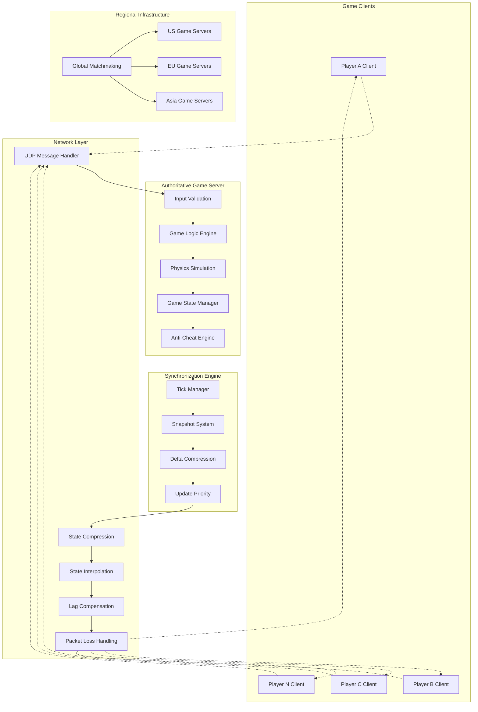
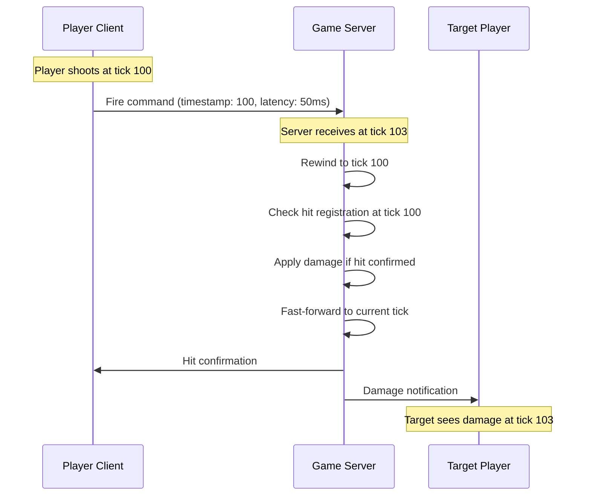

# Real-time Game State Synchronization

## System Overview

Competitive multiplayer games like Counter-Strike, Valorant, and Fortnite require precise real-time synchronization of game state across all players. These systems must handle high-frequency updates, compensate for network latency, prevent cheating, and maintain fairness while supporting matches with dozens to hundreds of players at sub-50ms latencies.

### Scale & Complexity
- **Match Concurrency**: 1M+ simultaneous matches globally
- **Players per Match**: 2-100 players depending on game mode
- **Tick Rate**: 64-128Hz server update frequency
- **Latency Target**: <50ms for competitive games, <100ms for casual
- **Anti-cheat Coverage**: 100% server-authoritative validation

## Architecture Overview



## Key Architectural Challenges

### 1. Server-Authoritative Architecture

**Challenge**: Maintaining game state integrity while providing responsive gameplay across varying network conditions.

**Solution Architecture**:
- Deterministic server simulation with client prediction
- Server reconciliation for client state corrections
- Rollback networking for seamless error correction
- Authoritative validation of all player actions

**Implementation**:
```cpp
// Server-Authoritative Game State Manager
class AuthoritativeGameServer {
private:
    GameState server_state;
    std::unordered_map<PlayerId, ClientState> client_states;
    std::queue<GameSnapshot> snapshot_history;
    static constexpr int TICK_RATE = 64;  // 64 FPS server
    static constexpr int SNAPSHOT_BUFFER_SIZE = 256;

public:
    void ProcessClientInput(PlayerId player_id, const PlayerInput& input, uint32_t client_tick) {
        // Validate input against server state
        if (!ValidateInput(input, client_tick, player_id)) {
            // Send correction to client
            SendStateCorrection(player_id, server_state);
            return;
        }
        
        // Apply input to server simulation
        ApplyInputToSimulation(player_id, input, client_tick);
        
        // Update player state
        UpdatePlayerState(player_id, input.timestamp);
        
        // Check for conflicts with other players
        ResolveStateConflicts(player_id);
    }
    
    void ServerTick() {
        auto tick_start = std::chrono::high_resolution_clock::now();
        
        // Run physics simulation
        physics_engine.Step(1.0f / TICK_RATE);
        
        // Update game logic
        game_logic.Update(1.0f / TICK_RATE);
        
        // Create snapshot of current state
        GameSnapshot snapshot = CreateSnapshot();
        snapshot_history.push(snapshot);
        
        // Maintain snapshot buffer size
        if (snapshot_history.size() > SNAPSHOT_BUFFER_SIZE) {
            snapshot_history.pop();
        }
        
        // Send state updates to clients
        BroadcastStateUpdate(snapshot);
        
        // Performance monitoring
        auto tick_duration = std::chrono::high_resolution_clock::now() - tick_start;
        UpdateTickMetrics(tick_duration);
    }
    
private:
    bool ValidateInput(const PlayerInput& input, uint32_t client_tick, PlayerId player_id) {
        // Anti-cheat validation
        auto& player_state = GetPlayerState(player_id);
        
        // Movement validation
        if (!ValidateMovement(input.movement, player_state.position, player_state.velocity)) {
            LogSuspiciousActivity(player_id, "Invalid movement");
            return false;
        }
        
        // Action validation (shooting, abilities, etc.)
        if (!ValidateAction(input.action, player_state, client_tick)) {
            LogSuspiciousActivity(player_id, "Invalid action");
            return false;
        }
        
        // Timing validation
        if (!ValidateInputTiming(input.timestamp, client_tick, player_id)) {
            LogSuspiciousActivity(player_id, "Invalid timing");
            return false;
        }
        
        return true;
    }
};
```

### 2. Lag Compensation System

**Challenge**: Providing fair gameplay despite varying network latencies between players.

**Solution**: Time-rewinding lag compensation with hit registration rollback.



**Lag Compensation Implementation**:
```cpp
class LagCompensationSystem {
private:
    struct HistoricalState {
        uint32_t tick;
        std::unordered_map<PlayerId, PlayerState> player_states;
        GameWorldState world_state;
    };
    
    std::deque<HistoricalState> state_history;
    static constexpr int MAX_COMPENSATION_MS = 200;
    static constexpr int TICK_RATE = 64;

public:
    bool ProcessHitscanShot(PlayerId shooter_id, const ShotInfo& shot, uint32_t client_tick) {
        // Calculate when the shot was fired on the client
        auto shooter_latency = GetPlayerLatency(shooter_id);
        uint32_t compensation_tick = client_tick - (shooter_latency * TICK_RATE / 1000);
        
        // Limit compensation to reasonable bounds
        uint32_t max_compensation = MAX_COMPENSATION_MS * TICK_RATE / 1000;
        uint32_t current_tick = GetCurrentTick();
        uint32_t min_tick = std::max(current_tick - max_compensation, 0u);
        compensation_tick = std::max(compensation_tick, min_tick);
        
        // Find the historical state
        HistoricalState* historical_state = FindHistoricalState(compensation_tick);
        if (!historical_state) {
            // State too old or not found
            return false;
        }
        
        // Perform hit detection in historical context
        auto hit_result = PerformHitDetection(
            shot, 
            historical_state->player_states,
            historical_state->world_state
        );
        
        if (hit_result.hit) {
            // Apply damage in current state
            ApplyDamage(hit_result.target_id, hit_result.damage, shooter_id);
            
            // Log for anti-cheat analysis
            LogHitRegistration(shooter_id, hit_result, compensation_tick, current_tick);
            
            return true;
        }
        
        return false;
    }
    
    void UpdateStateHistory(const GameState& current_state) {
        HistoricalState state;
        state.tick = GetCurrentTick();
        state.player_states = current_state.players;
        state.world_state = current_state.world;
        
        state_history.push_back(state);
        
        // Maintain buffer size
        uint32_t max_history_ticks = MAX_COMPENSATION_MS * TICK_RATE / 1000;
        while (state_history.size() > max_history_ticks) {
            state_history.pop_front();
        }
    }
};
```

### 3. Delta Compression & Networking

**Challenge**: Minimizing bandwidth usage while maintaining update frequency for smooth gameplay.

**Implementation**:
```yaml
Network Optimization Strategy:
  Delta Compression:
    - Only send changed data between snapshots
    - Bit-level packing for boolean flags
    - Quantization for position and rotation data
    - Prioritized updates based on relevance

  Packet Structure:
    - Header: Sequence number, acknowledgment, compression flags
    - Player Updates: Position, rotation, animation state, health
    - World Updates: Projectiles, effects, dynamic objects
    - Event Messages: Kills, objective updates, chat

  Bandwidth Targets:
    - Average: 8-15 KB/s per player
    - Peak: 30-50 KB/s during intense combat
    - Minimum: 3-5 KB/s for basic gameplay
```

## Performance Characteristics

### 1. Network Performance

```python
# Network Performance Monitor
class NetworkPerformanceMonitor:
    def __init__(self):
        self.player_metrics = {}
        self.server_metrics = ServerMetrics()
    
    def track_player_metrics(self, player_id, packet):
        if player_id not in self.player_metrics:
            self.player_metrics[player_id] = PlayerNetworkMetrics()
        
        metrics = self.player_metrics[player_id]
        
        # Update latency measurements
        if packet.type == PacketType.PING:
            metrics.update_latency(packet.timestamp)
        
        # Track packet loss
        metrics.update_packet_loss(packet.sequence_number)
        
        # Monitor jitter
        metrics.update_jitter(packet.timestamp)
        
        # Bandwidth tracking
        metrics.update_bandwidth(len(packet.data))
        
        # Quality assessment
        connection_quality = self.assess_connection_quality(metrics)
        
        if connection_quality < 0.7:  # Poor connection
            self.enable_adaptive_quality(player_id)
    
    def assess_connection_quality(self, metrics):
        """
        Assess connection quality based on multiple factors
        Returns 0.0-1.0 (poor to excellent)
        """
        latency_score = max(0, 1 - (metrics.average_latency - 20) / 80)
        loss_score = max(0, 1 - metrics.packet_loss_rate / 0.05)  # 5% loss = 0 score
        jitter_score = max(0, 1 - metrics.jitter / 20)  # 20ms jitter = 0 score
        
        return (latency_score + loss_score + jitter_score) / 3
    
    def enable_adaptive_quality(self, player_id):
        """
        Reduce quality for poor connections
        """
        settings = AdaptiveSettings()
        metrics = self.player_metrics[player_id]
        
        if metrics.average_latency > 100:
            settings.reduce_update_rate = True
            settings.increase_interpolation_time = True
        
        if metrics.packet_loss_rate > 0.02:  # 2% loss
            settings.enable_redundant_packets = True
            settings.increase_compression = True
        
        if metrics.jitter > 15:
            settings.increase_buffer_size = True
            settings.smooth_interpolation = True
        
        self.apply_adaptive_settings(player_id, settings)
```

### 2. Anti-Cheat Integration

```cpp
// Real-time Anti-Cheat System
class RealtimeAntiCheat {
private:
    struct PlayerAnalytics {
        std::vector<float> reaction_times;
        std::vector<Vector3> movement_pattern;
        std::map<WeaponId, AccuracyStats> weapon_accuracy;
        std::queue<InputEvent> input_history;
        float suspicion_score = 0.0f;
    };
    
    std::unordered_map<PlayerId, PlayerAnalytics> player_analytics;
    MLModel aim_bot_detector;
    MLModel wall_hack_detector;
    MLModel speed_hack_detector;

public:
    void AnalyzePlayerInput(PlayerId player_id, const PlayerInput& input) {
        auto& analytics = player_analytics[player_id];
        
        // Movement analysis
        AnalyzeMovement(player_id, input.movement, analytics);
        
        // Aim analysis
        if (input.action.type == ActionType::SHOOT) {
            AnalyzeAiming(player_id, input.action, analytics);
        }
        
        // Input timing analysis
        AnalyzeInputTiming(player_id, input, analytics);
        
        // Update suspicion score
        UpdateSuspicionScore(player_id, analytics);
        
        // Take action if threshold exceeded
        if (analytics.suspicion_score > SUSPICION_THRESHOLD) {
            HandleSuspiciousPlayer(player_id, analytics);
        }
    }
    
private:
    void AnalyzeAiming(PlayerId player_id, const Action& shoot_action, PlayerAnalytics& analytics) {
        // Calculate aim smoothness
        float aim_smoothness = CalculateAimSmoothness(shoot_action.target_direction);
        
        // Check for inhuman reaction times
        float reaction_time = CalculateReactionTime(player_id, shoot_action);
        analytics.reaction_times.push_back(reaction_time);
        
        // Statistical analysis
        if (analytics.reaction_times.size() > 50) {
            auto stats = CalculateReactionStats(analytics.reaction_times);
            
            // Flag impossibly fast reactions
            if (stats.average < 0.05f) {  // Less than 50ms average
                analytics.suspicion_score += 0.3f;
            }
            
            // Flag perfect accuracy patterns
            auto accuracy = analytics.weapon_accuracy[shoot_action.weapon_id];
            if (accuracy.headshot_percentage > 0.8f && analytics.reaction_times.size() > 100) {
                analytics.suspicion_score += 0.4f;
            }
        }
        
        // ML-based detection
        auto aim_features = ExtractAimFeatures(shoot_action, analytics);
        float aimbot_probability = aim_bot_detector.Predict(aim_features);
        
        if (aimbot_probability > 0.8f) {
            analytics.suspicion_score += 0.5f;
        }
    }
    
    void HandleSuspiciousPlayer(PlayerId player_id, const PlayerAnalytics& analytics) {
        // Log detailed analytics
        LogSuspiciousActivity(player_id, analytics);
        
        // Increase monitoring frequency
        SetHighPriorityMonitoring(player_id);
        
        // If very high suspicion, take immediate action
        if (analytics.suspicion_score > KICK_THRESHOLD) {
            KickPlayer(player_id, "Suspicious activity detected");
            
            // Flag account for further investigation
            FlagAccount(player_id, "Automated anti-cheat detection");
        }
    }
};
```

## Real-World Examples

### Counter-Strike: Global Offensive (Valve)

**Technical Specifications**:
- **Tick Rate**: 64Hz (matchmaking) / 128Hz (competitive)
- **Max Players**: 10 players per match
- **Server Authority**: 100% server-side validation
- **Anti-Cheat**: VAC (Valve Anti-Cheat) integration

**Architecture Highlights**:
```yaml
Networking:
  - UDP-based custom protocol
  - Lag compensation up to 200ms
  - Client-side prediction with server reconciliation
  - Delta compression for state updates

Performance:
  - Average latency: 30-80ms globally
  - Packet rate: 20-128 per second
  - Bandwidth: 8-24 KB/s per player
  - Jitter tolerance: <15ms for optimal play
```

### Valorant (Riot Games)

**Innovation Focus**:
- **128Hz Tick Rate**: Higher update frequency than most competitors
- **Advanced Anti-Cheat**: Vanguard kernel-level anti-cheat
- **Global Infrastructure**: Sub-35ms latency worldwide
- **Deterministic Netcode**: Precise hit registration

**Technical Achievements**:
```yaml
Server Performance:
  - Tick rate: 128Hz globally
  - Hit registration: <10ms processing time
  - Anti-cheat response: Real-time detection and banning
  - Global coverage: 33 data centers worldwide

Player Experience:
  - Latency target: <35ms for 70% of players
  - Hit registration accuracy: >99.5%
  - Cheat detection rate: <0.1% false positives
  - Match stability: 99.9% completion rate
```

### Fortnite Battle Royale (Epic Games)

**Scale Challenge**: 100 players per match with building mechanics

**Architecture Innovations**:
- **Hybrid Networking**: P2P for building, dedicated servers for combat
- **Dynamic Tick Rates**: Variable update frequency based on activity
- **Spatial Optimization**: Interest management for 100-player matches
- **Cross-Platform**: Unified netcode across PC, console, and mobile

**Performance Metrics**:
```yaml
Massive Scale:
  - Concurrent players: 100 per battle royale match
  - Map size: 8x8 km with destructible terrain
  - Building objects: 10,000+ concurrent structures
  - Global infrastructure: Auto-scaling to millions of matches

Optimization:
  - Interest culling: 90% reduction in irrelevant updates
  - LOD system: Distance-based detail reduction
  - Adaptive quality: Automatic adjustment for connection quality
  - Regional servers: <100ms latency for most players
```

## Advanced Techniques

### 1. Rollback Netcode

```cpp
// Fighting Game Rollback Netcode Implementation
class RollbackNetcode {
private:
    struct GameFrame {
        uint32_t frame_number;
        GameState state;
        std::vector<PlayerInput> inputs;
        uint32_t checksum;
    };
    
    std::deque<GameFrame> frame_history;
    static constexpr int MAX_ROLLBACK_FRAMES = 8;
    static constexpr int INPUT_DELAY = 2;  // 2 frames of input delay

public:
    void AdvanceFrame() {
        uint32_t current_frame = GetCurrentFrame();
        
        // Collect local and remote inputs
        auto inputs = CollectInputsForFrame(current_frame);
        
        // Check if we need to rollback
        int rollback_frame = CheckForRollback(inputs);
        
        if (rollback_frame >= 0) {
            // Rollback to the frame and simulate forward
            RollbackAndResimulate(rollback_frame, inputs);
        } else {
            // Normal simulation
            SimulateFrame(inputs);
        }
        
        // Store frame in history
        StoreFrame(current_frame, GetCurrentState(), inputs);
        
        // Clean up old frames
        MaintainFrameHistory();
    }
    
private:
    void RollbackAndResimulate(int rollback_frame, const std::vector<PlayerInput>& new_inputs) {
        // Restore state to rollback frame
        auto frame_it = std::find_if(frame_history.begin(), frame_history.end(),
            [rollback_frame](const GameFrame& frame) {
                return frame.frame_number == rollback_frame;
            });
        
        if (frame_it != frame_history.end()) {
            RestoreGameState(frame_it->state);
            
            // Resimulate frames from rollback point to current
            for (int frame = rollback_frame; frame <= GetCurrentFrame(); ++frame) {
                auto frame_inputs = GetInputsForFrame(frame, new_inputs);
                SimulateFrame(frame_inputs);
            }
        }
    }
    
    bool CompareInputs(const std::vector<PlayerInput>& inputs1, 
                      const std::vector<PlayerInput>& inputs2) {
        if (inputs1.size() != inputs2.size()) return false;
        
        for (size_t i = 0; i < inputs1.size(); ++i) {
            if (inputs1[i] != inputs2[i]) return false;
        }
        return true;
    }
};
```

### 2. Adaptive Networking

```python
class AdaptiveNetworkingManager:
    def __init__(self):
        self.player_profiles = {}
        self.network_conditions = NetworkConditionMonitor()
    
    def adapt_to_network_conditions(self, player_id):
        conditions = self.network_conditions.get_conditions(player_id)
        profile = self.get_or_create_profile(player_id)
        
        # Adapt update rate
        if conditions.latency > 150:
            profile.update_rate = 30  # Reduce from 64Hz to 30Hz
            profile.interpolation_time = 100  # Increase buffer
        elif conditions.latency < 50:
            profile.update_rate = 64  # Full rate
            profile.interpolation_time = 50  # Minimal buffer
        
        # Adapt compression
        if conditions.bandwidth_limited:
            profile.compression_level = 'high'
            profile.delta_threshold = 0.1  # Smaller deltas
        
        # Adapt prediction
        if conditions.packet_loss > 0.02:  # 2% loss
            profile.prediction_time = conditions.latency * 1.5
            profile.redundancy_enabled = True
        
        # Apply adaptive settings
        self.apply_profile(player_id, profile)
    
    def get_optimal_server_region(self, player_location):
        """
        Select optimal server based on predicted performance
        """
        candidates = self.get_available_regions()
        best_region = None
        best_score = float('inf')
        
        for region in candidates:
            # Predict latency based on geographic distance
            predicted_latency = self.predict_latency(player_location, region.location)
            
            # Factor in server load
            load_penalty = region.current_load * 10  # ms penalty per load %
            
            # Factor in routing quality
            routing_quality = self.get_routing_quality(player_location, region)
            
            total_score = predicted_latency + load_penalty + (100 - routing_quality)
            
            if total_score < best_score:
                best_score = total_score
                best_region = region
        
        return best_region
```

## Lessons Learned

### 1. Latency vs. Fairness Trade-offs

**Challenge**: Balancing responsive gameplay with fair play across different network conditions.

**Solutions Applied**:
- Lag compensation with reasonable limits (100-200ms max)
- Regional matchmaking to group similar latencies
- Adaptive quality settings for poor connections
- Transparent communication about network advantage

### 2. Anti-Cheat Integration

**Challenge**: Preventing cheats without impacting legitimate players.

**Solutions Applied**:
- Server-side validation for all critical actions
- Statistical analysis to detect inhuman performance
- Machine learning for pattern recognition
- Graduated responses (monitoring → kick → ban)

### 3. Mobile Network Challenges

**Challenge**: Supporting mobile players with variable network conditions.

**Solutions Applied**:
- Adaptive bitrate and update frequency
- Cellular network optimization
- Battery usage optimization
- Graceful degradation for poor connections

## Technology Stack

**Game Engine**:
- Custom C++ engines for maximum performance
- Unity/Unreal for rapid development
- Deterministic physics engines
- Cross-platform networking libraries

**Networking**:
- Custom UDP protocols for real-time data
- TCP for reliable messaging (chat, progression)
- WebRTC for browser-based games
- Protocol buffers for message serialization

**Infrastructure**:
- AWS GameLift or custom server orchestration
- Regional server deployment
- Auto-scaling based on player demand
- DDoS protection and attack mitigation

**Monitoring**:
- Real-time performance monitoring
- Player experience analytics
- Network quality measurement
- Anti-cheat detection logging

This comprehensive real-time synchronization architecture demonstrates how modern competitive games achieve the precise timing, fairness, and responsiveness that players expect from high-stakes multiplayer gaming experiences.