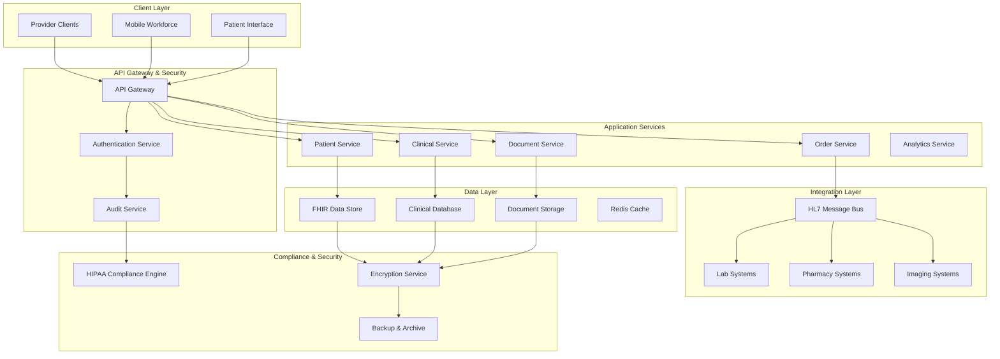
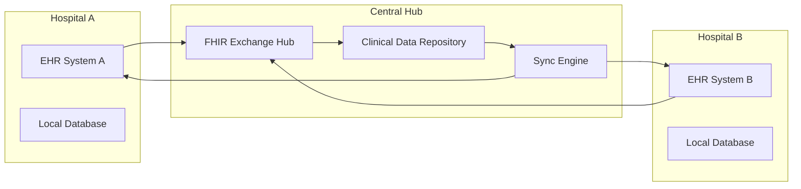
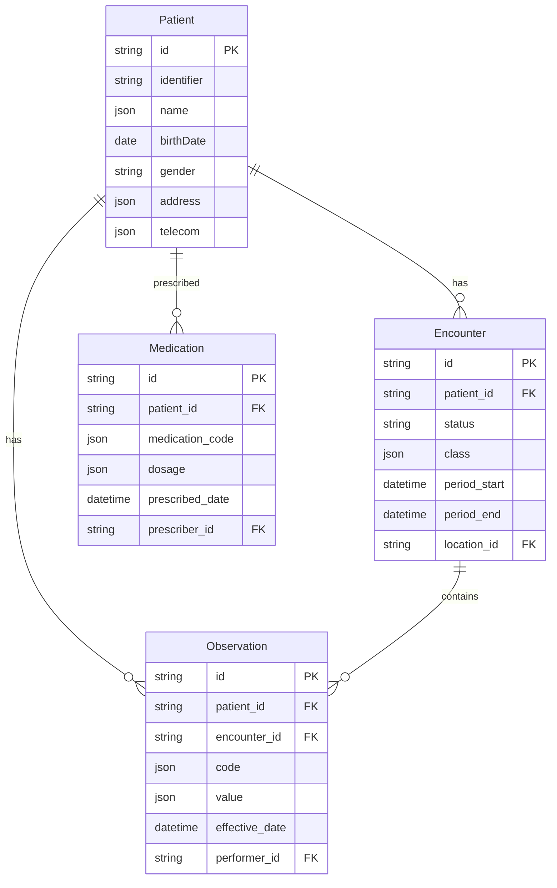
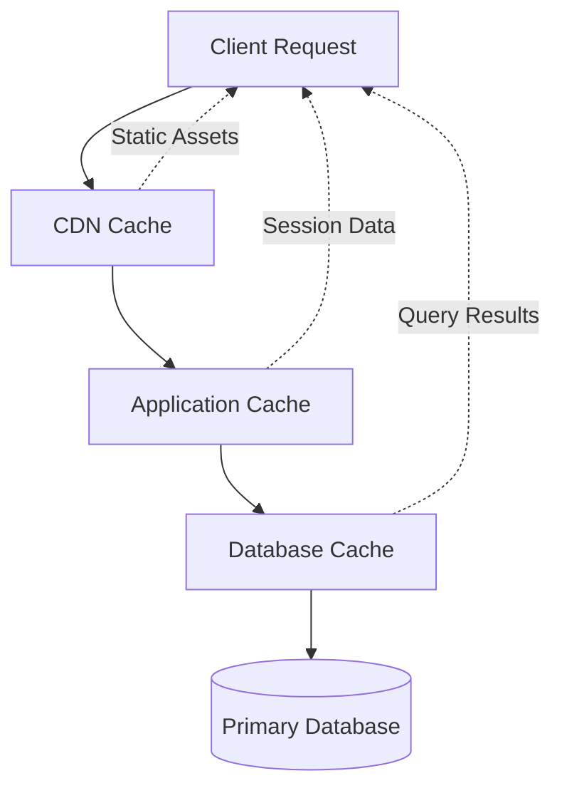
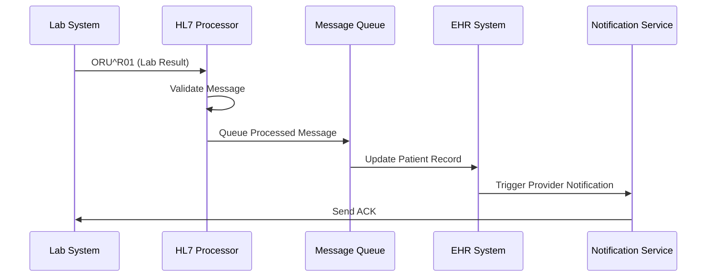
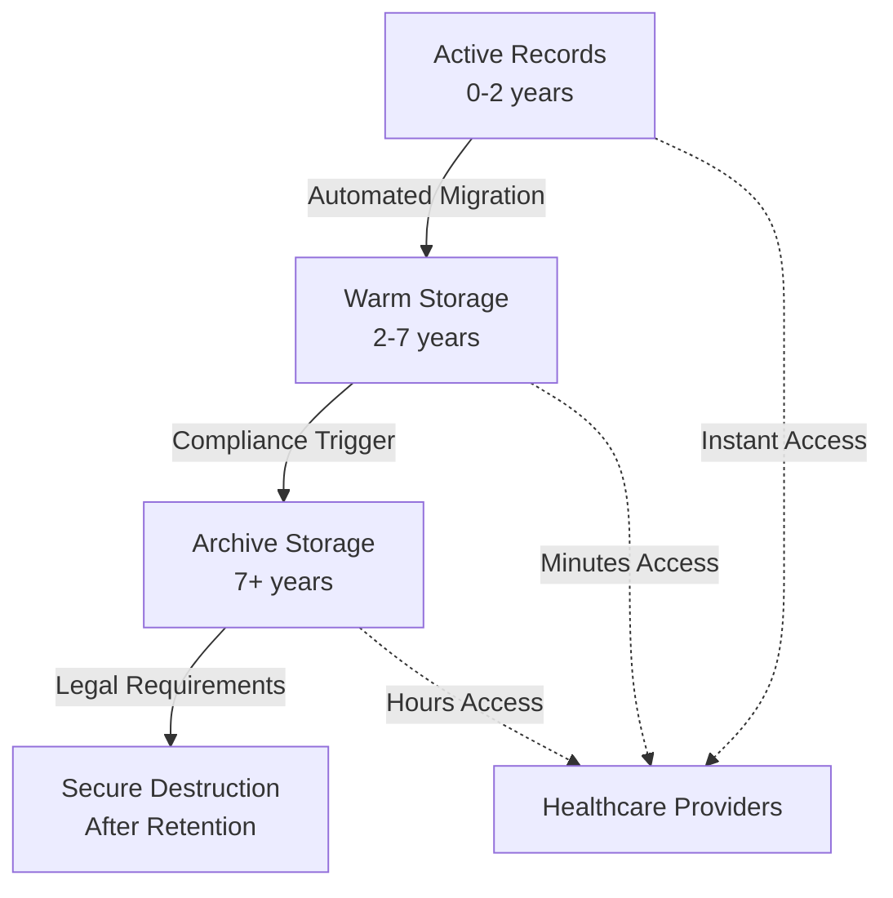

# Electronic Health Records (EHR) System

## System Overview

Electronic Health Records systems manage comprehensive patient health information across healthcare networks, supporting clinical decision-making while ensuring HIPAA compliance and data security at massive scale.

### Scale & Complexity
- **Patient Records**: 100M+ active patient records
- **Daily Transactions**: 50M+ clinical data updates
- **Concurrent Users**: 500K+ healthcare providers
- **Data Growth**: 2TB+ daily across structured/unstructured data
- **Uptime**: 99.99% availability requirement

## Architecture Overview



## Key Architectural Challenges

### 1. HIPAA Compliance & Data Security

**Challenge**: Protecting patient health information while enabling clinical workflows.

**Solution Architecture**:
- End-to-end encryption for data at rest and in transit
- Role-based access control (RBAC) with attribute-based permissions
- Zero-trust security model with continuous authentication
- Comprehensive audit logging for every data access

**Implementation**:
```yaml
Security Layers:
  - Network: VPC with private subnets, WAF protection
  - Application: JWT tokens, OAuth 2.0/OIDC
  - Data: AES-256 encryption, column-level encryption for PII
  - Access: Multi-factor authentication, session management
  
Audit Trail:
  - User actions: Login, data access, modifications
  - System events: Backup, restore, system changes
  - Data lineage: Track data from source to consumption
```

### 2. Multi-Hospital Data Synchronization

**Challenge**: Synchronizing patient data across multiple hospital systems while maintaining consistency.

**Solution**: Event-driven architecture with FHIR-compliant data exchange.



**Synchronization Strategy**:
- **Eventually Consistent**: Patient demographic updates
- **Strongly Consistent**: Critical clinical data (allergies, medications)
- **Conflict Resolution**: Last-writer-wins with manual review for conflicts
- **Change Data Capture**: Real-time replication of critical updates

### 3. Audit Trail & Access Control

**Challenge**: Comprehensive tracking of all patient data access for compliance.

**Implementation**:
```json
{
  "audit_event": {
    "timestamp": "2024-01-15T10:30:00Z",
    "user_id": "provider_12345",
    "patient_id": "patient_67890",
    "action": "view_medical_record",
    "resource": "/api/patients/67890/records",
    "ip_address": "10.0.1.45",
    "user_agent": "EHR-Mobile/2.1.0",
    "access_context": {
      "facility": "General Hospital",
      "department": "Cardiology",
      "relationship": "attending_physician"
    },
    "data_accessed": [
      "demographics",
      "allergies",
      "current_medications",
      "lab_results"
    ]
  }
}
```

## Data Architecture

### 1. FHIR-Compliant Data Model



### 2. Data Partitioning Strategy

**Horizontal Partitioning**:
- **Patient Data**: Sharded by patient ID hash
- **Time-Series Data**: Partitioned by date (monthly partitions)
- **Audit Logs**: Partitioned by timestamp and facility

**Vertical Partitioning**:
- **Hot Data**: Frequently accessed clinical data (SSD storage)
- **Warm Data**: Historical records (standard storage)
- **Cold Data**: Archived records (object storage)

## Performance Optimization

### 1. Caching Strategy



**Cache Layers**:
- **CDN**: Static assets, patient photos (30-day TTL)
- **Application Cache**: User sessions, frequently accessed records (4-hour TTL)
- **Database Cache**: Query results, lookup tables (1-hour TTL)
- **Browser Cache**: UI components, patient demographics (15-min TTL)

### 2. Database Optimization

**Read Replicas**:
- 5 read replicas across different regions
- Read-heavy queries (patient searches, report generation)
- Cross-region disaster recovery

**Indexing Strategy**:
```sql
-- Patient search optimization
CREATE INDEX idx_patient_name ON patients USING gin(to_tsvector('english', name));
CREATE INDEX idx_patient_mrn ON patients(medical_record_number);

-- Time-based queries
CREATE INDEX idx_encounter_date ON encounters(encounter_date) 
WHERE encounter_date >= '2023-01-01';

-- Clinical decision support
CREATE INDEX idx_medication_active ON medications(patient_id, status) 
WHERE status = 'active';
```

## Integration Patterns

### 1. HL7 Message Processing



**Message Types Handled**:
- **ADT**: Patient admissions, discharges, transfers
- **ORU**: Observation results (lab, imaging)
- **ORM**: Order messages (prescriptions, lab orders)
- **SIU**: Scheduling information
- **MDM**: Medical document management

### 2. FHIR API Integration

```json
{
  "resourceType": "Patient",
  "id": "example-patient",
  "identifier": [
    {
      "use": "usual",
      "type": {
        "coding": [
          {
            "system": "http://terminology.hl7.org/CodeSystem/v2-0203",
            "code": "MR"
          }
        ]
      },
      "value": "12345"
    }
  ],
  "active": true,
  "name": [
    {
      "use": "official",
      "family": "Smith",
      "given": ["John", "Michael"]
    }
  ],
  "telecom": [
    {
      "system": "phone",
      "value": "555-0123",
      "use": "home"
    }
  ]
}
```

## Compliance & Regulatory Considerations

### 1. HIPAA Compliance Framework

**Administrative Safeguards**:
- Security officer designation and responsibilities
- Workforce training and access management
- Information access management procedures
- Security awareness and training programs

**Physical Safeguards**:
- Facility access controls and validations
- Workstation use restrictions and controls
- Device and media controls for data storage

**Technical Safeguards**:
- Access control with unique user identification
- Audit controls for hardware, software, and procedures
- Integrity controls to prevent unauthorized alteration
- Person or entity authentication verification
- Transmission security for data communications

### 2. Data Retention & Archival



## Case Study Examples

### Epic Systems Implementation

**Scale**: 250M+ patient records across 1,000+ hospitals

**Key Innovations**:
- Chronicles database optimized for healthcare workflows
- MyChart patient portal with 100M+ registered users
- Interoperability through Care Everywhere network
- AI-powered clinical decision support (Sepsis Model)

**Architecture Highlights**:
```yaml
Database: Custom Chronicles (MUMPS-based)
Caching: Multi-tier caching with 99.9% hit rate
Integration: 500+ HL7 interfaces per hospital
Security: Zero-trust model with continuous monitoring
```

### Cerner (Oracle Health) Implementation

**Scale**: 200M+ patient records, 25K+ facilities

**Key Features**:
- HealtheLife patient engagement platform
- Real-time clinical decision support
- Population health management tools
- Millennium platform interoperability

**Performance Metrics**:
- Sub-second response time for patient queries
- 99.97% system availability
- 10M+ daily clinical transactions processed
- <1% data loss during migrations

## Lessons Learned

### 1. Data Quality & Standardization

**Challenge**: Inconsistent data formats across different hospital systems.

**Solution**: 
- Implement FHIR-compliant data validation at ingestion
- Create data quality dashboards for ongoing monitoring
- Establish master data management for patient demographics
- Use probabilistic record linking for patient matching

### 2. Clinical Workflow Integration

**Challenge**: EHR systems disrupting established clinical workflows.

**Solution**:
- Conduct extensive workflow analysis before implementation
- Design mobile-first interfaces for bedside care
- Implement voice recognition for hands-free documentation
- Create customizable dashboards for different specialties

### 3. Interoperability Challenges

**Challenge**: Data silos preventing comprehensive patient care.

**Solution**:
- Adopt FHIR R4 as the primary interoperability standard
- Implement patient-controlled health records
- Create health information exchanges (HIEs) for regional connectivity
- Use SMART on FHIR for third-party application integration

### 4. Performance at Scale

**Key Optimizations**:
- Database partitioning by patient ID and date
- Asynchronous processing for non-critical updates
- CDN utilization for static medical images
- Read replica strategy for reporting and analytics

## Future Considerations

### 1. AI/ML Integration

- Clinical decision support systems
- Predictive analytics for patient outcomes
- Natural language processing for clinical notes
- Computer vision for medical imaging analysis

### 2. Cloud Migration Strategy

- Multi-cloud deployment for disaster recovery
- Edge computing for remote healthcare facilities
- Container orchestration for microservices
- Serverless functions for data processing

### 3. Patient-Centric Design

- Patient-controlled access to health records
- Social determinants of health data integration
- Wearable device data incorporation
- Telemedicine platform integration

## Technology Stack

**Frontend**:
- React/Angular for web applications
- React Native/Flutter for mobile apps
- Progressive Web Apps for offline capability

**Backend**:
- Java/C# for core services
- Node.js for API gateways
- Python for data processing and ML

**Data Storage**:
- PostgreSQL/Oracle for transactional data
- MongoDB for document storage
- Cassandra for time-series data
- S3/Azure Blob for medical imaging

**Infrastructure**:
- Kubernetes for container orchestration
- Apache Kafka for event streaming
- Redis for caching and session management
- Elasticsearch for search and analytics

This comprehensive EHR system architecture demonstrates how to build healthcare-grade systems that prioritize patient safety, regulatory compliance, and clinical effectiveness while maintaining the performance and scalability required for modern healthcare delivery.