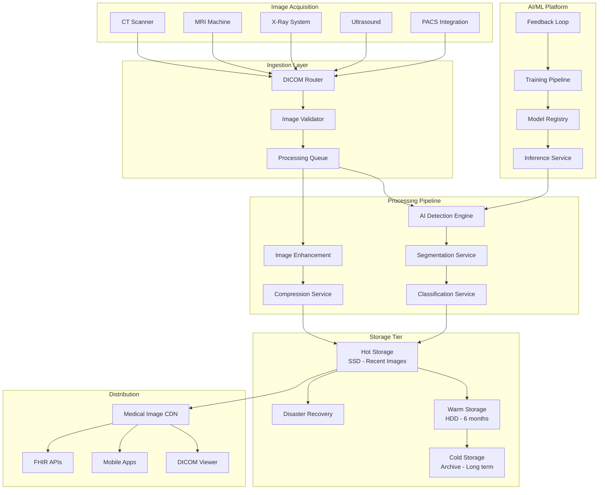
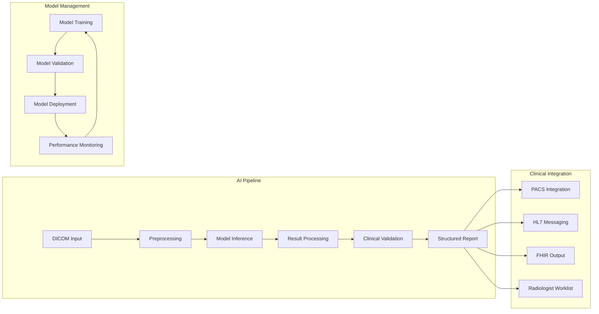
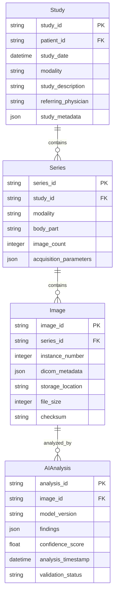
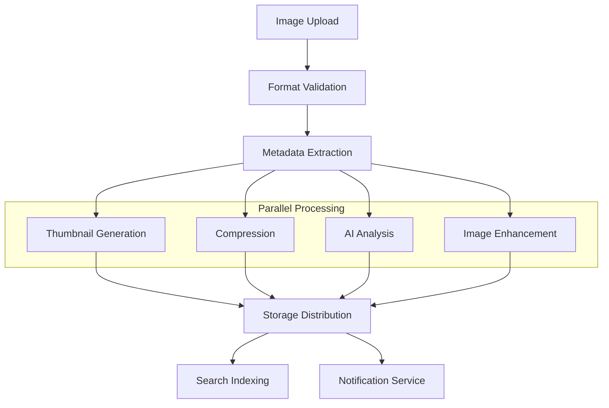
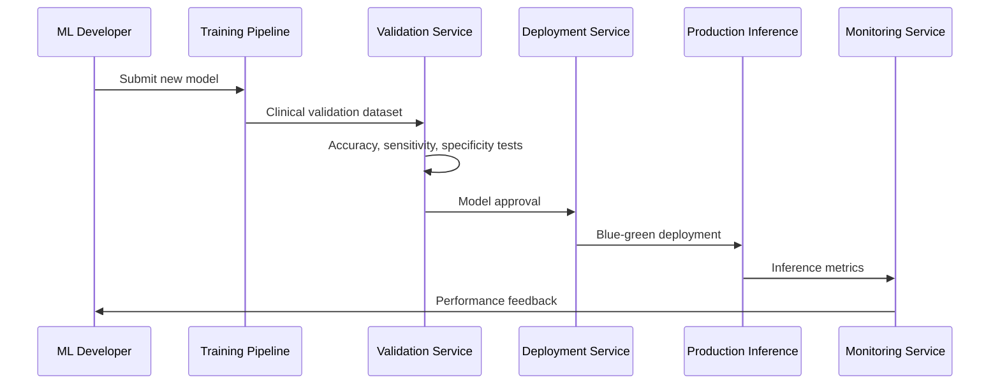
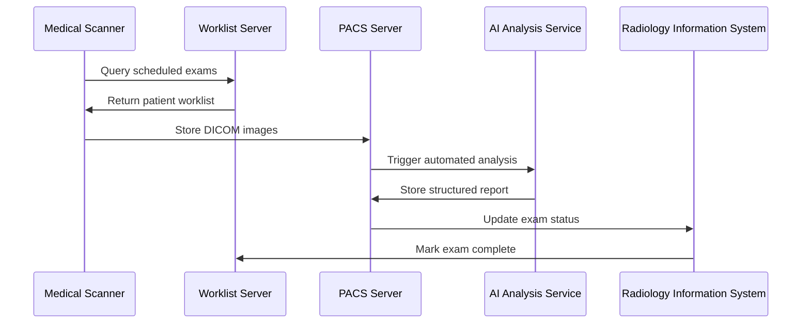

# Medical Imaging Processing Pipeline

## System Overview

Medical imaging systems process massive volumes of DICOM images, apply AI-powered analysis, and distribute results globally while maintaining HIPAA compliance and enabling real-time clinical decision-making. These systems handle everything from X-rays and CT scans to MRIs and ultrasounds.

### Scale & Complexity
- **Daily Image Volume**: 10M+ medical images processed
- **Storage Requirements**: 50PB+ active storage, 500PB+ archive
- **AI Processing**: 1M+ AI inference requests/day
- **Global Distribution**: 100+ healthcare facilities worldwide
- **Uptime**: 99.95% availability requirement

## Architecture Overview



## Key Architectural Challenges

### 1. DICOM Processing at Scale

**Challenge**: Processing millions of large medical images daily while maintaining metadata integrity.

**Solution Architecture**:
- Distributed DICOM processing pipeline with Apache Kafka
- Horizontal scaling of image processing workers
- Metadata extraction and validation services
- Quality assurance checkpoints throughout pipeline

**Implementation**:
```yaml
DICOM Processing Pipeline:
  - Input Validation: DICOM conformance checking
  - Metadata Extraction: Patient data, study information, image parameters
  - Image Processing: Format conversion, compression, enhancement
  - Quality Control: Automated checks for image quality and completeness
  - Routing: Distribute to appropriate storage tiers and AI services
  
Performance Metrics:
  - Throughput: 10,000 images/hour per processing node
  - Latency: <5 minutes for standard processing
  - Error Rate: <0.1% processing failures
  - Storage Efficiency: 60% compression without quality loss
```

### 2. AI-Powered Medical Analysis

**Challenge**: Deploying machine learning models for medical diagnosis while ensuring accuracy and regulatory compliance.

**Solution**: MLOps pipeline with automated model deployment and continuous monitoring.



**AI Implementation Strategy**:
```json
{
  "ai_capabilities": {
    "chest_xray_detection": {
      "conditions": ["pneumonia", "covid-19", "tuberculosis", "lung_cancer"],
      "accuracy": "95.2%",
      "processing_time": "2.3 seconds",
      "model_version": "v3.1"
    },
    "brain_mri_segmentation": {
      "structures": ["tumor", "ventricles", "white_matter", "gray_matter"],
      "dice_coefficient": "0.92",
      "processing_time": "45 seconds",
      "model_version": "v2.8"
    },
    "cardiac_ct_analysis": {
      "measurements": ["calcium_score", "vessel_stenosis", "plaque_volume"],
      "correlation": "0.94 with expert readings",
      "processing_time": "120 seconds",
      "model_version": "v1.5"
    }
  }
}
```

### 3. Global Image Distribution

**Challenge**: Delivering large medical images globally with sub-second access times while maintaining security.

**Implementation**:
```yaml
CDN Strategy:
  - Edge Locations: 50+ global locations
  - Image Formats: DICOM, JPEG 2000, WebP for web viewing
  - Compression: Lossy for preview, lossless for diagnosis
  - Security: TLS 1.3, image watermarking, access logging
  
Caching Strategy:
  - Recent Studies: 7-day cache at edge locations
  - Popular Images: Machine learning-based popularity prediction
  - Prefetching: Intelligent prefetching based on viewing patterns
  - Progressive Loading: Thumbnail → low-res → high-res progressive loading
```

## Data Architecture

### 1. DICOM Data Model



### 2. Storage Tier Strategy

**Hot Tier (SSD)**: 0-30 days
```yaml
Storage: NVMe SSD Arrays
Capacity: 500TB per facility
Performance: 1M+ IOPS, <1ms latency
Replication: 3x synchronous replication
Use Cases: Active studies, emergency cases
```

**Warm Tier (HDD)**: 30 days - 7 years
```yaml
Storage: High-density HDD arrays
Capacity: 5PB per facility
Performance: 50K IOPS, <10ms latency
Replication: 2x asynchronous replication
Use Cases: Reference studies, follow-up comparisons
```

**Cold Tier (Archive)**: 7+ years
```yaml
Storage: Object storage (S3 Glacier)
Capacity: Unlimited
Performance: Minutes to hours retrieval
Replication: 3x geographic replication
Use Cases: Legal compliance, research archives
```

## Performance Optimization

### 1. Image Processing Pipeline



**Pipeline Performance Metrics**:
```yaml
Processing Stages:
  - Upload: 100MB/s average throughput
  - Validation: 2,000 images/minute
  - AI Analysis: 500 images/minute (GPU-accelerated)
  - Compression: 1,000 images/minute
  - Storage: 50GB/s write throughput
  
Optimization Techniques:
  - Parallel Processing: Up to 16 concurrent processing streams
  - GPU Acceleration: NVIDIA V100 for AI inference
  - Memory Optimization: Streaming processing for large images
  - Network Optimization: Dedicated 10Gbps network for image transfer
```

### 2. Viewer Performance

```javascript
// Progressive Image Loading Strategy
class MedicalImageViewer {
  async loadImage(studyId, seriesId, imageId) {
    // 1. Load thumbnail immediately
    const thumbnail = await this.loadThumbnail(imageId);
    this.displayImage(thumbnail);
    
    // 2. Load compressed preview
    const preview = await this.loadPreview(imageId);
    this.displayImage(preview);
    
    // 3. Load full resolution for diagnostic viewing
    const fullRes = await this.loadFullResolution(imageId);
    this.displayImage(fullRes);
    
    // 4. Preload adjacent images
    this.preloadAdjacentImages(seriesId, imageId);
  }
  
  // WebAssembly-based DICOM decompression
  async decompressDicom(compressedData) {
    return await this.wasmDecoder.decompress(compressedData);
  }
  
  // Multi-planar reconstruction
  async generateMPR(volumeData, plane) {
    return await this.gpuRenderer.reconstructPlane(volumeData, plane);
  }
}
```

## AI/ML Integration

### 1. Model Deployment Pipeline



### 2. Real-time AI Analysis

```python
# AI Inference Service
class MedicalAIService:
    def __init__(self):
        self.models = {
            'chest_xray': ChestXRayModel(),
            'brain_mri': BrainMRIModel(),
            'cardiac_ct': CardiacCTModel()
        }
        self.gpu_pool = GPUResourcePool(size=8)
    
    async def analyze_image(self, image_data, study_type):
        # Load appropriate model
        model = self.models.get(study_type)
        if not model:
            raise UnsupportedStudyType(study_type)
        
        # Acquire GPU resource
        gpu = await self.gpu_pool.acquire()
        
        try:
            # Preprocess image
            processed_image = await self.preprocess(image_data, study_type)
            
            # Run inference
            results = await model.infer(processed_image, gpu)
            
            # Post-process results
            structured_results = await self.post_process(results, study_type)
            
            # Generate confidence scores
            confidence = self.calculate_confidence(results)
            
            return {
                'findings': structured_results,
                'confidence': confidence,
                'model_version': model.version,
                'processing_time': time.time() - start_time
            }
        
        finally:
            self.gpu_pool.release(gpu)
```

## Case Study Examples

### Philips HealthSuite Imaging

**Scale**: 10M+ studies processed annually across 100+ countries

**Architecture Highlights**:
- Cloud-native DICOM processing pipeline
- AI-powered image analysis with 20+ clinical applications
- Global CDN with edge computing for real-time viewing
- FHIR-compliant integration with 500+ healthcare systems

**Performance Metrics**:
```yaml
Processing Performance:
  - Image ingestion: 50,000 images/hour
  - AI analysis: 95% accuracy for pneumonia detection
  - Global distribution: <2 second image load times
  - Storage efficiency: 70% reduction through intelligent compression

Innovation Features:
  - Edge AI: On-device processing for portable scanners
  - Federated learning: Privacy-preserving model training
  - Real-time collaboration: Multi-user annotation and consultation
  - Predictive maintenance: Scanner optimization and failure prevention
```

### GE Healthcare Edison Platform

**Scale**: 500M+ imaging exams annually, 500K+ imaging devices

**Key Features**:
- Universal viewer supporting 200+ image formats
- AI marketplace with 100+ clinical applications
- Edge computing for real-time image reconstruction
- Blockchain-based image integrity verification

**Technical Implementation**:
```yaml
Architecture:
  - Microservices: 200+ containerized services
  - Edge Computing: Processing at 10,000+ imaging sites
  - AI Platform: Support for TensorFlow, PyTorch, ONNX models
  - Security: Zero-trust architecture with end-to-end encryption

Performance:
  - Real-time reconstruction: <5 second CT image reconstruction
  - AI inference: <10 seconds for complex analysis
  - Global availability: 99.9% uptime across all regions
  - Scalability: Auto-scaling from 100 to 10,000 instances
```

## Integration Patterns

### 1. PACS Integration



### 2. HL7 FHIR Integration

```json
{
  "resourceType": "ImagingStudy",
  "id": "example-imaging-study",
  "status": "available",
  "subject": {
    "reference": "Patient/example-patient"
  },
  "started": "2024-01-15T10:30:00Z",
  "numberOfSeries": 3,
  "numberOfInstances": 150,
  "modality": [
    {
      "system": "http://dicom.nema.org/resources/ontology/DCM",
      "code": "CT"
    }
  ],
  "series": [
    {
      "uid": "1.2.840.113619.2.176.2025.1148531.7391.1171906341.1",
      "number": 1,
      "modality": {
        "system": "http://dicom.nema.org/resources/ontology/DCM",
        "code": "CT"
      },
      "numberOfInstances": 50,
      "bodySite": {
        "system": "http://snomed.info/sct",
        "code": "51185008",
        "display": "Thoracic structure"
      }
    }
  ]
}
```

## Compliance & Security

### 1. HIPAA Technical Safeguards

**Access Control Implementation**:
```yaml
Authentication:
  - Multi-factor authentication for all users
  - SAML 2.0 integration with hospital identity systems
  - Role-based access control with 15+ predefined roles
  - Time-based access tokens with 4-hour expiration

Authorization:
  - Fine-grained permissions per imaging modality
  - Patient consent verification before image access
  - Break-glass access for emergency situations
  - Automated access reviews and deprovisioning

Audit Controls:
  - Complete audit log of all image access and modifications
  - Real-time anomaly detection for unusual access patterns
  - Quarterly compliance reports with detailed access analytics
  - Integration with SIEM systems for security monitoring
```

### 2. Data Integrity

```python
# Medical Image Integrity Verification
class ImageIntegrityService:
    def __init__(self):
        self.blockchain = MedicalBlockchain()
        self.crypto = CryptographicService()
    
    async def store_image_with_integrity(self, image_data, metadata):
        # Generate cryptographic hash
        image_hash = self.crypto.sha256(image_data)
        metadata_hash = self.crypto.sha256(json.dumps(metadata))
        combined_hash = self.crypto.sha256(f"{image_hash}{metadata_hash}")
        
        # Store hash on blockchain
        block_id = await self.blockchain.store_hash(
            image_id=metadata['image_id'],
            hash_value=combined_hash,
            timestamp=datetime.utcnow()
        )
        
        # Store image with integrity metadata
        integrity_metadata = {
            'image_hash': image_hash,
            'metadata_hash': metadata_hash,
            'combined_hash': combined_hash,
            'blockchain_block': block_id,
            'verification_timestamp': datetime.utcnow().isoformat()
        }
        
        return await self.store_image(image_data, metadata, integrity_metadata)
    
    async def verify_image_integrity(self, image_id):
        # Retrieve image and metadata
        image_data, metadata, integrity_metadata = await self.retrieve_image(image_id)
        
        # Recalculate hashes
        current_image_hash = self.crypto.sha256(image_data)
        current_metadata_hash = self.crypto.sha256(json.dumps(metadata))
        current_combined_hash = self.crypto.sha256(f"{current_image_hash}{current_metadata_hash}")
        
        # Compare with stored hashes
        integrity_check = {
            'image_intact': current_image_hash == integrity_metadata['image_hash'],
            'metadata_intact': current_metadata_hash == integrity_metadata['metadata_hash'],
            'overall_integrity': current_combined_hash == integrity_metadata['combined_hash']
        }
        
        # Verify blockchain record
        blockchain_verification = await self.blockchain.verify_hash(
            integrity_metadata['blockchain_block'],
            integrity_metadata['combined_hash']
        )
        
        return {
            'integrity_check': integrity_check,
            'blockchain_verification': blockchain_verification,
            'verification_timestamp': datetime.utcnow().isoformat()
        }
```

## Lessons Learned

### 1. Storage Optimization

**Challenge**: Medical images consume massive storage space, with a single CT study requiring 500MB-2GB.

**Solution**:
- Implement intelligent tiering based on access patterns
- Use lossless compression for diagnostic images (40-60% reduction)
- Leverage AI to predict which images will be accessed for prefetching
- Implement deduplication for teaching files and reference images

### 2. AI Model Governance

**Challenge**: Ensuring AI models remain accurate and compliant across different populations and imaging equipment.

**Solution**:
- Continuous model monitoring with drift detection
- A/B testing infrastructure for model updates
- Federated learning to improve models without sharing patient data
- Regular retraining with diverse datasets to reduce bias

### 3. Global Compliance

**Challenge**: Different countries have varying regulations for medical image handling.

**Solution**:
- Data residency controls to keep data within required jurisdictions
- Configurable consent management for different regulatory frameworks
- Automated compliance reporting for various regulatory bodies
- Legal hold functionality for litigation and investigation support

## Future Considerations

### 1. Edge Computing Integration

```yaml
Edge Deployment Strategy:
  - Hospital Edge Nodes: Local processing for immediate results
  - Mobile Edge: Tablet and smartphone diagnostic capabilities
  - Ambulance Systems: Real-time image transmission and analysis
  - Rural Healthcare: Satellite-connected edge processing

Edge Capabilities:
  - Real-time image reconstruction and enhancement
  - Emergency AI screening (stroke, trauma, cardiac events)
  - Offline operation with sync when connectivity restored
  - Local caching of frequently accessed images and AI models
```

### 2. Advanced AI Integration

- **Multi-modal AI**: Combining imaging with lab results, clinical notes, and genomic data
- **Predictive Analytics**: Early detection of disease progression
- **Treatment Planning**: AI-assisted surgical planning and radiation therapy
- **Drug Discovery**: AI-powered analysis of medical images for pharmaceutical research

### 3. Emerging Technologies

- **Quantum Computing**: Accelerated image processing and AI model training
- **5G Networks**: Real-time streaming of high-resolution medical images
- **Augmented Reality**: AR-assisted surgical procedures with real-time imaging overlay
- **Digital Twins**: Patient-specific models for personalized treatment planning

## Technology Stack

**Image Processing**:
- DCMTK for DICOM handling
- OpenCV for image processing
- ITK/VTK for medical image analysis
- WebAssembly for client-side processing

**AI/ML Platform**:
- TensorFlow/PyTorch for model development
- NVIDIA Clara for medical AI deployment
- Kubeflow for ML pipeline orchestration
- MLflow for model lifecycle management

**Storage & Distribution**:
- Ceph for distributed object storage
- Redis for caching and session management
- Apache Kafka for event streaming
- CloudFlare/AWS CloudFront for global CDN

**Security & Compliance**:
- HashiCorp Vault for secrets management
- Open Policy Agent for fine-grained authorization
- Falco for runtime security monitoring
- Elasticsearch for audit log analysis

This comprehensive medical imaging architecture demonstrates how to build healthcare-grade systems that prioritize patient safety, regulatory compliance, and clinical effectiveness while maintaining the performance and scalability required for modern medical imaging workflows across global healthcare networks.