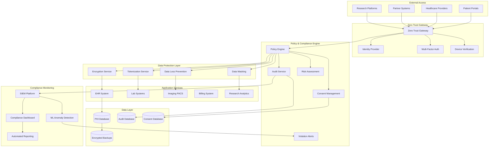
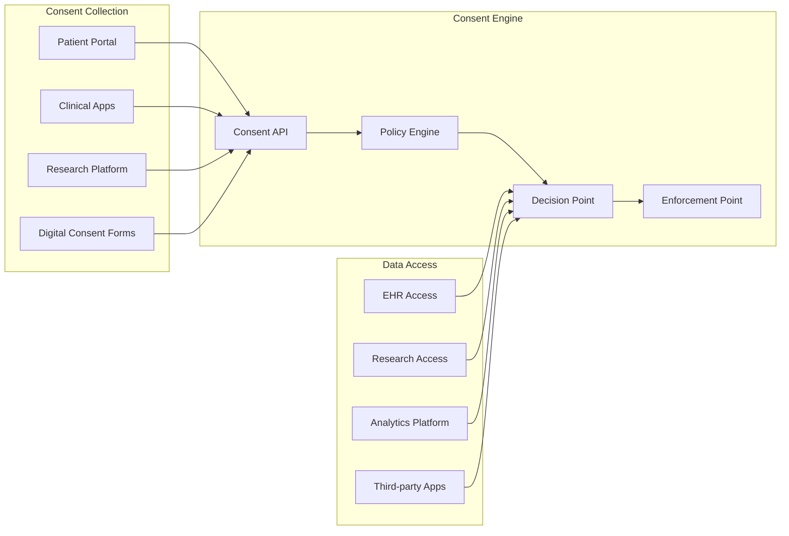
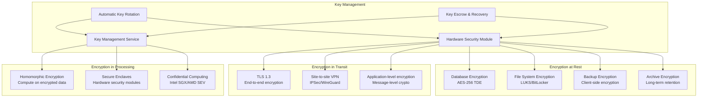
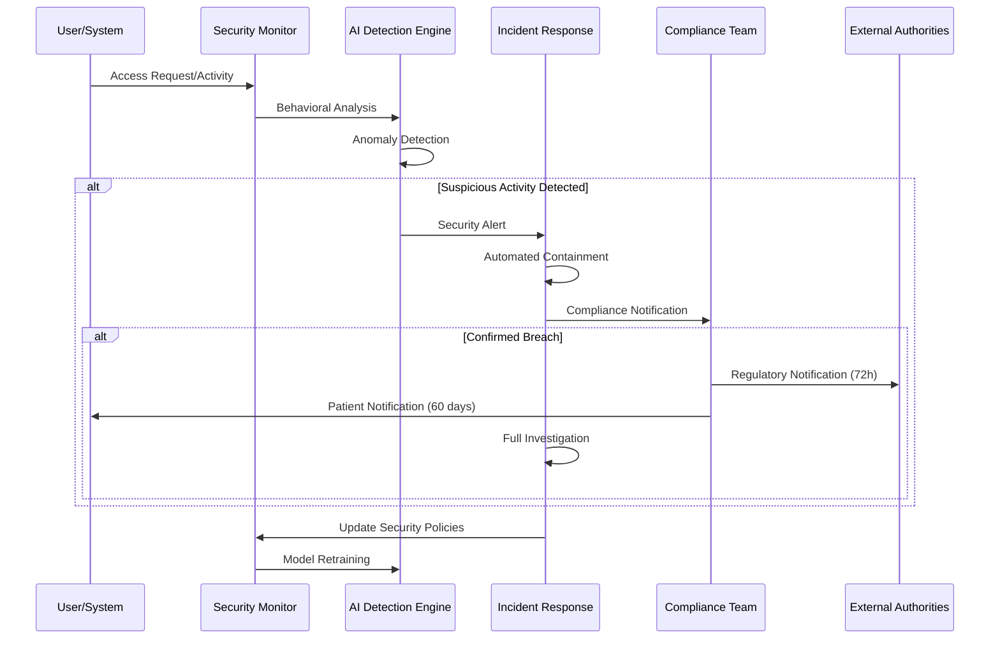

# Patient Data Privacy & HIPAA Compliance Architecture

## System Overview

Healthcare organizations must protect patient data while enabling seamless clinical workflows, research collaboration, and patient access. This case study examines how to build zero-trust security architectures that ensure HIPAA compliance, prevent data breaches, and maintain comprehensive audit trails across distributed healthcare systems.

### Scale & Complexity
- **Protected Health Information (PHI)**: 500M+ patient records
- **Healthcare Providers**: 100K+ clinicians across 500+ facilities
- **Daily Transactions**: 50M+ PHI access events
- **Compliance Monitoring**: Real-time violation detection and reporting
- **Uptime**: 99.99% availability with zero data loss tolerance

## Architecture Overview



## Key Architectural Challenges

### 1. Zero Trust Security Implementation

**Challenge**: Implement "never trust, always verify" for all healthcare data access.

**Solution Architecture**:
- Identity-centric security with continuous verification
- Context-aware access controls based on location, device, and behavior
- Micro-segmentation of network resources
- Real-time risk assessment for every access request

**Implementation**:
```yaml
Zero Trust Components:
  Identity Verification:
    - Multi-factor authentication (SMS, TOTP, biometric)
    - Certificate-based device authentication
    - Continuous authentication with behavioral biometrics
    - Integration with hospital active directory systems
  
  Access Control:
    - Just-in-time access provisioning
    - Principle of least privilege enforcement
    - Context-aware policy decisions
    - Dynamic policy adjustment based on risk scores
  
  Network Security:
    - Software-defined perimeter (SDP)
    - Encrypted tunnels for all communications
    - Network micro-segmentation by department/role
    - Real-time traffic inspection and filtering
```

### 2. Dynamic Consent Management

**Challenge**: Managing complex patient consent preferences across multiple use cases and research studies.

**Solution**: Granular consent management system with real-time enforcement.



**Consent Management Implementation**:
```json
{
  "patient_consent": {
    "patient_id": "patient_12345",
    "consent_timestamp": "2024-01-15T10:30:00Z",
    "consent_version": "v2.1",
    "granular_permissions": {
      "clinical_care": {
        "primary_care": "granted",
        "specialty_care": "granted",
        "emergency_care": "granted",
        "data_sharing_with_providers": "granted"
      },
      "research": {
        "clinical_trials": "granted_with_restrictions",
        "population_health_studies": "denied",
        "pharmaceutical_research": "granted",
        "genetic_research": "denied"
      },
      "marketing": {
        "health_education": "granted",
        "promotional_materials": "denied",
        "third_party_marketing": "denied"
      },
      "data_retention": {
        "retention_period": "7_years_after_last_visit",
        "deletion_request": "honored",
        "data_portability": "granted"
      }
    },
    "restrictions": {
      "geographic_limitations": ["EU", "US"],
      "time_limitations": {
        "start_date": "2024-01-15",
        "end_date": "2029-01-15"
      },
      "data_minimization": "strict"
    }
  }
}
```

### 3. Comprehensive Audit Trail

**Challenge**: Maintaining complete, tamper-proof audit logs for regulatory compliance and breach investigation.

**Implementation**:
```yaml
Audit Architecture:
  Data Collection:
    - Application-level audit logs
    - Database access logs
    - Network traffic logs
    - System and infrastructure logs
    - User behavior analytics
  
  Data Processing:
    - Real-time log ingestion (Apache Kafka)
    - Log normalization and enrichment
    - Correlation of events across systems
    - Machine learning for anomaly detection
  
  Data Storage:
    - Immutable log storage (blockchain-backed)
    - Long-term retention (7+ years)
    - Encrypted storage with key rotation
    - Geographic replication for disaster recovery
  
  Analysis & Reporting:
    - Real-time dashboards for security teams
    - Automated compliance reporting
    - Breach investigation tools
    - Predictive risk analytics
```

## Data Protection Architecture

### 1. Encryption Everywhere



### 2. Data Tokenization & Masking

```python
## Advanced Tokenization Service
class HealthcareTokenizationService:
    def __init__(self):
        self.token_vault = TokenVault()
        self.crypto_engine = CryptographicEngine()
        self.policy_engine = PolicyEngine()
    
    async def tokenize_phi(self, phi_data, context):
        """
        Tokenize PHI based on data type and access context
        """
        tokenized_data = {}
        
        for field, value in phi_data.items():
            # Determine tokenization strategy based on field type
            if field in ['ssn', 'mrn', 'patient_id']:
                # Format-preserving encryption for structured identifiers
                tokenized_data[field] = await self.format_preserving_encrypt(value)
            
            elif field in ['name', 'address', 'phone']:
                # Irreversible tokenization for PII
                tokenized_data[field] = await self.irreversible_tokenize(value)
            
            elif field in ['date_of_birth', 'admission_date']:
                # Date shifting for temporal data
                tokenized_data[field] = await self.date_shift(value, context['patient_id'])
            
            elif field in ['diagnosis_codes', 'procedure_codes']:
                # Preserve medical codes but tokenize free text
                tokenized_data[field] = await self.medical_code_tokenize(value)
            
            elif field in ['clinical_notes', 'physician_notes']:
                # De-identification with NLP
                tokenized_data[field] = await self.nlp_deidentify(value)
        
        # Store mapping in secure vault
        token_id = await self.token_vault.store_mapping(
            original_data=phi_data,
            tokenized_data=tokenized_data,
            context=context
        )
        
        return {
            'token_id': token_id,
            'tokenized_data': tokenized_data,
            'tokenization_timestamp': datetime.utcnow(),
            'context': context
        }
    
    async def detokenize_phi(self, token_id, requesting_context):
        """
        Reverse tokenization based on access permissions
        """
        # Verify access permissions
        access_granted = await self.policy_engine.verify_access(
            token_id=token_id,
            requesting_context=requesting_context
        )
        
        if not access_granted:
            raise UnauthorizedAccessError("Insufficient permissions for detokenization")
        
        # Retrieve and return original data
        mapping = await self.token_vault.get_mapping(token_id)
        
        # Log access for audit trail
        await self.audit_logger.log_detokenization(
            token_id=token_id,
            requesting_context=requesting_context,
            timestamp=datetime.utcnow()
        )
        
        return mapping['original_data']
```

## Advanced Compliance Features

### 1. Automated Risk Assessment

```python
class HealthcareRiskAssessment:
    def __init__(self):
        self.ml_model = RiskPredictionModel()
        self.behavioral_analytics = BehavioralAnalytics()
        self.threat_intelligence = ThreatIntelligence()
    
    async def assess_access_risk(self, access_request):
        """
        Real-time risk assessment for PHI access requests
        """
        risk_factors = {}
        
        # User behavior analysis
        user_risk = await self.behavioral_analytics.analyze_user_behavior(
            user_id=access_request['user_id'],
            historical_pattern=access_request['access_pattern'],
            current_request=access_request
        )
        risk_factors['user_behavior'] = user_risk
        
        # Device and location analysis
        device_risk = await self.assess_device_risk(
            device_id=access_request['device_id'],
            location=access_request['location'],
            network_info=access_request['network']
        )
        risk_factors['device_location'] = device_risk
        
        # Data sensitivity analysis
        data_risk = await self.assess_data_sensitivity(
            data_categories=access_request['data_categories'],
            patient_demographics=access_request['patient_info']
        )
        risk_factors['data_sensitivity'] = data_risk
        
        # Threat intelligence
        threat_risk = await self.threat_intelligence.check_indicators(
            user_id=access_request['user_id'],
            ip_address=access_request['ip_address'],
            timestamp=access_request['timestamp']
        )
        risk_factors['threat_intelligence'] = threat_risk
        
        # ML-based risk prediction
        overall_risk = await self.ml_model.predict_risk(risk_factors)
        
        return {
            'overall_risk_score': overall_risk,
            'risk_factors': risk_factors,
            'recommended_action': self.determine_action(overall_risk),
            'additional_controls': self.suggest_controls(risk_factors)
        }
    
    def determine_action(self, risk_score):
        if risk_score < 0.3:
            return 'allow'
        elif risk_score < 0.7:
            return 'allow_with_monitoring'
        elif risk_score < 0.9:
            return 'require_additional_authentication'
        else:
            return 'deny_and_alert'
```

### 2. Breach Detection & Response



## Case Study Examples

### Kaiser Permanente Privacy Architecture

**Scale**: 12M+ members, 200K+ employees, integrated healthcare system

**Architecture Highlights**:
- Zero-trust network architecture across 39 hospitals
- AI-powered anomaly detection for insider threat prevention
- Patient-controlled consent management with granular permissions
- Real-time compliance monitoring with automated reporting

**Security Innovations**:
```yaml
Advanced Features:
  - Biometric authentication for high-risk data access
  - Blockchain-based audit trail integrity
  - Homomorphic encryption for research analytics
  - Federated learning for privacy-preserving AI

Compliance Results:
  - Zero major HIPAA violations in 5 years
  - 99.9% uptime for compliance systems
  - Sub-second access control decisions
  - 40% reduction in false positive security alerts
```

### Anthem Privacy-by-Design Implementation

**Scale**: 100M+ members, largest health insurer in the US

**Key Features**:
- Privacy-by-design architecture from ground up
- Dynamic data classification and protection
- Cross-system consent enforcement
- Advanced threat hunting and response

**Technical Architecture**:
```yaml
Privacy Controls:
  - Attribute-based access control (ABAC) with 500+ attributes
  - Real-time data loss prevention (DLP) scanning
  - Automated data discovery and classification
  - Privacy impact assessments for new systems

Performance Metrics:
  - <100ms access control decision time
  - 99.99% audit log availability
  - 24/7 security operations center monitoring
  - 15-minute breach detection and response time
```

## Integration with Healthcare Standards

### 1. FHIR Security Implementation

```json
{
  "resourceType": "Patient",
  "id": "example-patient",
  "meta": {
    "security": [
      {
        "system": "http://terminology.hl7.org/CodeSystem/v3-ActCode",
        "code": "R",
        "display": "Restricted"
      }
    ]
  },
  "extension": [
    {
      "url": "http://hl7.org/fhir/StructureDefinition/patient-consent",
      "valueReference": {
        "reference": "Consent/patient-consent-12345"
      }
    }
  ],
  "identifier": [
    {
      "use": "usual",
      "system": "http://hospital.org/mrn",
      "value": "***TOKENIZED***"
    }
  ],
  "name": [
    {
      "use": "official",
      "family": "***MASKED***",
      "given": ["***MASKED***"]
    }
  ]
}
```

### 2. HL7 Security Framework

```python
class HL7SecurityProcessor:
    def __init__(self):
        self.crypto_service = CryptographicService()
        self.policy_engine = PolicyEngine()
        self.audit_service = AuditService()
    
    async def secure_hl7_message(self, hl7_message, sender_context):
        """
        Apply security controls to HL7 messages
        """
        # Parse HL7 message
        parsed_message = self.parse_hl7(hl7_message)
        
        # Apply field-level encryption
        secured_segments = {}
        for segment_name, segment_data in parsed_message.items():
            if segment_name == 'PID':  # Patient Identification
                secured_segments[segment_name] = await self.encrypt_pid_segment(
                    segment_data, sender_context
                )
            elif segment_name == 'OBX':  # Observation/Result
                secured_segments[segment_name] = await self.tokenize_observations(
                    segment_data, sender_context
                )
            else:
                secured_segments[segment_name] = segment_data
        
        # Digital signature
        message_signature = await self.crypto_service.sign_message(
            secured_segments, sender_context['private_key']
        )
        
        # Audit logging
        await self.audit_service.log_hl7_processing(
            message_type=parsed_message.get('MSH', {}).get('message_type'),
            sender=sender_context['sender_id'],
            security_applied=['encryption', 'tokenization', 'signature'],
            timestamp=datetime.utcnow()
        )
        
        return {
            'secured_message': self.reconstruct_hl7(secured_segments),
            'signature': message_signature,
            'security_metadata': {
                'encryption_applied': True,
                'tokenization_applied': True,
                'signature_applied': True
            }
        }
```

## Lessons Learned

### 1. Privacy by Design Implementation

**Challenge**: Retrofitting privacy controls into existing healthcare systems.

**Solution**:
- Start with data discovery and classification
- Implement policy engines that can evolve with changing requirements
- Use tokenization and encryption as default, not exception
- Design APIs with privacy controls built-in from the beginning

### 2. User Experience vs. Security Balance

**Challenge**: Security controls that interfere with clinical workflows can be bypassed or ignored.

**Solution**:
- Implement intelligent access controls that adapt to clinical context
- Use single sign-on and seamless authentication where possible
- Provide clear feedback on why security controls are in place
- Continuously monitor and optimize the user experience

### 3. Compliance Automation

**Challenge**: Manual compliance processes don't scale and are error-prone.

**Solution**:
- Automate compliance reporting and monitoring
- Use machine learning to identify potential violations before they occur
- Implement continuous compliance testing and validation
- Create self-healing systems that automatically remediate common issues

## Future Considerations

### 1. Emerging Privacy Technologies

```yaml
Next-Generation Privacy:
  - Homomorphic encryption for computation on encrypted data
  - Secure multi-party computation for collaborative research
  - Differential privacy for statistical analysis
  - Zero-knowledge proofs for identity verification

Implementation Timeline:
  - Year 1: Pilot homomorphic encryption for specific use cases
  - Year 2: Deploy differential privacy for population health analytics
  - Year 3: Implement zero-knowledge identity systems
  - Year 4: Full secure multi-party computation for research networks
```

### 2. AI-Powered Privacy Protection

- **Automated Data Discovery**: AI to identify and classify PHI across all systems
- **Intelligent Consent Management**: Natural language processing for consent interpretation
- **Predictive Privacy**: AI to predict and prevent privacy violations before they occur
- **Synthetic Data Generation**: AI to create realistic but privacy-safe datasets

### 3. Quantum-Ready Security

- **Post-quantum cryptography**: Preparing for quantum computing threats
- **Quantum key distribution**: Ultra-secure communication channels
- **Quantum random number generation**: Enhanced entropy for cryptographic operations
- **Quantum-resistant protocols**: Future-proofing security architectures

## Technology Stack

**Security & Privacy**:
- HashiCorp Vault for secrets management
- Open Policy Agent (OPA) for fine-grained authorization
- Keycloak for identity and access management
- Apache Ranger for data governance

**Encryption & Tokenization**:
- Intel QuickAssist for hardware-accelerated encryption
- Protegrity for enterprise tokenization
- Microsoft SEAL for homomorphic encryption
- AWS CloudHSM for key management

**Monitoring & Compliance**:
- Splunk Enterprise Security for SIEM
- Varonis for data security analytics
- BigID for data discovery and classification
- OneTrust for privacy management

**Infrastructure**:
- Istio service mesh for zero-trust networking
- Falco for runtime security monitoring
- Twistlock for container security
- Kubernetes with Pod Security Policies

This comprehensive healthcare privacy and compliance architecture demonstrates how to build systems that protect patient data while enabling the collaboration, research, and care delivery that modern healthcare requires, all while maintaining strict regulatory compliance and preventing data breaches.