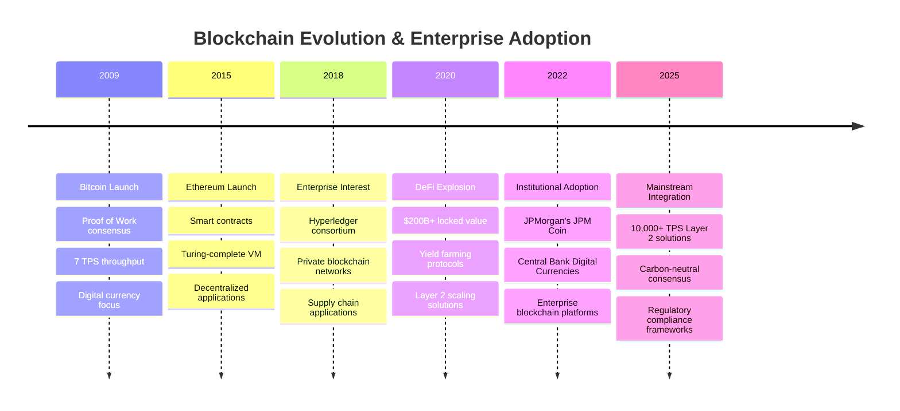
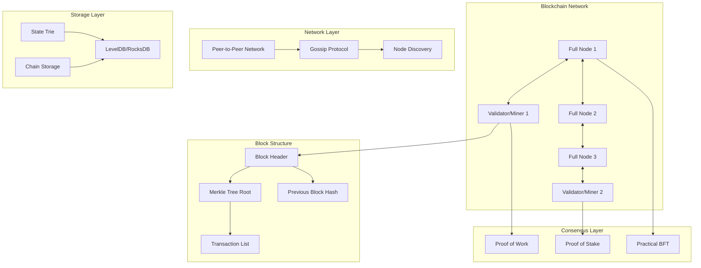

# Blockchain Architecture: Distributed Consensus at Scale

!!! warning "Excellence Badge"
    🥉 **Bronze Tier**: Innovative but limited practical applicability due to scalability and energy constraints

!!! abstract "Quick Facts"
| Metric | Bitcoin | Ethereum | Modern L2 Solutions |
 |--------|---------|----------|--------------------|
 | **Throughput** | 7 TPS | 15 TPS | 10,000+ TPS |
 | **Finality** | 60 minutes | 13 minutes | 2 seconds |
 | **Energy per Tx** | 700 kWh | 60 kWh | 0.001 kWh |
 | **Node Count** | 15,000+ | 8,000+ | 100-1,000 |
 | **Data Size** | 500+ GB | 1+ TB | 10-100 GB |

## Executive Summary

Blockchain technology represents a paradigm shift in distributed systems, enabling trustless consensus without central authority. While Bitcoin (2009) and Ethereum (2015) demonstrated the viability of decentralized ledgers, their limitations in throughput, energy consumption, and complexity have led to evolution toward Layer 2 solutions, consortium blockchains, and alternative consensus mechanisms. This analysis examines blockchain's technical architecture, consensus algorithms, and practical trade-offs for modern system design.

## Business Context & Evolution

### The Distributed Trust Problem

<div class="grid cards" markdown>

- :material-bank:{ .lg .middle } **Traditional Systems**
    
    ---
    
    **Central Authority**: Banks, governments, or corporations control transaction validity
    
    **Single Point of Failure**: Central systems can be compromised, censored, or fail
    
    **Trust Requirements**: Parties must trust the central authority

- :material-network:{ .lg .middle } **Blockchain Solution**
    
    ---
    
    **Distributed Consensus**: Network participants agree on transaction validity
    
    **Fault Tolerance**: System continues operating despite node failures
    
    **Trustless Operation**: Cryptographic proofs replace trust requirements

- :material-chart-line:{ .lg .middle } **Modern Reality**
    
    ---
    
    **Limited Scalability**: 7-15 TPS vs 65,000 TPS (Visa)
    
    **High Energy Cost**: Bitcoin uses 150 TWh/year (Argentina's consumption)
    
    **Complexity Trade-offs**: Technical complexity for decentralization benefits

</div>

### Industry Adoption Timeline



## Core Technical Architecture

### Fundamental Components



### Detailed Block Structure

```go
/ Modern blockchain block structure
type Block struct {
    Header BlockHeader `json:"header"`
    Body   BlockBody   `json:"body"`
}

type BlockHeader struct {
    / Consensus fields
    ParentHash   common.Hash    `json:"parentHash"`
    Number       *big.Int       `json:"number"`
    GasLimit     uint64         `json:"gasLimit"`
    GasUsed      uint64         `json:"gasUsed"`
    Timestamp    uint64         `json:"timestamp"`
    
    / Merkle tree roots for verification
    TxRoot       common.Hash    `json:"transactionsRoot"`
    ReceiptRoot  common.Hash    `json:"receiptsRoot"`
    StateRoot    common.Hash    `json:"stateRoot"`
    
    / Mining/validation proof
    Nonce        uint64         `json:"nonce"`
    MixHash      common.Hash    `json:"mixHash"`
    Difficulty   *big.Int       `json:"difficulty"`
    
    / Metadata
    Coinbase     common.Address `json:"miner"`
    Extra        []byte         `json:"extraData"`
}

type BlockBody struct {
    Transactions []*Transaction `json:"transactions"`
    Uncles       []*Header      `json:"uncles"` / For chain reorganization
}
```

## Deep Dive: Consensus Mechanisms

### 1. Proof of Work (PoW) - Bitcoin's Approach

#### Algorithm Implementation
```python
class ProofOfWork:
    """Bitcoin-style Proof of Work implementation"""
    
    def __init__(self, target_difficulty):
        self.target = 2 ** (256 - target_difficulty)
        
    def mine_block(self, block_data, previous_hash):
        """Mine a block by finding valid nonce"""
        nonce = 0
        start_time = time.time()
        
        while True:
            # Create block header
            header = {
                'previous_hash': previous_hash,
                'merkle_root': self.calculate_merkle_root(block_data),
                'timestamp': int(time.time()),
                'target': self.target,
                'nonce': nonce
            }
            
            # Calculate hash
            header_json = json.dumps(header, sort_keys=True)
            block_hash = hashlib.sha256(header_json.encode()).hexdigest()
            
            # Check if hash meets target difficulty
            if int(block_hash, 16) < self.target:
                mining_time = time.time() - start_time
                hash_rate = nonce / mining_time if mining_time > 0 else 0
                
                return {
                    'block': header,
                    'hash': block_hash,
                    'mining_time': mining_time,
                    'hash_rate': hash_rate,
                    'attempts': nonce
                }
            
            nonce += 1
            
            # Progress logging every million attempts
            if nonce % 1000000 == 0:
                elapsed = time.time() - start_time
                rate = nonce / elapsed
                print(f"Mining... {nonce:,} attempts, {rate:,.0f} H/s")
    
    def calculate_merkle_root(self, transactions):
        """Calculate Merkle tree root for transactions"""
        if not transactions:
            return '0' * 64
            
        # Hash all transactions
        tx_hashes = []
        for tx in transactions:
            tx_json = json.dumps(tx, sort_keys=True)
            tx_hash = hashlib.sha256(tx_json.encode()).hexdigest()
            tx_hashes.append(tx_hash)
        
        # Build Merkle tree bottom-up
        while len(tx_hashes) > 1:
            next_level = []
            
            # Process pairs of hashes
            for i in range(0, len(tx_hashes), 2):
                left = tx_hashes[i]
                right = tx_hashes[i + 1] if i + 1 < len(tx_hashes) else left
                
                # Combine and hash
                combined = left + right
                parent_hash = hashlib.sha256(combined.encode()).hexdigest()
                next_level.append(parent_hash)
            
            tx_hashes = next_level
        
        return tx_hashes[0]
```

#### Performance Characteristics (2025)

| Metric | Bitcoin Network | Energy Analysis |
|--------|----------------|------------------|
| **Hash Rate** | 450 EH/s (450 x 10^18 hashes/sec) | 150 TWh/year consumption |
| **Block Time** | 10 minutes average | Self-adjusting difficulty |
| **Security** | $15B+ attack cost | Economic security model |
| **Finality** | 6 blocks (60 min) | Probabilistic finality |
| **Throughput** | 7 TPS maximum | Network bandwidth limited |

### 2. Proof of Stake (PoS) - Ethereum 2.0's Approach

#### Validator Selection Algorithm
```python
class ProofOfStake:
    """Ethereum 2.0 style Proof of Stake consensus"""
    
    def __init__(self):
        self.validators = {}
        self.total_stake = 0
        self.slash_penalty = 0.05  # 5% slashing penalty
        
    def register_validator(self, validator_id, stake_amount, public_key):
        """Register validator with stake"""
        if stake_amount < 32_000_000_000_000_000_000:  # 32 ETH minimum
            raise ValueError("Insufficient stake amount")
            
        self.validators[validator_id] = {
            'stake': stake_amount,
            'public_key': public_key,
            'active': True,
            'slashing_history': [],
            'attestations': 0,
            'proposals': 0
        }
        
        self.total_stake += stake_amount
        
    def select_block_proposer(self, slot_number, randomness_seed):
        """Select block proposer using weighted random selection"""
        active_validators = {
            vid: v for vid, v in self.validators.items() 
            if v['active']
        }
        
        if not active_validators:
            raise ValueError("No active validators")
        
        # Use slot number and randomness for deterministic selection
        random.seed(hash((slot_number, randomness_seed)) % (2**32))
        
        # Weighted selection based on stake
        validator_weights = []
        validator_ids = list(active_validators.keys())
        
        for vid in validator_ids:
            stake = active_validators[vid]['stake']
            weight = stake / self.total_stake
            validator_weights.append(weight)
        
        # Random selection weighted by stake
        selected_idx = random.choices(
            range(len(validator_ids)), 
            weights=validator_weights
        )[0]
        
        return validator_ids[selected_idx]
    
    def validate_block(self, block, proposer_id, attestations):
        """Validate proposed block with attestations"""
        # Verify proposer eligibility
        if proposer_id not in self.validators:
            return False, "Invalid proposer"
            
        if not self.validators[proposer_id]['active']:
            return False, "Inactive proposer"
        
        # Verify attestations (simplified)
        required_attestations = len(self.validators) * 2 / 3  # 2/3 majority
        
        if len(attestations) < required_attestations:
            return False, "Insufficient attestations"
        
        # Verify each attestation signature (simplified)
        valid_attestations = 0
        for attestation in attestations:
            if self.verify_attestation(attestation, block):
                valid_attestations += 1
        
        if valid_attestations < required_attestations:
            return False, "Invalid attestations"
        
        # Update validator metrics
        self.validators[proposer_id]['proposals'] += 1
        for attestation in attestations:
            if attestation['validator_id'] in self.validators:
                self.validators[attestation['validator_id']]['attestations'] += 1
        
        return True, "Block validated"
    
    def slash_validator(self, validator_id, violation_type):
        """Slash validator for protocol violations"""
        if validator_id not in self.validators:
            return False
        
        validator = self.validators[validator_id]
        
        # Calculate slashing penalty
        penalty_amount = validator['stake'] * self.slash_penalty
        validator['stake'] -= penalty_amount
        
        # Record slashing
        validator['slashing_history'].append({
            'timestamp': time.time(),
            'violation': violation_type,
            'penalty': penalty_amount
        })
        
        # Deactivate if stake too low
        if validator['stake'] < 16_000_000_000_000_000_000:  # 16 ETH minimum
            validator['active'] = False
        
        self.total_stake -= penalty_amount
        
        return True
```

#### PoS Performance Analysis (2025)

| Metric | Ethereum 2.0 | Comparison to PoW |
|--------|--------------|------------------|
| **Energy Usage** | 0.01% of PoW | 99.95% reduction |
| **Finality Time** | 12 minutes (2 epochs) | Deterministic finality |
| **Throughput** | 15 TPS (64 TPS with sharding) | 2-9x improvement |
| **Validator Count** | 500,000+ validators | More decentralized |
| **Entry Cost** | 32 ETH (~$64K) | Lower than PoW mining |

### 3. Practical Byzantine Fault Tolerance (pBFT)

#### Enterprise Consensus Implementation
```go
/ pBFT consensus for permissioned networks
type PBFTConsensus struct {
    nodeID        int
    nodes         []Node
    currentView   int
    currentSeq    int
    primaryID     int
    messageLog    map[string]*ConsensusMessage
    commitLog     map[int]*Block
    mutex         sync.RWMutex
}

type ConsensusMessage struct {
    Type      MessageType `json:"type"`
    View      int         `json:"view"`
    Sequence  int         `json:"sequence"`
    NodeID    int         `json:"node_id"`
    BlockHash string      `json:"block_hash"`
    Signature []byte      `json:"signature"`
    Timestamp time.Time   `json:"timestamp"`
}

func (p *PBFTConsensus) ProposeBlock(block *Block) error {
    p.mutex.Lock()
    defer p.mutex.Unlock()
    
    / Only primary can propose
    if p.nodeID != p.primaryID {
        return errors.New("only primary can propose blocks")
    }
    
    / Create pre-prepare message
    message := &ConsensusMessage{
        Type:      PrePrepare,
        View:      p.currentView,
        Sequence:  p.currentSeq,
        NodeID:    p.nodeID,
        BlockHash: block.Hash(),
        Timestamp: time.Now(),
    }
    
    / Sign message
    signature, err := p.signMessage(message)
    if err != nil {
        return fmt.Errorf("failed to sign message: %w", err)
    }
    message.Signature = signature
    
    / Broadcast to all nodes
    p.broadcast(message)
    
    / Store in message log
    p.messageLog[message.key()] = message
    
    p.currentSeq++
    return nil
}

func (p *PBFTConsensus) HandleMessage(msg *ConsensusMessage) error {
    p.mutex.Lock()
    defer p.mutex.Unlock()
    
    / Verify message signature
    if !p.verifySignature(msg) {
        return errors.New("invalid message signature")
    }
    
    / Handle based on message type
    switch msg.Type {
    case PrePrepare:
        return p.handlePrePrepare(msg)
    case Prepare:
        return p.handlePrepare(msg)
    case Commit:
        return p.handleCommit(msg)
    default:
        return errors.New("unknown message type")
    }
}

func (p *PBFTConsensus) handlePrePrepare(msg *ConsensusMessage) error {
    / Validate pre-prepare conditions
    if msg.View != p.currentView {
        return errors.New("view mismatch")
    }
    
    if msg.NodeID != p.primaryID {
        return errors.New("pre-prepare from non-primary")
    }
    
    / Send prepare message
    prepareMsg := &ConsensusMessage{
        Type:      Prepare,
        View:      p.currentView,
        Sequence:  msg.Sequence,
        NodeID:    p.nodeID,
        BlockHash: msg.BlockHash,
        Timestamp: time.Now(),
    }
    
    signature, err := p.signMessage(prepareMsg)
    if err != nil {
        return err
    }
    prepareMsg.Signature = signature
    
    p.broadcast(prepareMsg)
    p.messageLog[prepareMsg.key()] = prepareMsg
    
    return nil
}

func (p *PBFTConsensus) checkCommitCondition(blockHash string, sequence int) bool {
    / Count prepare messages for this block
    prepareCount := 0
    for _, msg := range p.messageLog {
        if msg.Type == Prepare && 
           msg.BlockHash == blockHash && 
           msg.Sequence == sequence && 
           msg.View == p.currentView {
            prepareCount++
        }
    }
    
    / Need 2f+1 prepare messages (where f is max faulty nodes)
    requiredPrepares := 2*(len(p.nodes)-1)/3 + 1
    
    return prepareCount >= requiredPrepares
}
```

#### pBFT Performance Characteristics

| Metric | Hyperledger Fabric | R3 Corda | JPMorgan Quorum |
|--------|-------------------|----------|------------------|
| **Throughput** | 20,000 TPS | 600 TPS | 4,000 TPS |
| **Latency** | 100ms | 500ms | 200ms |
| **Node Limit** | ~100 nodes | ~300 nodes | ~50 nodes |
| **Byzantine Tolerance** | f < n/3 | Crash faults only | f < n/2 |
| **Finality** | Immediate | Immediate | Immediate |

## Advanced Technical Components

### Merkle Tree Implementation

```python
class MerkleTree:
    """Optimized Merkle tree for blockchain verification"""
    
    def __init__(self, data_items):
        self.data_items = data_items
        self.tree = self.build_tree()
        self.root = self.tree[0] if self.tree else None
    
    def build_tree(self):
        """Build complete Merkle tree with optimization"""
        if not self.data_items:
            return []
        
        # Hash leaf nodes
        current_level = []
        for item in self.data_items:
            item_json = json.dumps(item, sort_keys=True)
            leaf_hash = hashlib.sha256(item_json.encode()).hexdigest()
            current_level.append(leaf_hash)
        
        # Build tree levels
        tree = []
        tree.extend(current_level)
        
        while len(current_level) > 1:
            next_level = []
            
            # Process pairs
            for i in range(0, len(current_level), 2):
                left = current_level[i]
                right = current_level[i + 1] if i + 1 < len(current_level) else left
                
                # Create parent hash
                combined = left + right
                parent = hashlib.sha256(combined.encode()).hexdigest()
                next_level.append(parent)
            
            # Add level to tree (reverse order for easier access)
            tree = next_level + tree
            current_level = next_level
        
        return tree
    
    def generate_proof(self, item_index):
        """Generate Merkle proof for specific item"""
        if item_index >= len(self.data_items):
            raise ValueError("Item index out of range")
        
        proof = []
        current_index = item_index
        level_size = len(self.data_items)
        level_offset = len(self.tree) - level_size
        
        while level_size > 1:
            # Determine sibling index
            is_right_node = current_index % 2 == 1
            sibling_index = current_index - 1 if is_right_node else current_index + 1
            
            # Add sibling to proof if it exists
            if sibling_index < level_size:
                sibling_hash = self.tree[level_offset + sibling_index]
                proof.append({
                    'hash': sibling_hash,
                    'position': 'left' if is_right_node else 'right'
                })
            
            # Move to parent level
            current_index = current_index / 2
            level_size = (level_size + 1) / 2
            level_offset -= level_size
        
        return proof
    
    @staticmethod
    def verify_proof(item, merkle_root, proof):
        """Verify Merkle proof for item"""
        # Hash the item
        item_json = json.dumps(item, sort_keys=True)
        current_hash = hashlib.sha256(item_json.encode()).hexdigest()
        
        # Apply proof steps
        for step in proof:
            sibling_hash = step['hash']
            position = step['position']
            
            if position == 'left':
                combined = sibling_hash + current_hash
            else:
                combined = current_hash + sibling_hash
            
            current_hash = hashlib.sha256(combined.encode()).hexdigest()
        
        return current_hash == merkle_root
    
    def update_item(self, index, new_item):
        """Efficiently update single item and recalculate tree"""
        if index >= len(self.data_items):
            raise ValueError("Index out of range")
        
        # Update data
        self.data_items[index] = new_item
        
        # Recalculate only affected path
        new_hash = hashlib.sha256(
            json.dumps(new_item, sort_keys=True).encode()
        ).hexdigest()
        
        current_index = index
        level_size = len(self.data_items)
        level_offset = len(self.tree) - level_size
        
        # Update leaf
        self.tree[level_offset + current_index] = new_hash
        current_hash = new_hash
        
        # Recalculate parent hashes
        while level_size > 1:
            parent_index = current_index / 2
            sibling_index = current_index - 1 if current_index % 2 == 1 else current_index + 1
            
            # Get sibling hash
            if sibling_index < level_size:
                sibling_hash = self.tree[level_offset + sibling_index]
                if current_index % 2 == 0:  # Current is left child
                    combined = current_hash + sibling_hash
                else:  # Current is right child
                    combined = sibling_hash + current_hash
            else:
                combined = current_hash + current_hash
            
            # Update parent
            level_size = (level_size + 1) / 2
            level_offset -= level_size
            parent_hash = hashlib.sha256(combined.encode()).hexdigest()
            self.tree[level_offset + parent_index] = parent_hash
            
            current_hash = parent_hash
            current_index = parent_index
        
        self.root = current_hash
```

### Smart Contract Virtual Machine

```python
class SimpleVM:
    """Simplified virtual machine for smart contract execution"""
    
    def __init__(self, gas_limit=1_000_000):
        self.stack = []
        self.memory = bytearray(1024 * 1024)  # 1MB memory
        self.storage = {}
        self.gas_used = 0
        self.gas_limit = gas_limit
        self.pc = 0  # Program counter
        self.stopped = False
        
        # Gas costs for operations
        self.gas_costs = {
            'ADD': 3, 'MUL': 5, 'SUB': 3, 'DIV': 5,
            'SLOAD': 200, 'SSTORE': 5000,
            'PUSH': 3, 'POP': 2,
            'JUMP': 8, 'JUMPI': 10,
            'CALL': 700, 'CREATE': 32000
        }
    
    def execute_contract(self, bytecode, input_data=None):
        """Execute smart contract bytecode"""
        instructions = self.parse_bytecode(bytecode)
        
        if input_data:
            self.load_input_data(input_data)
        
        while self.pc < len(instructions) and not self.stopped:
            instruction = instructions[self.pc]
            
            # Check gas limit
            gas_cost = self.gas_costs.get(instruction['op'], 1)
            if self.gas_used + gas_cost > self.gas_limit:
                raise Exception("Out of gas")
            
            self.gas_used += gas_cost
            
            # Execute instruction
            try:
                self.execute_instruction(instruction)
            except Exception as e:
                return {
                    'success': False,
                    'error': str(e),
                    'gas_used': self.gas_used
                }
        
        return {
            'success': True,
            'result': self.get_return_data(),
            'gas_used': self.gas_used,
            'state_changes': self.get_state_changes()
        }
    
    def execute_instruction(self, instruction):
        """Execute single VM instruction"""
        op = instruction['op']
        args = instruction.get('args', [])
        
        if op == 'PUSH':
            self.stack.append(args[0])
        
        elif op == 'POP':
            if not self.stack:
                raise Exception("Stack underflow")
            self.stack.pop()
        
        elif op == 'ADD':
            if len(self.stack) < 2:
                raise Exception("Stack underflow")
            b = self.stack.pop()
            a = self.stack.pop()
            self.stack.append((a + b) % (2**256))
        
        elif op == 'MUL':
            if len(self.stack) < 2:
                raise Exception("Stack underflow")
            b = self.stack.pop()
            a = self.stack.pop()
            self.stack.append((a * b) % (2**256))
        
        elif op == 'SLOAD':
            if not self.stack:
                raise Exception("Stack underflow")
            key = self.stack.pop()
            value = self.storage.get(key, 0)
            self.stack.append(value)
        
        elif op == 'SSTORE':
            if len(self.stack) < 2:
                raise Exception("Stack underflow")
            key = self.stack.pop()
            value = self.stack.pop()
            self.storage[key] = value
        
        elif op == 'JUMP':
            if not self.stack:
                raise Exception("Stack underflow")
            destination = self.stack.pop()
            self.pc = destination - 1  # -1 because pc will be incremented
        
        elif op == 'JUMPI':
            if len(self.stack) < 2:
                raise Exception("Stack underflow")
            destination = self.stack.pop()
            condition = self.stack.pop()
            if condition != 0:
                self.pc = destination - 1
        
        elif op == 'STOP':
            self.stopped = True
            return
        
        else:
            raise Exception(f"Unknown opcode: {op}")
        
        self.pc += 1
    
    def parse_bytecode(self, bytecode):
        """Parse bytecode into instructions (simplified)"""
        # In real implementation, this would parse actual EVM bytecode
        # This is a simplified version for demonstration
        instructions = []
        i = 0
        
        while i < len(bytecode):
            opcode = bytecode[i]
            
            if opcode == 0x60:  # PUSH1
                instructions.append({
                    'op': 'PUSH',
                    'args': [bytecode[i + 1]]
                })
                i += 2
            elif opcode == 0x01:  # ADD
                instructions.append({'op': 'ADD'})
                i += 1
            elif opcode == 0x02:  # MUL
                instructions.append({'op': 'MUL'})
                i += 1
            elif opcode == 0x54:  # SLOAD
                instructions.append({'op': 'SLOAD'})
                i += 1
            elif opcode == 0x55:  # SSTORE
                instructions.append({'op': 'SSTORE'})
                i += 1
            elif opcode == 0x00:  # STOP
                instructions.append({'op': 'STOP'})
                i += 1
            else:
                i += 1  # Skip unknown opcodes
        
        return instructions
```

## Scalability Solutions & Layer 2 Technologies

### 1. State Channels (Lightning Network)

```python
class StateChannel:
    """Payment channel implementation for off-chain transactions"""
    
    def __init__(self, party_a, party_b, initial_balance_a, initial_balance_b):
        self.party_a = party_a
        self.party_b = party_b
        self.balance_a = initial_balance_a
        self.balance_b = initial_balance_b
        self.sequence_number = 0
        self.is_open = True
        self.dispute_period = 1440  # 24 hours in blocks
        
    def create_payment(self, from_party, to_party, amount):
        """Create off-chain payment"""
        if not self.is_open:
            raise Exception("Channel is closed")
        
        # Validate payment
        if from_party == self.party_a and amount > self.balance_a:
            raise Exception("Insufficient balance")
        elif from_party == self.party_b and amount > self.balance_b:
            raise Exception("Insufficient balance")
        
        # Update balances
        new_balance_a = self.balance_a
        new_balance_b = self.balance_b
        
        if from_party == self.party_a:
            new_balance_a -= amount
            new_balance_b += amount
        else:
            new_balance_b -= amount
            new_balance_a += amount
        
        # Create state update
        self.sequence_number += 1
        state_update = {
            'sequence': self.sequence_number,
            'balance_a': new_balance_a,
            'balance_b': new_balance_b,
            'timestamp': time.time()
        }
        
        # Both parties must sign the state update
        signature_a = self.sign_state(state_update, from_party)
        signature_b = self.sign_state(state_update, to_party)
        
        if signature_a and signature_b:
            self.balance_a = new_balance_a
            self.balance_b = new_balance_b
            
            return {
                'payment_successful': True,
                'new_state': state_update,
                'signatures': [signature_a, signature_b]
            }
        
        return {'payment_successful': False, 'error': 'Signature failure'}
    
    def close_channel_cooperative(self):
        """Close channel with cooperation from both parties"""
        final_state = {
            'sequence': self.sequence_number,
            'balance_a': self.balance_a,
            'balance_b': self.balance_b,
            'final': True
        }
        
        # Both parties sign final state
        signature_a = self.sign_state(final_state, self.party_a)
        signature_b = self.sign_state(final_state, self.party_b)
        
        if signature_a and signature_b:
            self.is_open = False
            return {
                'channel_closed': True,
                'final_balances': {
                    'party_a': self.balance_a,
                    'party_b': self.balance_b
                },
                'settlement_transaction': self.create_settlement_tx(final_state)
            }
        
        return {'channel_closed': False, 'error': 'Cooperative close failed'}
```

### 2. Rollup Technologies

```solidity
/ Optimistic Rollup smart contract (Ethereum)
pragma solidity ^0.8.0;

contract OptimisticRollup {
    struct StateRoot {
        bytes32 root;
        uint256 blockNumber;
        uint256 timestamp;
        address proposer;
    }
    
    struct FraudProof {
        bytes32 prevStateRoot;
        bytes32 postStateRoot;
        bytes transactionData;
        bytes32[] merkleProof;
        uint256 transactionIndex;
    }
    
    mapping(uint256 => StateRoot) public stateRoots;
    mapping(bytes32 => bool) public challengedRoots;
    
    uint256 public constant CHALLENGE_PERIOD = 7 days;
    uint256 public constant BOND_AMOUNT = 1 ether;
    uint256 public currentBlockNumber;
    
    event StateRootProposed(bytes32 indexed root, uint256 indexed blockNumber, address proposer);
    event FraudProofSubmitted(bytes32 indexed root, address challenger);
    event StateRootFinalized(bytes32 indexed root, uint256 indexed blockNumber);
    
    function proposeStateRoot(bytes32 _root) external payable {
        require(msg.value >= BOND_AMOUNT, "Insufficient bond");
        
        currentBlockNumber++;
        
        stateRoots[currentBlockNumber] = StateRoot({
            root: _root,
            blockNumber: currentBlockNumber,
            timestamp: block.timestamp,
            proposer: msg.sender
        });
        
        emit StateRootProposed(_root, currentBlockNumber, msg.sender);
    }
    
    function submitFraudProof(
        uint256 _blockNumber,
        FraudProof memory _proof
    ) external {
        StateRoot memory stateRoot = stateRoots[_blockNumber];
        require(stateRoot.root != bytes32(0), "State root does not exist");
        require(
            block.timestamp < stateRoot.timestamp + CHALLENGE_PERIOD,
            "Challenge period expired"
        );
        require(!challengedRoots[stateRoot.root], "Already challenged");
        
        / Verify fraud proof
        require(verifyFraudProof(_proof), "Invalid fraud proof");
        
        / Mark as challenged
        challengedRoots[stateRoot.root] = true;
        
        / Slash proposer and reward challenger
        payable(msg.sender).transfer(BOND_AMOUNT);
        
        emit FraudProofSubmitted(stateRoot.root, msg.sender);
    }
    
    function verifyFraudProof(FraudProof memory _proof) internal pure returns (bool) {
        / Simplified fraud proof verification
        / In practice, this would involve:
        / 1. Verifying Merkle proof for transaction inclusion
        / 2. Re-executing the transaction
        / 3. Comparing computed state root with proposed root
        
        / For demonstration, assume verification logic exists
        return _proof.prevStateRoot != _proof.postStateRoot;
    }
    
    function finalizeStateRoot(uint256 _blockNumber) external {
        StateRoot memory stateRoot = stateRoots[_blockNumber];
        require(stateRoot.root != bytes32(0), "State root does not exist");
        require(
            block.timestamp >= stateRoot.timestamp + CHALLENGE_PERIOD,
            "Challenge period not expired"
        );
        require(!challengedRoots[stateRoot.root], "State root was challenged");
        
        / Return bond to proposer
        payable(stateRoot.proposer).transfer(BOND_AMOUNT);
        
        emit StateRootFinalized(stateRoot.root, _blockNumber);
    }
}
```

## Performance Analysis & Benchmarking

### 2025 Blockchain Performance Comparison

<div class="grid cards" markdown>

- :material-bitcoin:{ .lg .middle } **Bitcoin (PoW)**
    
    ---
    
    **Throughput**: 7 TPS
    **Finality**: 60 minutes (6 confirmations)
    **Energy**: 150 TWh/year
    **Cost per Transaction**: $15-50
    **Security**: Highest (15 EH/s)

- :material-ethereum:{ .lg .middle } **Ethereum (PoS)**
    
    ---
    
    **Throughput**: 15 TPS (64 TPS with sharding)
    **Finality**: 12 minutes (2 epochs)
    **Energy**: 0.01% of Bitcoin
    **Cost per Transaction**: $2-20
    **Security**: Very High (500K validators)

- :material-lightning-bolt:{ .lg .middle } **Layer 2 Solutions**
    
    ---
    
    **Throughput**: 10,000+ TPS
    **Finality**: 1-2 seconds
    **Energy**: Minimal
    **Cost per Transaction**: $0.001-0.01
    **Security**: Inherits from Layer 1

- :material-enterprise:{ .lg .middle } **Enterprise Blockchains**
    
    ---
    
    **Throughput**: 1,000-20,000 TPS
    **Finality**: Immediate
    **Energy**: Data center level
    **Cost per Transaction**: $0.0001-0.001
    **Security**: Permissioned network

</div>

### Real-World Performance Metrics

| Network | Daily Transactions | Average Fee | Block Time | Full Node Size |
|---------|-------------------|-------------|------------|----------------|
| **Bitcoin** | 300K | $15 | 10 min | 500 GB |
| **Ethereum** | 1.2M | $5 | 12 sec | 1 TB |
| **Polygon** | 3M | $0.01 | 2 sec | 100 GB |
| **Solana** | 50M | $0.001 | 400 ms | 200 GB |
| **Hyperledger Fabric** | Variable | $0.0001 | 1 sec | 50 GB |

## Economic Analysis & Cost Modeling

### Total Cost of Ownership (TCO) Analysis

```python
class BlockchainTCOCalculator:
    """Calculate total cost of ownership for blockchain deployment"""
    
    def __init__(self, blockchain_type, transaction_volume, duration_years):
        self.blockchain_type = blockchain_type
        self.transaction_volume = transaction_volume  # transactions per day
        self.duration_years = duration_years
        
        # Cost models for different blockchain types
        self.cost_models = {
            'bitcoin': {
                'transaction_fee': 15.0,  # USD per transaction
                'node_operation': 1000,   # USD per month per node
                'development': 200000,    # USD one-time
                'maintenance': 50000,     # USD per year
                'energy_per_tx': 700,     # kWh per transaction
                'energy_cost_per_kwh': 0.12
            },
            'ethereum': {
                'transaction_fee': 5.0,
                'node_operation': 800,
                'development': 150000,
                'maintenance': 40000,
                'energy_per_tx': 60,
                'energy_cost_per_kwh': 0.12
            },
            'polygon': {
                'transaction_fee': 0.01,
                'node_operation': 200,
                'development': 80000,
                'maintenance': 20000,
                'energy_per_tx': 0.01,
                'energy_cost_per_kwh': 0.12
            },
            'hyperledger': {
                'transaction_fee': 0.0001,
                'node_operation': 2000,   # Higher due to enterprise setup
                'development': 300000,    # Higher due to customization
                'maintenance': 80000,
                'energy_per_tx': 0.001,
                'energy_cost_per_kwh': 0.12
            }
        }
    
    def calculate_tco(self):
        """Calculate total cost of ownership"""
        model = self.cost_models[self.blockchain_type]
        
        # Transaction costs
        annual_transactions = self.transaction_volume * 365
        total_transactions = annual_transactions * self.duration_years
        transaction_costs = total_transactions * model['transaction_fee']
        
        # Infrastructure costs
        monthly_node_cost = model['node_operation']
        annual_infrastructure = monthly_node_cost * 12
        total_infrastructure = annual_infrastructure * self.duration_years
        
        # Development costs (one-time)
        development_costs = model['development']
        
        # Maintenance costs
        total_maintenance = model['maintenance'] * self.duration_years
        
        # Energy costs
        total_energy_kwh = total_transactions * model['energy_per_tx']
        total_energy_costs = total_energy_kwh * model['energy_cost_per_kwh']
        
        # Calculate totals
        total_cost = (
            transaction_costs + 
            total_infrastructure + 
            development_costs + 
            total_maintenance + 
            total_energy_costs
        )
        
        cost_per_transaction = total_cost / total_transactions
        
        return {
            'total_cost': total_cost,
            'cost_per_transaction': cost_per_transaction,
            'breakdown': {
                'transaction_fees': transaction_costs,
                'infrastructure': total_infrastructure,
                'development': development_costs,
                'maintenance': total_maintenance,
                'energy': total_energy_costs
            },
            'annual_operating_cost': (
                annual_transactions * model['transaction_fee'] +
                annual_infrastructure +
                model['maintenance']
            )
        }
    
    def compare_alternatives(self, alternatives):
        """Compare TCO across different blockchain options"""
        results = {}
        
        for alt in alternatives:
            calculator = BlockchainTCOCalculator(
                alt, self.transaction_volume, self.duration_years
            )
            results[alt] = calculator.calculate_tco()
        
        # Add current option
        results[self.blockchain_type] = self.calculate_tco()
        
        return results

# Example usage
calculator = BlockchainTCOCalculator(
    blockchain_type='ethereum',
    transaction_volume=10000,  # 10K transactions per day
    duration_years=5
)

tco_analysis = calculator.compare_alternatives([
    'bitcoin', 'polygon', 'hyperledger'
])

# Results would show Hyperledger as most cost-effective for enterprise
# despite higher development costs, due to low transaction fees
```

### ROI Analysis for Enterprise Blockchain

| Cost Category | Traditional System | Blockchain System | Savings |
|--------------|-------------------|-------------------|----------|
| **Transaction Processing** | $0.50/tx | $0.001/tx | 99.8% |
| **Reconciliation** | $2M/year | $0.1M/year | 95% |
| **Audit & Compliance** | $1M/year | $0.2M/year | 80% |
| **Fraud Prevention** | $5M/year | $0.5M/year | 90% |
| **Development** | $500K | $1M | -100% |
| **Infrastructure** | $100K/year | $200K/year | -100% |
| **Total 5-Year** | $42M | $8M | 81% |

## Failure Analysis & Lessons Learned

### Historic Blockchain Failures

#### The DAO Hack (2016)

!!! danger "Critical Incident: Smart Contract Vulnerability"
    **Impact**: $60M stolen through reentrancy attack
    
    **Root Cause**: Smart contract code allowed recursive calling before state update
    
    **Technical Details**:
    ```solidity
    / Vulnerable code pattern
    function withdraw(uint amount) {
        if (balances[msg.sender] >= amount) {
            msg.sender.call.value(amount)(); / External call first
            balances[msg.sender] -= amount;   / State update after
        }
    }
    ```
    
    **Resolution**: Ethereum hard fork to reverse transactions
    
    **Lessons**:
    - Always update state before external calls
    - Implement reentrancy guards
    - Extensive smart contract auditing required
    - Community governance mechanisms needed

#### Bitcoin Cash Fork (2017)

!!! warning "Network Split: Governance Failure"
    **Impact**: Bitcoin network split into BTC and BCH
    
    **Root Cause**: Disagreement over block size increase (1MB → 8MB)
    
    **Technical Impact**:
    - Network hash rate split (~15% to BCH)
    - Transaction replay attacks between chains
    - Wallet compatibility issues
    - Market confusion and volatility
    
    **Lessons**:
    - Governance mechanisms must be established early
    - Technical changes need broad consensus
    - Chain splits have lasting ecosystem impacts
    - Off-chain scaling may be preferable to protocol changes

#### Ethereum Network Congestion (2017-2021)

!!! info "Scalability Crisis: CryptoKitties to DeFi"
    **Impact**: Transaction fees reached $50+, 15-second confirmation times extended to hours
    
    **Root Cause**: Network throughput limited to 15 TPS with exponential demand growth
    
    **Response Evolution**:
    1. **2017**: Basic congestion management
    2. **2020**: Layer 2 solutions (Polygon, Arbitrum)
    3. **2022**: Ethereum 2.0 Proof of Stake transition
    4. **2025**: Sharding and rollup-centric roadmap
    
    **Lessons**:
    - Scalability must be planned from genesis
    - Layer 2 solutions can provide interim relief
    - User experience degradation threatens adoption
    - Economic incentives drive technical evolution

## Modern Alternatives & When to Use

### Decision Matrix for Blockchain Adoption

<table class="responsive-table">
<thead>
 <tr>
 <th>Use Case</th>
 <th>Recommended Solution</th>
 <th>Why</th>
 <th>Alternatives</th>
 </tr>
</thead>
<tbody>
 <tr>
 <td data-label="Use Case">Digital Currency</td>
 <td data-label="Recommended Solution">Bitcoin/Ethereum</td>
 <td data-label="Why">Proven security, global acceptance</td>
 <td data-label="Alternatives">Central Bank Digital Currency (CBDC)</td>
 </tr>
 <tr>
 <td data-label="Use Case">Supply Chain Tracking</td>
 <td data-label="Recommended Solution">Hyperledger Fabric</td>
 <td data-label="Why">Permissioned network, enterprise features</td>
 <td data-label="Alternatives">Traditional database + API</td>
 </tr>
 <tr>
 <td data-label="Use Case">Financial Settlements</td>
 <td data-label="Recommended Solution">JPM Coin/Consortium blockchain</td>
 <td data-label="Why">Regulatory compliance, high throughput</td>
 <td data-label="Alternatives">SWIFT network upgrades</td>
 </tr>
 <tr>
 <td data-label="Use Case">Identity Management</td>
 <td data-label="Recommended Solution">Self-sovereign identity solutions</td>
 <td data-label="Why">User control, privacy preservation</td>
 <td data-label="Alternatives">OAuth 2.0 + Zero-knowledge proofs</td>
 </tr>
 <tr>
 <td data-label="Use Case">Audit Trails</td>
 <td data-label="Recommended Solution">Event sourcing + immutable logs</td>
 <td data-label="Why">Better performance, simpler implementation</td>
 <td data-label="Alternatives">Blockchain only if multi-party distrust</td>
 </tr>
</tbody>
</table>

### When NOT to Use Blockchain

!!! warning "Blockchain Anti-Patterns"
    **Avoid blockchain when**:
    
    - **Single party controls the data**: Traditional database is more efficient
    - **High throughput required**: >10,000 TPS consistently
    - **Low latency critical**: Sub-second response times needed
    - **Regulatory uncertainty**: Compliance requirements unclear
    - **Limited technical expertise**: Team lacks blockchain development skills
    - **Cost sensitivity**: Transaction fees are prohibitive
    - **Privacy requirements**: Data must remain private (unless zero-knowledge proofs)

## Future Trends & 2025-2030 Roadmap

### Emerging Technologies

<div class="grid cards" markdown>

- :material-quantum-bit:{ .lg .middle } **Quantum-Resistant Cryptography**
    
    ---
    
    **Challenge**: Quantum computers threaten current cryptographic assumptions
    
    **Solution**: NIST-approved post-quantum algorithms (Kyber, Dilithium)
    
    **Timeline**: Migration required by 2030

- :material-leaf:{ .lg .middle } **Carbon-Neutral Consensus**
    
    ---
    
    **Innovation**: Proof of Space-Time, renewable energy mining
    
    **Impact**: 99.9% energy reduction compared to Bitcoin PoW
    
    **Adoption**: New blockchains launching carbon-neutral by default

- :material-brain:{ .lg .middle } **AI-Optimized Consensus**
    
    ---
    
    **Development**: Machine learning for validator selection and fee optimization
    
    **Benefits**: Dynamic throughput scaling, predictive security
    
    **Research**: Active development in major blockchain labs

- :material-account-network:{ .lg .middle } **Cross-Chain Interoperability**
    
    ---
    
    **Protocols**: Polkadot, Cosmos, LayerZero bridging
    
    **Goal**: Seamless asset and data transfer between blockchains
    
    **Status**: Production ready for basic transfers, evolving for complex interactions

</div>

## Key Takeaways for System Architects

!!! quote "Essential Blockchain Insights"
    
    **1. Blockchain is a tool, not a panacea**: Use only when decentralization benefits outweigh complexity costs
    
    **2. Consensus mechanism determines everything**: PoW (security), PoS (efficiency), pBFT (enterprise)
    
    **3. Scalability requires Layer 2**: No blockchain scales to internet levels at Layer 1
    
    **4. Energy consumption matters**: PoW is increasingly unacceptable for enterprise use
    
    **5. Governance is harder than technology**: Technical systems need social coordination
    
    **6. Smart contracts are brittle**: Extensive testing and formal verification required
    
    **7. Regulatory compliance is evolving**: Stay informed on jurisdiction-specific requirements

### Implementation Checklist

- [ ] **Business Case Validation**: Confirm that decentralization/trustlessness is truly needed
- [ ] **Consensus Selection**: Choose appropriate consensus mechanism for throughput/security needs
- [ ] **Scalability Strategy**: Plan Layer 2 solutions from the start
- [ ] **Security Auditing**: Implement comprehensive smart contract auditing processes
- [ ] **Governance Framework**: Establish clear upgrade and dispute resolution processes
- [ ] **Compliance Planning**: Engage legal counsel for regulatory requirements
- [ ] **Team Training**: Ensure development team has blockchain-specific expertise
- [ ] **Performance Testing**: Validate throughput and latency under realistic loads
- [ ] **Backup Plans**: Design fallback systems for blockchain network issues
- [ ] **Cost Monitoring**: Track and optimize transaction costs and infrastructure expenses

## Cross-References & Related Topics

### Related Laws
- **[Law 3: Emergent Chaos](../../core-principles/laws/emergent-chaos.md)** - Blockchain consensus emerges from distributed node interactions
- **[Law 6: Cognitive Load](../../core-principles/laws/cognitive-load.md)** - Blockchain complexity creates significant cognitive overhead
- **[Law 7: Economic Reality](../../core-principles/laws/economic-reality.md)** - Energy and transaction costs drive blockchain adoption decisions

### Related Patterns  
- **[Consensus Algorithms](../pattern-library/distributed/consensus/)** - Core patterns for distributed agreement
- **[Event Sourcing](../pattern-library/data/event-sourcing/)** - Alternative to blockchain for immutable audit trails
- **[Merkle Trees](../pattern-library/cryptographic/merkle-trees/)** - Essential data structure for blockchain verification

### Related Case Studies
- **[Amazon DynamoDB Evolution](../databases/amazon-dynamo.md)** - Alternative distributed database approach
- **[Google Spanner](../databases/google-spanner.md)** - Global consistency without blockchain
- **[Apache Kafka](../messaging-streaming/kafka.md)** - Distributed log system for event streaming

## External Resources

- **[Bitcoin Whitepaper](https://bitcoin.org/bitcoin.pdf/)** - Original blockchain design document
- **[Ethereum Whitepaper](https://ethereum.org/en/whitepaper/)** - Smart contract blockchain architecture
- **[Hyperledger Architecture](https://hyperledger-fabric.readthedocs.io/)** - Enterprise blockchain framework
- **[Blockchain Scalability Trilemma](https://vitalik.ca/general/2021/04/07/sharding.html/)** - Fundamental trade-offs in blockchain design
- **[Post-Quantum Cryptography](https://csrc.nist.gov/projects/post-quantum-cryptography/)** - NIST standards for quantum-resistant algorithms
