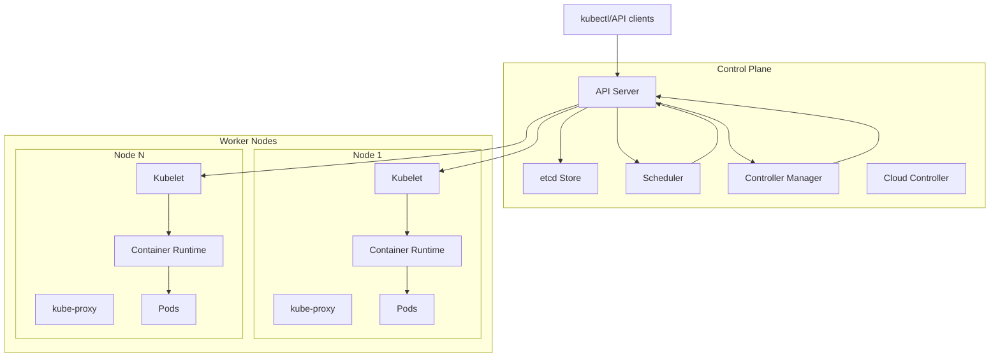
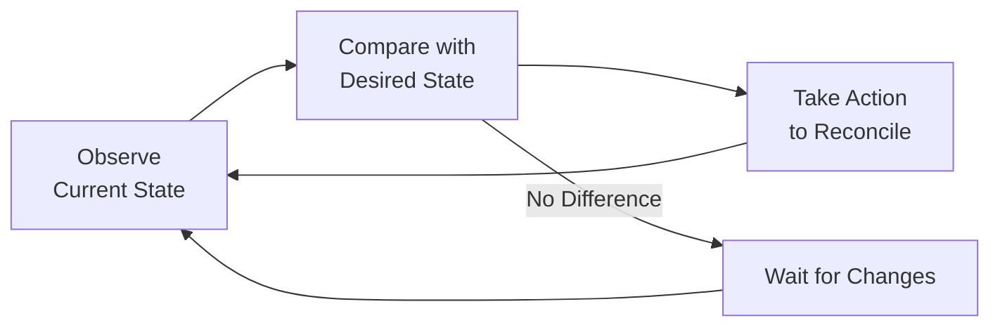
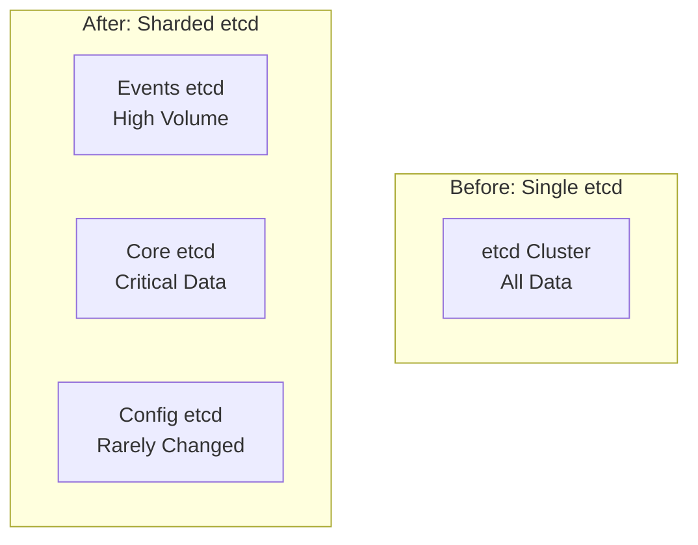
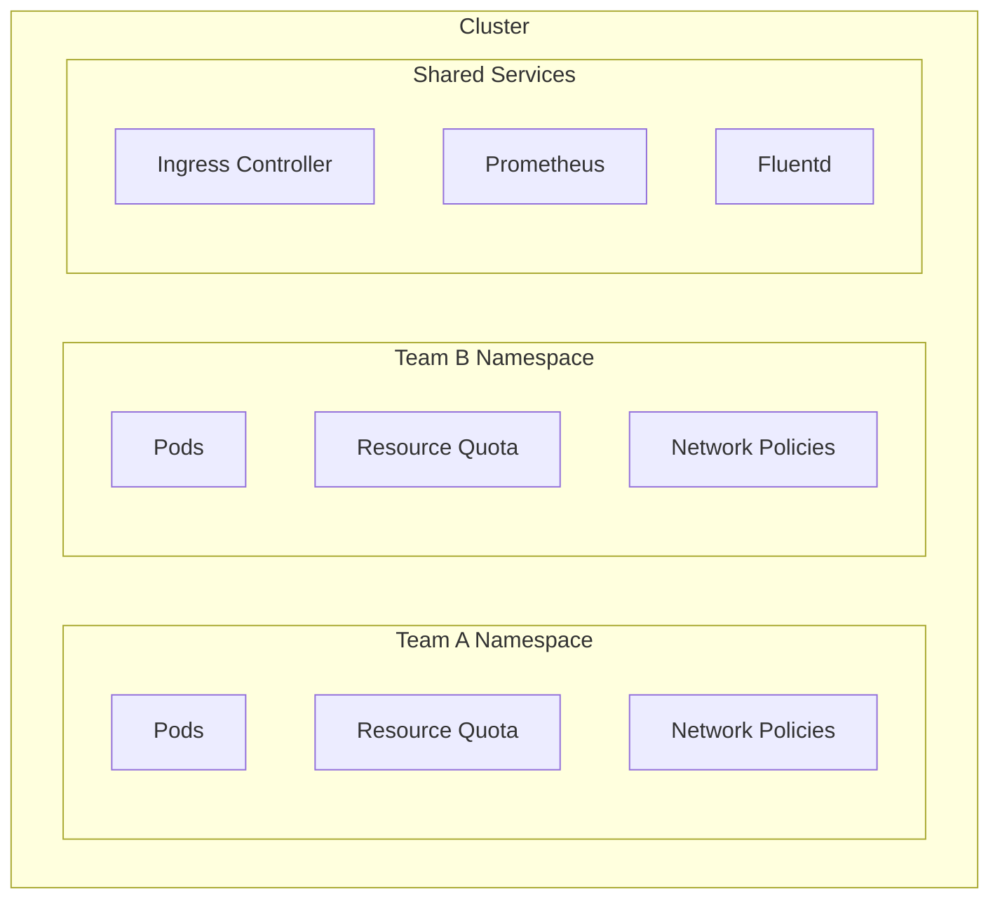
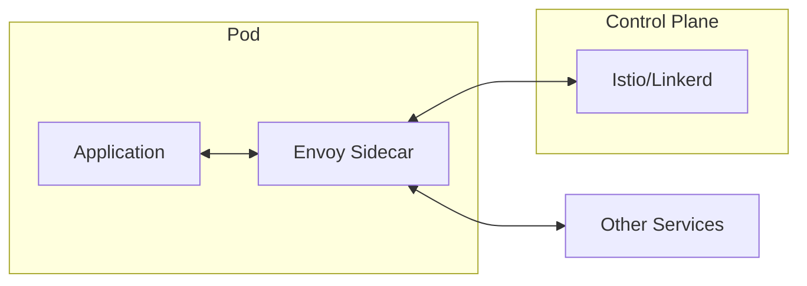

# Kubernetes: Container Orchestration at Scale

!!! abstract "The Kubernetes Story"
    **🎯 Single Achievement**: Made container orchestration accessible to everyone
    **📊 Scale**: Google: 5,000 nodes/cluster, 300,000 pods
    **⏱️ Performance**: 1M+ API operations/sec
    **💡 Key Innovation**: Declarative API with reconciliation loops

## Why Kubernetes Matters

| Traditional Deployment | Kubernetes Innovation | Business Impact |
|----------------------|---------------------|----------------|
| **Manual scaling** → error-prone | **Declarative desired state** → self-healing | 90% reduction in ops |
| **Static placement** → inefficient | **Dynamic scheduling** → bin packing | 40% better utilization |
| **Hard-coded config** → rigid | **ConfigMaps/Secrets** → flexible | 10x faster deployments |
| **VM-level isolation** → heavy | **Container orchestration** → lightweight | 5x density improvement |

## Architecture Overview



## Core Design Principles

### 1. Declarative Configuration

```yaml
apiVersion: apps/v1
kind: Deployment
metadata:
  name: web-app
spec:
  replicas: 3  # Desired state: 3 replicas
  selector:
    matchLabels:
      app: web
  template:
    metadata:
      labels:
        app: web
    spec:
      containers:
      - name: nginx
        image: nginx:1.21
        resources:
          requests:
            cpu: 100m
            memory: 128Mi
          limits:
            cpu: 500m
            memory: 512Mi
```

### 2. Control Loop Pattern



### 3. API-Driven Architecture

| Component | Responsibility | Key Pattern |
|-----------|---------------|-------------|
| **API Server** | Central management | REST API, admission control |
| **etcd** | Distributed storage | Raft consensus, watch API |
| **Scheduler** | Pod placement | Bin packing, predicates/priorities |
| **Controller Manager** | State reconciliation | Control loops for all resources |
| **Kubelet** | Node agent | Pod lifecycle management |

## Scaling Challenges and Solutions

### Challenge 1: etcd Scalability

!!! warning "Scale Limit Hit"
    At 1,000 nodes, etcd becomes bottleneck with 2GB+ data

**Solution**: Sharding and optimization


### Challenge 2: API Server Load

**Problem**: 1M+ watch connections overwhelming API server

**Solution**: API Priority and Fairness
```go
/ Priority levels for API requests
type PriorityLevel struct {
    Name string
    NominalConcurrencyShares int32
    QueueLengthLimit int32
}

/ Example configuration
workloadPriority := PriorityLevel{
    Name: "workload-low",
    NominalConcurrencyShares: 100,
    QueueLengthLimit: 50,
}
```

### Challenge 3: Scheduling at Scale

**Scheduling Decision Time**:
- 100 nodes: <10ms
- 1,000 nodes: ~100ms
- 5,000 nodes: >1s (problematic)

**Optimizations**:
1. **Equivalence Classes**: Group similar nodes
2. **Scheduling Framework**: Pluggable scheduling pipeline
3. **Preemption**: Evict lower priority pods

## Production Patterns

### Multi-Tenancy Design



### High Availability Setup

| Component | HA Strategy | Minimum Replicas |
|-----------|------------|------------------|
| **etcd** | Raft consensus | 3 (tolerates 1 failure) |
| **API Server** | Load balanced | 3 |
| **Controller Manager** | Leader election | 3 (1 active) |
| **Scheduler** | Leader election | 3 (1 active) |

## Operational Excellence

### Monitoring Stack

```yaml
# Key metrics to monitor
metrics:
  cluster_health:
    - node_ready_status
    - pod_restart_count
    - api_request_latency_p99
    - etcd_disk_wal_fsync_duration
  
  resource_usage:
    - node_cpu_utilization
    - node_memory_utilization
    - pod_cpu_usage
    - persistent_volume_usage
  
  application_health:
    - deployment_replica_availability
    - pod_startup_latency
    - ingress_request_rate
    - service_endpoint_health
```

### Disaster Recovery

1. **etcd Backup**:
   ```bash
   ETCDCTL_API=3 etcdctl snapshot save backup.db \
     --endpoints=https://127.0.0.1:2379 \
     --cacert=/etc/etcd/ca.crt \
     --cert=/etc/etcd/server.crt \
     --key=/etc/etcd/server.key
   ```

2. **Cluster State Backup**:
   - Persistent Volume snapshots
   - Application configuration (GitOps)
   - RBAC policies and secrets

## Lessons Learned

### What Worked Well

1. **Declarative API**: Enables GitOps and automation
2. **Extensibility**: CRDs allow custom resources
3. **Ecosystem**: Rich set of tools and operators
4. **Portability**: Runs anywhere from laptop to cloud

### What Didn't Scale

1. **Large Clusters**: >5,000 nodes requires significant tuning
2. **Object Count**: Millions of objects stress etcd
3. **Audit Logging**: Can overwhelm storage at scale
4. **IPv4 Address Space**: Requires careful CIDR planning

## Modern Enhancements

### Service Mesh Integration



### Serverless on Kubernetes

- **Knative**: Request-based autoscaling
- **KEDA**: Event-driven autoscaling
- **Virtual Kubelet**: Serverless node providers

## Decision Framework

### When to Use Kubernetes

✅ **Perfect Fit**:
- Microservices architectures
- Multi-cloud deployments
- Stateless applications
- CI/CD automation needs

⚠️ **Consider Carefully**:
- Stateful applications (databases)
- HPC workloads
- Real-time systems
- Small deployments (<10 containers)

❌ **Avoid**:
- Single monolithic apps
- Extremely latency-sensitive apps
- Organizations without DevOps culture

## Key Takeaways

!!! success "Critical Success Factors"
    1. **Start Small**: Master basics before advanced features
    2. **Invest in Observability**: You can't manage what you can't measure
    3. **Automate Everything**: Manual processes don't scale
    4. **Plan for Day 2**: Operations matter more than deployment
    5. **Security First**: Network policies, RBAC, pod security standards

## Related Topics

- [Service Discovery](../pattern-library/communication/service-discovery/) - Core Kubernetes pattern
- [Health Checks](../pattern-library/resilience/health-check/) - Liveness and readiness probes
- [Leader Election](../pattern-library/coordination/leader-election/) - Used by control plane
- [Sidecar Pattern](../pattern-library/architecture/sidecar/) - Common in Kubernetes
- [Blue-Green Deployment](../pattern-library/blue-green-deployment.md/) - Kubernetes native

## References

1. [Kubernetes: Up and Running](https://www.oreilly.com/library/view/kubernetes-up-and/9781492046523/)
2. [Large-scale cluster management at Google with Borg](https://research.google/pubs/pub43438/)
3. [Kubernetes The Hard Way](https://github.com/kelseyhightower/kubernetes-the-hard-way/)
4. [Production Kubernetes](https://www.oreilly.com/library/view/production-kubernetes/9781492042747/)
