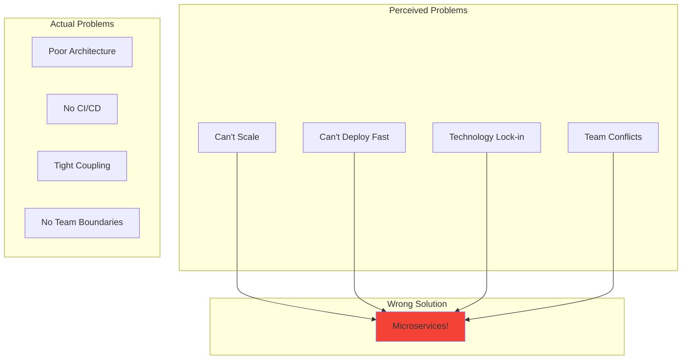
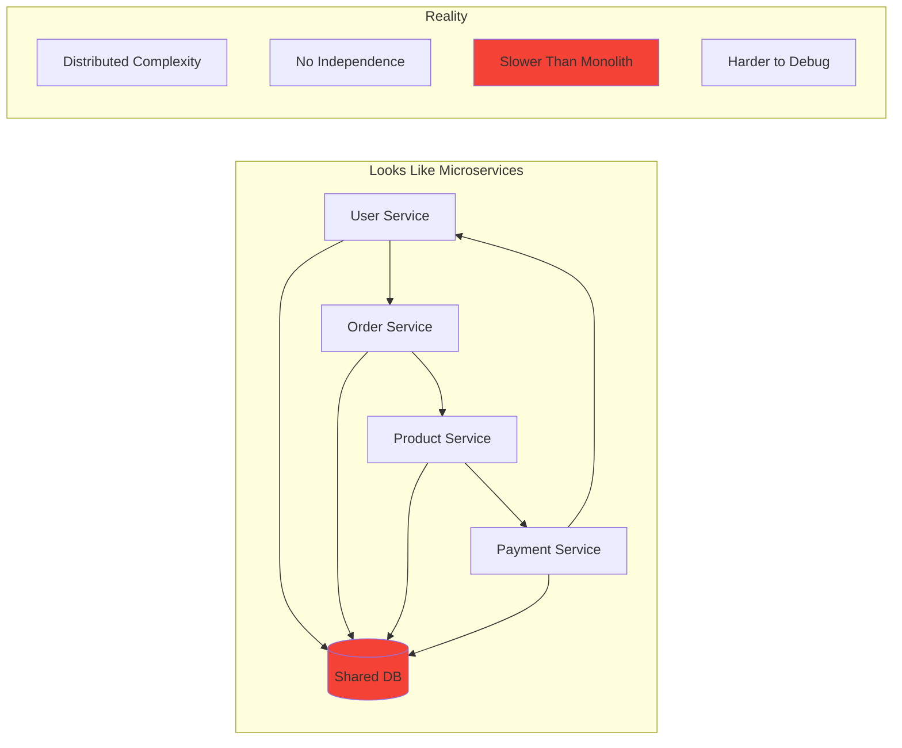
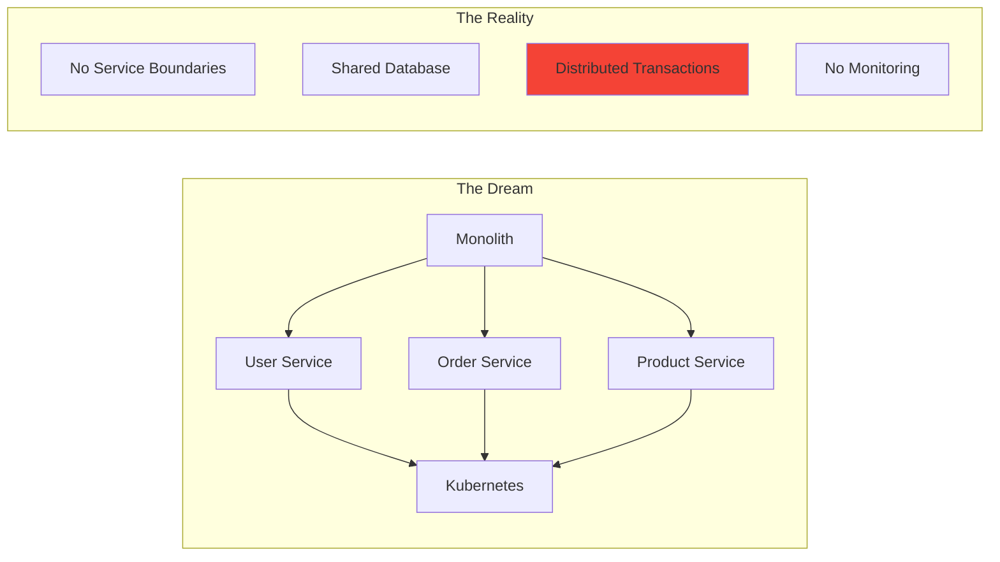
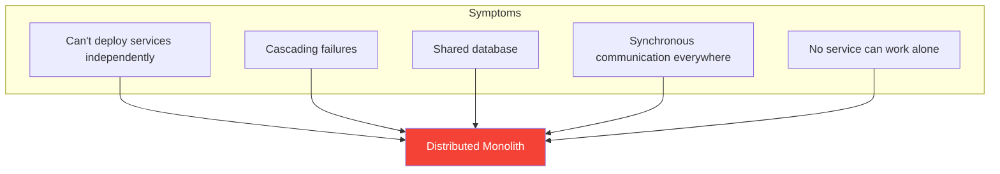
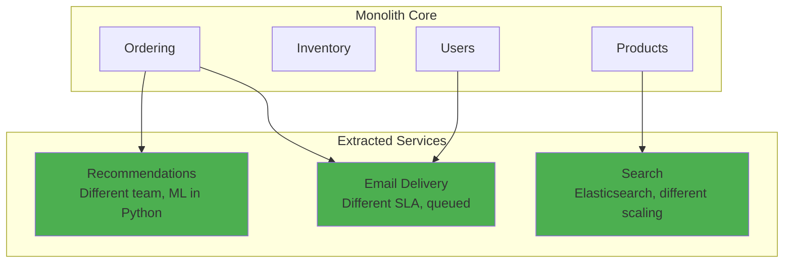
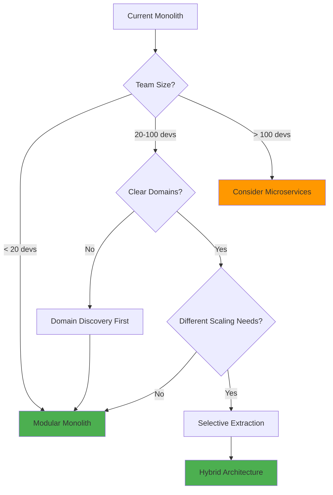

# Migration: From Monolith to Microservices

!!! warning "Excellence Badge"
    🥉 **Bronze Tier**: Learn from failures - consider modern alternatives

!!! danger "Reality Check"
    Over 50% of microservices migrations fail or result in distributed monoliths. This case study examines why and presents better approaches.

!!! abstract "Migration Reality"
    | Aspect | Monolith | Microservices | Reality Check |
    |--------|----------|---------------|---------------|
    | **Team Size** | 10 devs | 30+ devs | 3x increase |
    | **Deployment** | Weekly | Continuous | If done right |
    | **Complexity** | Centralized | Distributed | 10x harder |
    | **Cost** | $10K/month | $30K/month | 3x minimum |
    | **Time to Market** | Fast | Slower initially | 6-12 month penalty |

## Executive Summary

The microservices hype of 2014-2018 led many organizations to decompose working monoliths into distributed systems they couldn't operate effectively. This case study examines real migration attempts, why they failed, and presents modern alternatives that provide benefits without the complexity.

## The Monolith "Problem"

### Perceived Issues vs Reality



### The Distributed Monolith Anti-Pattern



## Common Migration Patterns

### Pattern 1: Big Bang (Usually Fails)

```python
## DON'T DO THIS
class BigBangMigration:
    """The 'rewrite everything' approach - 90% failure rate"""
    
    def migrate(self):
        # Stop all feature development
        self.freeze_monolith()
        
        # Spend 2 years building microservices
        services = self.build_all_services_from_scratch()
        
        # Attempt cutover
        try:
            self.switch_to_microservices()  # This usually fails
        except:
            # Now you have two systems to maintain
            self.maintain_both_systems()  # Technical debt doubles
```

### Pattern 2: Strangler Fig (Recommended)

```python
class StranglerFigMigration:
    """Gradual migration - 70% success rate when done right"""
    
    def migrate_gradually(self):
        # Step 1: Add API Gateway
        gateway = self.add_api_gateway()
        
        # Step 2: Identify bounded contexts
        contexts = self.event_storm_for_boundaries()
        
        # Step 3: Extract one service at a time
        for context in self.prioritize_contexts(contexts):
            # Extract high-value, low-risk services first
            service = self.extract_service(context)
            
            # Dual write during transition
            self.implement_dual_write(service, self.monolith)
            
            # Gradual cutover
            self.gradual_traffic_shift(service)
            
            # Only continue if successful
            if not self.is_successful(service):
                self.rollback()
                break
```

### Pattern 3: Modular Monolith First

```python
class ModularMonolithFirst:
    """Modern approach - 90% success rate"""
    
    def evolve_architecture(self):
        # Step 1: Modularize the monolith
        modules = self.create_clear_modules()
        
        # Step 2: Enforce boundaries
        self.add_module_boundaries(modules)
        
        # Step 3: Extract ONLY when needed
        for module in modules:
            if self.needs_independent_scaling(module) or \
               self.needs_independent_deployment(module) or \
               self.needs_different_technology(module):
                # Only then extract to service
                self.extract_to_service(module)
            else:
                # Keep in monolith
                continue
```

## Real Migration Journey

### Phase 1: Initial Enthusiasm (Month 1-3)



### Phase 2: Harsh Reality (Month 4-12)

```python
class MicroservicesReality:
    def __init__(self):
        self.problems = []
    
    def discover_distributed_transactions(self):
        """
        The order service needs to:
        1. Check inventory (Product Service)
        2. Reserve funds (Payment Service)  
        3. Create order (Order Service)
        4. Update user (User Service)
        
        ALL must succeed or ALL must rollback
        """
        try:
            # This is now distributed!
            self.start_saga()
        except:
            # Partial failure - data inconsistency
            self.manual_data_cleanup()  # 3am phone call
    
    def debug_production_issue(self):
        # Customer: "My order failed"
        # You: Check 15 different services logs
        correlation_id = self.find_correlation_id()  # If you're lucky
        
        # Trace through services
        for service in self.services:
            logs = self.check_service_logs(service, correlation_id)
            # Hope you have good logging
    
    def handle_cascading_failure(self):
        # One service is slow
        self.payment_service.latency = "5 seconds"
        
        # Cascading effect
        self.order_service.timeout()  # Waiting for payment
        self.api_gateway.timeout()    # Waiting for order
        self.frontend.error()         # User sees error
        
        # Meanwhile, payment actually succeeded
        # Customer charged but no order!
```

### Phase 3: Operational Nightmare (Month 13-24)

| Challenge | Monolith | Microservices | Impact |
|-----------|----------|---------------|--------|
| **Deployment** | 1 pipeline | 20 pipelines | 20x complexity |
| **Monitoring** | 1 dashboard | 20 dashboards | Alert fatigue |
| **Debugging** | 1 log file | Distributed tracing | 10x harder |
| **Testing** | Unit + Integration | +Contract +E2E | 5x test time |
| **Data Consistency** | ACID transactions | Eventual...maybe | Data corruption |

## Common Pitfalls

### Pitfall 1: Wrong Service Boundaries

```python
## BAD: Technical boundaries
class WrongBoundaries:
    services = [
        "DatabaseService",      # Just a CRUD wrapper
        "ValidationService",    # Anemic service
        "EmailService",        # Too fine-grained
        "LoggingService"       # Should be a library
    ]

## GOOD: Business boundaries  
class CorrectBoundaries:
    services = [
        "OrderManagement",     # Complete business capability
        "Inventory",           # Own their data
        "CustomerIdentity",    # Clear boundaries
        "Fulfillment"         # Independent lifecycle
    ]
```

### Pitfall 2: Distributed Monolith



### Pitfall 3: Premature Optimization

```python
def should_extract_service(module):
    """
    Only extract a service when you have PROOF of need
    """
    
    # BAD reasons
    bad_reasons = [
        "It might need to scale differently",     # YAGNI
        "We want to use Node.js for this",       # Not enough
        "Other companies use microservices",      # Cargo cult
        "Our architects said so"                  # Question why
    ]
    
    # GOOD reasons
    good_reasons = [
        "Scaling 100x more than other modules",
        "Different team with different release cycle",
        "Regulatory requirement for isolation",
        "Third-party integration with specific needs"
    ]
    
    return any(good_reasons) and module.complexity > threshold
```

## Better Approaches

### Approach 1: Modular Monolith

```python
class ModularMonolith:
    """
    Get microservices benefits without the complexity
    """
    
    def structure(self):
        return {
            "modules": {
                "ordering": {
                    "api": "Internal API with contracts",
                    "domain": "Business logic",
                    "data": "Module-specific tables",
                    "events": "Published domain events"
                },
                "inventory": {
                    "api": "Separate internal API",
                    "domain": "Isolated logic",
                    "data": "Own tables, no sharing",
                    "events": "Inventory events"
                }
            },
            "benefits": [
                "Fast local development",
                "Simple deployment",
                "Easy debugging",
                "ACID transactions when needed",
                "Can extract modules later if needed"
            ]
        }
```

### Approach 2: Selective Service Extraction



## Success Metrics

### What Actually Matters

```python
class RealSuccessMetrics:
    def measure_success(self):
        return {
            # Business metrics (what actually matters)
            "time_to_market": "2x faster feature delivery",
            "system_reliability": "99.9% -> 99.99% uptime",
            "development_velocity": "More features per sprint",
            "customer_satisfaction": "Improved experience",
            
            # Technical metrics (means to an end)
            "deployment_frequency": "Daily vs weekly",
            "service_count": "Not a success metric!",
            "technology_diversity": "Only if it helps business"
        }
```

## Migration Decision Framework



## Lessons Learned

### Hard-Won Truths

!!! danger "Reality Check"
    1. **Microservices are not faster** - Distributed systems are slower
    2. **You need 3x more developers** - Operational complexity
    3. **It's not about technology** - It's about team organization
    4. **Most apps don't need it** - Be honest about your scale
    5. **Start modular, extract later** - Evolution, not revolution

### What We'd Do Differently

✅ **Do This Instead**
1. Start with a well-structured monolith
2. Establish clear module boundaries
3. Use events for loose coupling
4. Extract services only when proven necessary
5. Invest heavily in observability first

❌ **Avoid These**
1. Big bang rewrites
2. Too many fine-grained services  
3. Shared databases between services
4. Synchronous communication chains
5. Extracting services for wrong reasons

## Modern Guidance

### The Pragmatic Path

```python
def evolutionary_architecture():
    """
    Modern approach: Evolve based on actual needs
    """
    
    # Phase 1: Modular monolith
    monolith = build_modular_monolith()
    deploy_and_learn(monolith)
    
    # Phase 2: Identify pressure points
    bottlenecks = monitor_real_usage()
    
    # Phase 3: Selective extraction
    for bottleneck in bottlenecks:
        if bottleneck.needs_independent_scaling:
            extract_to_service(bottleneck)
        elif bottleneck.needs_different_technology:
            extract_to_service(bottleneck)
        else:
            optimize_in_place(bottleneck)
    
    # Result: Hybrid architecture
    # - Monolith for stable, coupled logic
    # - Services for specific needs
    # - Best of both worlds
```

!!! experiment "💡 Quick Thought Experiment: Dependency Elimination Strategy"
    **Apply the 5-step framework to monolith decomposition:**
    
    1. **INVENTORY**: Map all tightly coupled modules, shared libraries, database tables, deployment pipelines
    2. **PRIORITIZE**: Rank by change frequency × team ownership conflicts (user management + payment processing = highest friction)
    3. **ISOLATE**: Extract bounded contexts - separate databases, async communication, independent deployment pipelines
    4. **MIGRATE**: Use Strangler Fig pattern - new features as services, legacy features gradually extracted
    5. **MONITOR**: Track deployment frequency per team, cross-service dependencies, shared resource contention
    
    **Success Metric**: Achieve team autonomy - when Team A can release features without waiting for Team B, C, or D

## Related Resources

- [Modular Monolith Pattern](../pattern-library/modular-monolith.md)
- [Service Boundaries Guide](../architecture/boundaries.md)
- [Anti-Patterns: Distributed Monolith](../reference/anti-patterns/#distributed-monolith/)
- [Team Topologies](https://teamtopologies.com/)

---

*"If you can't build a monolith, what makes you think microservices are the answer?" - Simon Brown*