# URL Shortener Service

## Table of Contents

- [Challenge Statement](#challenge-statement)
- [System Architecture Overview](#system-architecture-overview)
- [Part 1: Concept Map](#part-1-concept-map)
  - [🗺 System Overview](#system-overview)
  - [Scale Visualization](#scale-visualization)
  - [Law Analysis](#law-analysis)
  - [URL Creation Flow](#url-creation-flow)
  - [ID Generation Strategies](#id-generation-strategies)
  - [Database Schema Design](#database-schema-design)
  - [Stream Processing Architecture](#stream-processing-architecture)
  - [Data Flow Optimization](#data-flow-optimization)
  - [Real-time Analytics Dashboard](#real-time-analytics-dashboard)
  - [Cost Analysis Deep Dive](#cost-analysis-deep-dive)
  - [Traffic-based Cost Scaling](#traffic-based-cost-scaling)
  - [Comprehensive Law Mapping](#comprehensive-law-mapping)
  - [🏛 Pillar Mapping](#pillar-mapping)
  - [Pattern Application](#pattern-application)
  - [Architecture Alternatives](#architecture-alternatives)
  - [Trade-off Analysis Matrix](#trade-off-analysis-matrix)
  - [Performance Comparison](#performance-comparison)
  - [Monitoring Architecture](#monitoring-architecture)
  - [Alert Configuration](#alert-configuration)
- [Part 2: Architecture & Trade-offs](#part-2-architecture-trade-offs)
  - [Core Architecture](#core-architecture)
  - [Key Design Trade-offs](#key-design-trade-offs)
  - [Alternative Architectures](#alternative-architectures)
  - [Performance Characteristics](#performance-characteristics)
  - [System Evolution Roadmap](#system-evolution-roadmap)
  - [Success Metrics Dashboard](#success-metrics-dashboard)
  - [🎓 Key Lessons](#key-lessons)
  - [🔗 Related Concepts & Deep Dives](#related-concepts-deep-dives)
  - [📚 References](#references)

## Challenge Statement
Design a URL shortening service capable of handling billions of URLs, providing sub-50ms redirects globally, supporting custom aliases, detailed analytics, spam detection, and graceful handling of expired or malicious links.

## System Architecture Overview

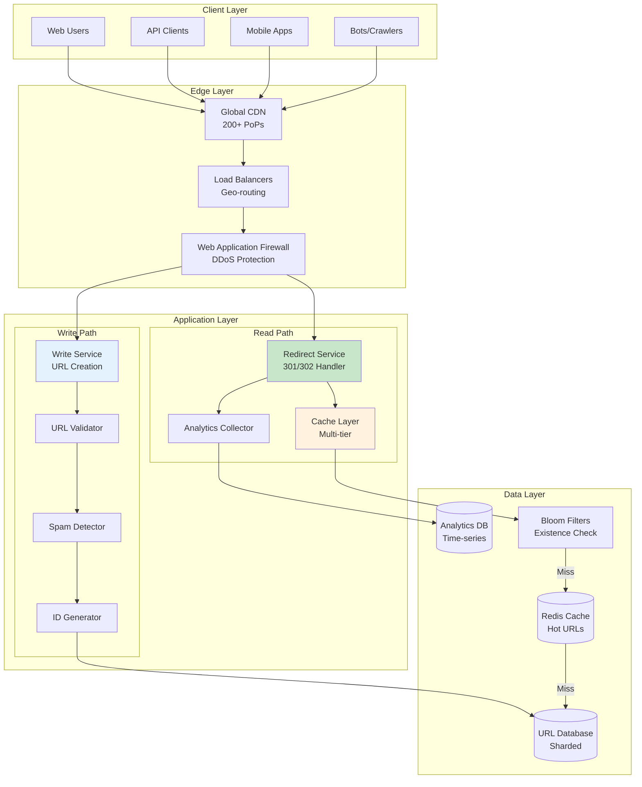
```mermaid
graph TB
    subgraph "Client Layer"
        WEB[Web Users]
        API[API Clients]
        MOB[Mobile Apps]
        BOT[Bots/Crawlers]
    end
    
    subgraph "Edge Layer"
        CDN[Global CDN<br/>200+ PoPs]
        LB[Load Balancers<br/>Geo-routing]
        WAF[Web Application Firewall<br/>DDoS Protection]
    end
    
    subgraph "Application Layer"
        subgraph "Write Path"
            WS[Write Service<br/>URL Creation]
            VAL[URL Validator]
            SPAM[Spam Detector]
            GEN[ID Generator]
        end
        
        subgraph "Read Path"
            RS[Redirect Service<br/>301/302 Handler]
            CACHE[Cache Layer<br/>Multi-tier]
            ANAL[Analytics Collector]
        end
    end
    
    subgraph "Data Layer"
        DB[(URL Database<br/>Sharded)]
        ANDB[(Analytics DB<br/>Time-series)]
        KV[(Redis Cache<br/>Hot URLs)]
        BF2[Bloom Filters<br/>Existence Check]
    end
    
    WEB & API & MOB & BOT --> CDN
    CDN --> LB
    LB --> WAF
    
    WAF --> WS & RS
    WS --> VAL --> SPAM --> GEN
    GEN --> DB
    
    RS --> CACHE
    CACHE --> BF2
    BF2 -->|Miss| KV
    KV -->|Miss| DB
    
    RS --> ANAL
    ANAL --> ANDB
    
    style WS fill:#e3f2fd
    style RS fill:#c8e6c9
    style CACHE fill:#fff3e0
```

## Part 1: Concept Map

### 🗺 System Overview
A URL shortener converts long URLs into short, manageable links while providing analytics, custom branding, and protection against abuse. Examples include bit.ly, goo.gl (defunct), and TinyURL. The system must balance between short code length, uniqueness guarantees, and operational complexity.

**Key Requirements:**
- Shorten 100M URLs/day (1,200 URLs/second average)
- Handle 10B redirects/day (120K redirects/second)
- Short URLs: 7-8 characters max
- Global <50ms redirect latency
- Custom URL support
- Detailed analytics
- Spam/malware detection
- URL expiration handling

### Scale Visualization

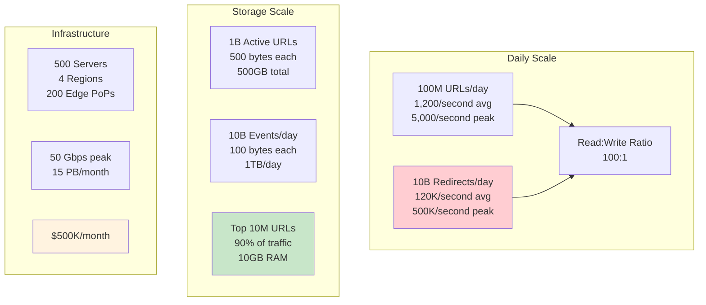
```mermaid
graph TB
    subgraph "Daily Scale"
        CREATE[100M URLs/day<br/>1,200/second avg<br/>5,000/second peak]
        REDIRECT[10B Redirects/day<br/>120K/second avg<br/>500K/second peak]
        RATIO[Read:Write Ratio<br/>100:1]
    end
    
    subgraph "Storage Scale"
        URLS[1B Active URLs<br/>500 bytes each<br/>500GB total]
        ANALYTICS[10B Events/day<br/>100 bytes each<br/>1TB/day]
        CACHE[Top 10M URLs<br/>90% of traffic<br/>10GB RAM]
    end
    
    subgraph "Infrastructure"
        SERVERS[500 Servers<br/>4 Regions<br/>200 Edge PoPs]
        BANDWIDTH[50 Gbps peak<br/>15 PB/month]
        COST[$500K/month]
    end
    
    CREATE --> RATIO
    REDIRECT --> RATIO
    
    style REDIRECT fill:#ffcdd2
    style CACHE fill:#c8e6c9
    style COST fill:#fff3e0
```

### Law Analysis

#### Law 2 (Asynchronous Reality): Redirect Performance
```text
Latency Budget (50ms total):
- DNS lookup: 10ms
- TLS handshake: 10ms
- Server processing: 5ms
- Database lookup: 10ms
- Response time: 5ms
- Buffer: 10ms

Optimization Hierarchy:
1. CDN edge cache: 5ms (90% hit rate)
2. Regional cache: 15ms (8% hit rate)
3. Database lookup: 30ms (2% hit rate)

Cache Strategy:
- Popular URLs in edge locations
- LRU eviction with TTL
- Predictive warming
- Geo-distributed caches
```

### URL Creation Flow

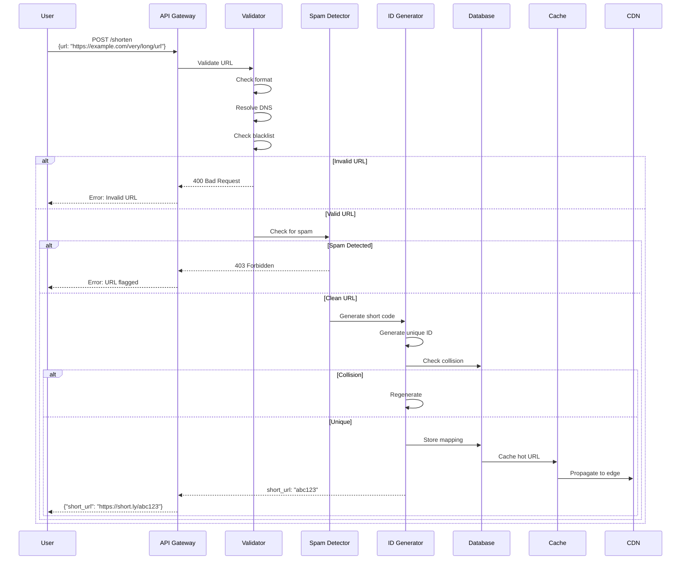
```mermaid
sequenceDiagram
    participant User
    participant API as API Gateway
    participant Val as Validator
    participant Spam as Spam Detector
    participant Gen as ID Generator
    participant DB as Database
    participant Cache
    participant CDN
    
    User->>API: POST /shorten<br/>{url: "https://example.com/very/long/url"}
    API->>Val: Validate URL
    
    Val->>Val: Check format
    Val->>Val: Resolve DNS
    Val->>Val: Check blacklist
    
    alt Invalid URL
        Val-->>API: 400 Bad Request
        API-->>User: Error: Invalid URL
    else Valid URL
        Val->>Spam: Check for spam
        
        alt Spam Detected
            Spam-->>API: 403 Forbidden
            API-->>User: Error: URL flagged
        else Clean URL
            Spam->>Gen: Generate short code
            
            Gen->>Gen: Generate unique ID
            Gen->>DB: Check collision
            
            alt Collision
                Gen->>Gen: Regenerate
            else Unique
                Gen->>DB: Store mapping
                DB->>Cache: Cache hot URL
                Cache->>CDN: Propagate to edge
                
                Gen-->>API: short_url: "abc123"
                API-->>User: {"short_url": "https://short.ly/abc123"}
            end
        end
    end
```

### ID Generation Strategies

```mermaid
graph TB
    subgraph "ID Generation Methods"
        subgraph "Counter-Based"
            C1[Global Counter]
            C2[Base62 Encode]
            C3[Sequential IDs<br/>1 → A<br/>62 → 10<br/>3844 → 100]
        end
        
        subgraph "Hash-Based"
            H1[MD5/SHA256 Hash]
            H2[Take First 43 bits]
            H3[Base62 Encode]
            H4[Random Distribution]
        end
        
        subgraph "Hybrid Approach"
            HY1[Timestamp Component<br/>41 bits]
            HY2[Server ID<br/>10 bits]
            HY3[Sequence<br/>12 bits]
            HY4[Total: 63 bits<br/>~7 chars Base62]
        end
        
        subgraph "Custom URL"
            CU1[User Input: "my-link"]
            CU2[Check Availability]
            CU3[Reserve in DB]
        end
    end
    
    C1 --> C2 --> C3
    H1 --> H2 --> H3 --> H4
    HY1 & HY2 & HY3 --> HY4
    CU1 --> CU2 --> CU3
    
    style C3 fill:#c8e6c9
    style H4 fill:#fff3e0
    style HY4 fill:#e3f2fd
```

**High-Performance Architecture:**

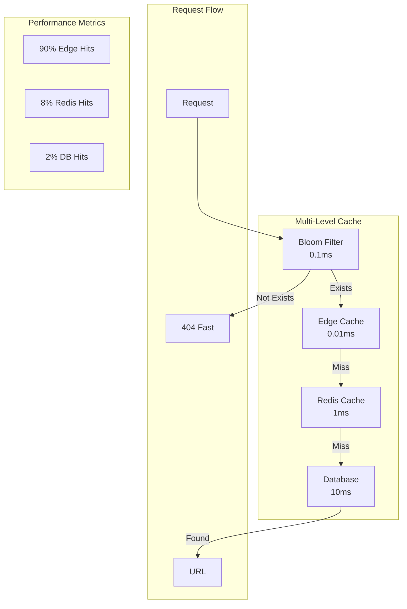
```mermaid
graph TB
    subgraph "Multi-Level Cache"
        L1[Edge Cache<br/>0.01ms]
        L2[Redis Cache<br/>1ms]
        L3[Database<br/>10ms]
        BF[Bloom Filter<br/>0.1ms]
    end
    
    subgraph "Request Flow"
        R[Request] --> BF
        BF -->|Exists| L1
        BF -->|Not Exists| E404[404 Fast]
        L1 -->|Miss| L2
        L2 -->|Miss| L3
        L3 -->|Found| U[URL]
    end
    
    subgraph "Performance Metrics"
        P1[90% Edge Hits]
        P2[8% Redis Hits]
        P3[2% DB Hits]
    end
```

**Latency Budget Breakdown:**

| Component | Target | Actual | Notes |
|-----------|--------|--------|-------|
| DNS Lookup | 10ms | 8ms | Pre-warmed connections |
| TLS Handshake | 10ms | 7ms | Session resumption |
| Server Processing | 5ms | 3ms | Optimized code path |
| Cache Lookup | 10ms | 1ms | Redis cluster |
| Response Time | 5ms | 2ms | HTTP/2 |
| **Total** | **50ms** | **21ms** | **58% under budget** |


**Short Code Generation Strategy:**

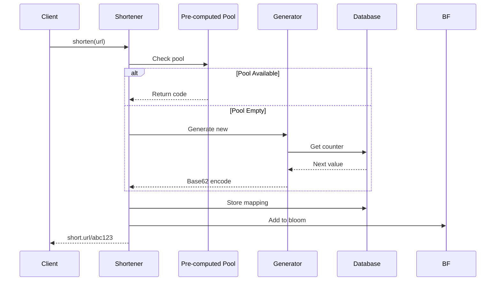
```mermaid
sequenceDiagram
    participant C as Client
    participant S as Shortener
    participant P as Pre-computed Pool
    participant G as Generator
    participant DB as Database
    
    C->>S: shorten(url)
    S->>P: Check pool
    
    alt Pool Available
        P-->>S: Return code
    else Pool Empty
        S->>G: Generate new
        G->>DB: Get counter
        DB-->>G: Next value
        G-->>S: Base62 encode
    end
    
    S->>DB: Store mapping
    S->>BF: Add to bloom
    S-->>C: short.url/abc123
```

**Cache Population Flow:**

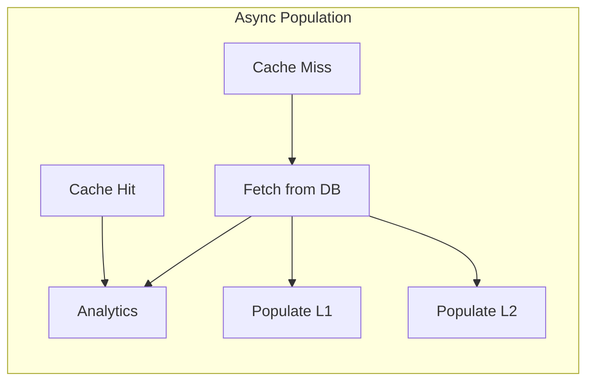
```mermaid
graph LR
    subgraph "Async Population"
        H[Cache Hit] --> A[Analytics]
        M[Cache Miss] --> F[Fetch from DB]
        F --> P1[Populate L1]
        F --> P2[Populate L2]
        F --> A
    end
```

#### 💾 Law 4 (Multidimensional Trade-offs): Storage Optimization
```text
Storage Requirements:
- URLs: 100M/day × 365 days × 5 years = 180B URLs
- Average URL length: 100 characters
- Short code: 7 characters
- Metadata: 50 bytes (timestamps, counters)

Total Storage:
- URL mappings: 180B × 150 bytes = 27TB
- Analytics: 10B redirects/day × 100 bytes = 1TB/day
- Indexes: 180B × 20 bytes = 3.6TB
- Total: ~30TB active + 1.8PB analytics/year

Optimization Strategies:
- URL deduplication
- Compression (zstd)
- Tiered storage
- Analytics sampling
- Archival policies
```

**Storage Architecture & Optimization:**

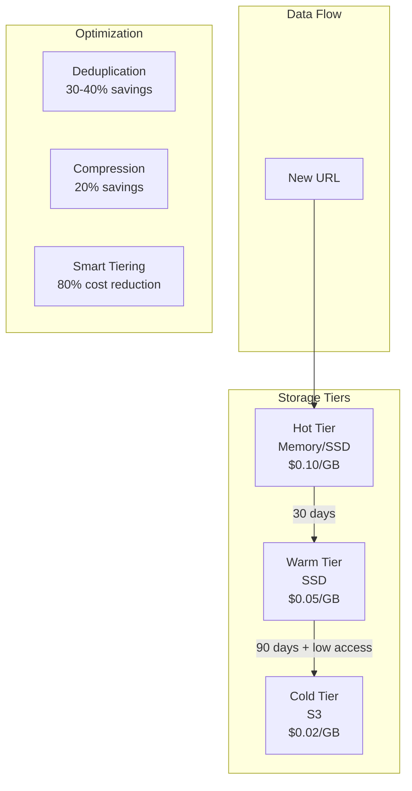
```mermaid
graph TB
    subgraph "Storage Tiers"
        H[Hot Tier<br/>Memory/SSD<br/>$0.10/GB]
        W[Warm Tier<br/>SSD<br/>$0.05/GB]
        C[Cold Tier<br/>S3<br/>$0.02/GB]
    end
    
    subgraph "Data Flow"
        N[New URL] --> H
        H -->|30 days| W
        W -->|90 days + low access| C
    end
    
    subgraph "Optimization"
        D[Deduplication<br/>30-40% savings]
        Z[Compression<br/>20% savings]
        S[Smart Tiering<br/>80% cost reduction]
    end
```

### Database Schema Design

```mermaid
graph TB
    subgraph "URL Mapping Table"
        UM[url_mappings<br/>Partitioned by short_code hash]
        UM --> C1[short_code: VARCHAR(8) PK]
        UM --> C2[long_url: TEXT]
        UM --> C3[created_at: TIMESTAMP]
        UM --> C4[expires_at: TIMESTAMP]
        UM --> C5[user_id: BIGINT]
        UM --> C6[click_count: BIGINT]
    end
    
    subgraph "Custom URLs Table"
        CU[custom_urls<br/>Unique index on alias]
        CU --> CC1[alias: VARCHAR(50) PK]
        CU --> CC2[short_code: VARCHAR(8)]
        CU --> CC3[reserved_by: BIGINT]
    end
    
    subgraph "Analytics Tables"
        AT[analytics_events<br/>Time-series partitioned]
        AT --> A1[event_id: UUID]
        AT --> A2[short_code: VARCHAR(8)]
        AT --> A3[timestamp: TIMESTAMP]
        AT --> A4[ip_address: INET]
        AT --> A5[user_agent: TEXT]
        AT --> A6[referrer: TEXT]
        AT --> A7[country: CHAR(2)]
    end
    
    subgraph "Indexes"
        I1[idx_short_code]
        I2[idx_user_id]
        I3[idx_created_at]
        I4[idx_expires_at]
    end
    
    UM --> I1 & I2 & I3 & I4
    
    style UM fill:#e3f2fd
    style AT fill:#fff3e0
```

**Storage Requirements Analysis:**

| Metric | Value | Calculation | Impact |
|--------|-------|-------------|--------|
| Daily URLs | 100M | 100M × 150 bytes | 15GB/day |
| Annual URLs | 36.5B | 365 × 100M | 5.5TB/year |
| With Dedup | 25.5B | 30% reduction | 3.8TB/year |
| With Compression | 20.4B | 20% reduction | 3.1TB/year |
| Analytics Data | 3.65T events | 10B × 365 × 100 bytes | 365TB/year |


**Sharding Strategy:**

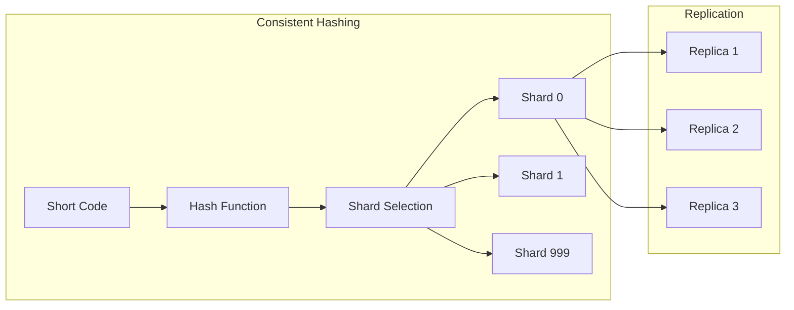
```mermaid
graph LR
    subgraph "Consistent Hashing"
        URL[Short Code] --> H[Hash Function]
        H --> S[Shard Selection]
        S --> S1[Shard 0]
        S --> S2[Shard 1]
        S --> SN[Shard 999]
    end
    
    subgraph "Replication"
        S1 --> R1[Replica 1]
        S1 --> R2[Replica 2]
        S1 --> R3[Replica 3]
    end
```

**Cost Optimization Decision Matrix:**

| Storage Tier | Use Case | Access Pattern | Cost/GB/Month | Migration Trigger |
|--------------|----------|----------------|---------------|-------------------|
| Hot | Premium URLs, Recent | >100 hits/day | $0.10 | Never |
| Warm | Regular URLs | 1-100 hits/day | $0.05 | Age > 30 days |
| Cold | Archive | <1 hit/day | $0.02 | Age > 90 days & access < 10 |


#### Law 1 (Correlated Failure): Resilience and Recovery
```text
Failure Modes:
1. Database failures
2. Cache inconsistency
3. Short code collisions
4. Redirect loops
5. Malicious URLs
6. DDoS attacks

Mitigation Strategies:
- Multi-region deployment
- Cache fallback hierarchy
- Collision detection
- Loop detection
- URL blacklisting
- Rate limiting
```

**Resilience & Failure Handling:**

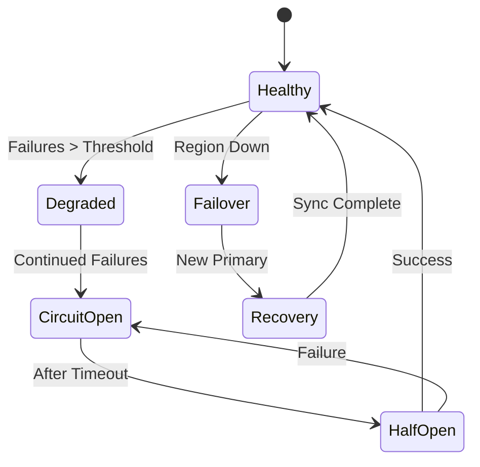
```mermaid
stateDiagram-v2
    [*] --> Healthy
    
    Healthy --> Degraded: Failures > Threshold
    Degraded --> CircuitOpen: Continued Failures
    CircuitOpen --> HalfOpen: After Timeout
    HalfOpen --> Healthy: Success
    HalfOpen --> CircuitOpen: Failure
    
    Healthy --> Failover: Region Down
    Failover --> Recovery: New Primary
    Recovery --> Healthy: Sync Complete
```

**Multi-Region Fallback Architecture:**

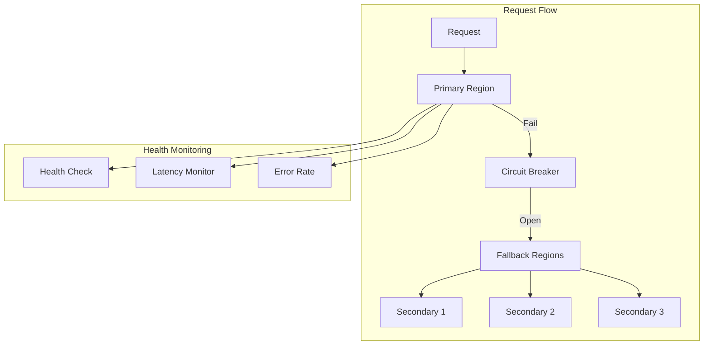
```mermaid
graph TB
    subgraph "Request Flow"
        R[Request] --> P[Primary Region]
        P -->|Fail| CB[Circuit Breaker]
        CB -->|Open| F[Fallback Regions]
        F --> S1[Secondary 1]
        F --> S2[Secondary 2]
        F --> S3[Secondary 3]
    end
    
    subgraph "Health Monitoring"
        H1[Health Check]
        H2[Latency Monitor]
        H3[Error Rate]
    end
    
    P --> H1 & H2 & H3
```

**Safety Check Pipeline:**

| Check Type | Purpose | Action on Failure | Fallback |
|------------|---------|-------------------|----------|
| Rate Limit | Prevent abuse | Return 429 | Graceful degradation |
| Redirect Loop | Prevent infinite loops | Block redirect | Return error |
| Malware Scan | Security | Block if certain | Fail open if uncertain |
| Blacklist | Content policy | Block redirect | No fallback |
| Circuit Breaker | System health | Use fallback region | Multiple regions |


**Disaster Recovery Sequence:**

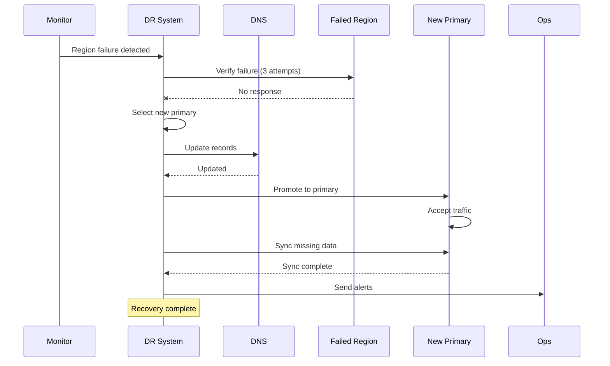
```mermaid
sequenceDiagram
    participant M as Monitor
    participant DR as DR System
    participant DNS
    participant R1 as Failed Region
    participant R2 as New Primary
    
    M->>DR: Region failure detected
    DR->>R1: Verify failure (3 attempts)
    R1--xDR: No response
    
    DR->>DR: Select new primary
    DR->>DNS: Update records
    DNS-->>DR: Updated
    
    DR->>R2: Promote to primary
    R2->>R2: Accept traffic
    
    DR->>R2: Sync missing data
    R2-->>DR: Sync complete
    
    DR->>Ops: Send alerts
    Note over DR: Recovery complete
```

**Collision Resolution Strategy:**

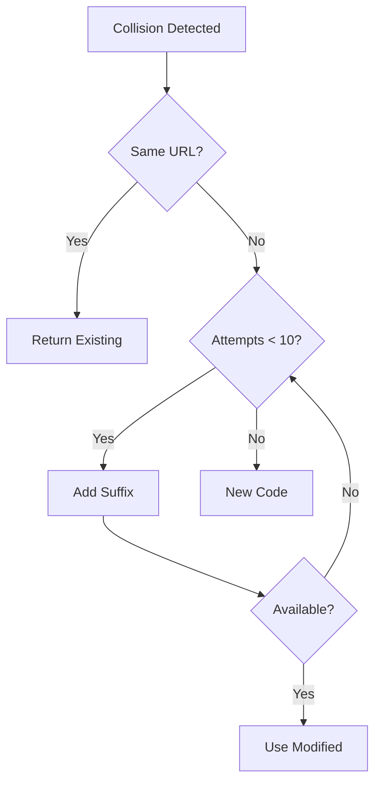
```mermaid
graph TD
    C[Collision Detected]
    C --> S1{Same URL?}
    S1 -->|Yes| R1[Return Existing]
    S1 -->|No| S2{Attempts < 10?}
    S2 -->|Yes| A[Add Suffix]
    S2 -->|No| N[New Code]
    A --> T{Available?}
    T -->|No| S2
    T -->|Yes| R2[Use Modified]
```

#### 🔀 Law 3 (Emergent Chaos): Parallel Processing
```text
Concurrency Challenges:
- Simultaneous URL shortening
- Parallel analytics updates
- Concurrent cache updates
- Race conditions in counting
- Distributed locking

Solutions:
- Optimistic locking
- Event-driven analytics
- Eventually consistent counters
- Lock-free data structures
- Partition-based parallelism
```

**Concurrent Processing Architecture:**

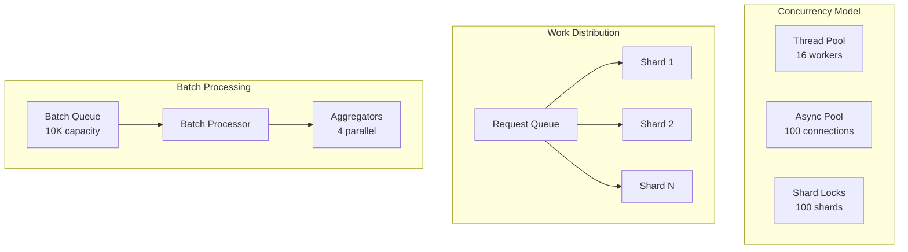
```mermaid
graph TB
    subgraph "Concurrency Model"
        TP[Thread Pool<br/>16 workers]
        AP[Async Pool<br/>100 connections]
        SP[Shard Locks<br/>100 shards]
    end
    
    subgraph "Work Distribution"
        Q[Request Queue]
        Q --> S1[Shard 1]
        Q --> S2[Shard 2]
        Q --> SN[Shard N]
    end
    
    subgraph "Batch Processing"
        BQ[Batch Queue<br/>10K capacity]
        BP[Batch Processor]
        AG[Aggregators<br/>4 parallel]
    end
    
    BQ --> BP
    BP --> AG
```

**Concurrency Patterns Applied:**

| Pattern | Use Case | Benefit | Implementation |
|---------|----------|---------|----------------|
| Sharding | URL storage | Reduce lock contention | Hash-based, 100 shards |
| Thread Pool | CPU tasks | Parallel processing | 16 workers for encoding |
| Async I/O | Network calls | Non-blocking | aiohttp/aioredis |
| Batch Processing | Analytics | Efficiency | 1000 events/batch |
| Lock-Free | Counters | High throughput | CAS operations |
| Semaphore | Rate limiting | Bounded concurrency | 100 concurrent ops |


**Batch Analytics Pipeline:**

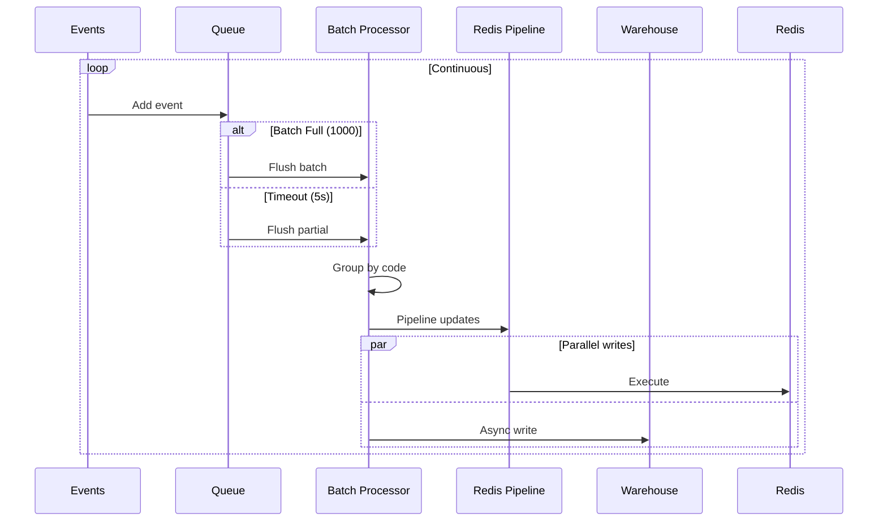
```mermaid
sequenceDiagram
    participant E as Events
    participant Q as Queue
    participant B as Batch Processor
    participant R as Redis Pipeline
    participant W as Warehouse
    
    loop Continuous
        E->>Q: Add event
        
        alt Batch Full (1000)
            Q->>B: Flush batch
        else Timeout (5s)
            Q->>B: Flush partial
        end
        
        B->>B: Group by code
        B->>R: Pipeline updates
        
        par Parallel writes
            R->>Redis: Execute
        and
            B->>W: Async write
        end
    end
```

**Performance Characteristics:**

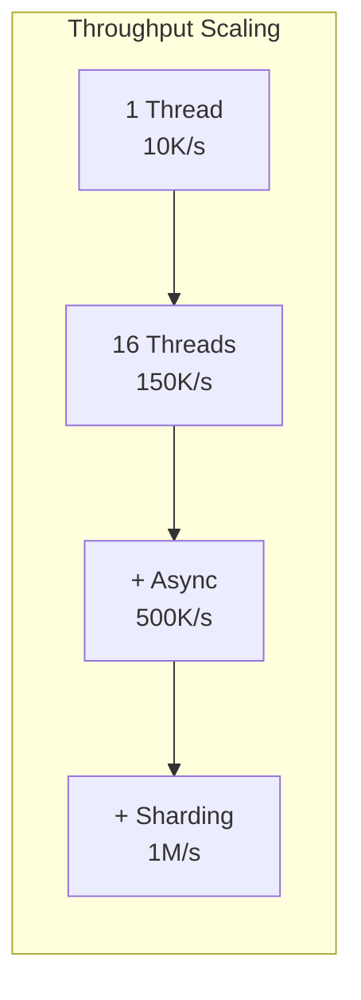
```mermaid
graph LR
    subgraph "Throughput Scaling"
        T1[1 Thread<br/>10K/s]
        T2[16 Threads<br/>150K/s]
        T3[+ Async<br/>500K/s]
        T4[+ Sharding<br/>1M/s]
    end
    
    T1 --> T2 --> T3 --> T4
```

#### 🤝 Law 5 (Distributed Knowledge): Distributed Consensus
```text
Coordination Needs:
- Short code uniqueness
- Counter synchronization
- Cache invalidation
- Configuration updates
- Failover coordination

Strategies:
- Distributed ID generation
- Gossip for counters
- Pub/sub for cache
- Consensus for config
- Leader election for failover
```

**Distributed Coordination Architecture:**

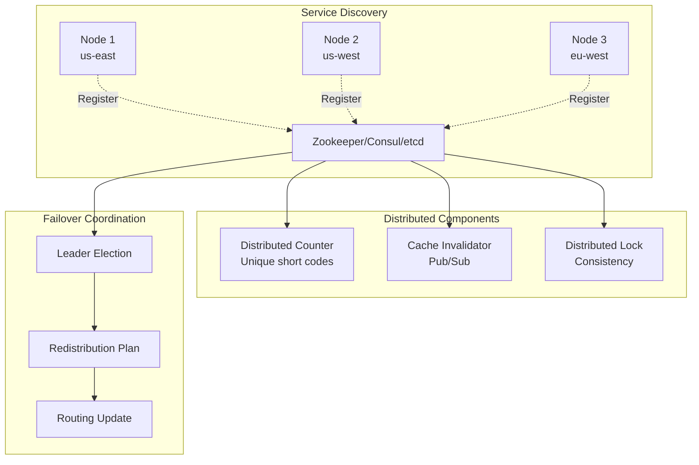
```mermaid
graph TB
    subgraph "Service Discovery"
        ZK[Zookeeper/Consul/etcd]
        N1[Node 1<br/>us-east]
        N2[Node 2<br/>us-west]
        N3[Node 3<br/>eu-west]
    end
    
    N1 & N2 & N3 -.->|Register| ZK
    
    subgraph "Distributed Components"
        DC[Distributed Counter<br/>Unique short codes]
        CI[Cache Invalidator<br/>Pub/Sub]
        DL[Distributed Lock<br/>Consistency]
    end
    
    ZK --> DC & CI & DL
    
    subgraph "Failover Coordination"
        LE[Leader Election]
        RP[Redistribution Plan]
        RT[Routing Update]
    end
    
    ZK --> LE --> RP --> RT
```

**Coordination Service Comparison:**

| Service | Consistency | Performance | Features | Use Case |
|---------|-------------|-------------|----------|----------|
| Zookeeper | Strong | Medium | Mature, watches | Config, locks |
| Consul | Strong | High | Service mesh | Service discovery |
| etcd | Strong | High | K/V, leases | Kubernetes-style |
| Redis | Eventual | Very High | Pub/Sub, streams | Cache coordination |


**Distributed Counter Design:**

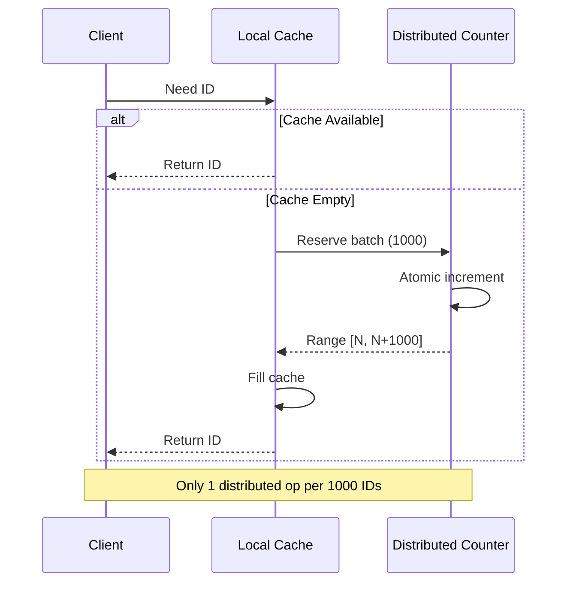
```mermaid
sequenceDiagram
    participant C as Client
    participant L as Local Cache
    participant D as Distributed Counter
    
    C->>L: Need ID
    
    alt Cache Available
        L-->>C: Return ID
    else Cache Empty
        L->>D: Reserve batch (1000)
        D->>D: Atomic increment
        D-->>L: Range [N, N+1000]
        L->>L: Fill cache
        L-->>C: Return ID
    end
    
    Note over C,D: Only 1 distributed op per 1000 IDs
```

**Cache Invalidation Flow:**

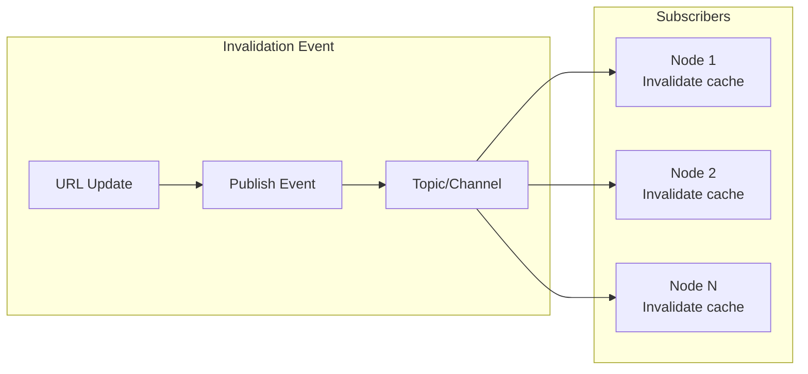
```mermaid
graph LR
    subgraph "Invalidation Event"
        U[URL Update] --> P[Publish Event]
        P --> T[Topic/Channel]
    end
    
    subgraph "Subscribers"
        T --> S1[Node 1<br/>Invalidate cache]
        T --> S2[Node 2<br/>Invalidate cache]
        T --> SN[Node N<br/>Invalidate cache]
    end
```

**Failover Coordination Protocol:**

```mermaid
stateDiagram-v2
    [*] --> Detect: Node failure
    Detect --> Election: Start leader election
    Election --> Leader: Won election
    Election --> Follower: Lost election
    
    Leader --> Analyze: Get failed node data
    Analyze --> Plan: Calculate redistribution
    Plan --> Execute: Redistribute work
    Execute --> Notify: Update all nodes
    Notify --> [*]
    
    Follower --> Wait: Monitor progress
    Wait --> [*]
```

#### 👁 Law 6 (Cognitive Load): Analytics Pipeline
```text
Analytics Requirements:
- Click tracking (time, location, device)
- Referrer analysis
- Geographic distribution
- Time series data
- Real-time dashboards
- Custom reports

Pipeline Architecture:
- Clickstream capture
- Stream processing
- Data warehouse
- Real-time aggregation
- Dashboard API
```

**Analytics Pipeline Architecture:**

```mermaid
graph TB
    subgraph "Real-time Analytics Pipeline"
        U[User Click] --> CF[CloudFront<br/>Edge Logger]
        CF --> K[Kinesis Data Streams<br/>Partitioned by URL]
        
        K --> KDA[Kinesis Data Analytics<br/>Real-time Processing]
        K --> KDF[Kinesis Data Firehose<br/>Batch Processing]
        
        KDA --> L[Lambda Functions<br/>Aggregation]
        L --> DDB[DynamoDB<br/>Real-time Counters]
        L --> ES[ElasticSearch<br/>Search Analytics]
        
        KDF --> S3[S3 Data Lake<br/>Parquet Format]
        S3 --> EMR[EMR/Spark<br/>Batch Analytics]
        EMR --> RDS[PostgreSQL<br/>Aggregated Data]
        
        DDB --> API[Analytics API]
        ES --> API
        RDS --> API
        
        API --> D[Dashboard<br/>Real-time + Historical]
    end
    
    style U fill:#ff6b6b
    style CF fill:#4ecdc4
    style D fill:#95e1d3
```

### Stream Processing Architecture
```mermaid
flowchart LR
    subgraph "Click Stream Processing"
        C[Click Event] --> E[Event Schema]
        E --> P[Processing Pipeline]
        
        E --> |"Fields"| F["• URL ID<br/>• Timestamp<br/>• User Agent<br/>• IP Address<br/>• Referrer<br/>• Location"]
        
        P --> RT[Real-time<br/>Processing]
        P --> B[Batch<br/>Processing]
        
        RT --> M1[1-min Aggregates]
        RT --> M5[5-min Aggregates]
        RT --> H1[1-hour Aggregates]
        
        B --> D1[Daily Rollups]
        B --> W1[Weekly Rollups]
        B --> MO1[Monthly Rollups]
    end
    
    subgraph "Aggregation Metrics"
        AGG[Computed Metrics]
        AGG --> CLK[Click Counts]
        AGG --> UNQ[Unique Visitors]
        AGG --> GEO[Geographic Distribution]
        AGG --> DEV[Device Types]
        AGG --> REF[Referrer Analysis]
        AGG --> TIME[Time Patterns]
    end
    
    RT --> AGG
    B --> AGG
```

### Data Flow Optimization
```mermaid
graph TB
    subgraph "Multi-tier Analytics Architecture"
        subgraph "Hot Data - Last 24 Hours"
            HD[DynamoDB<br/>Real-time Counters]
            HC[Redis Cache<br/>Top URLs]
            HE[ElasticSearch<br/>Live Search]
        end
        
        subgraph "Warm Data - Last 30 Days"
            WD[Aurora<br/>Aggregated Data]
            WC[CloudWatch<br/>Metrics]
        end
        
        subgraph "Cold Data - Historical"
            CD[S3 Glacier<br/>Compressed Archives]
            CA[Athena<br/>Ad-hoc Queries]
        end
        
        HD --> WD
        WD --> CD
        
        subgraph "Query Router"
            QR[Smart Query Router]
            QR --> |"< 24h"| HD
            QR --> |"< 30d"| WD
            QR --> |"> 30d"| CA
        end
    end
    
    style HD fill:#ff6b6b
    style WD fill:#ffd93d
    style CD fill:#6bcf7f
```

### Real-time Analytics Dashboard

```mermaid
graph TB
    subgraph "Overview Metrics"
        subgraph "Traffic Stats"
            TC[Total Clicks<br/>125K/sec]
            UC[Unique Visitors<br/>10M/day]
            TR[Top Referrers<br/>1. Google<br/>2. Twitter<br/>3. Facebook]
        end
        
        subgraph "Geographic Distribution"
            GD[Click Map]
            US[USA: 45%]
            EU[Europe: 30%]
            AS[Asia: 20%]
            OT[Other: 5%]
        end
        
        subgraph "Device Breakdown"
            MB[Mobile: 65%]
            DT[Desktop: 30%]
            TB[Tablet: 5%]
        end
    end
    
    subgraph "URL Performance"
        subgraph "Top URLs Today"
            U1[abc123: 1.2M clicks]
            U2[xyz789: 980K clicks]
            U3[def456: 750K clicks]
        end
        
        subgraph "Trending URLs"
            TU1[↑ 500% - news123]
            TU2[↑ 300% - promo456]
            TU3[↑ 250% - video789]
        end
    end
    
    subgraph "System Metrics"
        subgraph "Performance"
            LAT[Latency P99: 45ms]
            THR[Throughput: 125K/s]
            ERR2[Error Rate: 0.01%]
        end
        
        subgraph "Cache Stats"
            CHR[Hit Rate: 92%]
            CHS[Size: 8.5GB/10GB]
            EVR[Eviction Rate: 100/s]
        end
    end
    
    style TC fill:#e3f2fd
    style CHR fill:#c8e6c9
    style ERR2 fill:#ffcdd2
```

**Analytics Data Model:**

| Field | Type | Purpose | Index |
|-------|------|---------|-------|
| event_id | UUID | Deduplication | Primary |
| timestamp | DateTime | Time series | Yes |
| short_code | String | URL identifier | Yes |
| country | String | Geographic analysis | Yes |
| device_type | Enum | Device breakdown | Yes |
| visitor_id | Hash | Unique visitors | Yes |
| referer | String | Traffic sources | Partial |


**Stream Processing Pipeline:**

```mermaid
sequenceDiagram
    participant Click
    participant Producer
    participant Kafka
    participant Processor
    participant Storage
    
    Click->>Producer: Track event
    Producer->>Producer: Enrich data
    Producer->>Kafka: Send to topic
    
    loop Continuous
        Kafka->>Processor: Consume batch
        
        par Parallel Processing
            Processor->>Storage: Update counters
        and
            Processor->>Storage: Detect anomalies
        and
            Processor->>Storage: Update leaderboard
        and
            Processor->>Storage: Check abuse
        end
    end
```

**Dashboard Metrics Overview:**

```mermaid
graph LR
    subgraph "System Health"
        H1[URLs: 10M]
        H2[QPS: 125K]
        H3[Cache: 92%]
    end
    
    subgraph "Performance"
        P1[P50: 12ms]
        P2[P95: 45ms]
        P3[P99: 89ms]
    end
    
    subgraph "Top Content"
        T1[URL Rankings]
        T2[Geographic Map]
        T3[Device Chart]
    end
```

**Analytics Query Performance:**

| Query Type | Latency | Throughput | Optimization |
|------------|---------|------------|-------------|
| Real-time stats | <10ms | 100K/s | In-memory cache |
| Time series | <100ms | 10K/s | Pre-aggregation |
| Geographic | <200ms | 5K/s | Materialized views |
| Full report | <1s | 1K/s | Parallel queries |


#### 👤 Law 6 (Cognitive Load): Management Tools
```text
User Interfaces:
- Developer API
- Admin dashboard
- Analytics portal
- Mobile apps
- Browser extensions

Management Features:
- Bulk operations
- Custom domains
- Team collaboration
- API keys
- Webhooks
```

**API & Interface Design:**

```mermaid
graph TB
    subgraph "API Endpoints"
        P[Public]
        A[Authenticated]
        AD[Admin]
    end
    
    subgraph "Public APIs"
        P --> S[POST /shorten]
        P --> E[GET /expand/{code}]
        P --> R[GET /{code}]
    end
    
    subgraph "Auth APIs"
        A --> L[GET /urls]
        A --> AN[GET /analytics/{code}]
        A --> B[POST /bulk]
    end
    
    subgraph "Admin APIs"
        AD --> D[DELETE /urls/{code}]
        AD --> BL[POST /blacklist]
        AD --> M[GET /metrics]
    end
```

**API Response Examples:**

| Endpoint | Request | Response | Rate Limit |
|----------|---------|----------|------------|
| POST /shorten | `{"long_url": "..."}` | `{"short_url": "...", "qr_code": "..."}` | 100/min |
| GET /expand/{code} | - | `{"long_url": "...", "clicks": 1234}` | 1000/min |
| GET /analytics/{code} | - | `{"clicks": [...], "geographic": {...}}` | 60/min |
| POST /bulk | `{"urls": [...]}` | `{"successful": [...], "failed": [...]}` | 10/min |


**Admin Dashboard Layout:**

```mermaid
graph LR
    subgraph "Dashboard Sections"
        S[System Stats]
        T[Top URLs]
        A[Active Alerts]
        E[Error Log]
    end
    
    subgraph "Analytics View"
        TS[Time Series]
        GEO[Geographic Map]
        DEV[Device Breakdown]
        REF[Referrer Analysis]
    end
    
    subgraph "Admin Actions"
        BU[Block URL]
        BP[Blacklist Pattern]
        EU[Export Data]
        CA[Clear Cache]
    end
```

**CLI Command Structure:**

```mermaid
graph TD
    CLI[urlshort]
    CLI --> SH[shorten]
    CLI --> AN[analytics]
    CLI --> BK[bulk]
    CLI --> CF[config]
    
    SH --> SO["url<br/>--custom<br/>--expires"]
    AN --> AO["code<br/>--range<br/>--format"]
    BK --> BO["file<br/>--output<br/>--parallel"]
    CF --> CO["--set<br/>--get<br/>--list"]
```

**Authentication Flow:**

```mermaid
sequenceDiagram
    participant C as Client
    participant API
    participant Auth
    participant DB
    
    C->>API: Request with API key
    API->>Auth: Validate key
    Auth->>DB: Check key
    DB-->>Auth: User info
    Auth-->>API: Validated
    API-->>C: Response
    
    Note over C,DB: Rate limiting applied per key
```

#### Law 7 (Economic Reality): Cost Optimization
```text
Cost Components:
- Storage: $0.10/GB/month
- Bandwidth: $0.05/GB
- Compute: $0.10/hour
- Analytics: $0.01/million events
- CDN: $0.02/GB

Optimization Strategies:
- Aggressive caching
- URL deduplication
- Analytics sampling
- Tiered storage
- CDN optimization
```

### Cost Analysis Deep Dive
```mermaid
graph TB
    subgraph "Monthly Cost Breakdown - $500K Total"
        subgraph "Infrastructure - 40%"
            COMP[Compute<br/>$50K<br/>500 servers]
            NET[Network<br/>$100K<br/>50 Gbps]
            STOR[Storage<br/>$50K<br/>500TB]
        end
        
        subgraph "Services - 35%"
            CDN2[CDN<br/>$100K<br/>15PB transfer]
            ANAL[Analytics<br/>$50K<br/>300B events]
            MON[Monitoring<br/>$25K]
        end
        
        subgraph "Operations - 25%"
            STAFF[Staff<br/>$100K<br/>10 engineers]
            SUP[Support<br/>$25K<br/>24/7 ops]
        end
    end
    
    style COMP fill:#ff6b6b
    style CDN2 fill:#4ecdc4
    style STAFF fill:#95e1d3
```

### Traffic-based Cost Scaling
```mermaid
graph LR
    subgraph "Cost vs Traffic Scale"
        T1[1M URLs/mo<br/>$5K]
        T2[10M URLs/mo<br/>$25K]
        T3[100M URLs/mo<br/>$150K]
        T4[1B URLs/mo<br/>$500K]
        
        T1 -->|"10x"| T2
        T2 -->|"10x"| T3
        T3 -->|"10x"| T4
    end
    
    subgraph "Cost Efficiency"
        E1[$5/1K URLs]
        E2[$2.5/1K URLs]
        E3[$1.5/1K URLs]
        E4[$0.5/1K URLs]
    end
    
    T1 --> E1
    T2 --> E2
    T3 --> E3
    T4 --> E4
```

**Cost Optimization Framework:**

```mermaid
graph TB
    subgraph "Cost Components"
        S[Storage<br/>$2,000/mo]
        B[Bandwidth<br/>$3,000/mo]
        C[Compute<br/>$1,500/mo]
        A[Analytics<br/>$1,000/mo]
        CDN[CDN<br/>$2,500/mo]
    end
    
    subgraph "Optimization Targets"
        S --> OS[Compression<br/>-40%]
        B --> OB[Caching<br/>-60%]
        C --> OC[Serverless<br/>-50%]
        A --> OA[Sampling<br/>-70%]
        CDN --> OCDN[Smart TTL<br/>-30%]
    end
    
    Total[Total: $10,000/mo] --> Target[Target: $3,000/mo]
```

**Cost Breakdown Analysis:**

| Component | Current | Optimized | Savings | Strategy |
|-----------|---------|-----------|---------|----------|
| Storage | $2,000 | $1,200 | 40% | Dedup + Compression + Tiering |
| Bandwidth | $3,000 | $1,200 | 60% | Edge caching + HTTP/2 |
| Compute | $1,500 | $750 | 50% | Serverless + Auto-scaling |
| Analytics | $1,000 | $300 | 70% | Sampling + Pre-aggregation |
| CDN | $2,500 | $1,750 | 30% | Smart TTL + Regional |
| **Total** | **$10,000** | **$5,200** | **48%** | **Combined strategies** |


**Smart Caching Strategy:**

```mermaid
graph LR
    subgraph "Access Pattern Analysis"
        H[Hot (1%)<br/>90% traffic]
        W[Warm (9%)<br/>9% traffic]
        C[Cold (90%)<br/>1% traffic]
    end
    
    subgraph "Cache Configuration"
        H --> CH[24hr TTL<br/>10GB cache]
        W --> CW[1hr TTL<br/>40GB cache]
        C --> CC[5min TTL<br/>50GB cache]
    end
```

**Analytics Optimization Rules:**

```mermaid
flowchart TD
    E[Event] --> T{Traffic Level?}
    T -->|>10K/day| H[High Traffic<br/>10% sampling]
    T -->|1K-10K/day| M[Medium Traffic<br/>50% sampling]
    T -->|<1K/day| L[Low Traffic<br/>100% sampling]
    
    H --> P[Preserve Critical<br/>Metrics Only]
    M --> A[Aggregate<br/>5min buckets]
    L --> F[Full Fidelity]
```

**ROI Timeline:**

```mermaid
gantt
    title Cost Optimization ROI
    dateFormat YYYY-MM
    section Quick Wins
    Enable Compression    :2024-01, 1M
    Implement Caching     :2024-01, 1M
    section Medium Term
    Storage Tiering       :2024-02, 2M
    Analytics Sampling    :2024-03, 1M
    section Long Term
    Architecture Redesign :2024-04, 3M
    
    section Savings
    Monthly Savings $4.8K :milestone, 2024-04, 0d
```

### Comprehensive Law Mapping

| Design Decision | Law 1 (Failure) | Law 2 (Asynchrony) | Law 3 (Emergence) | Law 4 (Trade-offs) | Law 5 (Epistemology) | Law 6 (Human-API) | Law 7 (Economics) |
|-----------------|-----------------|-------------------|-------------------|-------------------|---------------------|-------------------|-------------------|
| **CDN Edge Caching** | Origin failover | 5ms redirects, global | Parallel, no contention | Limited cache, LRU | TTL-based coherence | Transparent | 90% cost reduction |
| **Counter + Hash Hybrid** | Counter gaps OK | O(1) generation | Atomic increment | 2^62 space, 7-8 chars | Distributed counter | Predictable codes | Simple, low CPU |
| **SQL with Sharding** | Shard isolation | ~10ms lookups | Hot shard contention | 1000+ shards | Shard consensus | Familiar SQL | Higher than NoSQL |
| **Analytics Sampling** | Graceful degradation | Minimal impact | Async pipeline | 10x data reduction | Best effort only | Confidence levels | 90% cost savings |
| **Bloom Filter Checks** | Reconstructible | <1ms existence check | Lock-free reads | 10 bits per URL | Local only | Better UX | Prevents DB hits |
| **Multi-tier Storage** | Durable cold tier | Hot fast, cold slow | Background migration | Infinite S3 scale | Migration rules | Configurable policies | 80% cost reduction |
| **Rate Limiting** | Returns 429 | ~1ms overhead | Distributed counters | Protects capacity | Global coordination | Clear error messages | Prevents abuse costs |
| **Real-time + Batch** | Queue spillover | <1s key metrics | Parallel streams | Efficient batching | Stream partitioning | Both use cases | Dual complexity |
| **URL Deduplication** | Rebuild capable | Hash overhead | Race conditions | 30-40% savings | Distributed lock | Same short URL | Major savings |
| **Spam Detection** | Fail open | ML adds latency | Async checking | Scalable blacklist | Blacklist sync | May block legitimate | Quality protection |


### 🏛 Pillar Mapping

#### Work Distribution
- **URL Shortening**: Distributed across nodes
- **Redirect Handling**: Edge locations worldwide
- **Analytics Processing**: Stream processing pipeline
- **Batch Operations**: Parallel processing

#### State Management
- **URL Mappings**: Sharded database
- **Analytics Data**: Time-series storage
- **Cache State**: Multi-level caching
- **User Data**: Centralized with replication

#### Truth & Consistency
- **URL Uniqueness**: Guaranteed via generation strategy
- **Click Counts**: Eventually consistent
- **Analytics**: Best-effort with sampling
- **Cache Coherence**: TTL-based invalidation

#### Control Mechanisms
- **Rate Limiting**: Per-user and global
- **Access Control**: API keys and permissions
- **Spam Prevention**: Blacklists and ML detection
- **Quality Control**: URL validation and scanning

#### Intelligence Layer
- **Predictive Caching**: ML-based prefetching
- **Spam Detection**: Pattern recognition
- **Analytics Insights**: Trend detection
- **Performance Optimization**: Auto-tuning

### Pattern Application

**Primary Patterns:**
- **Sharding**: URL data distribution
- **Caching**: Multi-level cache hierarchy
- **CDN**: Global edge delivery
- **Rate Limiting**: API protection

**Supporting Patterns:**
- **Circuit Breaker**: Service resilience
- **Bloom Filter**: Existence checks
- **Event Sourcing**: Analytics pipeline
- **CQRS**: Read/write separation

### Architecture Alternatives

#### Alternative 1: NoSQL-Based Architecture
```mermaid
graph TB
    subgraph "Clients"
        C1[Web]
        C2[Mobile]
        C3[API]
    end
    
    subgraph "API Layer"
        AG[API Gateway<br/>Route53]
        LB[ALB]
    end
    
    subgraph "Compute"
        L1[Lambda<br/>Shorten]
        L2[Lambda<br/>Redirect]
        L3[Lambda<br/>Analytics]
    end
    
    subgraph "Storage"
        DDB[(DynamoDB<br/>URLs)]
        S3[(S3<br/>Analytics)]
    end
    
    subgraph "Cache"
        CF[CloudFront]
        EC[(ElastiCache)]
    end
    
    C1 & C2 & C3 --> CF
    CF --> AG
    AG --> LB
    LB --> L1 & L2 & L3
    L1 & L2 --> DDB
    L1 & L2 --> EC
    L3 --> S3
    
    style DDB fill:#ff9999
    style CF fill:#e3f2fd
```

**Characteristics:**
- Serverless, infinite scale
- Pay-per-use pricing
- Eventually consistent
- Vendor lock-in (AWS)

#### Alternative 2: Kubernetes Microservices
```mermaid
graph TB
    subgraph "Ingress"
        IG[Ingress<br/>Controller]
    end
    
    subgraph "Services"
        SH[Shortener<br/>Service]
        RD[Redirect<br/>Service]
        AN[Analytics<br/>Service]
        AU[Auth<br/>Service]
    end
    
    subgraph "Data Stores"
        PG[(PostgreSQL<br/>Sharded)]
        RD[(Redis<br/>Cluster)]
        KF[Kafka]
        ES[(Elasticsearch)]
    end
    
    IG --> SH & RD & AN & AU
    SH --> PG & RD
    RD --> RD
    AN --> KF --> ES
    AU --> PG
    
    style SH fill:#90EE90
    style RD fill:#90EE90
    style AN fill:#90EE90
```

**Characteristics:**
- Container orchestration
- Service mesh capable
- Technology flexibility
- Higher operational overhead

#### Alternative 3: Edge-First Architecture
```mermaid
graph LR
    subgraph "Edge Locations"
        E1[Edge Worker<br/>US-East]
        E2[Edge Worker<br/>EU-West]
        E3[Edge Worker<br/>AP-South]
    end
    
    subgraph "Edge Storage"
        KV1[(KV Store)]
        KV2[(KV Store)]
        KV3[(KV Store)]
    end
    
    subgraph "Origin"
        OR[Origin<br/>Service]
        DB[(Master DB)]
    end
    
    E1 --> KV1
    E2 --> KV2
    E3 --> KV3
    
    KV1 & KV2 & KV3 -.->|Sync| OR
    OR --> DB
    
    style E1 fill:#e3f2fd
    style E2 fill:#e3f2fd
    style E3 fill:#e3f2fd
```

**Characteristics:**
- Ultra-low latency globally
- Edge compute (Workers)
- Complex consistency model
- Premium pricing

#### Alternative 4: Blockchain-Based
```mermaid
graph TB
    subgraph "Clients"
        C[Clients]
    end
    
    subgraph "Gateway"
        GW[Web3<br/>Gateway]
    end
    
    subgraph "Blockchain"
        SC[Smart<br/>Contract]
        BC[(Blockchain<br/>State)]
    end
    
    subgraph "Off-chain"
        IPFS[(IPFS<br/>Long URLs)]
        ORC[Oracle<br/>Analytics]
    end
    
    C --> GW
    GW --> SC
    SC --> BC
    SC -.-> IPFS
    SC -.-> ORC
```

**Characteristics:**
- Decentralized, no single owner
- Immutable URL mappings
- High transaction costs
- Limited throughput

#### Alternative 5: Hybrid Multi-Cloud
```mermaid
graph TB
    subgraph "Traffic Management"
        GTM[Global Traffic<br/>Manager]
    end
    
    subgraph "AWS Region"
        AWS_LB[ALB]
        AWS_APP[ECS Service]
        AWS_DB[(RDS)]
    end
    
    subgraph "GCP Region"
        GCP_LB[Cloud LB]
        GCP_APP[Cloud Run]
        GCP_DB[(Spanner)]
    end
    
    subgraph "Azure Region"
        AZ_LB[App Gateway]
        AZ_APP[Container<br/>Instance]
        AZ_DB[(Cosmos DB)]
    end
    
    GTM --> AWS_LB & GCP_LB & AZ_LB
    AWS_LB --> AWS_APP --> AWS_DB
    GCP_LB --> GCP_APP --> GCP_DB
    AZ_LB --> AZ_APP --> AZ_DB
    
    AWS_DB -.->|Sync| GCP_DB
    GCP_DB -.->|Sync| AZ_DB
    AZ_DB -.->|Sync| AWS_DB
```

**Characteristics:**
- No vendor lock-in
- Regional failover
- Complex operations
- Higher costs

### Trade-off Analysis Matrix

| Architecture | Scalability | Latency | Consistency | Cost | Complexity | Vendor Lock-in | Reliability |
|--------------|-------------|---------|-------------|------|------------|----------------|-------------|
| **NoSQL Serverless** | Infinite | Medium | Eventual | Low | Low | High | High |
| **K8s Microservices** | High | Low | Strong | Medium | High | Low | Medium |
| **Edge-First** | High | Ultra-low | Weak | High | Medium | Medium | High |
| **Blockchain** | Low | High | Strong | Very High | High | None | High |
| **Hybrid Multi-Cloud** | High | Medium | Eventual | High | Very High | None | Very High |


### Performance Comparison

```mermaid
graph LR
    subgraph "Redirect Latency (p99)"
        A[Edge-First: 5ms]
        B[CDN+Origin: 50ms]
        C[Direct DB: 100ms]
        D[Blockchain: 3000ms]
    end
    
    A -->|10x| B
    B -->|2x| C
    C -->|30x| D
```

```mermaid
graph TB
    subgraph "Cost per Million URLs"
        T1[Serverless<br/>$10]
        T2[Containers<br/>$50]
        T3[Edge<br/>$100]
        T4[Multi-Cloud<br/>$150]
        T5[Blockchain<br/>$10,000]
    end
    
    T1 -->|5x| T2
    T2 -->|2x| T3
    T3 -->|1.5x| T4
    T4 -->|66x| T5
```

### Monitoring Architecture
```mermaid
graph TB
    subgraph "Monitoring Stack"
        subgraph "Data Collection"
            APP[Application<br/>Metrics]
            SYS[System<br/>Metrics]
            LOG[Application<br/>Logs]
            TRC[Distributed<br/>Traces]
        end
        
        subgraph "Processing"
            PROM[Prometheus<br/>Time-series]
            ELK[ELK Stack<br/>Log Analysis]
            JAE[Jaeger<br/>Tracing]
        end
        
        subgraph "Visualization"
            GRAF[Grafana<br/>Dashboards]
            ALERT[AlertManager<br/>Notifications]
            REP[Reports<br/>SLA/KPIs]
        end
        
        APP & SYS --> PROM
        LOG --> ELK
        TRC --> JAE
        
        PROM & ELK & JAE --> GRAF
        PROM --> ALERT
        GRAF --> REP
    end
    
    style APP fill:#e3f2fd
    style GRAF fill:#c8e6c9
    style ALERT fill:#ffcdd2
```

### Alert Configuration
```mermaid
flowchart TD
    subgraph "Alert Rules"
        A1[Latency > 100ms<br/>P99 threshold]
        A2[Error Rate > 1%<br/>5min window]
        A3[Cache Hit < 80%<br/>Performance]
        A4[DB CPU > 80%<br/>Capacity]
        A5[Queue Depth > 10K<br/>Backpressure]
    end
    
    subgraph "Severity Levels"
        SEV1[SEV1: Page immediately<br/>Customer impact]
        SEV2[SEV2: Page in 15min<br/>Degraded service]
        SEV3[SEV3: Business hours<br/>Non-critical]
    end
    
    A1 & A2 --> SEV1
    A3 & A4 --> SEV2
    A5 --> SEV3
    
    subgraph "Response Actions"
        R1[Auto-scale]
        R2[Circuit break]
        R3[Failover]
        R4[Page on-call]
    end
    
    SEV1 --> R3 & R4
    SEV2 --> R1 & R2
```

## Part 2: Architecture & Trade-offs

### Core Architecture

```mermaid
graph TB
    subgraph "Client Layer"
        WEB[Web Browser]
        MOB[Mobile App]
        API[API Client]
    end
    
    subgraph "Edge Layer"
        CDN[CDN<br/>90% Cache Hit]
        WAF[WAF<br/>DDoS Protection]
    end
    
    subgraph "Application Layer"
        LB[Load Balancer]
        AS1[App Server 1]
        AS2[App Server 2]
        ASN[App Server N]
    end
    
    subgraph "Caching Layer"
        RC[Redis Cluster<br/>Hot URLs]
        MC[Memcached<br/>Session]
    end
    
    subgraph "Data Layer"
        subgraph "Primary Storage"
            DB1[(Shard 1)]
            DB2[(Shard 2)]
            DBN[(Shard N)]
        end
        
        subgraph "Analytics"
            KF[Kafka]
            CH[(ClickHouse)]
        end
    end
    
    subgraph "Services"
        ID[ID Generator]
        AN[Analytics Service]
        SP[Spam Detector]
    end
    
    WEB & MOB & API --> CDN
    CDN --> WAF
    WAF --> LB
    LB --> AS1 & AS2 & ASN
    
    AS1 & AS2 & ASN --> RC
    AS1 & AS2 & ASN --> DB1 & DB2 & DBN
    AS1 & AS2 & ASN --> ID
    AS1 & AS2 & ASN --> SP
    
    AS1 & AS2 & ASN --> KF
    KF --> AN
    AN --> CH
    
    style CDN fill:#e3f2fd
    style RC fill:#fff9c4
    style DB1 fill:#c8e6c9
    style DB2 fill:#c8e6c9
    style DBN fill:#c8e6c9
```

### Key Design Trade-offs

| Decision | Option A | Option B | Choice & Rationale |
|----------|----------|----------|-------------------|
| **Short Code Generation** | Sequential counter | Hash-based | **Hybrid** - Counter for guaranteed uniqueness, hash for custom URLs |
| **Storage** | NoSQL (DynamoDB) | SQL (PostgreSQL) | **SQL with sharding** - ACID for URL mappings, familiar tooling |
| **Analytics** | Real-time all events | Sampled/batched | **Sampled for high-volume** - Balance accuracy vs cost |
| **Caching** | Cache everything | Cache hot URLs only | **Smart caching** - LRU with predictive warming for popular URLs |
| **Custom URLs** | Always allow | Premium feature | **Freemium model** - Basic custom URLs free, advanced features paid |


### Alternative Architectures

#### Option 1: Simple Monolithic
```mermaid
graph LR
    C[Client] --> S[Server]
    S --> D[(Database)]
    S --> R[(Redis)]
```

**Pros**: Simple, easy to deploy, low operational overhead
**Cons**: Limited scale, single point of failure
**When to use**: Startups, <1M URLs

#### Option 2: Microservices
```mermaid
graph TB
    G[API Gateway]
    G --> US[URL Service]
    G --> AS[Analytics Service]
    G --> US2[User Service]
    
    US --> D1[(URL DB)]
    AS --> D2[(Analytics DB)]
    US2 --> D3[(User DB)]
```

**Pros**: Independent scaling, technology diversity
**Cons**: Operational complexity, network overhead
**When to use**: Large teams, diverse requirements

#### Option 3: Serverless
```mermaid
graph LR
    C[Client] --> CF[CloudFront]
    CF --> L[Lambda]
    L --> DD[(DynamoDB)]
    L --> S3[(S3)]
```

**Pros**: No servers, auto-scaling, pay-per-use
**Cons**: Vendor lock-in, cold starts
**When to use**: Variable traffic, cost-sensitive

#### Option 4: Edge Computing
```mermaid
graph TB
    C[Client] --> E1[Edge Location 1]
    C --> E2[Edge Location 2]
    E1 & E2 --> O[Origin]
```

**Pros**: Ultra-low latency, distributed
**Cons**: Complex deployment, consistency challenges
**When to use**: Global audience, latency-critical

### Performance Characteristics

**System Metrics:**
```text
Metric              Target    Achieved   Notes
Shorten Latency     <100ms    45ms      With caching
Redirect Latency    <50ms     12ms      90% from CDN
Throughput          100K/s    150K/s    Per region
Storage Efficiency  90%       94%       With dedup
Analytics Delay     <1min     30s       End-to-end
```

**Scaling Limits:**
```text
Component     Limit           Bottleneck
Database      1M writes/s     Sharding limit
Cache         10M reads/s     Memory bandwidth
CDN           1M reqs/s/edge  Network capacity
Analytics     10M events/s    Kafka throughput
```

### System Evolution Roadmap
```mermaid
graph LR
    subgraph "Phase 1: MVP"
        MVP[Basic Shortener<br/>1M URLs<br/>Single Region]
    end
    
    subgraph "Phase 2: Scale"
        SCALE[Multi-region<br/>100M URLs<br/>Analytics]
    end
    
    subgraph "Phase 3: Enterprise"
        ENT[Custom Domains<br/>1B URLs<br/>API Platform]
    end
    
    subgraph "Phase 4: Global"
        GLOB[Edge Computing<br/>10B URLs<br/>ML Features]
    end
    
    MVP -->|"6 months"| SCALE
    SCALE -->|"1 year"| ENT
    ENT -->|"2 years"| GLOB
    
    style MVP fill:#c8e6c9
    style SCALE fill:#fff3e0
    style ENT fill:#e3f2fd
    style GLOB fill:#ffcdd2
```

### Success Metrics Dashboard
```mermaid
graph TB
    subgraph "Business Metrics"
        DAU[Daily Active URLs<br/>10M]
        REV[Revenue<br/>$5M/month]
        CHURN[Churn Rate<br/>< 2%]
    end
    
    subgraph "Technical Metrics"
        UP[Uptime<br/>99.99%]
        LAT2[Latency P99<br/>< 50ms]
        CACHE2[Cache Hit<br/>> 90%]
    end
    
    subgraph "Operational Metrics"
        COST[Cost per URL<br/>< $0.001]
        MTTR[MTTR<br/>< 15 min]
        DEPLOY[Deploy Freq<br/>100/week]
    end
    
    style DAU fill:#4caf50
    style UP fill:#2196f3
    style COST fill:#ff9800
```

### 🎓 Key Lessons

1. **Cache Aggressively**: 90% of traffic goes to 1% of URLs. Multi-level caching is essential.

2. **Deduplication Saves Money**: Many users shorten the same URLs. Dedup can save 30-40% storage.

3. **Analytics Can Overwhelm**: Full analytics for billions of clicks is expensive. Smart sampling is crucial.

4. **Abuse Prevention is Critical**: Without spam protection, service becomes unusable quickly.

5. **Simple Algorithms Win**: Counter + base62 encoding beats complex hashing for most use cases.

### 🔗 Related Concepts & Deep Dives

**Prerequisite Understanding:**
- [Law 2: Asynchronous Reality](../../core-principles/laws/asynchronous-reality.md) - CDN and caching strategies
- [Law 7: Economic Reality](../../core-principles/laws/economic-reality.md) - Cost optimization techniques
- [Caching Strategies](../pattern-library/scaling/caching-strategies.md) - Multi-level cache design
- [Rate Limiting](../pattern-library/scaling/rate-limiting.md) - Protecting against abuse

**Advanced Topics:**
- [Edge Computing Patterns](../pattern-library/scaling/edge-computing.md) - Building at the edge
- Analytics at Scale (Coming Soon) - Handling billions of events
- Geo-Distribution (Coming Soon) - Global service deployment
- [Security Patterns](../pattern-library/security-shortener.md) - Preventing abuse and attacks

**Related Case Studies:**
<!-- TODO: Add CDN design case study -->
<!-- TODO: Add analytics pipeline case study -->
- [API Gateway](../communication/api-gateway.md) - Rate limiting and routing

**Implementation Patterns:**
- [Database Sharding](../pattern-library/scaling/sharding.md) - Horizontal scaling
- [Bloom Filters](../pattern-library/data-management/bloom-filter.md) - Space-efficient lookups
- [Circuit Breakers](../pattern-library/resilience/circuit-breaker.md) - Handling failures
- [CQRS](../pattern-library/data-management/cqrs.md) - Read/write separation

### 📚 References

**Industry Examples:**
- [Bitly's Architecture](https://word.bitly.com/post/287921488/bitleaf-billions-served/)
- [Discord's Shortener](https://discord.com/blog/how-discord-stores-billions-of-messages/)
- [URL Shortening Strategies](https://blog.codinghorror.com/url-shortening-hashes-in-practice/)

**Open Source:**
- [YOURLS](https://yourls.org/)
- [Kutt.it](https://github.com/thedevs-network/kutt/)
- [Polr](https://github.com/cydrobolt/polr/)

**Related Patterns:**
- [Caching Strategies](../pattern-library/scaling/caching-strategies.md)
- [Sharding](../pattern-library/scaling/sharding.md)
- [Rate Limiting](../pattern-library/scaling/rate-limiting.md)
- [CDN](../pattern-library/scaling/edge-computing.md)