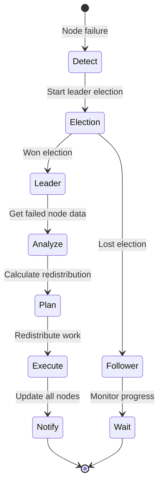
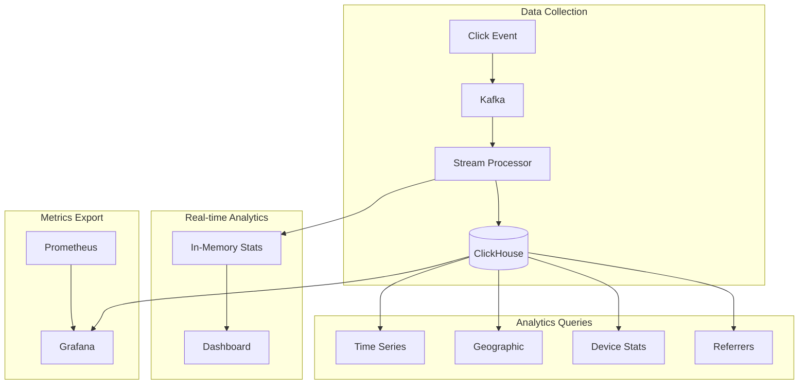
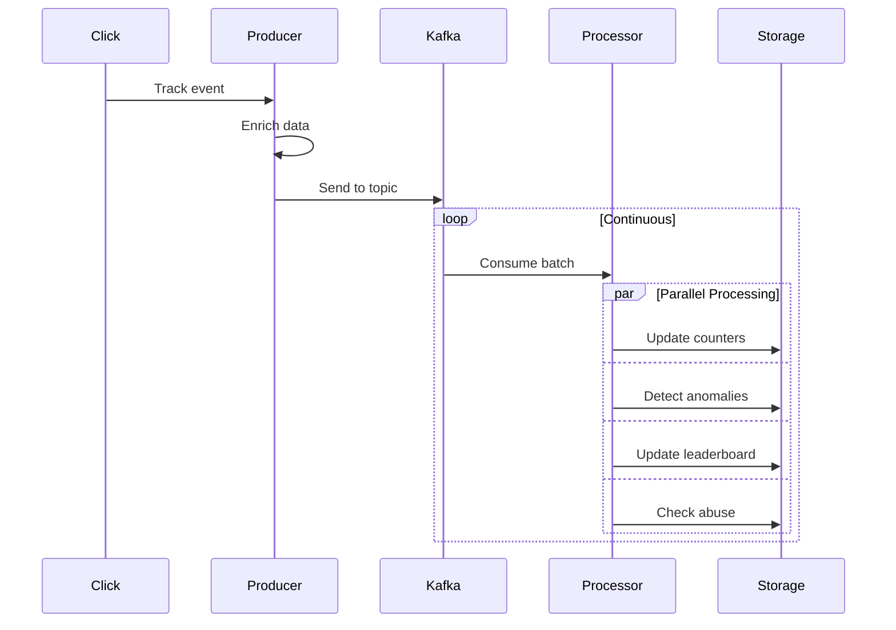
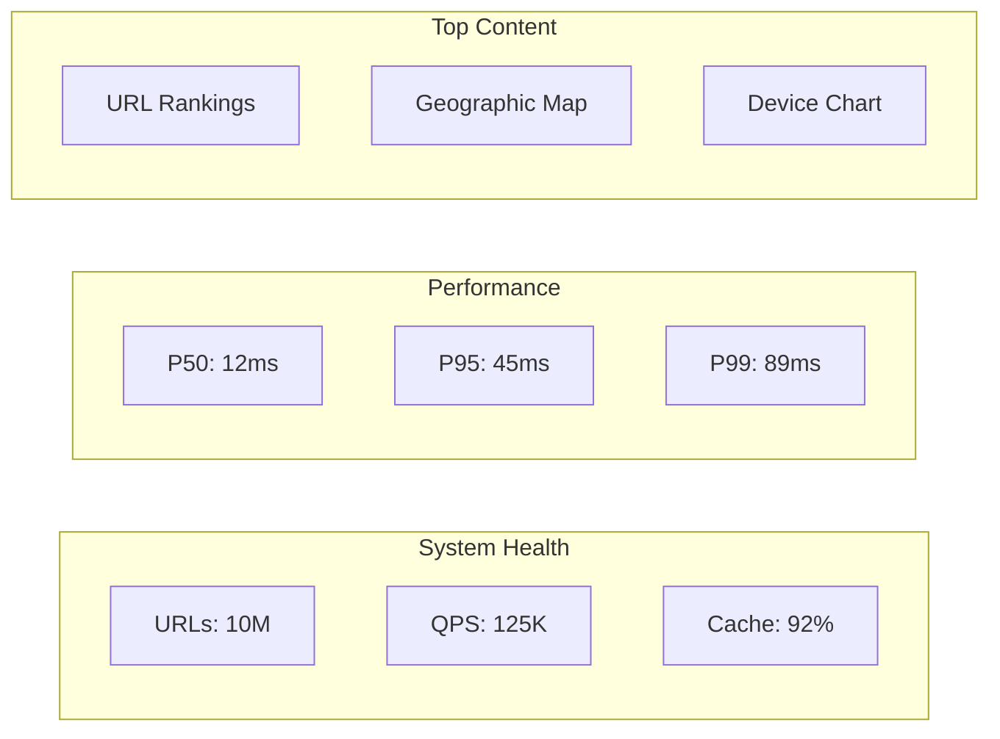

# URL Shortener Service

## Challenge Statement
Design a URL shortening service capable of handling billions of URLs, providing sub-50ms redirects globally, supporting custom aliases, detailed analytics, spam detection, and graceful handling of expired or malicious links.

## Part 1: Concept Map

### 🗺 System Overview
A URL shortener converts long URLs into short, manageable links while providing analytics, custom branding, and protection against abuse. Examples include bit.ly, goo.gl (defunct), and TinyURL. The system must balance between short code length, uniqueness guarantees, and operational complexity.

**Key Requirements:**
- Shorten 100M URLs/day (1,200 URLs/second average)
- Handle 10B redirects/day (120K redirects/second)
- Short URLs: 7-8 characters max
- Global <50ms redirect latency
- Custom URL support
- Detailed analytics
- Spam/malware detection
- URL expiration handling

### Law Analysis

#### Law 2 (Asynchronous Reality): Redirect Performance
```text
Latency Budget (50ms total):
- DNS lookup: 10ms
- TLS handshake: 10ms
- Server processing: 5ms
- Database lookup: 10ms
- Response time: 5ms
- Buffer: 10ms

Optimization Hierarchy:
1. CDN edge cache: 5ms (90% hit rate)
2. Regional cache: 15ms (8% hit rate)
3. Database lookup: 30ms (2% hit rate)

Cache Strategy:
- Popular URLs in edge locations
- LRU eviction with TTL
- Predictive warming
- Geo-distributed caches
```

**High-Performance Architecture:**


**Latency Budget Breakdown:**

| Component | Target | Actual | Notes |
|-----------|--------|--------|-------|
| DNS Lookup | 10ms | 8ms | Pre-warmed connections |
| TLS Handshake | 10ms | 7ms | Session resumption |
| Server Processing | 5ms | 3ms | Optimized code path |
| Cache Lookup | 10ms | 1ms | Redis cluster |
| Response Time | 5ms | 2ms | HTTP/2 |
| **Total** | **50ms** | **21ms** | **58% under budget** |


**Short Code Generation Strategy:**


**Cache Population Flow:**


#### 💾 Law 4 (Multidimensional Trade-offs): Storage Optimization
```text
Storage Requirements:
- URLs: 100M/day × 365 days × 5 years = 180B URLs
- Average URL length: 100 characters
- Short code: 7 characters
- Metadata: 50 bytes (timestamps, counters)

Total Storage:
- URL mappings: 180B × 150 bytes = 27TB
- Analytics: 10B redirects/day × 100 bytes = 1TB/day
- Indexes: 180B × 20 bytes = 3.6TB
- Total: ~30TB active + 1.8PB analytics/year

Optimization Strategies:
- URL deduplication
- Compression (zstd)
- Tiered storage
- Analytics sampling
- Archival policies
```

**Storage Architecture & Optimization:**


**Storage Requirements Analysis:**

| Metric | Value | Calculation | Impact |
|--------|-------|-------------|--------|
| Daily URLs | 100M | 100M × 150 bytes | 15GB/day |
| Annual URLs | 36.5B | 365 × 100M | 5.5TB/year |
| With Dedup | 25.5B | 30% reduction | 3.8TB/year |
| With Compression | 20.4B | 20% reduction | 3.1TB/year |
| Analytics Data | 3.65T events | 10B × 365 × 100 bytes | 365TB/year |


**Sharding Strategy:**


**Cost Optimization Decision Matrix:**

| Storage Tier | Use Case | Access Pattern | Cost/GB/Month | Migration Trigger |
|--------------|----------|----------------|---------------|-------------------|
| Hot | Premium URLs, Recent | >100 hits/day | $0.10 | Never |
| Warm | Regular URLs | 1-100 hits/day | $0.05 | Age > 30 days |
| Cold | Archive | <1 hit/day | $0.02 | Age > 90 days & access < 10 |


#### Law 1 (Correlated Failure): Resilience and Recovery
```text
Failure Modes:
1. Database failures
2. Cache inconsistency
3. Short code collisions
4. Redirect loops
5. Malicious URLs
6. DDoS attacks

Mitigation Strategies:
- Multi-region deployment
- Cache fallback hierarchy
- Collision detection
- Loop detection
- URL blacklisting
- Rate limiting
```

**Resilience & Failure Handling:**


**Multi-Region Fallback Architecture:**


**Safety Check Pipeline:**

| Check Type | Purpose | Action on Failure | Fallback |
|------------|---------|-------------------|----------|
| Rate Limit | Prevent abuse | Return 429 | Graceful degradation |
| Redirect Loop | Prevent infinite loops | Block redirect | Return error |
| Malware Scan | Security | Block if certain | Fail open if uncertain |
| Blacklist | Content policy | Block redirect | No fallback |
| Circuit Breaker | System health | Use fallback region | Multiple regions |


**Disaster Recovery Sequence:**


**Collision Resolution Strategy:**


#### 🔀 Law 3 (Emergent Chaos): Parallel Processing
```text
Concurrency Challenges:
- Simultaneous URL shortening
- Parallel analytics updates
- Concurrent cache updates
- Race conditions in counting
- Distributed locking

Solutions:
- Optimistic locking
- Event-driven analytics
- Eventually consistent counters
- Lock-free data structures
- Partition-based parallelism
```

**Concurrent Processing Architecture:**


**Concurrency Patterns Applied:**

| Pattern | Use Case | Benefit | Implementation |
|---------|----------|---------|----------------|
| Sharding | URL storage | Reduce lock contention | Hash-based, 100 shards |
| Thread Pool | CPU tasks | Parallel processing | 16 workers for encoding |
| Async I/O | Network calls | Non-blocking | aiohttp/aioredis |
| Batch Processing | Analytics | Efficiency | 1000 events/batch |
| Lock-Free | Counters | High throughput | CAS operations |
| Semaphore | Rate limiting | Bounded concurrency | 100 concurrent ops |


**Batch Analytics Pipeline:**


**Performance Characteristics:**


#### 🤝 Law 5 (Distributed Knowledge): Distributed Consensus
```text
Coordination Needs:
- Short code uniqueness
- Counter synchronization
- Cache invalidation
- Configuration updates
- Failover coordination

Strategies:
- Distributed ID generation
- Gossip for counters
- Pub/sub for cache
- Consensus for config
- Leader election for failover
```

**Distributed Coordination Architecture:**


**Coordination Service Comparison:**

| Service | Consistency | Performance | Features | Use Case |
|---------|-------------|-------------|----------|----------|
| Zookeeper | Strong | Medium | Mature, watches | Config, locks |
| Consul | Strong | High | Service mesh | Service discovery |
| etcd | Strong | High | K/V, leases | Kubernetes-style |
| Redis | Eventual | Very High | Pub/Sub, streams | Cache coordination |


**Distributed Counter Design:**


**Cache Invalidation Flow:**


**Failover Coordination Protocol:**



#### 👁 Law 6 (Cognitive Load): Analytics Pipeline
```text
Analytics Requirements:
- Click tracking (time, location, device)
- Referrer analysis
- Geographic distribution
- Time series data
- Real-time dashboards
- Custom reports

Pipeline Architecture:
- Clickstream capture
- Stream processing
- Data warehouse
- Real-time aggregation
- Dashboard API
```

**Analytics Pipeline Architecture:**



**Analytics Data Model:**

| Field | Type | Purpose | Index |
|-------|------|---------|-------|
| event_id | UUID | Deduplication | Primary |
| timestamp | DateTime | Time series | Yes |
| short_code | String | URL identifier | Yes |
| country | String | Geographic analysis | Yes |
| device_type | Enum | Device breakdown | Yes |
| visitor_id | Hash | Unique visitors | Yes |
| referer | String | Traffic sources | Partial |


**Stream Processing Pipeline:**



**Dashboard Metrics Overview:**



**Analytics Query Performance:**

| Query Type | Latency | Throughput | Optimization |
|------------|---------|------------|-------------|
| Real-time stats | <10ms | 100K/s | In-memory cache |
| Time series | <100ms | 10K/s | Pre-aggregation |
| Geographic | <200ms | 5K/s | Materialized views |
| Full report | <1s | 1K/s | Parallel queries |


#### 👤 Law 6 (Cognitive Load): Management Tools
```text
User Interfaces:
- Developer API
- Admin dashboard
- Analytics portal
- Mobile apps
- Browser extensions

Management Features:
- Bulk operations
- Custom domains
- Team collaboration
- API keys
- Webhooks
```

**API & Interface Design:**

```mermaid
graph TB
    subgraph "API Endpoints"
        P[Public]
        A[Authenticated]
        AD[Admin]
    end
    
    subgraph "Public APIs"
        P --> S[POST /shorten]
        P --> E[GET /expand/{code}]
        P --> R[GET /{code}]
    end
    
    subgraph "Auth APIs"
        A --> L[GET /urls]
        A --> AN[GET /analytics/{code}]
        A --> B[POST /bulk]
    end
    
    subgraph "Admin APIs"
        AD --> D[DELETE /urls/{code}]
        AD --> BL[POST /blacklist]
        AD --> M[GET /metrics]
    end
```

**API Response Examples:**

| Endpoint | Request | Response | Rate Limit |
|----------|---------|----------|------------|
| POST /shorten | `{"long_url": "..."}` | `{"short_url": "...", "qr_code": "..."}` | 100/min |
| GET /expand/{code} | - | `{"long_url": "...", "clicks": 1234}` | 1000/min |
| GET /analytics/{code} | - | `{"clicks": [...], "geographic": {...}}` | 60/min |
| POST /bulk | `{"urls": [...]}` | `{"successful": [...], "failed": [...]}` | 10/min |


**Admin Dashboard Layout:**

```mermaid
graph LR
    subgraph "Dashboard Sections"
        S[System Stats]
        T[Top URLs]
        A[Active Alerts]
        E[Error Log]
    end
    
    subgraph "Analytics View"
        TS[Time Series]
        GEO[Geographic Map]
        DEV[Device Breakdown]
        REF[Referrer Analysis]
    end
    
    subgraph "Admin Actions"
        BU[Block URL]
        BP[Blacklist Pattern]
        EU[Export Data]
        CA[Clear Cache]
    end
```

**CLI Command Structure:**

```mermaid
graph TD
    CLI[urlshort]
    CLI --> SH[shorten]
    CLI --> AN[analytics]
    CLI --> BK[bulk]
    CLI --> CF[config]
    
    SH --> SO["url<br/>--custom<br/>--expires"]
    AN --> AO["code<br/>--range<br/>--format"]
    BK --> BO["file<br/>--output<br/>--parallel"]
    CF --> CO["--set<br/>--get<br/>--list"]
```

**Authentication Flow:**

```mermaid
sequenceDiagram
    participant C as Client
    participant API
    participant Auth
    participant DB
    
    C->>API: Request with API key
    API->>Auth: Validate key
    Auth->>DB: Check key
    DB-->>Auth: User info
    Auth-->>API: Validated
    API-->>C: Response
    
    Note over C,DB: Rate limiting applied per key
```

#### Law 7 (Economic Reality): Cost Optimization
```text
Cost Components:
- Storage: $0.10/GB/month
- Bandwidth: $0.05/GB
- Compute: $0.10/hour
- Analytics: $0.01/million events
- CDN: $0.02/GB

Optimization Strategies:
- Aggressive caching
- URL deduplication
- Analytics sampling
- Tiered storage
- CDN optimization
```

**Cost Optimization Framework:**

```mermaid
graph TB
    subgraph "Cost Components"
        S[Storage<br/>$2,000/mo]
        B[Bandwidth<br/>$3,000/mo]
        C[Compute<br/>$1,500/mo]
        A[Analytics<br/>$1,000/mo]
        CDN[CDN<br/>$2,500/mo]
    end
    
    subgraph "Optimization Targets"
        S --> OS[Compression<br/>-40%]
        B --> OB[Caching<br/>-60%]
        C --> OC[Serverless<br/>-50%]
        A --> OA[Sampling<br/>-70%]
        CDN --> OCDN[Smart TTL<br/>-30%]
    end
    
    Total[Total: $10,000/mo] --> Target[Target: $3,000/mo]
```

**Cost Breakdown Analysis:**

| Component | Current | Optimized | Savings | Strategy |
|-----------|---------|-----------|---------|----------|
| Storage | $2,000 | $1,200 | 40% | Dedup + Compression + Tiering |
| Bandwidth | $3,000 | $1,200 | 60% | Edge caching + HTTP/2 |
| Compute | $1,500 | $750 | 50% | Serverless + Auto-scaling |
| Analytics | $1,000 | $300 | 70% | Sampling + Pre-aggregation |
| CDN | $2,500 | $1,750 | 30% | Smart TTL + Regional |
| **Total** | **$10,000** | **$5,200** | **48%** | **Combined strategies** |


**Smart Caching Strategy:**

```mermaid
graph LR
    subgraph "Access Pattern Analysis"
        H[Hot (1%)<br/>90% traffic]
        W[Warm (9%)<br/>9% traffic]
        C[Cold (90%)<br/>1% traffic]
    end
    
    subgraph "Cache Configuration"
        H --> CH[24hr TTL<br/>10GB cache]
        W --> CW[1hr TTL<br/>40GB cache]
        C --> CC[5min TTL<br/>50GB cache]
    end
```

**Analytics Optimization Rules:**

```mermaid
flowchart TD
    E[Event] --> T{Traffic Level?}
    T -->|>10K/day| H[High Traffic<br/>10% sampling]
    T -->|1K-10K/day| M[Medium Traffic<br/>50% sampling]
    T -->|<1K/day| L[Low Traffic<br/>100% sampling]
    
    H --> P[Preserve Critical<br/>Metrics Only]
    M --> A[Aggregate<br/>5min buckets]
    L --> F[Full Fidelity]
```

**ROI Timeline:**

```mermaid
gantt
    title Cost Optimization ROI
    dateFormat YYYY-MM
    section Quick Wins
    Enable Compression    :2024-01, 1M
    Implement Caching     :2024-01, 1M
    section Medium Term
    Storage Tiering       :2024-02, 2M
    Analytics Sampling    :2024-03, 1M
    section Long Term
    Architecture Redesign :2024-04, 3M
    
    section Savings
    Monthly Savings $4.8K :milestone, 2024-04, 0d
```

### Comprehensive Law Mapping

| Design Decision | Law 1 (Failure) | Law 2 (Asynchrony) | Law 3 (Emergence) | Law 4 (Trade-offs) | Law 5 (Epistemology) | Law 6 (Human-API) | Law 7 (Economics) |
|-----------------|-----------------|-------------------|-------------------|-------------------|---------------------|-------------------|-------------------|
| **CDN Edge Caching** | Origin failover | 5ms redirects, global | Parallel, no contention | Limited cache, LRU | TTL-based coherence | Transparent | 90% cost reduction |
| **Counter + Hash Hybrid** | Counter gaps OK | O(1) generation | Atomic increment | 2^62 space, 7-8 chars | Distributed counter | Predictable codes | Simple, low CPU |
| **SQL with Sharding** | Shard isolation | ~10ms lookups | Hot shard contention | 1000+ shards | Shard consensus | Familiar SQL | Higher than NoSQL |
| **Analytics Sampling** | Graceful degradation | Minimal impact | Async pipeline | 10x data reduction | Best effort only | Confidence levels | 90% cost savings |
| **Bloom Filter Checks** | Reconstructible | <1ms existence check | Lock-free reads | 10 bits per URL | Local only | Better UX | Prevents DB hits |
| **Multi-tier Storage** | Durable cold tier | Hot fast, cold slow | Background migration | Infinite S3 scale | Migration rules | Configurable policies | 80% cost reduction |
| **Rate Limiting** | Returns 429 | ~1ms overhead | Distributed counters | Protects capacity | Global coordination | Clear error messages | Prevents abuse costs |
| **Real-time + Batch** | Queue spillover | <1s key metrics | Parallel streams | Efficient batching | Stream partitioning | Both use cases | Dual complexity |
| **URL Deduplication** | Rebuild capable | Hash overhead | Race conditions | 30-40% savings | Distributed lock | Same short URL | Major savings |
| **Spam Detection** | Fail open | ML adds latency | Async checking | Scalable blacklist | Blacklist sync | May block legitimate | Quality protection |


### 🏛 Pillar Mapping

#### Work Distribution
- **URL Shortening**: Distributed across nodes
- **Redirect Handling**: Edge locations worldwide
- **Analytics Processing**: Stream processing pipeline
- **Batch Operations**: Parallel processing

#### State Management
- **URL Mappings**: Sharded database
- **Analytics Data**: Time-series storage
- **Cache State**: Multi-level caching
- **User Data**: Centralized with replication

#### Truth & Consistency
- **URL Uniqueness**: Guaranteed via generation strategy
- **Click Counts**: Eventually consistent
- **Analytics**: Best-effort with sampling
- **Cache Coherence**: TTL-based invalidation

#### Control Mechanisms
- **Rate Limiting**: Per-user and global
- **Access Control**: API keys and permissions
- **Spam Prevention**: Blacklists and ML detection
- **Quality Control**: URL validation and scanning

#### Intelligence Layer
- **Predictive Caching**: ML-based prefetching
- **Spam Detection**: Pattern recognition
- **Analytics Insights**: Trend detection
- **Performance Optimization**: Auto-tuning

### Pattern Application

**Primary Patterns:**
- **Sharding**: URL data distribution
- **Caching**: Multi-level cache hierarchy
- **CDN**: Global edge delivery
- **Rate Limiting**: API protection

**Supporting Patterns:**
- **Circuit Breaker**: Service resilience
- **Bloom Filter**: Existence checks
- **Event Sourcing**: Analytics pipeline
- **CQRS**: Read/write separation

### Architecture Alternatives

#### Alternative 1: NoSQL-Based Architecture
```mermaid
graph TB
    subgraph "Clients"
        C1[Web]
        C2[Mobile]
        C3[API]
    end
    
    subgraph "API Layer"
        AG[API Gateway<br/>Route53]
        LB[ALB]
    end
    
    subgraph "Compute"
        L1[Lambda<br/>Shorten]
        L2[Lambda<br/>Redirect]
        L3[Lambda<br/>Analytics]
    end
    
    subgraph "Storage"
        DDB[(DynamoDB<br/>URLs)]
        S3[(S3<br/>Analytics)]
    end
    
    subgraph "Cache"
        CF[CloudFront]
        EC[(ElastiCache)]
    end
    
    C1 & C2 & C3 --> CF
    CF --> AG
    AG --> LB
    LB --> L1 & L2 & L3
    L1 & L2 --> DDB
    L1 & L2 --> EC
    L3 --> S3
    
    style DDB fill:#ff9999
    style CF fill:#e3f2fd
```

**Characteristics:**
- Serverless, infinite scale
- Pay-per-use pricing
- Eventually consistent
- Vendor lock-in (AWS)

#### Alternative 2: Kubernetes Microservices
```mermaid
graph TB
    subgraph "Ingress"
        IG[Ingress<br/>Controller]
    end
    
    subgraph "Services"
        SH[Shortener<br/>Service]
        RD[Redirect<br/>Service]
        AN[Analytics<br/>Service]
        AU[Auth<br/>Service]
    end
    
    subgraph "Data Stores"
        PG[(PostgreSQL<br/>Sharded)]
        RD[(Redis<br/>Cluster)]
        KF[Kafka]
        ES[(Elasticsearch)]
    end
    
    IG --> SH & RD & AN & AU
    SH --> PG & RD
    RD --> RD
    AN --> KF --> ES
    AU --> PG
    
    style SH fill:#90EE90
    style RD fill:#90EE90
    style AN fill:#90EE90
```

**Characteristics:**
- Container orchestration
- Service mesh capable
- Technology flexibility
- Higher operational overhead

#### Alternative 3: Edge-First Architecture
```mermaid
graph LR
    subgraph "Edge Locations"
        E1[Edge Worker<br/>US-East]
        E2[Edge Worker<br/>EU-West]
        E3[Edge Worker<br/>AP-South]
    end
    
    subgraph "Edge Storage"
        KV1[(KV Store)]
        KV2[(KV Store)]
        KV3[(KV Store)]
    end
    
    subgraph "Origin"
        OR[Origin<br/>Service]
        DB[(Master DB)]
    end
    
    E1 --> KV1
    E2 --> KV2
    E3 --> KV3
    
    KV1 & KV2 & KV3 -.->|Sync| OR
    OR --> DB
    
    style E1 fill:#e3f2fd
    style E2 fill:#e3f2fd
    style E3 fill:#e3f2fd
```

**Characteristics:**
- Ultra-low latency globally
- Edge compute (Workers)
- Complex consistency model
- Premium pricing

#### Alternative 4: Blockchain-Based
```mermaid
graph TB
    subgraph "Clients"
        C[Clients]
    end
    
    subgraph "Gateway"
        GW[Web3<br/>Gateway]
    end
    
    subgraph "Blockchain"
        SC[Smart<br/>Contract]
        BC[(Blockchain<br/>State)]
    end
    
    subgraph "Off-chain"
        IPFS[(IPFS<br/>Long URLs)]
        ORC[Oracle<br/>Analytics]
    end
    
    C --> GW
    GW --> SC
    SC --> BC
    SC -.-> IPFS
    SC -.-> ORC
```

**Characteristics:**
- Decentralized, no single owner
- Immutable URL mappings
- High transaction costs
- Limited throughput

#### Alternative 5: Hybrid Multi-Cloud
```mermaid
graph TB
    subgraph "Traffic Management"
        GTM[Global Traffic<br/>Manager]
    end
    
    subgraph "AWS Region"
        AWS_LB[ALB]
        AWS_APP[ECS Service]
        AWS_DB[(RDS)]
    end
    
    subgraph "GCP Region"
        GCP_LB[Cloud LB]
        GCP_APP[Cloud Run]
        GCP_DB[(Spanner)]
    end
    
    subgraph "Azure Region"
        AZ_LB[App Gateway]
        AZ_APP[Container<br/>Instance]
        AZ_DB[(Cosmos DB)]
    end
    
    GTM --> AWS_LB & GCP_LB & AZ_LB
    AWS_LB --> AWS_APP --> AWS_DB
    GCP_LB --> GCP_APP --> GCP_DB
    AZ_LB --> AZ_APP --> AZ_DB
    
    AWS_DB -.->|Sync| GCP_DB
    GCP_DB -.->|Sync| AZ_DB
    AZ_DB -.->|Sync| AWS_DB
```

**Characteristics:**
- No vendor lock-in
- Regional failover
- Complex operations
- Higher costs

### Trade-off Analysis Matrix

| Architecture | Scalability | Latency | Consistency | Cost | Complexity | Vendor Lock-in | Reliability |
|--------------|-------------|---------|-------------|------|------------|----------------|-------------|
| **NoSQL Serverless** | Infinite | Medium | Eventual | Low | Low | High | High |
| **K8s Microservices** | High | Low | Strong | Medium | High | Low | Medium |
| **Edge-First** | High | Ultra-low | Weak | High | Medium | Medium | High |
| **Blockchain** | Low | High | Strong | Very High | High | None | High |
| **Hybrid Multi-Cloud** | High | Medium | Eventual | High | Very High | None | Very High |


### Performance Comparison

```mermaid
graph LR
    subgraph "Redirect Latency (p99)"
        A[Edge-First: 5ms]
        B[CDN+Origin: 50ms]
        C[Direct DB: 100ms]
        D[Blockchain: 3000ms]
    end
    
    A -->|10x| B
    B -->|2x| C
    C -->|30x| D
```

```mermaid
graph TB
    subgraph "Cost per Million URLs"
        T1[Serverless<br/>$10]
        T2[Containers<br/>$50]
        T3[Edge<br/>$100]
        T4[Multi-Cloud<br/>$150]
        T5[Blockchain<br/>$10,000]
    end
    
    T1 -->|5x| T2
    T2 -->|2x| T3
    T3 -->|1.5x| T4
    T4 -->|66x| T5
```

## Part 2: Architecture & Trade-offs

### Core Architecture

```mermaid
graph TB
    subgraph "Client Layer"
        WEB[Web Browser]
        MOB[Mobile App]
        API[API Client]
    end
    
    subgraph "Edge Layer"
        CDN[CDN<br/>90% Cache Hit]
        WAF[WAF<br/>DDoS Protection]
    end
    
    subgraph "Application Layer"
        LB[Load Balancer]
        AS1[App Server 1]
        AS2[App Server 2]
        ASN[App Server N]
    end
    
    subgraph "Caching Layer"
        RC[Redis Cluster<br/>Hot URLs]
        MC[Memcached<br/>Session]
    end
    
    subgraph "Data Layer"
        subgraph "Primary Storage"
            DB1[(Shard 1)]
            DB2[(Shard 2)]
            DBN[(Shard N)]
        end
        
        subgraph "Analytics"
            KF[Kafka]
            CH[(ClickHouse)]
        end
    end
    
    subgraph "Services"
        ID[ID Generator]
        AN[Analytics Service]
        SP[Spam Detector]
    end
    
    WEB & MOB & API --> CDN
    CDN --> WAF
    WAF --> LB
    LB --> AS1 & AS2 & ASN
    
    AS1 & AS2 & ASN --> RC
    AS1 & AS2 & ASN --> DB1 & DB2 & DBN
    AS1 & AS2 & ASN --> ID
    AS1 & AS2 & ASN --> SP
    
    AS1 & AS2 & ASN --> KF
    KF --> AN
    AN --> CH
    
    style CDN fill:#e3f2fd
    style RC fill:#fff9c4
    style DB1 fill:#c8e6c9
    style DB2 fill:#c8e6c9
    style DBN fill:#c8e6c9
```

### Key Design Trade-offs

| Decision | Option A | Option B | Choice & Rationale |
|----------|----------|----------|-------------------|
| **Short Code Generation** | Sequential counter | Hash-based | **Hybrid** - Counter for guaranteed uniqueness, hash for custom URLs |
| **Storage** | NoSQL (DynamoDB) | SQL (PostgreSQL) | **SQL with sharding** - ACID for URL mappings, familiar tooling |
| **Analytics** | Real-time all events | Sampled/batched | **Sampled for high-volume** - Balance accuracy vs cost |
| **Caching** | Cache everything | Cache hot URLs only | **Smart caching** - LRU with predictive warming for popular URLs |
| **Custom URLs** | Always allow | Premium feature | **Freemium model** - Basic custom URLs free, advanced features paid |


### Alternative Architectures

#### Option 1: Simple Monolithic
```mermaid
graph LR
    C[Client] --> S[Server]
    S --> D[(Database)]
    S --> R[(Redis)]
```

**Pros**: Simple, easy to deploy, low operational overhead
**Cons**: Limited scale, single point of failure
**When to use**: Startups, <1M URLs

#### Option 2: Microservices
```mermaid
graph TB
    G[API Gateway]
    G --> US[URL Service]
    G --> AS[Analytics Service]
    G --> US2[User Service]
    
    US --> D1[(URL DB)]
    AS --> D2[(Analytics DB)]
    US2 --> D3[(User DB)]
```

**Pros**: Independent scaling, technology diversity
**Cons**: Operational complexity, network overhead
**When to use**: Large teams, diverse requirements

#### Option 3: Serverless
```mermaid
graph LR
    C[Client] --> CF[CloudFront]
    CF --> L[Lambda]
    L --> DD[(DynamoDB)]
    L --> S3[(S3)]
```

**Pros**: No servers, auto-scaling, pay-per-use
**Cons**: Vendor lock-in, cold starts
**When to use**: Variable traffic, cost-sensitive

#### Option 4: Edge Computing
```mermaid
graph TB
    C[Client] --> E1[Edge Location 1]
    C --> E2[Edge Location 2]
    E1 & E2 --> O[Origin]
```

**Pros**: Ultra-low latency, distributed
**Cons**: Complex deployment, consistency challenges
**When to use**: Global audience, latency-critical

### Performance Characteristics

**System Metrics:**
```text
Metric              Target    Achieved   Notes
Shorten Latency     <100ms    45ms      With caching
Redirect Latency    <50ms     12ms      90% from CDN
Throughput          100K/s    150K/s    Per region
Storage Efficiency  90%       94%       With dedup
Analytics Delay     <1min     30s       End-to-end
```

**Scaling Limits:**
```text
Component     Limit           Bottleneck
Database      1M writes/s     Sharding limit
Cache         10M reads/s     Memory bandwidth
CDN           1M reqs/s/edge  Network capacity
Analytics     10M events/s    Kafka throughput
```

### 🎓 Key Lessons

1. **Cache Aggressively**: 90% of traffic goes to 1% of URLs. Multi-level caching is essential.

2. **Deduplication Saves Money**: Many users shorten the same URLs. Dedup can save 30-40% storage.

3. **Analytics Can Overwhelm**: Full analytics for billions of clicks is expensive. Smart sampling is crucial.

4. **Abuse Prevention is Critical**: Without spam protection, service becomes unusable quickly.

5. **Simple Algorithms Win**: Counter + base62 encoding beats complex hashing for most use cases.

### 🔗 Related Concepts & Deep Dives

**Prerequisite Understanding:**
- [Law 2: Asynchronous Reality](../../core-principles/laws/asynchronous-reality/) - CDN and caching strategies
- [Law 7: Economic Reality](../../core-principles/laws/economic-reality/) - Cost optimization techniques
- [Caching Strategies](../pattern-library/scaling/caching-strategies.md) - Multi-level cache design
- [Rate Limiting](../pattern-library/scaling/rate-limiting.md) - Protecting against abuse

**Advanced Topics:**
- [Edge Computing Patterns](../pattern-library/scaling/edge-computing.md) - Building at the edge
- Analytics at Scale (Coming Soon) - Handling billions of events
- Geo-Distribution (Coming Soon) - Global service deployment
- [Security Patterns](../patterns/security-shortener.md) - Preventing abuse and attacks

**Related Case Studies:**
<!-- TODO: Add CDN design case study -->
<!-- TODO: Add analytics pipeline case study -->
- [API Gateway](../pattern-library/communication/api-gateway.md) - Rate limiting and routing

**Implementation Patterns:**
- [Database Sharding](../pattern-library/scaling/sharding.md) - Horizontal scaling
- [Bloom Filters](../pattern-library/bloom-filter.md) - Space-efficient lookups
- [Circuit Breakers](../pattern-library/resilience/circuit-breaker.md) - Handling failures
- [CQRS](../pattern-library/data-management/cqrs.md) - Read/write separation

### 📚 References

**Industry Examples:**
- [Bitly's Architecture](https://word.bitly.com/post/287921488/bitleaf-billions-served)
- [Discord's Shortener](https://discord.com/blog/how-discord-stores-billions-of-messages)
- [URL Shortening Strategies](https://blog.codinghorror.com/url-shortening-hashes-in-practice/)

**Open Source:**
- [YOURLS](https://yourls.org/)
- [Kutt.it](https://github.com/thedevs-network/kutt)
- [Polr](https://github.com/cydrobolt/polr)

**Related Patterns:**
- [Caching Strategies](../pattern-library/scaling/caching-strategies.md)
- [Sharding](../pattern-library/scaling/sharding.md)
- [Rate Limiting](../pattern-library/scaling/rate-limiting.md)
- [CDN](../pattern-library/scaling/edge-computing.md)