# Distributed Web Crawler

## Challenge Statement
Design a web crawler for 10B+ pages/month with robots.txt compliance, rate limiting, dynamic content handling, deduplication, and freshness maintenance at internet scale.

## Part 1: Concept Map

### 🗺 System Overview
Systematic web browsing for discovering and fetching pages, balancing aggressive crawling with server politeness.

**Requirements:** 10B+ pages/month, robots.txt compliance, JavaScript handling, deduplication, 100B+ URL frontier, focused/broad crawling, failure handling, freshness maintenance

### Law Analysis

#### Law 1 (Latency): Crawl Speed Optimization
```text
Latency: DNS 10-50ms, TCP 10-100ms, TLS 20-200ms, HTTP 50-500ms, Download 100-5000ms, Processing 10-100ms
Optimizations: DNS caching/prefetch, connection pooling, HTTP/2, parallel crawling, geo-distribution, async I/O
```

**High-Performance Crawler Architecture:**


**Crawl Request Flow:**


**Performance Optimizations:**

**Performance Optimizations:**
- DNS caching: -50ms/request
- Connection pooling: -100ms handshake
- SSL/TLS reuse: -200ms/connection
- HTTP/2 multiplexing: 3x throughput
- Stream content: Memory efficient
- Async I/O: 100x concurrency

**Connection Pool Management:**


**Latency Breakdown:**


#### 💾 Law 2 (Capacity): URL Frontier Management
```text
Storage: URL frontier 10TB (100B URLs), Crawled pages 500TB, Link graph 16TB, Metadata 10TB
Challenges: Frontier growth, duplicate detection, content storage, index management, bandwidth limits
```

**URL Frontier Architecture:**


**URL Processing Flow:**


**Frontier Data Structure:**

| Component | Implementation | Capacity | Purpose |
|-----------|---------------|----------|---------|
| **Bloom Filter** | Bit array | 10B URLs | Fast duplicate check |
| **Priority Queues** | Min heap × 1000 | 100M URLs/queue | Priority scheduling |
| **Domain Queues** | HashMap | 10M domains | Politeness tracking |
| **RocksDB URLs** | LSM tree | 100B URLs | Persistent storage |
| **RocksDB Seen** | LSM tree | 10B entries | Deduplication |
| **RocksDB Meta** | LSM tree | 10B entries | URL metadata |


**Politeness Enforcement:**


**URL Normalization Process:**


**Queue Distribution Strategy:**


**Content Deduplication System:**


**Duplicate Detection Flow:**

```mermaid
sequenceDiagram
    participant C as Content
    participant E as Exact Hash
    participant S as SimHash
    participant I as Index
    participant R as Result
    
    C->>E: Calculate SHA256
    E->>I: Check exact match
    
    alt Exact Match Found
        I-->>R: Return duplicate (100%)
    else No Exact Match
        C->>S: Calculate SimHash
        S->>I: Find similar (distance ≤ 3)
        
        alt Similar Found
            S->>S: Calculate similarity
            alt Similarity ≥ 90%
                S-->>R: Return near-duplicate
            else Similarity < 90%
                S->>I: Index as new
                I-->>R: Not duplicate
            end
        else No Similar
            S->>I: Index content
            I-->>R: Not duplicate
        end
    end
```



**SimHash Algorithm Visualization:**

```mermaid
graph LR
    subgraph "Tokenization"
        T[Text] --> TK[Tokens]
    end
    
    subgraph "Hash Calculation"
        TK --> H1[Hash Token 1]
        TK --> H2[Hash Token 2]
        TK --> H3[Hash Token N]
    end
    
    subgraph "Vector Accumulation"
        H1 --> V[64-bit Vector<br/>+1/-1 weights]
        H2 --> V
        H3 --> V
    end
    
    subgraph "Fingerprint"
        V --> F[Binary Fingerprint<br/>Positive→1, Negative→0]
    end
```



**Deduplication Strategies Comparison:**

| Method | Detection Type | Speed | Accuracy | Storage |
|--------|---------------|--------|----------|---------|
| **Exact Hash** | Identical content | O(1) | 100% | 32 bytes/URL |
| **SimHash** | Near-duplicates | O(log n) | 95%+ | 8 bytes/URL |
| **Shingles** | Text similarity | O(n) | Variable | ~1KB/doc |
| **MinHash** | Set similarity | O(k) | 90%+ | 128 bytes/URL |


#### Law 3 (Failure): Robust Crawling
```text
Failures: Network timeouts, DNS failures, server errors, malformed HTML, infinite redirects, spider/crawler traps, rate limits
Mitigations: Exponential backoff, circuit breakers, redirect limits, pattern detection, checkpointing, distributed coordination
```

**Resilient Crawler Architecture:**


**Crawl Failure Recovery Flow:**


**Circuit Breaker States:**


**Spider Trap Detection Patterns:**

| Pattern Type | Detection Method | Example |
|-------------|-----------------|---------|
| **Deep URLs** | Path depth > 10 | `/a/b/c/d/e/f/g/h/i/j/k` |
| **Repeating Paths** | Pattern detection | `/page/1/page/2/page/3` |
| **Excessive Parameters** | Query count > 20 | `?p1=v1&p2=v2&...&p20=v20` |
| **Known Patterns** | Regex matching | `/test/test/test/` |
| **Similar URLs** | Pattern frequency | 500+ URLs with same structure |
| **Infinite Loops** | Redirect chains | A→B→C→A |


**Retry Strategy:**


**Robots.txt Caching:**


# Trap detection and recovery implementation details...
```

#### 🔀 Law 4 (Concurrency): Parallel Crawling
```text
Concurrency Challenges:
- Thousands of parallel connections
- Domain-level politeness
- Race conditions in URL frontier
- Shared state management
- Memory pressure
- Connection pool exhaustion

Optimization Strategies:
- Async I/O throughout
- Domain-based sharding
- Lock-free data structures
- Memory-mapped files
- Zero-copy techniques
```

**Massively Parallel Crawler Architecture:**


**Parallel Crawling Flow:**


**Concurrency Control Mechanisms:**

| Component | Strategy | Purpose |
|-----------|----------|---------|
| **URL Queue** | Async Queue | Work distribution |
| **Domain Semaphores** | Per-domain limits | Politeness control |
| **Process Pool** | CPU workers | Parallel extraction |
| **Memory Mapping** | Zero-copy buffers | Efficient data sharing |
| **Batch Processing** | Bulk operations | Reduce I/O overhead |


**Domain-Based Politeness:**


**Memory-Mapped Architecture:**

```mermaid
graph TB
    subgraph "Memory-Mapped Files"
        UB[URL Buffer<br/>1GB capacity<br/>5M URLs]
        BF[Bloom Filter<br/>4GB capacity<br/>10B items]
    end
    
    subgraph "Process Access"
        P1[Process 1]
        P2[Process 2]
        P3[Process N]
    end
    
    P1 --> UB
    P2 --> UB
    P3 --> UB
    
    P1 --> BF
    P2 --> BF
    P3 --> BF
    
    Note over UB,BF: Zero-copy shared memory
```

**Performance Auto-Tuning:**

```mermaid
stateDiagram-v2
    [*] --> Monitor
    
    Monitor --> CheckQueue: Every 10s
    
    CheckQueue --> LowQueue: Queue < 100
    CheckQueue --> HighQueue: Queue > 5000
    CheckQueue --> Normal: 100 ≤ Queue ≤ 5000
    
    LowQueue --> IncreaseFeed: Feed rate × 1.1
    HighQueue --> DecreaseFeed: Feed rate × 0.9
    Normal --> Maintain: No change
    
    IncreaseFeed --> Monitor
    DecreaseFeed --> Monitor
    Maintain --> Monitor
```

**Batch Processing Strategy:**

```mermaid
graph LR
    subgraph "Result Collection"
        R1[Result 1]
        R2[Result 2]
        R3[Result N]
    end
    
    subgraph "Batching"
        B[Batch Buffer<br/>Size: 100]
        T[Timeout: 1s]
    end
    
    subgraph "Storage Operations"
        SP[Store Pages<br/>Bulk Insert]
        SL[Store Links<br/>Bulk Insert]
        UF[Update Frontier<br/>Batch Add]
    end
    
    R1 --> B
    R2 --> B
    R3 --> B
    
    B -->|Full or Timeout| SP
    B --> SL
    SL --> UF
```

#### 🤝 Law 5 (Coordination): Distributed Crawling
```text
Coordination Requirements:
- URL assignment without duplication
- Crawl state synchronization
- Rate limit coordination
- Failure recovery
- Work distribution

Coordination Strategies:
- Consistent hashing for URL assignment
- Distributed locks for critical sections
- Gossip for state propagation
- Leader election for scheduling
- Checkpointing for recovery
```

**Distributed Crawler Coordination Architecture:**

```mermaid
graph TB
    subgraph "Zookeeper Coordination"
        ZK[Zookeeper Cluster]
        
        subgraph "ZK Paths"
            NP[/crawler/nodes<br/>Active nodes]
            AP[/crawler/assignments<br/>Domain ownership]
            CP[/crawler/checkpoints<br/>Progress tracking]
            RP[/crawler/rate_limits<br/>Politeness]
            LP[/crawler/leader<br/>Leader election]
        end
    end
    
    subgraph "Crawler Nodes"
        N1[Node 1<br/>Domains A-F]
        N2[Node 2<br/>Domains G-M]
        N3[Node 3<br/>Domains N-Z]
    end
    
    N1 --> ZK
    N2 --> ZK
    N3 --> ZK
    
    ZK --> NP
    ZK --> AP
    ZK --> CP
    ZK --> RP
    ZK --> LP
```

**Consistent Hashing for Domain Assignment:**

```mermaid
graph LR
    subgraph "Hash Ring"
        H1[Node1:0-99<br/>Virtual nodes]
        H2[Node2:0-99<br/>Virtual nodes]
        H3[Node3:0-99<br/>Virtual nodes]
    end
    
    subgraph "Domain Mapping"
        D1[example.com<br/>Hash: 0x3F...]
        D2[site.org<br/>Hash: 0x7A...]
        D3[blog.net<br/>Hash: 0xB2...]
    end
    
    D1 --> H1
    D2 --> H2
    D3 --> H3
    
    Note over H1,H3: 100 virtual nodes per physical node<br/>for better distribution
```

**Node Failure Recovery Flow:**

```mermaid
sequenceDiagram
    participant ZK as Zookeeper
    participant N1 as Node 1
    participant N2 as Node 2 (Healthy)
    participant N3 as Node 3 (Healthy)
    
    Note over N1: Node 1 fails
    ZK->>ZK: Ephemeral node expires
    ZK->>N2: Node change notification
    ZK->>N3: Node change notification
    
    N2->>ZK: Get failed assignments
    N3->>ZK: Get failed assignments
    
    par Redistribution
        N2->>N2: Calculate new assignments
        N3->>N3: Calculate new assignments
    end
    
    N2->>ZK: Update assignments
    N3->>ZK: Update assignments
    
    Note over N2,N3: Domains redistributed<br/>using consistent hashing
```

**Distributed Rate Limiting:**

```mermaid
stateDiagram-v2
    [*] --> CheckRateLimit
    
    CheckRateLimit --> GetDomainInfo: Read from ZK
    
    GetDomainInfo --> CheckDelay: Info exists
    GetDomainInfo --> CreateNew: First access
    
    CheckDelay --> Wait: Too soon
    CheckDelay --> TryAcquire: Delay passed
    
    TryAcquire --> UpdateZK: Optimistic lock
    UpdateZK --> Success: Version match
    UpdateZK --> Retry: Version conflict
    
    Wait --> CheckDelay: After delay
    Retry --> CheckRateLimit
    
    Success --> [*]
    CreateNew --> [*]
```

**Leader Election Process:**

```mermaid
graph TD
    subgraph "Election Process"
        CN[Create Node<br/>/leader/node_0001]
        GC[Get Children]
        CL[Check Lowest]
        
        CN --> GC
        GC --> CL
        
        CL -->|Is Lowest| BL[Become Leader]
        CL -->|Not Lowest| WP[Watch Previous]
        
        WP --> GC
    end
    
    subgraph "Leader Duties"
        BL --> SD[Schedule Domains]
        BL --> MH[Monitor Health]
        BL --> RB[Rebalance Load]
    end
```

**Coordination State Management:**

```mermaid
graph TB
    subgraph "Node Registration"
        R[Register Node]
        R --> EN[Ephemeral Node<br/>Auto-cleanup]
        R --> ND[Node Data<br/>ID, Host, Capacity]
    end
    
    subgraph "Assignment Tracking"
        AD[Assigned Domains]
        AD --> ZS[ZK Storage]
        AD --> LC[Local Cache]
        AD --> VU[Version Updates]
    end
    
    subgraph "Progress Checkpointing"
        CP[Checkpoint Data]
        CP --> ST[Stats]
        CP --> TS[Timestamp]
        CP --> DL[Domain List]
    end
    
    EN --> AD
    AD --> CP
```

**Distributed Crawler Communication:**

| Component | Purpose | Implementation |
|-----------|---------|----------------|
| **Node Registry** | Track active crawlers | Ephemeral ZK nodes |
| **Domain Assignment** | Distribute work | Consistent hashing |
| **Rate Limiting** | Global politeness | Distributed locks |
| **Checkpointing** | Failure recovery | Periodic ZK writes |
| **Leader Election** | Central coordination | Sequential ZK nodes |
| **Health Monitoring** | Detect failures | ZK watches |

                if self.zk.exists(prev_path, watch=True):
                    time.sleep(1)
```

#### 👁 Law 6 (Observability): Crawl Monitoring
```text
Monitoring Requirements:
- Crawl rate and coverage
- Error rates by domain
- URL frontier size
- Duplicate detection rate
- Politeness violations
- Content quality metrics

Observability Stack:
- Prometheus metrics
- Grafana dashboards
- Distributed tracing
- Log aggregation
- Alerting rules
```

**Crawler Observability Architecture:**

```mermaid
graph TB
    subgraph "Metrics Collection"
        PM[Prometheus Metrics]
        SL[Structured Logs]
        DT[Distributed Tracing]
        HC[Health Checks]
    end
    
    subgraph "Metric Types"
        C[Counters<br/>URLs crawled<br/>Violations]
        H[Histograms<br/>Latency<br/>Page size]
        G[Gauges<br/>Frontier size<br/>Active workers]
        S[Summary<br/>Duplicate rate]
    end
    
    subgraph "Visualization"
        GD[Grafana Dashboards]
        JU[Jaeger UI]
        AL[Alert Manager]
    end
    
    PM --> C
    PM --> H
    PM --> G
    PM --> S
    
    C --> GD
    H --> GD
    G --> GD
    
    DT --> JU
    PM --> AL
```

**Observability Flow:**

```mermaid
sequenceDiagram
    participant C as Crawler
    participant T as Tracer
    participant M as Metrics
    participant L as Logger
    participant G as Grafana
    
    C->>T: Start span
    T->>T: Set attributes
    
    C->>C: Fetch URL
    
    par Collect Metrics
        C->>M: Record counters
        C->>M: Record latency
        C->>M: Record content size
    and Log Events
        C->>L: Structured log
    and Trace
        C->>T: Add span data
    end
    
    M->>G: Export metrics
    T->>T: End span
```

**Key Metrics Dashboard:**

| Metric | Type | Description | Alert Threshold |
|--------|------|-------------|-----------------|
| **Crawl Rate** | Counter | URLs/second | < 10 URLs/min |
| **Error Rate** | Counter | Failed requests | > 10% |
| **Latency P95** | Histogram | 95th percentile | > 5 seconds |
| **Frontier Size** | Gauge | Queued URLs | = 0 for 10min |
| **Page Size P50** | Histogram | Median size | - |
| **Links/Page** | Histogram | Extracted links | - |
| **Robots Violations** | Counter | Disallowed URLs | > 0 |


**Grafana Dashboard Panels:**

```mermaid
graph LR
    subgraph "Row 1: Overview"
        CR[Crawl Rate<br/>Line Graph]
        ER[Error Rate<br/>Line Graph]
        FS[Frontier Size<br/>Gauge]
    end
    
    subgraph "Row 2: Performance"
        LH[Latency Heatmap]
        PS[Page Size<br/>Distribution]
        LC[Links Count<br/>Histogram]
    end
    
    subgraph "Row 3: Domains"
        TD[Top Domains<br/>Table]
        ED[Errors by Domain<br/>Bar Chart]
        RV[Violations<br/>Counter]
    end
```

**Distributed Tracing Example:**

```mermaid
gantt
    title Crawl Request Trace
    dateFormat X
    axisFormat %Lms
    
    section Main Span
    crawl_url           :done, main, 0, 500
    
    section Sub-spans
    DNS Lookup          :done, dns, 0, 50
    Robots Check        :done, robot, 50, 30
    HTTP Request        :done, http, 80, 200
    Content Parse       :done, parse, 280, 100
    Link Extract        :done, links, 380, 50
    Store Result        :done, store, 430, 70
```

**Alert Configuration:**

```mermaid
stateDiagram-v2
    [*] --> Monitoring
    
    Monitoring --> CheckMetrics
    
    CheckMetrics --> HighError: Error > 10%
    CheckMetrics --> EmptyFrontier: Size = 0
    CheckMetrics --> SlowCrawl: P95 > 5s
    CheckMetrics --> RobotsViolation: Count > 0
    
    HighError --> FireAlert
    EmptyFrontier --> FireAlert
    SlowCrawl --> FireAlert
    RobotsViolation --> FireAlert
    
    FireAlert --> Notification
    Notification --> [*]
```

**Health Check Components:**

```mermaid
graph TB
    subgraph "Health Checks"
        HC[Health Endpoint]
        
        FC[Frontier Check<br/>URLs > 0]
        RC[Rate Check<br/>Crawl rate > 0]
        EC[Error Check<br/>Error < 10%]
        CC[Connection Check<br/>Workers active]
    end
    
    HC --> FC
    HC --> RC
    HC --> EC
    HC --> CC
    
    FC -->|All Pass| H[Healthy]
    FC -->|Some Fail| W[Warning]
    FC -->|Critical Fail| U[Unhealthy]
```

#### 👤 Law 7 (Human Interface): Crawler Management
```text
Management Requirements:
- Start/stop/pause crawling
- Configure crawl policies
- Monitor progress
- Debug specific domains
- Export crawled data
- Manage robots.txt

Interfaces:
- Web dashboard
- REST API
- CLI tools
- Configuration files
```

**Crawler Management Architecture:**

```mermaid
graph TB
    subgraph "Management Interfaces"
        API[REST API]
        CLI[CLI Tool]
        WEB[Web Dashboard]
        WS[WebSocket]
    end
    
    subgraph "Control Functions"
        CS[Crawler Status]
        CC[Crawler Control]
        CF[Configuration]
        EX[Data Export]
    end
    
    subgraph "Monitoring"
        RT[Real-time Metrics]
        FV[Frontier Viewer]
        DI[Domain Inspector]
        DB[Debug Tools]
    end
    
    API --> CS
    API --> CC
    CLI --> CF
    WEB --> RT
    WS --> RT
```

**Management API Endpoints:**

| Endpoint | Method | Purpose |
|----------|--------|---------|
| `/api/v1/status` | GET | Crawler status and stats |
| `/api/v1/control/{action}` | POST | Start/stop/pause/resume |
| `/api/v1/seeds` | POST | Add seed URLs |
| `/api/v1/frontier` | GET | Frontier statistics |
| `/api/v1/domain/{domain}` | GET | Domain-specific info |
| `/api/v1/config` | POST | Update configuration |
| `/api/v1/export` | GET | Export crawled data |
| `/api/v1/debug/{url}` | GET | Debug URL crawling |


**Control Flow:**

```mermaid
sequenceDiagram
    participant U as User
    participant API as API
    participant C as Crawler
    participant F as Frontier
    participant W as Workers
    
    U->>API: POST /control/start
    API->>C: start()
    C->>F: Load URLs
    C->>W: Start workers
    C-->>API: Status: started
    
    U->>API: POST /seeds
    API->>F: Add URLs
    F-->>API: Added count
    
    U->>API: GET /status
    API->>C: Get stats
    C-->>API: Current metrics
```

**CLI Interface:**

```mermaid
graph LR
    subgraph "CLI Commands"
        ST[crawler start<br/>--seeds-file<br/>--max-pages]
        SU[crawler status]
        DB[crawler debug URL]
        EX[crawler export<br/>--domain<br/>--format]
    end
    
    subgraph "Actions"
        LS[Load Seeds]
        SC[Start Crawling]
        SS[Show Stats]
        DD[Debug Details]
        ED[Export Data]
    end
    
    ST --> LS
    ST --> SC
    SU --> SS
    DB --> DD
    EX --> ED
```

**Web Dashboard Components:**

```mermaid
graph TB
    subgraph "Dashboard Layout"
        H[Header<br/>Status & Controls]
        
        subgraph "Metrics Row"
            CR[Crawl Rate<br/>Gauge]
            FS[Frontier Size<br/>Counter]
            ER[Error Rate<br/>Percentage]
        end
        
        subgraph "Charts"
            PC[Performance Chart<br/>Time Series]
            FC[Frontier Chart<br/>Priority Distribution]
        end
        
        subgraph "Tables"
            DT[Domain Stats<br/>Top 20]
            ET[Error Log<br/>Recent]
        end
    end
```

**Real-time WebSocket Updates:**

```mermaid
sequenceDiagram
    participant B as Browser
    participant WS as WebSocket
    participant C as Crawler
    participant M as Metrics
    
    B->>WS: Connect /ws/metrics
    WS->>B: Accept connection
    
    loop Every 1 second
        WS->>C: Get metrics
        C->>M: Collect stats
        M-->>C: Current values
        C-->>WS: Metric data
        WS->>B: Send JSON
        B->>B: Update UI
    end
    
    B->>WS: Close connection
```

**Debug Interface Flow:**

```mermaid
stateDiagram-v2
    [*] --> InputURL
    
    InputURL --> Validate
    Validate --> CheckRobots: Valid
    Validate --> Error: Invalid
    
    CheckRobots --> CheckFrontier
    CheckFrontier --> CheckDuplicate
    CheckDuplicate --> TryCrawl
    
    TryCrawl --> Success: OK
    TryCrawl --> Failure: Error
    
    Success --> ShowResult
    Failure --> ShowError
    
    ShowResult --> [*]
    ShowError --> [*]
    Error --> [*]
```

**Export Functionality:**

```mermaid
graph LR
    subgraph "Export Options"
        FO[Format<br/>JSONL, CSV, Parquet]
        FI[Filters<br/>Domain, Time Range]
        BG[Background Job]
    end
    
    subgraph "Export Process"
        QD[Query Data]
        TF[Transform Format]
        WF[Write File]
        NF[Notify Complete]
    end
    
    FO --> QD
    FI --> QD
    QD --> TF
    TF --> WF
    WF --> NF
    
    BG -.-> QD
```

#### Law 8 (Economics): Cost Optimization
```text
Cost Components:
- Bandwidth: $0.05/GB
- Storage: $0.023/GB/month (S3)
- Compute: $0.10/hour/instance
- DNS queries: $0.40/million
- IP rotation: $0.001/request

Optimization Strategies:
- Compression
- Selective crawling
- Duplicate elimination
- Bandwidth throttling
- Spot instances
```

**Cost Optimization Architecture:**

```mermaid
graph TB
    subgraph "Cost Components"
        BW[Bandwidth<br/>$0.05/GB]
        ST[Storage<br/>$0.023/GB/month]
        CM[Compute<br/>$0.10/hour]
        DN[DNS<br/>$0.40/million]
        IP[IP Rotation<br/>$0.001/req]
    end
    
    subgraph "Optimization Strategies"
        CP[Compression]
        DD[Deduplication]
        SI[Spot Instances]
        VS[Value Selection]
        TH[Throttling]
    end
    
    subgraph "Budget Control"
        DB[Daily Budget<br/>$1000]
        BL[Bandwidth Limit<br/>10TB]
        CT[Cost Tracking]
    end
    
    BW --> CP
    ST --> DD
    CM --> SI
    
    CP --> CT
    DD --> CT
    SI --> CT
    
    CT --> DB
    CT --> BL
```

**Cost Calculation Flow:**

```mermaid
sequenceDiagram
    participant U as URL
    participant CE as Cost Estimator
    participant BC as Budget Check
    participant C as Crawler
    participant CT as Cost Tracker
    
    U->>CE: Estimate size
    CE->>CE: Calculate costs
    
    CE->>BC: Check budget
    
    alt Within Budget
        BC->>C: Crawl with compression
        C->>CT: Track actual cost
        CT->>CT: Update daily total
    else Exceeds Budget
        BC-->>U: Reject (budget exceeded)
    end
```

**Cost Breakdown Structure:**

| Component | Cost | Optimization |
|-----------|------|--------------|
| **Bandwidth** | $0.05/GB | Compression (70% savings) |
| **Storage** | $0.023/GB/month | Deduplication (90% savings) |
| **Compute** | $0.10/hour | Spot instances (70% savings) |
| **DNS** | $0.40/million | Caching (95% reduction) |
| **IP Rotation** | $0.001/request | Smart rotation (50% reduction) |


**Value-Based URL Selection:**

```mermaid
graph LR
    subgraph "Value Factors"
        DA[Domain Authority<br/>30%]
        CF[Content Freshness<br/>30%]
        LV[Link Value<br/>20%]
        UN[Uniqueness<br/>20%]
    end
    
    subgraph "Cost Factors"
        ES[Estimated Size]
        BC[Bandwidth Cost]
        SC[Storage Cost]
    end
    
    subgraph "Selection"
        VS[Value Score]
        CS[Cost Score]
        VPD[Value per Dollar]
    end
    
    DA --> VS
    CF --> VS
    LV --> VS
    UN --> VS
    
    ES --> CS
    BC --> CS
    SC --> CS
    
    VS --> VPD
    CS --> VPD
```

**Compression Savings:**

```mermaid
gantt
    title Bandwidth Usage Comparison
    dateFormat X
    axisFormat %s
    
    section Without Compression
    HTML (10MB)      :done, html1, 0, 10
    CSS/JS (5MB)     :done, css1, 10, 5
    Images (20MB)    :done, img1, 15, 20
    
    section With Compression
    HTML (3MB)       :done, html2, 0, 3
    CSS/JS (1MB)     :done, css2, 3, 1
    Images (18MB)    :done, img2, 4, 18
    
    section Savings
    Saved (13MB)     :active, save, 22, 13
```

**Smart Scheduling Strategy:**

```mermaid
stateDiagram-v2
    [*] --> CheckTime
    
    CheckTime --> OffPeak: 2AM-6AM
    CheckTime --> Peak: Other hours
    
    OffPeak --> ScaleUp: Use spot instances
    Peak --> ScaleDown: Use on-demand
    
    ScaleUp --> HighThroughput: 70% cost savings
    ScaleDown --> NormalThroughput: Reliable but costly
    
    HighThroughput --> RecordSavings
    NormalThroughput --> RecordCost
    
    RecordSavings --> [*]
    RecordCost --> [*]
```

**Cost Report Dashboard:**

```mermaid
graph TB
    subgraph "Daily Metrics"
        DC[Daily Cost: $X]
        MP[Monthly Projection: $Y]
        BR[Budget Remaining: $Z]
    end
    
    subgraph "Cost Breakdown"
        BW[Bandwidth: $A]
        ST[Storage: $B]
        CM[Compute: $C]
        OT[Other: $D]
    end
    
    subgraph "Savings"
        CS[Compression: $E]
        DS[Dedup: $F]
        SS[Spot: $G]
        TS[Total Saved: $H]
    end
    
    subgraph "Efficiency"
        CPU[Cost/URL: $I]
        CPG[Cost/GB: $J]
        VPD[Value/$: K]
    end
```

### Comprehensive Law Mapping

| Design Decision | Axiom 1<br>(Latency) | Axiom 2<br>(Capacity) | Axiom 3<br>(Failure) | Axiom 4<br>(Concurrency) | Axiom 5<br>(Coordination) | Axiom 6<br>(Observability) | Axiom 7<br>(Human Interface) | Axiom 8<br>(Economics) |
|-----------------|---------------------|---------------------|---------------------|------------------------|------------------------|--------------------------|---------------------------|------------------------|
| **Async I/O Everywhere** | ✅ Non-blocking ops<br>Max throughput | ✅ Handle 1000s<br>connections | ✅ Timeout handling<br>graceful failures | ✅ True parallelism<br>event loops | ➖ Local decision<br>no coordination | 📊 Connection metrics<br>per domain | ✅ Intuitive async<br>programming model | ✅ Max hardware<br>utilization |
| **Domain-based Queuing** | ⚖️ Adds queue overhead<br>but ensures politeness | ✅ Scales to millions<br>of domains | ✅ Domain isolation<br>failure containment | ✅ Parallel domains<br>serialize per-domain | 🔄 Queue assignment<br>coordination | 📊 Queue depth<br>per domain | ✅ Clear domain<br>rate controls | ✅ Prevents IP bans<br>maintains access |
| **Persistent URL Frontier** | ⚖️ Disk I/O for<br>durability | ✅ 100B+ URLs<br>RocksDB storage | ✅ Survives crashes<br>checkpoint recovery | ⚠️ Concurrent access<br>needs locking | 🔄 Distributed frontier<br>sharding needed | 📊 Frontier size<br>growth metrics | 🛠️ Priority tuning<br>controls | ⚖️ Storage costs<br>but necessary |
| **Bloom Filter Dedup** | ✅ O(1) lookups<br>no DB hit | ✅ ~10 bits per URL<br>memory efficient | ✅ Reconstructible<br>from crawl history | ✅ Lock-free reads<br>thread-safe | ➖ Node-local<br>filters | 📊 False positive<br>rate tracking | ⚠️ Probabilistic may<br>miss some URLs | ✅ 90% reduction<br>in storage ops |
| **Content Hashing** | ⚖️ Hash computation<br>CPU overhead | ✅ Compact hashes<br>vs full content | ✅ Can rebuild<br>from pages | ✅ Parallel hashing<br>in workers | ➖ Local operation<br>no sync needed | 📊 Duplicate rate<br>statistics | ✅ Dedup transparent<br>to users | ✅ Huge storage<br>savings |
| **Circuit Breakers** | ✅ Fast fail for<br>bad domains | ✅ Prevents resource<br>waste on failures | ✅ Automatic recovery<br>with backoff | ✅ Per-domain state<br>no global lock | ➖ Each node tracks<br>independently | ✅ Breaker state<br>dashboards | ✅ Clear failure<br>visibility | ✅ Saves bandwidth<br>on dead sites |
| **Robots.txt Caching** | ✅ Avoid repeated<br>fetches | ✅ Bounded cache<br>with TTL | ✅ Fallback to<br>allow on failure | ✅ Concurrent cache<br>reads | 🔄 Cache invalidation<br>strategy | 📊 Cache hit rate<br>robots compliance | ✅ Respect site<br>owner wishes | ✅ Reduces requests<br>saves bandwidth |
| **Distributed Workers** | ⚖️ Network coordination<br>overhead | ✅ Linear scaling<br>with nodes | ✅ Node failures<br>don't stop crawl | ✅ Massive parallelism<br>across nodes | 🔄 Work distribution<br>via coordinator | 📊 Worker health<br>and throughput | ⚠️ Complex deployment<br>and debugging | ✅ Use spot instances<br>for cost savings |
| **Checkpointing** | ⚖️ Periodic I/O<br>for snapshots | ✅ Incremental saves<br>bounded size | ✅ Recovery point<br>for restarts | ⚠️ Checkpoint consistency<br>across workers | 🔄 Checkpoint coordination<br>via ZK | 📊 Checkpoint lag<br>recovery time | ✅ Restart capability<br>operational tool | ✅ Prevents recrawl<br>saves resources |
| **Smart Scheduling** | ⚖️ ML inference<br>overhead | ✅ Prioritizes valuable<br>content | ✅ Adapts to site<br>reliability | ✅ Parallel scoring<br>and scheduling | 🔄 Global priority<br>agreement | 📊 Scheduling efficiency<br>metrics | ⚠️ Complex tuning<br>parameters | ✅ Crawls high-value<br>pages first |


### 🏛 Pillar Mapping

#### Work Distribution
- **URL Assignment**: Consistent hashing by domain
- **Parallel Crawling**: Async workers with domain isolation
- **Task Queuing**: Priority-based URL frontier
- **Load Balancing**: Work stealing between nodes

#### State Management
- **URL Frontier**: Persistent priority queues
- **Crawl History**: Distributed deduplication
- **Domain State**: Rate limits and robots.txt
- **Checkpoints**: Periodic state snapshots

#### Truth & Consistency
- **URL Uniqueness**: Normalized URLs as truth
- **Content Versioning**: Track page changes
- **Crawl Ordering**: Best-effort time ordering
- **Duplicate Detection**: Content hashing

#### Control Mechanisms
- **Rate Limiting**: Per-domain politeness
- **Circuit Breakers**: Failure isolation
- **Orchestration**: Leader-based scheduling
- **Resource Limits**: Memory and bandwidth caps

#### Intelligence Layer
- **Smart Scheduling**: ML-based priority
- **Trap Detection**: Pattern recognition
- **Content Quality**: Relevance scoring
- **Adaptive Crawling**: Freshness prediction

### Pattern Application

**Primary Patterns:**
- **Producer-Consumer**: URL frontier feeding workers
- **Bulkhead**: Domain isolation
- **Circuit Breaker**: Failure handling
- **Leader Election**: Crawl coordination

**Supporting Patterns:**
- **Consistent Hashing**: URL distribution
- **Bloom Filter**: Duplicate detection
- **Rate Limiting**: Politeness enforcement
- **Checkpointing**: State recovery

### Architecture Alternatives

#### Alternative 1: Focused Vertical Crawler
```mermaid
graph TB
    subgraph "Seed Management"
        SM[Seed Manager<br/>Domain whitelist]
    end
    
    subgraph "Single Node"
        Q[Priority Queue]
        F[Fetcher]
        P[Parser]
        S[Storage]
    end
    
    subgraph "External"
        ML[ML Classifier]
        API[Export API]
    end
    
    SM --> Q
    Q --> F
    F --> P
    P --> S
    P --> ML
    ML --> Q
    S --> API
    
    style F fill:#90EE90
    style ML fill:#FFE4B5
```

**Characteristics:**
- Single machine, focused domains
- Deep crawling with ML filtering
- High precision, low scale
- Simple operation

#### Alternative 2: Serverless Crawler
```mermaid
graph TB
    subgraph "Trigger"
        CW[CloudWatch<br/>Schedule]
        SQS[SQS Queue]
    end
    
    subgraph "Lambda Functions"
        L1[URL Fetcher]
        L2[Parser]
        L3[Link Extractor]
        L4[Storage Writer]
    end
    
    subgraph "Storage"
        S3[(S3 Pages)]
        DDB[(DynamoDB<br/>Metadata)]
    end
    
    CW --> SQS
    SQS --> L1
    L1 --> L2
    L2 --> L3 & L4
    L3 --> SQS
    L4 --> S3 & DDB
    
    style L1 fill:#e3f2fd
    style L2 fill:#e3f2fd
    style L3 fill:#e3f2fd
    style L4 fill:#e3f2fd
```

**Characteristics:**
- No infrastructure management
- Auto-scaling
- Pay per crawl
- Limited by Lambda constraints

#### Alternative 3: Browser-Based Crawler
```mermaid
graph TB
    subgraph "Controller"
        C[Crawl Controller]
        Q[URL Queue]
    end
    
    subgraph "Browser Farm"
        B1[Chrome 1]
        B2[Chrome 2]
        BN[Chrome N]
        
        subgraph "Per Browser"
            PD[Puppeteer<br/>Driver]
            JS[JS Engine]
        end
    end
    
    subgraph "Processing"
        R[Renderer]
        E[Extractor]
        S[Screenshot]
    end
    
    C --> Q
    Q --> B1 & B2 & BN
    B1 & B2 & BN --> R
    R --> E & S
    
    style B1 fill:#c8e6c9
    style B2 fill:#c8e6c9
    style BN fill:#c8e6c9
```

**Characteristics:**
- Handles JavaScript sites
- Screenshots and rendering
- High resource usage
- Complex debugging

#### Alternative 4: Distributed Stream Processing
```mermaid
graph LR
    subgraph "Ingestion"
        K1[Kafka URLs]
    end
    
    subgraph "Stream Processing"
        F1[Flink Job 1<br/>Fetching]
        F2[Flink Job 2<br/>Parsing]
        F3[Flink Job 3<br/>Dedup]
    end
    
    subgraph "Output"
        K2[Kafka Pages]
        ES[(ElasticSearch)]
        HB[(HBase)]
    end
    
    K1 --> F1
    F1 --> F2
    F2 --> F3
    F3 --> K2
    K2 --> ES & HB
    
    style F1 fill:#fff9c4
    style F2 fill:#fff9c4
    style F3 fill:#fff9c4
```

**Characteristics:**
- Stream processing paradigm
- Built-in fault tolerance
- Complex operations
- High operational overhead

#### Alternative 5: Edge-Distributed Crawler
```mermaid
graph TB
    subgraph "Central"
        CC[Central<br/>Controller]
        GQ[Global Queue]
    end
    
    subgraph "Edge Locations"
        subgraph "US-East"
            E1[Edge Crawler]
            C1[(Local Cache)]
        end
        
        subgraph "EU-West"
            E2[Edge Crawler]
            C2[(Local Cache)]
        end
        
        subgraph "Asia-Pac"
            E3[Edge Crawler]
            C3[(Local Cache)]
        end
    end
    
    subgraph "Storage"
        CS[(Central Storage)]
    end
    
    CC --> GQ
    GQ --> E1 & E2 & E3
    E1 --> C1
    E2 --> C2
    E3 --> C3
    C1 & C2 & C3 -.->|Sync| CS
    
    style E1 fill:#bbdefb
    style E2 fill:#bbdefb
    style E3 fill:#bbdefb
```

**Characteristics:**
- Geographic distribution
- Low latency to regional sites
- Complex synchronization
- Higher infrastructure cost

### Trade-off Analysis

| Architecture | Scale | Complexity | Cost | JS Support | Latency | Fault Tolerance | Ops Overhead |
|--------------|-------|------------|------|------------|---------|-----------------|---------------|
| **Focused Vertical** | Low | Simple | Low | None | Low | Limited | Minimal |
| **Serverless** | Medium | Medium | Variable | None | Medium | High | None |
| **Browser-Based** | Medium | High | High | Full | High | Medium | High |
| **Stream Processing** | High | Very High | High | None | Low | Excellent | Very High |
| **Edge-Distributed** | High | High | High | Partial | Very Low | High | High |


### Performance & Scale Comparison

```mermaid
graph LR
    subgraph "Pages/Second"
        A[Focused: 100]
        B[Serverless: 1K]
        C[Browser: 10]
        D[Stream: 100K]
        E[Edge: 50K]
    end
    
    A -->|10x| B
    B -->|0.01x| C
    B -->|100x| D
    D -->|0.5x| E
```

```mermaid
graph TB
    subgraph "Cost per Million Pages"
        T1[Focused<br/>$10]
        T2[Serverless<br/>$100]
        T3[Browser<br/>$1000]
        T4[Stream<br/>$50]
        T5[Edge<br/>$200]
    end
    
    T1 -->|10x| T2
    T2 -->|10x| T3
    T1 -->|5x| T4
    T4 -->|4x| T5
```

## Part 2: Architecture & Trade-offs

### Core Architecture

```mermaid
graph TB
    subgraph "Seed Sources"
        SS1[Seed URLs]
        SS2[Sitemap]
        SS3[RSS Feeds]
    end
    
    subgraph "URL Frontier"
        PQ[Priority Queues]
        DQ[Domain Queues]
        BF[Bloom Filter]
    end
    
    subgraph "Crawler Workers"
        CW1[Worker 1]
        CW2[Worker 2]
        CWN[Worker N]
        
        subgraph "Worker Components"
            FE[Fetcher]
            PA[Parser]
            EX[Extractor]
        end
    end
    
    subgraph "Politeness"
        RT[Robots.txt Cache]
        RL[Rate Limiter]
        CB[Circuit Breaker]
    end
    
    subgraph "Storage"
        PS[(Page Store)]
        MS[(Metadata Store)]
        LS[(Link Store)]
        IS[(Index)]
    end
    
    subgraph "Coordination"
        ZK[Zookeeper]
        LE[Leader Election]
    end
    
    subgraph "Monitoring"
        PM[Prometheus]
        GR[Grafana]
    end
    
    SS1 & SS2 & SS3 --> PQ
    PQ --> DQ
    DQ --> CW1 & CW2 & CWN
    
    CW1 & CW2 & CWN --> RT
    CW1 & CW2 & CWN --> RL
    CW1 & CW2 & CWN --> CB
    
    CW1 & CW2 & CWN --> PS
    CW1 & CW2 & CWN --> MS
    CW1 & CW2 & CWN --> LS
    
    CW1 & CW2 & CWN -.-> BF
    
    ZK --> LE
    LE --> CW1 & CW2 & CWN
    
    CW1 & CW2 & CWN --> PM
    PM --> GR
    
    style PQ fill:#e3f2fd
    style CW1 fill:#c8e6c9
    style CW2 fill:#c8e6c9
    style CWN fill:#c8e6c9
    style PS fill:#fff9c4
```

### Key Design Trade-offs

| Decision | Option A | Option B | Choice & Rationale |
|----------|----------|----------|-------------------|
| **URL Storage** | In-memory | Persistent DB | **Hybrid** - Hot URLs in memory, cold in RocksDB for scale |
| **Deduplication** | Exact (DB) | Probabilistic (Bloom) | **Bloom + DB** - Bloom for speed, DB for accuracy when needed |
| **Politeness** | Global queue | Per-domain queues | **Per-domain** - Ensures politeness without blocking other domains |
| **Content Storage** | Store everything | Store selectively | **Selective** - Store based on quality score to manage costs |
| **Architecture** | Monolithic | Distributed | **Distributed** - Required for web-scale crawling |


### Alternative Architectures

#### Option 1: Single-Machine Crawler
```mermaid
graph LR
    U[URL Queue] --> F[Fetcher]
    F --> P[Parser]
    P --> S[Storage]
    P --> U
```

**Pros**: Simple, easy to debug, no coordination
**Cons**: Limited scale, single point of failure
**When to use**: Focused crawling, <1M pages

#### Option 2: Master-Worker
```mermaid
graph TB
    M[Master] --> W1[Worker 1]
    M --> W2[Worker 2]
    M --> WN[Worker N]
    W1 & W2 & WN --> M
```

**Pros**: Simple coordination, easy work distribution
**Cons**: Master bottleneck, SPOF
**When to use**: Medium scale, trusted environment

#### Option 3: Peer-to-Peer
```mermaid
graph TB
    P1[Peer 1] <--> P2[Peer 2]
    P2 <--> P3[Peer 3]
    P3 <--> P1
```

**Pros**: No SPOF, natural failover
**Cons**: Complex coordination, network overhead
**When to use**: Highly distributed, unreliable nodes

#### Option 4: Stream-Based
```mermaid
graph LR
    U[URLs] --> K[Kafka]
    K --> C1[Crawler 1]
    K --> C2[Crawler 2]
    C1 & C2 --> K2[Kafka]
    K2 --> S[Storage]
```

**Pros**: Scalable, fault-tolerant, replay capability
**Cons**: Operational complexity, latency
**When to use**: Large scale, need replay/audit

### Performance Characteristics

**Crawling Performance:**
```text
Metric              Single    Distributed   Notes
Pages/second        100       10,000+       With 100 nodes
Bandwidth           100Mbps   10Gbps+       Aggregate
URL Frontier        1M        100B+         Distributed storage
Dedup Accuracy      100%      99.9%         Bloom filter
```

**Resource Usage:**
```text
Component         Memory    CPU      Storage
Worker            4GB       2 cores  100GB
Frontier Node     16GB      4 cores  1TB
Coordinator       8GB       2 cores  10GB
Storage Node      32GB      8 cores  10TB
```

### 🎓 Key Lessons

1. **Politeness is Paramount**: Respect robots.txt and crawl delays. Aggressive crawling leads to IP bans.

2. **Frontier Design is Critical**: The URL frontier becomes the bottleneck. Distributed, persistent design essential.

3. **Duplicate Detection at Scale is Hard**: Perfect deduplication is expensive. Probabilistic methods with occasional false positives acceptable.

4. **Trap Detection Saves Resources**: Spider traps and infinite spaces waste resources. Pattern detection crucial.

5. **Adaptive Crawling Wins**: Static priorities fail. ML-based scheduling improves freshness and coverage.

### 🔗 Related Concepts & Deep Dives

**Prerequisite Understanding:**
- [Law 3: Emergence](../part1-axioms/law3-emergence/index.md) - Massive parallelism patterns
- [Law 6: Human-API](../part1-axioms/law6-human-api/index.md) - Crawler ethics and robots.txt
- [Queue Patterns](../patterns/queues-streaming.md) - Priority queue implementations
- [Bulkhead Pattern](../pattern-library/resilience/bulkhead.md) - Domain isolation strategies

**Advanced Topics:**
- JavaScript Crawling (Coming Soon) - Headless browser techniques
- Trap Detection (Coming Soon) - Identifying infinite spaces
- Distributed Deduplication (Coming Soon) - At-scale duplicate detection
- Adaptive Scheduling (Coming Soon) - ML-based crawl prioritization

**Related Case Studies:**
<!-- TODO: Add search engine case study -->
<!-- TODO: Add web archive case study -->
<!-- TODO: Add price monitor case study -->

**Implementation Patterns:**
- [Rate Limiting](../patterns/rate-limiting.md) - Respectful crawling rate control
- [URL Normalization](../patterns/url-normalization.md) - Canonical URLs
- Content Extraction (Coming Soon) - Parsing strategies
- [Distributed Queue](../patterns/distributed-queue.md) - Scalable queue design

### 📚 References

**Papers:**
- [The Evolution of Web Crawling](https://research.google/pubs/pub46428/)
- [IRLbot: Scaling to 6 Billion Pages](http://irl.cs.tamu.edu/people/hsin-tsang/papers/www2008.pdf)
- [Mercator: A Scalable, Extensible Web Crawler](https://courses.cs.washington.edu/courses/cse454/15wi/papers/mercator.pdf)

**Open Source Crawlers:**
- [Apache Nutch](https://nutch.apache.org/)
- [Scrapy](https://scrapy.org/)
- [Colly](https://github.com/gocolly/colly)
- [Heritrix](https://github.com/internetarchive/heritrix3)

**Related Patterns:**
- URL Frontier Management (Coming Soon)
- [Politeness Policy](../patterns/rate-limiting.md)
- [Duplicate Detection](../patterns/bloom-filter.md)
- [Distributed Coordination](../patterns/leader-election.md)