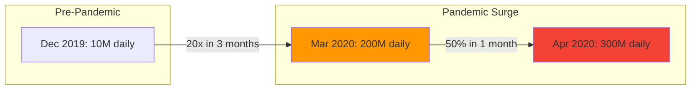
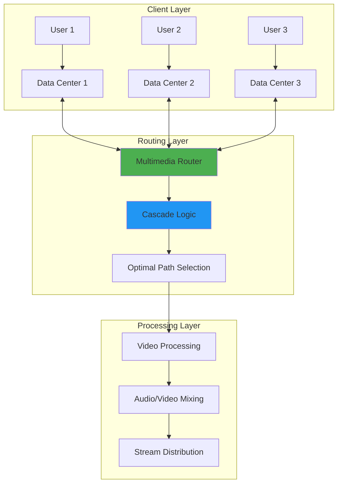
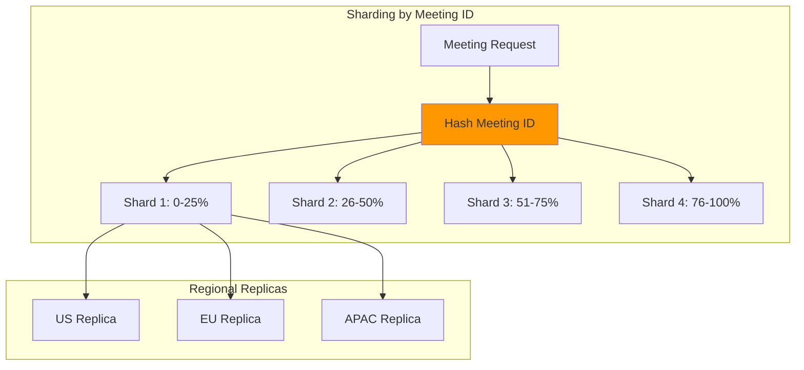
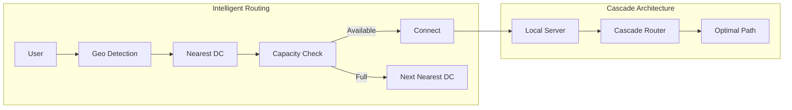
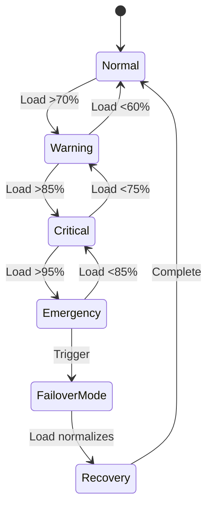

# Zoom's Scaling Journey: From Startup to 300M Daily Users

!!! success "Excellence Badge"
    🥈 **Silver Tier**: Proven patterns with careful trade-off management

!!! abstract "Quick Facts"
    | Metric | Value |
    |--------|-------|
    | **Peak Users** | 300M+ daily participants |
    | **Growth** | 30x in 3 months (2020) |
    | **Infrastructure** | 17 global data centers |
    | **Bandwidth** | 100+ Gbps video traffic |
    | **Reliability** | 99.9% uptime |

## Executive Summary

When COVID-19 hit in 2020, Zoom experienced unprecedented growth, scaling from 10 million to over 300 million daily meeting participants in just three months. This case study examines how Zoom's architecture enabled this explosive growth while maintaining video quality and reliability. Their distributed routing system and aggressive auto-scaling strategies offer valuable lessons for handling viral growth.

## The Challenge

### Exponential Growth Timeline



### Scaling Requirements

| Challenge | Scale | Solution Required |
|-----------|-------|-------------------|
| **Concurrent Users** | 50M+ peak | Massive auto-scaling |
| **Video Bandwidth** | 100+ Gbps | Distributed routing |
| **Global Latency** | <150ms | 17 data centers |
| **Meeting Size** | 1000+ participants | Cascade architecture |
| **Reliability** | 99.9% uptime | Redundant systems |

## Architecture Overview

### Distributed Video Routing



### Key Architecture Components

| Component | Purpose | Scale Factor |
|-----------|---------|--------------|]
| **Multimedia Routers** | Route video streams | 1000s globally |
| **Meeting Servers** | Host meeting logic | 10,000s instances |
| **Transcoders** | Adapt video quality | 100s per DC |
| **Edge Servers** | Client connections | 50K connections each |
| **Database Cluster** | Meeting metadata | Sharded by region |

## Technical Deep Dive

### Auto-Scaling Strategy

=== "Predictive Scaling"
    ```python
    class PredictiveScaler:
        def calculate_capacity(self, current_load, time_of_day, day_of_week):
            # Base capacity from historical patterns
            base = self.historical_pattern(time_of_day, day_of_week)
            
            # Trend detection
            trend = self.detect_trend(current_load)
            
            # Add buffer for spikes
            buffer = base * 0.3  # 30% headroom
            
            # Scale ahead of demand
            target_capacity = base + trend + buffer
            
            return self.round_to_instance_count(target_capacity)
        
        def scale_decision(self, metrics):
            if metrics.cpu > 60 or metrics.bandwidth > 70:
                return ScaleAction.UP, "aggressive"
            elif metrics.cpu < 20 and metrics.bandwidth < 30:
                return ScaleAction.DOWN, "gradual"
            return ScaleAction.NONE, "steady"
    ```

=== "Cascade Routing"
    ```python
    class CascadeRouter:
        def find_optimal_path(self, participants):
            # Group participants by region
            regions = self.group_by_region(participants)
            
            # Find optimal cascade points
            cascade_points = []
            for region, users in regions.items():
                if len(users) > CASCADE_THRESHOLD:
                    # Create regional cascade server
                    cascade = self.create_cascade_server(region)
                    cascade_points.append(cascade)
            
            # Build routing tree
            routing_tree = self.build_minimum_spanning_tree(
                cascade_points,
                weight_function=self.calculate_latency
            )
            
            return routing_tree
    ```

=== "Adaptive Bitrate"
    ```python
    class AdaptiveBitrate:
        def adjust_quality(self, connection_stats):
            # Monitor connection quality
            packet_loss = connection_stats.packet_loss
            bandwidth = connection_stats.available_bandwidth
            latency = connection_stats.rtt
            
            # Calculate quality score
            quality_score = self.calculate_quality_score(
                packet_loss, bandwidth, latency
            )
            
            # Adjust video parameters
            if quality_score > 0.8:
                return VideoProfile.HD_1080p
            elif quality_score > 0.6:
                return VideoProfile.HD_720p
            elif quality_score > 0.4:
                return VideoProfile.SD_480p
            else:
                return VideoProfile.LD_360p
    ```

### Database Sharding Strategy



## Scaling Challenges and Solutions

### Challenge 1: Connection Storms

**Problem**: Millions trying to join meetings at 9 AM

```python
class ConnectionThrottler:
    def __init__(self):
        self.rate_limiter = TokenBucket(rate=10000, capacity=50000)
        self.priority_queue = PriorityQueue()
    
    def handle_connection(self, request):
        # Priority for recurring meetings
        priority = self.calculate_priority(request)
        
        if self.rate_limiter.try_acquire():
            return self.accept_connection(request)
        else:
            # Queue with exponential backoff
            backoff = self.calculate_backoff(request.retry_count)
            self.priority_queue.add(request, priority, backoff)
            return ConnectionResponse.RETRY_AFTER(backoff)
```

### Challenge 2: Bandwidth Optimization

| Optimization | Impact | Implementation |
|--------------|--------|-----------------|
| **Simulcast** | 50% bandwidth reduction | Send multiple quality streams |
| **SVC Codec** | 30% better compression | Scalable video coding |
| **Local Recording** | 90% server load reduction | Client-side recording |
| **Audio-Only Mode** | 95% bandwidth savings | Fallback option |

### Challenge 3: Global Distribution



## Performance Optimizations

### Server Resource Management

```python
# CPU allocation strategy
class ResourceAllocator:
    def allocate_meeting_resources(self, meeting_size):
        if meeting_size <= 10:
            return {
                'cpu_cores': 2,
                'memory_gb': 4,
                'bandwidth_mbps': 50
            }
        elif meeting_size <= 100:
            return {
                'cpu_cores': 8,
                'memory_gb': 16,
                'bandwidth_mbps': 500
            }
        else:  # Large meetings
            return {
                'cpu_cores': 16,
                'memory_gb': 32,
                'bandwidth_mbps': 1000,
                'cascade_servers': meeting_size // 100
            }
```

### Monitoring and Alerting

| Metric | Alert Threshold | Auto-Scaling Action |
|--------|-----------------|---------------------|
| **CPU Usage** | >70% | Add 20% capacity |
| **Bandwidth** | >80% | Add edge servers |
| **Queue Depth** | >1000 | Aggressive scale-up |
| **Latency** | >200ms | Route to closer DC |
| **Packet Loss** | >2% | Switch to audio-only |

## Operational Excellence

### Incident Response During Peak



### Capacity Planning Formula

```python
def calculate_required_capacity(historical_data, growth_rate, peak_factor):
    # Base capacity from historical peak
    base_capacity = max(historical_data.daily_peaks)
    
    # Apply growth projection
    projected_capacity = base_capacity * (1 + growth_rate) ** 3  # 3 month projection
    
    # Add peak factor (e.g., 9 AM surge)
    peak_capacity = projected_capacity * peak_factor
    
    # Safety margin
    required_capacity = peak_capacity * 1.5  # 50% headroom
    
    return {
        'servers': ceil(required_capacity / SERVER_CAPACITY),
        'bandwidth_gbps': required_capacity * BANDWIDTH_PER_USER,
        'database_iops': required_capacity * DB_OPS_PER_USER
    }
```

## Lessons Learned

### Architecture Principles

!!! tip "Key Takeaways"
    1. **Design for 100x growth** - Architecture must handle exponential scaling
    2. **Distribute everything** - No single points of failure
    3. **Monitor aggressively** - You can't scale what you can't measure
    4. **Automate scaling** - Humans can't react fast enough
    5. **Graceful degradation** - Better to drop video than drop calls

### What Worked Well

✅ **Successes**
- Cascade architecture prevented server overload
- Auto-scaling handled 30x growth
- Geo-distribution kept latency low
- Simple API despite complex backend

### What Could Be Improved

❌ **Challenges**
- Initial security concerns with routing
- Database scaling hit limits
- Cost optimization lagged growth
- Monitoring systems overwhelmed

## Applying These Lessons

### For Your Architecture

1. **Plan for viral growth**
   ```yaml
   scaling_strategy:
     - auto_scaling: aggressive
     - manual_override: always_available
     - cost_controls: implement_after_stability
   ```

2. **Implement cascade architecture**
   - Reduces server load
   - Improves quality
   - Enables larger meetings

3. **Monitor everything**
   - User experience metrics
   - Infrastructure metrics
   - Business metrics

### Implementation Checklist

- [ ] Design for 100x current capacity
- [ ] Implement predictive auto-scaling
- [ ] Build cascade routing for efficiency
- [ ] Create multiple fallback options
- [ ] Monitor end-to-end latency
- [ ] Plan for connection storms
- [ ] Optimize bandwidth usage
- [ ] Automate incident response

## Related Resources

- [Auto-scaling Pattern](../pattern-library/scaling/auto-scaling.md)
- [Geo-distribution Pattern](../pattern-library/scaling/geo-distribution.md)
- [Circuit Breaker Pattern](../pattern-library/resilience/circuit-breaker.md)
- [Zoom Engineering Blog](https://medium.com/zoom-developer-blog)

---

*"The best time to scale is before you need to." - Eric Yuan, Zoom CEO*