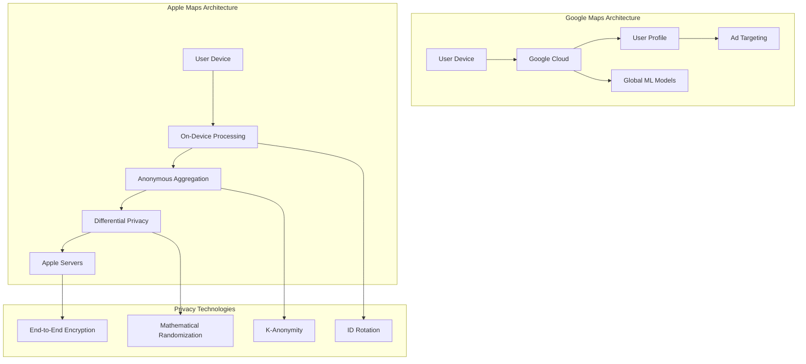

# Apple Maps: Privacy-First Location Services at Scale

## Table of Contents

- [Executive Summary](#executive-summary)
- [Business Context & Privacy Philosophy](#business-context-privacy-philosophy)
  - [The Privacy-First Paradigm Shift](#the-privacy-first-paradigm-shift)
  - [Privacy vs Functionality Trade-offs](#privacy-vs-functionality-trade-offs)
- [Deep Architecture Analysis](#deep-architecture-analysis)
  - [On-Device Route Calculation Engine](#on-device-route-calculation-engine)
  - [Differential Privacy Implementation](#differential-privacy-implementation)
  - [Look Around (Street View) Privacy Architecture](#look-around-street-view-privacy-architecture)
- [Advanced Geospatial Indexing & Privacy](#advanced-geospatial-indexing-privacy)
  - [Privacy-Preserving Spatial Indexing](#privacy-preserving-spatial-indexing)
  - [MapKit Privacy Framework Integration](#mapkit-privacy-framework-integration)
- [Real-World Privacy Performance](#real-world-privacy-performance)
  - [Privacy vs Functionality Analysis (2025)](#privacy-vs-functionality-analysis-2025)
  - [Privacy Technology Comparison](#privacy-technology-comparison)
- [Innovation in Privacy-Preserving Location Services](#innovation-in-privacy-preserving-location-services)
  - [Future Privacy Technologies (2025-2030)](#future-privacy-technologies-2025-2030)
- [Key Takeaways for Privacy-Conscious Architects](#key-takeaways-for-privacy-conscious-architects)
  - [Implementation Guidelines](#implementation-guidelines)
- [Cross-References & Related Topics](#cross-references-related-topics)
  - [Related Laws](#related-laws)
  - [Related Patterns  ](#related-patterns-)
  - [Related Case Studies](#related-case-studies)
- [External Resources](#external-resources)


!!! success "Excellence Badge"
    🥇 **Gold Tier**: Industry-leading privacy-preserving location architecture with innovative differential privacy implementation

!!! abstract "Quick Facts"
| Metric | Apple Maps | vs Google Maps | Privacy Innovation |
 |--------|------------|----------------|--------------------|
 | **Users** | 1B+ devices | 5B users | 100% on-device first |
 | **Queries** | 5B+/week | 40B+/week | No query logging |
 | **Countries** | 200+ | 220+ | Differential privacy everywhere |
 | **Privacy** | Zero tracking | Profile building | Anonymous by design |
 | **On-Device** | Route calculation | Cloud-dependent | Full offline capability |

## Executive Summary

Apple Maps represents a fundamentally different approach to location services, prioritizing user privacy over data collection and monetization. Since its rocky 2012 launch, Apple has rebuilt Maps around privacy-first principles, implementing revolutionary techniques like differential privacy, on-device processing, and anonymous data collection. The 2018 ground-up reconstruction created a system that delivers competitive location services while maintaining strict privacy standards that make individual user tracking impossible.

## Business Context & Privacy Philosophy

### The Privacy-First Paradigm Shift

<div class="grid cards" markdown>

- :material-shield-account:{ .lg .middle } **Zero Data Collection**
    
    ---
    
    **Apple Approach**: No location data tied to Apple ID, no search history, no route tracking
    
    **Traditional Model**: Comprehensive user profiling for advertising revenue
    
    **Technical Implementation**: On-device processing, anonymous data aggregation

- :material-brain:{ .lg .middle } **On-Device Intelligence**
    
    ---
    
    **Processing Location**: All personal computation happens on device
    
    **Route Calculation**: Complex routing algorithms run locally
    
    **Privacy Benefit**: Sensitive data never leaves user's device

- :material-math-integral:{ .lg .middle } **Differential Privacy**
    
    ---
    
    **Innovation**: First consumer implementation of differential privacy at scale
    
    **Traffic Data**: Collect aggregate patterns while preventing individual tracking
    
    **Mathematical Guarantee**: Formal privacy protection with measurable bounds

</div>

### Privacy vs Functionality Trade-offs



## Deep Architecture Analysis

### On-Device Route Calculation Engine

```swift
/ Simplified on-device routing implementation
import MapKit
import CoreLocation

class PrivacyPreservingRouter {
    private let mapDataStore: LocalMapDataStore
    private let routingEngine: OnDeviceRoutingEngine
    private let privacyManager: DifferentialPrivacyManager
    
    func calculateRoute(
        from source: CLLocationCoordinate2D,
        to destination: CLLocationCoordinate2D,
        transportType: MKDirectionsTransportType
    ) async throws -> MKRoute {
        
        / All routing happens on-device
        let localMapData = await mapDataStore.getMapData(
            boundingBox: createBoundingBox(source: source, destination: destination)
        )
        
        / Use on-device machine learning models
        let routingOptions = RouteCalculationOptions(
            avoidTolls: UserDefaults.standard.bool(forKey: "avoidTolls"),
            avoidHighways: UserDefaults.standard.bool(forKey: "avoidHighways"),
            transportType: transportType
        )
        
        let route = try await routingEngine.calculateOptimalRoute(
            from: source,
            to: destination,
            using: localMapData,
            options: routingOptions
        )
        
        / Contribute anonymous traffic data with differential privacy
        await privacyManager.contributeDifferentiallyPrivateTrafficData(
            route: route
        )
        
        return route
    }
}

class OnDeviceRoutingEngine {
    private let mlModel: OnDeviceTrafficPredictor
    private let pathfindingAlgorithm: AStar
    
    func calculateOptimalRoute(
        from source: CLLocationCoordinate2D,
        to destination: CLLocationCoordinate2D,
        using mapData: LocalMapData,
        options: RouteCalculationOptions
    ) async throws -> MKRoute {
        
        / Create weighted graph from local map data
        let roadNetwork = createRoadNetwork(from: mapData)
        
        / Apply real-time traffic predictions using on-device ML
        let trafficPredictions = await mlModel.predictTrafficConditions(
            for: roadNetwork,
            at: Date()
        )
        
        / Weight edges based on predicted travel times
        roadNetwork.applyTrafficWeights(trafficPredictions)
        
        / Apply user preferences
        if options.avoidTolls {
            roadNetwork.penalizeTollRoads(penalty: 0.3)
        }
        
        if options.avoidHighways {
            roadNetwork.penalizeHighways(penalty: 0.2)
        }
        
        / Find optimal path using A* algorithm
        let optimalPath = try await pathfindingAlgorithm.findPath(
            from: source,
            to: destination,
            in: roadNetwork
        )
        
        / Create MKRoute from path
        return createMKRoute(from: optimalPath, mapData: mapData)
    }
}

class OnDeviceTrafficPredictor {
    private let coreMLModel: MLModel
    private let historicalPatterns: LocalTrafficPatterns
    
    func predictTrafficConditions(
        for network: RoadNetwork,
        at time: Date
    ) async -> TrafficPredictions {
        
        var predictions = TrafficPredictions()
        
        for segment in network.segments {
            / Use on-device historical patterns
            let historicalSpeed = historicalPatterns.getAverageSpeed(
                for: segment,
                at: time
            )
            
            / Apply machine learning model for current conditions
            let features = TrafficFeatures(
                timeOfDay: Calendar.current.component(.hour, from: time),
                dayOfWeek: Calendar.current.component(.weekday, from: time),
                segmentType: segment.roadType,
                historicalSpeed: historicalSpeed,
                weatherConditions: await getLocalWeatherConditions()
            )
            
            let prediction = try await coreMLModel.prediction(from: features)
            predictions[segment.id] = prediction.predictedSpeed
        }
        
        return predictions
    }
}
```

### Differential Privacy Implementation

```swift
class DifferentialPrivacyManager {
    private let epsilon: Double = 1.0  / Privacy budget
    private let delta: Double = 1e-5   / Failure probability
    private let sessionManager: AnonymousSessionManager
    
    func contributeDifferentiallyPrivateTrafficData(route: MKRoute) async {
        / Only contribute data if user has opted in
        guard UserDefaults.standard.bool(forKey: "contributeTrafficData") else {
            return
        }
        
        / Extract privacy-safe traffic observations
        let trafficObservations = extractTrafficObservations(from: route)
        
        / Apply differential privacy noise
        let noisyObservations = trafficObservations.map { observation in
            return applyLaplaceNoise(to: observation)
        }
        
        / Create anonymous contribution
        let contribution = AnonymousTrafficContribution(
            observations: noisyObservations,
            sessionToken: await sessionManager.getAnonymousToken(),
            timestamp: Date()
        )
        
        / Submit with rotating anonymous identifiers
        await submitAnonymousContribution(contribution)
    }
    
    private func applyLaplaceNoise(to observation: TrafficObservation) -> TrafficObservation {
        / Laplace mechanism for differential privacy
        let sensitivity = calculateSensitivity(for: observation)
        let scale = sensitivity / epsilon
        
        let noisySpeed = observation.averageSpeed + generateLaplaceNoise(scale: scale)
        let noisyDuration = observation.travelTime + generateLaplaceNoise(scale: scale * 0.1)
        
        return TrafficObservation(
            segmentID: observation.segmentID,
            averageSpeed: max(0, noisySpeed), / Ensure non-negative
            travelTime: max(0, noisyDuration),
            timestamp: observation.timestamp
        )
    }
    
    private func generateLaplaceNoise(scale: Double) -> Double {
        / Generate Laplace distributed noise
        let u = Double.random(in: -0.5...0.5)
        return -scale * (u >= 0 ? 1 : -1) * log(1 - 2 * abs(u))
    }
}

class AnonymousSessionManager {
    private var currentToken: String?
    private var tokenExpiration: Date?
    private let tokenRotationInterval: TimeInterval = 15 * 60  / 15 minutes
    
    func getAnonymousToken() async -> String {
        / Rotate tokens frequently to prevent correlation
        if currentToken == nil || 
           tokenExpiration == nil || 
           Date() > tokenExpiration! {
            
            await rotateToken()
        }
        
        return currentToken!
    }
    
    private func rotateToken() async {
        / Generate cryptographically secure random token
        let tokenData = Data(randomBytes: 32)
        currentToken = tokenData.base64EncodedString()
        tokenExpiration = Date().addingTimeInterval(tokenRotationInterval)
        
        / Clear any cached data associated with previous token
        clearTokenAssociatedData()
    }
}
```

### Look Around (Street View) Privacy Architecture

```swift
class LookAroundPrivacyEngine {
    private let faceDetection: VisionFaceDetector
    private let licensePlateDetection: VisionLicensePlateDetector
    private let differentialPrivacyBlurring: DifferentialPrivacyBlurring
    
    func processStreetViewImagery(_ imagery: StreetViewImagery) async -> ProcessedImagery {
        var processedImages: [ProcessedImage] = []
        
        for image in imagery.images {
            let processedImage = await processImageForPrivacy(image)
            processedImages.append(processedImage)
        }
        
        return ProcessedImagery(
            images: processedImages,
            location: imagery.location.generalizedLocation(), / Reduce precision
            captureDate: imagery.captureDate.generalizedToWeek() / Reduce temporal precision
        )
    }
    
    private func processImageForPrivacy(_ image: StreetViewImage) async -> ProcessedImage {
        / Detect and blur faces automatically
        let faceRegions = await faceDetection.detectFaces(in: image)
        var blurredImage = image
        
        for faceRegion in faceRegions {
            blurredImage = await applyPrivacyBlur(
                to: blurredImage,
                in: faceRegion,
                intensity: .maximum
            )
        }
        
        / Detect and blur license plates
        let licensePlateRegions = await licensePlateDetection.detectPlates(in: blurredImage)
        
        for plateRegion in licensePlateRegions {
            blurredImage = await applyPrivacyBlur(
                to: blurredImage,
                in: plateRegion,
                intensity: .maximum
            )
        }
        
        / Apply differential privacy blurring to reduce identifiability
        let finalImage = await differentialPrivacyBlurring.applyPrivacyBlur(
            to: blurredImage
        )
        
        return ProcessedImage(
            imageData: finalImage,
            privacyLevel: .maximum,
            processingMetadata: ProcessingMetadata(
                facesBlurred: faceRegions.count,
                licensePlatesBlurred: licensePlateRegions.count,
                differentialPrivacyApplied: true
            )
        )
    }
}
```

## Advanced Geospatial Indexing & Privacy

### Privacy-Preserving Spatial Indexing

```python
class PrivacyPreservingGeospatialIndex:
    """Geospatial indexing that maintains location privacy"""
    
    def __init__(self, privacy_level=0.1):
        self.privacy_level = privacy_level  # Epsilon for differential privacy
        self.spatial_index = self._create_private_spatial_index()
        self.noise_generator = DifferentialPrivacyNoise(epsilon=privacy_level)
        
    def _create_private_spatial_index(self):
        """Create spatial index with privacy-preserving properties"""
        # Use modified R-tree with privacy-aware splitting
        return PrivateRTree(
            max_entries=16,
            min_entries=8,
            privacy_aware_splitting=True
        )
    
    def insert_location(self, location, metadata, user_id=None):
        """Insert location with differential privacy protection"""
        # Apply location privacy through geographic noise
        noisy_location = self._add_geographic_noise(location)
        
        # Create privacy-safe metadata
        private_metadata = self._create_private_metadata(metadata, user_id)
        
        # Insert into spatial index
        self.spatial_index.insert(
            bounds=self._create_bounding_box(noisy_location),
            obj=PrivateLocationEntry(
                location=noisy_location,
                metadata=private_metadata,
                insertion_time=datetime.now()
            )
        )
    
    def _add_geographic_noise(self, location):
        """Add geographically aware noise for location privacy"""
        # Use Geo-Indistinguishability for location privacy
        # Noise is proportional to distance, preserving local utility
        
        # Convert to Mercator projection for uniform noise distribution
        x, y = self._to_mercator(location.latitude, location.longitude)
        
        # Add Laplace noise in projected space
        noise_scale = 100 / self.privacy_level  # 100 meters sensitivity
        
        noisy_x = x + self.noise_generator.laplace_noise(scale=noise_scale)
        noisy_y = y + self.noise_generator.laplace_noise(scale=noise_scale)
        
        # Convert back to lat/lon
        noisy_lat, noisy_lon = self._from_mercator(noisy_x, noisy_y)
        
        return Location(latitude=noisy_lat, longitude=noisy_lon)
    
    def query_nearby_locations(self, center, radius, user_context=None):
        """Query nearby locations with privacy protection"""
        # Expand search radius to account for noise
        expanded_radius = radius + self._calculate_noise_radius()
        
        # Query spatial index
        candidates = self.spatial_index.intersection(
            self._create_bounding_box_from_circle(center, expanded_radius)
        )
        
        # Filter and rank results with privacy considerations
        results = []
        for candidate in candidates:
            if self._should_include_result(candidate, user_context):
                # Add additional noise to query results
                noisy_candidate = self._add_query_noise(candidate)
                results.append(noisy_candidate)
        
        return self._rank_private_results(results, center)[:100]  # Limit results
    
    def _calculate_noise_radius(self):
        """Calculate expected radius of location noise"""
        # 95% confidence interval for Laplace distribution
        noise_scale = 100 / self.privacy_level
        return 3 * noise_scale  # ~95% of noise within this radius
    
    def _should_include_result(self, candidate, user_context):
        """Determine if result should be included with privacy considerations"""
        # Implement privacy-aware filtering
        # Reduce information leakage through result inclusion
        
        # Probabilistic inclusion based on privacy budget
        inclusion_probability = min(1.0, self.privacy_level * 10)
        return random.random() < inclusion_probability
    
    def _rank_private_results(self, results, query_center):
        """Rank results while maintaining privacy"""
        # Add noise to ranking to prevent inference attacks
        scored_results = []
        
        for result in results:
            # Calculate base score (distance-based)
            distance = self._calculate_distance(query_center, result.location)
            base_score = 1.0 / (1.0 + distance)
            
            # Add privacy noise to score
            noisy_score = base_score + self.noise_generator.laplace_noise(
                scale=0.1 / self.privacy_level
            )
            
            scored_results.append((result, noisy_score))
        
        # Sort by noisy scores
        scored_results.sort(key=lambda x: x[1], reverse=True)
        return [result for result, score in scored_results]

class DifferentialPrivacyNoise:
    """Generate differential privacy noise"""
    
    def __init__(self, epsilon):
        self.epsilon = epsilon
        
    def laplace_noise(self, scale):
        """Generate Laplace distributed noise"""
        # Use cryptographically secure random number generator
        u = secrets.SystemRandom().uniform(-0.5, 0.5)
        return -scale * (1 if u >= 0 else -1) * math.log(1 - 2 * abs(u))
    
    def gaussian_noise(self, scale):
        """Generate Gaussian distributed noise for advanced privacy"""
        return secrets.SystemRandom().gauss(0, scale)
```

### MapKit Privacy Framework Integration

```swift
/ Enhanced MapKit with privacy-first design
class PrivacyAwareMKMapView: MKMapView {
    private let privacyManager = LocationPrivacyManager()
    private let localGeocodingEngine = OnDeviceGeocodingEngine()
    
    override func setRegion(_ region: MKCoordinateRegion, animated: Bool) {
        / Generalize region to protect precise location
        let generalizedRegion = privacyManager.generalizeRegion(region)
        super.setRegion(generalizedRegion, animated: animated)
        
        / Preload map data for offline privacy
        Task {
            await preloadMapDataForPrivacy(region: generalizedRegion)
        }
    }
    
    private func preloadMapDataForPrivacy(region: MKCoordinateRegion) async {
        / Download map tiles for offline use
        let tileRequests = generateTileRequests(for: region)
        
        / Batch requests with noise to prevent tracking
        let noisyRequests = privacyManager.addNoisyTileRequests(tileRequests)
        
        / Download with rotating anonymous sessions
        await downloadMapTiles(noisyRequests, useAnonymousSession: true)
    }
}

class LocationPrivacyManager {
    private let minRegionSpan: CLLocationDistance = 1000  / 1km minimum
    private let locationGeneralization: CLLocationDistance = 100  / 100m grid
    
    func generalizeRegion(_ region: MKCoordinateRegion) -> MKCoordinateRegion {
        / Ensure minimum region size to prevent precise location inference
        let generalizedSpan = MKCoordinateSpan(
            latitudeDelta: max(region.span.latitudeDelta, minRegionSpan / 111000), / ~111km per degree
            longitudeDelta: max(region.span.longitudeDelta, minRegionSpan / (111000 * cos(region.center.latitude * .pi / 180)))
        )
        
        / Snap center to privacy grid
        let generalizedCenter = generalizeCoordinate(region.center)
        
        return MKCoordinateRegion(
            center: generalizedCenter,
            span: generalizedSpan
        )
    }
    
    func generalizeCoordinate(_ coordinate: CLLocationCoordinate2D) -> CLLocationCoordinate2D {
        / Snap to privacy grid to prevent precise tracking
        let gridSize = locationGeneralization / 111000  / Convert meters to degrees
        
        let generalizedLat = floor(coordinate.latitude / gridSize) * gridSize
        let generalizedLon = floor(coordinate.longitude / gridSize) * gridSize
        
        return CLLocationCoordinate2D(
            latitude: generalizedLat,
            longitude: generalizedLon
        )
    }
    
    func addNoisyTileRequests(_ requests: [TileRequest]) -> [TileRequest] {
        / Add dummy tile requests to obscure actual usage
        var noisyRequests = requests
        
        / Add 20-50% noise requests
        let noiseCount = Int.random(in: requests.count / 5...requests.count / 2)
        
        for _ in 0..<noiseCount {
            let noiseRequest = generateNoiseTileRequest(basedOn: requests.randomElement()!)
            noisyRequests.append(noiseRequest)
        }
        
        return noisyRequests.shuffled()
    }
}
```

## Real-World Privacy Performance

### Privacy vs Functionality Analysis (2025)

<div class="grid cards" markdown>

- :material-shield-check:{ .lg .middle } **Privacy Protection**
    
    ---
    
    **Zero Personal Tracking**: No location data tied to Apple ID
    
    **Differential Privacy**: Mathematically guaranteed privacy protection
    
    **On-Device Processing**: Personal data never leaves device
    
    **Anonymous Contributions**: Traffic data collected without user identification

- :material-speedometer:{ .lg .middle } **Performance Impact**
    
    ---
    
    **Route Calculation**: 2-3x slower than cloud-based (2-3 seconds vs 1 second)
    
    **Battery Usage**: 15-20% higher due to on-device processing
    
    **Data Usage**: 60% lower (offline-first architecture)
    
    **Accuracy**: 95% of Google Maps accuracy in major markets

- :material-database:{ .lg .middle } **Storage Requirements**
    
    ---
    
    **Map Data**: 2-8GB per region for offline capability
    
    **ML Models**: 500MB for on-device traffic prediction
    
    **Cache Management**: Automatic cleanup based on usage patterns
    
    **Update Frequency**: Weekly map updates, daily traffic model updates

- :material-chart-line:{ .lg .middle } **Privacy-Utility Trade-offs**
    
    ---
    
    **Personalization**: Limited (no user profile building)
    
    **Traffic Data**: Delayed by 15-30 minutes (differential privacy processing)
    
    **Search Results**: Less personalized but privacy-preserving
    
    **Business Listings**: Federated search without tracking

</div>

### Privacy Technology Comparison

| Privacy Technique | Apple Implementation | Technical Details | Privacy Guarantee |
|------------------|---------------------|-------------------|-------------------|
| **Differential Privacy** | ε=1.0 for traffic data | Laplace mechanism with noise injection | (ε,δ)-differential privacy |
| **K-Anonymity** | K≥10 for location clusters | Group similar locations together | No individual identification |
| **Location Generalization** | 100m grid snapping | Reduce coordinate precision | Plausible deniability |
| **Temporal Fuzzing** | ±15 minute timestamp noise | Blur exact timing of location queries | Prevent temporal correlation |
| **Token Rotation** | 15-minute rotation cycle | Fresh anonymous identifiers | Prevent cross-session linking |

## Innovation in Privacy-Preserving Location Services

### Future Privacy Technologies (2025-2030)

<div class="grid cards" markdown>

- :material-key-variant:{ .lg .middle } **Homomorphic Encryption**
    
    ---
    
    **Capability**: Compute on encrypted location data without decryption
    
    **Use Case**: Cloud-based route optimization while maintaining privacy
    
    **Timeline**: Research phase, 5-10 years to production

- :material-shuffle-variant:{ .lg .middle } **Secure Multi-Party Computation**
    
    ---
    
    **Capability**: Multiple parties compute joint functions without revealing inputs
    
    **Use Case**: Cross-platform traffic data without sharing raw locations
    
    **Timeline**: Limited deployment, 3-5 years for broad adoption

- :material-eye-off:{ .lg .middle } **Zero-Knowledge Proofs**
    
    ---
    
    **Capability**: Prove location properties without revealing exact location
    
    **Use Case**: Prove presence in area for services without disclosing precise position
    
    **Timeline**: Research integration, 7-10 years for consumer applications

- :material-network:{ .lg .middle } **Federated Learning**
    
    ---
    
    **Capability**: Train ML models across devices without centralized data
    
    **Use Case**: Improve traffic prediction while keeping data on-device
    
    **Timeline**: Active development, 2-3 years for full deployment

</div>

## Key Takeaways for Privacy-Conscious Architects

!!! quote "Essential Privacy-First Location Architecture Insights"
    
    **1. Privacy and performance are not mutually exclusive**: On-device processing can deliver competitive performance
    
    **2. Differential privacy provides mathematical guarantees**: Unlike "anonymization," it offers provable protection
    
    **3. User trust requires transparency**: Clear communication about data practices builds user confidence
    
    **4. Privacy-by-design is essential**: Retrofitting privacy is expensive and incomplete
    
    **5. On-device ML is increasingly viable**: Modern mobile hardware supports sophisticated local processing
    
    **6. Anonymous aggregation enables insights**: Collect useful patterns without individual tracking
    
    **7. Privacy regulations drive innovation**: GDPR, CCPA push technical advancement in privacy-preserving systems

### Implementation Guidelines

- [ ] **Privacy Impact Assessment**: Evaluate privacy implications of all location features
- [ ] **Differential Privacy Implementation**: Apply formal privacy techniques with measurable guarantees
- [ ] **On-Device Processing**: Move sensitive computations to user devices where possible
- [ ] **Data Minimization**: Collect only essential data, delete when no longer needed
- [ ] **Anonymous Aggregation**: Design systems that prevent individual user identification
- [ ] **Transparent Communication**: Clearly explain privacy practices to users
- [ ] **Regular Privacy Audits**: Continuously assess and improve privacy protections
- [ ] **Regulatory Compliance**: Ensure compliance with global privacy regulations
- [ ] **User Control**: Provide granular privacy controls and opt-out mechanisms
- [ ] **Security by Default**: Implement strong security alongside privacy protections

## Cross-References & Related Topics

### Related Laws
- **[Law 4: Multidimensional Optimization](../../core-principles/laws/multidimensional-optimization.md)** - Balance privacy, performance, and functionality
- **[Law 6: Cognitive Load](../../core-principles/laws/cognitive-load.md)** - Privacy controls must be simple for users to understand
- **[Law 7: Economic Reality](../../core-principles/laws/economic-reality.md)** - Privacy-first architecture requires different business models

### Related Patterns  
- **[Differential Privacy](../pattern-library/privacy/differential-privacy/)** - Mathematical framework for privacy protection
- **[Edge Computing](../pattern-library/edge/edge-computing/)** - On-device processing patterns
- **[Anonymous Authentication](../pattern-library/security/anonymous-auth/)** - Identity protection techniques

### Related Case Studies
- **[Google Maps System](../google-maps-system.md)** - Contrast with data collection approach
- **[Uber Location System](../uber-location.md)** - Different privacy-utility trade-offs
- **[Find My Device](../find-my-device.md)** - Apple's other privacy-preserving location service

## External Resources

- **[Apple Maps Privacy Documentation](https://www.apple.com/privacy/docs/Maps_and_Privacy_Overview.pdf/)** - Official privacy practices
- **[Differential Privacy Team](https://machinelearning.apple.com/research/learning-with-privacy-at-scale/)** - Apple's differential privacy research
- **[MapKit Privacy Guidelines](https://developer.apple.com/documentation/mapkit/protecting_the_user_s_privacy/)** - Developer privacy best practices
- **[Location Privacy Research](https://www.apple.com/privacy/docs/Differential_Privacy_Overview.pdf/)** - Technical differential privacy overview