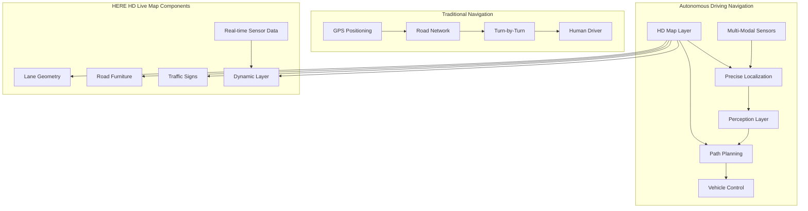

# HERE Maps: Automotive-Grade Location Intelligence

!!! success "Excellence Badge"
    🥈 **Silver Tier**: Industry-leading HD mapping and sensor fusion for autonomous vehicles with enterprise-grade reliability

!!! abstract "Quick Facts"
| Metric | HERE HD Live Map | Traditional GPS | Innovation |
 |--------|------------------|-----------------|------------|
 | **Accuracy** | Lane-level (10cm) | Road-level (3-5m) | 50x improvement |
 | **Update Frequency** | Real-time | Monthly/Quarterly | Continuous updates |
 | **Data Sources** | 4M+ vehicles | Satellites only | Crowdsourced sensors |
 | **Coverage** | 200+ countries | Global | Automotive-focused |
 | **Latency** | < 100ms updates | N/A (static) | Real-time responsive |

## Executive Summary

HERE Technologies represents the evolution from traditional mapping to automotive-grade location intelligence, pioneering High Definition (HD) maps essential for autonomous vehicle navigation. Originally Nokia's mapping division, HERE has transformed into a B2B location platform serving automotive OEMs, logistics companies, and enterprise customers. Their HD Live Map combines real-time sensor data from millions of connected vehicles with centimeter-level accuracy mapping to enable advanced driver assistance systems (ADAS) and autonomous driving.

## Business Context & Automotive Evolution

### From Consumer Maps to Autonomous Driving Infrastructure

<div class="grid cards" markdown>

- :material-car-connected:{ .lg .middle } **Connected Vehicle Ecosystem**
    
    ---
    
    **Data Sources**: 4M+ connected vehicles providing real-time sensor data
    
    **Coverage**: 1.8M km of HD-mapped roads globally
    
    **Update Cycle**: Real-time updates vs traditional quarterly map releases

- :material-map-marker-radius:{ .lg .middle } **Centimeter-Level Precision**
    
    ---
    
    **Lane Geometry**: Precise lane boundaries, widths, and markings
    
    **Road Attributes**: Slopes, curvatures, surface conditions
    
    **Dynamic Elements**: Construction zones, traffic signs, temporary changes

- :material-brain:{ .lg .middle } **Sensor Fusion Intelligence**
    
    ---
    
    **Multi-Modal Data**: Cameras, LiDAR, radar, GPS, and IMU integration
    
    **Real-Time Processing**: Edge computing in vehicles + cloud analytics
    
    **Predictive Insights**: Traffic patterns, road condition forecasting

</div>

### Autonomous Driving Requirements vs Traditional Navigation



## Deep Architecture Analysis

### HD Map Data Pipeline Architecture

```python
class HDMapDataPipeline:
    """HERE HD Live Map data processing pipeline"""
    
    def __init__(self):
        self.sensor_ingestion = SensorDataIngestion()
        self.map_fusion_engine = MapFusionEngine()
        self.quality_assurance = MapQualityAssurance()
        self.distribution_network = MapDistributionNetwork()
        self.real_time_updates = RealTimeUpdateEngine()
        
    async def process_vehicle_sensor_data(self, vehicle_data: VehicleSensorData):
        """Process incoming sensor data from connected vehicles"""
        
        # Validate and filter sensor data
        validated_data = await self.sensor_ingestion.validate_sensor_data(vehicle_data)
        
        if not validated_data.is_valid:
            return ProcessingResult(status="rejected", reason=validated_data.rejection_reason)
        
        # Extract map-relevant features
        map_features = await self.extract_hd_map_features(validated_data)
        
        # Fuse with existing HD map data
        fusion_result = await self.map_fusion_engine.fuse_sensor_observations(
            new_observations=map_features,
            existing_map_data=await self.get_existing_map_data(validated_data.location),
            confidence_threshold=0.85
        )
        
        # Quality assurance and conflict resolution
        qa_result = await self.quality_assurance.validate_map_update(fusion_result)
        
        if qa_result.approved:
            # Distribute updates to relevant map tiles
            await self.distribute_map_updates(qa_result.approved_updates)
            
            # Trigger real-time updates for connected vehicles
            await self.real_time_updates.push_updates_to_vehicles(
                affected_area=fusion_result.affected_area,
                updates=qa_result.approved_updates
            )
        
        return ProcessingResult(
            status="processed",
            features_extracted=len(map_features),
            updates_approved=len(qa_result.approved_updates) if qa_result.approved else 0
        )
    
    async def extract_hd_map_features(self, sensor_data: VehicleSensorData) -> List[HDMapFeature]:
        """Extract HD map features from multi-modal sensor data"""
        features = []
        
        # Process camera data for lane markings and traffic signs
        if sensor_data.camera_data:
            camera_features = await self.process_camera_data(sensor_data.camera_data)
            features.extend(camera_features)
        
        # Process LiDAR data for precise geometry
        if sensor_data.lidar_data:
            lidar_features = await self.process_lidar_data(
                sensor_data.lidar_data,
                sensor_data.gps_position,
                sensor_data.imu_data
            )
            features.extend(lidar_features)
        
        # Process radar data for object detection
        if sensor_data.radar_data:
            radar_features = await self.process_radar_data(sensor_data.radar_data)
            features.extend(radar_features)
        
        # Fuse multi-modal observations
        fused_features = await self.fuse_multi_modal_observations(features)
        
        return fused_features
    
    async def process_camera_data(self, camera_data: CameraData) -> List[HDMapFeature]:
        """Extract features from camera data using computer vision"""
        features = []
        
        # Lane marking detection
        lane_markings = await self.detect_lane_markings(camera_data.images)
        for marking in lane_markings:
            features.append(HDMapFeature(
                type=FeatureType.LANE_MARKING,
                geometry=marking.geometry,
                attributes={
                    'marking_type': marking.type,  # solid, dashed, double
                    'color': marking.color,
                    'width': marking.width,
                    'confidence': marking.confidence
                },
                sensor_source='camera',
                timestamp=camera_data.timestamp
            ))
        
        # Traffic sign detection
        traffic_signs = await self.detect_traffic_signs(camera_data.images)
        for sign in traffic_signs:
            features.append(HDMapFeature(
                type=FeatureType.TRAFFIC_SIGN,
                geometry=sign.position,
                attributes={
                    'sign_type': sign.type,
                    'text_content': sign.text,
                    'facing_direction': sign.orientation,
                    'confidence': sign.confidence
                },
                sensor_source='camera',
                timestamp=camera_data.timestamp
            ))
        
        # Road furniture detection (barriers, poles, etc.)
        road_furniture = await self.detect_road_furniture(camera_data.images)
        features.extend(road_furniture)
        
        return features
    
    async def process_lidar_data(self, lidar_data: LiDARData, gps_position: GPSPosition, imu_data: IMUData) -> List[HDMapFeature]:
        """Extract precise geometric features from LiDAR point clouds"""
        features = []
        
        # Precise lane boundary extraction
        lane_boundaries = await self.extract_lane_boundaries_from_pointcloud(
            lidar_data.point_cloud,
            vehicle_position=gps_position,
            vehicle_orientation=imu_data.orientation
        )
        
        for boundary in lane_boundaries:
            features.append(HDMapFeature(
                type=FeatureType.LANE_BOUNDARY,
                geometry=boundary.precise_geometry,
                attributes={
                    'boundary_type': boundary.type,  # curb, barrier, marking
                    'height': boundary.height,
                    'material': boundary.material,
                    'precision': boundary.precision  # typically 5-10cm
                },
                sensor_source='lidar',
                timestamp=lidar_data.timestamp
            ))
        
        # Road surface topology
        surface_topology = await self.extract_road_topology(lidar_data.point_cloud)
        features.append(HDMapFeature(
            type=FeatureType.ROAD_SURFACE,
            geometry=surface_topology.mesh,
            attributes={
                'slope': surface_topology.slope,
                'banking': surface_topology.banking,
                'roughness': surface_topology.roughness,
                'surface_type': surface_topology.material
            },
            sensor_source='lidar',
            timestamp=lidar_data.timestamp
        ))
        
        return features

class MapFusionEngine:
    """Fuse multi-source sensor data into coherent HD map updates"""
    
    def __init__(self):
        self.confidence_calculator = ConfidenceCalculator()
        self.conflict_resolver = ConflictResolver()
        self.temporal_filter = TemporalConsistencyFilter()
        
    async def fuse_sensor_observations(self, new_observations: List[HDMapFeature], 
                                     existing_map_data: HDMapTile, 
                                     confidence_threshold: float) -> FusionResult:
        """Fuse new sensor observations with existing map data"""
        
        fusion_candidates = []
        conflicts = []
        
        for observation in new_observations:
            # Find overlapping existing features
            overlapping_features = existing_map_data.find_overlapping_features(
                observation.geometry,
                buffer_distance=0.5  # 50cm tolerance
            )
            
            if not overlapping_features:
                # New feature - validate confidence
                if observation.confidence >= confidence_threshold:
                    fusion_candidates.append(FusionCandidate(
                        operation=FusionOperation.ADD,
                        feature=observation,
                        confidence=observation.confidence
                    ))
            else:
                # Existing feature - check for updates or conflicts
                for existing_feature in overlapping_features:
                    similarity = self.calculate_feature_similarity(
                        observation, existing_feature
                    )
                    
                    if similarity > 0.9:  # High similarity - potential update
                        if observation.confidence > existing_feature.confidence:
                            fusion_candidates.append(FusionCandidate(
                                operation=FusionOperation.UPDATE,
                                feature=observation,
                                existing_feature=existing_feature,
                                confidence=observation.confidence
                            ))
                    elif similarity < 0.3:  # Low similarity - potential conflict
                        conflicts.append(FeatureConflict(
                            new_observation=observation,
                            existing_feature=existing_feature,
                            conflict_type=ConflictType.GEOMETRY_MISMATCH
                        ))
        
        # Resolve conflicts using multiple observations and temporal consistency
        resolved_conflicts = await self.conflict_resolver.resolve_conflicts(conflicts)
        
        # Apply temporal filtering to reduce noise
        filtered_candidates = await self.temporal_filter.filter_candidates(
            fusion_candidates + resolved_conflicts
        )
        
        return FusionResult(
            approved_updates=filtered_candidates,
            rejected_conflicts=conflicts,
            affected_area=self.calculate_affected_area(filtered_candidates)
        )

class RealTimeUpdateEngine:
    """Distribute real-time HD map updates to connected vehicles"""
    
    def __init__(self):
        self.vehicle_connections = VehicleConnectionManager()
        self.update_prioritizer = UpdatePrioritizer()
        self.bandwidth_optimizer = BandwidthOptimizer()
        
    async def push_updates_to_vehicles(self, affected_area: GeographicArea, 
                                     updates: List[HDMapUpdate]):
        """Push updates to vehicles in affected area"""
        
        # Find vehicles in affected area
        affected_vehicles = await self.vehicle_connections.find_vehicles_in_area(
            affected_area,
            include_route_predictions=True  # Include vehicles heading to area
        )
        
        # Prioritize updates by safety criticality
        prioritized_updates = self.update_prioritizer.prioritize_updates(
            updates,
            criteria=['safety_critical', 'navigation_impact', 'urgency']
        )
        
        # Optimize update delivery based on vehicle capabilities and network conditions
        for vehicle in affected_vehicles:
            vehicle_updates = await self.bandwidth_optimizer.optimize_updates_for_vehicle(
                vehicle=vehicle,
                updates=prioritized_updates,
                max_bandwidth=vehicle.connection_info.available_bandwidth
            )
            
            # Push updates with retry logic
            await self.push_updates_to_vehicle(vehicle, vehicle_updates)
    
    async def push_updates_to_vehicle(self, vehicle: ConnectedVehicle, 
                                    updates: List[OptimizedHDMapUpdate]):
        """Push optimized updates to individual vehicle"""
        try:
            # Create differential update package
            update_package = await self.create_differential_update(
                vehicle_id=vehicle.id,
                current_map_version=vehicle.current_map_version,
                target_updates=updates
            )
            
            # Compress and encrypt update
            secure_package = await self.encrypt_update_package(
                update_package,
                vehicle.encryption_key
            )
            
            # Send via vehicle's preferred communication channel
            delivery_result = await vehicle.connection_manager.send_update(
                secure_package,
                priority=UpdatePriority.HIGH if any(u.safety_critical for u in updates) else UpdatePriority.NORMAL
            )
            
            # Track delivery success for quality monitoring
            await self.track_update_delivery(
                vehicle_id=vehicle.id,
                update_ids=[u.id for u in updates],
                delivery_result=delivery_result
            )
            
        except Exception as e:
            # Queue for retry with exponential backoff
            await self.queue_update_retry(
                vehicle_id=vehicle.id,
                updates=updates,
                error=e,
                retry_attempt=1
            )
```

### Vehicle Sensor Data Integration

```cpp
/ On-vehicle sensor data collection and transmission
namespace here_automotive {

class VehicleSensorCollector {
public:
    struct SensorConfiguration {
        bool enable_camera_data = true;
        bool enable_lidar_data = true;
        bool enable_radar_data = true;
        bool enable_imu_data = true;
        bool enable_wheel_sensors = true;
        
        / Privacy settings
        bool anonymize_location = true;
        bool encrypt_transmission = true;
        double location_precision_limit = 1.0; / meters
    };
    
    class HDMapContribution {
    private:
        SensorConfiguration config_;
        std::unique_ptr<DataAnonymizer> anonymizer_;
        std::unique_ptr<QualityAssessment> quality_checker_;
        std::unique_ptr<HERECloudConnector> cloud_connector_;
        
    public:
        explicit HDMapContribution(const SensorConfiguration& config)
            : config_(config),
              anonymizer_(std::make_unique<DataAnonymizer>()),
              quality_checker_(std::make_unique<QualityAssessment>()),
              cloud_connector_(std::make_unique<HERECloudConnector>()) {}
        
        void ProcessSensorFrame(const MultiModalSensorFrame& frame) {
            / Quality assessment - only contribute high-quality data
            auto quality_score = quality_checker_->AssessFrameQuality(frame);
            if (quality_score < 0.8) {
                return; / Skip low-quality data
            }
            
            / Extract HD map relevant features
            auto map_features = ExtractHDMapFeatures(frame);
            
            / Apply privacy protection
            auto anonymized_features = anonymizer_->AnonymizeFeatures(
                map_features, config_.location_precision_limit
            );
            
            / Create contribution package
            HDMapContributionPackage contribution{
                .vehicle_id = anonymizer_->GetAnonymousVehicleID(),
                .timestamp = frame.timestamp,
                .location = anonymized_features.generalized_location,
                .sensor_data = anonymized_features.processed_data,
                .quality_metrics = quality_score
            };
            
            / Transmit to HERE Cloud (with retry logic)
            cloud_connector_->SubmitContribution(contribution);
        }
        
    private:
        HDMapFeatures ExtractHDMapFeatures(const MultiModalSensorFrame& frame) {
            HDMapFeatures features;
            
            / Process camera data for lane markings and signs
            if (config_.enable_camera_data && frame.camera_data.has_value()) {
                auto camera_features = ProcessCameraForHDMap(frame.camera_data.value());
                features.camera_features = camera_features;
            }
            
            / Process LiDAR for precise geometry
            if (config_.enable_lidar_data && frame.lidar_data.has_value()) {
                auto lidar_features = ProcessLiDARForHDMap(
                    frame.lidar_data.value(),
                    frame.gps_position,
                    frame.imu_data.value_or(IMUData{})
                );
                features.lidar_features = lidar_features;
            }
            
            / Process radar for dynamic objects
            if (config_.enable_radar_data && frame.radar_data.has_value()) {
                auto radar_features = ProcessRadarForHDMap(frame.radar_data.value());
                features.radar_features = radar_features;
            }
            
            return features;
        }
        
        CameraHDFeatures ProcessCameraForHDMap(const CameraData& camera_data) {
            CameraHDFeatures features;
            
            / Lane marking detection using deep learning
            auto lane_detector = CreateLaneMarkingDetector();
            features.lane_markings = lane_detector->DetectLaneMarkings(
                camera_data.front_camera_image
            );
            
            / Traffic sign detection and recognition
            auto sign_detector = CreateTrafficSignDetector();
            features.traffic_signs = sign_detector->DetectAndClassifySigns(
                camera_data.front_camera_image
            );
            
            / Road furniture detection
            auto furniture_detector = CreateRoadFurnitureDetector();
            features.road_furniture = furniture_detector->DetectFurniture(
                camera_data.front_camera_image
            );
            
            return features;
        }
        
        LiDARHDFeatures ProcessLiDARForHDMap(const LiDARData& lidar_data,
                                           const GPSPosition& gps_pos,
                                           const IMUData& imu_data) {
            LiDARHDFeatures features;
            
            / Precise lane boundary extraction
            auto boundary_extractor = CreateLaneBoundaryExtractor();
            features.lane_boundaries = boundary_extractor->ExtractBoundaries(
                lidar_data.point_cloud,
                gps_pos,
                imu_data.orientation
            );
            
            / Road surface topology
            auto topology_analyzer = CreateTopologyAnalyzer();
            features.road_topology = topology_analyzer->AnalyzeRoadSurface(
                lidar_data.point_cloud
            );
            
            / 3D object detection for static infrastructure
            auto object_detector = CreateStaticObjectDetector();
            features.static_objects = object_detector->DetectInfrastructure(
                lidar_data.point_cloud
            );
            
            return features;
        }
    };
};

/ HD Map consumption for autonomous driving
class HDMapConsumer {
private:
    std::unique_ptr<HEREMapService> map_service_;
    std::unique_ptr<LocalizationEngine> localization_;
    std::unique_ptr<PathPlanner> path_planner_;
    
    / Cache for frequently accessed map data
    LRUCache<TileID, HDMapTile> map_cache_{100}; / 100 tiles
    
public:
    struct AutonomousDrivingContext {
        VehiclePosition current_position;
        VehicleState vehicle_state;
        Route planned_route;
        AutonomyLevel autonomy_level;
    };
    
    NavigationGuidance GetNavigationGuidance(
        const AutonomousDrivingContext& context
    ) {
        / Get relevant HD map tiles for current position and route
        auto required_tiles = CalculateRequiredMapTiles(
            context.current_position,
            context.planned_route,
            look_ahead_distance_m: 1000
        );
        
        / Load tiles from cache or fetch from service
        std::vector<HDMapTile> map_tiles;
        for (const auto& tile_id : required_tiles) {
            if (auto cached_tile = map_cache_.Get(tile_id)) {
                map_tiles.push_back(*cached_tile);
            } else {
                auto tile = map_service_->GetHDMapTile(tile_id);
                map_cache_.Put(tile_id, tile);
                map_tiles.push_back(tile);
            }
        }
        
        / Precise vehicle localization using HD map
        auto precise_position = localization_->LocalizeVehicle(
            context.current_position,
            map_tiles,
            context.vehicle_state.sensor_data
        );
        
        / Generate lane-level path planning
        auto lane_level_path = path_planner_->PlanLaneLevelPath(
            precise_position,
            context.planned_route,
            map_tiles,
            context.autonomy_level
        );
        
        / Extract navigation guidance
        return NavigationGuidance{
            .precise_position = precise_position,
            .lane_level_path = lane_level_path,
            .upcoming_lane_changes = ExtractLaneChangeGuidance(lane_level_path),
            .traffic_signs_ahead = ExtractRelevantTrafficSigns(map_tiles, lane_level_path),
            .road_attributes = ExtractRoadAttributes(map_tiles, lane_level_path),
            .construction_zones = ExtractConstructionInfo(map_tiles, lane_level_path)
        };
    }
    
    std::vector<TileID> CalculateRequiredMapTiles(
        const VehiclePosition& position,
        const Route& route,
        double look_ahead_distance_m
    ) {
        std::vector<TileID> required_tiles;
        
        / Current position tile
        auto current_tile = GetTileIDForPosition(position);
        required_tiles.push_back(current_tile);
        
        / Adjacent tiles for lane changes
        auto adjacent_tiles = GetAdjacentTiles(current_tile);
        required_tiles.insert(required_tiles.end(), 
                           adjacent_tiles.begin(), adjacent_tiles.end());
        
        / Route ahead tiles
        auto route_tiles = GetTilesAlongRoute(
            route, 
            position, 
            look_ahead_distance_m
        );
        required_tiles.insert(required_tiles.end(),
                           route_tiles.begin(), route_tiles.end());
        
        / Remove duplicates
        std::sort(required_tiles.begin(), required_tiles.end());
        required_tiles.erase(
            std::unique(required_tiles.begin(), required_tiles.end()),
            required_tiles.end()
        );
        
        return required_tiles;
    }
};

} / namespace here_automotive
```

## Enterprise Fleet Management Integration

### Fleet Optimization with HD Maps

```python
class HEREFleetOptimizer:
    """Enterprise fleet management with HD map integration"""
    
    def __init__(self, here_api_key: str):
        self.here_client = HERELocationServices(api_key=here_api_key)
        self.route_optimizer = HERERouteOptimizer()
        self.traffic_analyzer = HERETrafficAnalyzer()
        self.fleet_tracker = FleetTrackingService()
        
    async def optimize_fleet_routes(self, fleet_request: FleetOptimizationRequest) -> FleetOptimizationResult:
        """Optimize routes for entire fleet using HERE's advanced routing"""
        
        # Analyze current traffic conditions
        traffic_analysis = await self.traffic_analyzer.analyze_fleet_corridors(
            vehicles=fleet_request.vehicles,
            time_horizon=fleet_request.optimization_window
        )
        
        # Calculate optimal routes for each vehicle
        optimization_tasks = []
        for vehicle in fleet_request.vehicles:
            task = self.optimize_vehicle_route(
                vehicle=vehicle,
                constraints=fleet_request.constraints,
                traffic_context=traffic_analysis
            )
            optimization_tasks.append(task)
        
        # Execute optimizations in parallel
        optimization_results = await asyncio.gather(*optimization_tasks)
        
        # Resolve conflicts and balance fleet load
        balanced_routes = await self.balance_fleet_load(
            optimization_results,
            fleet_constraints=fleet_request.global_constraints
        )
        
        return FleetOptimizationResult(
            optimized_routes=balanced_routes,
            estimated_savings=self.calculate_optimization_savings(balanced_routes),
            environmental_impact=self.calculate_environmental_impact(balanced_routes)
        )
    
    async def optimize_vehicle_route(self, vehicle: FleetVehicle, 
                                   constraints: RouteConstraints,
                                   traffic_context: TrafficAnalysis) -> VehicleRouteOptimization:
        """Optimize single vehicle route with HERE advanced features"""
        
        # Define route request with vehicle-specific parameters
        route_request = HERERouteRequest(
            waypoints=vehicle.assigned_stops,
            vehicle_profile=self.create_vehicle_profile(vehicle),
            departure_time=vehicle.scheduled_departure,
            optimization_goals=['time', 'fuel_consumption', 'driver_comfort'],
            constraints={
                'max_driving_hours': constraints.max_driving_hours,
                'mandatory_breaks': constraints.break_requirements,
                'restricted_areas': constraints.restricted_zones,
                'delivery_time_windows': [stop.time_window for stop in vehicle.assigned_stops]
            }
        )
        
        # Enhanced routing with traffic prediction
        route_options = await self.here_client.calculate_route_options(
            request=route_request,
            include_traffic_prediction=True,
            include_truck_attributes=vehicle.is_commercial_vehicle,
            include_environmental_zones=True
        )
        
        # Select optimal route based on multi-criteria optimization
        optimal_route = self.select_optimal_route(
            route_options,
            optimization_criteria={
                'travel_time': 0.4,
                'fuel_cost': 0.3,
                'driver_comfort': 0.2,
                'environmental_impact': 0.1
            }
        )
        
        # Generate turn-by-turn navigation with truck-specific guidance
        navigation_guidance = await self.generate_navigation_guidance(
            optimal_route,
            vehicle_profile=vehicle.profile
        )
        
        return VehicleRouteOptimization(
            vehicle_id=vehicle.id,
            optimized_route=optimal_route,
            navigation_guidance=navigation_guidance,
            estimated_performance=self.estimate_route_performance(optimal_route, vehicle)
        )
    
    def create_vehicle_profile(self, vehicle: FleetVehicle) -> HEREVehicleProfile:
        """Create HERE vehicle profile for accurate routing"""
        return HEREVehicleProfile(
            vehicle_type=vehicle.type,
            dimensions={
                'length': vehicle.specifications.length,
                'width': vehicle.specifications.width,
                'height': vehicle.specifications.height,
                'weight': vehicle.specifications.gross_weight
            },
            engine_specs={
                'fuel_type': vehicle.specifications.fuel_type,
                'engine_power': vehicle.specifications.engine_power,
                'fuel_consumption_city': vehicle.specifications.fuel_consumption_city,
                'fuel_consumption_highway': vehicle.specifications.fuel_consumption_highway,
                'emission_class': vehicle.specifications.emission_class
            },
            restrictions={
                'hazmat_permitted': vehicle.certifications.hazmat_certified,
                'tunnel_restrictions': vehicle.restrictions.tunnel_categories,
                'low_emission_zone_permitted': vehicle.certifications.low_emission_zones
            }
        )
    
    async def monitor_fleet_real_time(self, fleet_id: str) -> RealTimeFleetStatus:
        """Monitor fleet with real-time HERE data integration"""
        
        # Get current vehicle positions
        vehicle_positions = await self.fleet_tracker.get_current_positions(fleet_id)
        
        # Analyze traffic conditions on active routes
        active_routes = [v.current_route for v in vehicle_positions if v.current_route]
        traffic_impacts = await self.analyze_traffic_impacts(active_routes)
        
        # Detect route deviations and delays
        route_analysis = []
        for vehicle in vehicle_positions:
            if vehicle.current_route:
                analysis = await self.analyze_route_progress(
                    vehicle=vehicle,
                    original_route=vehicle.planned_route,
                    current_position=vehicle.position,
                    traffic_data=traffic_impacts.get(vehicle.id)
                )
                route_analysis.append(analysis)
        
        # Generate real-time optimization recommendations
        optimization_recommendations = await self.generate_real_time_recommendations(
            fleet_status=vehicle_positions,
            traffic_impacts=traffic_impacts,
            route_analysis=route_analysis
        )
        
        return RealTimeFleetStatus(
            vehicle_positions=vehicle_positions,
            traffic_impacts=traffic_impacts,
            route_progress=route_analysis,
            optimization_recommendations=optimization_recommendations,
            fleet_performance_kpis=self.calculate_fleet_kpis(vehicle_positions)
        )
```

## Performance Analysis & Real-World Metrics

### HD Map Performance Characteristics (2025)

<div class="grid cards" markdown>

- :material-map-marker-radius:{ .lg .middle } **Precision & Accuracy**
    
    ---
    
    **Lane-Level Accuracy**: 10-20cm precision for autonomous driving
    
    **Update Latency**: < 100ms for safety-critical updates
    
    **Coverage**: 1.8M km of HD-mapped roads globally
    
    **Feature Density**: 10,000+ features per km of highway

- :material-car-connected:{ .lg .middle } **Data Collection Scale**
    
    ---
    
    **Connected Vehicles**: 4M+ vehicles contributing sensor data
    
    **Data Volume**: 100TB+ processed daily
    
    **Update Frequency**: Real-time for dynamic features
    
    **Quality Assurance**: 99.9% accuracy validation

- :material-speedometer:{ .lg .middle } **Performance Metrics**
    
    ---
    
    **API Response Time**: < 200ms p99 for route requests
    
    **Map Tile Loading**: < 50ms for cached tiles
    
    **Bandwidth Optimization**: 80% compression for OTA updates
    
    **Offline Capability**: 500km range with local storage

- :material-shield-car:{ .lg .middle } **Automotive Reliability**
    
    ---
    
    **Availability**: 99.99% uptime SLA
    
    **Safety Certification**: ISO 26262 ASIL-B compliance
    
    **Redundancy**: Multiple data sources for critical features
    
    **Failover Time**: < 1 second to backup systems

</div>

### Cost Analysis: HD Maps vs Traditional Navigation

| Cost Component | Traditional GPS | HERE HD Live Map | Cost Difference |
|----------------|-----------------|------------------|------------------|
| **Map Data Licensing** | $1-5 per device | $50-200 per vehicle/year | 40-200x higher |
| **Data Storage** | 50MB-2GB | 20-100GB per region | 10-50x higher |
| **Update Infrastructure** | Quarterly batches | Real-time streaming | 10x infrastructure cost |
| **Quality Assurance** | Automated + spot checks | Continuous validation + ML | 5x QA resources |
| **Sensor Integration** | GPS only | Multi-modal sensors | $1000-5000 per vehicle |
| **Total TCO (5 years)** | $10-50 per device | $2000-10000 per vehicle | 100-500x higher |

## Key Takeaways for Automotive Architects

!!! quote "Essential HERE HD Map Architecture Insights"
    
    **1. Precision enables autonomy**: Centimeter-level accuracy is non-negotiable for autonomous vehicles
    
    **2. Real-time updates are critical**: Static maps cannot handle dynamic road conditions
    
    **3. Multi-modal sensor fusion is essential**: No single sensor provides complete HD map data
    
    **4. Quality assurance at scale is complex**: Validating map accuracy across millions of features requires sophisticated systems
    
    **5. Edge computing is necessary**: Vehicle-side processing reduces latency for safety-critical decisions
    
    **6. Privacy and data sovereignty matter**: Automotive OEMs need control over sensitive location data
    
    **7. Cost justification requires clear ROI**: HD maps are expensive and need strong business case for adoption

### Implementation Decision Matrix

| Use Case | HERE HD Live Map | Standard GPS | Recommendation |
|----------|------------------|-------------|----------------|
| **Autonomous Vehicles (L3+)** | ✅ Essential | ❌ Insufficient | HD maps required |
| **Advanced Driver Assistance** | ✅ Recommended | ⚠️ Limited | Evaluate based on features |
| **Commercial Fleet Management** | ✅ High ROI | ⚠️ Basic capability | Consider for cost optimization |
| **Consumer Navigation** | ⚠️ Overkill | ✅ Sufficient | Traditional GPS adequate |
| **Logistics Optimization** | ✅ Advanced features | ⚠️ Limited optimization | HD maps for complex constraints |
| **Emergency Services** | ✅ Precision critical | ❌ Insufficient | HD maps for accuracy |

## Cross-References & Related Topics

### Related Laws
- **[Law 2: Asynchronous Reality](../../core-principles/laws/asynchronous-reality.md)** - Real-time sensor fusion across distributed vehicle fleet
- **[Law 3: Emergent Chaos](../../core-principles/laws/emergent-chaos.md)** - Managing complexity of millions of vehicles contributing data
- **[Law 7: Economic Reality](../../core-principles/laws/economic-reality.md)** - High cost of HD maps requires clear ROI justification

### Related Patterns  
- **[Sensor Fusion](../pattern-library/iot/sensor-fusion/)** - Multi-modal data integration patterns
- **[Edge Computing](../pattern-library/edge/edge-computing/)** - On-vehicle processing requirements
- **[Real-Time Streaming](../pattern-library/streaming/real-time-processing/)** - Live map update distribution

### Related Case Studies
- **[Google Maps System](../google-maps-system.md)** - Consumer vs automotive mapping approaches
- **[Uber Location System](../uber-location.md)** - Commercial location services comparison
- **[Tesla Autopilot](../elite-engineering/tesla-autopilot.md)** - Autonomous driving systems integration

## External Resources

- **[HERE HD Live Map Documentation](https:/developer.here.com/documentation/hd-live-map/)** - Technical API documentation
- **[HERE Automotive Solutions](https:/www.here.com/solutions/automotive/)** - Automotive industry solutions overview
- **[ISO 26262 Automotive Safety](https:/www.iso.org/standard/68383.html/)** - Functional safety standards
- **[HERE Fleet Telematics](https:/developer.here.com/documentation/fleet-telematics/)** - Fleet management APIs
- **[Automotive Edge Computing](https:/www.here.com/platform/automotive-edge-computing/)** - Edge processing for vehicles