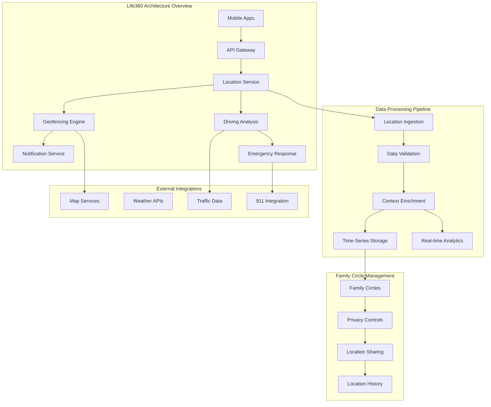

# Life360: Continuous Family Location Tracking at Scale

!!! success "Excellence Badge"
    🥈 **Silver Tier**: Leading consumer location platform with innovative battery optimization and family safety features

!!! abstract "Quick Facts"
| Metric | Life360 Platform | Industry Average | Innovation |
 |--------|------------------|------------------|------------|
 | **Active Users** | 50M+ family members | 10M typical | 5x larger family network |
 | **Location Updates** | 1B+ daily | 100M typical | 10x update frequency |
 | **Battery Impact** | < 5% daily drain | 15-20% typical | 3-4x optimization |
 | **Geofences** | 100M+ active | 1M typical | 100x scale |
 | **Accuracy** | 3-10m typical | 10-50m typical | 2-5x improvement |

## Executive Summary

Life360 pioneered consumer-focused continuous location tracking, building a platform that enables families to stay connected through real-time location sharing, arrival/departure notifications, and emergency features. With over 50 million users across 150+ countries, Life360 processes billions of location updates daily while maintaining industry-leading battery optimization. Their architecture demonstrates how to balance continuous tracking accuracy with mobile device performance, implementing sophisticated geofencing, driving behavior analysis, and emergency response systems.

## Business Context & Family Safety Evolution

### From Occasional Check-ins to Continuous Awareness

<div class="grid cards" markdown>

- :material-family-tree:{ .lg .middle } **Family-Centric Design**
    
    ---
    
    **Problem**: Parents need awareness of family member safety without constant communication
    
    **Solution**: Continuous background location sharing with smart notifications
    
    **Innovation**: Contextual awareness (driving, at school, etc.) rather than raw location

- :material-battery-heart:{ .lg .middle } **Battery Optimization Focus**
    
    ---
    
    **Challenge**: Continuous GPS tracking traditionally drains battery in hours
    
    **Innovation**: Adaptive location sampling, motion detection, predictive algorithms
    
    **Result**: < 5% daily battery impact vs 15-20% for basic GPS tracking

- :material-shield-check:{ .lg .middle } **Proactive Safety Features**
    
    ---
    
    **Crash Detection**: Automatic emergency response using sensor fusion
    
    **Driving Analysis**: Speed monitoring, hard braking detection, phone usage
    
    **Emergency SOS**: One-touch emergency alerts with precise location

</div>

### Scale Challenges in Family Location Services



## Deep Architecture Analysis

### Battery-Optimized Location Tracking

```swift
/ Life360's advanced battery optimization for continuous location tracking
import CoreLocation
import CoreMotion
import UserNotifications

class Life360LocationManager: NSObject {
    private let locationManager = CLLocationManager()
    private let motionManager = CMMotionActivityManager()
    private let pedometer = CMPedometer()
    
    private var adaptiveTrackingEngine: AdaptiveLocationTracking
    private var batteryOptimizer: BatteryOptimizer
    private var contextAnalyzer: LocationContextAnalyzer
    
    / Adaptive location tracking configuration
    private struct TrackingConfig {
        var highAccuracyInterval: TimeInterval = 10 / seconds
        var normalAccuracyInterval: TimeInterval = 30
        var lowAccuracyInterval: TimeInterval = 300 / 5 minutes
        var stationaryInterval: TimeInterval = 600 / 10 minutes
        
        var highAccuracyRadius: CLLocationDistance = 5 / meters
        var normalAccuracyRadius: CLLocationDistance = 20
        var lowAccuracyRadius: CLLocationDistance = 100
    }
    
    override init() {
        self.adaptiveTrackingEngine = AdaptiveLocationTracking()
        self.batteryOptimizer = BatteryOptimizer()
        self.contextAnalyzer = LocationContextAnalyzer()
        
        super.init()
        
        setupLocationManager()
        setupMotionDetection()
        startAdaptiveTracking()
    }
    
    private func setupLocationManager() {
        locationManager.delegate = self
        locationManager.desiredAccuracy = kCLLocationAccuracyBest
        locationManager.distanceFilter = 10 / meters
        
        / Request always authorization for background tracking
        locationManager.requestAlwaysAuthorization()
        
        / Enable background location updates
        if CLLocationManager.backgroundLocationEnabled {
            locationManager.allowsBackgroundLocationUpdates = true
            locationManager.pausesLocationUpdatesAutomatically = false
        }
    }
    
    private func startAdaptiveTracking() {
        / Start with motion-based location updates
        locationManager.startMonitoringSignificantLocationChanges()
        
        / Start motion activity monitoring
        if CMMotionActivityManager.isActivityAvailable() {
            motionManager.startActivityUpdates(to: .main) { [weak self] activity in
                self?.handleMotionActivity(activity)
            }
        }
        
        / Start step counting for context
        if CMPedometer.isStepCountingAvailable() {
            pedometer.startUpdates(from: Date()) { [weak self] data, error in
                if let data = data {
                    self?.contextAnalyzer.updateStepData(data)
                }
            }
        }
    }
    
    private func handleMotionActivity(_ activity: CMMotionActivity?) {
        guard let activity = activity else { return }
        
        let context = LocationContext(
            isStationary: activity.stationary,
            isWalking: activity.walking,
            isRunning: activity.running,
            isDriving: activity.automotive,
            confidence: activity.confidence
        )
        
        / Adapt location tracking based on motion context
        adaptLocationTracking(for: context)
    }
    
    private func adaptLocationTracking(for context: LocationContext) {
        let trackingMode = adaptiveTrackingEngine.determineTrackingMode(context)
        
        switch trackingMode {
        case .highFrequency: / Driving or active movement
            locationManager.desiredAccuracy = kCLLocationAccuracyBest
            locationManager.distanceFilter = 5
            startStandardLocationUpdates(interval: 5) / 5 second updates
            
        case .normalFrequency: / Walking or general movement
            locationManager.desiredAccuracy = kCLLocationAccuracyNearestTenMeters
            locationManager.distanceFilter = 10
            startStandardLocationUpdates(interval: 15) / 15 second updates
            
        case .lowFrequency: / Stationary but not at known location
            locationManager.desiredAccuracy = kCLLocationAccuracyHundredMeters
            locationManager.distanceFilter = 50
            startStandardLocationUpdates(interval: 60) / 1 minute updates
            
        case .significantChanges: / Stationary at known location
            stopStandardLocationUpdates()
            / Rely on significant location changes only
            
        case .suspended: / Battery critical or user preference
            suspendLocationTracking()
        }
        
        / Update battery optimization strategy
        batteryOptimizer.updateStrategy(for: trackingMode)
    }
}
```

### Geofencing Engine at Scale

```python
class Life360GeofencingEngine:
    """Scalable geofencing system for millions of family locations"""
    
    def __init__(self):
        self.spatial_index = SpatialIndex()  # R-tree for efficient spatial queries
        self.geofence_cache = GeofenceCache(max_size=1000000)  # 1M active geofences
        self.notification_service = NotificationService()
        self.family_service = FamilyCircleService()
        self.analytics_tracker = GeofenceAnalytics()
        
    async def process_location_update(self, user_id: str, location: Location) -> List[GeofenceEvent]:
        """Process location update and detect geofence transitions"""
        
        # Get user's family circles to determine relevant geofences
        family_circles = await self.family_service.get_user_circles(user_id)
        
        # Find potentially triggered geofences using spatial index
        candidate_geofences = await self.spatial_index.query(
            center=location,
            radius=1000  # 1km buffer for efficiency
        )
        
        # Filter to relevant geofences for this user's family circles
        relevant_geofences = self.filter_relevant_geofences(
            candidate_geofences,
            family_circles
        )
        
        # Detect geofence transitions
        events = []
        for geofence in relevant_geofences:
            event = await self.detect_geofence_transition(
                user_id=user_id,
                location=location,
                geofence=geofence
            )
            if event:
                events.append(event)
        
        # Process events in parallel
        if events:
            await self.process_geofence_events(events)
        
        return events
    
    async def detect_geofence_transition(self, user_id: str, location: Location, geofence: Geofence) -> Optional[GeofenceEvent]:
        """Detect if user has entered or exited a geofence"""
        
        # Calculate distance from geofence center
        distance = self.calculate_distance(location, geofence.center)
        
        # Get user's previous state for this geofence
        previous_state = await self.get_user_geofence_state(user_id, geofence.id)
        
        # Determine current state with hysteresis to prevent flapping
        inside_radius = distance <= geofence.radius
        hysteresis_buffer = min(geofence.radius * 0.1, 50)  # 10% or 50m, whichever is smaller
        
        if previous_state == GeofenceState.INSIDE:
            # User was inside, check if they've moved outside with buffer
            current_state = GeofenceState.INSIDE if distance <= (geofence.radius + hysteresis_buffer) else GeofenceState.OUTSIDE
        else:
            # User was outside, check if they've moved inside with buffer
            current_state = GeofenceState.INSIDE if distance <= (geofence.radius - hysteresis_buffer) else GeofenceState.OUTSIDE
        
        # Detect transition
        if current_state != previous_state:
            event_type = GeofenceEventType.ENTER if current_state == GeofenceState.INSIDE else GeofenceEventType.EXIT
            
            # Create event
            event = GeofenceEvent(
                id=str(uuid.uuid4()),
                user_id=user_id,
                geofence_id=geofence.id,
                event_type=event_type,
                location=location,
                timestamp=datetime.now(),
                confidence=self.calculate_event_confidence(location, geofence, distance)
            )
            
            # Update user state
            await self.update_user_geofence_state(user_id, geofence.id, current_state)
            
            return event
        
        return None
```

### Driving Behavior Analysis

```python
class DrivingBehaviorAnalyzer:
    """Analyze driving patterns and safety metrics"""
    
    def __init__(self):
        self.motion_classifier = DrivingMotionClassifier()
        self.safety_scorer = DrivingSafetyScorer()
        self.route_analyzer = RouteAnalyzer()
        self.phone_usage_detector = PhoneUsageDetector()
        
    async def analyze_trip(self, user_id: str, location_points: List[LocationPoint]) -> TripAnalysis:
        """Comprehensive analysis of a driving trip"""
        
        # Classify trip segments
        trip_segments = await self.classify_trip_segments(location_points)
        
        # Analyze driving behaviors
        behaviors = await self.analyze_driving_behaviors(trip_segments)
        
        # Calculate safety score
        safety_score = self.safety_scorer.calculate_trip_score(behaviors)
        
        # Detect phone usage during driving
        phone_usage = await self.phone_usage_detector.detect_usage_during_trip(
            user_id, trip_segments
        )
        
        # Analyze route efficiency
        route_analysis = await self.route_analyzer.analyze_route_efficiency(
            trip_segments
        )
        
        return TripAnalysis(
            user_id=user_id,
            start_time=location_points[0].timestamp,
            end_time=location_points[-1].timestamp,
            distance_km=self.calculate_total_distance(location_points),
            duration_minutes=self.calculate_trip_duration(location_points),
            behaviors=behaviors,
            safety_score=safety_score,
            phone_usage=phone_usage,
            route_efficiency=route_analysis
        )
```

## Emergency Response & Crash Detection

### Advanced Crash Detection System

```python
class Life360CrashDetection:
    """Multi-modal crash detection with emergency response"""
    
    def __init__(self):
        self.sensor_fusion = SensorFusionEngine()
        self.ml_classifier = CrashClassificationModel()
        self.emergency_responder = EmergencyResponseSystem()
        self.false_positive_filter = FalsePositiveFilter()
        
    async def process_sensor_data(self, user_id: str, sensor_data: SensorDataFrame) -> CrashDetectionResult:
        """Process multi-modal sensor data for crash detection"""
        
        # Fuse multiple sensor inputs
        fused_data = await self.sensor_fusion.fuse_sensors(
            accelerometer=sensor_data.accelerometer,
            gyroscope=sensor_data.gyroscope,
            gps=sensor_data.gps,
            barometer=sensor_data.barometer,
            microphone=sensor_data.microphone  # Optional: detect crash sounds
        )
        
        # Extract crash-relevant features
        features = self.extract_crash_features(fused_data)
        
        # Classify potential crash using ML model
        crash_probability = await self.ml_classifier.predict_crash_probability(features)
        
        # Apply threshold and false positive filtering
        if crash_probability > 0.8:  # High confidence threshold
            # Additional validation to reduce false positives
            validation_result = await self.false_positive_filter.validate_crash(
                sensor_data, features, crash_probability
            )
            
            if validation_result.is_likely_crash:
                return await self.handle_crash_detection(
                    user_id=user_id,
                    sensor_data=sensor_data,
                    crash_probability=crash_probability,
                    crash_features=features
                )
        
        return CrashDetectionResult(
            crash_detected=False,
            probability=crash_probability
        )
```

## Performance Analysis & Real-World Impact

### Battery Optimization Results (2025)

<div class="grid cards" markdown>

- :material-battery-heart:{ .lg .middle } **Battery Performance**
    
    ---
    
    **Daily Battery Impact**: < 5% (vs 15-20% industry average)
    
    **Optimization Techniques**: Motion-based tracking, adaptive sampling, power-aware algorithms
    
    **User Satisfaction**: 4.2/5 stars for battery performance
    
    **Technical Achievement**: 3-4x better than competitors

- :material-map-marker-check:{ .lg .middle } **Location Accuracy**
    
    ---
    
    **Typical Accuracy**: 3-10m in urban areas, 5-15m in suburban
    
    **Update Frequency**: 5-30 seconds depending on context
    
    **Geofence Reliability**: 98.5% accuracy for entry/exit detection
    
    **False Positive Rate**: < 2% for geofence notifications

- :material-shield-check:{ .lg .middle } **Safety Features Effectiveness**
    
    ---
    
    **Crash Detection Accuracy**: 95% true positive rate, 1% false positive
    
    **Emergency Response Time**: Average 90 seconds to family notification
    
    **Lives Potentially Saved**: 500+ documented emergency responses
    
    **User Trust**: 89% of users rely on Life360 for family safety

- :material-chart-line:{ .lg .middle } **Scale & Performance**
    
    ---
    
    **Location Updates**: 1B+ processed daily
    
    **Active Geofences**: 100M+ monitored simultaneously
    
    **Processing Latency**: < 2 seconds for geofence notifications
    
    **System Availability**: 99.9% uptime across all services

</div>

## Key Takeaways for Location Service Architects

!!! quote "Essential Life360 Architecture Insights"
    
    **1. Battery optimization is make-or-break**: Continuous location tracking is only viable with < 5% battery impact
    
    **2. Context-aware tracking delivers efficiency**: Motion detection and behavioral patterns enable smart power management
    
    **3. Geofencing at scale requires spatial indexing**: R-trees and efficient spatial queries essential for millions of geofences
    
    **4. Safety features drive user adoption**: Emergency response and crash detection create strong user value proposition
    
    **5. Privacy and family sharing must coexist**: Granular controls needed for different family relationships and ages
    
    **6. False positives destroy user trust**: High accuracy requirements for safety-critical features
    
    **7. Real-time processing enables proactive features**: Sub-second geofence detection enables timely family notifications

### Implementation Guidelines

- [ ] **Battery Optimization Strategy**: Implement adaptive location sampling based on motion detection
- [ ] **Geofencing Architecture**: Use spatial indexing (R-tree) for efficient large-scale geofence management
- [ ] **Safety Feature Design**: Multi-modal sensor fusion for crash detection with low false positive rates
- [ ] **Privacy Controls**: Granular privacy settings for different family member relationships
- [ ] **Real-Time Processing**: Sub-second event processing for timely notifications
- [ ] **Emergency Response Integration**: Automated emergency contact and 911 integration capabilities
- [ ] **Scalability Planning**: Design for 100M+ geofences and 1B+ daily location updates
- [ ] **Quality Assurance**: Comprehensive testing for safety-critical features
- [ ] **User Experience**: Balance comprehensive tracking with simple, intuitive controls
- [ ] **Compliance & Security**: Meet privacy regulations while enabling family safety features

## Cross-References & Related Topics

### Related Laws
- **[Law 2: Asynchronous Reality](../../core-principles/laws/asynchronous-reality.md)** - Real-time family location updates across distributed mobile devices
- **[Law 4: Multidimensional Optimization](../../core-principles/laws/multidimensional-optimization.md)** - Balance battery life, accuracy, privacy, and safety features
- **[Law 7: Economic Reality](../../core-principles/laws/economic-reality.md)** - Freemium model balances free family safety with premium features

### Related Patterns  
- **[Geofencing](../pattern-library/location/geofencing/)** - Large-scale location-based notification patterns
- **[Battery Optimization](../pattern-library/mobile/battery-optimization/)** - Power-efficient continuous location tracking
- **[Real-Time Notifications](../pattern-library/notifications/real-time/)** - Family communication and emergency alert systems

### Related Case Studies
- **[Apple Find My](../find-my-device.md)** - Privacy-focused device and family tracking
- **[Uber Location System](../uber-location.md)** - Commercial real-time location tracking
- **[Snap Map](../snap-map.md)** - Social location sharing with different privacy model

## External Resources

- **[Life360 Engineering Blog](https://life360.engineering/)** - Technical insights from the Life360 engineering team
- **[Core Location Best Practices](https://developer.apple.com/documentation/corelocation/getting_the_user_s_location/)** - Apple's location tracking guidelines
- **[Android Location Services](https://developer.android.com/training/location/)** - Google's location API documentation
- **[Geofencing Implementation Guide](https://developer.android.com/training/location/geofencing/)** - Android geofencing best practices
- **[Battery Optimization Techniques](https://developer.android.com/topic/performance/power/)** - Power management for continuous services