# 📍 Proximity Service Design (Yelp/Google Places)

**The Challenge**: Find millions of points of interest near any location with <100ms latency at global scale

!!! info "Case Study Overview"
    **System**: Location-based service for finding nearby points of interest  
    **Scale**: 100M+ locations, 1B+ queries/day, sub-second response  
    **Challenges**: Spatial indexing, real-time updates, global scale, accuracy  
    **Key Patterns**: Geohashing, quadtree, R-tree, sharding by geography  
    **Sources**: Yelp Engineering¹, Google S2 Geometry², Uber H3³, MongoDB Geospatial⁴, PostGIS⁵

## Introduction

Proximity services power "restaurants near me" to ride-sharing pickups, querying millions of geographic points instantly. Key challenges: spatial indexing, real-world geography irregularity, sub-second global queries. Systems balance mathematical precision with practical performance.

## Architecture Evolution

### Phase 1: Simple Database Queries (2004-2007)

```sql
-- Original naive approach
SELECT * FROM businesses 
WHERE latitude BETWEEN :lat - 0.1 AND :lat + 0.1
  AND longitude BETWEEN :lng - 0.1 AND :lng + 0.1
ORDER BY distance(latitude, longitude, :lat, :lng)
LIMIT 20;
```

**Problems**: Full table scans, inaccurate bounds, no radius support, >5s queries
**Missing**: Spatial indexing, query optimization, caching

### Phase 2: Basic Geospatial Indexing (2007-2010)


**Key Decision**: PostGIS with R-tree spatial indices
**Result**: 100x speedup (5s → 50ms for dense areas¹)
**Pattern**: R-tree Index

### Phase 3: Distributed Geospatial System (2010-2015)


**Innovation**: Hybrid Spatial Indexing²
- QuadTree: dense urban areas
- Geohash: sparse regions  
- S2 cells: uniform global coverage
- Hilbert curves: preserve locality

**Patterns**: QuadTree, Geohashing, State/Work Distribution

### Phase 4: Modern Real-time Architecture (2015-Present)

## Part 1: Concept Map - The Physics of Space and Time

### Law 2: Asynchronous Reality - The Speed of Location
Queries must feel instantaneous (<200ms).


**Latency Optimization Strategies:**

| Component | Typical Latency | Optimization | Improved Latency |
|-----------|----------------|--------------|------------------|
| GPS Acquisition | 30-3000ms | Last known location cache | 0ms (cached) |
| Geocoding | 50-200ms | Local geocoding cache | 10-20ms |
| Spatial Query | 100-500ms | Geohash indexing | 10-50ms |
| Result Ranking | 50-100ms | Pre-computed scores | 10-20ms |
| Network RTT | 20-100ms | Edge servers | 5-20ms |


**Query Path**: User → Edge (5-10ms) → Regional (20-30ms) → Global (100ms+)

### Law 4: Trade-offs - The Curse of Dimensionality
Spatial data grows quadratically with area, linearly with density.

```mermaid
graph TB
    subgraph "Spatial Data Growth"
        WORLD[World<br/>510M km²] --> CONTINENT[Continents<br/>~50M km² each]
        CONTINENT --> COUNTRY[Countries<br/>~10M km²]
        COUNTRY --> CITY[Cities<br/>~1000 km²]
        CITY --> BLOCK[City Blocks<br/>~0.01 km²]
        
        WORLD -.->|"~100M POIs"| STORAGE1[1TB metadata]
        CITY -.->|"~100K POIs"| STORAGE2[1GB per city]
        BLOCK -.->|"~100 POIs"| STORAGE3[1MB per block]
    end
```



**Capacity Planning Model:**

| Data Type | Size per POI | 100M POIs | Growth Rate |
|-----------|--------------|-----------|-------------|
| Basic Metadata | 1 KB | 100 GB | +20% YoY |
| Rich Attributes | 10 KB | 1 TB | +30% YoY |
| Images | 1 MB | 100 TB | +50% YoY |
| Reviews/Ratings | 100 KB | 10 TB | +40% YoY |
| Spatial Indices | 100 B | 10 GB | +20% YoY |


**Spatial Indexing Structures:**


### Law 1: Failure - Location Service Availability
Handle failures gracefully without incorrect locations.


**Failure Recovery Strategies:**

| Failure Type | Detection Time | Recovery Strategy | Data Loss |
|--------------|---------------|-------------------|-----------|
| GPS Signal Lost | Immediate | Cell tower triangulation | None (degraded accuracy) |
| Index Node Crash | < 10s | Failover to replica | None |
| Data Corruption | Minutes | Rebuild from WAL | Minimal |
| Region Outage | < 30s | Cross-region failover | None |
| Split Brain | < 60s | Quorum resolution | Possible conflicts |


### Law 3: Emergence - Parallel Spatial Queries
Millions of concurrent queries require parallelization.

```mermaid
graph TB
    subgraph "Concurrent Query Processing"
        QUERY[Location Query] --> ROUTER[Geo Router]
        
        ROUTER --> SHARD1[Shard 1<br/>0°-90° lon]
        ROUTER --> SHARD2[Shard 2<br/>90°-180° lon]
        ROUTER --> SHARD3[Shard 3<br/>-90°-0° lon]
        ROUTER --> SHARD4[Shard 4<br/>-180°--90° lon]
        
        SHARD1 & SHARD2 & SHARD3 & SHARD4 --> MERGE[Result Merger]
        MERGE --> RANK[Parallel Ranker]
    end
```



**Concurrency Patterns:**

| Pattern | Use Case | Throughput Impact |
|---------|----------|-------------------|
| Spatial Sharding | Distribute by geography | 10x improvement |
| Read Replicas | Scale read queries | 5x per replica |
| Caching Layer | Repeated queries | 100x for hits |
| Batch Processing | Bulk geocoding | 20x efficiency |
| Async Updates | Location updates | 10x write throughput |


### Law 4: Trade-offs - Global Consistency

Maintaining consistent location data across regions while handling updates.


**Consistency Models by Use Case:**

| Use Case | Consistency Model | Max Staleness | Conflict Resolution |
|----------|------------------|---------------|-------------------|
| Restaurant Locations | Eventually Consistent | 5 minutes | Last Write Wins |
| Delivery Driver Location | Near Real-time | 5 seconds | Latest GPS Wins |
| Store Hours | Eventually Consistent | 1 hour | Manual Merge |
| Emergency Services | Strong Consistency | 0 seconds | Primary Region |
| User Location History | Causal Consistency | 1 minute | Vector Clocks |


### Law 5: Epistemology - Location Service Monitoring

Understanding system behavior through comprehensive monitoring.


**Key Metrics:**

| Metric Category | Examples | Alert Thresholds |
|----------------|----------|------------------|
| Query Performance | Latency p50/p95/p99 | p99 > 200ms |
| Accuracy | GPS precision, Geocoding errors | Error rate > 1% |
| Availability | Uptime, Failed queries | < 99.9% |
| Data Quality | Missing POIs, Outdated info | Staleness > 7 days |
| Capacity | Index size, Query volume | > 80% capacity |


### Law 6: Human-API - Intuitive Location UX

Making geographic queries feel natural and intuitive for users.


**UX Optimization Strategies:**

| Feature | Implementation | User Benefit |
|---------|---------------|--------------|
| Auto-complete | Prefix matching + ML | Faster input |
| Fuzzy Matching | Edit distance algorithms | Typo tolerance |
| Smart Defaults | "Near me" = current location | Less input needed |
| Visual Feedback | Loading indicators, animations | Perceived speed |
| Offline Mode | Cached nearby data | Works everywhere |


### Law 7: Economics - Balancing Cost and Coverage

Optimizing the trade-off between global coverage and operational costs.


**Cost Optimization Strategies:**

| Strategy | Implementation | Cost Savings |
|----------|---------------|--------------|
| Data Compression | Geohash clustering | 60% storage |
| Tiered Storage | Hot/cold regions | 70% storage cost |
| Query Caching | Popular locations | 80% compute |
| Selective Loading | On-demand regions | 50% memory |
| CDN Distribution | Edge caching | 60% bandwidth |


## Part 2: Comprehensive Law Analysis Matrix

Understanding how each design decision maps to fundamental laws helps reveal the true trade-offs in building proximity services.

### Law Mapping for Core Design Decisions

| Design Decision | Law 2: Asynchronous Reality ⏳ | Law 4: Trade-offs ⚖️ | Law 1: Failure ⛓️ | Law 3: Emergence 🌪️ | Law 4: Trade-offs ⚖️ | Law 5: Epistemology 🧠 | Law 6: Human-API 🤯 | Law 7: Economics 💰 |
|----------------|------------------|-------------------|------------------|---------------------|---------------------|---------------------|------------------------|-------------------|
| **Geohash Indexing** | ✅ O(1) prefix lookup<br/>Fast range queries | ⚠️ Fixed grid size<br/>Boundary inefficiencies | ✅ Simple recovery<br/>Stateless design | ✅ Natural sharding<br/>No locks needed | ✅ Simple consistency<br/>Location-based partitions | ✅ Easy to monitor<br/>Clear performance metrics | ⚠️ Grid boundaries<br/>Non-intuitive for users | ✅ Low compute cost<br/>Efficient storage |
| **Edge Caching** | ✅ Sub-10ms response<br/>Local data access | ⚠️ Storage duplication<br/>Cache coherency | ✅ Graceful degradation<br/>Multiple fallbacks | ⚠️ Cache stampedes<br/>Update conflicts | ⚠️ Eventual consistency<br/>Stale data risk | ✅ Cache hit rates<br/>Clear metrics | ✅ Instant results<br/>Better UX | ⚠️ Higher infrastructure<br/>Multiple locations |
| **Read Replicas** | ✅ Distributed reads<br/>Lower latency | ⚠️ Storage multiplication<br/>Sync overhead | ✅ High availability<br/>Automatic failover | ✅ Read scaling<br/>No write conflicts | ⚠️ Replication lag<br/>Consistency challenges | ✅ Lag monitoring<br/>Health checks | ✅ Always available<br/>No downtime | ⚠️ Linear cost increase<br/>More instances |
| **Spatial Sharding** | ✅ Local queries fast<br/>Data locality | ✅ Even distribution<br/>Predictable growth | ✅ Independent failures<br/>Blast radius limited | ✅ Parallel queries<br/>No contention | ⚠️ Cross-shard queries<br/>Complex boundaries | ✅ Per-shard metrics<br/>Clear ownership | ✅ Regional results<br/>Intuitive model | ✅ Efficient scaling<br/>Pay per region |
| **ML Prefetching** | ✅ Predictive caching<br/>0ms for hits | ⚠️ Speculative storage<br/>Wasted predictions | ✅ Fallback to direct<br/>Non-critical path | ✅ Async training<br/>No query blocking | ✅ Model consistency<br/>Version control | ⚠️ Complex metrics<br/>Prediction accuracy | ✅ Feels instant<br/>Anticipates needs | ⚠️ Training costs<br/>GPU requirements |


### Detailed Law Impact Analysis


### Architecture Decision Framework

| Architecture Choice | Primary Law Driver | Secondary Impacts | Trade-off Analysis |
|-------------------|-------------------|------------------|-------------------|
| **Geohash vs R-tree** | Latency (simple lookups) | Capacity (storage efficiency) | Geohash wins for point queries but loses for complex polygons |
| **Sync vs Async Updates** | Concurrency (write throughput) | Consistency (data freshness) | Async enables scale but adds complexity |
| **Regional vs Global Index** | Latency (query locality) | Coordination (consistency) | Regional faster but cross-region queries suffer |
| **Hot vs Cold Tiering** | Economics (storage cost) | Latency (access time) | 80% cost savings worth 10x latency for cold data |


**Current Capabilities**:
- 100M+ POIs globally
- 1B+ proximity queries/day
- <50ms P99 latency
- Real-time updates

## Core Components Deep Dive

### 1. Spatial Indexing Systems

```python
class HexagonalGrid:
    """H3 hexagonal hierarchical spatial indexing"""
    
    def __init__(self):
        self.resolutions = list(range(16))  # 0 (largest) to 15 (smallest)
        self.avg_hex_area_km2 = {
            0: 4250546.8,      # Continental scale
            1: 607220.9,       # Large region
            2: 86745.8,        # Metropolitan area
            3: 12392.3,        # City
            4: 1770.3,         # Borough
            5: 252.9,          # Neighborhood
            6: 36.1,           # City block
            7: 5.2,            # Large building
            8: 0.74,           # Building
            9: 0.11,           # Floor
            10: 0.015,         # Room
            11: 0.002,         # Desk
            12: 0.0003,        # Square meter
            13: 0.00004,       # Square foot
            14: 0.000006,      # Square inch
            15: 0.0000009      # Square centimeter
        }
        
    def point_to_h3(self, lat: float, lng: float, resolution: int) -> str:
        """Convert lat/lng to H3 index at given resolution"""
# Convert to radians
        lat_rad = math.radians(lat)
        lng_rad = math.radians(lng)
        
# H3 uses a gnomonic projection centered at each face
# This is a simplified version
        h3_index = self._lat_lng_to_h3_internal(lat_rad, lng_rad, resolution)
        
        return h3_index
    
    def get_neighbors(self, h3_index: str, k_ring: int = 1) -> List[str]:
        """Get all hexagons within k rings"""
        neighbors = set()
        
# Start with center hexagon
        current_ring = {h3_index}
        neighbors.add(h3_index)
        
# Expand k rings
        for _ in range(k_ring):
            next_ring = set()
            for hex_id in current_ring:
# Get 6 immediate neighbors
                for neighbor in self._get_immediate_neighbors(hex_id):
                    if neighbor not in neighbors:
                        next_ring.add(neighbor)
                        neighbors.add(neighbor)
            current_ring = next_ring
            
        return list(neighbors)
    
    def optimize_coverage(self, points: List[Tuple[float, float]], 
                         min_resolution: int = 5,
                         max_resolution: int = 9) -> Dict[str, List[str]]:
        """Find optimal hex coverage for point set"""
        coverage = {}
        
        for resolution in range(min_resolution, max_resolution + 1):
            hexagons = set()
            
            for lat, lng in points:
                h3_index = self.point_to_h3(lat, lng, resolution)
                hexagons.add(h3_index)
            
# Calculate coverage efficiency
            area_covered = len(hexagons) * self.avg_hex_area_km2[resolution]
            points_per_hex = len(points) / len(hexagons)
            
            coverage[f"res_{resolution}"] = {
                'hexagons': list(hexagons),
                'count': len(hexagons),
                'area_km2': area_covered,
                'density': points_per_hex
            }
            
        return coverage

class QuadTreeIndex:
    """QuadTree for efficient spatial queries"""
    
    def __init__(self, boundary: Rectangle, capacity: int = 4):
        self.boundary = boundary
        self.capacity = capacity
        self.points = []
        self.divided = False
        self.northeast = None
        self.northwest = None
        self.southeast = None
        self.southwest = None
        
    def insert(self, point: Point) -> bool:
        """Insert a point into the quadtree"""
# Check if point is within boundary
        if not self.boundary.contains(point):
            return False
            
# If capacity not reached and not divided
        if len(self.points) < self.capacity and not self.divided:
            self.points.append(point)
            return True
            
# Need to subdivide
        if not self.divided:
            self._subdivide()
            
# Try inserting into children
        return (self.northeast.insert(point) or
                self.northwest.insert(point) or
                self.southeast.insert(point) or
                self.southwest.insert(point))
    
    def query_range(self, search_range: Circle) -> List[Point]:
        """Find all points within search range"""
        found_points = []
        
# Check if search range intersects this quad
        if not self.boundary.intersects_circle(search_range):
            return found_points
            
# Check points at this level
        for point in self.points:
            if search_range.contains(point):
                found_points.append(point)
                
# If subdivided, check children
        if self.divided:
            found_points.extend(self.northeast.query_range(search_range))
            found_points.extend(self.northwest.query_range(search_range))
            found_points.extend(self.southeast.query_range(search_range))
            found_points.extend(self.southwest.query_range(search_range))
            
        return found_points

class S2CellIndex:
    """Google S2 geometry library for spatial indexing"""
    
    def __init__(self):
        self.level_stats = {
# level: (avg_area_km2, avg_edge_km, num_cells)
            0: (85011012.19, 7842.0, 6),
            5: (517.31, 40.7, 98304),
            10: (1.99, 1.4, 25165824),
            15: (0.008, 0.09, 6442450944),
            20: (0.00003, 0.005, 1649267441664),
            25: (0.0000001, 0.0003, 422212465065984),
            30: (0.0000000004, 0.00002, 108086391056891904)
        }
        
    def point_to_cell_id(self, lat: float, lng: float, level: int) -> int:
        """Convert lat/lng to S2 cell ID at given level"""
# Convert to unit sphere coordinates
        phi = math.radians(lat)
        theta = math.radians(lng)
        
# Convert to Cartesian coordinates
        x = math.cos(phi) * math.cos(theta)
        y = math.cos(phi) * math.sin(theta)
        z = math.sin(phi)
        
# Project onto cube face and get cell ID
        face, u, v = self._xyz_to_face_uv(x, y, z)
        cell_id = self._face_uv_to_cell_id(face, u, v, level)
        
        return cell_id
    
    def get_covering(self, region: Polygon, 
                    min_level: int = 8,
                    max_level: int = 12,
                    max_cells: int = 100) -> List[int]:
        """Get S2 cells covering a region"""
        covering = []
        
# Start with coarse cells
        candidates = self._get_initial_candidates(region, min_level)
        
        while candidates and len(covering) < max_cells:
            cell = candidates.pop(0)
            
# Check if cell intersects region
            if self._cell_intersects_region(cell, region):
# Check if we should subdivide
                if cell.level < max_level and self._should_subdivide(cell, region):
# Add children to candidates
                    for child in self._get_children(cell):
                        candidates.append(child)
                else:
# Add to covering
                    covering.append(cell.id)
                    
        return covering
```

### 2. Proximity Query Engine

```python
class ProximityQueryEngine:
    """High-performance proximity query processing"""
    
    def __init__(self):
        self.spatial_indices = {
            'h3': H3Index(),
            's2': S2Index(),
            'quadtree': QuadTreeIndex(),
            'rtree': RTreeIndex()
        }
        self.cache = ProximityCache()
        self.ranker = ProximityRanker()
        
    async def find_nearby(self, lat: float, lng: float,
                         radius_m: int = 1000,
                         category: str = None,
                         limit: int = 20) -> List[POI]:
        """Find nearby points of interest"""
# 1. Check cache
        cache_key = self._generate_cache_key(lat, lng, radius_m, category)
        cached = await self.cache.get(cache_key)
        if cached:
            return cached
            
# 2. Choose optimal index
        index_type = self._select_index(radius_m, category)
        
# 3. Query spatial index
        candidates = await self._query_spatial_index(
            index_type, lat, lng, radius_m
        )
        
# 4. Apply filters
        filtered = self._apply_filters(candidates, category)
        
# 5. Calculate exact distances
        with_distances = self._calculate_distances(filtered, lat, lng)
        
# 6. Rank results
        ranked = await self.ranker.rank(
            with_distances,
            user_lat=lat,
            user_lng=lng,
            query_category=category
        )
        
# 7. Apply limit
        results = ranked[:limit]
        
# 8. Cache results
        await self.cache.set(cache_key, results, ttl=300)
        
        return results
    
    def _select_index(self, radius_m: int, category: str) -> str:
        """Select optimal spatial index based on query"""
        if radius_m < 500:
# Small radius - use H3 for precision
            return 'h3'
        elif radius_m < 5000:
# Medium radius - use S2 for efficiency
            return 's2'
        elif category and self._is_sparse_category(category):
# Sparse category - use R-tree
            return 'rtree'
        else:
# Large radius or dense - use QuadTree
            return 'quadtree'
    
    async def _query_spatial_index(self, index_type: str,
                                  lat: float, lng: float,
                                  radius_m: int) -> List[POI]:
        """Query the selected spatial index"""
        index = self.spatial_indices[index_type]
        
        if index_type == 'h3':
# Convert radius to hex rings
            resolution = self._radius_to_h3_resolution(radius_m)
            center_hex = index.point_to_h3(lat, lng, resolution)
            k_ring = self._radius_to_k_ring(radius_m, resolution)
            
# Get all hexagons in range
            hexagons = index.get_neighbors(center_hex, k_ring)
            
# Fetch POIs from hexagons
            return await self._fetch_pois_from_hexagons(hexagons)
            
        elif index_type == 's2':
# Create S2 cap for radius query
            level = self._radius_to_s2_level(radius_m)
            center_cell = index.point_to_cell_id(lat, lng, level)
            
# Get covering cells
            covering = index.get_covering_for_cap(
                lat, lng, radius_m, min_level=level-2, max_level=level+2
            )
            
            return await self._fetch_pois_from_s2_cells(covering)

class ProximityRanker:
    """ML-based ranking for proximity results"""
    
    def __init__(self):
        self.feature_extractor = FeatureExtractor()
        self.model = self._load_ranking_model()
        
    async def rank(self, pois: List[POI], **context) -> List[POI]:
        """Rank POIs based on relevance"""
# Extract features for each POI
        features = []
        for poi in pois:
            feature_vector = self.feature_extractor.extract(
                poi=poi,
                user_lat=context['user_lat'],
                user_lng=context['user_lng'],
                time=datetime.now(),
                query_category=context.get('query_category')
            )
            features.append(feature_vector)
            
# Get model predictions
        scores = self.model.predict(features)
        
# Combine with business logic
        final_scores = []
        for i, poi in enumerate(pois):
            score = self._combine_scores(
                ml_score=scores[i],
                distance_score=self._distance_score(poi.distance),
                popularity_score=poi.popularity,
                rating_score=poi.rating,
                open_now_boost=1.5 if poi.is_open else 1.0
            )
            final_scores.append((score, poi))
            
# Sort by score
        final_scores.sort(key=lambda x: x[0], reverse=True)
        
        return [poi for _, poi in final_scores]
```

### 3. Real-time Updates

```python
class RealTimeLocationUpdater:
    """Handle real-time POI updates"""
    
    def __init__(self):
        self.update_queue = asyncio.Queue()
        self.batch_size = 100
        self.batch_interval = 1.0  # seconds
        
    async def update_location(self, poi_id: str, 
                            new_lat: float, new_lng: float):
        """Update POI location in real-time"""
        update = LocationUpdate(
            poi_id=poi_id,
            old_location=await self._get_current_location(poi_id),
            new_location=Location(new_lat, new_lng),
            timestamp=datetime.now()
        )
        
        await self.update_queue.put(update)
        
    async def process_updates(self):
        """Batch process location updates"""
        batch = []
        last_process = time.time()
        
        while True:
            try:
# Get update with timeout
                update = await asyncio.wait_for(
                    self.update_queue.get(),
                    timeout=self.batch_interval
                )
                batch.append(update)
                
# Process if batch full
                if len(batch) >= self.batch_size:
                    await self._process_batch(batch)
                    batch = []
                    last_process = time.time()
                    
            except asyncio.TimeoutError:
# Process whatever we have
                if batch and time.time() - last_process >= self.batch_interval:
                    await self._process_batch(batch)
                    batch = []
                    last_process = time.time()
    
    async def _process_batch(self, updates: List[LocationUpdate]):
        """Process a batch of updates efficiently"""
# Group by spatial index updates needed
        index_updates = defaultdict(list)
        
        for update in updates:
# Determine which indices need updating
            old_cells = self._get_affected_cells(update.old_location)
            new_cells = self._get_affected_cells(update.new_location)
            
# Calculate index operations
            to_remove = old_cells - new_cells
            to_add = new_cells - old_cells
            
            for cell in to_remove:
                index_updates[cell].append(('remove', update.poi_id))
            for cell in to_add:
                index_updates[cell].append(('add', update.poi_id))
                
# Apply updates in parallel
        tasks = []
        for cell, operations in index_updates.items():
            task = self._update_cell_index(cell, operations)
            tasks.append(task)
            
        await asyncio.gather(*tasks)
        
# Invalidate affected caches
        await self._invalidate_caches(updates)
```

### 4. Geospatial Aggregation

```python
class GeospatialAggregator:
    """Aggregate POIs for heatmaps and analytics"""
    
    def __init__(self):
        self.aggregation_levels = {
            'city': 7,      # H3 resolution 7
            'district': 8,  # H3 resolution 8
            'block': 9,     # H3 resolution 9
            'building': 10  # H3 resolution 10
        }
        
    async def generate_heatmap(self, category: str,
                              bounds: BoundingBox,
                              level: str = 'district') -> HeatmapData:
        """Generate POI density heatmap"""
        resolution = self.aggregation_levels[level]
        
# Get all hexagons in bounds
        hexagons = self._get_hexagons_in_bounds(bounds, resolution)
        
# Count POIs per hexagon
        hex_counts = {}
        for hex_id in hexagons:
            count = await self._count_pois_in_hexagon(
                hex_id, 
                category=category
            )
            if count > 0:
                hex_counts[hex_id] = count
                
# Normalize for visualization
        max_count = max(hex_counts.values()) if hex_counts else 1
        
        heatmap_data = []
        for hex_id, count in hex_counts.items():
            center = self._get_hexagon_center(hex_id)
            heatmap_data.append({
                'lat': center.lat,
                'lng': center.lng,
                'intensity': count / max_count,
                'count': count,
                'hex_id': hex_id
            })
            
        return HeatmapData(
            level=level,
            resolution=resolution,
            data=heatmap_data,
            bounds=bounds,
            generated_at=datetime.now()
        )

class SpatialAnalytics:
    """Advanced spatial analytics for business insights"""
    
    def __init__(self):
        self.analyzer = SpatialAnalyzer()
        
    async def analyze_competitor_density(self, poi: POI,
                                       radius_m: int = 1000) -> CompetitorAnalysis:
        """Analyze competitor density around a POI"""
# Find competitors in radius
        competitors = await self.find_competitors(
            poi.location,
            poi.category,
            radius_m
        )
        
# Calculate metrics
        analysis = CompetitorAnalysis(
            poi_id=poi.id,
            competitor_count=len(competitors),
            avg_distance=np.mean([c.distance for c in competitors]),
            avg_rating=np.mean([c.rating for c in competitors]),
            market_share=self._estimate_market_share(poi, competitors),
            saturation_index=self._calculate_saturation(
                len(competitors),
                radius_m,
                poi.category
            )
        )
        
        return analysis
```

## Law Mapping & Design Decisions

### Comprehensive Design Decision Matrix

| Design Decision | Law 2<br/>⏳ Async Reality | Law 4<br/>⚖️ Optimization | Law 1<br/>⛓️ Failure | Law 3<br/>🌪️ Chaos | Law 4<br/>⚖️ Optimization | Law 5<br/>🧠 Knowledge | Law 6<br/>🤯 Cognitive | Law 7<br/>💰 Economics |
|----------------|----------|----------|---------|-------------|--------------|---------------|-------|-----------|
| **H3 Hexagonal Grid** | ✅ O(1) lookups | ✅ Fixed-size cells | ✅ Redundant indices | ✅ Parallel queries | ✅ No overlap | ✅ Clear boundaries | ✅ Intuitive regions | ✅ Efficient coverage |
| **Multi-Index Strategy** | ✅ Query optimization | ✅ Memory vs disk | ✅ Fallback indices | ✅ Index selection | ✅ Consistency protocol | ✅ Index performance | ⚪ | ✅ Storage trade-offs |
| **Proximity Caching** | ✅ <10ms cache hits | ✅ LRU eviction | ✅ Cache aside pattern | ⚪ | ✅ TTL management | ✅ Hit rate metrics | ✅ Instant results | ✅ Reduced compute |
| **Real-time Updates** | ✅ Live locations | ✅ Batch processing | ✅ Eventually consistent | ✅ Queue processing | ✅ Update ordering | ✅ Lag monitoring | ✅ Fresh data | ⚪ |
| **Edge Computing** | ✅ Local queries | ✅ Distributed load | ✅ Regional failover | ✅ Edge parallelism | ✅ Sync protocol | ✅ Edge metrics | ✅ Low latency | ✅ Bandwidth savings |
| **ML Ranking** | ⚪ Inference time | ✅ Model caching | ✅ Fallback scoring | ✅ Batch inference | ⚪ | ✅ Relevance metrics | ✅ Personalization | ✅ Business value |
| **Spatial Sharding** | ✅ Localized queries | ✅ Geographic split | ✅ Shard isolation | ✅ Parallel shards | ✅ Shard boundaries | ✅ Shard balance | ⚪ | ✅ Linear scaling |
| **Hybrid Indices** | ✅ Optimal per query | ✅ Space efficiency | ✅ Multiple options | ✅ Index parallelism | ✅ Index selection | ✅ Query patterns | ✅ Best performance | ✅ Resource optimization |


**Legend**: ✅ Primary impact | ⚪ Secondary/No impact

## Alternative Architectures

### Alternative 1: Single Global R-Tree


**Trade-offs**:
- Simple implementation
- Exact nearest neighbor
- Well-understood algorithm
- Memory limitations
- Slow updates
- No sharding support

### Alternative 2: Pure Geohash System

```mermaid
graph TB
    subgraph "Geohash Architecture"
        CLIENT[Client]
        API[API Layer]
        
        subgraph "Geohash Levels"
            L1[Level 1<br/>~5000km]
            L2[Level 2<br/>~1250km]
            L3[Level 3<br/>~156km]
            L4[Level 4<br/>~39km]
            L5[Level 5<br/>~4.9km]
        end
        
        KV[(Key-Value Store<br/>Geohash → POIs)]
        
        CLIENT --> API
        API --> L1 & L2 & L3 & L4 & L5
        L5 --> KV
    end
    
    style L5 fill:#4ecdc4
```



**Trade-offs**:
- Simple prefix queries
- Natural sharding
- String-based operations
- Edge case issues
- Non-uniform cell sizes
- Boundary problems

### Alternative 3: Graph-Based Approach


**Trade-offs**:
- Natural relationships
- Complex queries
- Path finding
- High memory usage
- Slow spatial queries
- Complex updates

### Alternative 4: ML-First Architecture


**Trade-offs**:
- Semantic similarity
- Complex features
- Personalization
- Black box results
- Training complexity
- Explainability issues

## Performance Optimization

### Query Optimization Strategies

```python
class QueryOptimizer:
    """Optimize proximity queries for performance"""
    
    def __init__(self):
        self.query_planner = QueryPlanner()
        self.cost_estimator = CostEstimator()
        
    async def optimize_query(self, query: ProximityQuery) -> ExecutionPlan:
        """Generate optimal execution plan"""
# 1. Analyze query characteristics
        analysis = self._analyze_query(query)
        
# 2. Generate candidate plans
        plans = []
        
# Plan A: Use H3 index
        if analysis.radius_m < 5000:
            h3_plan = self._generate_h3_plan(query, analysis)
            plans.append(h3_plan)
            
# Plan B: Use S2 index
        s2_plan = self._generate_s2_plan(query, analysis)
        plans.append(s2_plan)
        
# Plan C: Use QuadTree
        if analysis.expected_results > 100:
            quad_plan = self._generate_quadtree_plan(query, analysis)
            plans.append(quad_plan)
            
# 3. Estimate costs
        for plan in plans:
            plan.estimated_cost = await self.cost_estimator.estimate(plan)
            
# 4. Choose best plan
        best_plan = min(plans, key=lambda p: p.estimated_cost)
        
# 5. Add optimizations
        if analysis.is_popular_query:
            best_plan = self._add_caching(best_plan)
            
        if analysis.is_dense_area:
            best_plan = self._add_sampling(best_plan)
            
        return best_plan

class SpatialCacheWarmer:
    """Pre-warm caches for popular queries"""
    
    def __init__(self):
        self.popular_locations = []
        self.cache_refresh_interval = 300  # 5 minutes
        
    async def identify_hot_spots(self) -> List[Location]:
        """Identify frequently queried locations"""
# Analyze query logs
        query_counts = await self._get_query_counts_by_location()
        
# Find hot spots using DBSCAN clustering
        hot_spots = []
        clusters = DBSCAN(eps=0.01, min_samples=10).fit(
            [[loc.lat, loc.lng] for loc, _ in query_counts]
        )
        
        for cluster_id in set(clusters.labels_):
            if cluster_id == -1:  # Noise
                continue
                
            cluster_points = [
                (loc, count) 
                for (loc, count), label in zip(query_counts, clusters.labels_)
                if label == cluster_id
            ]
            
# Get cluster center weighted by query count
            center = self._weighted_center(cluster_points)
            hot_spots.append(center)
            
        return hot_spots
    
    async def warm_caches(self):
        """Pre-compute results for hot spots"""
        hot_spots = await self.identify_hot_spots()
        
# Common radius values
        radii = [500, 1000, 2000, 5000]
        
# Popular categories
        categories = ['restaurant', 'coffee', 'gas_station', 'atm']
        
# Pre-compute all combinations
        tasks = []
        for location in hot_spots:
            for radius in radii:
                for category in categories:
                    task = self._warm_single_query(
                        location.lat,
                        location.lng,
                        radius,
                        category
                    )
                    tasks.append(task)
                    
        await asyncio.gather(*tasks)
```

## Failure Scenarios & Recovery

### Common Failure Modes

1. **Index Corruption**
   ```python
   class IndexRecovery:
       async def recover_corrupted_index(self, index_type: str):
# 1. Mark index as unavailable
           await self.mark_index_status(index_type, 'rebuilding')
           
# 2. Switch to backup index
           await self.route_to_backup(index_type)
           
# 3. Rebuild from source of truth
           await self.rebuild_index_from_database(index_type)
           
# 4. Validate rebuilt index
           if await self.validate_index(index_type):
               await self.mark_index_status(index_type, 'active')
   ```

2. **Geographic Partition**
   ```python
   class GeoPartitionHandler:
       async def handle_region_outage(self, affected_region: str):
# 1. Identify affected shards
           affected_shards = self.get_shards_for_region(affected_region)
           
# 2. Redirect to nearby regions
           for shard in affected_shards:
               backup_shard = self.find_closest_backup(shard)
               await self.redirect_traffic(shard, backup_shard)
   ```

3. **Query Storm**
   ```python
   class QueryStormMitigation:
       async def handle_query_storm(self, location: Location):
# 1. Enable aggressive caching
           await self.cache.set_ttl(location, ttl=3600)
           
# 2. Reduce result precision
           await self.enable_approximate_mode(location)
           
# 3. Rate limit by client
           await self.rate_limiter.enable_strict_mode()
   ```

## Key Design Insights

### 1. 🗺 **No Single Spatial Index Rules All**
- H3 excels at uniform coverage
- QuadTree better for dense urban areas
- R-Tree optimal for complex polygons
- Hybrid approach leverages strengths

### 2. **Caching is Critical**
- 90% of queries are for popular areas
- Edge caching reduces latency 10x
- Pre-warming during off-peak helps

### 3. **Real-time Updates Matter**
- Business hours change frequently
- Food trucks and pop-ups need live updates
- Batch processing reduces overhead

### 4. **Precision vs Performance**
- Users don't need exact distances
- Approximate results often sufficient
- Trade precision for speed

### 5. **Geographic Sharding Natural**
- Queries are inherently local
- Cross-region queries rare
- Sharding by location improves locality

## Related Concepts & Deep Dives

### 📚 Relevant Laws
- **[Law 2: Asynchronous Reality](../../../core-principles/laws/asynchronous-reality.md)** - Sub-100ms spatial queries
- **[Law 4: Trade-offs](../../../core-principles/laws/multidimensional-optimization.md)** - Index memory limits
- **[Law 1: Failure](../../../core-principles/laws/correlated-failure.md)** - Redundant indices
- **[Law 3: Emergence](../../../core-principles/laws/emergent-chaos.md)** - Parallel spatial queries
- **[Law 5: Epistemology](../../../core-principles/laws/distributed-knowledge.md)** - Index consistency
- **[Law 5: Epistemology](../../../core-principles/laws/distributed-knowledge.md)** - Query pattern analysis
- **[Law 6: Human-API](../../../core-principles/laws/cognitive-load.md)** - Intuitive results
- **[Law 7: Economics](../../../core-principles/laws/economic-reality.md)** - Index storage costs

### 🏛 Related Patterns
- **Spatial Indexing (Coming Soon)** - R-tree, QuadTree, KD-tree
- **Geohashing (Coming Soon/index)** - Location encoding
- **[Caching Strategies](../patterns/caching-strategies)** - Multi-level caches
- **[Sharding](../patterns/sharding)** - Geographic partitioning
- **[Load Balancing](../patterns/load-balancing)** - Query distribution
- **[Circuit Breaker](../../../pattern-library/resilience/circuit-breaker.md)** - Service protection
- **[Edge Computing](../patterns/edge-computing)** - Regional processing

### Quantitative Models
- **[Haversine Distance](../quantitative/haversine)** - Accurate Earth distances
- **[Spatial Statistics](../quantitative/spatial-stats)** - Clustering, hot spots
- **[Computational Geometry](../quantitative/comp-geometry)** - Polygon operations
- **[Graph Theory](../quantitative/graph-theory)** - Network analysis

### Similar Case Studies
- **[Uber's H3 System] (Case Study Coming Soon)** - Hexagonal spatial indexing
- **[Google Maps](google-maps.md)** - Global mapping infrastructure
- **[Foursquare Venues] (Case Study Coming Soon)** - Location recommendations
- **[Pokemon Go] (Case Study Coming Soon.md)** - Real-time AR locations

## Part 3: Architecture Alternatives - Exploring the Design Space

### Current Architecture: Geohash-Based System


**Geohash Implementation Details:**

| Geohash Length | Cell Size | Use Case |
|---------------|-----------|----------|
| 1 | 5,000km × 5,000km | Continent |
| 3 | 156km × 156km | Large city |
| 5 | 4.9km × 4.9km | Neighborhood |
| 7 | 153m × 153m | City block |
| 9 | 4.8m × 4.8m | Building precision |


### Alternative Architecture 1: Quadtree-Based System


**Trade-offs:**

| Aspect | Benefit | Challenge |
|--------|---------|-----------|
| Adaptability | Handles density variation well | Complex tree management |
| Query Speed | O(log n) average | Worst case unbalanced |
| Updates | Efficient insertion | Rebalancing overhead |
| Memory | Efficient for sparse data | Pointer overhead |


### Alternative Architecture 2: R-tree Based System


**Trade-offs:**

| Aspect | Benefit | Challenge |
|--------|---------|-----------|
| Range Queries | Extremely efficient | Complex insertions |
| Spatial Objects | Handles polygons | Higher memory usage |
| Overlap | Minimizes overlap | Periodic reorganization |
| Disk-based | Efficient I/O | Cache management |


### Alternative Architecture 3: Grid-Based System

```mermaid
graph TB
    subgraph "Grid System"
        WORLD[World Grid] --> G1[Grid Cell 0,0]
        WORLD --> G2[Grid Cell 0,1]
        WORLD --> G3[Grid Cell 1,0]
        WORLD --> G4[Grid Cell 1,1]
        
        G1 --> POINTS1[POI List]
        G2 --> POINTS2[POI List]
        
        QUERY[Query Point] --> CALC[Calculate Grid Cell]
        CALC --> LOOKUP[Direct Lookup]
        LOOKUP --> NEIGHBOR[Check Neighbors]
    end
```

**Trade-offs:**

| Aspect | Benefit | Challenge |
|--------|---------|-----------|
| Simplicity | Very simple | Fixed granularity |
| Performance | O(1) cell lookup | Boundary queries |
| Memory | Predictable | Wasted space |
| Implementation | Easy to shard | Edge cases |


### Alternative Architecture 4: Hybrid ML-Enhanced System

```mermaid
graph TB
    subgraph "ML-Enhanced Architecture"
        QUERY[User Query] --> PREDICT[ML Predictor]
        PREDICT --> CACHE{In Cache?}
        
        CACHE -->|Yes| RESULT[Cached Result]
        CACHE -->|No| SPATIAL[Spatial Index]
        
        SPATIAL --> RANK[ML Ranker]
        RANK --> PERSONALIZE[Personalization]
        PERSONALIZE --> RESULT
        
        RESULT --> FEEDBACK[User Feedback]
        FEEDBACK --> TRAIN[Model Training]
        TRAIN --> PREDICT
    end
```

**Trade-offs:**

| Aspect | Benefit | Challenge |
|--------|---------|-----------|
| Relevance | Highly personalized | Training complexity |
| Cache Hit Rate | 90%+ for popular | Cold start problem |
| User Satisfaction | Better results | Privacy concerns |
| Adaptability | Learns patterns | Model drift |


### Recommended Architecture: Multi-Index Hybrid System

```mermaid
graph TB
    subgraph "Intelligent Router"
        CLIENT[Client Request] --> ANALYZER[Query Analyzer]
        ANALYZER --> TYPE{Query Type?}
        
        TYPE -->|Point| GEOHASH[Geohash Index]
        TYPE -->|Range| RTREE[R-tree Index]
        TYPE -->|Polygon| POSTGIS[PostGIS]
        TYPE -->|Predictable| CACHE[ML Cache]
    end
    
    subgraph "Index Layer"
        GEOHASH --> GHSTORE[(Geohash Store)]
        RTREE --> RTSTORE[(R-tree Store)]
        POSTGIS --> PGSTORE[(PostgreSQL)]
        CACHE --> REDIS[(Redis Cache)]
    end
    
    subgraph "Processing Layer"
        GHSTORE & RTSTORE & PGSTORE & REDIS --> MERGE[Result Merger]
        MERGE --> RANK[Smart Ranker]
        RANK --> FILTER[Business Filter]
    end
    
    subgraph "Optimization Layer"
        FILTER --> MONITOR[Performance Monitor]
        MONITOR --> OPTIMIZE[Index Optimizer]
        OPTIMIZE -.->|Rebalance| GHSTORE
        OPTIMIZE -.->|Reorganize| RTSTORE
        
        MONITOR --> MLPIPELINE[ML Pipeline]
        MLPIPELINE -.->|Update| CACHE
    end
```

### Alternative Architecture 5: Hierarchical Grid System

```mermaid
graph TB
    subgraph "Hierarchical Grid"
        WORLD[World Grid<br/>Level 0] --> CONTINENT[Continental Grid<br/>Level 1]
        CONTINENT --> COUNTRY[Country Grid<br/>Level 2]
        COUNTRY --> CITY[City Grid<br/>Level 3]
        CITY --> DISTRICT[District Grid<br/>Level 4]
        
        QUERY[Query] --> LEVEL{Zoom Level?}
        LEVEL -->|Global| WORLD
        LEVEL -->|Regional| COUNTRY
        LEVEL -->|Local| DISTRICT
    end
```

**Trade-offs:**

| Aspect | Benefit | Challenge |
|--------|---------|-----------|
| Multi-resolution | Natural zoom levels | Complex indexing |
| Query Performance | Fast at any scale | Multiple indices |
| Storage | Efficient for sparse areas | Redundant in dense areas |
| Updates | Hierarchical propagation | Consistency complexity |


## Part 4: Comprehensive Trade-off Comparison

### Performance Comparison Matrix

| Architecture | Point Query | Range Query | Update Speed | Memory Usage | Complexity |
|--------------|-------------|-------------|--------------|--------------|------------|
| **Geohash** | O(1) ✅✅✅ | O(k) ✅✅ | O(1) ✅✅✅ | Low ✅✅✅ | Simple ✅✅✅ |
| **Quadtree** | O(log n) ✅✅ | O(log n + k) ✅✅ | O(log n) ✅✅ | Medium ✅✅ | Medium ✅✅ |
| **R-tree** | O(log n) ✅✅ | O(log n + k) ✅✅✅ | O(log n) ✅ | High ✅ | Complex ✅ |
| **Grid** | O(1) ✅✅✅ | O(m) ✅ | O(1) ✅✅✅ | High ✅ | Simple ✅✅✅ |
| **ML-Enhanced** | O(1)* ✅✅✅ | O(1)* ✅✅✅ | O(n) ✅ | Very High ❌ | Very Complex ❌ |
| **Hierarchical** | O(h) ✅✅ | O(h + k) ✅✅ | O(h) ✅✅ | Medium ✅✅ | Complex ✅ |


*With cache hit, otherwise fallback to base method

### Law-Based Architecture Selection Guide

```mermaid
graph TD
    START[Start] --> Q1{Primary Concern?}
    
    Q1 -->|Latency| Q2{Query Type?}
    Q2 -->|Point| GEOHASH[Use Geohash]
    Q2 -->|Range| Q3{Data Density?}
    Q3 -->|Uniform| GRID[Use Grid]
    Q3 -->|Variable| RTREE[Use R-tree]
    
    Q1 -->|Capacity| Q4{Update Frequency?}
    Q4 -->|High| GEOHASH2[Use Geohash]
    Q4 -->|Low| Q5{Query Pattern?}
    Q5 -->|Predictable| ML[Use ML-Enhanced]
    Q5 -->|Random| QUADTREE[Use Quadtree]
    
    Q1 -->|Economics| Q6{Scale?}
    Q6 -->|Small| GRID2[Use Simple Grid]
    Q6 -->|Large| Q7{Budget?}
    Q7 -->|Limited| GEOHASH3[Use Geohash]
    Q7 -->|Flexible| HYBRID[Use Hybrid]
```

### Cost-Benefit Analysis by Scale

| User Scale | Best Architecture | Monthly Cost | Justification |
|------------|------------------|--------------|---------------|
| < 1M queries/month | Simple Grid | ~$500 | Simplicity trumps optimization |
| 1M-100M queries/month | Geohash | ~$5,000 | Good balance of features |
| 100M-1B queries/month | Quadtree/R-tree | ~$50,000 | Need efficient range queries |
| > 1B queries/month | Hybrid Multi-Index | ~$500,000 | Every optimization matters |


### Implementation Complexity vs Performance Gains

```mermaid
graph LR
    subgraph "Complexity vs Performance"
        SIMPLE[Simple Grid<br/>1 week dev] -->|+50% perf| GEOHASH[Geohash<br/>2 weeks dev]
        GEOHASH -->|+30% perf| QUADTREE[Quadtree<br/>1 month dev]
        QUADTREE -->|+20% perf| RTREE[R-tree<br/>2 months dev]
        RTREE -->|+15% perf| HYBRID[Hybrid<br/>6 months dev]
        HYBRID -->|+10% perf| ML[ML-Enhanced<br/>1 year dev]
    end
```

### Failure Mode Analysis

| Architecture | Single Node Failure | Region Failure | Split Brain | Data Corruption | Recovery Time |
|--------------|-------------------|----------------|-------------|-----------------|---------------|
| **Geohash** | Lose shard data | Lose region | Simple resolution | Re-index shard | < 5 minutes |
| **Quadtree** | Lose subtree | Complex recovery | Tree inconsistency | Rebuild tree | < 30 minutes |
| **R-tree** | Lose node + children | Very complex | MBR conflicts | Full rebuild | < 2 hours |
| **Grid** | Lose cell data | Lose region | No issue | Re-populate cell | < 1 minute |
| **ML-Enhanced** | Fallback to base | Model unavailable | Version conflicts | Retrain model | < 24 hours |


### Real-World Architecture Evolution Path

```mermaid
graph TB
    subgraph "Typical Evolution"
        PHASE1[Phase 1: MVP<br/>Simple Grid<br/>1-10M queries] --> PHASE2[Phase 2: Growth<br/>Geohash<br/>10-100M queries]
        PHASE2 --> PHASE3[Phase 3: Scale<br/>Quadtree/R-tree<br/>100M-1B queries]
        PHASE3 --> PHASE4[Phase 4: Optimize<br/>Hybrid System<br/>1B+ queries]
        PHASE4 --> PHASE5[Phase 5: Intelligence<br/>ML-Enhanced<br/>10B+ queries]
        
        PHASE1 -.->|6 months| PHASE2
        PHASE2 -.->|1 year| PHASE3
        PHASE3 -.->|2 years| PHASE4
        PHASE4 -.->|3 years| PHASE5
    end
```

### Decision Matrix for Architecture Selection

| Factor | Weight | Geohash | Quadtree | R-tree | Grid | ML-Enhanced | Hybrid |
|--------|--------|---------|----------|---------|------|-------------|--------|
| Implementation Speed | 25% | 5/5 | 3/5 | 2/5 | 5/5 | 1/5 | 2/5 |
| Query Performance | 20% | 4/5 | 4/5 | 5/5 | 3/5 | 5/5 | 5/5 |
| Scalability | 20% | 4/5 | 4/5 | 4/5 | 2/5 | 3/5 | 5/5 |
| Operational Complexity | 15% | 5/5 | 3/5 | 2/5 | 5/5 | 1/5 | 2/5 |
| Cost Efficiency | 10% | 5/5 | 4/5 | 3/5 | 4/5 | 2/5 | 3/5 |
| Flexibility | 10% | 3/5 | 4/5 | 5/5 | 2/5 | 5/5 | 5/5 |
| **Total Score** | 100% | **4.4** | **3.7** | **3.5** | **3.7** | **2.8** | **3.7** |


### Implementation Considerations

**1. Sharding Strategy:**
- Geographic sharding for data locality
- Consistent hashing for even distribution
- Cross-shard queries for boundaries
- Replica placement for availability

**2. Caching Architecture:**
- Multi-level caching (client, edge, service)
- Geohash prefix caching
- Popular location precomputation
- TTL based on update frequency

**3. Real-time Updates:**
- Write-through cache for consistency
- Event streaming for propagation
- Batch updates for efficiency
- Conflict resolution for concurrent updates

**4. Query Optimization:**
- Bounding box pre-filtering
- Distance calculation shortcuts
- Result size limits
- Progressive loading for large results

## Conclusion

Proximity services demonstrate how geometric algorithms and distributed systems principles combine to answer location-based queries at global scale. The hybrid architecture leverages geohashing for efficient point queries, R-trees for complex spatial operations, and machine learning for personalization, all while maintaining sub-200ms response times. The key insight is that different query patterns (point lookup vs. range search vs. polygon containment) benefit from different index structures, and a production system must intelligently route queries to the optimal index. Success comes from balancing mathematical precision with practical performance, ensuring that "What's near me?" always gets a fast, accurate answer regardless of where in the world the question is asked.

---

## References

1. Yelp Engineering Blog: "Millions of Queries Per Second with MySQL" (2020)
2. Google S2 Geometry Library Documentation (2021)
3. Uber Engineering: "H3: Uber's Hexagonal Hierarchical Spatial Index" (2019)
4. MongoDB: "Geospatial Query Performance at Scale" (2022)
5. PostGIS Documentation: "Spatial Indexing" (2023)