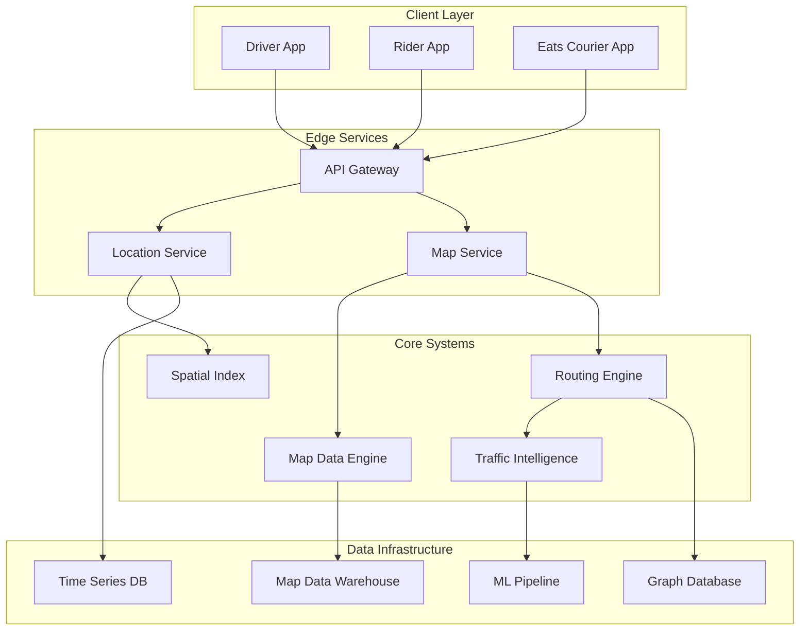

# Uber Maps Case Study

> 🚧 This case study is planned for future development.

## Overview

Uber's mapping infrastructure represents one of the most sophisticated real-time geospatial systems in production, processing billions of location updates daily to power ride-hailing, food delivery, and freight operations across 10,000+ cities globally.

Unlike general-purpose mapping systems, Uber Maps is purpose-built for mobility, optimizing for:
- **Sub-second routing decisions** for millions of concurrent trips
- **Meter-level accuracy** for pickup/dropoff points
- **Real-time traffic understanding** from fleet telemetry
- **Custom map layers** for ride-hailing specific features

## Architecture Overview



## Key Challenges

### 1. Scale and Real-Time Requirements
- **Location Updates**: 5+ million drivers sending GPS updates every 4 seconds
- **Route Calculations**: 100M+ route calculations per day
- **Latency Requirements**: <100ms for location queries, <500ms for routing
- **Data Volume**: Petabytes of historical location data

### 2. Accuracy and Precision
- **Urban Canyons**: GPS accuracy degradation in dense cities
- **Indoor Pickups**: Airports, malls, multi-level structures
- **Address Ambiguity**: Same address pointing to multiple entrances
- **Map Freshness**: Construction, road closures, new developments

### 3. Custom Map Features
- **Pickup/Dropoff Zones**: Designated safe stopping areas
- **Turn Restrictions**: Time-based and vehicle-specific
- **Private Roads**: Airport terminals, apartment complexes
- **Virtual Lanes**: HOV, bus lanes, bike lanes

### 4. Multi-Modal Requirements
- **Vehicle Types**: Cars, bikes, scooters, walking
- **Service Types**: UberX, UberPOOL, Uber Eats
- **Regional Variations**: Local regulations and road rules
- **Dynamic Routing**: Real-time re-routing based on conditions

## Technical Deep Dive

### Map Data Pipeline

```python
# Simplified map data processing pipeline
class MapDataPipeline:
    def process_osm_data(self, raw_data):
# Extract road network
        roads = self.extract_roads(raw_data)
        
# Add Uber-specific attributes
        roads = self.add_pickup_zones(roads)
        roads = self.add_turn_restrictions(roads)
        roads = self.add_speed_profiles(roads)
        
# Build spatial indices
        h3_index = self.build_h3_index(roads)
        rtree_index = self.build_rtree(roads)
        
# Generate pre-computed data
        contraction_hierarchy = self.build_ch(roads)
        
        return MapData(
            roads=roads,
            spatial_indices=[h3_index, rtree_index],
            routing_data=contraction_hierarchy
        )
```

### Real-Time Location Processing

```python
# Location update processing with accuracy enhancement
class LocationProcessor:
    def process_location_update(self, driver_id, raw_gps):
# Map matching - snap to road network
        matched_location = self.map_match(
            raw_gps,
            self.get_driver_history(driver_id)
        )
        
# Accuracy enhancement
        if raw_gps.accuracy > 50:  # meters
            matched_location = self.enhance_accuracy(
                matched_location,
                self.get_nearby_drivers(raw_gps),
                self.get_wifi_signals(raw_gps)
            )
        
# Update indices
        self.update_h3_index(driver_id, matched_location)
        self.update_supply_heat_map(matched_location)
        
# Stream to consumers
        self.publish_location_event(
            driver_id=driver_id,
            location=matched_location,
            timestamp=time.now()
        )
```

### Routing Engine Architecture

```yaml
# Routing engine configuration
routing_engine:
  algorithms:
    - name: "contraction_hierarchies"
      use_case: "long_distance"
      preprocessing: "daily"
    - name: "a_star"
      use_case: "short_distance"
      heuristic: "haversine"
    - name: "bidirectional_dijkstra"
      use_case: "alternative_routes"
  
  real_time_factors:
    - traffic_speed: 
        source: "fleet_telemetry"
        update_interval: "30s"
    - incidents:
        source: "external_providers"
        update_interval: "60s"
    - driver_preferences:
        source: "ml_model"
        update_interval: "300s"
```

## System Design Patterns

### 1. Hexagonal Spatial Indexing (H3)
- Hierarchical hexagonal grid for spatial queries
- Enables efficient nearest-neighbor searches
- Supports multi-resolution analysis

### 2. Map Matching Pipeline
- Hidden Markov Model for GPS trace matching
- Considers road network topology
- Handles GPS noise and urban canyons

### 3. Distributed Graph Processing
- Partitioned road network across regions
- Edge-cut minimization for routing
- Replicated border nodes for cross-region routes

### 4. ML-Enhanced ETA Prediction
- Features: Historical speeds, time of day, weather
- Real-time calibration from completed trips
- Segment-level predictions aggregated for routes

## Performance Optimizations

### Pre-computation Strategy
```sql
-- Pre-computed routing data
CREATE TABLE routing_shortcuts (
    from_node_id BIGINT,
    to_node_id BIGINT,
    distance_meters INT,
    duration_seconds INT,
    path_nodes ARRAY<BIGINT>,
    valid_until TIMESTAMP,
    INDEX idx_from_to (from_node_id, to_node_id)
);

-- Materialized supply views
CREATE MATERIALIZED VIEW supply_by_h3 AS
SELECT 
    h3_cell,
    service_type,
    COUNT(DISTINCT driver_id) as available_drivers,
    AVG(eta_seconds) as avg_eta
FROM driver_locations
WHERE status = 'available'
    AND updated_at > NOW() - INTERVAL '30 seconds'
GROUP BY h3_cell, service_type;
```

### Caching Architecture
- **L1 Cache**: In-process routing graph (microseconds)
- **L2 Cache**: Redis for recent routes (milliseconds)
- **L3 Cache**: Pre-computed popular routes (persistent)

## Lessons Learned

### What Worked Well
1. **H3 Spatial Indexing**: 10x improvement in spatial query performance
2. **Map Matching**: Reduced GPS noise impact on ETAs by 40%
3. **Fleet Telemetry**: Better traffic understanding than external providers
4. **Custom Map Layers**: Improved pickup experience and driver efficiency

### Challenges and Solutions
1. **Cold Start Problem**: New cities lack traffic data
   - Solution: Transfer learning from similar cities
2. **Map Data Conflicts**: OSM vs reality mismatches
   - Solution: Driver feedback loop for map corrections
3. **Cross-Region Routing**: Trips spanning map partitions
   - Solution: Hierarchical routing with border node replication

## Related Patterns
- Geohashing (Coming Soon) - Spatial indexing techniques
- Real-Time Processing (Coming Soon) - Stream processing for location updates
- ML Pipeline (Coming Soon) - ETA prediction models
- Cell-Based Architecture (Coming Soon) - Regional service isolation

## References
- [Uber Engineering: H3 Hexagonal Hierarchical Spatial Index](https://eng.uber.com/h3/)
- [Engineering Real-time Routing with Millions of Drivers](https://eng.uber.com/engineering-routing/)
- [Improving ETA Prediction Accuracy](https://eng.uber.com/eta-prediction/)

> **Note**: This case study is based on publicly available information and represents a simplified view of Uber's mapping infrastructure. Actual implementation details may vary.